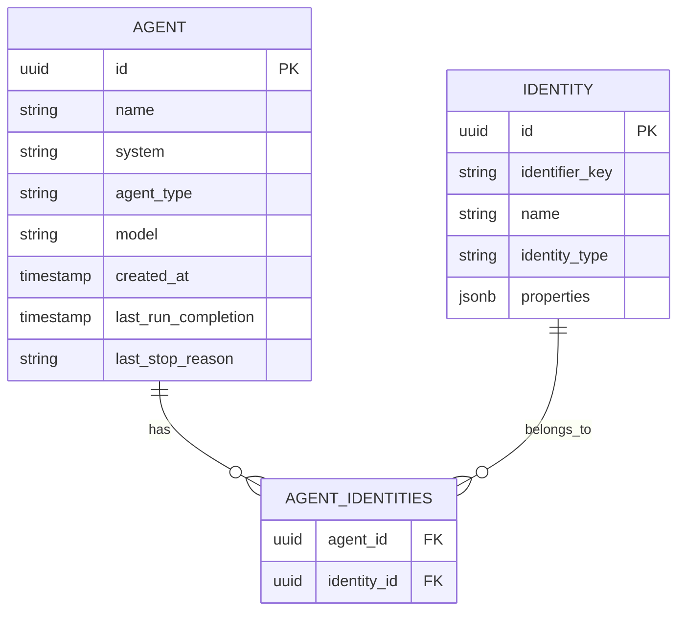
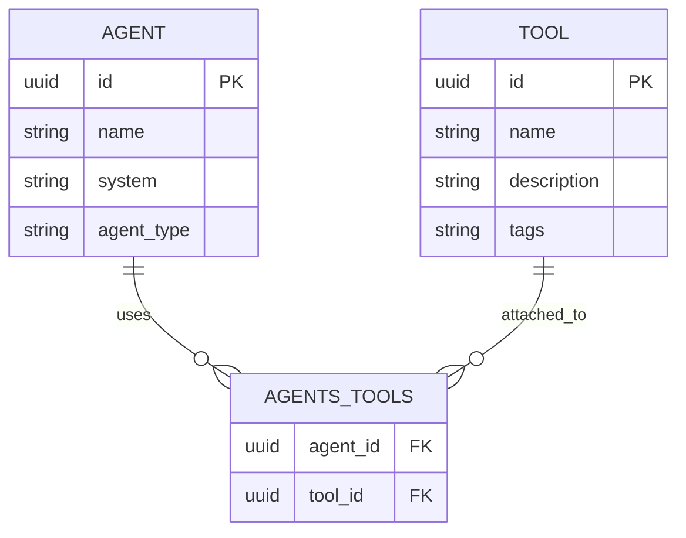
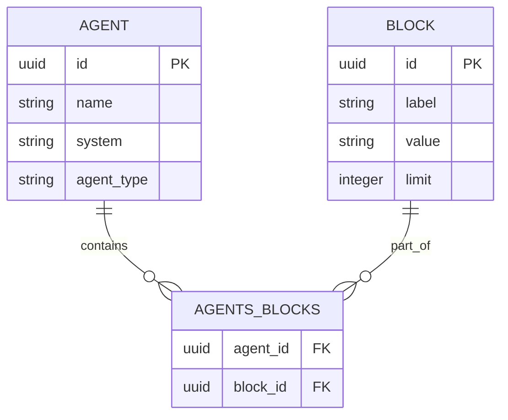

# Agents API

<cite>
**Referenced Files in This Document**
- [agents.py](file://letta/server/rest_api/routers/v1/agents.py)
- [agent.py](file://letta/schemas/agent.py)
- [dependencies.py](file://letta/server/rest_api/dependencies.py)
- [enums.py](file://letta/schemas/enums.py)
- [app.py](file://letta/server/rest_api/app.py)
- [agent.py](file://letta/orm/agent.py)
- [identity.py](file://letta/schemas/identity.py)
</cite>

## Table of Contents
1. [Introduction](#introduction)
2. [Authentication](#authentication)
3. [API Endpoints Overview](#api-endpoints-overview)
4. [Agent Management Endpoints](#agent-management-endpoints)
5. [Query Parameters and Filtering](#query-parameters-and-filtering)
6. [Pagination and Sorting](#pagination-and-sorting)
7. [Request/Response Schemas](#requestresponse-schemas)
8. [Error Codes](#error-codes)
9. [Relationships with Other Entities](#relationships-with-other-entities)
10. [Curl Examples](#curl-examples)

## Introduction

The Letta Agents API provides comprehensive REST endpoints for managing AI agents within the Letta platform. This API enables creation, retrieval, modification, and deletion of agents, along with their associated memory blocks, tools, and configurations. The API follows RESTful principles and supports advanced features like cursor-based pagination, filtering, and real-time streaming responses.

## Authentication

The API uses Bearer token authentication for all endpoints. Include the authorization header in your requests:

```http
Authorization: Bearer YOUR_ACCESS_TOKEN
```

### Header Parameters

All requests require the following headers:

| Header | Description | Required |
|--------|-------------|----------|
| `Authorization` | Bearer token for authentication | Yes |
| `User-Agent` | Client identifier | No |
| `X-Project-Id` | Project identifier for cloud deployments | No |
| `X-Stainless-Package-Version` | SDK version information | No |

**Section sources**
- [dependencies.py](file://letta/server/rest_api/dependencies.py#L19-L61)

## API Endpoints Overview

The Agents API consists of the following main categories:

### Core Agent Operations
- **GET /** - List agents with filtering and pagination
- **POST /** - Create a new agent
- **GET /{agent_id}** - Retrieve agent details
- **PATCH /{agent_id}** - Update agent configuration
- **DELETE /{agent_id}** - Delete an agent

### Agent Memory Management
- **GET /{agent_id}/core-memory/blocks** - List memory blocks
- **GET /{agent_id}/core-memory/blocks/{block_label}** - Retrieve specific block
- **PATCH /{agent_id}/core-memory/blocks/{block_label}** - Update memory block
- **PATCH /{agent_id}/core-memory/blocks/attach/{block_id}** - Attach block
- **PATCH /{agent_id}/core-memory/blocks/detach/{block_id}** - Detach block

### Agent Tools and Resources
- **GET /{agent_id}/tools** - List attached tools
- **PATCH /{agent_id}/tools/attach/{tool_id}** - Attach tool
- **PATCH /{agent_id}/tools/detach/{tool_id}** - Detach tool
- **GET /{agent_id}/files** - List attached files
- **GET /{agent_id}/messages** - List conversation messages

### Agent Communication
- **POST /{agent_id}/messages** - Send message to agent
- **POST /{agent_id}/messages/stream** - Stream message response
- **POST /{agent_id}/messages/async** - Asynchronous message processing

## Agent Management Endpoints

### List Agents

Retrieve a list of agents with optional filtering and pagination.

**Endpoint:** `GET /v1/agents`

**Query Parameters:**

| Parameter | Type | Description |
|-----------|------|-------------|
| `name` | string | Filter by agent name |
| `tags` | array | Filter by tags (supports match_all_tags) |
| `match_all_tags` | boolean | Require all tags to match (default: false) |
| `before` | string | Cursor for pagination (returns items before cursor) |
| `after` | string | Cursor for pagination (returns items after cursor) |
| `limit` | integer | Maximum number of results (default: 50) |
| `query_text` | string | Search agents by name |
| `project_id` | string | Filter by project ID |
| `template_id` | string | Filter by template ID |
| `base_template_id` | string | Filter by base template ID |
| `identity_id` | string | Filter by identity ID |
| `identifier_keys` | array | Filter by identifier keys |
| `include` | array | Specify relationships to include (tools, sources, memory, etc.) |
| `order` | string | Sort order: 'asc' or 'desc' (default: 'desc') |
| `order_by` | string | Sort field: 'created_at' or 'last_run_completion' (default: 'created_at') |
| `last_stop_reason` | string | Filter by last stop reason |

**Example Request:**
```bash
curl -X GET "https://api.letta.com/v1/agents?limit=10&order=desc&order_by=created_at" \
  -H "Authorization: Bearer YOUR_TOKEN" \
  -H "Content-Type: application/json"
```

**Response Schema:**
```json
[
  {
    "id": "agent-123e4567-e89b-42d3-8456-426614174000",
    "name": "Customer Support Bot",
    "system": "You are a helpful customer support agent...",
    "agent_type": "letta_v1_agent",
    "model": "openai/gpt-4",
    "created_at": "2024-01-15T10:30:00Z",
    "last_run_completion": "2024-01-15T14:45:30Z",
    "last_stop_reason": "completed",
    "tags": ["support", "customer"],
    "memory": {
      "blocks": [...],
      "agent_type": "letta_v1_agent"
    },
    "tools": [...],
    "sources": [...]
  }
]
```

### Create Agent

Create a new agent with custom configuration and memory blocks.

**Endpoint:** `POST /v1/agents`

**Request Body Schema:**
```json
{
  "name": "My Custom Agent",
  "system": "You are a helpful assistant.",
  "agent_type": "letta_v1_agent",
  "model": "openai/gpt-4",
  "memory_blocks": [
    {
      "label": "core_self",
      "value": "I am a helpful AI assistant.",
      "limit": 200
    }
  ],
  "tools": ["conversation_search"],
  "tags": ["custom", "assistant"],
  "initial_message_sequence": [
    {
      "role": "user",
      "content": "Hello, how can you help me?"
    }
  ]
}
```

**Response:**
```json
{
  "id": "agent-123e4567-e89b-42d3-8456-426614174000",
  "name": "My Custom Agent",
  "system": "You are a helpful assistant.",
  "agent_type": "letta_v1_agent",
  "model": "openai/gpt-4",
  "created_at": "2024-01-15T10:30:00Z",
  "memory": {
    "blocks": [
      {
        "id": "block-123e4567-e89b-42d3-8456-426614174000",
        "label": "core_self",
        "value": "I am a helpful AI assistant.",
        "limit": 200
      }
    ],
    "agent_type": "letta_v1_agent"
  }
}
```

### Retrieve Agent

Get detailed information about a specific agent.

**Endpoint:** `GET /v1/agents/{agent_id}`

**Query Parameters:**

| Parameter | Type | Description |
|-----------|------|-------------|
| `include` | array | Specify relationships to include (tools, sources, memory, identities) |

**Example:**
```bash
curl -X GET "https://api.letta.com/v1/agents/agent-123e4567-e89b-42d3-8456-426614174000?include=tools&include=memory" \
  -H "Authorization: Bearer YOUR_TOKEN" \
  -H "Content-Type: application/json"
```

### Update Agent

Modify an existing agent's configuration.

**Endpoint:** `PATCH /v1/agents/{agent_id}`

**Request Body:**
```json
{
  "name": "Updated Agent Name",
  "system": "Updated system prompt...",
  "tags": ["updated", "modified"],
  "model": "openai/gpt-4-turbo"
}
```

### Delete Agent

Remove an agent from the system.

**Endpoint:** `DELETE /v1/agents/{agent_id}`

**Response:**
```json
{
  "message": "Agent id=agent-123e4567-e89b-42d3-8456-426614174000 successfully deleted"
}
```

**Section sources**
- [agents.py](file://letta/server/rest_api/routers/v1/agents.py#L77-L852)

## Query Parameters and Filtering

### Basic Filtering

The API supports various filtering options to narrow down agent results:

#### Name Filtering
```bash
# Filter by exact name
curl "https://api.letta.com/v1/agents?name=SupportBot"

# Search by partial name
curl "https://api.letta.com/v1/agents?query_text=support"
```

#### Tag Filtering
```bash
# Filter by single tag
curl "https://api.letta.com/v1/agents?tags=support"

# Match all tags (AND logic)
curl "https://api.letta.com/v1/agents?tags=support&tags=customer&match_all_tags=true"

# Match any tag (OR logic)
curl "https://api.letta.com/v1/agents?tags=support&tags=help"
```

#### Template and Project Filtering
```bash
# Filter by template
curl "https://api.letta.com/v1/agents?template_id=template-123"

# Filter by project
curl "https://api.letta.com/v1/agents?project_id=project-456"
```

#### Identifier Keys
```bash
# Filter by custom identifier keys
curl "https://api.letta.com/v1/agents?identifier_keys=customer-123&identifier_keys=account-456"
```

#### Last Stop Reason
```bash
# Filter by completion status
curl "https://api.letta.com/v1/agents?last_stop_reason=completed"

# Filter by error status
curl "https://api.letta.com/v1/agents?last_stop_reason=error"
```

### Advanced Filtering

#### Identity-Based Filtering
```bash
# Filter by identity ID
curl "https://api.letta.com/v1/agents?identity_id=identity-789"
```

#### Date Range Filtering
```bash
# Filter by creation date range
curl "https://api.letta.com/v1/agents?start_date=2024-01-01&end_date=2024-01-31"
```

**Section sources**
- [agents.py](file://letta/server/rest_api/routers/v1/agents.py#L78-L165)

## Pagination and Sorting

### Cursor-Based Pagination

The API uses cursor-based pagination for efficient large dataset navigation:

#### Basic Pagination
```bash
# Get first page
curl "https://api.letta.com/v1/agents?limit=20"

# Get next page using 'after' cursor
curl "https://api.letta.com/v1/agents?limit=20&after=agent-123e4567-e89b-42d3-8456-426614174000"

# Get previous page using 'before' cursor
curl "https://api.letta.com/v1/agents?limit=20&before=agent-987e6543-e21c-42d3-9456-426614174000"
```

#### Combined Pagination
```bash
# Get specific range (between two cursors)
curl "https://api.letta.com/v1/agents?limit=10&after=agent-start&before=agent-end"
```

### Sorting Options

#### Sort Order
```bash
# Newest first (default)
curl "https://api.letta.com/v1/agents?order=desc"

# Oldest first
curl "https://api.letta.com/v1/agents?order=asc"
```

#### Sort Fields
```bash
# Sort by creation time (default)
curl "https://api.letta.com/v1/agents?order_by=created_at"

# Sort by last completion time
curl "https://api.letta.com/v1/agents?order_by=last_run_completion"
```

### Relationship Inclusion

Optimize performance by specifying which relationships to include:

```bash
# Include only tools and memory
curl "https://api.letta.com/v1/agents?include=tools&include=memory"

# Include all relationships (default behavior)
curl "https://api.letta.com/v1/agents?include="
```

**Section sources**
- [agents.py](file://letta/server/rest_api/routers/v1/agents.py#L78-L165)

## Request/Response Schemas

### AgentState Schema

The primary response schema for agent data:

```json
{
  "id": "string (UUID)",
  "name": "string",
  "system": "string",
  "agent_type": "string (AgentType enum)",
  "model": "string (provider/model-name format)",
  "created_at": "string (ISO 8601)",
  "last_run_completion": "string (ISO 8601, optional)",
  "last_run_duration_ms": "integer (optional)",
  "last_stop_reason": "string (StopReasonType enum, optional)",
  "tags": ["string"],
  "memory": {
    "blocks": [
      {
        "id": "string (UUID)",
        "label": "string",
        "value": "string",
        "limit": "integer"
      }
    ],
    "agent_type": "string"
  },
  "tools": [
    {
      "id": "string (UUID)",
      "name": "string",
      "description": "string",
      "tags": ["string"]
    }
  ],
  "sources": [
    {
      "id": "string (UUID)",
      "name": "string",
      "description": "string"
    }
  ],
  "identities": [
    {
      "id": "string (UUID)",
      "name": "string",
      "identifier_key": "string"
    }
  ]
}
```

### CreateAgent Schema

For agent creation:

```json
{
  "name": "string (optional, auto-generated if not provided)",
  "system": "string (optional)",
  "agent_type": "string (default: letta_v1_agent)",
  "model": "string (provider/model-name format)",
  "memory_blocks": [
    {
      "label": "string",
      "value": "string",
      "limit": "integer"
    }
  ],
  "tools": ["string (tool names)"],
  "tool_ids": ["string (tool UUIDs)"],
  "tags": ["string"],
  "initial_message_sequence": [
    {
      "role": "string (user|assistant|system)",
      "content": "string"
    }
  ],
  "include_base_tools": "boolean (default: true)",
  "include_multi_agent_tools": "boolean (default: false)"
}
```

### UpdateAgent Schema

For agent updates:

```json
{
  "name": "string (optional)",
  "system": "string (optional)",
  "tags": ["string (optional)"],
  "model": "string (provider/model-name format, optional)",
  "tool_ids": ["string (tool UUIDs, optional)"],
  "folder_ids": ["string (folder UUIDs, optional)"],
  "secrets": {
    "key": "value"
  }
}
```

### Memory Block Schema

```json
{
  "label": "string",
  "value": "string",
  "limit": "integer",
  "id": "string (UUID, optional)"
}
```

**Section sources**
- [agent.py](file://letta/schemas/agent.py#L60-L493)

## Error Codes

The API returns standard HTTP status codes with detailed error information:

### 4xx Client Errors

#### 400 Bad Request
```json
{
  "detail": "Invalid request parameters or malformed JSON"
}
```

**Common causes:**
- Missing required fields
- Invalid UUID format
- Malformed JSON payload

#### 401 Unauthorized
```json
{
  "detail": "Authentication credentials are invalid or missing"
}
```

#### 404 Not Found
```json
{
  "detail": "Agent not found"
}
```

#### 408 Request Timeout
```json
{
  "detail": "Request timed out"
}
```

#### 409 Conflict
```json
{
  "detail": "Resource conflict or constraint violation"
}
```

**Common causes:**
- Duplicate agent names
- Foreign key violations

#### 410 Gone
```json
{
  "detail": "Resource has been permanently removed"
}
```

#### 415 Unsupported Media Type
```json
{
  "detail": "Unsupported file format for upload"
}
```

#### 422 Unprocessable Entity
```json
{
  "detail": "Validation error in request body",
  "examples": ["agent-123e4567-e89b-42d3-8456-426614174000"]
}
```

### 5xx Server Errors

#### 500 Internal Server Error
```json
{
  "detail": "An unknown error occurred"
}
```

#### 503 Service Unavailable
```json
{
  "detail": "The database is temporarily unavailable. Please try again later."
}
```

**Section sources**
- [app.py](file://letta/server/rest_api/app.py#L284-L545)

## Relationships with Other Entities

### Agent-Identity Relationship

Agents can be associated with identities for user-specific contexts:



**Diagram sources**
- [identity.py](file://letta/schemas/identity.py#L43-L72)
- [agent.py](file://letta/orm/agent.py#L56-L282)

### Agent-Tool Relationship

Agents can have multiple tools attached:



### Agent-Memory Blocks

Agents maintain memory through blocks:



**Section sources**
- [agent.py](file://letta/orm/agent.py#L56-L282)

## Curl Examples

### Creating an Agent with Custom Memory

```bash
curl -X POST "https://api.letta.com/v1/agents" \
  -H "Authorization: Bearer YOUR_TOKEN" \
  -H "Content-Type: application/json" \
  -d '{
    "name": "Customer Support Agent",
    "system": "You are a helpful customer support agent. Focus on resolving issues quickly and professionally.",
    "agent_type": "letta_v1_agent",
    "model": "openai/gpt-4",
    "memory_blocks": [
      {
        "label": "core_self",
        "value": "I am a professional customer support agent with expertise in technical issues.",
        "limit": 200
      },
      {
        "label": "core_memory",
        "value": "I help customers resolve technical problems efficiently.",
        "limit": 200
      }
    ],
    "tools": ["conversation_search", "web_search"],
    "tags": ["support", "customer-service"],
    "include_base_tools": true,
    "include_multi_agent_tools": false
  }'
```

### Listing Agents with Tag Filtering

```bash
# List all support agents
curl -X GET "https://api.letta.com/v1/agents?tags=support&limit=10" \
  -H "Authorization: Bearer YOUR_TOKEN"

# List agents with multiple tags (AND logic)
curl -X GET "https://api.letta.com/v1/agents?tags=support&tags=active&match_all_tags=true&limit=5" \
  -H "Authorization: Bearer YOUR_TOKEN"
```

### Retrieving Agent by Identifier Key

```bash
# Find agent by custom identifier
curl -X GET "https://api.letta.com/v1/agents?identifier_keys=customer-12345" \
  -H "Authorization: Bearer YOUR_TOKEN"
```

### Managing Agent Memory Blocks

```bash
# List all memory blocks for an agent
curl -X GET "https://api.letta.com/v1/agents/agent-123e4567-e89b-42d3-8456-426614174000/core-memory/blocks" \
  -H "Authorization: Bearer YOUR_TOKEN"

# Update a specific memory block
curl -X PATCH "https://api.letta.com/v1/agents/agent-123e4567-e89b-42d3-8456-426614174000/core-memory/blocks/core_self" \
  -H "Authorization: Bearer YOUR_TOKEN" \
  -H "Content-Type: application/json" \
  -d '{
    "value": "I am an enhanced customer support agent with improved problem-solving skills."
  }'
```

### Sending Messages to Agents

```bash
# Send a message to an agent
curl -X POST "https://api.letta.com/v1/agents/agent-123e4567-e89b-42d3-8456-426614174000/messages" \
  -H "Authorization: Bearer YOUR_TOKEN" \
  -H "Content-Type: application/json" \
  -d '{
    "messages": [
      {
        "role": "user",
        "content": "How do I reset my password?"
      }
    ],
    "streaming": false,
    "max_steps": 1
  }'
```

### Streaming Agent Responses

```bash
# Stream agent response (requires SDK v1.0+)
curl -X POST "https://api.letta.com/v1/agents/agent-123e4567-e89b-42d3-8456-426614174000/messages/stream" \
  -H "Authorization: Bearer YOUR_TOKEN" \
  -H "Content-Type: application/json" \
  -d '{
    "messages": [
      {
        "role": "user",
        "content": "Explain quantum computing in simple terms"
      }
    ],
    "streaming": true,
    "stream_tokens": true,
    "include_pings": true
  }'
```

### Deleting an Agent

```bash
# Delete an agent
curl -X DELETE "https://api.letta.com/v1/agents/agent-123e4567-e89b-42d3-8456-426614174000" \
  -H "Authorization: Bearer YOUR_TOKEN"
```

These examples demonstrate the comprehensive capabilities of the Letta Agents API, from basic CRUD operations to advanced features like streaming responses and cursor-based pagination.