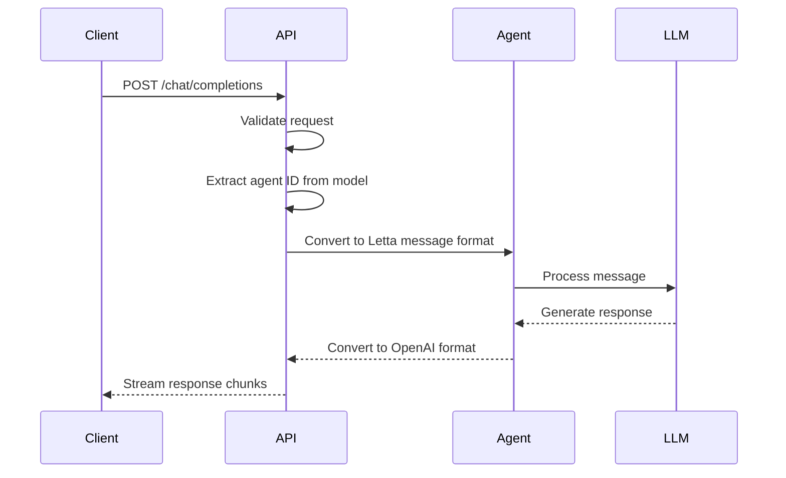
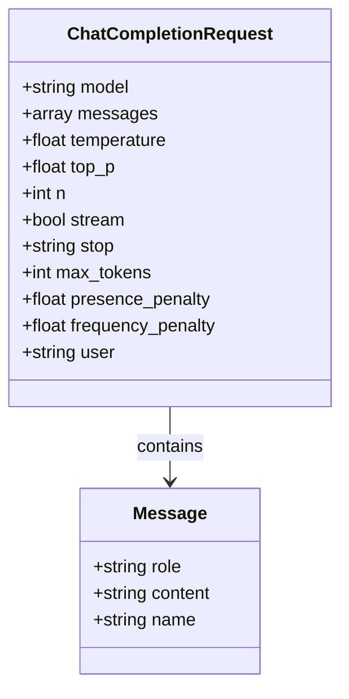
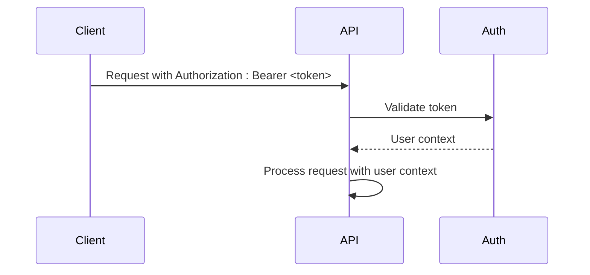
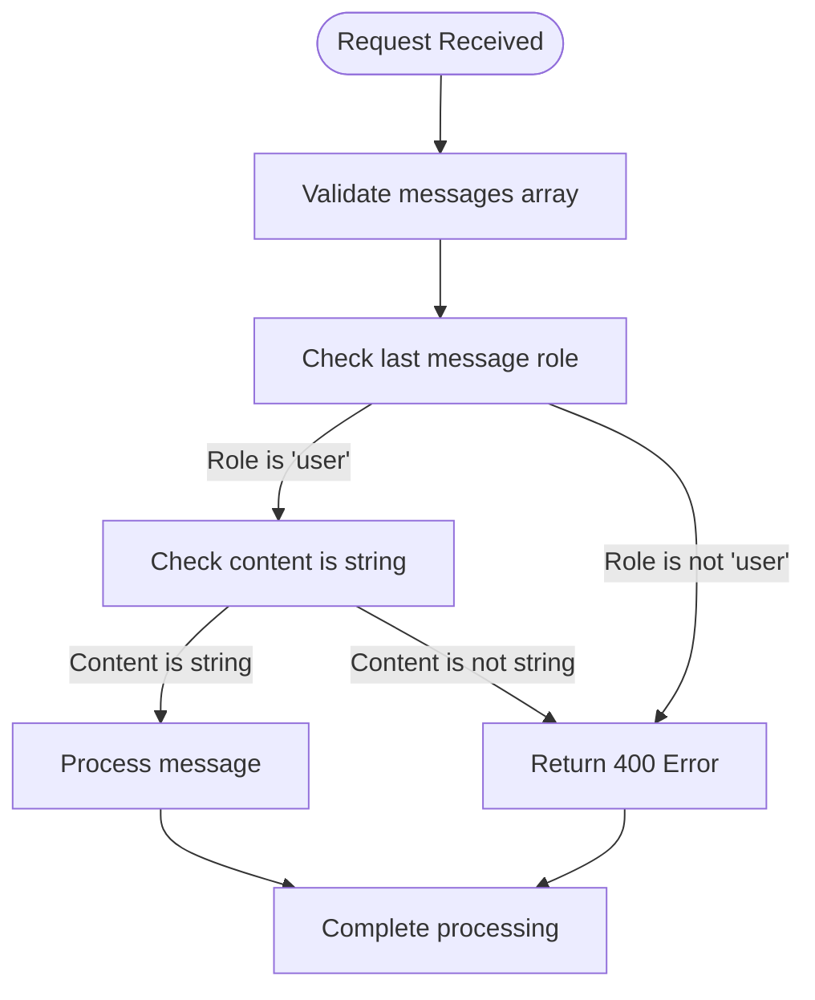
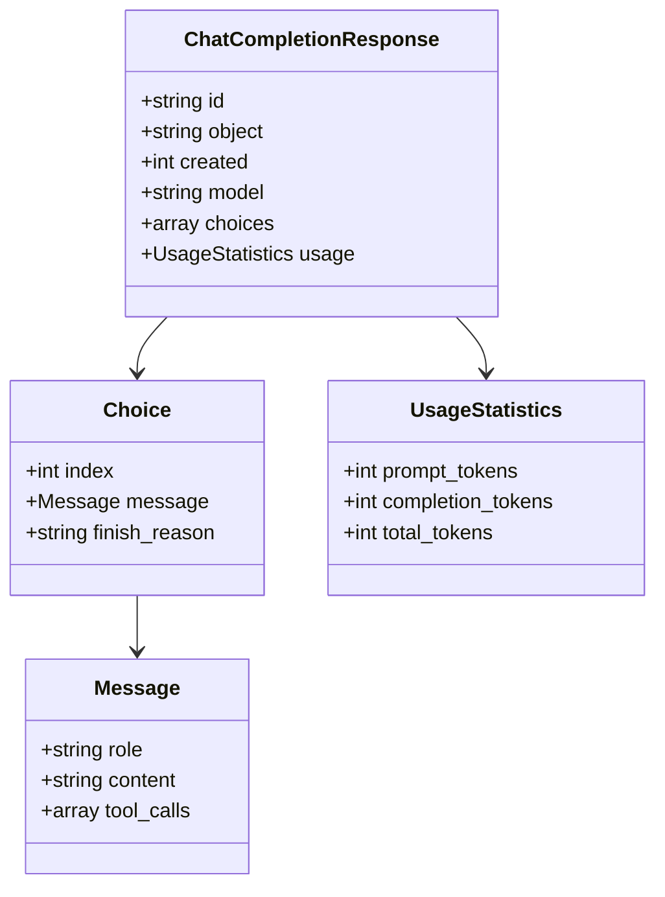
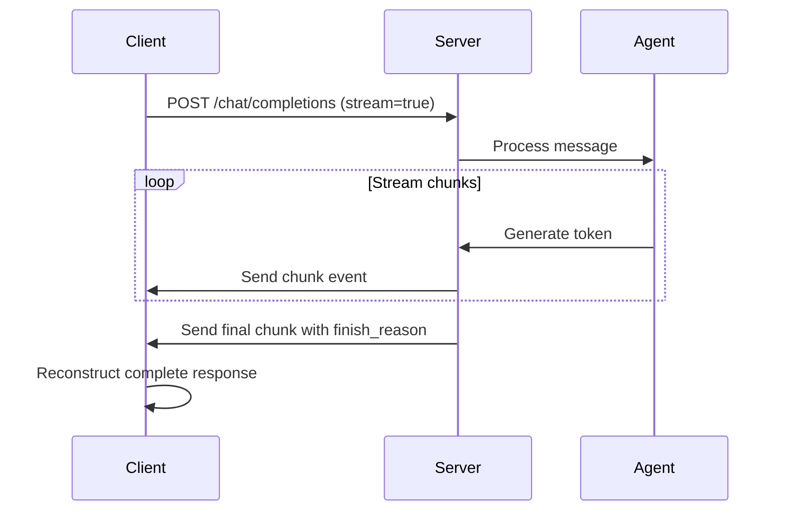
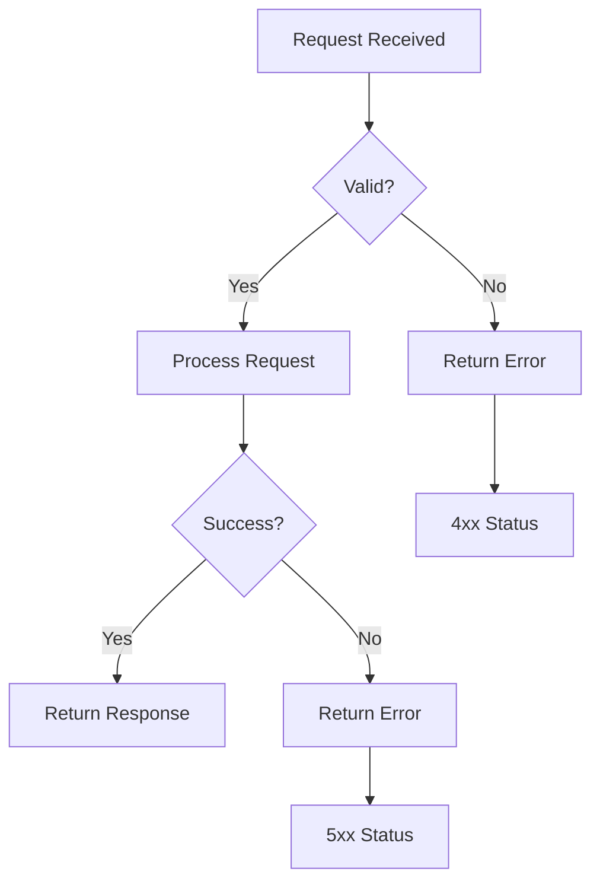
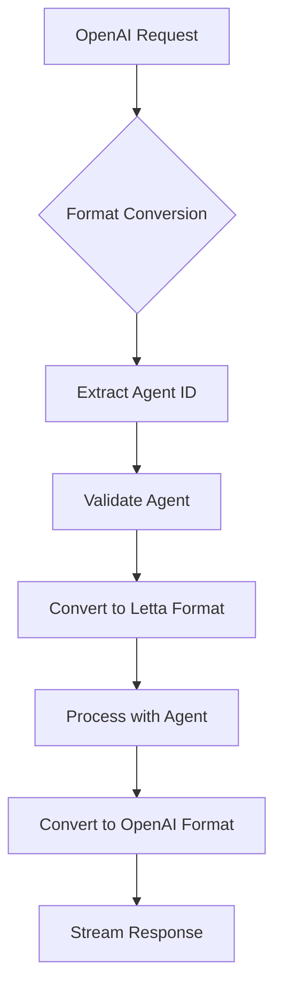

# Chat Completions API

<cite>
**Referenced Files in This Document**   
- [chat_completions.py](file://letta/server/rest_api/routers/v1/chat_completions.py)
- [chat_completion_request.py](file://letta/schemas/openai/chat_completion_request.py)
- [chat_completion_response.py](file://letta/schemas/openai/chat_completion_response.py)
- [chat_completions_interface.py](file://letta/server/rest_api/chat_completions_interface.py)
- [utils.py](file://letta/server/rest_api/utils.py)
- [streaming_service.py](file://letta/services/streaming_service.py)
</cite>

## Table of Contents
1. [Introduction](#introduction)
2. [Endpoint Overview](#endpoint-overview)
3. [Request Format](#request-format)
4. [Authentication](#authentication)
5. [Message Requirements](#message-requirements)
6. [Response Format](#response-format)
7. [Streaming Responses](#streaming-responses)
8. [Error Handling](#error-handling)
9. [Agent Integration](#agent-integration)
10. [Examples](#examples)

## Introduction

The Chat Completions API provides OpenAI-compatible endpoints for interacting with Letta agents. This API allows users to send messages to agents using the familiar OpenAI chat completions format, while internally converting these requests to Letta's native message format. The endpoint supports streaming responses and integrates with Letta's agent system to maintain conversation state and context.

**Section sources**
- [chat_completions.py](file://letta/server/rest_api/routers/v1/chat_completions.py#L20-L147)

## Endpoint Overview

The chat completions endpoint provides a POST method for sending user messages to agents. The endpoint is designed to be fully compatible with OpenAI's API format, allowing seamless integration with existing OpenAI clients and tools.

The endpoint processes incoming requests by:
1. Validating the request format and parameters
2. Extracting the target agent from the model field
3. Converting OpenAI message format to Letta's internal message format
4. Processing the message through the agent system
5. Converting the response back to OpenAI format

Only streaming requests are currently supported (stream=true). Non-streaming requests will result in an error.



**Diagram sources**
- [chat_completions.py](file://letta/server/rest_api/routers/v1/chat_completions.py#L118-L147)

## Request Format

The request body follows OpenAI's chat completions format with specific requirements for Letta integration.

### Required Parameters

| Parameter | Type | Description |
|---------|------|-------------|
| model | string | Agent ID in format 'agent-...' |
| messages | array | Array of message objects with role and content |

### Optional Parameters

| Parameter | Type | Default | Description |
|---------|------|---------|-------------|
| temperature | number | 1.0 | Sampling temperature |
| top_p | number | 1.0 | Nucleus sampling parameter |
| n | integer | 1 | Number of completions to generate |
| stream | boolean | false | Whether to stream back partial progress |
| stop | string or array | null | Sequences where API will stop generating |
| max_tokens | integer | null | Maximum number of tokens to generate |
| presence_penalty | number | 0 | Presence penalty |
| frequency_penalty | number | 0 | Frequency penalty |
| user | string | null | Unique identifier representing the end-user |



**Section sources**
- [chat_completion_request.py](file://letta/schemas/openai/chat_completion_request.py#L117-L154)
- [chat_completions.py](file://letta/server/rest_api/routers/v1/chat_completions.py#L23-L39)

## Authentication

Authentication is handled through Bearer tokens in the Authorization header. The API validates the token and associates the request with the appropriate user context.

The authentication process:
1. Extracts the Bearer token from the Authorization header
2. Validates the token against the system's authentication mechanism
3. Associates the request with the authenticated user
4. Uses the user context for agent access control and message attribution



**Section sources**
- [app.py](file://letta/server/rest_api/app.py#L122-L130)
- [check_password.py](file://letta/server/rest_api/middleware/check_password.py#L1-L24)

## Message Requirements

The API has specific requirements for message formatting to ensure proper processing.

### Message Structure

Messages must be an array of objects, each containing:
- role: The role of the message participant
- content: The message content as a string

### Last Message Requirement

The last message in the array must have:
- role: "user"
- content: String value

The system only processes the last user message, as previous conversation history is maintained internally by the agent. Multiple messages in the request will trigger a warning, as only the last user message will be processed.



**Section sources**
- [utils.py](file://letta/server/rest_api/utils.py#L675-L695)
- [chat_completions.py](file://letta/server/rest_api/routers/v1/chat_completions.py#L70-L97)

## Response Format

The response format follows OpenAI's chat completions schema with additional Letta-specific extensions.

### Non-Streaming Response

For non-streaming requests (not currently supported), the response would include:

| Field | Type | Description |
|------|------|-------------|
| id | string | Unique identifier for the completion |
| object | string | "chat.completion" |
| created | integer | Timestamp of creation |
| model | string | Model used for completion |
| choices | array | Array of completion choices |
| usage | object | Token usage statistics |

### Streaming Response

For streaming requests, the response is a series of Server-Sent Events with ChatCompletionChunk objects:

| Field | Type | Description |
|------|------|-------------|
| id | string | Chunk identifier |
| object | string | "chat.completion.chunk" |
| created | integer | Timestamp |
| model | string | Model used |
| choices | array | Array with delta updates |

### Usage Statistics

The usage object contains:

| Field | Type | Description |
|------|------|-------------|
| prompt_tokens | integer | Number of tokens in the prompt |
| completion_tokens | integer | Number of tokens in the completion |
| total_tokens | integer | Total tokens used |



**Section sources**
- [chat_completion_response.py](file://letta/schemas/openai/chat_completion_response.py#L140-L220)
- [chat_completions.py](file://letta/server/rest_api/routers/v1/chat_completions.py#L120-L128)

## Streaming Responses

The API supports streaming responses via Server-Sent Events (SSE) when stream=true.

### Streaming Process

1. Client sends request with stream=true
2. Server establishes SSE connection
3. Server processes the message through the agent
4. Server streams response chunks as they become available
5. Connection closes when completion is finished

### Streaming Options

Additional options for streaming:
- stream_tokens: Stream individual tokens instead of complete steps
- include_pings: Include keepalive pings to prevent timeouts
- background: Process request in background

### Event Format

Each event in the stream contains a JSON payload with:
- id: Unique identifier for the chunk
- object: "chat.completion.chunk"
- created: Timestamp
- model: Model used
- choices: Array with delta updates containing partial content



**Section sources**
- [chat_completions_interface.py](file://letta/server/rest_api/chat_completions_interface.py#L21-L279)
- [streaming_service.py](file://letta/services/streaming_service.py#L53-L200)

## Error Handling

The API returns standard HTTP status codes and descriptive error messages.

### Common Error Codes

| Status Code | Error Type | Description |
|-----------|-----------|-------------|
| 400 | Bad Request | Invalid request format or parameters |
| 401 | Unauthorized | Authentication failed |
| 422 | Unprocessable Entity | Validation error |
| 500 | Internal Server Error | Server processing error |

### Specific Error Conditions

- **400 Bad Request**: Missing messages array or invalid content type
- **400 Bad Request**: Last message role is not 'user'
- **400 Bad Request**: Last message content is not a string
- **422 Unprocessable Entity**: Streaming options set without streaming enabled
- **500 Internal Server Error**: Agent processing failure

Error responses include a JSON body with:
- detail: Human-readable error description
- message: Technical error message (in some cases)



**Section sources**
- [errors.py](file://letta/errors.py#L149-L193)
- [chat_completions.py](file://letta/server/rest_api/routers/v1/chat_completions.py#L1390-L1411)

## Agent Integration

The API integrates with Letta's agent system by converting between OpenAI format and Letta's internal message format.

### Format Conversion

The conversion process:
1. Extract agent ID from the model field
2. Validate agent exists and is accessible
3. Convert OpenAI messages to Letta MessageCreate format
4. Process through agent system
5. Convert Letta response to OpenAI format

### Agent Selection

The model field in the request must contain an agent ID in the format 'agent-...'. This ID is used to:
- Locate the target agent
- Validate access permissions
- Load the agent's configuration
- Process the message in the agent's context

### Message Processing

The system processes only the last user message, as previous conversation history is maintained in the agent's memory. This ensures:
- Consistent conversation state
- Proper context retention
- Efficient processing



**Section sources**
- [chat_completions.py](file://letta/server/rest_api/routers/v1/chat_completions.py#L62-L97)
- [utils.py](file://letta/server/rest_api/utils.py#L675-L695)

## Examples

### Basic Message Request

```bash
curl https://api.letta.com/v1/chat/completions \
  -H "Authorization: Bearer YOUR_API_KEY" \
  -H "Content-Type: application/json" \
  -d '{
    "model": "agent-12345",
    "messages": [
      {
        "role": "user",
        "content": "Hello, how are you?"
      }
    ],
    "stream": true
  }'
```

### Request with Parameters

```bash
curl https://api.letta.com/v1/chat/completions \
  -H "Authorization: Bearer YOUR_API_KEY" \
  -H "Content-Type: application/json" \
  -d '{
    "model": "agent-12345",
    "messages": [
      {
        "role": "user",
        "content": "Write a poem about AI"
      }
    ],
    "temperature": 0.7,
    "max_tokens": 100,
    "stream": true
  }'
```

### Handling Streaming Response

```javascript
// Example of handling streaming response
const response = await fetch('https://api.letta.com/v1/chat/completions', {
  method: 'POST',
  headers: {
    'Authorization': 'Bearer YOUR_API_KEY',
    'Content-Type': 'application/json'
  },
  body: JSON.stringify({
    model: 'agent-12345',
    messages: [{ role: 'user', content: 'Hello' }],
    stream: true
  })
});

const reader = response.body.getReader();
let result = '';

while(true) {
  const { done, value } = await reader.read();
  if (done) break;
  
  const chunk = new TextDecoder().decode(value);
  const lines = chunk.split('\n').filter(line => line.trim() !== '');
  
  for (const line of lines) {
    if (line.startsWith('data:')) {
      const data = line.substring(5);
      if (data === '[DONE]') continue;
      
      try {
        const json = JSON.parse(data);
        if (json.choices && json.choices[0].delta.content) {
          result += json.choices[0].delta.content;
          console.log('Partial response:', result);
        }
      } catch (e) {
        console.error('Error parsing JSON:', e);
      }
    }
  }
}

console.log('Final response:', result);
```

### Error Response Example

```json
{
  "detail": "'messages[-1].role' must be a 'user'"
}
```

**Section sources**
- [chat_completions.py](file://letta/server/rest_api/routers/v1/chat_completions.py#L133-L147)
- [utils.py](file://letta/server/rest_api/utils.py#L675-L695)