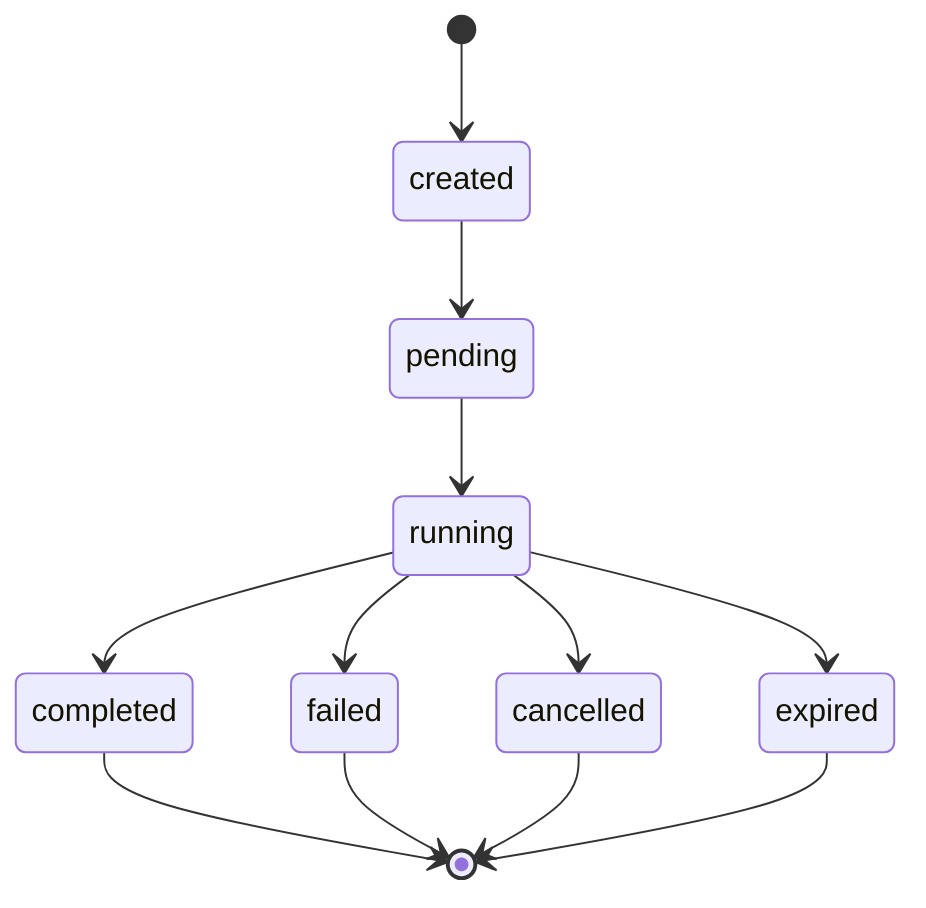
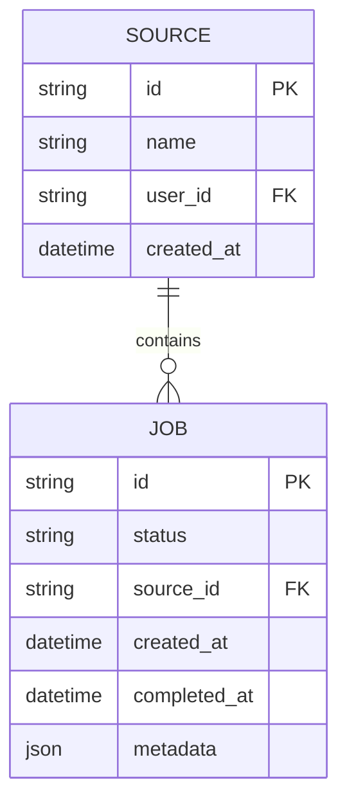
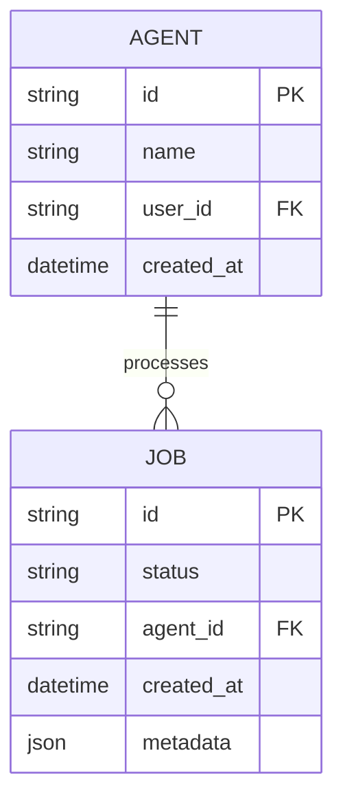

# Jobs API

<cite>
**Referenced Files in This Document**
- [jobs.py](file://letta/server/rest_api/routers/v1/jobs.py)
- [job.py](file://letta/schemas/job.py)
- [job_manager.py](file://letta/services/job_manager.py)
- [enums.py](file://letta/schemas/enums.py)
- [dependencies.py](file://letta/server/rest_api/dependencies.py)
- [job.py](file://letta/orm/job.py)
- [test_job_manager.py](file://tests/managers/test_job_manager.py)
- [test_job_manager.py](file://tests/managers/test_job_manager.py)
</cite>

## Table of Contents
1. [Introduction](#introduction)
2. [Authentication](#authentication)
3. [API Endpoints](#api-endpoints)
4. [Job Status Management](#job-status-management)
5. [Response Schema](#response-schema)
6. [Error Codes](#error-codes)
7. [Pagination and Filtering](#pagination-and-filtering)
8. [Relationships](#relationships)
9. [Examples](#examples)
10. [Best Practices](#best-practices)

## Introduction

The Jobs API provides comprehensive REST endpoints for managing asynchronous jobs in the Letta system. Jobs represent background operations such as data loading, processing, and batch operations that run independently of immediate user interaction. The API supports listing, monitoring, and controlling job lifecycle through various endpoints.

## Authentication

All Jobs API endpoints require authentication using Bearer tokens. The authentication mechanism follows standard HTTP Authorization header patterns.

### Authentication Header Format

```http
Authorization: Bearer YOUR_ACCESS_TOKEN
```

### Required Headers

The API expects several custom headers for proper request routing and identification:

| Header | Description | Required |
|--------|-------------|----------|
| `Authorization` | Bearer token for authentication | Yes |
| `user_id` | Actor/User ID for request attribution | No |
| `User-Agent` | Client application identifier | No |
| `X-Project-Id` | Project/organization identifier | No |
| `X-Stainless-Package-Version` | SDK version information | No |

**Section sources**
- [dependencies.py](file://letta/server/rest_api/dependencies.py#L19-L61)

## API Endpoints

### List All Jobs

Retrieve a list of all jobs with optional filtering and pagination.

**Endpoint:** `GET /api/jobs`

**Query Parameters:**

| Parameter | Type | Description | Default |
|-----------|------|-------------|---------|
| `source_id` | string | Deprecated: Use `folder_id` instead. Filter by source ID | null |
| `before` | string | Job ID cursor for pagination (returns jobs before this ID) | null |
| `after` | string | Job ID cursor for pagination (returns jobs after this ID) | null |
| `limit` | integer | Maximum number of jobs to return | 100 |
| `order` | string | Sort order: 'asc' for oldest first, 'desc' for newest first | 'desc' |
| `order_by` | string | Field to sort by (currently only 'created_at') | 'created_at' |
| `active` | boolean | Filter for active jobs only (created or running) | false |
| `ascending` | boolean | Deprecated: Use `order` parameter instead | true |

**Response:** Array of Job objects

### List Active Jobs

Retrieve all currently active jobs (status: created or running).

**Endpoint:** `GET /api/jobs/active`

**Deprecated:** Use `/api/jobs?active=true` instead.

**Query Parameters:**

| Parameter | Type | Description | Default |
|-----------|------|-------------|---------|
| `source_id` | string | Deprecated: Use `folder_id` instead | null |
| `before` | string | Cursor for pagination | null |
| `after` | string | Cursor for pagination | null |
| `limit` | integer | Limit for pagination | 50 |
| `ascending` | boolean | Sort order | true |

**Response:** Array of Job objects with active status

### Retrieve Job Details

Get detailed information about a specific job.

**Endpoint:** `GET /api/jobs/{job_id}`

**Path Parameters:**

| Parameter | Type | Description |
|-----------|------|-------------|
| `job_id` | string | Unique identifier of the job |

**Response:** Single Job object

### Cancel Job

Cancel a running job if possible.

**Endpoint:** `PATCH /api/jobs/{job_id}/cancel`

**Path Parameters:**

| Parameter | Type | Description |
|-----------|------|-------------|
| `job_id` | string | Unique identifier of the job |

**Response:** Updated Job object with cancelled status

### Delete Job

Permanently delete a job from the system.

**Endpoint:** `DELETE /api/jobs/{job_id}`

**Path Parameters:**

| Parameter | Type | Description |
|-----------|------|-------------|
| `job_id` | string | Unique identifier of the job |

**Response:** Deleted Job object

**Section sources**
- [jobs.py](file://letta/server/rest_api/routers/v1/jobs.py#L16-L142)

## Job Status Management

Jobs progress through a defined lifecycle with specific status transitions:



**Diagram sources**
- [enums.py](file://letta/schemas/enums.py#L115-L131)

### Status Definitions

| Status | Description | Terminal? |
|--------|-------------|-----------|
| `created` | Job has been created but not yet started | No |
| `pending` | Job is queued and waiting for resources | No |
| `running` | Job is actively processing | No |
| `completed` | Job finished successfully | Yes |
| `failed` | Job encountered an error and terminated | Yes |
| `cancelled` | Job was manually cancelled | Yes |
| `expired` | Job exceeded timeout limits | Yes |

### Status Transitions

The system enforces strict status transition rules:

- From `created`: Can only move to `pending`
- From `pending`: Can only move to `running`
- From `running`: Can move to any terminal state (`completed`, `failed`, `cancelled`, `expired`)
- Terminal states cannot transition to any other state

**Section sources**
- [job_manager.py](file://letta/services/job_manager.py#L85-L96)

## Response Schema

### Job Object Structure

```json
{
  "id": "job-12345",
  "status": "running",
  "created_at": "2024-01-15T10:30:00Z",
  "completed_at": "2024-01-15T10:45:30Z",
  "metadata": {
    "source_id": "source-67890",
    "type": "data_processing",
    "chunk_count": 150,
    "progress": 0.75
  },
  "job_type": "job",
  "background": true,
  "agent_id": "agent-abc123",
  "callback_url": "https://webhook.example.com/jobs",
  "callback_sent_at": "2024-01-15T10:45:30Z",
  "callback_status_code": 200,
  "callback_error": null,
  "ttft_ns": 1500000000,
  "total_duration_ns": 9000000000
}
```

### Field Descriptions

| Field | Type | Description |
|-------|------|-------------|
| `id` | string | Unique job identifier with 'job-' prefix |
| `status` | string | Current job status from JobStatus enum |
| `created_at` | datetime | UTC timestamp when job was created |
| `completed_at` | datetime | UTC timestamp when job completed (optional) |
| `metadata` | object | Custom job metadata stored as JSON |
| `job_type` | string | Job type classification (job, run, batch) |
| `background` | boolean | Whether job runs in background mode |
| `agent_id` | string | Associated agent ID (optional) |
| `callback_url` | string | Webhook URL for completion notifications |
| `callback_sent_at` | datetime | Timestamp when callback was last attempted |
| `callback_status_code` | integer | HTTP status code from callback response |
| `callback_error` | string | Error message from callback attempt |
| `ttft_ns` | integer | Time to first token in nanoseconds |
| `total_duration_ns` | integer | Total job duration in nanoseconds |

**Section sources**
- [job.py](file://letta/schemas/job.py#L19-L68)
- [job.py](file://letta/orm/job.py#L19-L66)

## Error Codes

### Standard HTTP Status Codes

| Code | Description | Scenario |
|------|-------------|----------|
| 200 | OK | Successful request |
| 400 | Bad Request | Invalid request parameters |
| 401 | Unauthorized | Missing or invalid authentication |
| 403 | Forbidden | Insufficient permissions |
| 404 | Not Found | Job ID not found |
| 409 | Conflict | Invalid status transition |
| 422 | Unprocessable Entity | Validation errors |
| 500 | Internal Server Error | Server-side error |

### Job-Specific Error Responses

```json
{
  "error": {
    "type": "invalid_job_status_transition",
    "message": "Cannot transition from 'completed' to 'running'",
    "details": {
      "current_status": "completed",
      "requested_status": "running"
    }
  }
}
```

**Section sources**
- [job_manager.py](file://letta/services/job_manager.py#L85-L96)

## Pagination and Filtering

### Cursor-Based Pagination

The API supports efficient pagination using cursor-based navigation:

- `before`: Returns jobs that come before the specified job ID
- `after`: Returns jobs that come after the specified job ID
- Both parameters can be combined for precise range selection

### Sorting Options

Jobs can be sorted by:
- `created_at` (default): Chronological ordering
- `order`: 'asc' for oldest first, 'desc' for newest first
- `ascending`: Deprecated alternative to `order` parameter

### Filtering Examples

**Active Jobs Only:**
```bash
curl -H "Authorization: Bearer YOUR_TOKEN" \
     "https://api.letta.com/api/jobs?active=true"
```

**Specific Status:**
```bash
curl -H "Authorization: Bearer YOUR_TOKEN" \
     "https://api.letta.com/api/jobs?status=completed"
```

**Limited Results:**
```bash
curl -H "Authorization: Bearer YOUR_TOKEN" \
     "https://api.letta.com/api/jobs?limit=20&order=asc"
```

**Section sources**
- [test_job_manager.py](file://tests/managers/test_job_manager.py#L264-L317)

## Relationships

### Job to Source Relationship

Jobs are often associated with data sources (formerly called folders):



**Diagram sources**
- [job_manager.py](file://letta/services/job_manager.py#L237-L241)

### Job to Agent Relationship

Jobs can be associated with agents for processing operations:



**Diagram sources**
- [job.py](file://letta/schemas/job.py#L33-L34)

### Asynchronous Operations

The system supports both synchronous and asynchronous job execution:

- **Background Jobs**: Long-running operations that don't block API responses
- **Real-time Jobs**: Immediate processing with synchronous responses
- **Batch Jobs**: Grouped operations for bulk processing

**Section sources**
- [job_manager.py](file://letta/services/job_manager.py#L34-L70)

## Examples

### Listing All Jobs

```bash
# Basic job listing
curl -H "Authorization: Bearer YOUR_TOKEN" \
     "https://api.letta.com/api/jobs"

# With pagination
curl -H "Authorization: Bearer YOUR_TOKEN" \
     "https://api.letta.com/api/jobs?limit=50&before=job-999"

# Active jobs only
curl -H "Authorization: Bearer YOUR_TOKEN" \
     "https://api.letta.com/api/jobs?active=true&limit=20"
```

### Filtering by Status

```bash
# List completed jobs
curl -H "Authorization: Bearer YOUR_TOKEN" \
     "https://api.letta.com/api/jobs?status=completed"

# List failed jobs
curl -H "Authorization: Bearer YOUR_TOKEN" \
     "https://api.letta.com/api/jobs?status=failed"
```

### Retrieving Job Details

```bash
# Get specific job
curl -H "Authorization: Bearer YOUR_TOKEN" \
     "https://api.letta.com/api/jobs/job-12345"
```

### Managing Job Lifecycle

```bash
# Cancel a running job
curl -X PATCH -H "Authorization: Bearer YOUR_TOKEN" \
     "https://api.letta.com/api/jobs/job-12345/cancel"

# Delete a completed job
curl -X DELETE -H "Authorization: Bearer YOUR_TOKEN" \
     "https://api.letta.com/api/jobs/job-12345"
```

### Monitoring Job Progress

```bash
# Poll for job completion
while true; do
    response=$(curl -s -H "Authorization: Bearer YOUR_TOKEN" \
                   "https://api.letta.com/api/jobs/job-12345")
    status=$(echo $response | jq -r '.status')
    
    echo "Current status: $status"
    
    if [[ "$status" == "completed" || "$status" == "failed" ]]; then
        echo "Job finished with status: $status"
        break
    fi
    
    sleep 5
done
```

## Best Practices

### Error Handling

1. **Check Job Status Regularly**: Monitor job progression using polling or webhooks
2. **Handle Transient Failures**: Implement retry logic for temporary failures
3. **Validate Job IDs**: Ensure job IDs are properly formatted before API calls
4. **Monitor Callbacks**: Track webhook delivery for completion notifications

### Performance Optimization

1. **Use Pagination**: Limit result sets to prevent excessive data transfer
2. **Filter Early**: Apply filters to reduce the number of jobs returned
3. **Poll Efficiently**: Use appropriate intervals for status checking
4. **Batch Operations**: Group related jobs when possible

### Security Considerations

1. **Secure Token Storage**: Protect Bearer tokens in transit and storage
2. **Access Control**: Verify job ownership before accessing job details
3. **Rate Limiting**: Implement client-side rate limiting to prevent abuse
4. **Audit Logging**: Log job operations for security monitoring

### Webhook Implementation

When using callbacks, implement robust webhook handling:

```python
@app.route('/webhook/jobs', methods=['POST'])
def job_webhook():
    try:
        data = request.json
        job_id = data['job_id']
        status = data['status']
        
        # Process job completion
        process_job_completion(job_id, status)
        
        return jsonify({"received": True}), 200
        
    except Exception as e:
        # Log error but don't reattempt
        logger.error(f"Webhook processing failed: {e}")
        return jsonify({"error": "processing_failed"}), 500
```