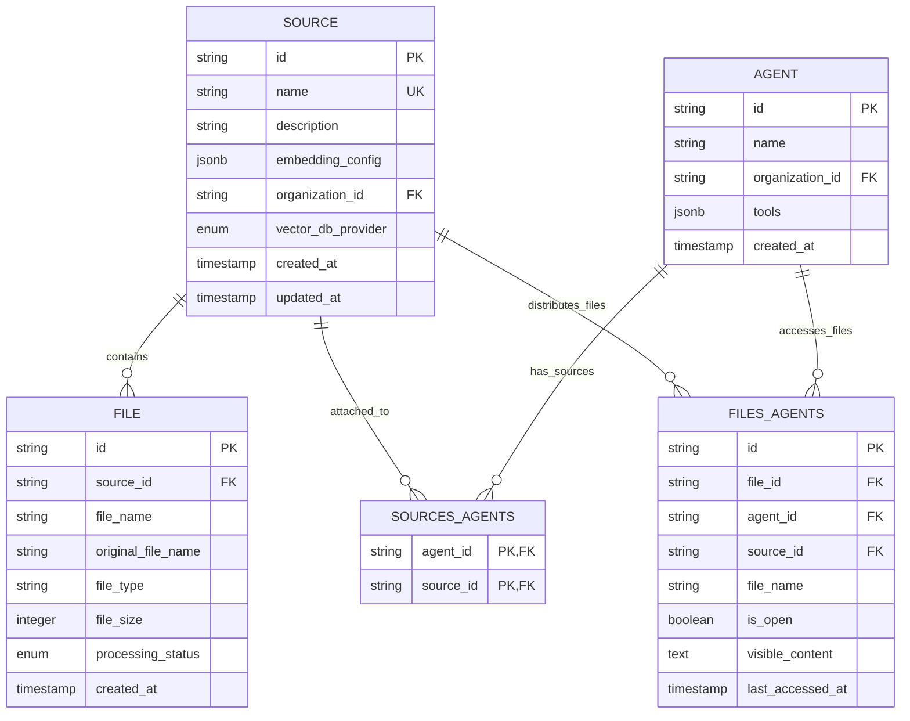

# Sources API

<cite>
**Referenced Files in This Document**
- [sources.py](file://letta/server/rest_api/routers/v1/sources.py)
- [source.py](file://letta/schemas/source.py)
- [source_manager.py](file://letta/services/source_manager.py)
- [source.py](file://letta/orm/source.py)
- [embedding_config.py](file://letta/schemas/embedding_config.py)
- [sources_agents.py](file://letta/orm/sources_agents.py)
- [files_agents.py](file://letta/orm/files_agents.py)
- [test_source_manager.py](file://tests/managers/test_source_manager.py)
- [test_sources.py](file://tests/test_sources.py)
</cite>

## Table of Contents
1. [Introduction](#introduction)
2. [Authentication](#authentication)
3. [API Endpoints Overview](#api-endpoints-overview)
4. [Source Management Endpoints](#source-management-endpoints)
5. [File Management Endpoints](#file-management-endpoints)
6. [Bulk Operations](#bulk-operations)
7. [Relationships Between Components](#relationships-between-components)
8. [Error Handling](#error-handling)
9. [Request/Response Schemas](#requestresponse-schemas)
10. [Examples and Usage](#examples-and-usage)

## Introduction

The Sources API provides comprehensive endpoints for managing data sources within the Letta platform. Sources represent collections of files and passages that agents can access and utilize for context-aware interactions. The API supports CRUD operations, bulk operations, file management, and complex relationships between sources, files, and agents.

Sources serve as the foundation for knowledge ingestion and retrieval in the Letta ecosystem, enabling agents to access structured and unstructured data through sophisticated embedding and vector database systems.

## Authentication

All API endpoints require authentication using Bearer tokens. The authentication mechanism supports multiple header formats for flexibility:

### Standard Bearer Token Authentication
```bash
curl -X GET \
  https://api.letta.com/sources \
  -H 'Authorization: Bearer YOUR_API_TOKEN'
```

### Alternative Header Formats
```bash
curl -X GET \
  https://api.letta.com/sources \
  -H 'Authorization: Bearer YOUR_API_TOKEN' \
  -H 'Content-Type: application/json'

curl -X GET \
  https://api.letta.com/sources \
  -H 'X-API-Key: YOUR_API_TOKEN' \
  -H 'Content-Type: application/json'
```

### Organization and Project Headers
For multi-tenant environments, additional headers can be used:
```bash
curl -X GET \
  https://api.letta.com/sources \
  -H 'Authorization: Bearer YOUR_API_TOKEN' \
  -H 'x-organization-id: org_123' \
  -H 'x-project-id: proj_456'
```

## API Endpoints Overview

The Sources API consists of several endpoint categories:

```mermaid
graph TD
A[Sources API] --> B[Source Management]
A --> C[File Management]
A --> D[Bulk Operations]
A --> E[Relationship Queries]
B --> B1[GET /sources - List Sources]
B --> B2[POST /sources - Create Source]
B --> B3[GET /sources/{id} - Retrieve Source]
B --> B4[PATCH /sources/{id} - Update Source]
B --> B5[DELETE /sources/{id} - Delete Source]
C --> C1[POST /sources/{id}/upload - Upload File]
C --> C2[GET /sources/{id}/files - List Files]
C --> C3[GET /sources/{id}/files/{file_id} - Get File Metadata]
C --> C4[DELETE /sources/{id}/{file_id} - Delete File]
D --> D1[POST /sources/bulk - Bulk Upsert]
E --> E1[GET /sources/{id}/agents - Get Attached Agents]
E --> E2[GET /sources/{id}/passages - List Passages]
```

**Diagram sources**
- [sources.py](file://letta/server/rest_api/routers/v1/sources.py#L47-L520)

## Source Management Endpoints

### List Sources

Retrieve a paginated list of all sources created by the authenticated user.

**Endpoint:** `GET /sources`

**Query Parameters:**
- `before` (string, optional): Cursor for pagination - returns sources created before this timestamp
- `after` (string, optional): Cursor for pagination - returns sources created after this timestamp  
- `limit` (integer, optional): Maximum number of sources to return (default: 50)
- `ascending` (boolean, optional): Sort order direction (default: true)
- `name` (string, optional): Filter sources by name (partial match)

**Example Request:**
```bash
curl -X GET \
  "https://api.letta.com/sources?limit=10&ascending=true" \
  -H 'Authorization: Bearer YOUR_TOKEN'
```

**Example Response:**
```json
[
  {
    "id": "source_123",
    "name": "Customer Support Knowledge",
    "description": "Knowledge base for customer support agents",
    "embedding_config": {
      "embedding_endpoint_type": "openai",
      "embedding_model": "text-embedding-3-small",
      "embedding_dim": 2000,
      "embedding_chunk_size": 300
    },
    "organization_id": "org_123",
    "vector_db_provider": "native",
    "created_at": "2024-01-15T10:30:00Z",
    "updated_at": "2024-01-15T10:30:00Z"
  }
]
```

### Create Source

Create a new data source with specified configuration and embedding settings.

**Endpoint:** `POST /sources`

**Request Body:**
```json
{
  "name": "New Source Name",
  "description": "Optional description of the source",
  "instructions": "Optional instructions for using the source",
  "metadata": {
    "category": "knowledge_base",
    "version": "1.0"
  },
  "embedding": "openai/text-embedding-3-small",
  "embedding_chunk_size": 300
}
```

**Required Fields:**
- `name`: Unique name for the source within the organization
- At least one of `embedding` or `embedding_config` must be provided

**Response:** Returns the created source object with generated ID and configuration.

### Retrieve Source

Get detailed information about a specific source by ID.

**Endpoint:** `GET /sources/{source_id}`

**Path Parameters:**
- `source_id` (string): The unique identifier of the source

**Example Request:**
```bash
curl -X GET \
  https://api.letta.com/sources/source_123 \
  -H 'Authorization: Bearer YOUR_TOKEN'
```

### Update Source

Modify an existing source's metadata, description, or instructions.

**Endpoint:** `PATCH /sources/{source_id}`

**Path Parameters:**
- `source_id` (string): The unique identifier of the source

**Request Body:**
```json
{
  "name": "Updated Source Name",
  "description": "Updated description",
  "instructions": "Updated instructions",
  "metadata": {
    "updated_field": "new_value"
  }
}
```

**Response:** Returns the updated source object.

### Delete Source

Remove a source and all associated files and passages from the system.

**Endpoint:** `DELETE /sources/{source_id}`

**Path Parameters:**
- `source_id` (string): The unique identifier of the source

**Behavior:**
- Deletes all associated files and passages
- Removes source from all attached agents
- Cleans up vector database entries
- Returns 204 No Content on success

**Section sources**
- [sources.py](file://letta/server/rest_api/routers/v1/sources.py#L112-L208)
- [source_manager.py](file://letta/services/source_manager.py#L63-L82)

## File Management Endpoints

### Upload File to Source

Add a file to a source for processing and embedding.

**Endpoint:** `POST /sources/{source_id}/upload`

**Path Parameters:**
- `source_id` (string): The target source ID

**Query Parameters:**
- `duplicate_handling` (enum, optional): How to handle duplicate filenames
  - `SUFFIX` (default): Add numeric suffix to filename
  - `REPLACE`: Delete existing file and replace with new
  - `SKIP`: Skip upload if file exists
  - `ERROR`: Return error if file exists
- `name` (string, optional): Custom name for the uploaded file

**Request Headers:**
- `Content-Type`: Must be one of supported file types (PDF, TXT, MD, JSON, etc.)
- `Authorization`: Bearer token

**Supported File Types:**
- PDF documents
- Text files (.txt, .md)
- JSON files
- Code files (.py, .js, .java, etc.)

**Example Request:**
```bash
curl -X POST \
  "https://api.letta.com/sources/source_123/upload?duplicate_handling=SUFFIX" \
  -H 'Authorization: Bearer YOUR_TOKEN' \
  -H 'Content-Type: application/pdf' \
  -F "file=@knowledge_base.pdf"
```

**Response:** Returns file metadata including processing status.

### List Source Files

Retrieve paginated list of files associated with a source.

**Endpoint:** `GET /sources/{source_id}/files`

**Path Parameters:**
- `source_id` (string): The source ID

**Query Parameters:**
- `limit` (integer, optional): Number of files to return (default: 1000)
- `after` (string, optional): Pagination cursor
- `include_content` (boolean, optional): Include full file content in response
- `check_status_updates` (boolean, optional): Check and update processing status

**Example Response:**
```json
[
  {
    "id": "file_456",
    "source_id": "source_123",
    "file_name": "knowledge_base.pdf",
    "original_file_name": "knowledge_base.pdf",
    "file_type": "application/pdf",
    "file_size": 1048576,
    "processing_status": "COMPLETED",
    "created_at": "2024-01-15T10:30:00Z"
  }
]
```

### Get File Metadata

Retrieve detailed metadata for a specific file.

**Endpoint:** `GET /sources/{source_id}/files/{file_id}`

**Path Parameters:**
- `source_id` (string): The source ID
- `file_id` (string): The file ID

**Query Parameters:**
- `include_content` (boolean, optional): Include full file content

**Response:** Complete file metadata with processing status and content.

### Delete File from Source

Remove a file from a source and clean up associated data.

**Endpoint:** `DELETE /sources/{source_id}/{file_id}`

**Path Parameters:**
- `source_id` (string): The source ID
- `file_id` (string): The file ID

**Behavior:**
- Removes file from source
- Deletes associated passages
- Updates agent contexts
- Returns 204 No Content

**Section sources**
- [sources.py](file://letta/server/rest_api/routers/v1/sources.py#L210-L467)

## Bulk Operations

### Bulk Upsert Sources

Create or update multiple sources in a single transaction for improved performance.

**Endpoint:** `POST /sources/bulk`

**Request Body:**
```json
{
  "sources": [
    {
      "name": "Source 1",
      "description": "First source description",
      "embedding": "openai/text-embedding-3-small"
    },
    {
      "name": "Source 2", 
      "description": "Second source description",
      "embedding": "openai/text-embedding-3-small"
    }
  ]
}
```

**Behavior:**
- Uses PostgreSQL's ON CONFLICT DO UPDATE for optimal performance
- Matches sources by (name, organization_id) unique constraint
- Preserves existing source IDs during updates
- Returns list of created/updated sources

**Performance Benefits:**
- Single database transaction for all operations
- Optimized for bulk creation/updating scenarios
- Automatic conflict resolution based on source name

**Example Response:**
```json
[
  {
    "id": "source_123",
    "name": "Source 1",
    "description": "First source description",
    "embedding_config": {...},
    "organization_id": "org_123"
  },
  {
    "id": "source_456", 
    "name": "Source 2",
    "description": "Second source description",
    "embedding_config": {...},
    "organization_id": "org_123"
  }
]
```

**Section sources**
- [source_manager.py](file://letta/services/source_manager.py#L85-L200)
- [test_source_manager.py](file://tests/managers/test_source_manager.py#L607-L745)

## Relationships Between Components

The Sources API manages complex relationships between sources, files, and agents:



**Diagram sources**
- [sources_agents.py](file://letta/orm/sources_agents.py#L7-L15)
- [files_agents.py](file://letta/orm/files_agents.py#L45-L69)

### Source-Agent Relationship

Sources can be attached to agents, granting them access to the source's files and passages:

**Attachment Process:**
1. Source is attached to agent via `attach_source_async`
2. File tools become available to the agent
3. Agent receives access to source's passages in context
4. File blocks are automatically managed based on character limits

**Detachment Process:**
1. Source is detached from agent
2. File tools are removed if no other sources remain attached
3. Agent loses access to source's passages
4. Context windows are updated accordingly

### File Processing Pipeline

Files undergo a comprehensive processing pipeline:

1. **Upload**: File is received and validated
2. **Parsing**: Content is extracted and structured
3. **Chunking**: Large documents are divided into manageable chunks
4. **Embedding**: Chunks are converted to vector embeddings
5. **Storage**: Embeddings are stored in vector database
6. **Indexing**: Documents are indexed for efficient retrieval

**Section sources**
- [agent_manager.py](file://letta/services/agent_manager.py#L1666-L1698)
- [test_source_manager.py](file://tests/managers/test_source_manager.py#L117-L130)

## Error Handling

The Sources API implements comprehensive error handling with specific HTTP status codes and error messages:

### Common Error Responses

**400 Bad Request**
```json
{
  "detail": "Invalid request parameters",
  "examples": ["source-123e4567-e89b-42d3-8456-426614174000"]
}
```

**401 Unauthorized**
```json
{
  "error": {
    "type": "authentication",
    "message": "Invalid or missing authentication token",
    "detail": "Bearer token required"
  }
}
```

**404 Not Found**
```json
{
  "detail": "Source with ID source_123 not found"
}
```

**409 Conflict**
```json
{
  "detail": "Source with name 'Duplicate Name' already exists",
  "examples": ["source-123e4567-e89b-42d3-8456-426614174000"]
}
```

**422 Validation Error**
```json
{
  "detail": "Validation error",
  "examples": ["source-123e4567-e89b-42d3-8456-426614174000"],
  "validation_errors": [
    {
      "loc": ["body", "name"],
      "msg": "Field required",
      "type": "missing"
    }
  ]
}
```

**500 Internal Server Error**
```json
{
  "detail": "Internal server error occurred",
  "error_code": "INTERNAL_SERVER_ERROR"
}
```

**503 Service Unavailable**
```json
{
  "detail": "The database is temporarily unavailable. Please try again later."
}
```

### Error Categories

| Error Type | HTTP Status | Description |
|------------|-------------|-------------|
| AuthenticationError | 401 | Invalid or missing Bearer token |
| ValidationError | 422 | Invalid request parameters or schema |
| NotFoundError | 404 | Resource not found (source, file, agent) |
| ConflictError | 409 | Name conflict or duplicate resource |
| RateLimitError | 429 | Rate limit exceeded |
| ServerError | 500 | Unexpected server error |
| ServiceUnavailable | 503 | Database or service temporarily unavailable |

**Section sources**
- [app.py](file://letta/server/rest_api/app.py#L371-L545)
- [errors.py](file://letta/errors.py#L149-L281)

## Request/Response Schemas

### Source Schema

**Source Object:**
```typescript
interface Source {
  id: string;
  name: string;
  description?: string;
  instructions?: string;
  metadata?: Record<string, any>;
  embedding_config: EmbeddingConfig;
  organization_id: string;
  vector_db_provider: "native" | "pinecone" | "tpuf";
  created_at: string;
  updated_at: string;
}
```

### Embedding Configuration Schema

**EmbeddingConfig Object:**
```typescript
interface EmbeddingConfig {
  embedding_endpoint_type: 
    | "openai" 
    | "anthropic" 
    | "bedrock" 
    | "google_ai" 
    | "azure" 
    | "groq" 
    | "ollama" 
    | "webui" 
    | "lmstudio" 
    | "vllm" 
    | "pinecone";
  embedding_endpoint?: string;
  embedding_model: string;
  embedding_dim: number;
  embedding_chunk_size?: number;
  handle?: string;
  batch_size?: number;
  azure_endpoint?: string;
  azure_version?: string;
  azure_deployment?: string;
}
```

### File Metadata Schema

**FileMetadata Object:**
```typescript
interface FileMetadata {
  id: string;
  source_id: string;
  file_name: string;
  original_file_name: string;
  file_type: string;
  file_size?: number;
  processing_status: 
    | "PENDING" 
    | "PARSING" 
    | "CHUNKING" 
    | "EMBEDDING" 
    | "COMPLETED" 
    | "FAILED";
  created_at: string;
  updated_at: string;
}
```

### Bulk Upsert Request Schema

**BulkUpsertRequest Object:**
```typescript
interface BulkUpsertRequest {
  sources: Array<{
    name: string;
    description?: string;
    instructions?: string;
    metadata?: Record<string, any>;
    embedding?: string;
    embedding_config?: EmbeddingConfig;
  }>;
}
```

**Section sources**
- [source.py](file://letta/schemas/source.py#L12-L71)
- [embedding_config.py](file://letta/schemas/embedding_config.py#L8-L88)

## Examples and Usage

### Creating a Source with Embedding Configuration

```bash
curl -X POST \
  https://api.letta.com/sources \
  -H 'Authorization: Bearer YOUR_TOKEN' \
  -H 'Content-Type: application/json' \
  -d '{
    "name": "Customer Support KB",
    "description": "Knowledge base for customer support agents",
    "embedding": "openai/text-embedding-3-small",
    "metadata": {
      "category": "support",
      "version": "1.0",
      "tags": ["faq", "troubleshooting"]
    }
  }'
```

### Listing Sources with Pagination

```bash
# Get first page of sources
curl -X GET \
  "https://api.letta.com/sources?limit=20&ascending=true" \
  -H 'Authorization: Bearer YOUR_TOKEN'

# Get next page using cursor
curl -X GET \
  "https://api.letta.com/sources?after=source_abc123&limit=20" \
  -H 'Authorization: Bearer YOUR_TOKEN'
```

### Uploading a File to a Source

```bash
# Upload PDF file with duplicate handling
curl -X POST \
  "https://api.letta.com/sources/source_123/upload?duplicate_handling=REPLACE" \
  -H 'Authorization: Bearer YOUR_TOKEN' \
  -F "file=@customer_manual.pdf"
```

### Bulk Creating Sources

```bash
curl -X POST \
  https://api.letta.com/sources/bulk \
  -H 'Authorization: Bearer YOUR_TOKEN' \
  -H 'Content-Type: application/json' \
  -d '{
    "sources": [
      {
        "name": "Technical Documentation",
        "description": "API and technical documentation",
        "embedding": "openai/text-embedding-3-small"
      },
      {
        "name": "Product Specifications",
        "description": "Product feature specifications",
        "embedding": "openai/text-embedding-3-small"
      }
    ]
  }'
```

### Managing Source-Agent Relationships

```bash
# Attach source to agent
curl -X POST \
  https://api.letta.com/agents/agent_123/sources \
  -H 'Authorization: Bearer YOUR_TOKEN' \
  -H 'Content-Type: application/json' \
  -d '{
    "source_id": "source_456"
  }'

# Get attached agents for source
curl -X GET \
  "https://api.letta.com/sources/source_456/agents" \
  -H 'Authorization: Bearer YOUR_TOKEN'

# Detach source from agent
curl -X DELETE \
  "https://api.letta.com/agents/agent_123/sources/source_456" \
  -H 'Authorization: Bearer YOUR_TOKEN'
```

### Filtering and Searching Sources

```bash
# Filter sources by name
curl -X GET \
  "https://api.letta.com/sources?name=support" \
  -H 'Authorization: Bearer YOUR_TOKEN'

# Get sources with specific metadata
curl -X GET \
  "https://api.letta.com/sources?metadata.category=support" \
  -H 'Authorization: Bearer YOUR_TOKEN'
```

### Advanced File Management

```bash
# List files with content inclusion
curl -X GET \
  "https://api.letta.com/sources/source_123/files?include_content=true" \
  -H 'Authorization: Bearer YOUR_TOKEN'

# Delete file and clean up
curl -X DELETE \
  "https://api.letta.com/sources/source_123/file_456" \
  -H 'Authorization: Bearer YOUR_TOKEN'
```

These examples demonstrate the comprehensive capabilities of the Sources API, from basic CRUD operations to advanced bulk operations and complex relationship management. The API provides both simple single-resource operations and powerful batch processing capabilities for production environments.