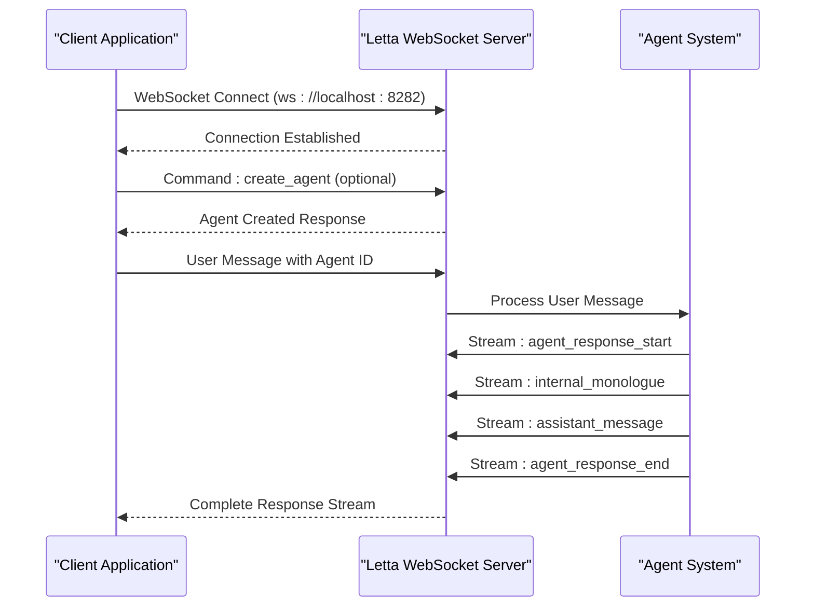
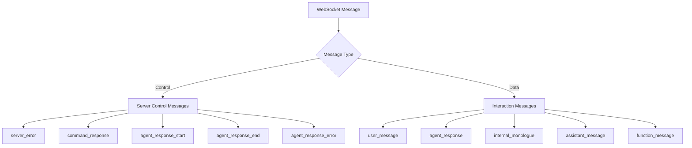
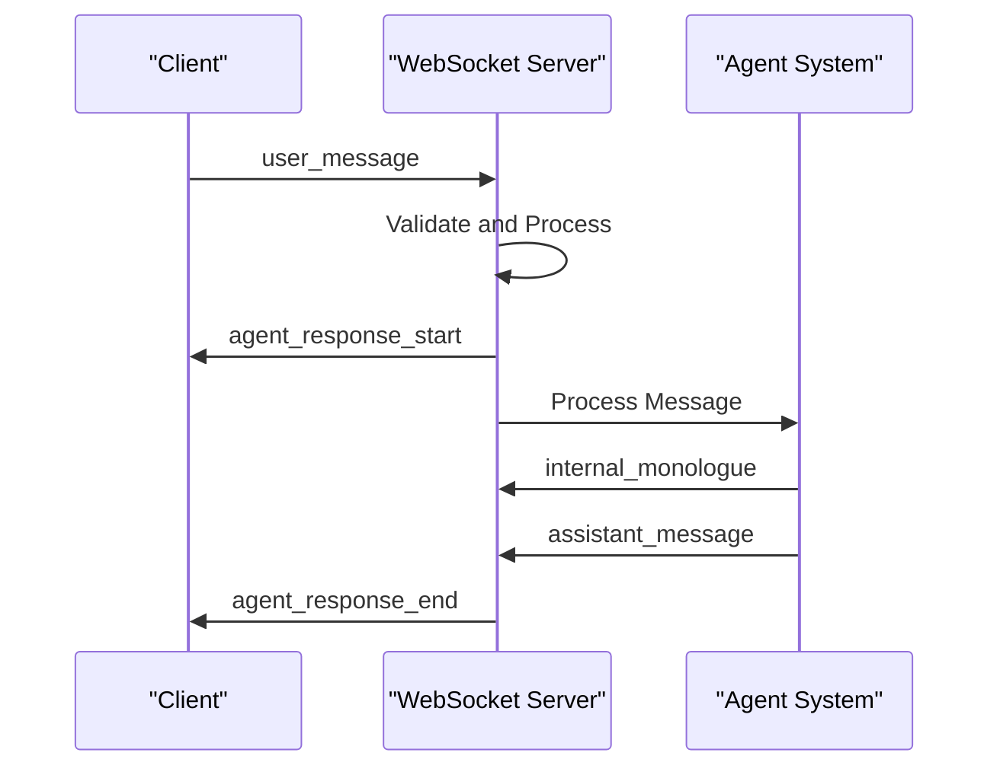
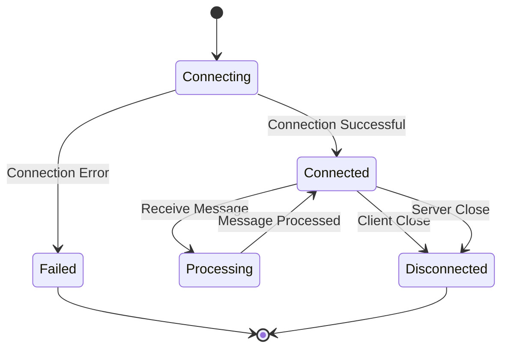
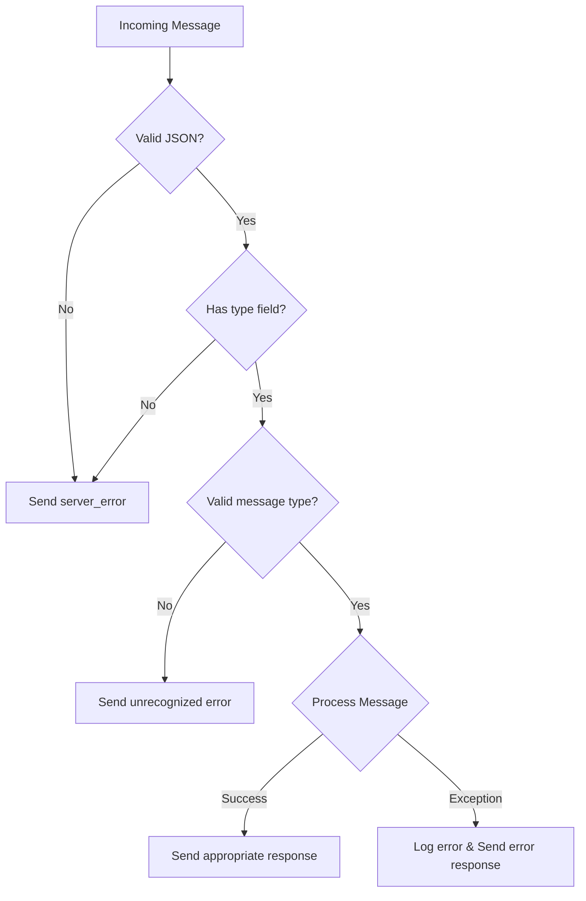
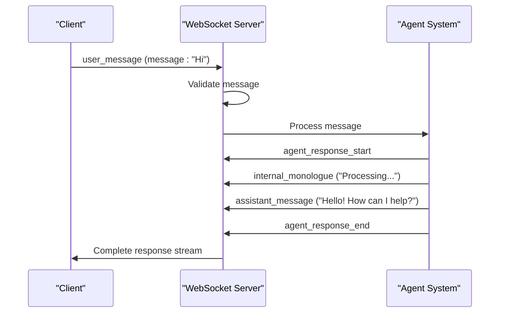

# WebSocket API Documentation

<cite>
**Referenced Files in This Document**
- [example_client.py](file://letta/server/ws_api/example_client.py)
- [server.py](file://letta/server/ws_api/server.py)
- [protocol.py](file://letta/server/ws_api/protocol.py)
- [interface.py](file://letta/server/ws_api/interface.py)
- [constants.py](file://letta/server/constants.py)
- [utils.py](file://letta/server/utils.py)
- [streaming.py](file://letta/client/streaming.py)
- [letta_message.py](file://letta/schemas/letta_message.py)
- [streaming_response.py](file://letta/server/rest_api/streaming_response.py)
</cite>

## Table of Contents
1. [Introduction](#introduction)
2. [WebSocket Connection Setup](#websocket-connection-setup)
3. [Message Protocol Overview](#message-protocol-overview)
4. [Client-to-Server Messages](#client-to-server-messages)
5. [Server-to-Client Messages](#server-to-client-messages)
6. [Connection Management](#connection-management)
7. [Error Handling](#error-handling)
8. [Python Client Implementation](#python-client-implementation)
9. [Advanced Features](#advanced-features)
10. [Best Practices](#best-practices)

## Introduction

The Letta WebSocket API provides real-time bidirectional communication between clients and the Letta server for agent interaction. This API enables streaming responses, real-time message exchange, and continuous conversation flows with AI agents. The WebSocket protocol ensures low-latency communication and maintains persistent connections for interactive experiences.

The API supports multiple message types for different aspects of agent interaction, including user messages, internal monologues, assistant responses, and function calls. All communications follow a structured JSON protocol with specific message formats and sequencing requirements.

## WebSocket Connection Setup

### Basic Connection Process

Establishing a WebSocket connection to the Letta server involves several steps:



**Diagram sources**
- [server.py](file://letta/server/ws_api/server.py#L46-L106)
- [example_client.py](file://letta/server/ws_api/example_client.py#L45-L104)

### Connection Parameters

The WebSocket server operates with the following default configuration:

| Parameter | Value | Description |
|-----------|-------|-------------|
| Host | localhost | Server hostname |
| Port | 8282 | WebSocket server port |
| Timeout | 30 seconds | Client timeout setting |
| Ping Interval | Configurable | Keep-alive ping frequency |

**Section sources**
- [constants.py](file://letta/server/constants.py#L2-L3)
- [server.py](file://letta/server/ws_api/server.py#L17-L22)

## Message Protocol Overview

### Message Structure

All WebSocket messages follow a standardized JSON structure with a mandatory `type` field:

```json
{
  "type": "message_type",
  "additional_fields": "values"
}
```

### Message Types Classification

The protocol defines two main categories of messages:

1. **Control Messages**: Server-initiated control and status messages
2. **Data Messages**: Content and interaction messages between client and agent



**Diagram sources**
- [protocol.py](file://letta/server/ws_api/protocol.py#L1-L101)

## Client-to-Server Messages

### User Message Format

The primary way to interact with agents is through user messages:

```json
{
  "type": "user_message",
  "message": "Hello, how can you help me today?",
  "agent_id": "agent_26"
}
```

**Message Fields:**
- `type`: Must be `"user_message"`
- `message`: The user's input text
- `agent_id`: Identifier of the target agent (required)

### Command Messages

Commands allow initialization and configuration of agents:

```json
{
  "type": "command",
  "command": "create_agent",
  "config": {
    "persona": "sam_pov",
    "human": "cs_phd",
    "model": "gpt-4-1106-preview"
  }
}
```

**Command Configuration Options:**
- `persona`: Predefined persona template
- `human`: Human profile template  
- `model`: LLM model specification
- Additional configuration parameters

**Section sources**
- [protocol.py](file://letta/server/ws_api/protocol.py#L83-L101)
- [server.py](file://letta/server/ws_api/server.py#L65-L76)

## Server-to-Client Messages

### Response Lifecycle Messages

The server sends a series of messages to indicate response lifecycle:



**Diagram sources**
- [server.py](file://letta/server/ws_api/server.py#L88-L96)
- [interface.py](file://letta/server/ws_api/interface.py#L33-L52)

### Agent Response Types

#### Internal Monologue Messages
```json
{
  "type": "agent_response",
  "message_type": "internal_monologue",
  "message": "Considering the user's request about data analysis..."
}
```

#### Assistant Message Responses
```json
{
  "type": "agent_response", 
  "message_type": "assistant_message",
  "message": "I can help you analyze your data. What specific questions do you have?"
}
```

#### Function Call Messages
```json
{
  "type": "agent_response",
  "message_type": "function_message",
  "message": "Calling function: analyze_data with parameters..."
}
```

### Control Response Messages

#### Response Start
Indicates the beginning of a streaming response:
```json
{
  "type": "agent_response_start"
}
```

#### Response End
Signals completion of the response stream:
```json
{
  "type": "agent_response_end"
}
```

#### Error Responses
Provides error information:
```json
{
  "type": "agent_response_error",
  "message": "Failed to process message: invalid agent_id"
}
```

#### Command Responses
Confirms successful command execution:
```json
{
  "type": "command_response",
  "status": "OK: Agent initialized"
}
```

**Section sources**
- [protocol.py](file://letta/server/ws_api/protocol.py#L34-L77)
- [interface.py](file://letta/server/ws_api/interface.py#L33-L52)

## Connection Management

### Connection Lifecycle

The WebSocket connection follows a structured lifecycle:



### Reconnection Strategy

The client implementation includes robust reconnection logic:

```python
# Example reconnection parameters
RECONNECT_DELAY = 1  # seconds
RECONNECT_MAX_TRIES = 5
```

**Reconnection Logic:**
1. Detect connection loss via `ConnectionClosedError`
2. Attempt reconnection with exponential backoff
3. Limit total reconnection attempts
4. Gracefully handle maximum retry exhaustion

**Section sources**
- [example_client.py](file://letta/server/ws_api/example_client.py#L77-L104)
- [server.py](file://letta/server/ws_api/server.py#L103-L106)

## Error Handling

### Server-Side Error Handling

The server implements comprehensive error handling:



**Diagram sources**
- [server.py](file://letta/server/ws_api/server.py#L54-L101)

### Client-Side Error Handling

Client applications should handle various error conditions:

| Error Type | Description | Handling Strategy |
|------------|-------------|-------------------|
| ConnectionClosedError | Server disconnected | Attempt reconnection |
| TimeoutError | Response timeout | Retry with backoff |
| JSONDecodeError | Malformed message | Log and continue |
| ValidationError | Invalid message format | Validate and reject |

### Error Response Formats

Server error responses follow a consistent format:
```json
{
  "type": "server_error",
  "message": "Detailed error description"
}
```

**Section sources**
- [server.py](file://letta/server/ws_api/server.py#L54-L101)
- [example_client.py](file://letta/server/ws_api/example_client.py#L77-L104)

## Python Client Implementation

### Basic Client Setup

Here's a complete example of a Python WebSocket client:

```python
import asyncio
import websockets
import json
import letta.server.ws_api.protocol as protocol

async def basic_websocket_client():
    uri = "ws://localhost:8282"
    
    async with websockets.connect(uri) as websocket:
        # Create a new agent
        agent_config = {
            "persona": "sam_pov",
            "human": "cs_phd", 
            "model": "gpt-4-1106-preview"
        }
        await websocket.send(protocol.client_command_create(agent_config))
        
        # Wait for agent creation confirmation
        response = await websocket.recv()
        print(f"Agent created: {response}")
        
        # Send user messages
        while True:
            user_input = input("Enter your message: ")
            await websocket.send(protocol.client_user_message(user_input, "agent_26"))
            
            # Process streaming responses
            while True:
                response = await websocket.recv()
                response_data = json.loads(response)
                
                if response_data.get("type") == "agent_response_start":
                    print("[Agent Response Started]")
                elif response_data.get("type") == "agent_response":
                    if response_data.get("message_type") == "internal_monologue":
                        print(f"[Thinking] {response_data['message']}")
                    elif response_data.get("message_type") == "assistant_message":
                        print(f"[Agent] {response_data['message']}")
                elif response_data.get("type") == "agent_response_end":
                    print("[Agent Response Ended]")
                    break
```

### Advanced Client Features

#### Message Streaming Handler
```python
async def handle_message_stream(websocket):
    """Process incoming WebSocket messages with proper streaming handling"""
    async for message in websocket:
        try:
            data = json.loads(message)
            
            if data.get("type") == "agent_response_start":
                print("[Response Start]")
            elif data.get("type") == "agent_response":
                process_agent_response(data)
            elif data.get("type") == "agent_response_end":
                print("[Response End]")
                break
                
        except json.JSONDecodeError:
            print(f"Invalid JSON received: {message}")
```

#### Connection Management
```python
async def managed_websocket_connection(uri, max_retries=5):
    """Establish WebSocket connection with automatic retry logic"""
    retries = 0
    while retries < max_retries:
        try:
            async with websockets.connect(uri) as websocket:
                return websocket
        except websockets.exceptions.ConnectionClosedError:
            retries += 1
            await asyncio.sleep(2 ** retries)  # Exponential backoff
            continue
    raise ConnectionError(f"Failed to connect after {max_retries} attempts")
```

**Section sources**
- [example_client.py](file://letta/server/ws_api/example_client.py#L20-L104)
- [utils.py](file://letta/server/utils.py#L1-L47)

## Advanced Features

### Message Sequencing

The WebSocket API maintains strict message ordering for proper conversation flow:



### Multi-Agent Support

The protocol supports multiple concurrent agents:

```json
{
  "type": "user_message",
  "message": "What's the weather?",
  "agent_id": "weather_agent_001"
}
```

### Streaming Response Handling

Real-time streaming enables responsive user experiences:

```python
async def stream_response_handler(websocket):
    """Handle streaming responses with proper buffering"""
    buffer = []
    async for message in websocket:
        data = json.loads(message)
        
        if data.get("type") == "agent_response":
            buffer.append(data["message"])
            
            # Process complete sentences or paragraphs
            if needs_processing(buffer):
                await process_buffered_content(buffer)
                buffer.clear()
```

**Section sources**
- [server.py](file://letta/server/ws_api/server.py#L88-L96)
- [streaming.py](file://letta/client/streaming.py#L19-L96)

## Best Practices

### Connection Management
1. **Implement proper reconnection logic** with exponential backoff
2. **Set appropriate timeouts** for both connection and message processing
3. **Handle network interruptions gracefully** with automatic recovery
4. **Maintain connection health** through periodic keep-alive messages

### Message Handling
1. **Validate all incoming messages** for proper JSON structure and required fields
2. **Process messages asynchronously** to avoid blocking the main thread
3. **Buffer streaming content** appropriately for optimal user experience
4. **Handle partial messages** and message fragmentation correctly

### Error Recovery
1. **Log all errors** with sufficient context for debugging
2. **Provide meaningful error messages** to users when appropriate
3. **Implement circuit breaker patterns** for failing connections
4. **Gracefully degrade functionality** when parts of the system fail

### Performance Optimization
1. **Minimize message payload sizes** by using efficient JSON structures
2. **Implement message compression** for large content transfers
3. **Use connection pooling** for multiple concurrent connections
4. **Monitor connection metrics** to identify performance bottlenecks

### Security Considerations
1. **Validate all message content** to prevent injection attacks
2. **Implement rate limiting** to prevent abuse
3. **Use secure WebSocket connections** (wss://) in production
4. **Authenticate connections** using appropriate mechanisms