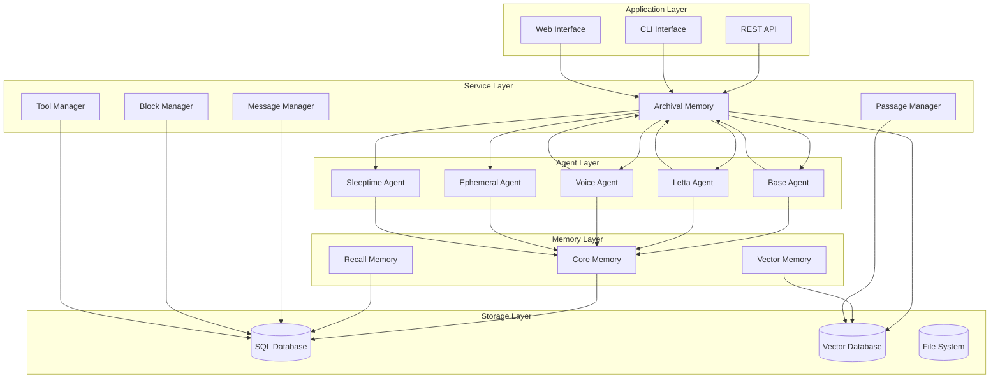
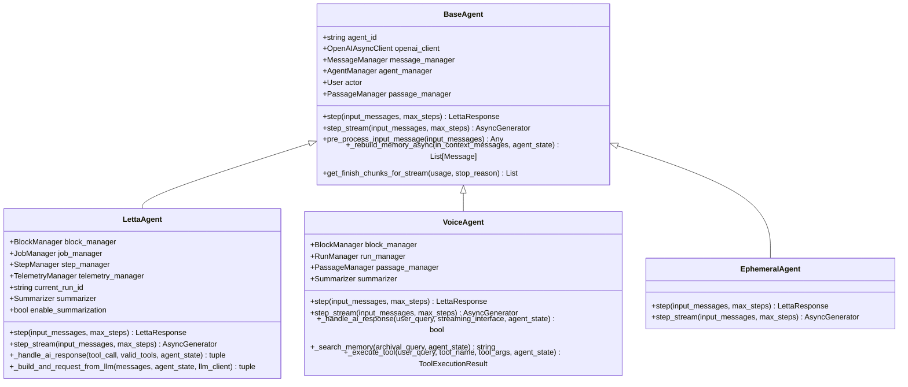
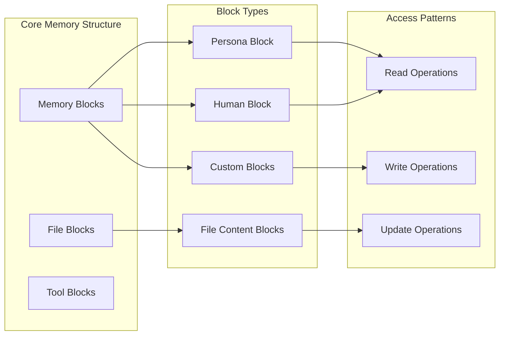
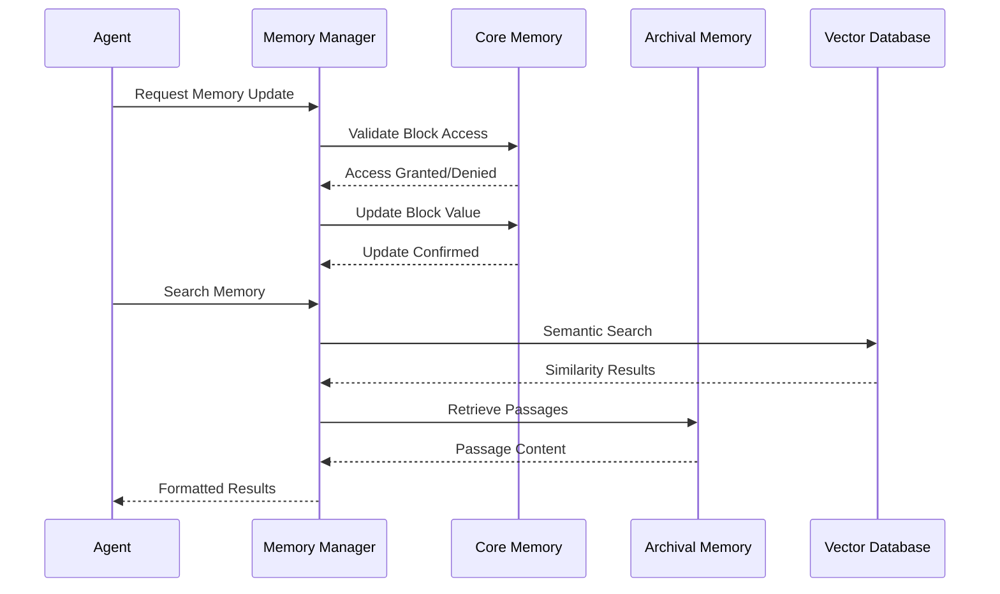
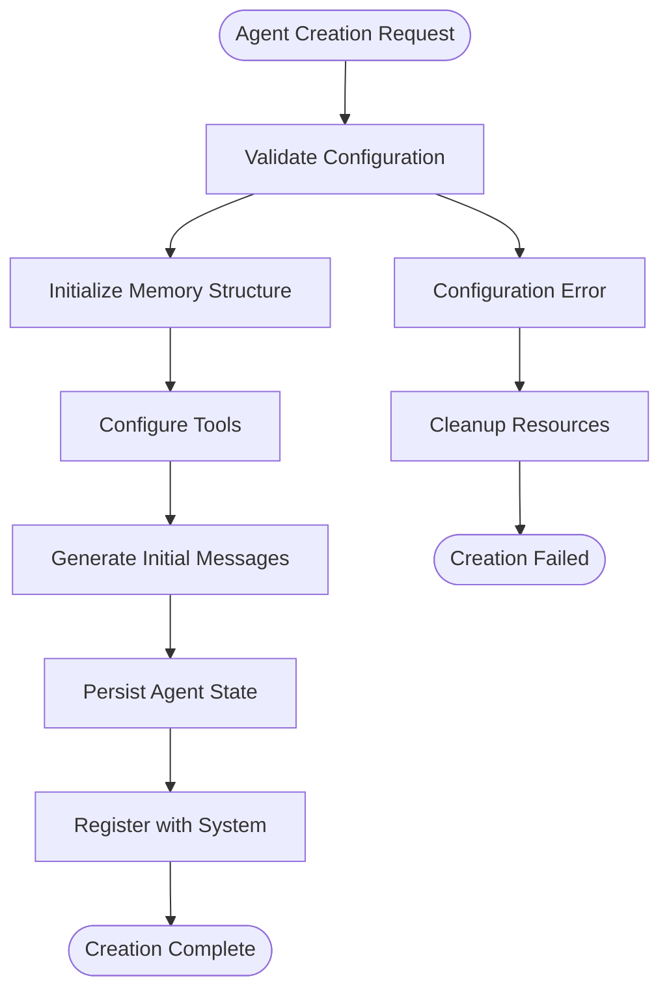
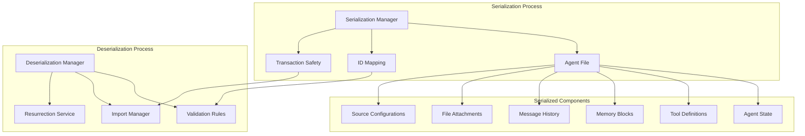
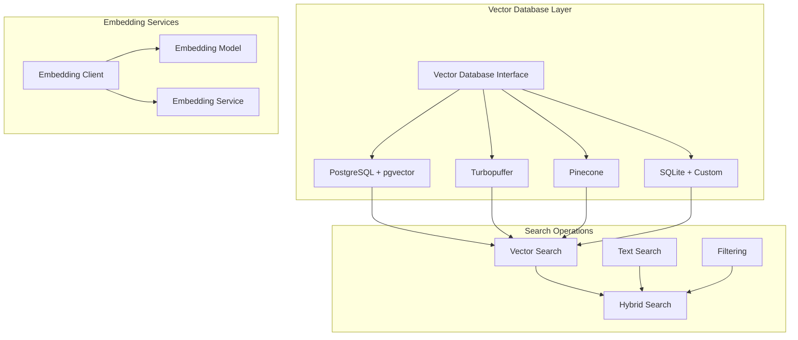
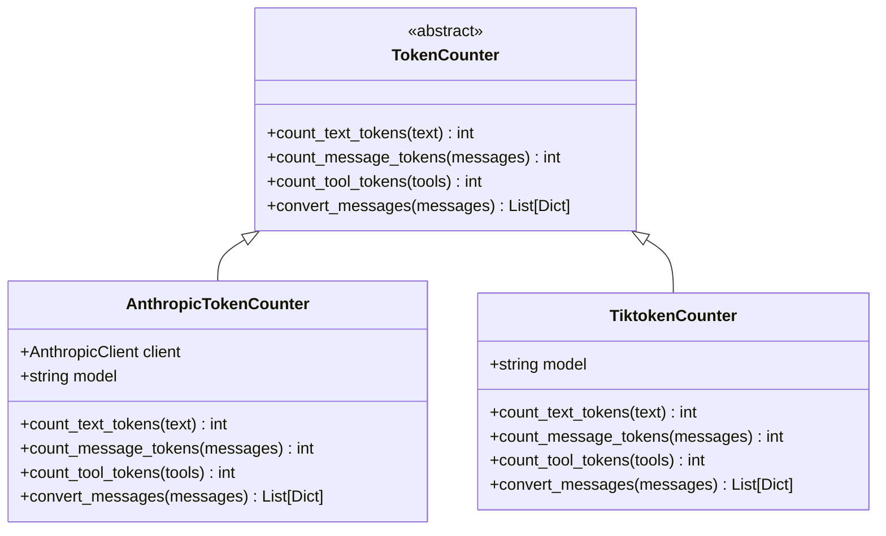
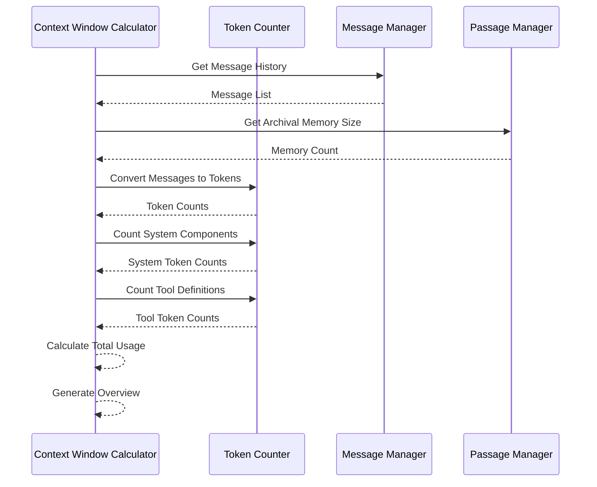
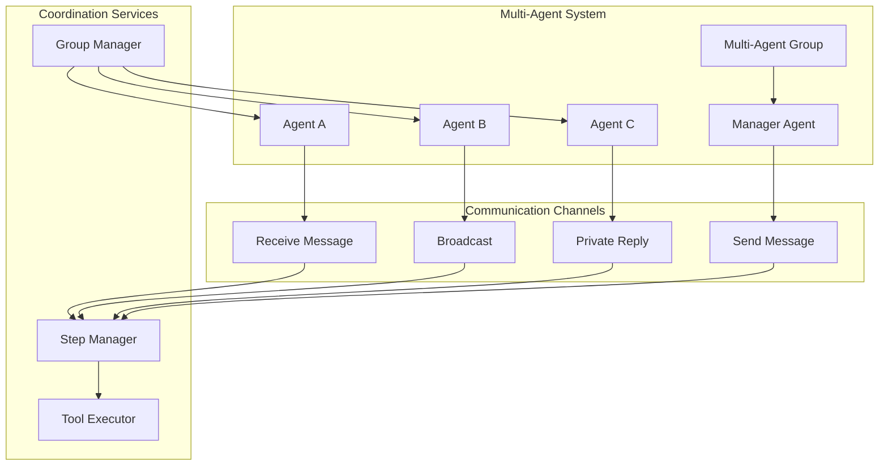

# Agent Architecture and Memory Management

<cite>
**Referenced Files in This Document**
- [base_agent.py](file://letta/agents/base_agent.py)
- [letta_agent.py](file://letta/agents/letta_agent.py)
- [voice_agent.py](file://letta/agents/voice_agent.py)
- [ephemeral_agent.py](file://letta/agents/ephemeral_agent.py)
- [memory.py](file://letta/memory.py)
- [schemas/memory.py](file://letta/schemas/memory.py)
- [passage_manager.py](file://letta/services/passage_manager.py)
- [agent_manager.py](file://letta/services/agent_manager.py)
- [agent_serialization_manager.py](file://letta/services/agent_serialization_manager.py)
- [context_window_calculator.py](file://letta/services/context_window_calculator/context_window_calculator.py)
- [token_counter.py](file://letta/services/context_window_calculator/token_counter.py)
- [agent_loop.py](file://letta/agents/agent_loop.py)
</cite>

## Table of Contents
1. [Introduction](#introduction)
2. [High-Level Architecture Overview](#high-level-architecture-overview)
3. [Agent Types and Implementations](#agent-types-and-implementations)
4. [Memory Hierarchy and Management](#memory-hierarchy-and-management)
5. [Agent Lifecycle and Serialization](#agent-lifecycle-and-serialization)
6. [Vector Database and Memory Retrieval](#vector-database-and-memory-retrieval)
7. [Context Window Management](#context-window-management)
8. [Performance Optimization Strategies](#performance-optimization-strategies)
9. [System Integration Patterns](#system-integration-patterns)
10. [Conclusion](#conclusion)

## Introduction

Letta's Agent system represents a sophisticated framework for creating stateful AI agents with persistent memory capabilities. The architecture emphasizes modularity, scalability, and extensibility while maintaining robust memory management and efficient resource utilization. This document explores the comprehensive design of Letta's agent architecture, focusing on the hierarchical memory system, agent lifecycle management, and performance optimization techniques.

The system supports multiple agent types, each optimized for specific use cases, from lightweight ephemeral agents to sophisticated stateful agents with extensive memory capabilities. Central to the architecture is the dual-layer memory system that distinguishes between core memory blocks (persistent context) and archival memory (long-term storage), enabling efficient retrieval and management of large-scale conversational histories.

## High-Level Architecture Overview

The Letta Agent system follows a layered architecture pattern that separates concerns across multiple abstraction levels. The system is built around several key architectural principles: separation of state management, modular agent implementations, and efficient memory access patterns.

**Diagram sources**
- [base_agent.py](file://letta/agents/base_agent.py#L28-L50)
- [agent_manager.py](file://letta/services/agent_manager.py#L120-L132)
- [passage_manager.py](file://letta/services/passage_manager.py#L51-L56)

The architecture demonstrates clear separation between the presentation layer (APIs and interfaces), service layer (business logic managers), agent layer (different agent implementations), and storage layer (databases and file systems). This design enables independent scaling and maintenance of each layer while preserving system coherence.

**Section sources**
- [base_agent.py](file://letta/agents/base_agent.py#L28-L50)
- [agent_manager.py](file://letta/services/agent_manager.py#L120-L132)

## Agent Types and Implementations

Letta supports multiple specialized agent implementations, each designed for specific use cases and performance characteristics. The agent hierarchy provides flexibility while maintaining consistent interfaces and capabilities.

### Base Agent Architecture

The BaseAgent serves as the foundational abstract class that defines the core interface and common functionality shared across all agent implementations. It establishes the contract for agent execution, message handling, and memory management.

**Diagram sources**
- [base_agent.py](file://letta/agents/base_agent.py#L28-L50)
- [letta_agent.py](file://letta/agents/letta_agent.py#L77-L110)
- [voice_agent.py](file://letta/agents/voice_agent.py#L50-L84)
- [ephemeral_agent.py](file://letta/agents/ephemeral_agent.py#L16-L37)

### LettaAgent Implementation

The LettaAgent represents the primary stateful agent implementation, designed for complex conversations requiring persistent memory and sophisticated reasoning capabilities. It incorporates advanced features like summarization, tool execution, and multi-step reasoning.

Key characteristics of LettaAgent:
- **Persistent State Management**: Maintains conversation history and memory blocks across interactions
- **Advanced Summarization**: Implements configurable summarization modes for managing long conversations
- **Tool Integration**: Comprehensive tool execution framework with approval workflows
- **Multi-step Processing**: Supports complex reasoning chains with intermediate steps
- **Performance Monitoring**: Built-in telemetry and metrics collection

### VoiceAgent Implementation

The VoiceAgent specializes in real-time conversational scenarios with streaming capabilities and voice-specific optimizations. It's designed for applications requiring low-latency responses and continuous conversation flow.

Distinctive features:
- **Streaming Support**: Real-time token streaming for immediate user feedback
- **Voice-Specific Tools**: Optimized tool selection for voice interactions
- **Buffer Management**: Sophisticated message buffering for optimal performance
- **Latency Optimization**: Reduced overhead for voice-first applications

### EphemeralAgent Implementation

The EphemeralAgent provides lightweight, stateless functionality for simple, one-off interactions. It serves as a thin wrapper around external LLM APIs, offering minimal overhead for straightforward use cases.

Characteristics:
- **Stateless Operation**: No persistent memory or state retention
- **Minimal Overhead**: Lightweight implementation with fast response times
- **External API Focus**: Direct integration with OpenAI-compatible APIs
- **Scalable Design**: Ideal for high-throughput, simple interaction scenarios

**Section sources**
- [base_agent.py](file://letta/agents/base_agent.py#L28-L50)
- [letta_agent.py](file://letta/agents/letta_agent.py#L77-L110)
- [voice_agent.py](file://letta/agents/voice_agent.py#L50-L84)
- [ephemeral_agent.py](file://letta/agents/ephemeral_agent.py#L16-L37)

## Memory Hierarchy and管理

Letta's memory system implements a sophisticated hierarchical structure that balances persistence, accessibility, and performance. The memory hierarchy consists of multiple layers, each serving distinct purposes in the agent's cognitive architecture.

### Core Memory Blocks

Core memory blocks represent the agent's persistent context that remains stable across conversations. These blocks serve as the foundation for the agent's identity and operational parameters.

**Diagram sources**
- [schemas/memory.py](file://letta/schemas/memory.py#L56-L110)
- [memory.py](file://letta/memory.py#L1-L40)

Core memory characteristics:
- **Persistent Storage**: Values persist across agent sessions and restarts
- **Structured Format**: Organized into labeled blocks for easy access
- **Size Limits**: Configurable character limits prevent memory overflow
- **Atomic Updates**: Block-level updates ensure consistency
- **Type Safety**: Strong typing prevents invalid memory modifications

### Archival Memory System

Archival memory serves as the long-term storage layer, housing historical conversations, facts, and knowledge that can be retrieved through semantic search. This system enables agents to access relevant information from extensive interaction histories.

The archival memory system employs several advanced techniques:

**Vector Embeddings**: Text content is converted to high-dimensional vectors for semantic similarity search
**Passage-Based Storage**: Content is segmented into discrete passages for efficient retrieval
**Tagging System**: Metadata tags enable filtered and targeted searches
**Dual-Storage Architecture**: Simultaneous storage in SQL database and vector database for reliability and performance

### Memory Access Patterns

The system implements sophisticated access patterns to optimize memory retrieval and updates:

**Diagram sources**
- [passage_manager.py](file://letta/services/passage_manager.py#L51-L56)
- [schemas/memory.py](file://letta/schemas/memory.py#L321-L353)

**Section sources**
- [schemas/memory.py](file://letta/schemas/memory.py#L56-L110)
- [memory.py](file://letta/memory.py#L1-L40)
- [passage_manager.py](file://letta/services/passage_manager.py#L51-L56)

## Agent Lifecycle and Serialization

The agent lifecycle encompasses creation, operation, persistence, and resurrection phases, with sophisticated serialization mechanisms ensuring state preservation across system restarts and migrations.

### Agent Creation Process

Agent creation involves multiple coordinated steps that establish the agent's initial state, memory configuration, and operational parameters:

**Diagram sources**
- [agent_manager.py](file://letta/services/agent_manager.py#L593-L618)

The creation process ensures comprehensive validation and initialization:
- **Configuration Validation**: Verifies LLM settings, embedding configurations, and resource limits
- **Memory Initialization**: Sets up core memory blocks and archival memory structure
- **Tool Configuration**: Establishes available tools and permission rules
- **Message Generation**: Creates initial conversation context and system prompts
- **State Persistence**: Writes agent state to database with transactional guarantees

### Serialization Architecture

Letta implements a comprehensive serialization system that captures complete agent state for backup, migration, and resurrection scenarios. The serialization process handles complex relationships between agents, tools, memories, and configurations.

**Diagram sources**
- [agent_serialization_manager.py](file://letta/services/agent_serialization_manager.py#L61-L93)

Serialization capabilities include:
- **Complete State Capture**: Preserves all agent attributes, memory states, and relationships
- **ID Remapping**: Handles cross-user and cross-system ID resolution
- **Referential Integrity**: Validates and maintains relationships between serialized components
- **Incremental Updates**: Supports partial serialization for large agents
- **Version Compatibility**: Handles schema evolution and backward compatibility

### Agent Resurrection

The resurrection process reconstructs agents from serialized state, restoring full functionality including memory content, tool configurations, and operational parameters.

Key resurrection features:
- **State Reconstruction**: Recreates agent instances with original configurations
- **Memory Restoration**: Rebuilds core memory and archival memory from serialized content
- **Relationship Reestablishment**: Restores connections to tools, sources, and files
- **Validation and Repair**: Identifies and repairs inconsistencies in serialized data
- **Performance Optimization**: Loads frequently accessed data into memory caches

**Section sources**
- [agent_manager.py](file://letta/services/agent_manager.py#L593-L618)
- [agent_serialization_manager.py](file://letta/services/agent_serialization_manager.py#L61-L93)

## Vector Database and Memory Retrieval

Letta's vector database system provides sophisticated semantic search capabilities for efficient memory retrieval. The system supports multiple vector database providers and implements advanced optimization techniques for large-scale memory management.

### Vector Database Architecture

The vector database architecture supports multiple providers while maintaining consistent interfaces and performance characteristics:

**Diagram sources**
- [passage_manager.py](file://letta/services/passage_manager.py#L51-L56)
- [agent_manager.py](file://letta/services/agent_manager.py#L3289-L3322)

### Passage Management and Embedding

Passage management handles the segmentation, embedding, and storage of textual content for efficient retrieval. The system implements intelligent chunking strategies and embedding optimization techniques.

Key passage management features:
- **Intelligent Chunking**: Splits text into semantically coherent passages
- **Embedding Generation**: Converts passages to vector representations
- **Metadata Attachment**: Associates passages with tags and timestamps
- **Batch Processing**: Optimizes embedding generation for large datasets
- **Dual Storage**: Maintains passages in both SQL and vector databases

### Search and Retrieval Mechanisms

The search system supports multiple retrieval paradigms optimized for different use cases:

**Vector Search**: Semantic similarity matching using cosine distance calculations
**Text Search**: Full-text search with BM25 ranking for keyword-based retrieval
**Hybrid Search**: Combines vector and text search for optimal results
**Filtered Retrieval**: Applies temporal and tag-based filters for targeted results

**Section sources**
- [passage_manager.py](file://letta/services/passage_manager.py#L51-L56)
- [agent_manager.py](file://letta/services/agent_manager.py#L3289-L3322)

## Context Window Management

Context window management is crucial for maintaining agent performance and memory efficiency. Letta implements sophisticated token counting and window management systems that adapt to different LLM providers and model characteristics.

### Token Counting Systems

Letta supports multiple token counting strategies to accommodate different LLM providers and ensure accurate context window calculations:

**Diagram sources**
- [token_counter.py](file://letta/services/context_window_calculator/token_counter.py#L14-L31)

### Context Window Calculation

The context window calculation system provides comprehensive analysis of memory usage and identifies optimization opportunities:

**Diagram sources**
- [context_window_calculator.py](file://letta/services/context_window_calculator/context_window_calculator.py#L99-L202)

### Memory Optimization Strategies

Letta implements several strategies to optimize memory usage and maintain performance within context window constraints:

**Message Summarization**: Automatically summarizes long conversation histories
**Selective Retention**: Keeps only relevant information based on importance and recency
**Compression Techniques**: Uses advanced compression algorithms for dense representation
**Caching Strategies**: Implements intelligent caching for frequently accessed content

**Section sources**
- [context_window_calculator.py](file://letta/services/context_window_calculator/context_window_calculator.py#L99-L202)
- [token_counter.py](file://letta/services/context_window_calculator/token_counter.py#L14-L31)

## Performance Optimization Strategies

Letta implements comprehensive performance optimization strategies to handle large-scale memory stores efficiently while maintaining responsiveness and reliability.

### Caching Mechanisms

The system employs multi-level caching to reduce database load and improve response times:

**Redis Caching**: Distributed caching for frequently accessed data
**LRU Caching**: Memory-efficient caching with automatic eviction
**Async Caching**: Non-blocking cache operations for improved concurrency
**Cache Invalidation**: Intelligent cache management with automatic refresh

### Batch Processing

Large-scale operations utilize sophisticated batching strategies:

**Bulk Operations**: Groups multiple database operations into single transactions
**Parallel Processing**: Executes independent operations concurrently
**Streaming Processing**: Handles large datasets without memory exhaustion
**Backpressure Management**: Controls processing rates to prevent overload

### Memory Management

Advanced memory management techniques optimize resource utilization:

**Lazy Loading**: Loads data only when required
**Memory Pooling**: Reuses allocated memory blocks
**Garbage Collection**: Automatic cleanup of unused resources
**Memory Profiling**: Continuous monitoring of memory usage patterns

### Optimization Techniques

Letta employs several advanced optimization techniques:

**Passage Tagging**: Enables efficient filtering and retrieval of tagged content
**Selective Retrieval**: Retrieves only necessary information based on query context
**Index Optimization**: Maintains optimized database indexes for fast queries
**Connection Pooling**: Reuses database connections to reduce overhead

**Section sources**
- [passage_manager.py](file://letta/services/passage_manager.py#L224-L228)
- [agent_manager.py](file://letta/services/agent_manager.py#L2265-L2291)

## System Integration Patterns

Letta's architecture supports various integration patterns that enable seamless connectivity with external systems and services.

### Multi-Agent Communication

The system facilitates communication between multiple agents through sophisticated coordination mechanisms:

**Diagram sources**
- [agent_loop.py](file://letta/agents/agent_loop.py#L26-L63)

### External System Integration

Letta provides flexible integration capabilities for connecting with external systems:

**Tool Execution Framework**: Extensible system for integrating custom tools and services
**Webhook Support**: Real-time notifications and event handling
**API Gateway**: Unified interface for external service access
**Authentication Integration**: Support for various authentication mechanisms

### Event-Driven Architecture

The system implements event-driven patterns for responsive and scalable operations:

**Message Queues**: Asynchronous processing of agent interactions
**Event Streams**: Real-time event distribution and processing
**Callback Mechanisms**: Customizable response handling for external events
**Monitoring Integration**: Comprehensive observability and alerting

**Section sources**
- [agent_loop.py](file://letta/agents/agent_loop.py#L26-L63)

## Conclusion

Letta's Agent architecture represents a sophisticated and comprehensive framework for building stateful AI agents with advanced memory management capabilities. The system's layered design, modular architecture, and performance optimizations enable scalable deployment across diverse use cases while maintaining reliability and efficiency.

Key architectural strengths include:

**Modular Design**: Clear separation of concerns enables independent scaling and maintenance
**Flexible Agent Types**: Multiple agent implementations support diverse use cases and performance requirements
**Sophisticated Memory Management**: Hierarchical memory system with efficient retrieval and storage
**Robust Serialization**: Comprehensive state preservation and resurrection capabilities
**Performance Optimization**: Advanced caching, batching, and memory management techniques
**Integration Flexibility**: Extensive support for external system connectivity and multi-agent coordination

The architecture's emphasis on modularity, performance, and reliability positions it as a robust foundation for developing sophisticated AI agent systems capable of handling complex conversational scenarios and large-scale memory management requirements.

Future enhancements could include additional vector database providers, enhanced multi-modal capabilities, and expanded integration patterns for emerging AI technologies. The solid architectural foundation ensures that such extensions can be implemented efficiently while maintaining system stability and performance.