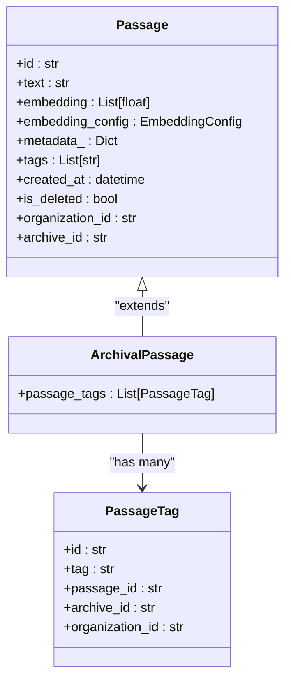
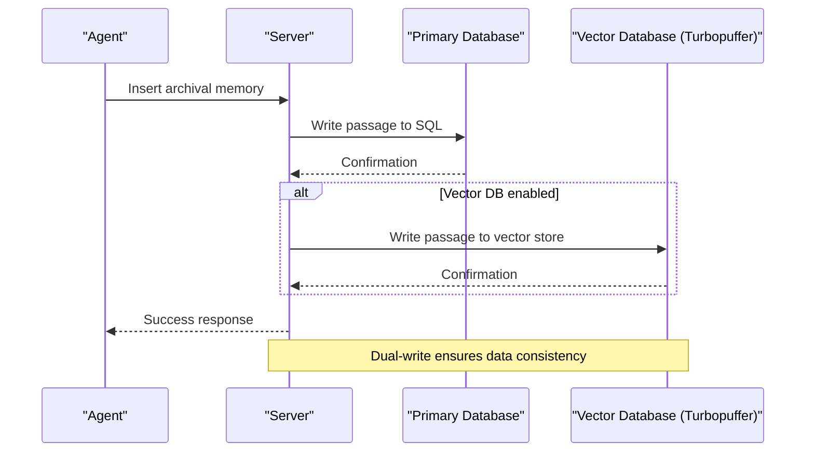
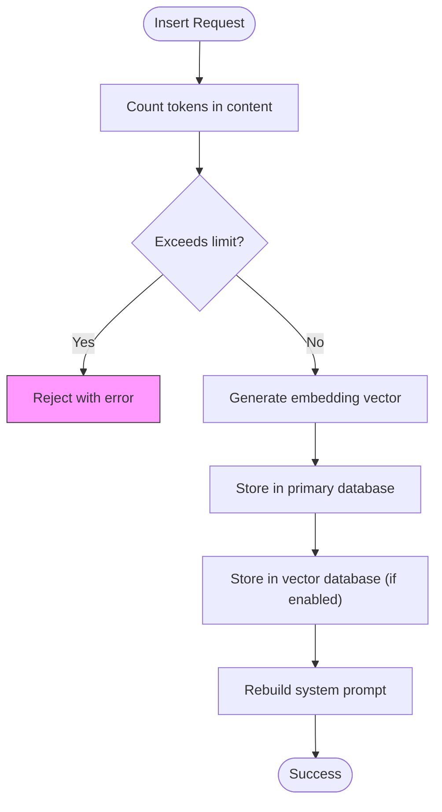
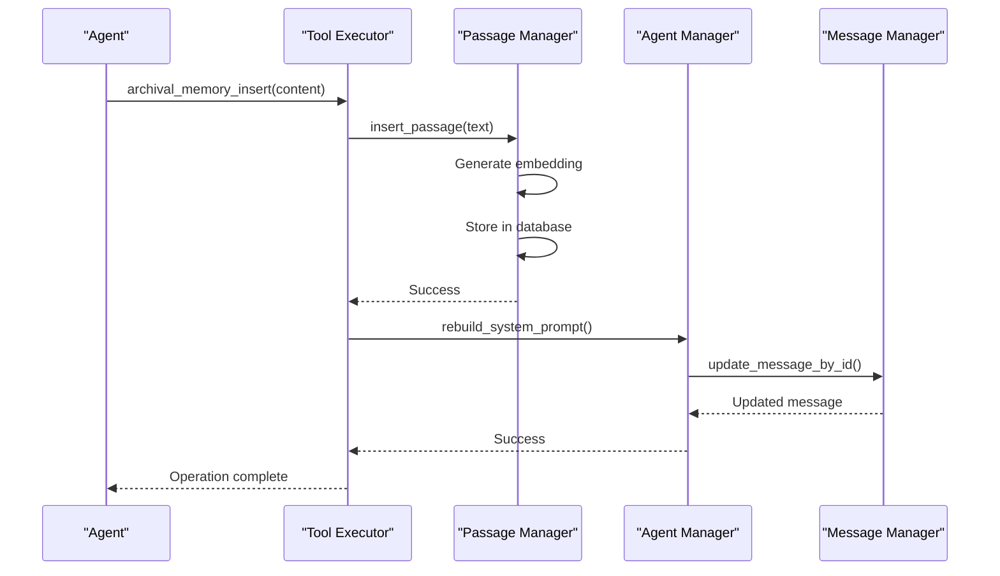
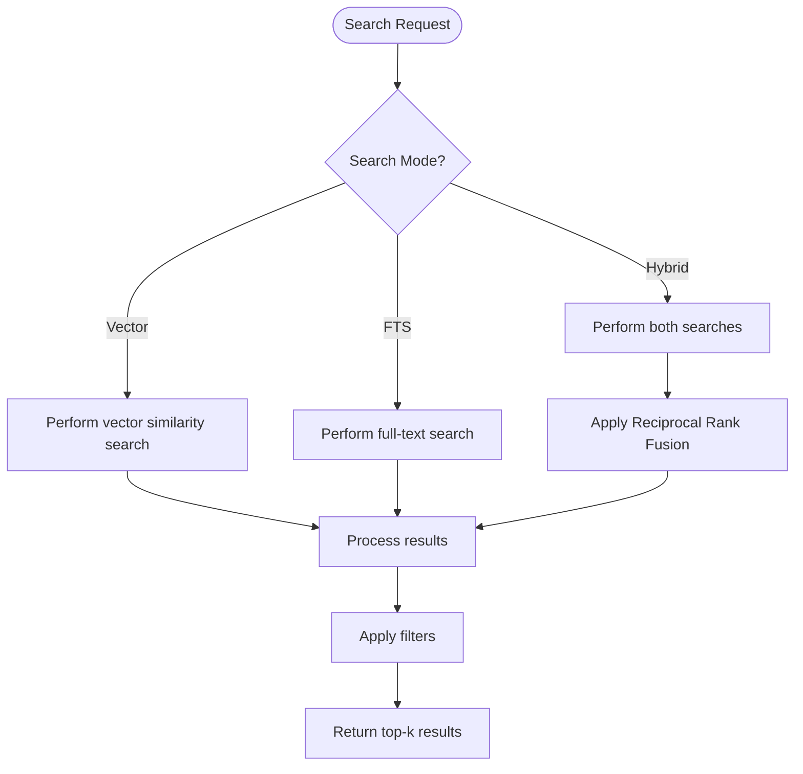
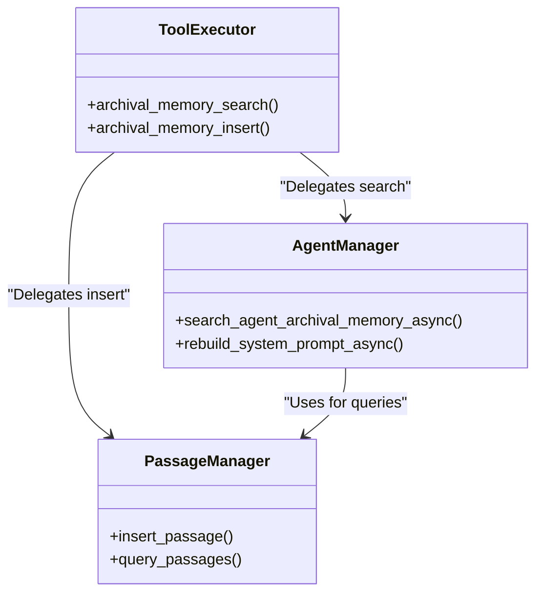

# Archival Memory

<cite>
**Referenced Files in This Document**   
- [passage.py](file://letta/orm/passage.py)
- [passage.py](file://letta/schemas/passage.py)
- [passage_manager.py](file://letta/services/passage_manager.py)
- [tpuf_client.py](file://letta/helpers/tpuf_client.py)
- [archive_manager.py](file://letta/services/archive_manager.py)
- [server.py](file://letta/server/server.py)
- [core_tool_executor.py](file://letta/services/tool_executor/core_tool_executor.py)
- [agents.py](file://letta/server/rest_api/routers/v1/agents.py)
- [constants.py](file://letta/constants.py)
- [settings.py](file://letta/settings.py)
- [memgpt_chat.py](file://letta/prompts/system_prompts/memgpt_chat.py)
- [prompt_generator.py](file://letta/prompts/prompt_generator.py)
</cite>

## Table of Contents
1. [Introduction](#introduction)
2. [Data Model](#data-model)
3. [Dual-Write Architecture](#dual-write-architecture)
4. [Insertion Process](#insertion-process)
5. [Search Functionality](#search-functionality)
6. [System Integration](#system-integration)
7. [Scalability and Performance](#scalability-and-performance)
8. [Conclusion](#conclusion)

## Introduction

Archival Memory in Letta provides a persistent, infinite-capacity storage system for long-term information that extends beyond the agent's immediate context window. Unlike core memory which is always visible, archival memory requires explicit retrieval operations to access stored content. This documentation details the implementation of archival memories as Passage entities stored in a vector database, covering the data model, dual-write architecture, insertion and search processes, and integration with the broader system.

The archival memory system enables agents to store reflections, insights, and other important data that doesn't fit into core memory but is essential for long-term retention. Agents interact with archival memory through dedicated tools like `archival_memory_insert` and `archival_memory_search`, allowing them to persistently store and retrieve information as needed during conversations.

**Section sources**
- [memgpt_chat.py](file://letta/prompts/system_prompts/memgpt_chat.py#L52-L60)
- [prompt_generator.py](file://letta/prompts/prompt_generator.py#L34-L54)

## Data Model

The archival memory system is implemented using Passage entities that store text content, embedding vectors, metadata, and timestamps. The data model is designed to support efficient semantic search and retrieval operations while maintaining data integrity and relationships.

### Core Passage Structure

The Passage entity serves as the fundamental unit of archival memory storage, with the following key fields:

- **text**: The actual content of the passage, stored as a string
- **embedding**: Vector representation of the text for semantic search, stored as a list of floats
- **embedding_config**: Configuration details for the embedding model used to generate the vector
- **metadata_**: Additional metadata stored as JSON, allowing for flexible data storage
- **tags**: List of string tags for categorization and filtering
- **created_at**: Timestamp indicating when the passage was created (UTC timezone)
- **is_deleted**: Boolean flag for soft deletion
- **organization_id**: Identifier linking the passage to an organization
- **archive_id**: Identifier linking the passage to a specific archive

**Diagram sources **
- [passage.py](file://letta/orm/passage.py#L75-L104)
- [passage.py](file://letta/schemas/passage.py#L35-L95)

### Dual Storage for Tags

To optimize query performance, tags are stored using a dual-storage approach:

1. **JSON Column**: The `tags` field in the Passage entity stores tags as a JSON array for fast retrieval of individual passages
2. **Junction Table**: The `passage_tags` relationship uses a dedicated `PassageTag` table for efficient DISTINCT queries and tag-based filtering

This design allows for both fast retrieval of passage data with its associated tags and efficient querying across tags for search operations. The junction table enables complex tag matching operations (ANY or ALL modes) without requiring full-text scans of JSON data.

**Section sources**
- [passage.py](file://letta/orm/passage.py#L31-L32)
- [passage.py](file://letta/orm/passage.py#L80-L83)

## Dual-Write Architecture

Letta implements a dual-write architecture that synchronizes passages between the primary database and external vector stores when enabled. This architecture ensures data consistency while leveraging the specialized capabilities of external vector databases for high-performance semantic search.

### Primary Database Storage

All archival passages are first written to the primary relational database (PostgreSQL, SQLite, or other supported databases). This serves as the system of record and ensures data durability and transactional consistency. The primary database stores:

- Complete passage data including text, metadata, and timestamps
- Relationships to agents, organizations, and archives
- Indexes for efficient querying by various attributes

### External Vector Store Integration

When configured, Letta also writes passages to external vector databases like Turbopuffer. This dual-write approach provides several benefits:

- **Enhanced Search Performance**: External vector databases are optimized for high-speed similarity search operations
- **Scalability**: Distributed vector stores can handle larger document collections and higher query volumes
- **Specialized Features**: External stores may offer advanced search capabilities not available in the primary database

The dual-write process is implemented in the `archive_manager.py` and `passage_manager.py` services, which coordinate writes to both storage systems.

**Diagram sources **
- [archive_manager.py](file://letta/services/archive_manager.py#L338-L360)
- [passage_manager.py](file://letta/services/passage_manager.py#L494-L525)

### Write Consistency and Error Handling

The dual-write architecture prioritizes data consistency with the following error handling strategy:

- **Primary Database First**: Passages are always written to the primary database first
- **Best-Effort Vector Store Write**: If the vector store write fails, the operation continues as long as the primary database write succeeds
- **Asynchronous Error Logging**: Vector store failures are logged but don't prevent the overall operation from succeeding

This approach ensures that data is never lost due to external service failures while still providing the benefits of enhanced search capabilities when the vector store is available.

**Section sources**
- [archive_manager.py](file://letta/services/archive_manager.py#L338-L360)
- [tpuf_client.py](file://letta/helpers/tpuf_client.py#L137-L225)

## Insertion Process

The archival memory insertion process involves several steps to ensure data quality, proper indexing, and system integration. This process is triggered when an agent calls the `archival_memory_insert` tool or through API endpoints.

### Token Counting and Validation

Before insertion, the system validates the content against size limits to prevent excessive context consumption:

The token limit is configured via the `archival_memory_token_limit` setting, which defaults to 8192 tokens. This limit prevents agents from consuming excessive context space with archival content.

**Section sources**
- [server.py](file://letta/server/server.py#L672-L678)
- [settings.py](file://letta/settings.py#L352)

### Embedding Generation and Storage

The insertion process includes generating vector embeddings for semantic search capabilities:

1. **Text Chunking**: Large texts are automatically chunked using the `DEFAULT_EMBEDDING_CHUNK_SIZE` (300 tokens by default)
2. **Embedding Generation**: Each chunk is converted to a vector using the configured embedding model
3. **Dimension Padding**: For PostgreSQL with pgvector, embeddings are padded to `MAX_EMBEDDING_DIM` (4096) to ensure consistent vector sizes
4. **Storage**: Both the original text and embedding vector are stored in the database

The embedding configuration is preserved with each passage, allowing for proper handling of different embedding models and dimensions.

**Section sources**
- [passage_manager.py](file://letta/services/passage_manager.py#L156-L168)
- [constants.py](file://letta/constants.py#L72-L73)

### System Prompt Rebuilding

After successful insertion, the system automatically rebuilds the agent's system prompt to reflect the updated memory state:

- **Memory Metadata Update**: The count of archival memories is updated in the memory metadata block
- **Available Tags Update**: New tags from the inserted passage are added to the list of available tags
- **Diff-Based Updates**: Only changed portions of the system prompt are updated to minimize database operations

This ensures that the agent is aware of its updated memory state and can make informed decisions about future memory operations.

**Diagram sources **
- [core_tool_executor.py](file://letta/services/tool_executor/core_tool_executor.py#L308-L318)
- [agent.py](file://letta/agents/base_agent.py#L157-L177)

## Search Functionality

The archival memory search functionality supports multiple search modes and filtering options to enable flexible information retrieval.

### Search Modes

The system supports three primary search modes:

- **Vector Search**: Semantic search using embedding similarity (cosine distance)
- **Full-Text Search (FTS)**: Keyword-based search using text content
- **Hybrid Search**: Combined vector and FTS results using Reciprocal Rank Fusion (RRF)

**Section sources**
- [tpuf_client.py](file://letta/helpers/tpuf_client.py#L490-L571)

### Filtering Capabilities

Search results can be filtered using multiple criteria:

- **Tag Filtering**: Passages can be filtered by tags using 'any' or 'all' match modes
- **Time Range Constraints**: Results can be limited to passages created within a specific date range
- **Organization and Archive Scope**: Results are automatically scoped to the requesting organization and archive

The tag filtering implementation uses a dual approach:
- For 'any' mode: `ContainsAny` operator to match passages with any of the specified tags
- For 'all' mode: `And` operator with multiple `Contains` conditions to ensure all tags are present

**Section sources**
- [tpuf_client.py](file://letta/helpers/tpuf_client.py#L516-L529)
- [agents.py](file://letta/server/rest_api/routers/v1/agents.py#L1227-L1229)

### Result Ranking and Top-K Retrieval

Search results are ranked and limited to the top-k most relevant passages:

- **Vector Search**: Results are ranked by similarity score (lower cosine distance = higher relevance)
- **FTS Search**: Results are ranked by text relevance score
- **Hybrid Search**: Results are combined using Reciprocal Rank Fusion with configurable weights

The top-k parameter allows clients to control the number of results returned, with a default value determined by system configuration.

**Section sources**
- [tpuf_client.py](file://letta/helpers/tpuf_client.py#L573-L596)
- [agents.py](file://letta/server/rest_api/routers/v1/agents.py#L1230)

## System Integration

The archival memory system is integrated throughout Letta's architecture, from agent tools to API endpoints.

### Tool Executor Integration

Agents interact with archival memory through dedicated tools in the tool executor:

- **archival_memory_insert**: Allows agents to store new memories
- **archival_memory_search**: Enables agents to retrieve stored memories

These tools are part of the base tool set and are automatically available to agents. The tool executor handles the underlying service calls and ensures proper error handling.

**Diagram sources **
- [core_tool_executor.py](file://letta/services/tool_executor/core_tool_executor.py#L279-L318)
- [agent_manager.py](file://letta/services/agent_manager.py)

### API Endpoints

The system exposes REST API endpoints for external integration:

- **POST /{agent_id}/archival-memory**: Insert new archival memories
- **GET /{agent_id}/archival-memory/search**: Search archival memories

These endpoints validate inputs, handle authentication, and delegate to the appropriate service layers. The API supports all search features including tag filtering, time ranges, and hybrid search modes.

**Section sources**
- [agents.py](file://letta/server/rest_api/routers/v1/agents.py#L1200-L1214)
- [agents.py](file://letta/server/rest_api/routers/v1/agents.py#L1217-L1237)

### Memory Metadata in System Prompts

The system automatically maintains metadata about archival memory in the agent's system prompt:

- **Memory Count**: Total number of archival memories
- **Available Tags**: List of all tags used in archival memories
- **Last Modified Timestamp**: When memories were last updated

This metadata helps agents make informed decisions about memory usage without needing to query the system directly.

**Section sources**
- [prompt_generator.py](file://letta/prompts/prompt_generator.py#L34-L54)
- [memgpt_chat.py](file://letta/prompts/system_prompts/memgpt_chat.py#L52-L56)

## Scalability and Performance

The archival memory system includes several optimizations to handle large document collections and maintain performance.

### Indexing Strategies

The database schema includes multiple indexes to optimize common query patterns:

- **Composite Index**: On `organization_id` and `archive_id` for efficient scope-based queries
- **Created At Index**: On `created_at` and `id` for time-range queries
- **Archive ID Index**: On `archive_id` for archive-specific operations
- **Junction Table Indexes**: On tag-related fields for efficient tag-based filtering

These indexes ensure that search and retrieval operations remain performant even with large datasets.

**Section sources**
- [passage.py](file://letta/orm/passage.py#L91-L97)

### Caching Layers

The system implements multiple caching layers to reduce database load:

- **Redis Caching**: Frequently accessed passages and metadata are cached in Redis
- **In-Memory Caching**: Recently used data is kept in application memory
- **Embedding Caching**: Generated embeddings are cached to avoid redundant computation

These caching layers significantly improve response times for repeated queries and common operations.

### Concurrency Control

The system uses semaphores to control concurrency and prevent resource exhaustion:

- **Global Turbopuffer Semaphore**: Limits concurrent writes to the external vector store
- **Embedding Generation Semaphore**: Controls the number of parallel embedding operations
- **Database Connection Pooling**: Manages database connections efficiently

These controls ensure stable performance under high load and prevent the system from overwhelming external services.

**Section sources**
- [tpuf_client.py](file://letta/helpers/tpuf_client.py#L19-L20)

## Conclusion

The Archival Memory system in Letta provides a robust, scalable solution for long-term information storage and retrieval. By implementing Passage entities with rich metadata and vector embeddings, the system enables sophisticated search capabilities while maintaining data integrity.

The dual-write architecture ensures data consistency between the primary database and external vector stores, providing both durability and high-performance search. The insertion process includes comprehensive validation, embedding generation, and automatic system prompt updates to maintain a consistent agent state.

With support for semantic search, tag-based filtering, time-range constraints, and hybrid search modes, the system offers flexible information retrieval capabilities. Integration with agent tools, API endpoints, and system prompts makes archival memory a seamless part of the agent's cognitive architecture.

For large-scale deployments, the system's indexing strategies, caching layers, and concurrency controls ensure maintainable performance even with extensive document collections. This comprehensive design makes Archival Memory a powerful component of Letta's overall memory management system.