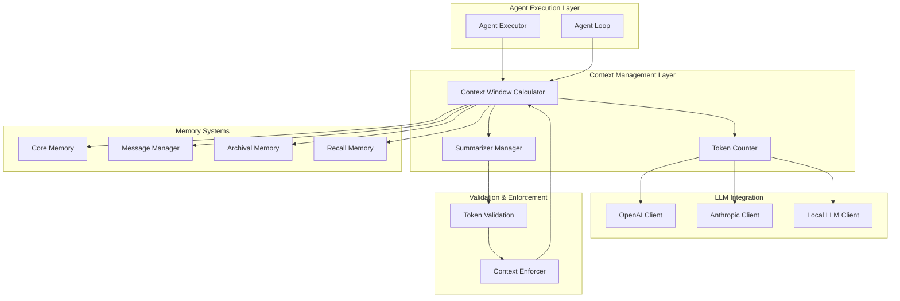
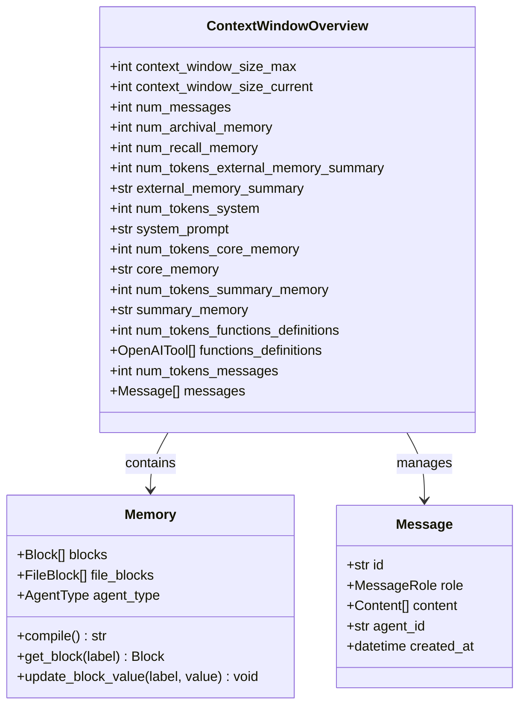
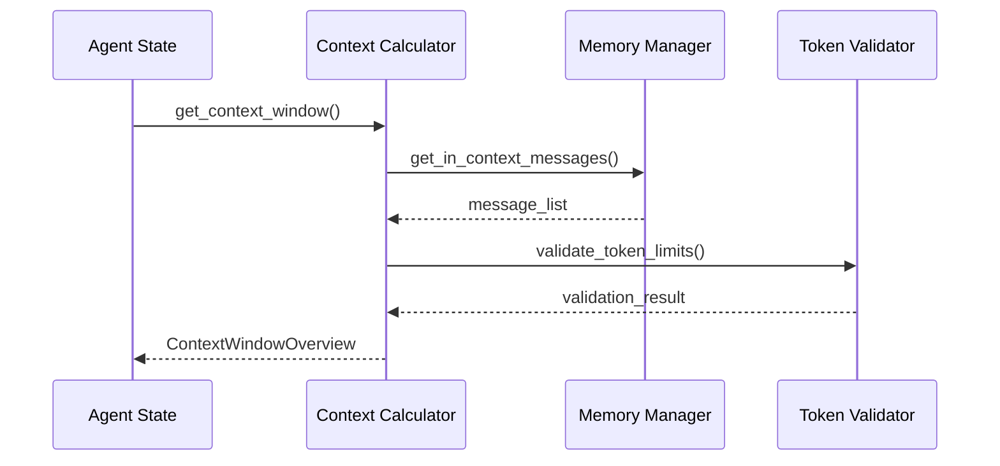
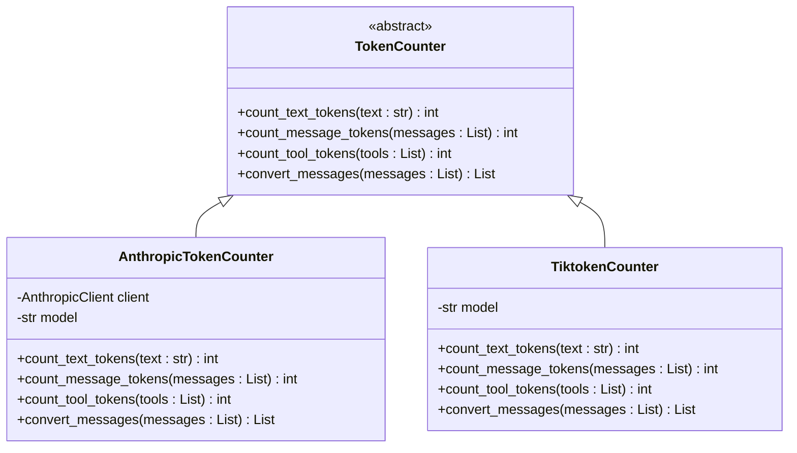
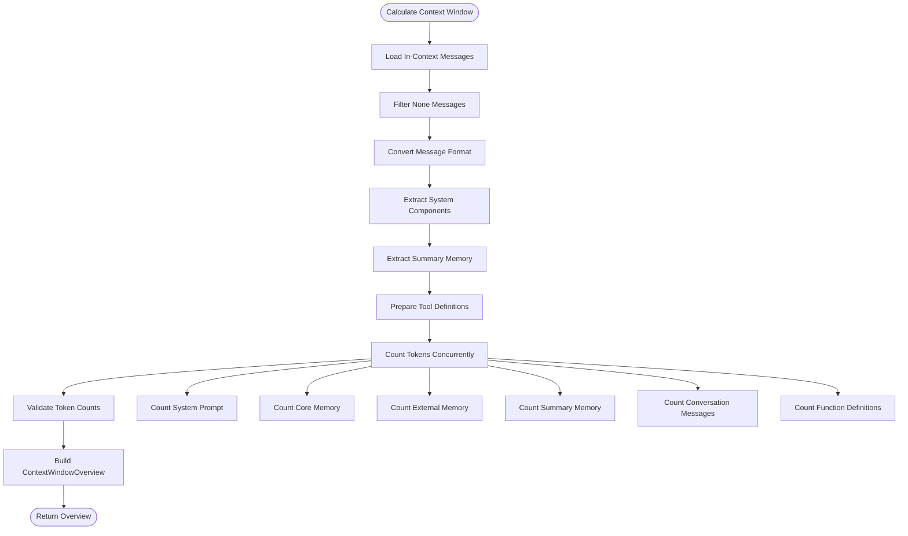
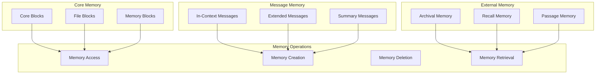
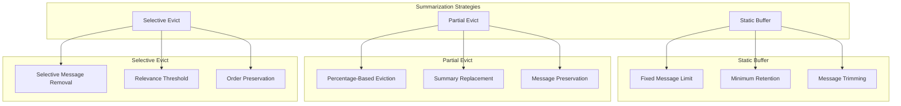
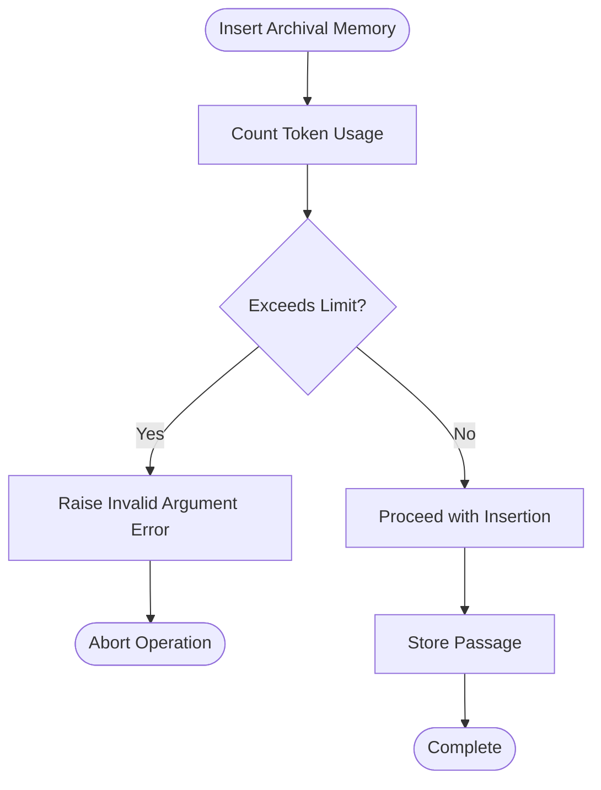
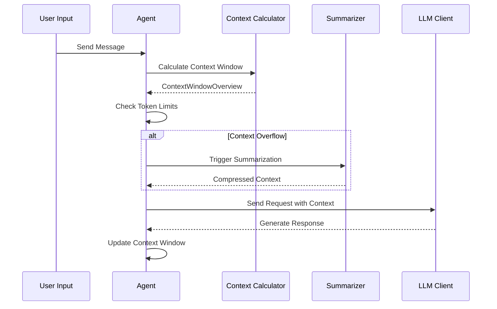

# Context Window Management

<cite>
**Referenced Files in This Document**
- [context_window_calculator.py](file://letta/services/context_window_calculator/context_window_calculator.py)
- [token_counter.py](file://letta/services/context_window_calculator/token_counter.py)
- [memory.py](file://letta/memory.py)
- [summarizer.py](file://letta/services/summarizer/summarizer.py)
- [agent.py](file://letta/agent.py)
- [letta_agent_v3.py](file://letta/agents/letta_agent_v3.py)
- [server.py](file://letta/server/server.py)
- [settings.py](file://letta/settings.py)
- [memory.py](file://letta/schemas/memory.py)
- [agent_loop.py](file://letta/agents/agent_loop.py)
</cite>

## Table of Contents
1. [Introduction](#introduction)
2. [System Architecture Overview](#system-architecture-overview)
3. [Core Components](#core-components)
4. [Token Counter Module](#token-counter-module)
5. [Context Window Calculator](#context-window-calculator)
6. [Memory Management](#memory-management)
7. [Summarization Strategies](#summarization-strategies)
8. [Validation and Enforcement](#validation-and-enforcement)
9. [Agent Execution Flow](#agent-execution-flow)
10. [Performance Considerations](#performance-considerations)
11. [Optimization Strategies](#optimization-strategies)
12. [Troubleshooting Guide](#troubleshooting-guide)
13. [Conclusion](#conclusion)

## Introduction

Letta's Context Window Management system is a sophisticated framework designed to efficiently manage and optimize the agent's conversational context while respecting token limits imposed by LLM providers. The system ensures that agents can maintain meaningful conversations over extended periods by intelligently managing memory, implementing summarization strategies, and enforcing token usage constraints across multiple memory systems.

The context window encompasses several critical components: core memory (persistent context), message history (conversation context), archival memory (long-term storage), and recall memory (recent interactions). The system must balance these components to maximize conversational effectiveness while staying within the computational limits of the underlying language model.

## System Architecture Overview

The Context Window Management system follows a modular architecture with clear separation of concerns:

**Diagram sources**
- [context_window_calculator.py](file://letta/services/context_window_calculator/context_window_calculator.py#L19-L203)
- [token_counter.py](file://letta/services/context_window_calculator/token_counter.py#L14-L161)
- [summarizer.py](file://letta/services/summarizer/summarizer.py#L33-L598)

## Core Components

### ContextWindowOverview Schema

The system centers around the `ContextWindowOverview` schema, which provides a comprehensive breakdown of context usage:

**Diagram sources**
- [memory.py](file://letta/schemas/memory.py#L22-L54)
- [memory.py](file://letta/schemas/memory.py#L56-L308)

**Section sources**
- [memory.py](file://letta/schemas/memory.py#L22-L54)

### Agent State Integration

The context window system integrates deeply with agent state management, tracking message buffers, summarization preferences, and memory constraints:

**Diagram sources**
- [agent.py](file://letta/agent.py#L1204-L1595)
- [context_window_calculator.py](file://letta/services/context_window_calculator/context_window_calculator.py#L99-L202)

**Section sources**
- [agent.py](file://letta/agent.py#L1204-L1595)

## Token Counter Module

The token counter module provides a unified interface for counting tokens across different LLM providers, handling the complexities of various tokenization schemes.

### Abstract TokenCounter Interface

The system defines an abstract base class that all token counter implementations must follow:

**Diagram sources**
- [token_counter.py](file://letta/services/context_window_calculator/token_counter.py#L14-L161)

### Provider-Specific Implementations

#### Anthropic Token Counter

The Anthropic token counter leverages the official Anthropic API for precise token counting:

**Key Features:**
- Real-time token counting via Anthropic's API
- Redis caching for performance optimization
- Automatic retry mechanisms for API failures
- Model-specific tokenization accuracy

**Implementation Details:**
- Uses `count_tokens` API endpoint for accurate counting
- Implements intelligent caching with SHA256 hashing
- Supports tool definition counting for function calling
- Handles message format conversion for Anthropic models

#### Tiktoken Token Counter

The Tiktoken counter provides efficient local token counting for OpenAI-compatible models:

**Key Features:**
- Local token counting for improved performance
- Built-in caching with configurable TTL
- Support for multiple OpenAI model variants
- Graceful error handling and logging

**Implementation Details:**
- Leverages tiktoken library for accurate counting
- Thread-safe operations with async caching
- Optimized for high-throughput scenarios
- Comprehensive error reporting and debugging

**Section sources**
- [token_counter.py](file://letta/services/context_window_calculator/token_counter.py#L14-L161)

## Context Window Calculator

The Context Window Calculator orchestrates the complex process of calculating and managing context window usage across all memory systems.

### Calculation Workflow

The calculator follows a systematic approach to context window calculation:

**Diagram sources**
- [context_window_calculator.py](file://letta/services/context_window_calculator/context_window_calculator.py#L99-L202)

### System Component Extraction

The calculator extracts structured components from the system message to provide granular token tracking:

**Component Breakdown:**
- **Base Instructions**: Core system prompt and agent instructions
- **Memory Blocks**: Agent's core memory (persistent context)
- **Memory Metadata**: External memory system summaries

**Extraction Logic:**
The system uses XML-style tag detection to parse the formatted system message, enabling precise token counting for each component.

### Summary Memory Detection

The calculator implements sophisticated logic to detect and handle summary memory:

**Detection Criteria:**
- Message at index 1 containing "The following is a summary of the previous"
- User role with single text content
- Specific text pattern indicating summary content

**Processing Flow:**
When summary memory is detected, the calculator adjusts the message processing to account for the condensed conversation history, ensuring accurate token counting and context preservation.

**Section sources**
- [context_window_calculator.py](file://letta/services/context_window_calculator/context_window_calculator.py#L19-L202)

## Memory Management

Letta's memory management system provides multiple layers of memory storage, each serving different purposes in the conversation context.

### Memory Architecture

**Diagram sources**
- [memory.py](file://letta/schemas/memory.py#L56-L308)

### Memory Types and Purposes

#### Core Memory
Core memory serves as the agent's persistent context, maintained across conversations and sessions. It consists of labeled memory blocks that store essential information about the agent's personality, goals, and operational context.

**Features:**
- Persistent across sessions
- Labeled memory blocks for organization
- Character limits for each block
- Editable via memory manipulation functions

#### Message Memory
Message memory tracks the conversation history, with different strategies for managing historical context:

**Strategies:**
- **Static Buffer**: Fixed-size message buffer with configurable limits
- **Partial Evict**: Percentage-based message eviction
- **Autoclear**: Clear message history based on configuration

#### External Memory Systems
External memory systems provide scalable storage for large amounts of information:

**Archival Memory:**
- Infinite size storage
- Semantic search capabilities
- Tag-based organization
- Retrieval-on-demand

**Recall Memory:**
- Recent message storage
- Fast access to recent interactions
- Configurable retention policies

**Section sources**
- [memory.py](file://letta/schemas/memory.py#L56-L308)

## Summarization Strategies

The system implements multiple summarization strategies to manage context window overflow and maintain conversation continuity.

### Summarization Modes

**Diagram sources**
- [summarizer.py](file://letta/services/summarizer/summarizer.py#L33-L598)

### Static Buffer Summarization

The static buffer strategy maintains a fixed-size message buffer with configurable limits:

**Algorithm:**
1. Combine existing context messages with new messages
2. If total messages ≤ buffer limit and not forced, return unchanged
3. Calculate how many messages to retain (0 if clear=True, otherwise message_buffer_min)
4. Find the trim index to keep the most recent messages while preserving user message boundaries
5. Evict older messages (everything between system message and trim index)
6. Trigger background summarization of evicted messages
7. Return updated context with system message + retained recent messages

### Partial Evict Summarization

The partial evict strategy removes a percentage of messages and replaces them with a summary:

**Process:**
1. Determine target message count based on percentage
2. Find assistant message boundary for summary placement
3. Generate summary of messages to be evicted
4. Insert summary message at appropriate position
5. Update context with preserved messages

### Summarization Implementation

The summarization system includes robust error handling and fallback mechanisms:

**Fallback Strategies:**
1. **Clamping**: Reduce tool return sizes to fit within context
2. **Truncation**: Middle-truncate transcripts to meet character limits
3. **Compression**: Apply multiple compression techniques progressively

**Section sources**
- [summarizer.py](file://letta/services/summarizer/summarizer.py#L33-L598)

## Validation and Enforcement

The system implements comprehensive validation mechanisms to prevent context overflow and ensure system stability.

### Archival Memory Token Limit

The archival memory system enforces strict token limits to prevent excessive memory usage:

**Diagram sources**
- [server.py](file://letta/server/server.py#L672-L688)

### Context Window Validation

The system performs continuous validation of context window usage:

**Validation Checks:**
- **Token Count Validation**: Ensures total tokens don't exceed model limits
- **Memory Warning Threshold**: Alerts when approaching limits
- **Summarization Triggers**: Initiates summarization when thresholds are reached
- **Overflow Protection**: Prevents context window overflow errors

### Memory Constraint Enforcement

Memory blocks enforce character limits and provide validation:

**Constraint Types:**
- **Character Limits**: Per-block character restrictions
- **Read-Only Blocks**: Immutable memory sections
- **Dynamic Limits**: Adjustable block sizes based on content

**Section sources**
- [server.py](file://letta/server/server.py#L672-L688)
- [settings.py](file://letta/settings.py#L60-L99)

## Agent Execution Flow

The agent execution flow demonstrates how context window management integrates with the broader agent lifecycle.

### Step Execution with Context Management

**Diagram sources**
- [letta_agent_v3.py](file://letta/agents/letta_agent_v3.py#L88-L200)
- [agent.py](file://letta/agent.py#L768-L1116)

### Context Window Construction

During agent execution, the system constructs the context window by combining multiple memory sources:

**Construction Process:**
1. **System Prompt**: Base instructions and agent configuration
2. **Core Memory**: Persistent agent context and personality
3. **Message History**: Recent conversation exchanges
4. **Archival Memory**: Retrieved long-term information
5. **Function Definitions**: Available tools and capabilities

### Dynamic Context Adjustment

The system dynamically adjusts the context window based on usage patterns:

**Adjustment Mechanisms:**
- **Proactive Summarization**: Triggers before reaching limits
- **Adaptive Compression**: Adjusts compression ratios based on usage
- **Priority Preservation**: Maintains critical information during compression

**Section sources**
- [letta_agent_v3.py](file://letta/agents/letta_agent_v3.py#L88-L200)
- [agent.py](file://letta/agent.py#L768-L1116)

## Performance Considerations

Context window management involves several performance-critical operations that require careful optimization.

### Token Counting Performance

**Optimization Strategies:**
- **Caching**: Redis-based caching for frequently counted texts
- **Concurrent Processing**: Parallel token counting for different components
- **Lazy Evaluation**: Deferred counting until absolutely necessary
- **Batch Operations**: Grouping related operations for efficiency

### Memory Management Efficiency

**Storage Optimization:**
- **Compression**: Text compression for archival storage
- **Indexing**: Efficient retrieval mechanisms for large datasets
- **Garbage Collection**: Automatic cleanup of unused memory
- **Streaming**: Incremental processing for large contexts

### Network Latency Mitigation

**API Optimization:**
- **Connection Pooling**: Reuse connections for LLM requests
- **Retry Logic**: Intelligent retry mechanisms for API failures
- **Timeout Management**: Configurable timeouts for different operations
- **Fallback Mechanisms**: Alternative processing when primary APIs fail

## Optimization Strategies

### Context Utilization Optimization

The system employs several strategies to maximize context utilization:

**Content Prioritization:**
- **Relevance Scoring**: Rank content by conversational importance
- **Temporal Decay**: Reduce weight of older information
- **Frequency Analysis**: Prioritize frequently accessed content
- **User Interaction Patterns**: Adapt to individual user habits

### Summarization Optimization

**Quality vs. Efficiency Trade-offs:**
- **Adaptive Compression**: Adjust compression ratios based on content type
- **Selective Summarization**: Focus on less important conversation segments
- **Incremental Summarization**: Build summaries incrementally
- **Parallel Processing**: Process multiple summarization tasks concurrently

### Memory Access Patterns

**Access Optimization:**
- **Predictive Loading**: Pre-load likely-to-be-accessed content
- **Prefetching**: Anticipate memory access patterns
- **Hot/Cold Separation**: Separate frequently accessed from rarely accessed content
- **Compression Ratios**: Apply different compression to different content types

## Troubleshooting Guide

### Common Context Window Issues

**Context Overflow Errors:**
- **Symptoms**: `ContextWindowExceededError` during agent execution
- **Causes**: Excessive message history, large attachments, or inefficient summarization
- **Solutions**: Increase context window limits, improve summarization efficiency, or enable autoclear mode

**Token Count Mismatches:**
- **Symptoms**: Discrepancies between reported and actual token counts
- **Causes**: Different tokenization schemes, encoding issues, or caching problems
- **Solutions**: Verify token counter configuration, clear caches, or switch providers

**Summarization Failures:**
- **Symptoms**: Summarization fails or produces poor-quality summaries
- **Causes**: Insufficient context for summarization, model limitations, or configuration issues
- **Solutions**: Adjust summarization parameters, increase context window, or modify summarization strategy

### Performance Issues

**Slow Token Counting:**
- **Symptoms**: Delays in context window calculations
- **Causes**: Large message volumes, network latency, or inefficient algorithms
- **Solutions**: Enable caching, optimize message sizes, or use local token counters

**Memory Leaks:**
- **Symptoms**: Increasing memory usage over time
- **Causes**: Unclosed connections, accumulating caches, or inefficient cleanup
- **Solutions**: Implement proper resource cleanup, monitor cache sizes, or optimize garbage collection

### Configuration Problems

**Incorrect Token Limits:**
- **Symptoms**: Unexpected context overflow or underutilization
- **Causes**: Misconfigured model limits, incorrect provider settings, or outdated configurations
- **Solutions**: Verify model specifications, update provider configurations, or reset defaults

**Section sources**
- [settings.py](file://letta/settings.py#L60-L99)

## Conclusion

Letta's Context Window Management system represents a sophisticated approach to managing conversational context in large language model agents. Through its modular architecture, the system successfully balances the competing demands of maintaining meaningful conversations, respecting computational constraints, and providing flexible memory management options.

The key strengths of the system include:

**Robust Token Management**: The dual-provider token counting system ensures accurate token counting across different LLM providers while maintaining performance through intelligent caching and concurrent processing.

**Flexible Memory Strategies**: Multiple summarization strategies allow the system to adapt to different use cases, from long-form conversations requiring minimal summarization to high-frequency interactions benefiting from aggressive compression.

**Comprehensive Validation**: The system's validation mechanisms prevent context overflow errors while providing clear feedback when adjustments are needed.

**Performance Optimization**: Through caching, parallel processing, and adaptive algorithms, the system maintains high performance even with large context windows and frequent updates.

The system's design enables agents to maintain coherent, contextually aware conversations over extended periods while respecting the computational constraints of modern LLM architectures. Future enhancements could include machine learning-based summarization quality prediction, more sophisticated content prioritization algorithms, and enhanced integration with emerging LLM capabilities.