# Core Memory Blocks

<cite>
**Referenced Files in This Document**
- [memory.py](file://letta/schemas/memory.py)
- [block.py](file://letta/schemas/block.py)
- [block.py](file://letta/orm/block.py)
- [block_manager.py](file://letta/services/block_manager.py)
- [constants.py](file://letta/constants.py)
- [blocks_agents.py](file://letta/orm/blocks_agents.py)
- [test_memory.py](file://tests/test_memory.py)
- [test_block_manager.py](file://tests/managers/test_block_manager.py)
- [agent.py](file://letta/agent.py)
- [agent_manager.py](file://letta/services/agent_manager.py)
</cite>

## Table of Contents
1. [Introduction](#introduction)
2. [Block Schema Architecture](#block-schema-architecture)
3. [BasicBlockMemory Container](#basicblockmemory-container)
4. [Core Memory Operations](#core-memory-operations)
5. [System Prompt Integration](#system-prompt-integration)
6. [Agent Configuration and Default Blocks](#agent-configuration-and-default-blocks)
7. [Multi-Agent Synchronization](#multi-agent-synchronization)
8. [Common Issues and Solutions](#common-issues-and-solutions)
9. [Best Practices](#best-practices)
10. [Performance Optimization](#performance-optimization)

## Introduction

Core Memory Blocks represent the fundamental building blocks of an agent's in-context memory in Letta. They provide a structured way to organize and maintain conversational context, persona information, and other critical data that persists throughout an agent's interaction lifecycle. Each block serves a specific purpose within the agent's memory system and can be dynamically modified during runtime.

The memory system is designed around the concept of labeled blocks that contain text content with character limits, enabling efficient token management while maintaining conversational coherence. These blocks are tightly integrated with the agent's system prompt and can be manipulated through core memory functions.

## Block Schema Architecture

### Core Block Properties

The Block schema defines the fundamental structure for all memory blocks in the system:

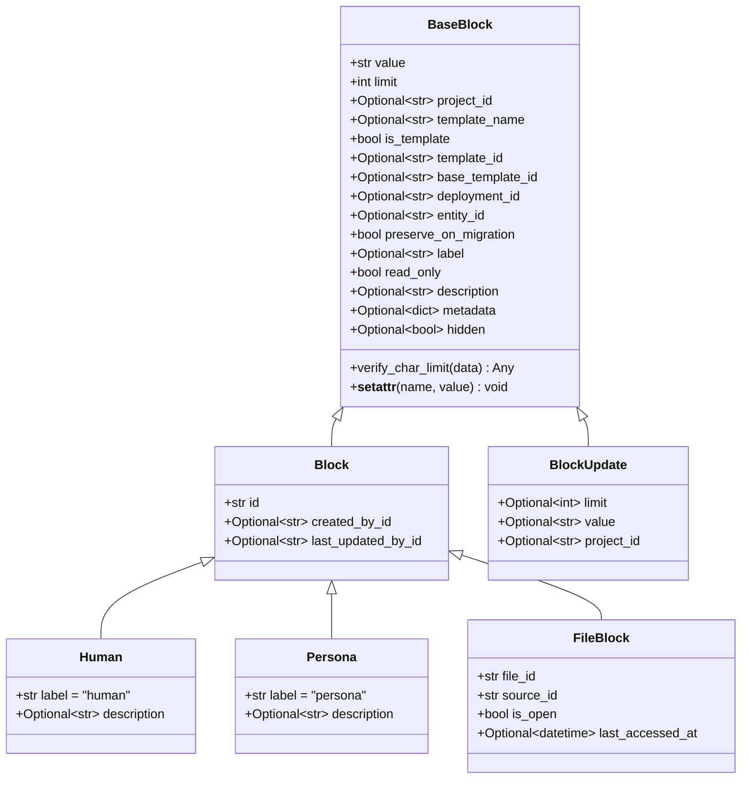

**Diagram sources**
- [block.py](file://letta/schemas/block.py#L13-L80)
- [block.py](file://letta/schemas/block.py#L81-L108)
- [block.py](file://letta/schemas/block.py#L121-L133)
- [block.py](file://letta/schemas/block.py#L137-L145)

### Block Fields and Validation

Each block contains several key fields that define its behavior and constraints:

| Field | Type | Description | Default |
|-------|------|-------------|---------|
| `value` | `str` | The actual text content stored in the block | Required |
| `limit` | `int` | Maximum character limit for the block | `20000` |
| `label` | `Optional[str]` | Unique identifier for the block section | `None` |
| `description` | `Optional[str]` | Human-readable description of the block's purpose | `None` |
| `read_only` | `bool` | Whether the block can be modified by the agent | `False` |
| `hidden` | `Optional[bool]` | Whether the block is hidden from display | `None` |
| `metadata` | `Optional[dict]` | Additional arbitrary metadata | `{}` |

**Section sources**
- [block.py](file://letta/schemas/block.py#L13-L48)
- [constants.py](file://letta/constants.py#L383)

### Character Limit Validation

The system implements robust character limit validation to prevent memory overflow:

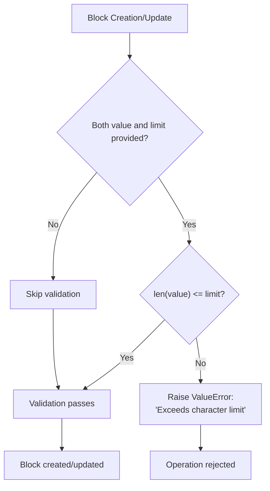

**Diagram sources**
- [block.py](file://letta/schemas/block.py#L51-L72)

**Section sources**
- [block.py](file://letta/schemas/block.py#L51-L72)

## BasicBlockMemory Container

### Memory Architecture

The BasicBlockMemory class serves as the container for managing multiple memory blocks:

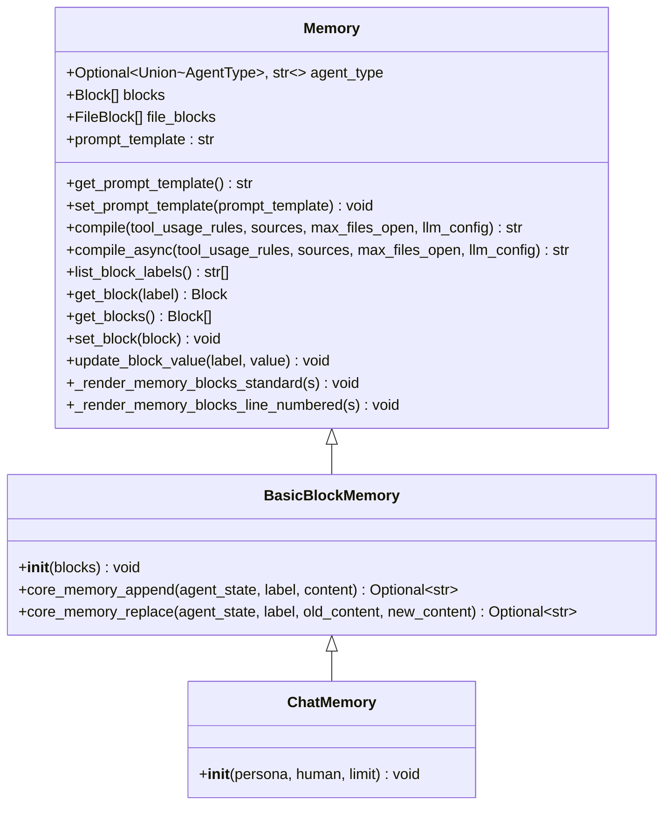

**Diagram sources**
- [memory.py](file://letta/schemas/memory.py#L56-L365)
- [memory.py](file://letta/schemas/memory.py#L366-L421)

### Block Management Methods

The BasicBlockMemory provides essential methods for manipulating memory blocks:

| Method | Purpose | Parameters | Returns |
|--------|---------|------------|---------|
| `get_blocks()` | Retrieve all blocks | None | `List[Block]` |
| `set_block(block)` | Add or update a block | `block: Block` | `void` |
| `update_block_value(label, value)` | Modify block content | `label: str, value: str` | `void` |
| `get_block(label)` | Retrieve specific block | `label: str` | `Block` |
| `list_block_labels()` | Get all block labels | None | `List[str]` |

**Section sources**
- [memory.py](file://letta/schemas/memory.py#L342-L364)

### Runtime Block Modifications

The system supports dynamic block modifications during agent execution:

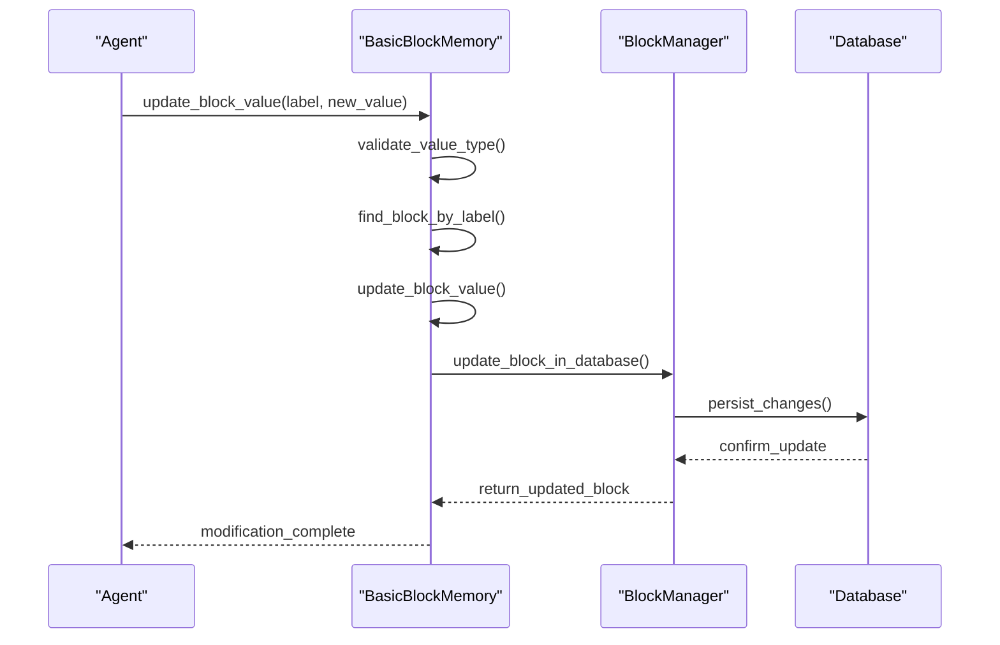

**Diagram sources**
- [memory.py](file://letta/schemas/memory.py#L354-L363)
- [block_manager.py](file://letta/services/block_manager.py#L138-L152)

**Section sources**
- [memory.py](file://letta/schemas/memory.py#L354-L363)

## Core Memory Operations

### Core Memory Functions

The BasicBlockMemory class implements specialized functions for memory manipulation:

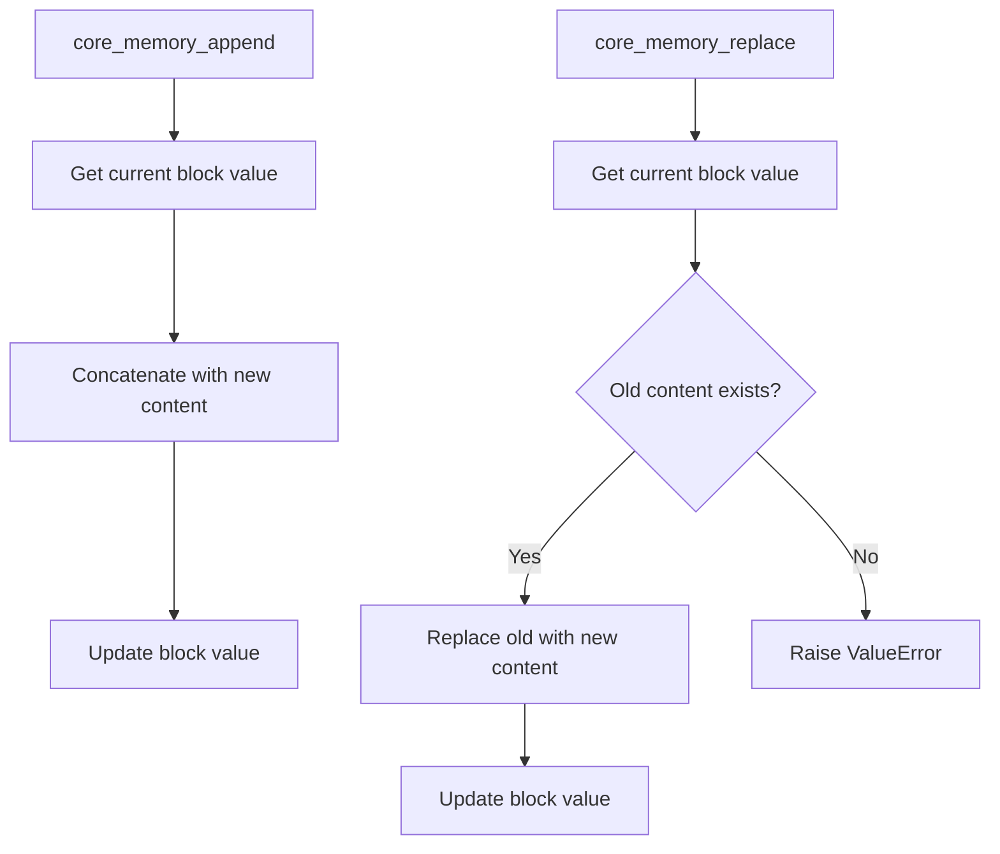

**Diagram sources**
- [memory.py](file://letta/schemas/memory.py#L386-L420)

### Memory Manipulation Examples

Here are practical examples of how core memory operations work:

**Appending Content:**
```python
# Appending to persona block
result = BasicBlockMemory.core_memory_append(
    agent_state=agent_state,
    label="persona", 
    content="I'm a helpful AI assistant focused on customer service."
)
# Result: Updates persona block with appended text
```

**Replacing Content:**
```python
# Replacing specific text in human block
result = BasicBlockMemory.core_memory_replace(
    agent_state=agent_state,
    label="human",
    old_content="Previous user detail",
    new_content="Updated user information"
)
# Result: Exact match replacement in human block
```

**Section sources**
- [memory.py](file://letta/schemas/memory.py#L386-L420)

## System Prompt Integration

### Memory Rendering Process

Core memory blocks are seamlessly integrated into the agent's system prompt through a sophisticated rendering process:

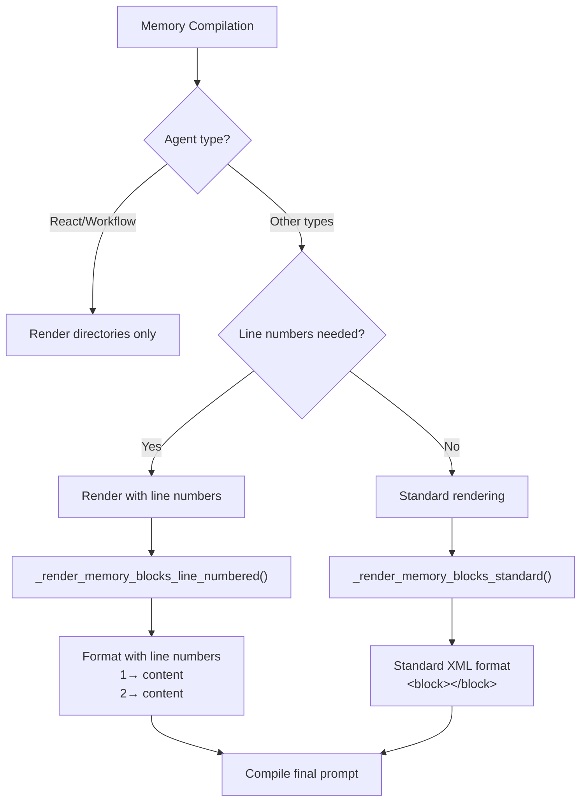

**Diagram sources**
- [memory.py](file://letta/schemas/memory.py#L271-L308)

### Memory Block Format

The system generates memory blocks in a structured XML format:

```
<memory_blocks>
The following memory blocks are currently engaged in your core memory unit:

<persona>
<description>
Stores details about your current persona, guiding how you behave and respond.
</description>
<metadata>
- read_only=false
- chars_current=120
- chars_limit=20000
</metadata>
<value>
I am a helpful AI assistant with expertise in customer service and problem resolution.
</value>
</persona>

<human>
<description>
Stores key details about the person you are conversing with.
</description>
<metadata>
- read_only=false
- chars_current=85
- chars_limit=20000
</metadata>
<value>
The user is a software engineer seeking technical assistance with Python programming.
</value>
</human>
</memory_blocks>
```

**Section sources**
- [memory.py](file://letta/schemas/memory.py#L110-L140)

### Agent Type Specific Rendering

Different agent types receive memory blocks in specialized formats:

| Agent Type | Rendering Style | Features |
|------------|----------------|----------|
| `memgpt_v2_agent` | Standard XML | Basic metadata display |
| `sleeptime_agent` | Line-numbered | Line numbers for editing assistance |
| `react_agent` | Nested format | Hierarchical block organization |
| `workflow_agent` | Directory-only | Focus on file operations |

**Section sources**
- [memory.py](file://letta/schemas/memory.py#L271-L308)

## Agent Configuration and Default Blocks

### Default Memory Blocks

Letta automatically creates default memory blocks for new agents:

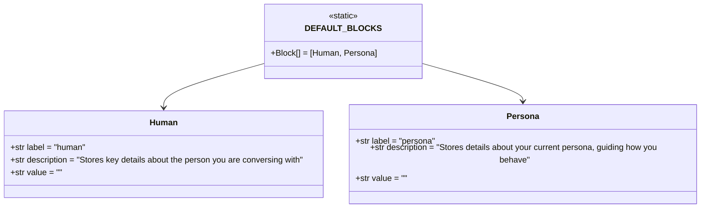

**Diagram sources**
- [block.py](file://letta/schemas/block.py#L134-L135)

### Memory Initialization Process

New agents receive default memory configuration during creation:

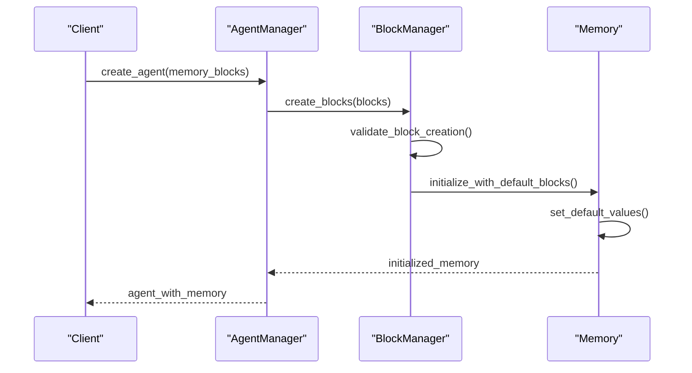

**Diagram sources**
- [agent_manager.py](file://letta/services/agent_manager.py#L1589-L1606)

### Custom Memory Configuration

Agents can be configured with custom memory blocks during initialization:

**Section sources**
- [constants.py](file://letta/constants.py#L87-L89)
- [test_managers.py](file://tests/managers/test_agent_manager.py#L417-L469)

## Multi-Agent Synchronization

### Block Sharing Mechanism

Multiple agents can share memory blocks through the blocks_agents relationship:

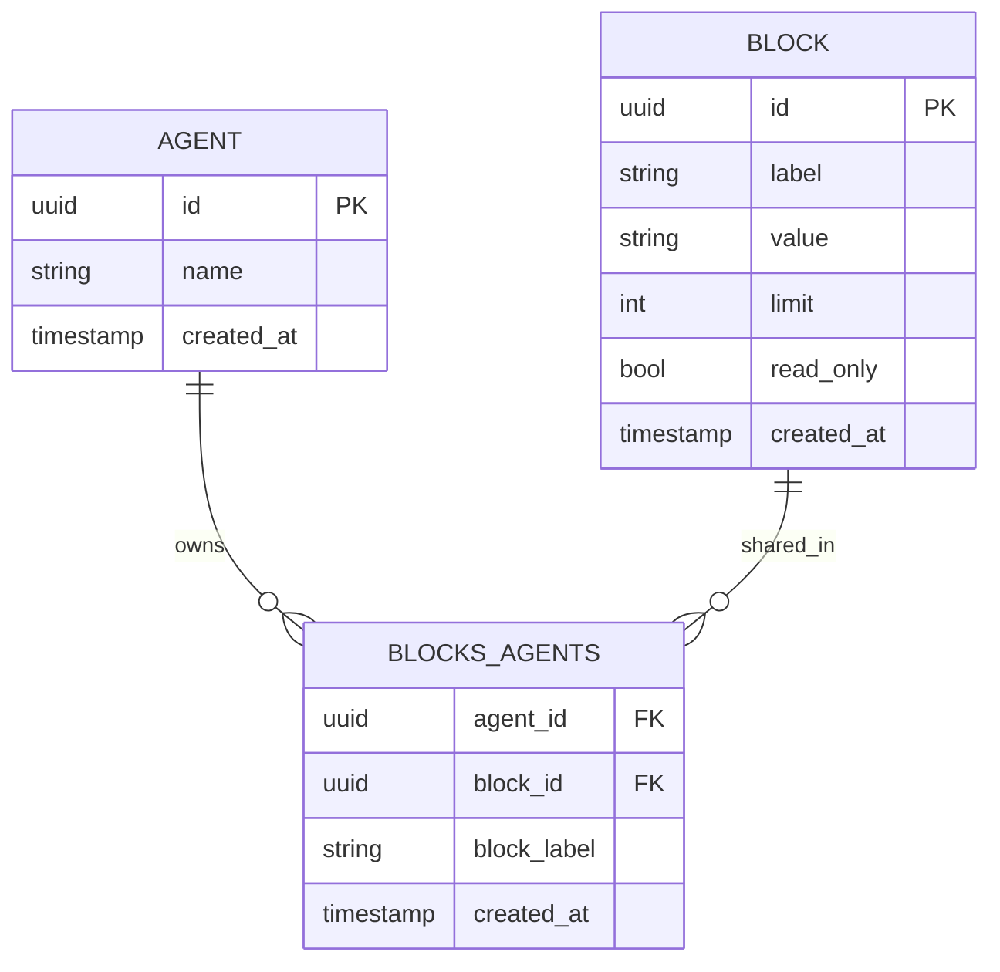

**Diagram sources**
- [blocks_agents.py](file://letta/orm/blocks_agents.py#L7-L33)

### Synchronization Challenges

Multi-agent scenarios present several synchronization challenges:

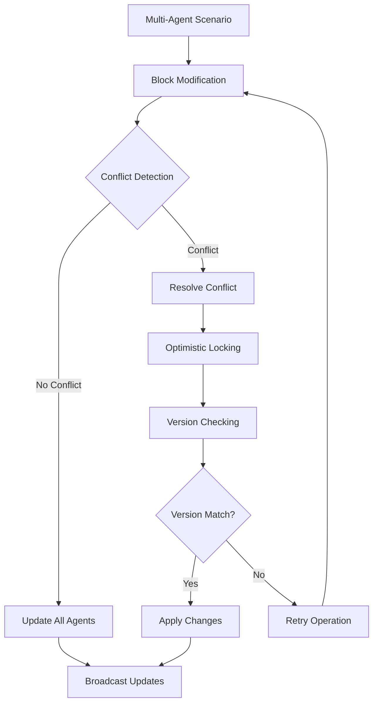

**Diagram sources**
- [blocks_agents.py](file://letta/orm/blocks_agents.py#L17-L25)

### Label Conflicts Resolution

The system prevents label conflicts through database constraints:

| Conflict Type | Prevention Method | Resolution Strategy |
|---------------|------------------|-------------------|
| Duplicate labels | Unique constraint | Block creation fails |
| Cross-agent conflicts | Cascade updates | Automatic propagation |
| Orphaned blocks | Foreign key constraints | Automatic cleanup |

**Section sources**
- [test_block_manager.py](file://tests/managers/test_block_manager.py#L156-L211)

## Common Issues and Solutions

### Type Validation Errors

The system enforces strict type validation for block operations:

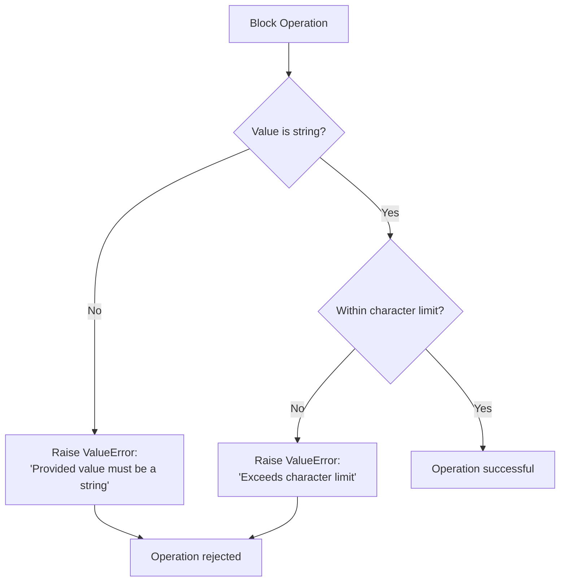

**Diagram sources**
- [memory.py](file://letta/schemas/memory.py#L356-L363)
- [block.py](file://letta/schemas/block.py#L51-L72)

### Character Limit Violations

Common character limit issues and solutions:

| Issue | Cause | Solution |
|-------|-------|----------|
| Value too long | Content exceeds block limit | Increase block limit or truncate content |
| Dynamic expansion | Appending content grows beyond limit | Monitor block usage and resize proactively |
| Template conflicts | Default blocks have insufficient limits | Customize block limits during initialization |

### Block Label Conflicts

Prevention and resolution strategies:

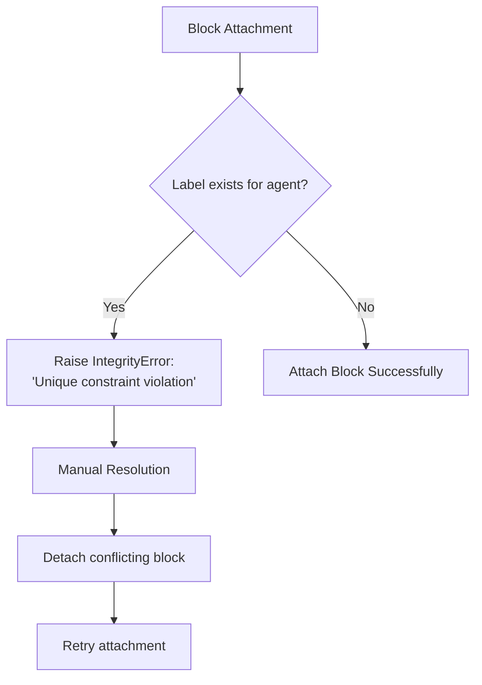

**Diagram sources**
- [test_block_manager.py](file://tests/managers/test_block_manager.py#L2641-L2647)

**Section sources**
- [test_memory.py](file://tests/test_memory.py#L38-L41)
- [test_block_manager.py](file://tests/managers/test_block_manager.py#L2641-L2647)

## Best Practices

### Memory Schema Design

Effective memory schema design follows these principles:

1. **Clear Labeling**: Use descriptive, unique labels for each block
2. **Appropriate Limits**: Set realistic character limits based on content type
3. **Purpose Alignment**: Align block descriptions with intended use cases
4. **Read-Only Protection**: Mark blocks requiring stability as read-only

### Token Efficiency Strategies

Optimize memory usage for token efficiency:

| Strategy | Implementation | Benefit |
|----------|---------------|---------|
| Content Trimming | Regular pruning of outdated information | Reduces token consumption |
| Compression Techniques | Summarize long conversations | Maintains context while saving tokens |
| Selective Loading | Load only necessary blocks | Improves performance |
| Metadata Optimization | Minimize metadata overhead | Reduces prompt size |

### Memory Maintenance

Regular maintenance practices:

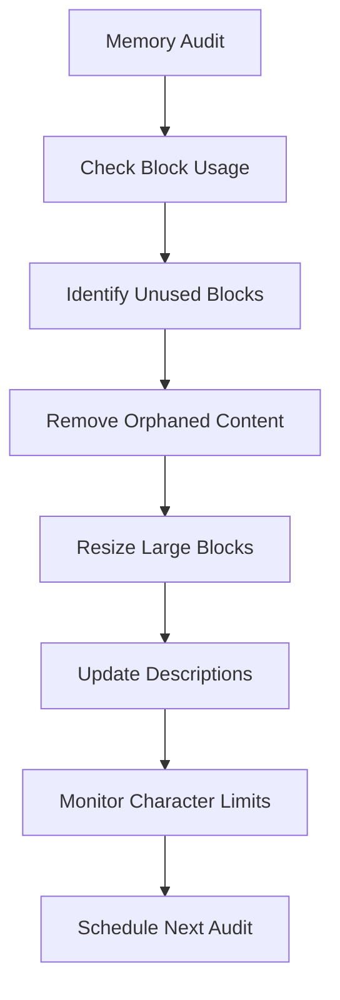

**Section sources**
- [block_manager.py](file://letta/services/block_manager.py#L36-L60)

## Performance Optimization

### Compilation Efficiency

The memory compilation process is optimized for performance:

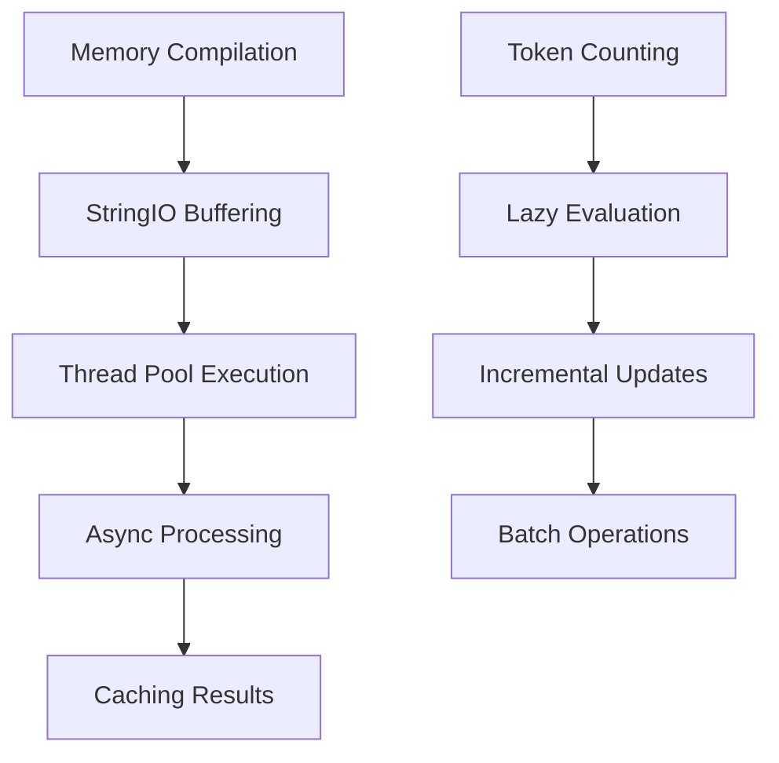

**Diagram sources**
- [memory.py](file://letta/schemas/memory.py#L310-L320)

### Memory Access Patterns

Optimal access patterns for different scenarios:

| Pattern | Use Case | Performance Impact |
|---------|----------|-------------------|
| Sequential Access | System prompt generation | Low overhead |
| Random Access | Runtime modifications | Moderate overhead |
| Bulk Operations | Batch updates | High throughput |
| Incremental Updates | Continuous modifications | Minimal impact |

### Scalability Considerations

Large-scale memory management strategies:

1. **Block Partitioning**: Distribute memory across multiple blocks
2. **Lazy Loading**: Load blocks only when needed
3. **Compression**: Compress block content for storage
4. **Caching**: Cache frequently accessed blocks
5. **Indexing**: Index blocks for fast lookup

**Section sources**
- [memory.py](file://letta/schemas/memory.py#L310-L320)