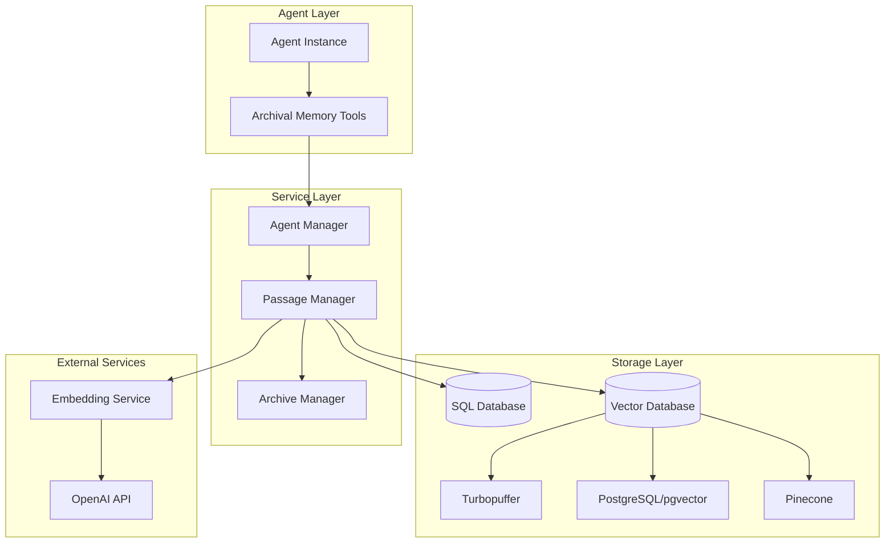
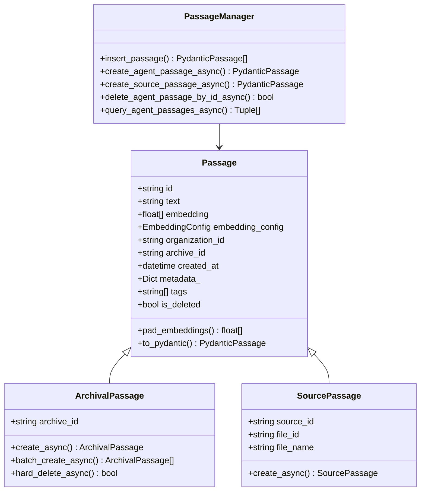
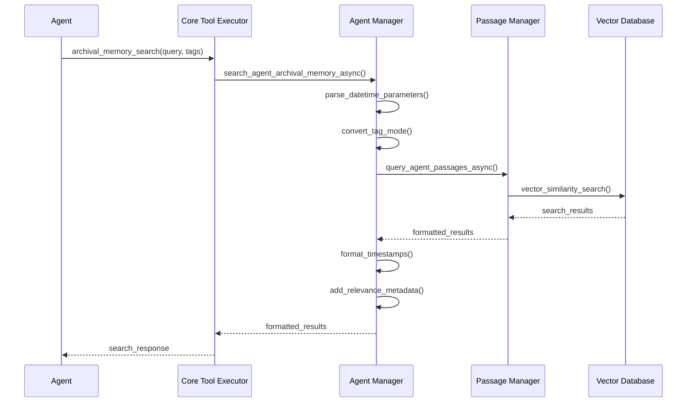
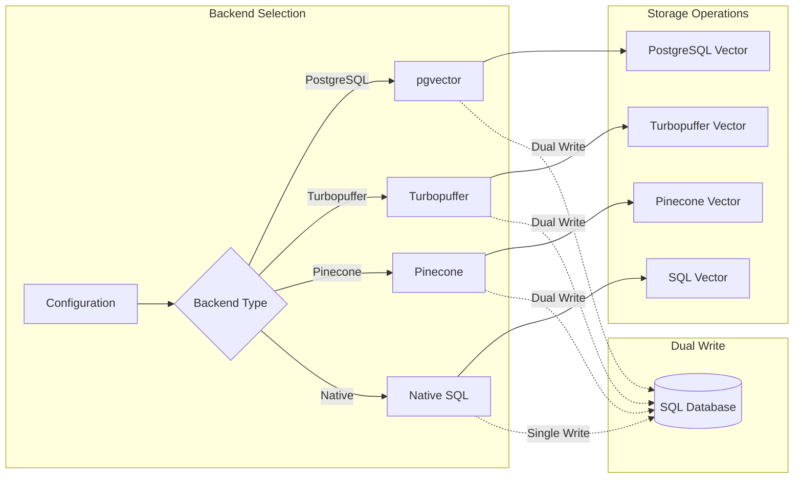
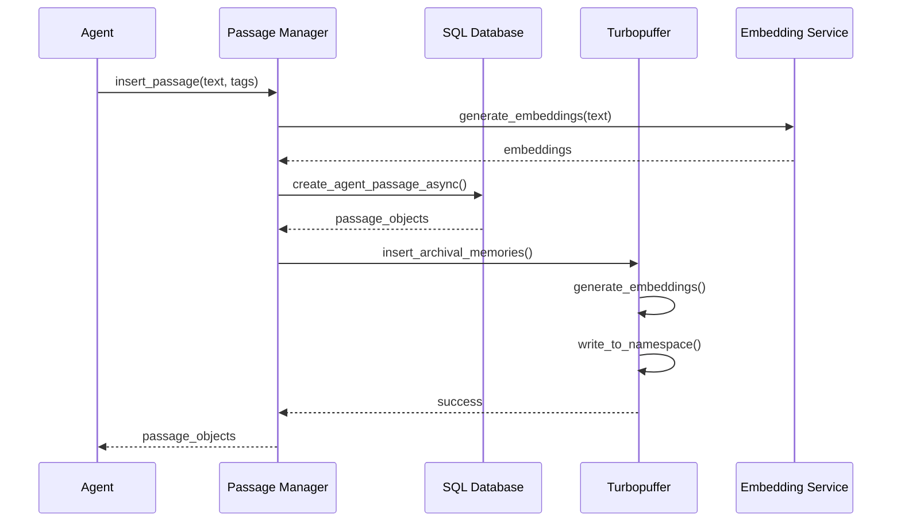

# Archival Memory

<cite>
**Referenced Files in This Document**
- [server.py](file://letta/server/server.py)
- [passage_manager.py](file://letta/services/passage_manager.py)
- [agent_manager.py](file://letta/services/agent_manager.py)
- [core_tool_executor.py](file://letta/services/tool_executor/core_tool_executor.py)
- [tpuf_client.py](file://letta/helpers/tpuf_client.py)
- [base.py](file://letta/functions/function_sets/base.py)
- [passage.py](file://letta/schemas/passage.py)
- [memgpt_chat.py](file://letta/prompts/system_prompts/memgpt_chat.py)
- [integration_test_turbopuffer.py](file://tests/integration_test_turbopuffer.py)
- [search_test.py](file://tests/sdk/search_test.py)
</cite>

## Table of Contents
1. [Introduction](#introduction)
2. [System Architecture](#system-architecture)
3. [Core Components](#core-components)
4. [Data Model and Storage](#data-model-and-storage)
5. [Search and Retrieval Functions](#search-and-retrieval-functions)
6. [Dual-Write Architecture](#dual-write-architecture)
7. [Performance Considerations](#performance-considerations)
8. [Integration Examples](#integration-examples)
9. [Error Handling and Validation](#error-handling-and-validation)
10. [Best Practices](#best-practices)

## Introduction

Letta's Archival Memory provides infinite-capacity, external storage for long-term information that requires explicit retrieval via semantic search. Unlike core memory that is always visible in the agent's context window, archival memory operates as a structured and deep storage space for reflections, insights, and essential data that doesn't fit within immediate context constraints.

The system implements a sophisticated dual-write architecture supporting multiple vector database backends including PostgreSQL with pgvector, Pinecone, and Turbopuffer. This design ensures data persistence, scalability, and optimal performance for semantic search operations.

## System Architecture

The Archival Memory system follows a layered architecture that separates concerns between data storage, retrieval, and agent interaction:



**Diagram sources**
- [server.py](file://letta/server/server.py#L150-L170)
- [passage_manager.py](file://letta/services/passage_manager.py#L50-L60)
- [agent_manager.py](file://letta/services/agent_manager.py#L1-L50)

**Section sources**
- [server.py](file://letta/server/server.py#L150-L170)
- [passage_manager.py](file://letta/services/passage_manager.py#L50-L60)

## Core Components

### Passage Objects

Passage objects represent individual units of archival memory containing text content, embeddings, and metadata. Each passage encapsulates a meaningful piece of information that can be semantically searched.



**Diagram sources**
- [passage.py](file://letta/schemas/passage.py#L14-L54)
- [passage_manager.py](file://letta/services/passage_manager.py#L51-L100)

### Agent Manager Integration

The Agent Manager coordinates between agents and archival memory, handling search requests and formatting results for agent consumption.



**Diagram sources**
- [core_tool_executor.py](file://letta/services/tool_executor/core_tool_executor.py#L279-L302)
- [agent_manager.py](file://letta/services/agent_manager.py#L2295-L2325)

**Section sources**
- [passage.py](file://letta/schemas/passage.py#L14-L54)
- [agent_manager.py](file://letta/services/agent_manager.py#L2295-L2325)

## Data Model and Storage

### Passage Schema

The Passage schema defines the structure for storing archival memory with comprehensive metadata support:

| Field | Type | Description | Constraints |
|-------|------|-------------|-------------|
| id | string | Unique passage identifier | UUID format, auto-generated |
| text | string | Content of the passage | Required, unlimited length |
| embedding | List[float] | Vector representation | Generated by embedding model |
| embedding_config | EmbeddingConfig | Embedding model configuration | Required for embedding generation |
| organization_id | string | Associated organization | Required for multi-tenancy |
| archive_id | string | Archive identifier | Required for agent passages |
| source_id | string | Source identifier | Required for source passages |
| file_id | string | Associated file ID | Optional, for file-based passages |
| file_name | string | File name | Optional, for file-based passages |
| created_at | datetime | Creation timestamp | Auto-generated UTC time |
| metadata_ | Dict | Additional metadata | JSON-compatible dictionary |
| tags | List[string] | Classification tags | Optional, for filtering |
| is_deleted | bool | Soft deletion flag | Default: false |

### Vector Database Backends

The system supports multiple vector database backends with automatic selection based on configuration:



**Diagram sources**
- [tpuf_client.py](file://letta/helpers/tpuf_client.py#L22-L30)
- [passage_manager.py](file://letta/services/passage_manager.py#L517-L537)

**Section sources**
- [passage.py](file://letta/schemas/passage.py#L14-L54)
- [tpuf_client.py](file://letta/helpers/tpuf_client.py#L22-L30)

## Search and Retrieval Functions

### archivial_memory_insert Function

The `archival_memory_insert` function enables agents to write information to archival memory with comprehensive parameter support:

```python
async def archival_memory_insert(
    self: "Agent",
    content: str,
    tags: Optional[list[str]] = None,
) -> Optional[str]:
```

**Parameters:**
- `content`: The text content to store as archival memory
- `tags`: Optional list of classification tags for filtering

**Implementation Details:**
- Validates token count against archival memory token limit
- Generates embeddings using configured embedding model
- Creates passage objects with metadata and tags
- Supports dual-write to Turbopuffer when enabled
- Updates agent system prompt to reflect new memory

### archival_memory_search Function

The `archival_memory_search` function provides semantic search capabilities with advanced filtering options:

```python
async def archival_memory_search(
    self: "Agent",
    query: str,
    tags: Optional[list[str]] = None,
    tag_match_mode: Literal["any", "all"] = "any",
    top_k: Optional[int] = None,
    start_datetime: Optional[str] = None,
    end_datetime: Optional[str] = None,
) -> Optional[str]:
```

**Parameters:**
- `query`: Semantic search query string
- `tags`: Optional tag filtering list
- `tag_match_mode`: "any" (match any tag) or "all" (match all tags)
- `top_k`: Maximum number of results to return
- `start_datetime`: ISO 8601 format start date filter
- `end_datetime`: ISO 8601 format end date filter

**Search Modes:**
- **Vector Search**: Uses semantic similarity via cosine distance
- **FTS Search**: Full-text search with BM25 ranking
- **Hybrid Search**: Combines vector and text search with configurable weights

**Section sources**
- [base.py](file://letta/functions/function_sets/base.py#L177-L209)
- [core_tool_executor.py](file://letta/services/tool_executor/core_tool_executor.py#L279-L302)

## Dual-Write Architecture

### Turbopuffer Integration

When Turbopuffer is enabled, the system implements dual-write functionality ensuring data consistency across both SQL and vector database backends:



**Diagram sources**
- [passage_manager.py](file://letta/services/passage_manager.py#L517-L537)
- [tpuf_client.py](file://letta/helpers/tpuf_client.py#L108-L225)

### Dual-Write Benefits

1. **Data Redundancy**: Ensures data availability across multiple storage systems
2. **Performance Optimization**: Allows different search strategies per backend
3. **Fallback Mechanism**: Provides backup storage when primary backend fails
4. **Scalability**: Distributes load across multiple database systems

**Section sources**
- [passage_manager.py](file://letta/services/passage_manager.py#L517-L537)
- [tpuf_client.py](file://letta/helpers/tpuf_client.py#L108-L225)

## Performance Considerations

### Token Limit Enforcement

The system enforces token limits to prevent excessive memory usage and ensure optimal performance:

```python
# Token limit enforcement in server.py
token_count = count_tokens(memory_contents)
if token_count > settings.archival_memory_token_limit:
    raise LettaInvalidArgumentError(
        message=f"Archival memory content exceeds token limit of {settings.archival_memory_token_limit} tokens",
        argument_name="memory_contents",
    )
```

### Embedding Generation Optimization

- **Concurrent Processing**: Multiple text chunks processed simultaneously
- **Caching**: Embeddings cached to reduce API calls
- **Batch Operations**: Multiple passages embedded in single API call

### Search Performance Tuning

1. **Index Optimization**: Vector indices optimized for cosine distance
2. **Query Optimization**: Efficient SQL queries with proper indexing
3. **Result Limiting**: Configurable result limits to control response size
4. **Caching**: Frequently accessed passages cached in memory

**Section sources**
- [server.py](file://letta/server/server.py#L670-L678)
- [passage_manager.py](file://letta/services/passage_manager.py#L548-L557)

## Integration Examples

### Basic Search Implementation

```python
# Example from core_tool_executor.py showing search result formatting
formatted_results = await self.agent_manager.search_agent_archival_memory_async(
    agent_id=agent_state.id,
    actor=actor,
    query=query,
    tags=tags,
    tag_match_mode=tag_match_mode,
    top_k=top_k,
    start_datetime=start_datetime,
    end_datetime=end_datetime,
)
```

### Error Handling Pattern

```python
# Example from core_tool_executor.py showing error handling
try:
    formatted_results = await self.agent_manager.search_agent_archival_memory_async(...)
except Exception as e:
    raise e
```

### Search Result Structure

Search results are formatted with comprehensive metadata:

```json
{
    "timestamp": "2024-01-15T10:30:00+00:00",
    "content": "Meeting notes content...",
    "tags": ["meetings", "roadmap", "q2-2024"],
    "relevance": {
        "rrf_score": 0.85,
        "vector_rank": 1,
        "fts_rank": 2
    }
}
```

**Section sources**
- [core_tool_executor.py](file://letta/services/tool_executor/core_tool_executor.py#L279-L302)
- [agent_manager.py](file://letta/services/agent_manager.py#L2410-L2429)

## Error Handling and Validation

### Input Validation

The system implements comprehensive input validation:

1. **Empty Query Handling**: Returns empty results for whitespace-only queries
2. **Datetime Parsing**: Validates ISO 8601 format with timezone support
3. **Token Count Limits**: Enforces configurable token limits
4. **Tag Validation**: Ensures tag lists are properly formatted

### Exception Types

- `LettaInvalidArgumentError`: For invalid input parameters
- `NoResultFound`: When requested passages don't exist
- `ValueError`: For malformed datetime parameters
- General exceptions for backend failures

### Strict Mode Operations

When `strict_mode=True` is enabled, the system raises exceptions for backend failures instead of continuing gracefully.

**Section sources**
- [agent_manager.py](file://letta/services/agent_manager.py#L2324-L2327)
- [server.py](file://letta/server/server.py#L670-L678)

## Best Practices

### Memory Management

1. **Content Chunking**: Break large documents into manageable chunks
2. **Tag Organization**: Use consistent tagging schemes for easy filtering
3. **Regular Cleanup**: Remove outdated or irrelevant passages
4. **Content Quality**: Focus on meaningful, searchable content

### Search Optimization

1. **Query Design**: Use specific, meaningful search terms
2. **Tag Filtering**: Combine semantic search with tag filtering
3. **Result Limiting**: Use appropriate `top_k` values for performance
4. **Temporal Filtering**: Utilize date ranges for focused searches

### Performance Guidelines

1. **Embedding Efficiency**: Batch similar operations together
2. **Caching Strategy**: Leverage built-in caching mechanisms
3. **Backend Selection**: Choose appropriate vector database for use case
4. **Monitoring**: Track token usage and search performance

### Security Considerations

1. **Access Control**: Ensure proper organization isolation
2. **Data Privacy**: Respect sensitive information in passages
3. **Audit Logging**: Monitor archival memory operations
4. **Backup Strategy**: Implement regular backups for critical data