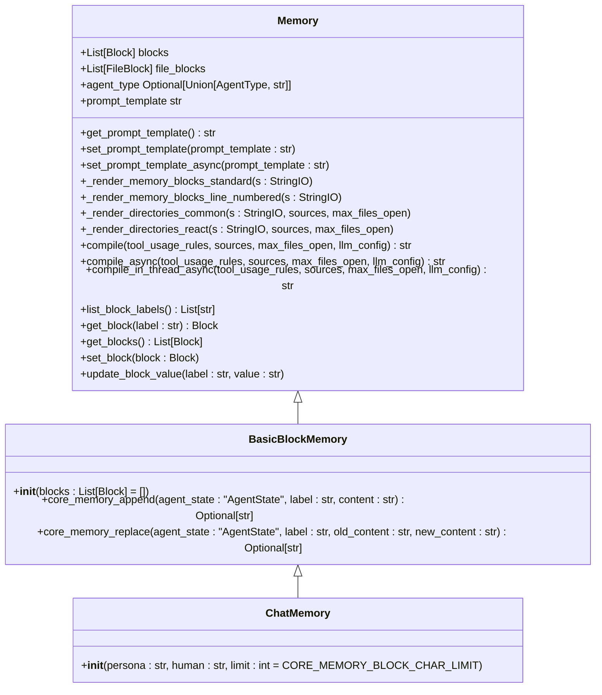
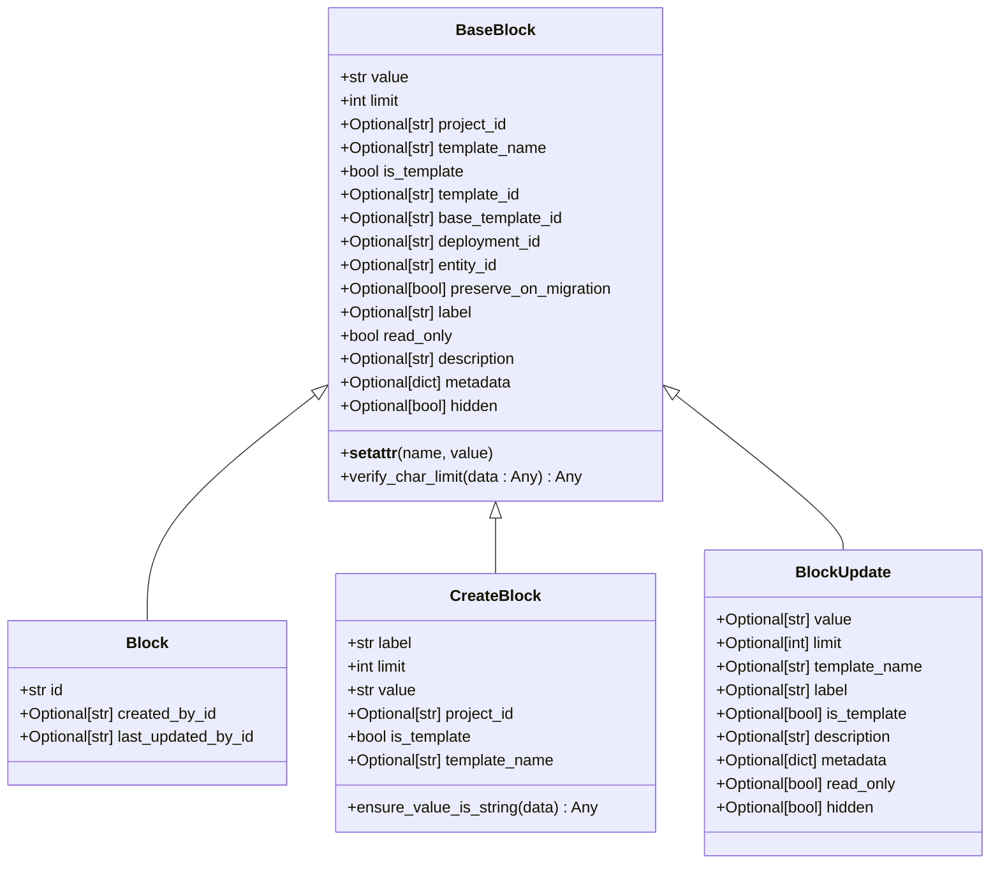
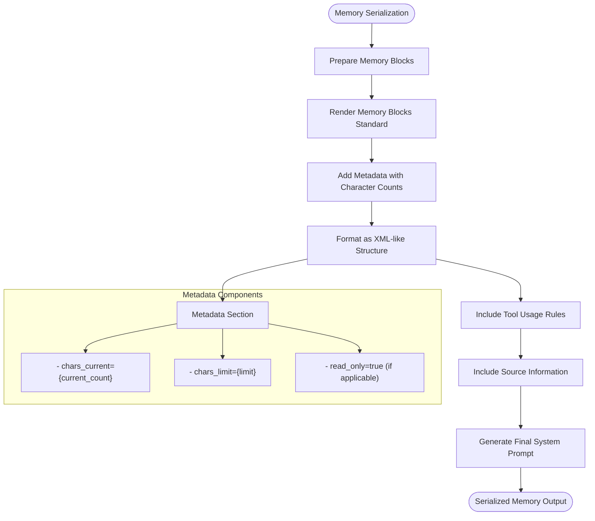
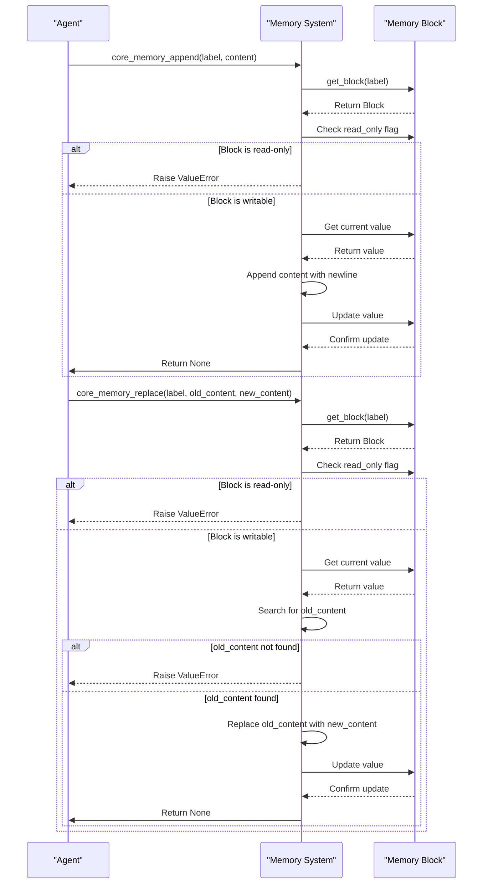
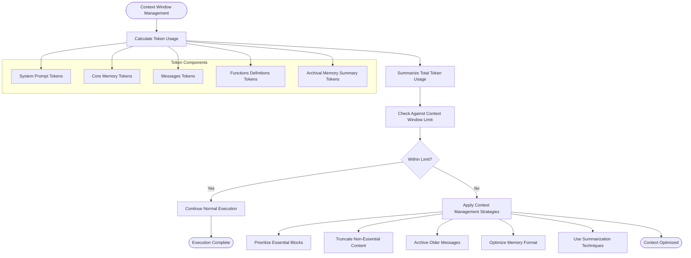

# Core Memory Blocks

<cite>
**Referenced Files in This Document**   
- [memory.py](file://letta/schemas/memory.py)
- [block.py](file://letta/schemas/block.py)
- [letta_agent.py](file://letta/agents/letta_agent.py)
- [base_agent.py](file://letta/agents/base_agent.py)
- [agent_manager.py](file://letta/services/agent_manager.py)
- [constants.py](file://letta/constants.py)
- [sleeptime_v2.py](file://letta/prompts/system_prompts/sleeptime_v2.py)
- [memgpt_chat.py](file://letta/prompts/system_prompts/memgpt_chat.py)
</cite>

## Table of Contents
1. [Introduction](#introduction)
2. [Core Memory Structure](#core-memory-structure)
3. [Block Object Structure](#block-object-structure)
4. [Memory Serialization and System Prompts](#memory-serialization-and-system-prompts)
5. [Core Memory Functions](#core-memory-functions)
6. [Memory Initialization and Updates](#memory-initialization-and-updates)
7. [Token Budgeting and Context Management](#token-budgeting-and-context-management)
8. [Conclusion](#conclusion)

## Introduction
Core Memory Blocks in Letta provide a foundational context within the LLM's context window, enabling agents to maintain persistent information across interactions. These blocks serve as dedicated sections of memory that store essential information about the agent's persona, the human user, and ongoing tasks. The system is designed to give agents a consistent identity and awareness of key details, allowing for more natural and personalized conversations. Core memory is always available in-context, meaning the LLM can access this information at all times during its operation. This documentation details the structure, functionality, and implementation of Core Memory Blocks, including how they are serialized into system prompts, dynamically modified during execution, and managed within the constraints of the LLM's context window.

**Section sources**
- [sleeptime_v2.py](file://letta/prompts/system_prompts/sleeptime_v2.py#L7-L10)
- [memgpt_chat.py](file://letta/prompts/system_prompts/memgpt_chat.py#L44-L56)

## Core Memory Structure
Core Memory in Letta consists of labeled blocks that provide foundational context within the LLM's context window. The primary blocks include 'persona', 'human', and 'tasks', each serving a specific purpose in maintaining the agent's identity and operational context. The 'persona' block stores details about the agent's character, guiding its behavior and response style to maintain consistency. The 'human' block contains key information about the user, enabling personalized interactions. The 'tasks' block maintains a list of responsibilities the agent must complete. These blocks are implemented as part of the BasicBlockMemory class, which inherits from the base Memory class and provides methods for editing core memory. The memory system is designed to be always available in-context, ensuring the LLM has continuous access to this essential information throughout its operation.



**Diagram sources **
- [memory.py](file://letta/schemas/memory.py#L56-L421)

**Section sources**
- [memory.py](file://letta/schemas/memory.py#L366-L421)
- [sleeptime_v2.py](file://letta/prompts/system_prompts/sleeptime_v2.py#L7-L10)

## Block Object Structure
The Block object in Letta's core memory system contains several key attributes that define its structure and behavior. Each block has a label that identifies its purpose (such as 'persona', 'human', or 'tasks'), a value containing the actual content, and a description that explains the block's function. Blocks also have character limits that constrain their size, with a default limit of 20,000 characters defined by CORE_MEMORY_BLOCK_CHAR_LIMIT. The read_only flag determines whether an agent can modify the block's content, providing a mechanism to protect critical information. Additional metadata includes creation and update timestamps, organizational context, and template information. The Block class inherits from BaseBlock, which enforces validation rules such as ensuring the character limit is not exceeded when updating content. This structure allows for flexible yet controlled memory management within the agent system.



**Diagram sources **
- [block.py](file://letta/schemas/block.py#L12-L107)
- [constants.py](file://letta/constants.py#L382-L384)

**Section sources**
- [block.py](file://letta/schemas/block.py#L12-L107)
- [constants.py](file://letta/constants.py#L382-L384)

## Memory Serialization and System Prompts
Core memory is serialized into system prompts using XML-like formatting that includes metadata about current and limit character counts. The Memory class's compile method generates a string representation of all memory blocks, wrapping them in a structured format that the LLM can parse. Each block is enclosed in tags corresponding to its label, with nested description, metadata, and value sections. The metadata includes information about the current character count and character limit, allowing the agent to understand its memory constraints. For read-only blocks, the metadata indicates this restriction. The serialization process also handles special cases like line-numbered output for certain agent types and Anthropic models. When memory changes, the system prompt is regenerated to reflect the updated content, ensuring the LLM always has the most current information in its context window.



**Diagram sources **
- [memory.py](file://letta/schemas/memory.py#L116-L140)
- [memory.py](file://letta/schemas/memory.py#L271-L308)

**Section sources**
- [memory.py](file://letta/schemas/memory.py#L116-L140)
- [memory.py](file://letta/schemas/memory.py#L271-L308)

## Core Memory Functions
Letta provides two primary functions for dynamically modifying core memory during agent execution: core_memory_append and core_memory_replace. The core_memory_append function allows agents to add content to an existing memory block by appending text to the current value, separated by a newline. This function checks if the block is read-only before modification and ensures the updated content does not exceed the character limit. The core_memory_replace function enables more precise editing by replacing specific content within a block. It requires the exact text to be replaced and the new content to insert, providing a way to update information without altering unrelated portions of the memory. Both functions are implemented in the BasicBlockMemory class and are accessible to agents through the tool system. These functions trigger system prompt regeneration when memory changes, ensuring the LLM's context remains current.



**Diagram sources **
- [memory.py](file://letta/schemas/memory.py#L387-L420)
- [core_tool_executor.py](file://letta/services/tool_executor/core_tool_executor.py#L320-L345)

**Section sources**
- [memory.py](file://letta/schemas/memory.py#L387-L420)
- [base.py](file://letta/functions/function_sets/base.py#L258-L275)

## Memory Initialization and Updates
Core memory is initialized when an agent is created, typically with default 'persona' and 'human' blocks containing initial values. The ChatMemory class provides a convenient way to initialize these blocks with specified persona and human content. During agent execution, memory updates trigger a process that regenerates the system prompt to reflect changes. The agent manager handles this process by comparing the current memory state with the existing system message content. If changes are detected, a new system message is generated with the updated memory and replaces the old one in the message sequence. This ensures the LLM always operates with the most current context. The update process includes calculating memory edit timestamps and incorporating metadata about message and archival memory counts. The system is optimized to avoid unnecessary prompt regeneration by comparing memory content before rebuilding the system prompt.

```mermaid
flowchart TD
Start([Agent Creation]) --> InitializeMemory["Initialize Core Memory"]
InitializeMemory --> CreateBlocks["Create Default Blocks (persona, human)"]
CreateBlocks --> SetInitialValues["Set Initial Values from Configuration"]
SetInitialValues --> StoreInAgent["Store Memory in Agent State"]
StoreInAgent --> End1([Memory Initialized])
subgraph "Memory Update Process"
UpdateRequest([Memory Update Request]) --> CheckReadOnly["Check Block read_only Flag"]
CheckReadOnly --> alt Writable
Writable --> ModifyContent["Modify Block Content"]
ModifyContent --> ValidateSize["Validate Against Character Limit"]
ValidateSize --> UpdateTimestamp["Update Memory Edit Timestamp"]
UpdateTimestamp --> CompareContent["Compare with Current System Message"]
CompareContent --> ContentChanged{"Content Changed?"}
ContentChanged --> |Yes| GenerateNewPrompt["Generate New System Prompt"]
ContentChanged --> |No| KeepExistingPrompt["Keep Existing Prompt"]
GenerateNewPrompt --> ReplaceMessage["Replace System Message"]
ReplaceMessage --> End2([Update Complete])
KeepExistingPrompt --> End2
else Read-Only
ReadOnly --> RaiseError["Raise ValueError"]
RaiseError --> End2
end
end
```

**Diagram sources **
- [memory.py](file://letta/schemas/memory.py#L428-L437)
- [agent_manager.py](file://letta/services/agent_manager.py#L1278-L1562)
- [base_agent.py](file://letta/agents/base_agent.py#L157-L177)

**Section sources**
- [memory.py](file://letta/schemas/memory.py#L428-L437)
- [agent_manager.py](file://letta/services/agent_manager.py#L1278-L1562)

## Token Budgeting and Context Management
Letta implements several strategies to manage context window overflow and ensure efficient token usage. The core memory system enforces character limits on blocks, with a default limit of 20,000 characters per block defined by CORE_MEMORY_BLOCK_CHAR_LIMIT. When updating memory, the system validates that new content does not exceed these limits before applying changes. The context window calculator determines the total token usage across all components, including system prompt, core memory, messages, and function definitions. For agents with limited context windows, the system prioritizes essential blocks like 'persona' and 'human' while potentially truncating or archiving less critical information. The memory compilation process is optimized to minimize unnecessary prompt regeneration, reducing computational overhead. Additionally, the system supports selective block usage, allowing agents to focus on specific memory sections when appropriate, thereby conserving valuable context space for other important information.



**Diagram sources **
- [constants.py](file://letta/constants.py#L382-L384)
- [context_window_calculator.py](file://letta/services/context_window_calculator/context_window_calculator.py#L97-L128)
- [agent.py](file://letta/agent.py#L948-L960)

**Section sources**
- [constants.py](file://letta/constants.py#L382-L384)
- [context_window_calculator.py](file://letta/services/context_window_calculator/context_window_calculator.py#L97-L128)

## Conclusion
Core Memory Blocks in Letta provide a robust system for maintaining foundational context within the LLM's context window. Through labeled blocks like 'persona', 'human', and 'tasks', agents can maintain a consistent identity and awareness of key information throughout their interactions. The Block object structure, with its label, value, description, character limits, and read-only flags, enables flexible yet controlled memory management. The XML-like serialization format with metadata about character counts ensures the LLM has clear information about memory constraints. The core_memory_append and core_memory_replace functions allow agents to dynamically modify their memory during execution, triggering system prompt regeneration to keep the context current. With strategies for token budgeting and context management, including character limits and selective block usage, Letta effectively handles the challenges of context window overflow. This comprehensive memory system enables more natural, personalized, and persistent interactions between agents and users.