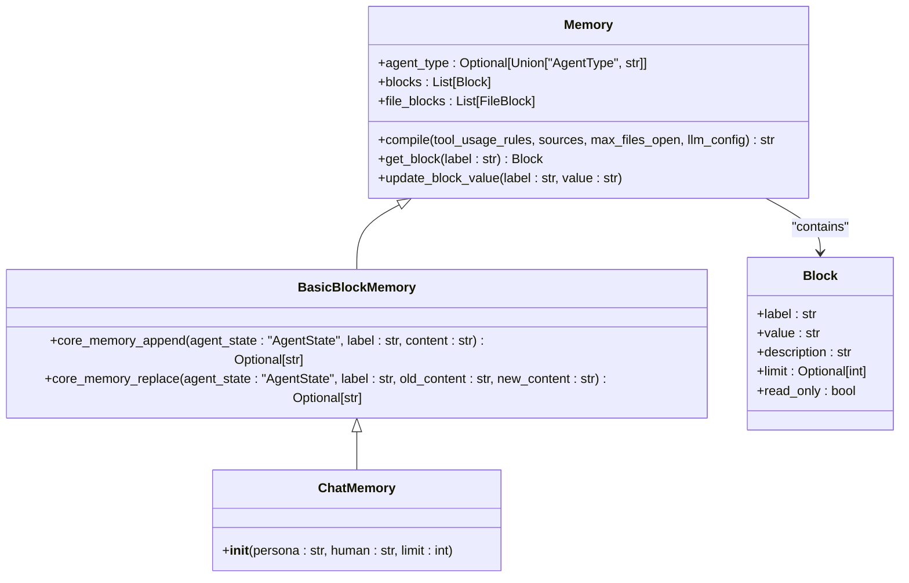
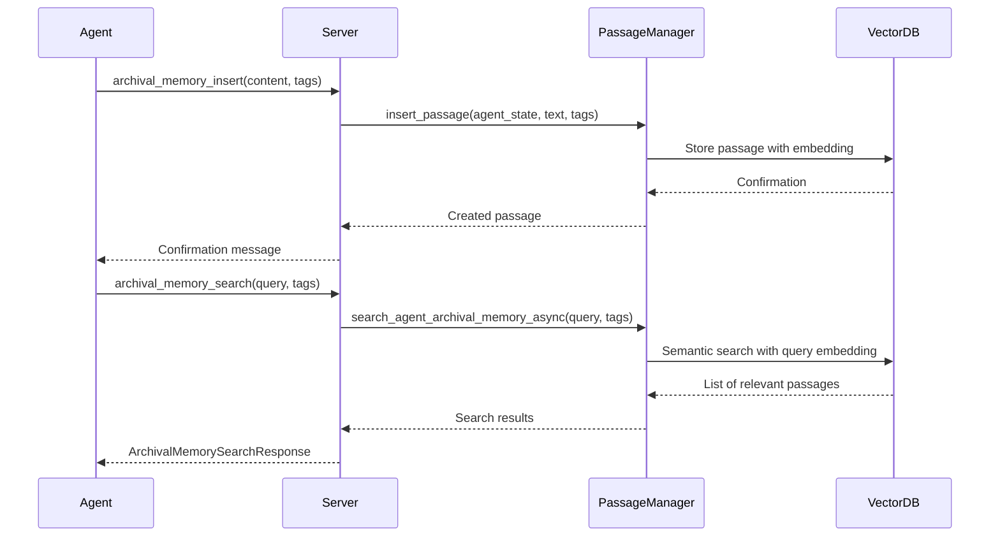
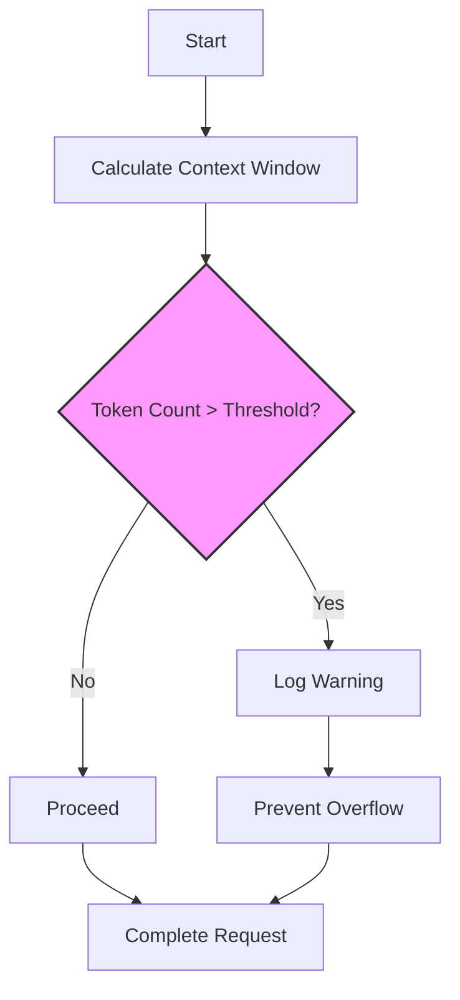
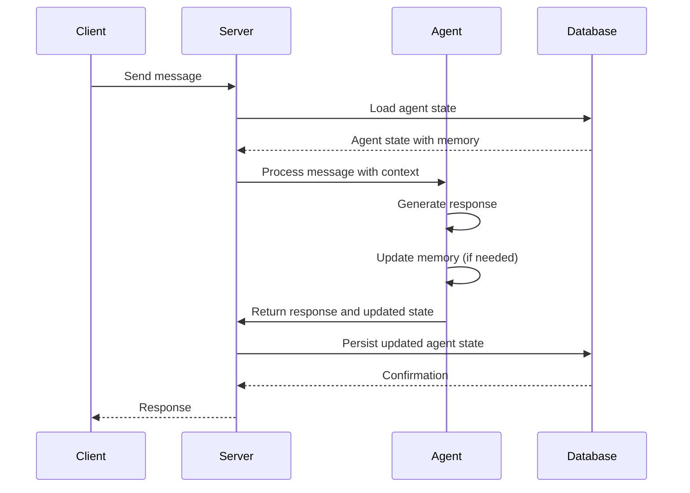

# Memory Hierarchy

<cite>
**Referenced Files in This Document**   
- [memory.py](file://letta/memory.py)
- [schemas/memory.py](file://letta/schemas/memory.py)
- [constants.py](file://letta/constants.py)
- [settings.py](file://letta/settings.py)
- [functions/function_sets/base.py](file://letta/functions/function_sets/base.py)
- [services/context_window_calculator/context_window_calculator.py](file://letta/services/context_window_calculator/context_window_calculator.py)
- [services/passage_manager.py](file://letta/services/passage_manager.py)
- [server/server.py](file://letta/server/server.py)
- [agent.py](file://letta/agent.py)
- [prompts/system_prompts/memgpt_chat.py](file://letta/prompts/system_prompts/memgpt_chat.py)
- [examples/notebooks/data/shared_memory_system_prompt.txt](file://examples/notebooks/data/shared_memory_system_prompt.txt)
</cite>

## Table of Contents
1. [Introduction](#introduction)
2. [Core Memory](#core-memory)
3. [Archival Memory](#archival-memory)
4. [Token Budgeting and Context Window Management](#token-budgeting-and-context-window-management)
5. [Memory Initialization and Dynamic Updates](#memory-initialization-and-dynamic-updates)
6. [Data Flow in Agent Message Processing](#data-flow-in-agent-message-processing)
7. [Performance Implications and Memory Management Strategies](#performance-implications-and-memory-management-strategies)
8. [Conclusion](#conclusion)

## Introduction
The Letta agent framework employs a sophisticated two-tiered memory hierarchy designed to balance immediate cognitive accessibility with long-term knowledge retention. This architecture consists of **in-context core memory** for essential, frequently accessed information and **out-of-context archival memory** for extensive, searchable knowledge storage. Core memory is directly injected into the LLM context window, ensuring constant availability for real-time cognition, while archival memory is stored externally in a vector database, requiring explicit retrieval operations. This document details the structure, implementation, and operational dynamics of this memory system, including the token budgeting mechanisms that prevent context window overflow and ensure efficient agent performance.

## Core Memory

Core memory in Letta serves as the agent's immediate, in-context cognitive workspace, providing a foundational context for maintaining persona, user details, and active tasks. It is structured using labeled blocks, such as 'persona' and 'human', which are serialized and injected directly into the LLM's context window at the start of each interaction. This design ensures that critical information is always visible to the agent, enabling consistent and personalized behavior. The `Memory` class in the `schemas/memory.py` file defines the core memory structure, with blocks containing a label, description, and value, and supports both read-only and read-write configurations. The `ChatMemory` subclass initializes the system with default 'persona' and 'human' blocks, each with a character limit defined by constants in `constants.py`.

**Diagram sources**
- [schemas/memory.py](file://letta/schemas/memory.py#L55-L419)

**Section sources**
- [schemas/memory.py](file://letta/schemas/memory.py#L55-L419)
- [constants.py](file://letta/constants.py#L381-L383)

## Archival Memory

Archival memory in Letta functions as a long-term, infinite-capacity storage system for information that does not fit within the core memory but is too important to be confined to transient recall memory. This external storage is implemented as a vector database, allowing for semantic search and retrieval of stored knowledge. Agents interact with archival memory through dedicated functions: `archival_memory_insert` to add new information and `archival_memory_search` to retrieve relevant data based on a query. The `CreateArchivalMemory` and `ArchivalMemorySearchResponse` classes in `schemas/memory.py` define the data structures for these operations, supporting features like tagging and timestamp-based filtering. The `passage_manager.py` service handles the persistence of archival memories, managing the insertion and retrieval of passages from the database.

**Diagram sources**
- [functions/function_sets/base.py](file://letta/functions/function_sets/base.py#L158-L237)
- [services/passage_manager.py](file://letta/services/passage_manager.py#L1-L1013)
- [schemas/memory.py](file://letta/schemas/memory.py#L451-L465)

**Section sources**
- [functions/function_sets/base.py](file://letta/functions/function_sets/base.py#L158-L237)
- [schemas/memory.py](file://letta/schemas/memory.py#L443-L465)
- [server/server.py](file://letta/server/server.py#L665-L696)

## Token Budgeting and Context Window Management

The Letta framework employs a robust token budgeting system to manage the LLM context window and prevent overflow. The `ContextWindowCalculator` class in `context_window_calculator.py` is responsible for calculating the total token usage within the context window, which includes system prompt, core memory, external memory summary, messages, and function definitions. This calculation is performed using a `TokenCounter` that can be either `TiktokenCounter` or `AnthropicTokenCounter`, depending on the model endpoint type. The system enforces a token limit for archival memory insertions, defined by the `archival_memory_token_limit` setting in `settings.py`, which defaults to 8192 tokens. If an insertion attempt exceeds this limit, a `LettaInvalidArgumentError` is raised. The `ContextWindowOverview` class provides a detailed breakdown of token usage, enabling monitoring and optimization of the context window.

**Diagram sources**
- [services/context_window_calculator/context_window_calculator.py](file://letta/services/context_window_calculator/context_window_calculator.py#L1-L203)
- [settings.py](file://letta/settings.py#L352-L354)
- [agent.py](file://letta/agent.py#L948-L960)

**Section sources**
- [services/context_window_calculator/context_window_calculator.py](file://letta/services/context_window_calculator/context_window_calculator.py#L1-L203)
- [settings.py](file://letta/settings.py#L352-L354)

## Memory Initialization and Dynamic Updates

Memory initialization in Letta occurs when an agent is created, with core memory blocks being defined either through the agent creation API or by default in the `ChatMemory` class. The `agent_manager.py` service handles the creation and initialization of agent state, including memory. Dynamic updates to core memory are performed using the `core_memory_append` and `core_memory_replace` functions, which modify the value of a specified block. These functions are part of the base function set and are accessible to the agent during its operation. The `update_block_value` method in the `Memory` class ensures that the block's value is updated, and the changes are persisted through the agent's state management. Serialization of the memory state is handled by the `compile` method, which generates a string representation of the memory blocks for injection into the LLM context.

**Section sources**
- [agent.py](file://letta/agent.py#L1208-L1461)
- [functions/function_sets/base.py](file://letta/functions/function_sets/base.py#L241-L305)
- [schemas/memory.py](file://letta/schemas/memory.py#L309-L327)

## Data Flow in Agent Message Processing

During agent message processing, the memory state is preserved and updated through a well-defined data flow. When a message is received, the agent's current state, including its memory, is loaded from the database. The core memory is compiled into the system prompt, which is then combined with the conversation history and function definitions to form the complete context window. After the LLM generates a response, any memory modifications made by the agent (e.g., via `core_memory_append`) are applied to the agent state. The `execute_tool_and_persist_state` method in `agent.py` ensures that these state changes are persisted back to the database. This cycle ensures that the agent's memory evolves over time, with changes being immediately available in subsequent interactions. The use of asynchronous methods and efficient database queries minimizes latency and ensures data consistency.

**Diagram sources**
- [agent.py](file://letta/agent.py#L1597-L1604)
- [services/agent_manager.py](file://letta/services/agent_manager.py#L1351-L1954)

**Section sources**
- [agent.py](file://letta/agent.py#L1597-L1604)
- [services/agent_manager.py](file://letta/services/agent_manager.py#L1351-L1954)

## Performance Implications and Memory Management Strategies

The performance of the Letta agent is significantly influenced by the size and management of its archival memory store. Large archival stores can lead to increased search latency and higher computational costs for embedding generation. To mitigate these issues, the system employs several strategies: the use of efficient vector databases like Turbopuffer or Pinecone for fast semantic search, the implementation of token limits to prevent excessive memory insertions, and the use of caching mechanisms for frequently accessed data. The `passage_manager.py` service includes optimizations such as batch creation of tags and dual storage in both JSON and junction tables for efficient querying. Additionally, the framework supports the use of different token counters based on the model provider, ensuring accurate token counting and optimal context window utilization. These strategies collectively ensure that the agent can scale to large knowledge bases while maintaining responsive performance.

**Section sources**
- [services/passage_manager.py](file://letta/services/passage_manager.py#L1-L1013)
- [settings.py](file://letta/settings.py#L352-L354)
- [tests/integration_test_turbopuffer.py](file://tests/integration_test_turbopuffer.py#L415-L676)

## Conclusion

The memory hierarchy in Letta is a critical component of its agent architecture, enabling a balance between immediate cognitive needs and long-term knowledge retention. The distinction between in-context core memory and out-of-context archival memory allows agents to maintain a consistent persona and user context while having access to a vast, searchable knowledge base. The token budgeting system ensures that the LLM context window is used efficiently, preventing overflow and maintaining performance. Through well-defined initialization, dynamic update mechanisms, and a robust data flow, the memory state is preserved and evolved across interactions. The performance implications of large archival stores are addressed through strategic use of vector databases, token limits, and caching, making the system scalable and efficient. This comprehensive memory management system is essential for creating intelligent, persistent, and high-performing agents.