# Memory Search and Retrieval

<cite>
**Referenced Files in This Document**
- [passage_manager.py](file://letta/services/passage_manager.py)
- [agent_manager.py](file://letta/services/agent_manager.py)
- [core_tool_executor.py](file://letta/services/tool_executor/core_tool_executor.py)
- [base.py](file://letta/functions/function_sets/base.py)
- [tpuf_client.py](file://letta/helpers/tpuf_client.py)
- [passage.py](file://letta/schemas/passage.py)
- [enums.py](file://letta/schemas/enums.py)
- [integration_test_turbopuffer.py](file://tests/integration_test_turbopuffer.py)
- [test_passage_manager.py](file://tests/managers/test_passage_manager.py)
</cite>

## Table of Contents
1. [Introduction](#introduction)
2. [System Architecture](#system-architecture)
3. [Core Components](#core-components)
4. [End-to-End Search Process](#end-to-end-search-process)
5. [Search Parameters and Configuration](#search-parameters-and-configuration)
6. [Vector Similarity Search Implementation](#vector-similarity-search-implementation)
7. [Result Formatting and Injection](#result-formatting-and-injection)
8. [Error Handling and Integration](#error-handling-and-integration)
9. [Performance Optimization](#performance-optimization)
10. [Best Practices and Recommendations](#best-practices-and-recommendations)
11. [Troubleshooting Guide](#troubleshooting-guide)

## Introduction

Letta's memory search and retrieval system provides sophisticated semantic search capabilities for accessing archival memory through vector similarity search. The system enables agents to find relevant information based on semantic meaning rather than exact keyword matching, supporting both vector-based and full-text search modes with advanced filtering capabilities.

The memory search system operates across multiple vector databases (PostgreSQL with pgvector, Turbopuffer, and Pinecone) and provides seamless integration with agent execution flow through the core_memory_search tool. It supports temporal filtering, tag-based categorization, and hybrid search approaches for optimal retrieval performance.

## System Architecture

The memory search and retrieval system follows a layered architecture that separates concerns between data persistence, search execution, and result formatting:

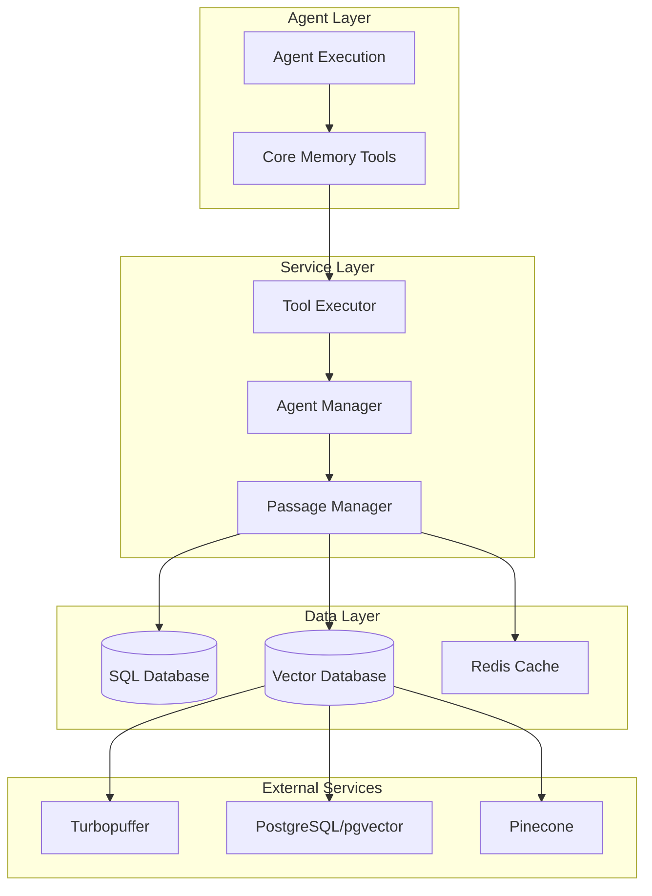

**Diagram sources**
- [agent_manager.py](file://letta/services/agent_manager.py#L2295-L2430)
- [passage_manager.py](file://letta/services/passage_manager.py#L51-L1013)
- [core_tool_executor.py](file://letta/services/tool_executor/core_tool_executor.py#L27-L915)

**Section sources**
- [agent_manager.py](file://letta/services/agent_manager.py#L2295-L2430)
- [passage_manager.py](file://letta/services/passage_manager.py#L51-L1013)

## Core Components

### Passage Manager

The PassageManager serves as the central orchestrator for all passage-related operations, handling both creation and retrieval of archival memory passages:

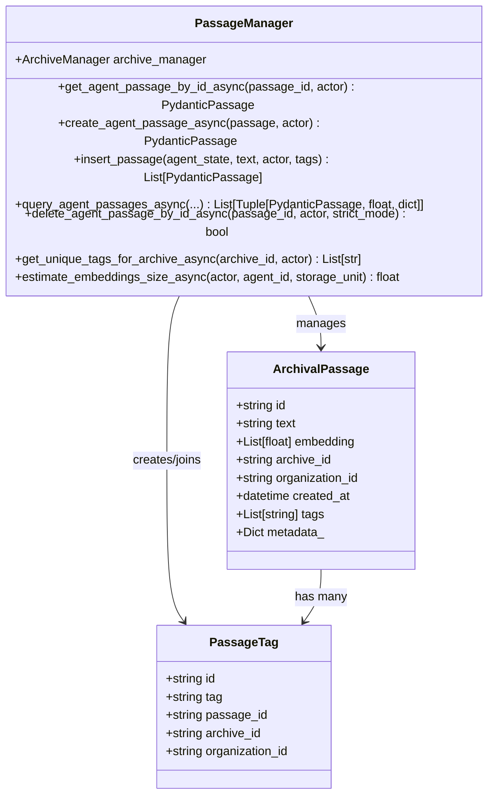

**Diagram sources**
- [passage_manager.py](file://letta/services/passage_manager.py#L51-L1013)
- [passage.py](file://letta/schemas/passage.py#L14-L95)

### Agent Manager

The AgentManager coordinates search operations and provides the primary interface for memory retrieval:

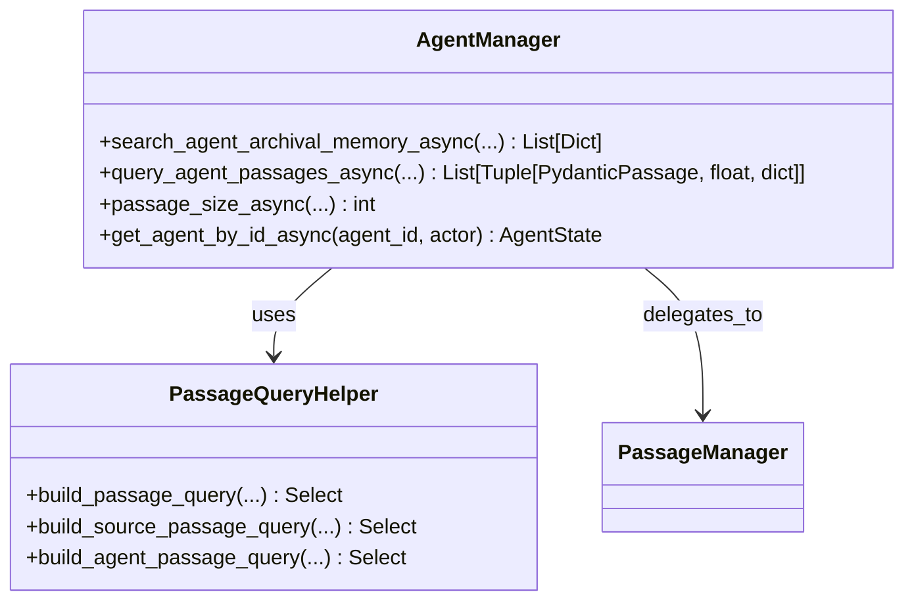

**Diagram sources**
- [agent_manager.py](file://letta/services/agent_manager.py#L2295-L2430)
- [agent_manager.py](file://letta/services/agent_manager.py#L852-L1152)

### Core Memory Search Tool

The core_memory_search tool provides the primary interface for agents to perform memory searches:

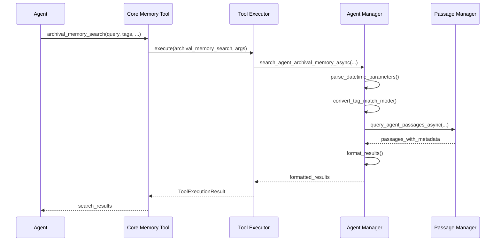

**Diagram sources**
- [core_tool_executor.py](file://letta/services/tool_executor/core_tool_executor.py#L279-L307)
- [agent_manager.py](file://letta/services/agent_manager.py#L2295-L2430)

**Section sources**
- [passage_manager.py](file://letta/services/passage_manager.py#L51-L1013)
- [agent_manager.py](file://letta/services/agent_manager.py#L2295-L2430)
- [core_tool_executor.py](file://letta/services/tool_executor/core_tool_executor.py#L279-L307)

## End-to-End Search Process

The memory search process follows a structured workflow from tool invocation to result injection:

### 1. Tool Invocation

The search begins when an agent invokes the `archival_memory_search` tool with query parameters:

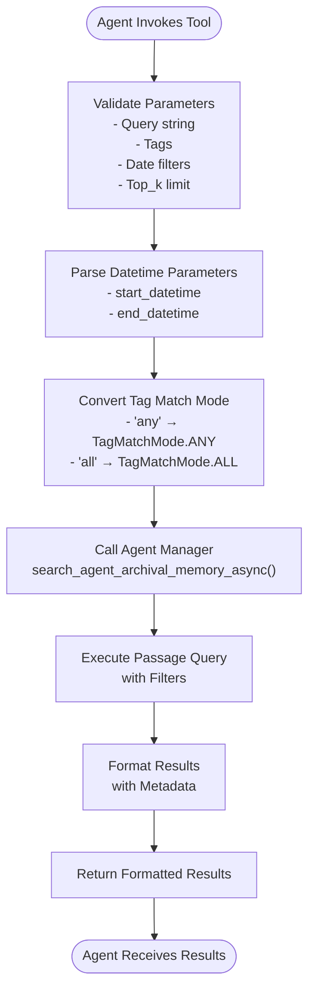

**Diagram sources**
- [core_tool_executor.py](file://letta/services/tool_executor/core_tool_executor.py#L279-L307)
- [agent_manager.py](file://letta/services/agent_manager.py#L2324-L2430)

### 2. Parameter Validation and Parsing

The system validates and processes search parameters:

| Parameter | Type | Description | Validation |
|-----------|------|-------------|------------|
| `query` | str | Semantic search query | Cannot be empty or whitespace-only |
| `tags` | List[str] | Tag filters for results | Optional, validated for duplicates |
| `tag_match_mode` | str | Tag matching behavior | Must be 'any' or 'all' |
| `top_k` | int | Maximum results to return | Defaults to RETRIEVAL_QUERY_DEFAULT_PAGE_SIZE |
| `start_datetime` | str | Start date filter (ISO 8601) | Parsed to datetime with timezone handling |
| `end_datetime` | str | End date filter (ISO 8601) | Parsed to datetime with timezone handling |

### 3. Vector Database Interaction

The query execution involves multiple database interactions depending on the configuration:

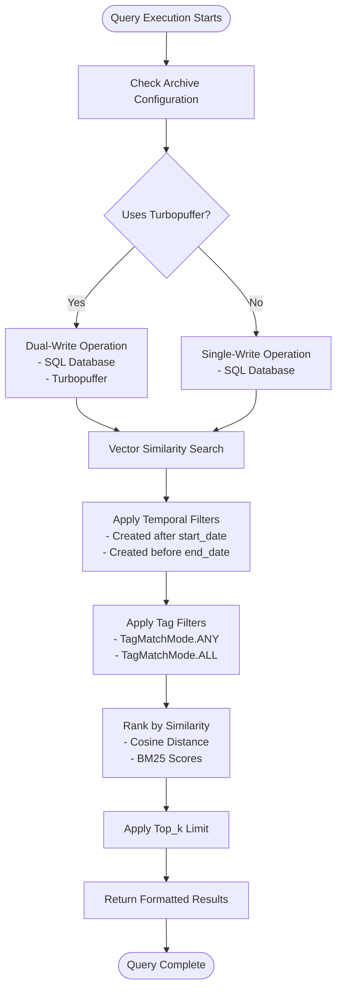

**Diagram sources**
- [agent_manager.py](file://letta/services/agent_manager.py#L2376-L2389)
- [passage_manager.py](file://letta/services/passage_manager.py#L453-L546)

**Section sources**
- [core_tool_executor.py](file://letta/services/tool_executor/core_tool_executor.py#L279-L307)
- [agent_manager.py](file://letta/services/agent_manager.py#L2324-L2430)

## Search Parameters and Configuration

### Query String Parameters

The core search functionality centers around the query string parameter:

- **Purpose**: Enables semantic similarity search using embeddings
- **Implementation**: Generates embeddings for the query text and performs cosine distance calculations
- **Optimization**: Uses concurrent embedding generation for multiple text chunks
- **Validation**: Rejects empty or whitespace-only queries

### Tag Filtering System

The tag system provides flexible categorization and filtering:

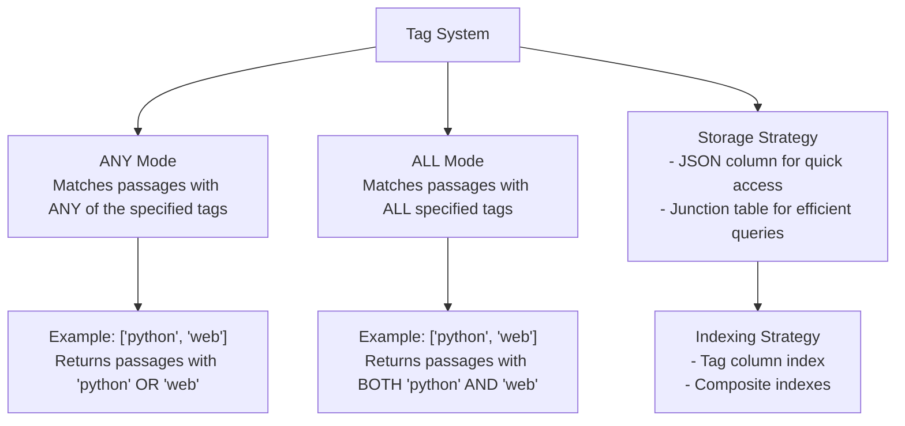

**Diagram sources**
- [enums.py](file://letta/schemas/enums.py#L267-L272)
- [passage_manager.py](file://letta/services/passage_manager.py#L58-L93)

### Temporal Filtering

Date range filtering supports precise temporal retrieval:

| Parameter | Format | Behavior | Timezone Handling |
|-----------|--------|----------|-------------------|
| `start_datetime` | ISO 8601 | Filter passages created after this time | Applied agent's timezone if naive |
| `end_datetime` | ISO 8601 | Filter passages created before this time | Applied agent's timezone if naive |
| Default Range | Full dataset | No temporal filtering applied | Uses UTC for internal storage |

### Top_k Limiting

Result limiting ensures manageable response sizes:

- **Default Value**: `RETRIEVAL_QUERY_DEFAULT_PAGE_SIZE` (typically 50)
- **Maximum**: No hard limit, but performance degrades with large values
- **Implementation**: Applied after ranking to ensure highest relevance results

**Section sources**
- [agent_manager.py](file://letta/services/agent_manager.py#L2324-L2430)
- [enums.py](file://letta/schemas/enums.py#L267-L272)

## Vector Similarity Search Implementation

### Embedding Generation

The system supports multiple embedding providers and generation strategies:

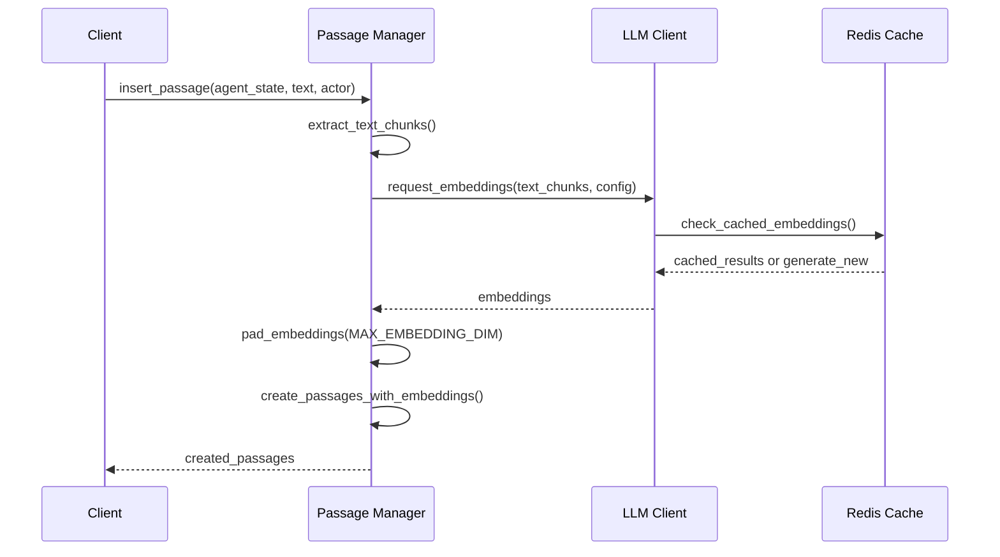

**Diagram sources**
- [passage_manager.py](file://letta/services/passage_manager.py#L453-L546)
- [passage_manager.py](file://letta/services/passage_manager.py#L548-L557)

### Search Algorithm Implementation

The vector similarity search uses cosine distance for semantic similarity:

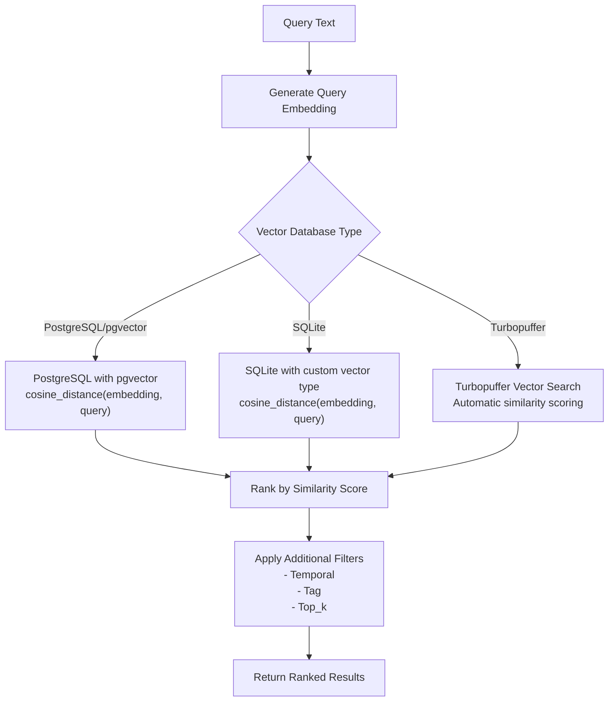

**Diagram sources**
- [agent_manager.py](file://letta/services/agent_manager.py#L852-L1152)
- [passage_manager.py](file://letta/services/passage_manager.py#L852-L1152)

### Hybrid Search Capabilities

For advanced retrieval, the system supports hybrid search combining vector and full-text search:

| Search Mode | Vector Component | Text Component | Use Case |
|-------------|------------------|----------------|----------|
| `vector` | Cosine similarity | N/A | Pure semantic search |
| `fts` | N/A | BM25 ranking | Exact phrase matching |
| `hybrid` | Weighted combination | Weighted combination | Balanced semantic + exact matching |

**Section sources**
- [passage_manager.py](file://letta/services/passage_manager.py#L453-L546)
- [agent_manager.py](file://letta/services/agent_manager.py#L852-L1152)

## Result Formatting and Injection

### Result Structure

Search results are formatted into a standardized structure for agent consumption:

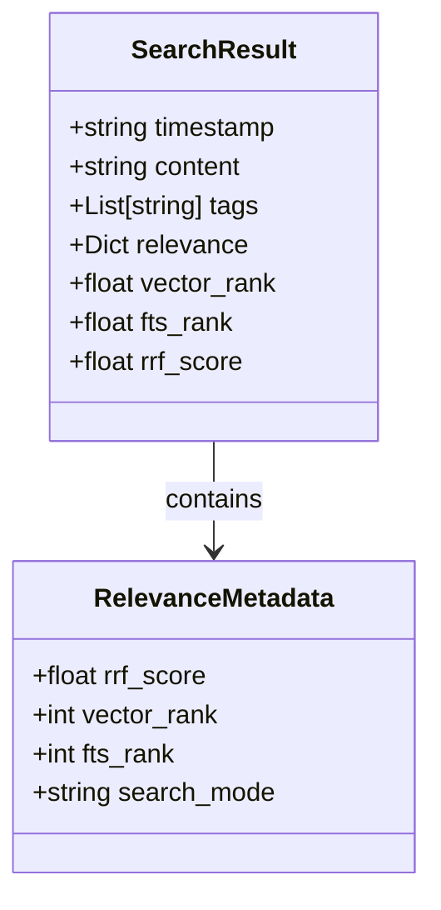

**Diagram sources**
- [agent_manager.py](file://letta/services/agent_manager.py#L2391-L2429)

### Timestamp Formatting

The system handles timezone-aware timestamps with fallback mechanisms:

| Scenario | Processing | Output Format |
|----------|------------|---------------|
| Agent has timezone | Convert to agent's timezone | ISO 8601 with timezone offset |
| No timezone specified | Use UTC timestamp | ISO 8601 without timezone |
| Conversion failure | Fallback to string representation | Original datetime string |

### Metadata Enrichment

Results receive metadata enrichment for relevance assessment:

- **RRF Score**: Reciprocal Rank Fusion score combining vector and text ranks
- **Vector Rank**: Position in vector similarity ranking
- **FTS Rank**: Position in full-text search ranking
- **Search Mode**: Indicates whether vector, text, or hybrid search was used

**Section sources**
- [agent_manager.py](file://letta/services/agent_manager.py#L2391-L2429)

## Error Handling and Integration

### Tool Execution Error Handling

The core tool executor implements comprehensive error handling:

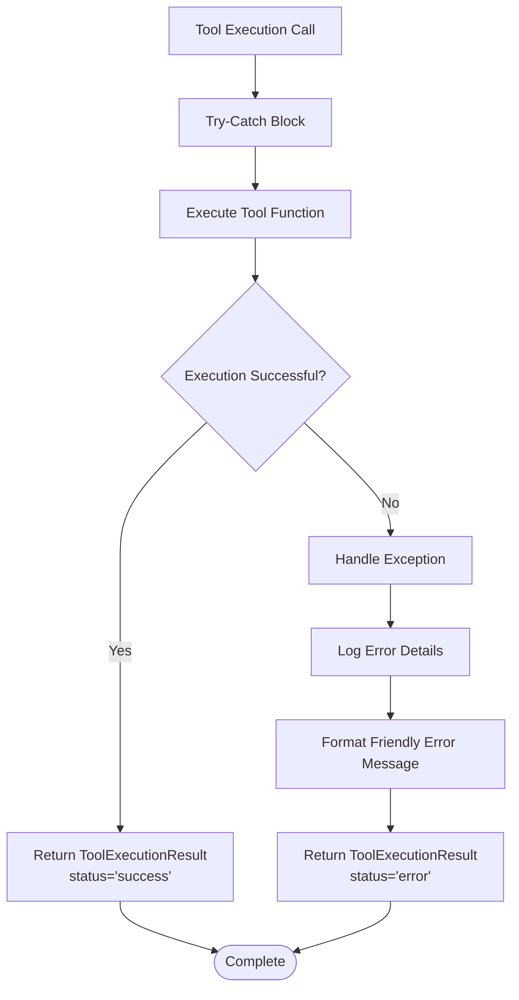

**Diagram sources**
- [core_tool_executor.py](file://letta/services/tool_executor/core_tool_executor.py#L60-L77)

### Agent Execution Flow Integration

The search tool integrates seamlessly with agent execution:

```mermaid
sequenceDiagram
participant Loop as Agent Loop
participant Tool as Tool Executor
participant Search as Memory Search
participant Context as LLM Context
Loop->>Tool : Execute tool call
Tool->>Search : archival_memory_search(...)
Search-->>Tool : formatted_results
Tool->>Context : Inject results into LLM context
Context-->>Loop : Enhanced context with search results
Loop->>Loop : Continue agent reasoning
```

**Diagram sources**
- [core_tool_executor.py](file://letta/services/tool_executor/core_tool_executor.py#L279-L307)

### Error Recovery Strategies

The system implements multiple error recovery mechanisms:

| Error Type | Recovery Strategy | Fallback Behavior |
|------------|-------------------|-------------------|
| Empty query | Return empty result list | No search performed |
| Invalid datetime format | Raise ValueError with message | Search rejected |
| Embedding generation failure | Propagate exception | Search fails completely |
| Database connection issues | Retry with backoff | Search fails with error |

**Section sources**
- [core_tool_executor.py](file://letta/services/tool_executor/core_tool_executor.py#L60-L77)
- [agent_manager.py](file://letta/services/agent_manager.py#L2324-L2430)

## Performance Optimization

### Caching Strategies

The system implements multiple caching layers for improved performance:

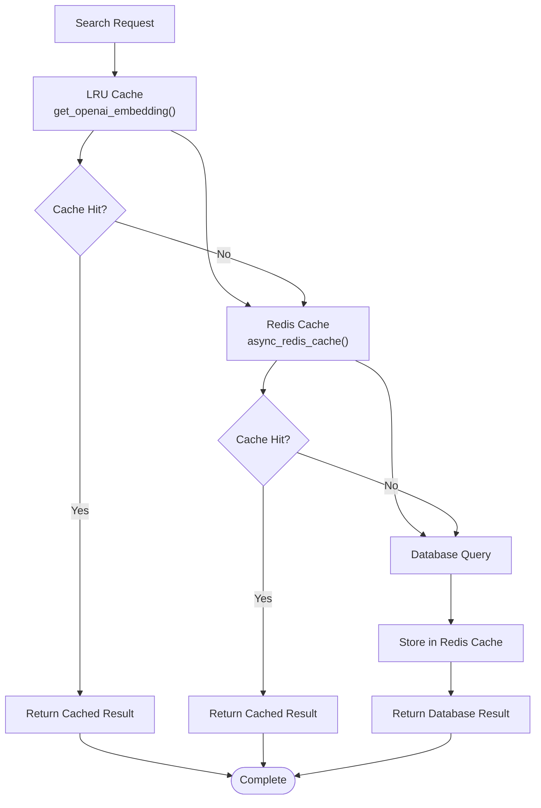

**Diagram sources**
- [passage_manager.py](file://letta/services/passage_manager.py#L32-L48)

### Concurrent Operations

The system optimizes performance through concurrent operations:

- **Embedding Generation**: Concurrent embedding requests for multiple text chunks
- **Database Queries**: Parallel execution of vector and tag filtering
- **Turbopuffer Operations**: Semaphore-controlled concurrent requests (max 5)

### Indexing and Query Optimization

Database optimization strategies include:

| Optimization | Implementation | Benefit |
|--------------|----------------|---------|
| Composite Indexes | `(archive_id, created_at)` | Faster temporal filtering |
| Tag Junction Table | Separate table for tag relationships | Efficient tag-based queries |
| Embedding Padding | Consistent vector dimensions | Optimized vector operations |
| Query Caching | LRU and Redis caching | Reduced repeated computations |

**Section sources**
- [passage_manager.py](file://letta/services/passage_manager.py#L32-L48)
- [agent_manager.py](file://letta/services/agent_manager.py#L852-L1152)

## Best Practices and Recommendations

### Tag Strategy Design

Effective tag usage requires thoughtful strategy design:

#### Tag Naming Conventions
- Use lowercase for consistency
- Employ hyphenated compound words: `python-programming`, `machine-learning`
- Maintain hierarchical structure: `tech/python`, `tech/javascript`
- Include temporal indicators: `2024-q1`, `2024-roadmap`

#### Tag Categories
- **Content Type**: `article`, `tutorial`, `reference`, `meeting-notes`
- **Domain**: `tech`, `business`, `education`, `personal`
- **Importance**: `high-priority`, `low-priority`, `draft`
- **Status**: `complete`, `in-progress`, `archived`

### Query Formulation Guidelines

#### Effective Query Construction
- **Be Specific**: Use domain-specific terminology
- **Avoid Ambiguity**: Specify context when necessary
- **Focus on Meaning**: Emphasize semantic concepts over keywords
- **Iterative Refinement**: Start broad, narrow with tags

#### Query Examples
- **Good**: `"database migration decisions timeline"`
- **Better**: `"database migration decisions and timeline Q2 2024"`
- **Too Broad**: `"database"`
- **Too Narrow**: `"database migration decisions made in March"`

### Search Parameter Tuning

#### Optimal Parameter Combinations

| Use Case | Query | Tags | Tag Mode | Top_k | Notes |
|----------|-------|------|----------|-------|-------|
| General Recall | `"project discussions"` | `[]` | N/A | 10 | Broad semantic search |
| Focused Retrieval | `"database migration"` | `["tech", "infrastructure"]` | ALL | 5 | Narrow with tags |
| Temporal Focus | `"Q2 roadmap"` | `["roadmap", "2024"]` | ANY | 8 | Time-sensitive |
| Content Type | `"tutorial on Python"` | `["tutorial"]` | ANY | 3 | Content filtering |

### Performance Optimization Tips

#### Large Dataset Management
- **Chunk Size**: Use appropriate embedding chunk sizes (default: 1000 tokens)
- **Batch Processing**: Process large text collections in batches
- **Index Maintenance**: Regular index optimization for growing datasets
- **Memory Management**: Monitor embedding cache sizes

#### Search Quality Enhancement
- **Consistent Tagging**: Maintain uniform tag usage across similar content
- **Embedding Model**: Use domain-appropriate embedding models
- **Query Expansion**: Consider synonym expansion for broader coverage
- **Result Review**: Periodically review and refine search results

**Section sources**
- [base.py](file://letta/functions/function_sets/base.py#L190-L243)
- [agent_manager.py](file://letta/services/agent_manager.py#L2306-L2323)

## Troubleshooting Guide

### Common Issues and Solutions

#### Poor Search Relevance

**Symptoms**: Irrelevant results returned for semantic queries

**Diagnosis Steps**:
1. Verify embedding model alignment with domain
2. Check query specificity and context
3. Review tag usage consistency
4. Examine passage quality and granularity

**Solutions**:
- Use domain-specific embedding models
- Refine query to include more contextual information
- Improve passage tagging with relevant categories
- Split large passages into smaller, focused units

#### Embedding Model Mismatches

**Symptoms**: Vector similarity scores inconsistent or poor

**Diagnosis Steps**:
1. Compare embedding dimensions across systems
2. Verify embedding model configurations
3. Check for padding inconsistencies
4. Validate embedding generation pipeline

**Solutions**:
- Standardize embedding models across environments
- Ensure consistent embedding dimensionality
- Implement proper padding for vector databases
- Validate embedding generation with test queries

#### Performance Bottlenecks

**Symptoms**: Slow search response times

**Diagnosis Steps**:
1. Profile query execution times
2. Monitor database connection pools
3. Check cache hit rates
4. Analyze index utilization

**Solutions**:
- Implement query result caching
- Optimize database indexes
- Increase connection pool sizes
- Use asynchronous database operations

#### Memory and Resource Issues

**Symptoms**: Out of memory errors or excessive resource usage

**Diagnosis Steps**:
1. Monitor embedding cache sizes
2. Check concurrent operation limits
3. Analyze memory usage patterns
4. Review batch processing strategies

**Solutions**:
- Implement cache eviction policies
- Limit concurrent operations with semaphores
- Use streaming for large result sets
- Optimize batch processing sizes

### Debugging Tools and Techniques

#### Logging and Monitoring
- Enable debug logging for search operations
- Monitor embedding generation times
- Track cache hit rates and miss patterns
- Measure query response latencies

#### Testing Strategies
- Unit test individual search components
- Integration test end-to-end workflows
- Performance test with realistic data volumes
- Load test concurrent search operations

#### Validation Methods
- Compare search results across different vector databases
- Validate embedding quality with semantic similarity tests
- Test tag filtering accuracy with known result sets
- Verify temporal filtering precision with timestamped data

**Section sources**
- [passage_manager.py](file://letta/services/passage_manager.py#L453-L546)
- [agent_manager.py](file://letta/services/agent_manager.py#L2324-L2430)