# LLM Provider Credentials

<cite>
**Referenced Files in This Document**   
- [settings.py](file://letta/settings.py)
- [base.py](file://letta/schemas/providers/base.py)
- [openai.py](file://letta/schemas/providers/openai.py)
- [anthropic.py](file://letta/schemas/providers/anthropic.py)
- [google_gemini.py](file://letta/schemas/providers/google_gemini.py)
- [bedrock.py](file://letta/schemas/providers/bedrock.py)
- [groq.py](file://letta/schemas/providers/groq.py)
- [together.py](file://letta/schemas/providers/together.py)
- [azure.py](file://letta/schemas/providers/azure.py)
- [xai.py](file://letta/schemas/providers/xai.py)
- [deepseek.py](file://letta/schemas/providers/deepseek.py)
- [server.py](file://letta/server/server.py)
- [provider_manager.py](file://letta/services/provider_manager.py)
- [environment_variables.py](file://letta/schemas/environment_variables.py)
</cite>

## Table of Contents
1. [Introduction](#introduction)
2. [Environment Variables Configuration](#environment-variables-configuration)
3. [Provider-Specific Credentials](#provider-specific-credentials)
4. [ModelSettings Class and Credential Handling](#modelsettings-class-and-credential-handling)
5. [Authentication Mechanisms](#authentication-mechanisms)
6. [Security Best Practices](#security-best-practices)
7. [Troubleshooting Guide](#troubleshooting-guide)
8. [Multiple Provider Configuration](#multiple-provider-configuration)
9. [Fallback Mechanisms](#fallback-mechanisms)
10. [Conclusion](#conclusion)

## Introduction
This document provides comprehensive guidance on configuring LLM provider credentials in Letta. It details the environment variables required for various LLM providers, explains the purpose of each credential, and describes how the system handles authentication and configuration. The document covers security best practices, troubleshooting common issues, and explains how to configure multiple providers simultaneously with proper fallback mechanisms.

## Environment Variables Configuration
Letta uses environment variables to configure LLM provider credentials. These variables are defined in the ModelSettings class and are automatically loaded from the environment or .env file. The system supports a wide range of LLM providers, each with their specific configuration requirements.

The environment variables follow a consistent naming convention, typically prefixed with the provider name and suffixed with "_api_key" or similar descriptors. Some providers require additional configuration parameters such as base URLs, regions, or API versions.

**Section sources**
- [settings.py](file://letta/settings.py#L100-L200)

## Provider-Specific Credentials

### OpenAI Configuration
For OpenAI integration, the following environment variables are required:

- **openai_api_key**: Your OpenAI API key for authentication
- **openai_api_base**: The base URL for the OpenAI API (defaults to "https://api.openai.com/v1")

The system also supports OpenRouter through OpenAI-compatible endpoints using:
- **openrouter_api_key**: Your OpenRouter API key
- **openrouter_referer**: Optional referer header (e.g., your site URL)
- **openrouter_title**: Optional title header (e.g., your app name)

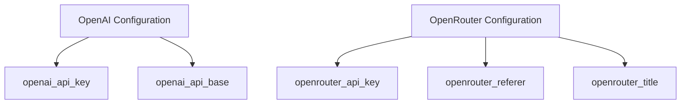

**Diagram sources**
- [settings.py](file://letta/settings.py#L113-L129)
- [openai.py](file://letta/schemas/providers/openai.py)

### Anthropic Configuration
For Anthropic integration, use the following environment variable:

- **anthropic_api_key**: Your Anthropic API key for authentication

Additional configuration options include:
- **anthropic_max_retries**: Number of retry attempts for failed requests (default: 3)
- **anthropic_sonnet_1m**: Flag to enable 1M-token context window for Claude Sonnet 4/4.5

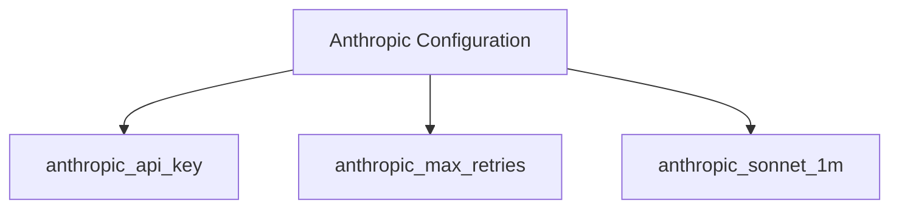

**Diagram sources**
- [settings.py](file://letta/settings.py#L146-L158)
- [anthropic.py](file://letta/schemas/providers/anthropic.py)

### Google Gemini Configuration
For Google Gemini integration, use:

- **gemini_api_key**: Your Google AI API key for authentication

Additional configuration options:
- **gemini_base_url**: Base URL for the Google AI API (defaults to "https://generativelanguage.googleapis.com/")
- **gemini_force_minimum_thinking_budget**: Flag to force minimum thinking budget
- **gemini_max_retries**: Maximum number of retries for failed requests (default: 5)

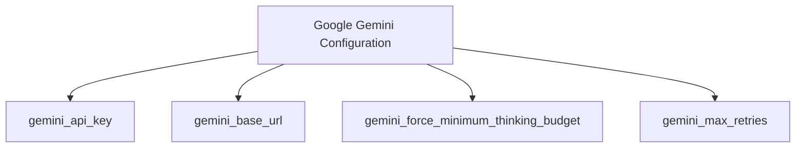

**Diagram sources**
- [settings.py](file://letta/settings.py#L171-L176)
- [google_gemini.py](file://letta/schemas/providers/google_gemini.py)

### AWS Bedrock Configuration
For AWS Bedrock integration, the following credentials are required:

- **aws_access_key_id**: AWS access key ID
- **aws_secret_access_key**: AWS secret access key
- **aws_default_region**: AWS region for Bedrock service

Additional configuration:
- **bedrock_anthropic_version**: API version for Anthropic models on Bedrock (default: "bedrock-2023-05-31")

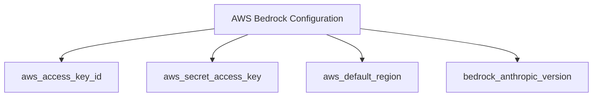

**Diagram sources**
- [settings.py](file://letta/settings.py#L140-L144)
- [bedrock.py](file://letta/schemas/providers/bedrock.py)

### Groq Configuration
For Groq integration, use:

- **groq_api_key**: Your Groq API key for authentication

The system automatically configures the base URL to "https://api.groq.com/openai/v1" as Groq provides an OpenAI-compatible API.

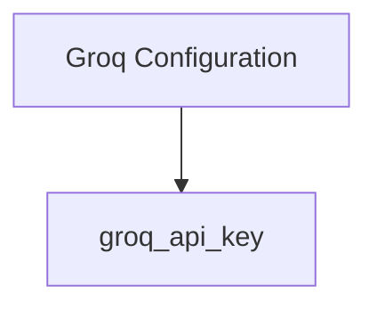

**Diagram sources**
- [settings.py](file://letta/settings.py#L137-L138)
- [groq.py](file://letta/schemas/providers/groq.py)

### Together AI Configuration
For Together AI integration, use:

- **together_api_key**: Your Together AI API key for authentication

Additional configuration:
- **default_prompt_formatter**: Default prompt formatter to use on vLLM /completions API

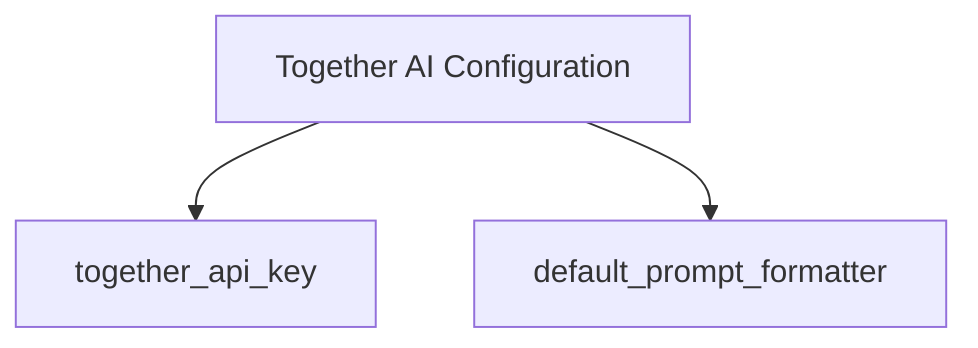

**Diagram sources**
- [settings.py](file://letta/settings.py#L181-L182)
- [together.py](file://letta/schemas/providers/together.py)

### Other Provider Configurations
Letta supports several other LLM providers with their specific configuration requirements:

**Azure OpenAI:**
- **azure_api_key**: Azure API key
- **azure_base_url**: Base URL for Azure API endpoint
- **azure_api_version**: API version for Azure API

**Google Vertex AI:**
- **google_cloud_project**: Google Cloud project ID
- **google_cloud_location**: Google Cloud location

**DeepSeek:**
- **deepseek_api_key**: DeepSeek API key

**xAI (Grok):**
- **xai_api_key**: xAI/Grok API key

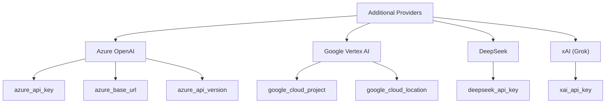

**Diagram sources**
- [settings.py](file://letta/settings.py#L163-L180)
- [azure.py](file://letta/schemas/providers/azure.py)
- [xai.py](file://letta/schemas/providers/xai.py)
- [deepseek.py](file://letta/schemas/providers/deepseek.py)

## ModelSettings Class and Credential Handling
The ModelSettings class is responsible for managing all LLM provider credentials and configuration options. It uses Pydantic's BaseSettings to automatically load environment variables and provides default values for optional parameters.

The class handles credential validation, API endpoint configuration, and provider-specific settings. It serves as the central configuration point for all LLM providers in the system.

Key features of the ModelSettings class:
- Automatic loading of environment variables from .env files
- Support for multiple configuration sources with fallback mechanisms
- Type validation and conversion for all configuration parameters
- Default values for optional configuration parameters
- Secure handling of API keys and sensitive information

The ModelSettings class is instantiated at application startup and its values are used to initialize the appropriate provider instances.

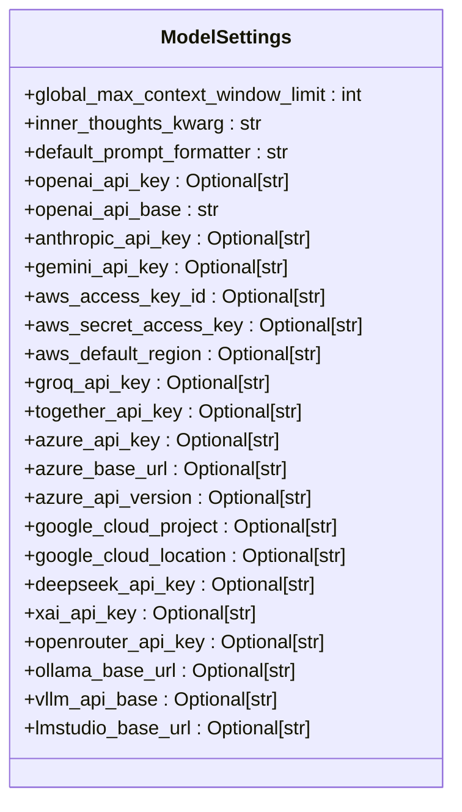

**Diagram sources**
- [settings.py](file://letta/settings.py#L100-L200)
- [base.py](file://letta/schemas/providers/base.py)

## Authentication Mechanisms
Letta implements provider-specific authentication mechanisms to ensure secure access to LLM services. Each provider has its own authentication requirements and methods.

### OpenAI Authentication
OpenAI uses API key-based authentication with the following process:
1. The API key is retrieved from the environment variable
2. The key is included in the Authorization header as "Bearer {api_key}"
3. Requests are sent to the configured base URL

The system validates the API key by making a test request to the models endpoint.

### Anthropic Authentication
Anthropic uses API key-based authentication with these characteristics:
1. The API key is retrieved from the environment variable
2. The key is included in the Authorization header as "Bearer {api_key}"
3. All requests are sent to "https://api.anthropic.com/v1"

Authentication is validated by attempting to count tokens with a simple message.

### Google Gemini Authentication
Google Gemini uses API key-based authentication with the following flow:
1. The API key is retrieved from the environment variable
2. The key is included as a query parameter "key={api_key}"
3. Requests are sent to the Google AI API base URL

Authentication is validated by making a test request to list available models.

### AWS Bedrock Authentication
AWS Bedrock uses AWS Signature Version 4 authentication:
1. AWS access key ID and secret access key are retrieved from environment variables
2. Requests are signed using AWS Signature Version 4 algorithm
3. The region is specified in the request
4. Requests are sent to the Bedrock service endpoint

Authentication is validated by attempting to list inference profiles.

### Groq and Together AI Authentication
Both Groq and Together AI use OpenAI-compatible authentication:
1. API keys are retrieved from environment variables
2. Keys are included in the Authorization header as "Bearer {api_key}"
3. Requests are sent to their respective OpenAI-compatible endpoints

Authentication is validated by attempting to list available models.

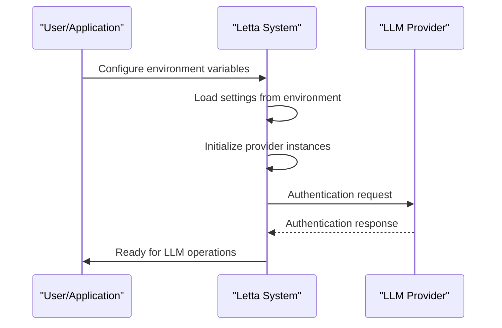

**Diagram sources**
- [server.py](file://letta/server/server.py#L209-L307)
- [provider_manager.py](file://letta/services/provider_manager.py#L421-L453)

## Security Best Practices
Proper management of API keys and credentials is critical for maintaining system security. Letta implements several security best practices for handling LLM provider credentials.

### Environment Variable Naming Conventions
Letta follows a consistent naming convention for environment variables:
- All variable names are lowercase
- Words are separated by underscores
- Variables are prefixed with the provider name
- Sensitive variables end with "_key" or "_secret"

For organization-level variables, the "letta_" prefix is recommended to avoid conflicts with other applications.

### Secure Credential Storage
The system implements multiple layers of security for credential storage:
- API keys are never stored in plain text in the database
- Sensitive fields are encrypted using the Secret class
- Environment variables are the primary source of credentials
- In-memory storage of decrypted keys is minimized

### Credential Rotation and Management
Best practices for credential management include:
- Regular rotation of API keys
- Use of temporary credentials when possible
- Limited scope permissions for API keys
- Monitoring of API key usage and access patterns
- Immediate revocation of compromised keys

### Environment Configuration
Recommended environment configuration practices:
- Use .env files for development environments
- Use environment variables in production
- Never commit .env files to version control
- Use different credentials for development and production
- Implement access controls for credential management

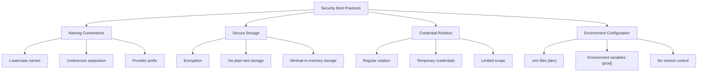

**Diagram sources**
- [settings.py](file://letta/settings.py)
- [environment_variables.py](file://letta/schemas/environment_variables.py)
- [base.py](file://letta/schemas/providers/base.py)

## Troubleshooting Guide
This section addresses common issues encountered when configuring LLM provider credentials and provides solutions for resolving them.

### Authentication Issues
Common authentication problems and their solutions:

**Invalid API Key:**
- Verify the API key is correct and not expired
- Check for typos or extra whitespace
- Regenerate the API key if necessary
- Ensure the key has the required permissions

**Missing Required Credentials:**
- Verify all required environment variables are set
- Check the provider's documentation for required parameters
- Use the appropriate configuration for your provider

**Region-Specific Configuration:**
- Verify the correct region is specified for regional services
- Check that the service is available in your specified region
- Ensure network connectivity to the regional endpoint

### Rate Limiting
Handling rate limiting issues:

**Symptoms:**
- HTTP 429 status codes
- Slow response times
- Intermittent failures

**Solutions:**
- Implement retry logic with exponential backoff
- Cache responses when appropriate
- Monitor usage against rate limits
- Request rate limit increases from the provider
- Distribute load across multiple API keys

### Configuration Requirements
Addressing region-specific and provider-specific requirements:

**AWS Region Configuration:**
- Verify the region is correctly specified
- Check that Bedrock is enabled in your region
- Ensure IAM permissions are configured for the region

**Azure API Version:**
- Use the latest supported API version
- Check Microsoft's deprecation schedule
- Update API version as needed

**Provider-Specific Endpoints:**
- Verify the correct base URL is used
- Check for provider-specific URL requirements
- Test connectivity to the endpoint

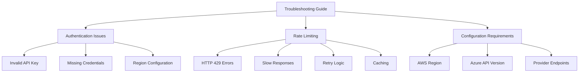

**Diagram sources**
- [server.py](file://letta/server/server.py)
- [provider_manager.py](file://letta/services/provider_manager.py)
- [settings.py](file://letta/settings.py)

## Multiple Provider Configuration
Letta supports configuring multiple LLM providers simultaneously, allowing for flexible deployment scenarios and fallback mechanisms.

### Simultaneous Provider Setup
To configure multiple providers, set the environment variables for each provider you want to enable:

```python
# Example: Configuring multiple providers
openai_api_key="your-openai-key"
anthropic_api_key="your-anthropic-key"
gemini_api_key="your-gemini-key"
groq_api_key="your-groq-key"
```

The system automatically detects which providers are configured based on the presence of their respective API keys.

### Provider Initialization
During startup, the system initializes providers in the following order:
1. Check for each provider's API key in environment variables
2. If present, create and configure the provider instance
3. Add the provider to the list of enabled providers
4. Validate the provider configuration

This allows multiple providers to be active simultaneously, with each provider managing its own models and endpoints.

### Use Cases for Multiple Providers
Configuring multiple providers enables several valuable use cases:

**Cost Optimization:**
- Route requests to the most cost-effective provider
- Use different providers for different model types
- Balance load across providers based on pricing

**Performance Optimization:**
- Use specialized providers for specific tasks
- Route requests based on latency requirements
- Implement provider-specific optimizations

**Redundancy and Reliability:**
- Provide backup options if a provider is unavailable
- Implement graceful degradation
- Maintain service availability during provider outages

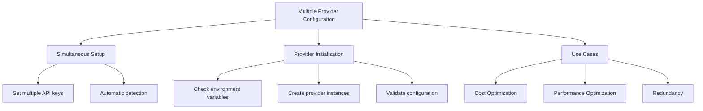

**Diagram sources**
- [server.py](file://letta/server/server.py#L209-L307)
- [provider_manager.py](file://letta/services/provider_manager.py)

## Fallback Mechanisms
Letta implements sophisticated fallback mechanisms to ensure reliability when multiple providers are configured.

### Provider Selection Strategy
The system uses a hierarchical approach to provider selection:

1. **Primary Provider**: The first configured provider is used as the primary
2. **Secondary Providers**: Additional providers serve as backups
3. **Provider Health Monitoring**: Active monitoring of provider availability
4. **Automatic Failover**: Seamless switching to backup providers

### Fallback Triggers
The system initiates fallback under the following conditions:

**Provider Unavailability:**
- Network connectivity issues
- Service outages
- DNS resolution failures

**Authentication Failures:**
- Invalid or expired API keys
- Permission denied errors
- Account suspension

**Rate Limiting:**
- Exceeded rate limits
- Quota exhaustion
- Temporary bans

**Performance Degradation:**
- Excessive response times
- Timeout errors
- High error rates

### Fallback Process
The fallback process follows these steps:

1. **Detection**: Monitor provider health and performance
2. **Evaluation**: Assess the severity and duration of issues
3. **Transition**: Switch to the next available provider
4. **Notification**: Log the transition and notify administrators
5. **Recovery**: Monitor the original provider for recovery
6. **Failback**: Return to the primary provider when stable

### Configuration Options
The fallback behavior can be customized through configuration:

- **Retry Attempts**: Number of retry attempts before failing over
- **Retry Delay**: Time between retry attempts
- **Health Check Interval**: Frequency of provider health checks
- **Failback Policy**: Conditions for returning to primary provider

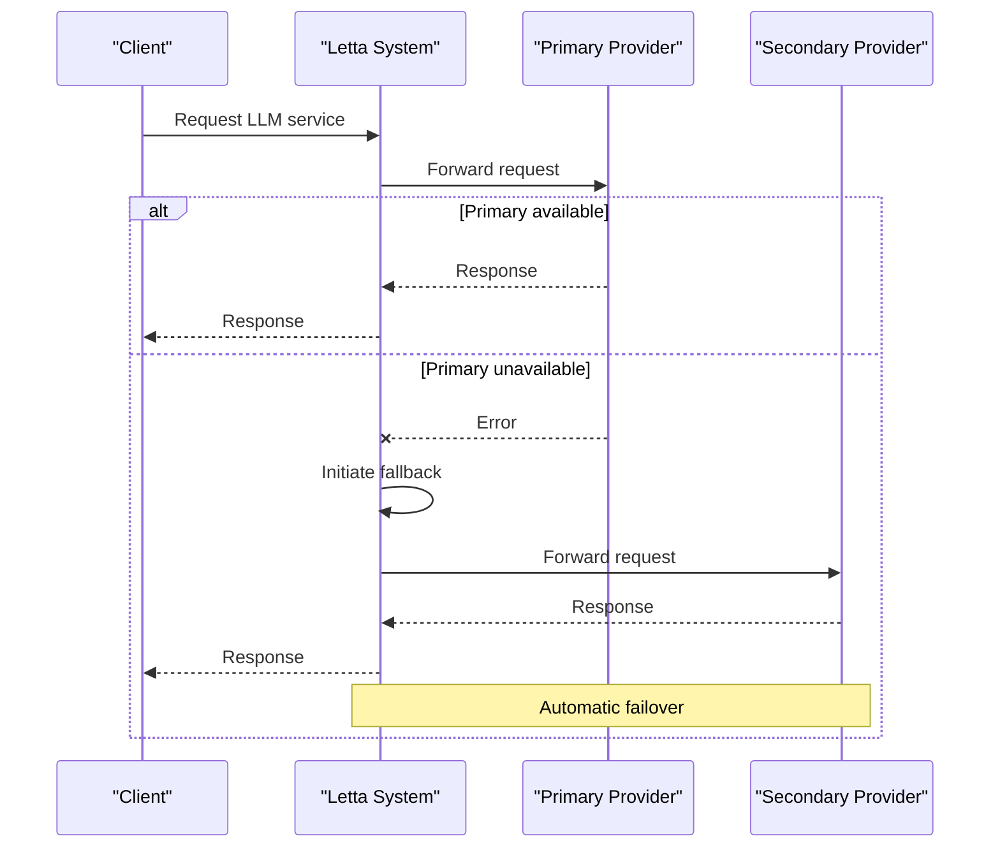

**Diagram sources**
- [server.py](file://letta/server/server.py)
- [provider_manager.py](file://letta/services/provider_manager.py)

## Conclusion
Letta provides comprehensive support for configuring multiple LLM providers with robust security, authentication, and fallback mechanisms. By following the guidelines in this document, users can effectively configure and manage credentials for various LLM providers including OpenAI, Anthropic, Google Gemini, AWS Bedrock, Groq, Together AI, and others.

The system's flexible architecture allows for simultaneous configuration of multiple providers, enabling cost optimization, performance tuning, and improved reliability through automatic fallback mechanisms. Security best practices are implemented throughout the credential management process, ensuring that sensitive API keys are handled securely.

By understanding the provider-specific requirements, authentication mechanisms, and troubleshooting techniques outlined in this document, users can successfully deploy and maintain Letta with their preferred LLM providers.