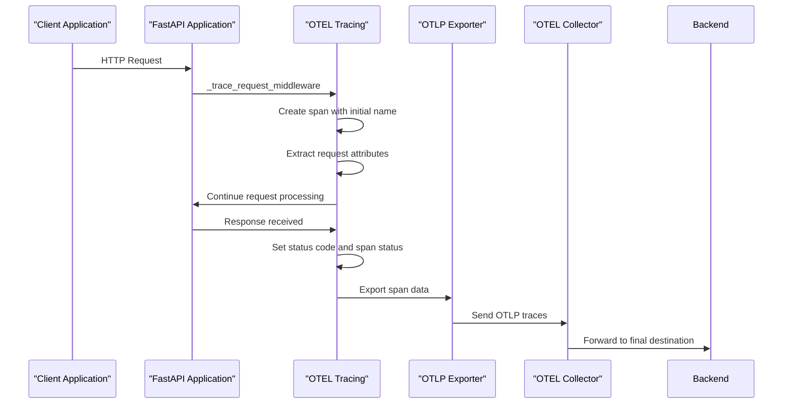
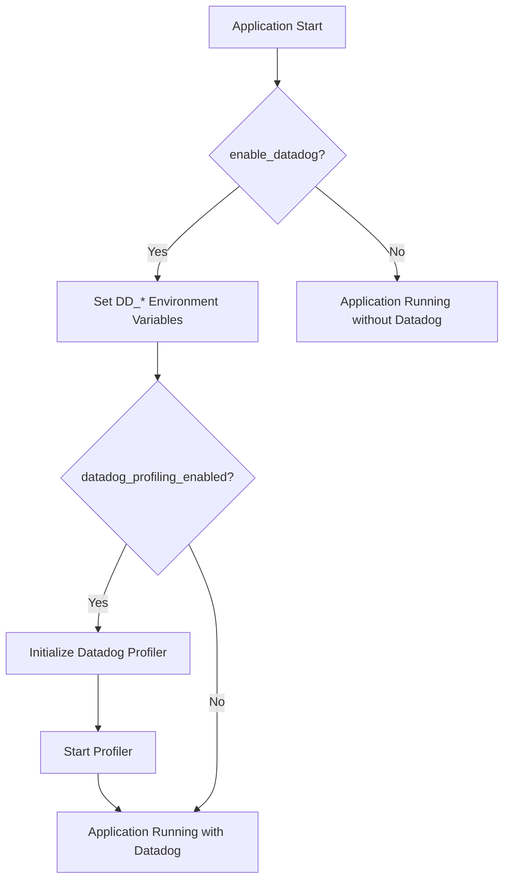
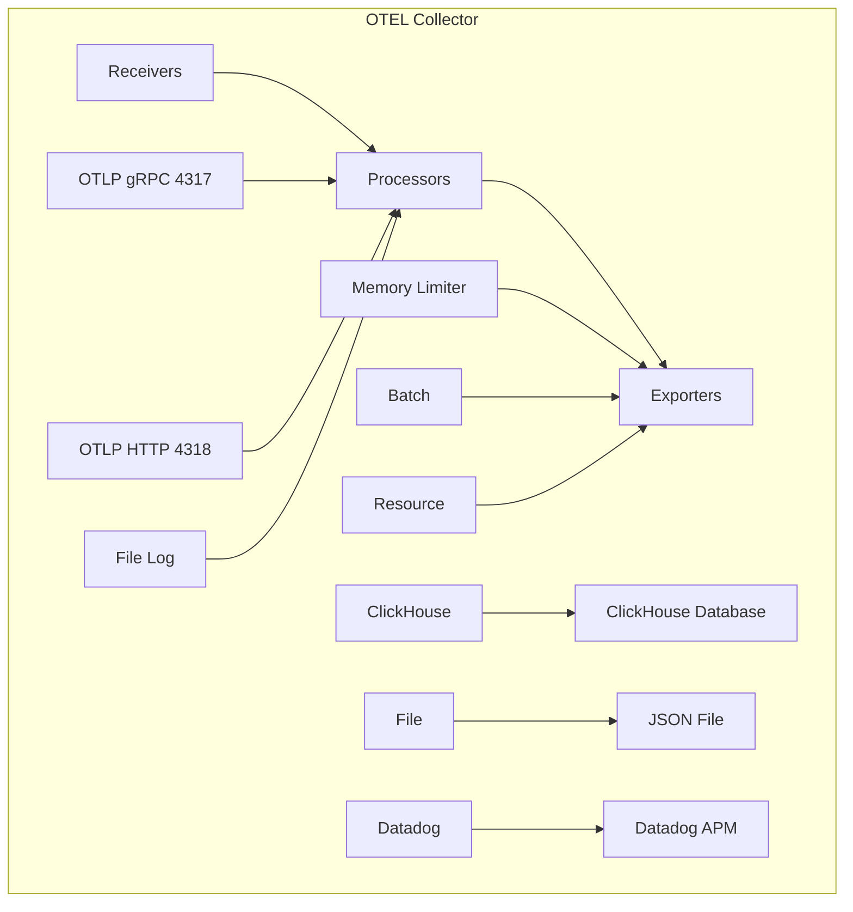
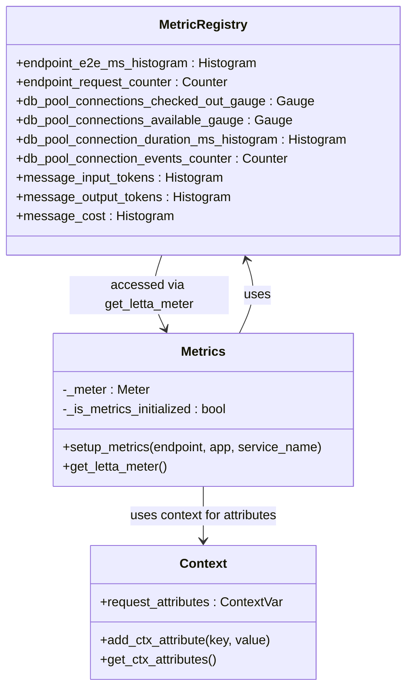
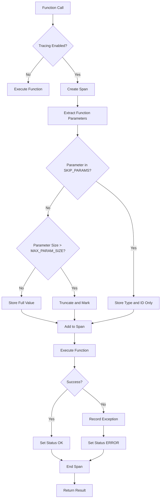

# Telemetry and Monitoring

<cite>
**Referenced Files in This Document**   
- [settings.py](file://letta/settings.py)
- [tracing.py](file://letta/otel/tracing.py)
- [metrics.py](file://letta/otel/metrics.py)
- [app.py](file://letta/server/rest_api/app.py)
- [otel-collector-config-clickhouse.yaml](file://otel/otel-collector-config-clickhouse.yaml)
- [otel-collector-config-file.yaml](file://otel/otel-collector-config-file.yaml)
- [start-otel-collector.sh](file://otel/start-otel-collector.sh)
- [resource.py](file://letta/otel/resource.py)
- [metric_registry.py](file://letta/otel/metric_registry.py)
- [context.py](file://letta/otel/context.py)
- [db_pool_monitoring.py](file://letta/otel/db_pool_monitoring.py)
- [log.py](file://letta/log.py)
</cite>

## Table of Contents
1. [Introduction](#introduction)
2. [Telemetry Configuration Environment Variables](#telemetry-configuration-environment-variables)
3. [OpenTelemetry Integration](#opentelemetry-integration)
4. [Datadog Configuration and Integration](#datadog-configuration-and-integration)
5. [Source Code Integration with Git](#source-code-integration-with-git)
6. [OpenTelemetry Collector Configuration](#opentelemetry-collector-configuration)
7. [Performance Monitoring and Metrics](#performance-monitoring-and-metrics)
8. [Tracing Configuration and Control](#tracing-configuration-and-control)
9. [Environment-Specific Configuration Examples](#environment-specific-configuration-examples)
10. [Troubleshooting Telemetry Issues](#troubleshooting-telemetry-issues)
11. [Best Practices for Securing Telemetry Endpoints](#best-practices-for-securing-telemetry-endpoints)
12. [Conclusion](#conclusion)

## Introduction

Letta provides comprehensive telemetry and monitoring capabilities through integration with OpenTelemetry (OTEL) and Datadog, enabling detailed observability for distributed tracing, metrics collection, and performance profiling. The system is designed to capture detailed operational data across the application stack, from HTTP request processing to database interactions and agent execution workflows.

The telemetry infrastructure in Letta is built on industry-standard OpenTelemetry protocols, allowing for flexible export to various backends including ClickHouse, Datadog, and file-based storage. This documentation provides a comprehensive guide to configuring and utilizing Letta's observability features, covering environment variables, collector configurations, and integration patterns that enable effective monitoring and troubleshooting of Letta deployments across different environments.

**Section sources**
- [settings.py](file://letta/settings.py)
- [tracing.py](file://letta/otel/tracing.py)

## Telemetry Configuration Environment Variables

Letta's telemetry system is configured through a comprehensive set of environment variables that control various aspects of observability, including OpenTelemetry export, Datadog integration, and tracing behavior. These variables are defined in the `TelemetrySettings` class within the application's settings module.

The primary environment variables for telemetry configuration include:

- `letta_telemetry_enable_datadog`: Enables Datadog APM and profiling integration
- `letta_telemetry_datadog_agent_host`: Specifies the Datadog agent hostname or IP address
- `letta_telemetry_datadog_agent_port`: Sets the Datadog trace agent port (typically 8126)
- `letta_telemetry_datadog_service_name`: Defines the service name for Datadog profiling
- `letta_telemetry_datadog_profiling_enabled`: Enables Datadog profiling capabilities
- `letta_telemetry_otel_preferred_temporality`: Controls metric export temporality (DELTA or CUMULATIVE)
- `letta_telemetry_disable_tracing`: Allows disabling of OTEL tracing when needed

Additional variables for source code integration include `letta_telemetry_datadog_git_repository_url` and `letta_telemetry_datadog_git_commit_sha`, which link telemetry data to specific code versions. The `letta_telemetry_verbose_telemetry_logging` variable enables detailed logging of telemetry operations for debugging purposes.

**Section sources**
- [settings.py](file://letta/settings.py#L413-L459)

## OpenTelemetry Integration

Letta's OpenTelemetry integration provides comprehensive distributed tracing capabilities that capture the flow of requests through the system. The integration is implemented in the `tracing.py` module and is initialized during application startup when an OpenTelemetry endpoint is configured.

The tracing system automatically instruments HTTP requests, capturing key attributes such as:
- HTTP method and URL
- Request and response status codes
- Path parameters
- Custom headers including user_id, organization_id, and agent_id
- Request body parameters (with size limitations to prevent excessive data collection)



**Diagram sources**
- [tracing.py](file://letta/otel/tracing.py#L38-L57)
- [app.py](file://letta/server/rest_api/app.py)

## Datadog Configuration and Integration

Letta provides deep integration with Datadog for application performance monitoring (APM) and profiling. The Datadog integration is controlled by several environment variables that configure the connection to the Datadog agent and enable various monitoring features.

When `enable_datadog` is set to true, Letta configures the Datadog tracer by setting environment variables such as `DD_ENV`, `DD_SERVICE`, `DD_VERSION`, and `DD_AGENT_HOST`. The integration also supports profiling capabilities through the `datadog_profiling_enabled` flag, which when enabled, initializes the Datadog profiler with the appropriate service, environment, and version information.



The integration also includes automatic correlation between logs and traces, ensuring that log entries include trace and span IDs when available. This enables seamless navigation from logs to corresponding traces in the Datadog UI, providing a complete view of request processing.

**Diagram sources**
- [app.py](file://letta/server/rest_api/app.py#L229-L253)
- [log.py](file://letta/log.py#L61-L73)

## Source Code Integration with Git

Letta's telemetry system supports source code integration that links observability data to specific code versions, enabling developers to navigate directly from performance profiles and traces to the corresponding source code in their Git repository. This integration is particularly valuable for debugging and performance optimization.

The source code integration is configured through three key environment variables:
- `datadog_git_repository_url`: The URL of the Git repository (e.g., 'https://github.com/org/repo')
- `datadog_git_commit_sha`: The Git commit SHA for the deployed code
- `datadog_main_package`: The primary Python package name for source code linking

These variables are typically set at build time, with the commit SHA obtained using `git rev-parse HEAD`. When configured, this integration allows Datadog to display code-level insights, showing exactly which lines of code are responsible for performance bottlenecks or errors.

The `datadog_main_package` setting is particularly important as it helps Datadog distinguish between application code and third-party dependencies, focusing the code navigation experience on the relevant application code rather than library code.

**Section sources**
- [settings.py](file://letta/settings.py#L435-L448)

## OpenTelemetry Collector Configuration

Letta includes multiple OpenTelemetry Collector configuration files that define how telemetry data is processed and exported. These configurations are located in the `otel/` directory and support different deployment scenarios and backends.

The primary configuration files include:
- `otel-collector-config-clickhouse.yaml`: Configures export to ClickHouse database
- `otel-collector-config-file.yaml`: Configures export to local JSON files
- `otel-collector-config-signoz.yaml`: Configures export to SigNoz
- Development variants with `-dev` suffix for local development



**Diagram sources**
- [otel-collector-config-clickhouse.yaml](file://otel/otel-collector-config-clickhouse.yaml)
- [otel-collector-config-file.yaml](file://otel/otel-collector-config-file.yaml)

The collector is started using the `start-otel-collector.sh` script, which automatically selects the appropriate configuration based on environment variables like `CLICKHOUSE_ENDPOINT` and `CLICKHOUSE_PASSWORD`. The script downloads the appropriate OTEL Collector binary and starts it with the selected configuration.

**Section sources**
- [start-otel-collector.sh](file://otel/start-otel-collector.sh#L132-L145)
- [otel-collector-config-clickhouse.yaml](file://otel/otel-collector-config-clickhouse.yaml)

## Performance Monitoring and Metrics

Letta's performance monitoring system captures detailed metrics about application behavior, focusing on endpoint performance, database interactions, and resource utilization. The metrics system is implemented in the `metrics.py` module and uses OpenTelemetry's metrics SDK to collect and export data.

Key metrics collected by Letta include:
- Endpoint latency (hist_endpoint_e2e_ms)
- Request counts (endpoint_request_counter)
- Database connection pool statistics
- Message processing costs and token usage
- LLM API call durations and costs



**Diagram sources**
- [metric_registry.py](file://letta/otel/metric_registry.py)
- [metrics.py](file://letta/otel/metrics.py)

The metrics system uses a middleware approach to capture HTTP request metrics, recording latency and request counts for specific endpoints defined in the `_included_v1_endpoints_regex` list. This opt-in approach ensures that only high-value endpoints are monitored, reducing overhead while still capturing critical performance data.

**Section sources**
- [metrics.py](file://letta/otel/metrics.py#L40-L75)
- [metric_registry.py](file://letta/otel/metric_registry.py)

## Tracing Configuration and Control

Letta provides fine-grained control over tracing behavior through configuration options that balance observability with performance and data privacy. The tracing system is designed to capture meaningful diagnostic information while avoiding excessive data collection that could impact performance or expose sensitive information.

The `trace_method` decorator in `tracing.py` implements intelligent parameter collection, automatically excluding large or sensitive parameters such as `agent_state`, `messages`, and `memory`. The system includes size limits (2MB per parameter, 4MB total) to prevent excessive data collection, with truncation and notification when limits are exceeded.



**Diagram sources**
- [tracing.py](file://letta/otel/tracing.py#L210-L417)

The tracing system also includes automatic error handling, recording exceptions with stack traces and relevant context. This ensures that failures are properly captured in telemetry data, making it easier to diagnose issues in production environments.

**Section sources**
- [tracing.py](file://letta/otel/tracing.py)

## Environment-Specific Configuration Examples

Letta's telemetry configuration can be tailored to different environments (development, staging, production) to balance observability needs with performance and security requirements. The configuration approach varies based on the deployment environment and monitoring requirements.

For development environments, a file-based export configuration is typically used, allowing developers to inspect trace data locally without requiring external services:

```yaml
# otel-collector-config-file-dev.yaml
receivers:
  otlp:
    protocols:
      grpc:
        endpoint: localhost:4317
      http:
        endpoint: localhost:4318

exporters:
  file:
    path: ${HOME}/.letta/logs/traces.json

service:
  pipelines:
    traces:
      receivers: [otlp]
      exporters: [file]
```

For production environments, a ClickHouse or Datadog configuration is recommended for scalable, high-performance telemetry storage and analysis:

```yaml
# Production configuration with ClickHouse and Datadog
exporters:
  clickhouse:
    endpoint: ${CLICKHOUSE_ENDPOINT}
    database: ${CLICKHOUSE_DATABASE}
  datadog:
    api:
      site: ${env:DD_SITE}
      key: ${env:DD_API_KEY}

service:
  pipelines:
    traces:
      receivers: [otlp]
      exporters: [clickhouse, datadog]
    metrics:
      receivers: [otlp]
      exporters: [clickhouse]
```

The environment-specific configuration is controlled through environment variables and the `start-otel-collector.sh` script, which automatically selects the appropriate configuration based on available environment variables.

**Section sources**
- [otel-collector-config-file-dev.yaml](file://otel/otel-collector-config-file-dev.yaml)
- [otel-collector-config-clickhouse-prod.yaml](file://otel/otel-collector-config-clickhouse-prod.yaml)
- [start-otel-collector.sh](file://otel/start-otel-collector.sh)

## Troubleshooting Telemetry Issues

When troubleshooting telemetry issues in Letta, several common problems and their solutions should be considered. The most frequent issues relate to connectivity, configuration, and data visibility.

Connectivity issues between the application and the OpenTelemetry Collector are common, particularly when the collector is running in a different network segment. Ensure that the `OTEL_EXPORTER_OTLP_ENDPOINT` points to the correct hostname and port (typically 4317 for gRPC or 4318 for HTTP) and that network connectivity is available.

Configuration issues often arise from incorrect environment variable names or values. The telemetry variables use the `letta_telemetry_` prefix, and it's important to use the correct case and spelling. For Datadog integration, verify that the `DD_ENV`, `DD_SERVICE`, and `DD_VERSION` variables are set correctly.

Data visibility issues can occur when the sampling rate is too low or when specific endpoints are excluded from tracing. Check the `_excluded_v1_endpoints_regex` configuration in `tracing.py` to ensure that the endpoints you want to monitor are not being excluded.

When debugging, enable verbose telemetry logging with `letta_telemetry_verbose_telemetry_logging=true` to get detailed information about telemetry operations. This can help identify issues with span creation, parameter collection, and export failures.

**Section sources**
- [tracing.py](file://letta/otel/tracing.py#L28-L35)
- [settings.py](file://letta/settings.py#L410)

## Best Practices for Securing Telemetry Endpoints

Securing telemetry endpoints in Letta is critical to protect sensitive operational data and prevent unauthorized access to system internals. Several best practices should be followed to ensure the security of telemetry data.

First, always use secure communication channels for telemetry data export. Configure TLS for the OpenTelemetry Collector endpoints and use secure protocols (HTTPS) when exporting to external services like Datadog. The collector should be configured with appropriate authentication and authorization mechanisms to prevent unauthorized access.

Second, implement network segmentation to isolate the telemetry infrastructure. The OpenTelemetry Collector should be deployed in a secure network segment with restricted access, and firewall rules should limit connectivity to only trusted sources.

Third, carefully control what data is collected and exported. The tracing system should be configured to exclude sensitive information from span attributes, and parameter collection should be limited to essential data. Regularly review the data being collected to ensure it doesn't include sensitive information like credentials or personal data.

Finally, implement proper access controls for telemetry data. Ensure that only authorized personnel have access to the telemetry backend (ClickHouse, Datadog, etc.), and use role-based access control to limit access based on job responsibilities.

**Section sources**
- [tracing.py](file://letta/otel/tracing.py#L234-L251)
- [metrics.py](file://letta/otel/metrics.py#L234-L251)

## Conclusion

Letta's telemetry and monitoring system provides comprehensive observability capabilities through integration with OpenTelemetry and Datadog. The system enables detailed distributed tracing, metrics collection, and performance profiling, helping teams understand and optimize the behavior of their Letta deployments.

By configuring the appropriate environment variables and collector settings, organizations can tailor the telemetry system to their specific needs, balancing observability with performance and security requirements. The integration with source code repositories through Git metadata enables powerful debugging capabilities, allowing developers to navigate directly from performance issues to the relevant code.

As Letta deployments scale, the telemetry system provides valuable insights into system behavior, helping identify performance bottlenecks, troubleshoot issues, and optimize resource utilization. By following the best practices outlined in this documentation, teams can ensure they have the visibility needed to operate Letta effectively in production environments.