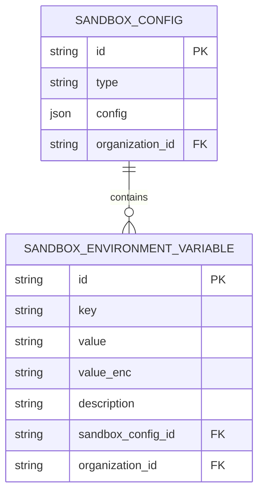
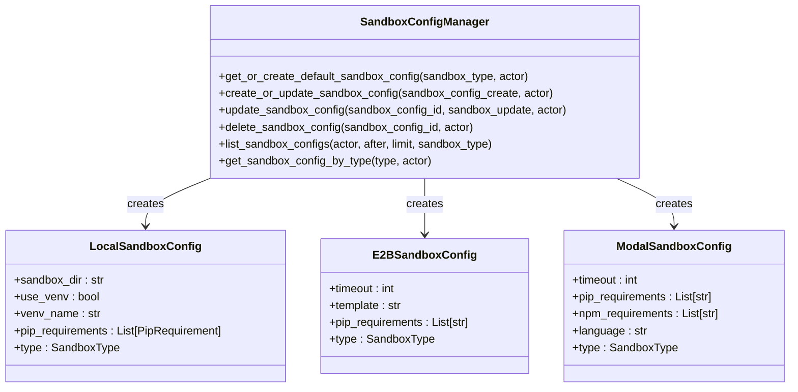
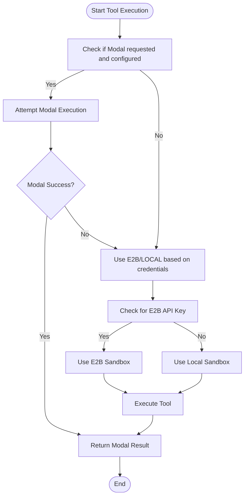
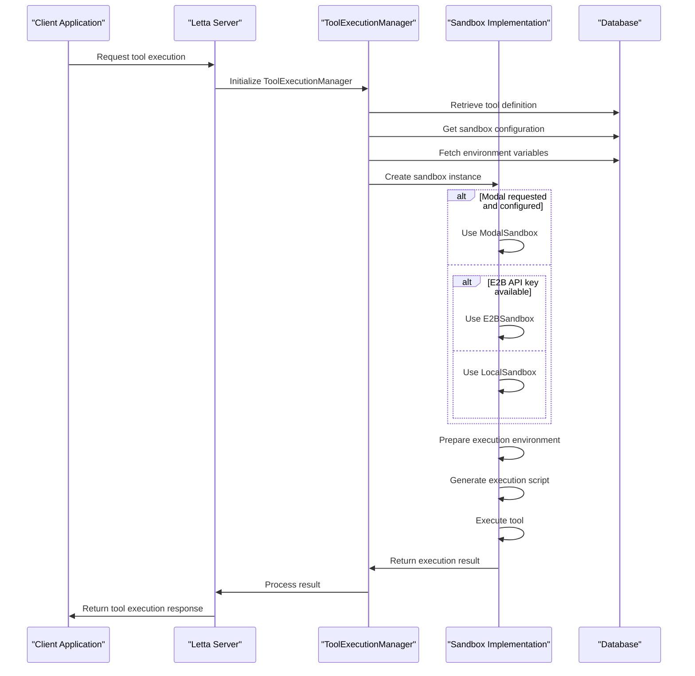

# Tool Sandbox Configuration

<cite>
**Referenced Files in This Document**   
- [settings.py](file://letta/settings.py)
- [sandbox_config.py](file://letta/schemas/sandbox_config.py)
- [sandbox_config_manager.py](file://letta/services/sandbox_config_manager.py)
- [tool_execution_sandbox.py](file://letta/services/tool_executor/tool_execution_sandbox.py)
- [sandbox_tool_executor.py](file://letta/services/tool_executor/sandbox_tool_executor.py)
- [e2b_sandbox.py](file://letta/services/tool_sandbox/e2b_sandbox.py)
- [local_sandbox.py](file://letta/services/tool_sandbox/local_sandbox.py)
- [modal_sandbox.py](file://letta/services/tool_sandbox/modal_sandbox.py)
- [modal_constants.py](file://letta/services/tool_sandbox/modal_constants.py)
- [orm/sandbox_config.py](file://letta/orm/sandbox_config.py)
- [alembic/versions/f81ceea2c08d_create_sandbox_config_and_sandbox_env_.py](file://alembic/versions/f81ceea2c08d_create_sandbox_config_and_sandbox_env_.py)
</cite>

## Table of Contents
1. [Introduction](#introduction)
2. [Sandbox Environment Variables](#sandbox-environment-variables)
3. [ToolSettings Class and Sandbox Type Determination](#toolsettings-class-and-sandbox-type-determination)
4. [Sandbox Configuration Options](#sandbox-configuration-options)
5. [Sandbox Fallback Mechanism](#sandbox-fallback-mechanism)
6. [Sandbox Setup Examples](#sandbox-setup-examples)
7. [Security Implications](#security-implications)
8. [Troubleshooting Common Issues](#troubleshooting-common-issues)
9. [Integration with Tool Execution System](#integration-with-tool-execution-system)
10. [Conclusion](#conclusion)

## Introduction
The Letta tool execution system provides a secure and isolated environment for running tools through its sandbox configuration system. This document details the comprehensive configuration options for tool execution environments, including E2B, Modal, and local sandbox settings. The system is designed to provide flexibility in execution environments while maintaining security and reliability. The configuration system allows for environment-specific variables, timeout settings, virtual environment management, and autoreload behavior. The system intelligently determines the default sandbox type based on available credentials and provides a fallback mechanism between different sandbox types to ensure tool execution reliability.

**Section sources**
- [settings.py](file://letta/settings.py#L17-L58)
- [sandbox_config.py](file://letta/schemas/sandbox_config.py#L1-L144)

## Sandbox Environment Variables
The Letta sandbox system supports environment variables at multiple levels, providing flexibility for configuring tool execution environments. These variables are stored in the database and can be accessed during tool execution.

### Database Schema
The sandbox environment variables are stored in the `sandbox_environment_variables` table, which has the following structure:
- `id`: Unique identifier for the environment variable
- `key`: Name of the environment variable
- `value`: Value of the environment variable (plaintext)
- `value_enc`: Encrypted value of the environment variable
- `description`: Optional description of the environment variable
- `sandbox_config_id`: Foreign key linking to the sandbox configuration
- `organization_id`: Organization identifier for access control

The table enforces a unique constraint on the combination of `key` and `sandbox_config_id` to prevent duplicate variable names within the same sandbox configuration.



**Diagram sources **
- [alembic/versions/f81ceea2c08d_create_sandbox_config_and_sandbox_env_.py](file://alembic/versions/f81ceea2c08d_create_sandbox_config_and_sandbox_env_.py#L28-L70)
- [orm/sandbox_config.py](file://letta/orm/sandbox_config.py#L38-L58)

### Environment Variable Management
The `SandboxConfigManager` class provides methods for managing environment variables:

- `create_sandbox_env_var_async`: Creates a new environment variable or updates an existing one if the key already exists
- `update_sandbox_env_var_async`: Updates an existing environment variable
- `delete_sandbox_env_var_async`: Deletes an environment variable
- `list_sandbox_env_vars_async`: Lists environment variables with optional pagination
- `get_sandbox_env_var_by_key_and_sandbox_config_id_async`: Retrieves an environment variable by key and sandbox configuration ID

Environment variables are automatically encrypted when stored using the `Secret` class from `letta.schemas.secret`. The system maintains both encrypted and plaintext values during a migration period, but prioritizes encrypted values for security.

**Section sources**
- [sandbox_config_manager.py](file://letta/services/sandbox_config_manager.py#L180-L353)
- [orm/sandbox_config.py](file://letta/orm/sandbox_config.py#L38-L58)

## ToolSettings Class and Sandbox Type Determination
The `ToolSettings` class in `letta/settings.py` manages the configuration for tool execution environments and determines the default sandbox type based on available credentials.

### Environment Variables
The `ToolSettings` class defines the following environment variables for sandbox configuration:

- `e2b_api_key`: API key for using E2B as a tool sandbox
- `e2b_sandbox_template_id`: Template ID for E2B Sandbox
- `modal_token_id`: Token ID for using Modal as a tool sandbox
- `modal_token_secret`: Token secret for using Modal as a tool sandbox
- `tool_exec_dir`: Directory for local tool execution (defaults to `LETTA_TOOL_EXECUTION_DIR`)
- `tool_sandbox_timeout`: Timeout for tool execution in seconds (defaults to 180)
- `tool_exec_venv_name`: Name for the virtual environment in the sandbox directory (defaults to "venv")
- `tool_exec_autoreload_venv`: Whether to automatically recreate the virtual environment (defaults to True)

### Sandbox Type Property
The `sandbox_type` property in the `ToolSettings` class determines the default sandbox type based on credential availability:

```python
@property
def sandbox_type(self) -> SandboxType:
    """Default sandbox type based on available credentials.
    
    Note: Modal is checked separately via modal_sandbox_enabled property.
    This property determines the fallback behavior (E2B or LOCAL).
    """
    if self.e2b_api_key:
        return SandboxType.E2B
    else:
        return SandboxType.LOCAL
```

This logic prioritizes E2B as the default sandbox when an API key is available. If no E2B API key is configured, the system falls back to the local sandbox. The Modal sandbox is handled separately through the `modal_sandbox_enabled` property, which checks for both `modal_token_id` and `modal_token_secret`.

### Modal Sandbox Enabled Property
The `modal_sandbox_enabled` property specifically checks for Modal credentials:

```python
@property
def modal_sandbox_enabled(self) -> bool:
    """Check if Modal credentials are configured."""
    return bool(self.modal_token_id and self.modal_token_secret)
```

This property returns `True` only when both the token ID and secret are configured, ensuring that Modal sandbox execution is only attempted when complete credentials are available.

**Section sources**
- [settings.py](file://letta/settings.py#L17-L58)
- [sandbox_config.py](file://letta/schemas/sandbox_config.py#L9-L10)

## Sandbox Configuration Options
Letta supports multiple sandbox types, each with specific configuration options for timeout settings, virtual environment management, and execution behavior.

### Local Sandbox Configuration
The `LocalSandboxConfig` class defines configuration options for the local sandbox execution environment:

- `sandbox_dir`: Directory for the sandbox environment (defaults to `tool_exec_dir` or `LETTA_TOOL_EXECUTION_DIR`)
- `use_venv`: Whether to use a virtual environment (defaults to False)
- `venv_name`: Name for the virtual environment (defaults to "venv")
- `pip_requirements`: List of pip packages to install in the virtual environment

The local sandbox configuration includes a model validator that sets the default sandbox directory based on the `tool_exec_dir` setting or falls back to the default `LETTA_TOOL_EXECUTION_DIR` constant.

### E2B Sandbox Configuration
The `E2BSandboxConfig` class defines configuration options for the E2B sandbox:

- `timeout`: Time limit for the sandbox in seconds (defaults to 300)
- `template`: E2B template ID (docker image) - defaults to `e2b_sandbox_template_id` setting
- `pip_requirements`: List of pip packages to install on the E2B Sandbox

The configuration includes a model validator that assigns a default template value from the `tool_settings.e2b_sandbox_template_id` if not provided.

### Modal Sandbox Configuration
The `ModalSandboxConfig` class defines configuration options for the Modal sandbox:

- `timeout`: Time limit for the sandbox in seconds (defaults to `MODAL_DEFAULT_TIMEOUT`)
- `pip_requirements`: List of pip packages to install in the Modal sandbox
- `npm_requirements`: List of npm packages to install in the Modal sandbox
- `language`: Programming language for the sandbox (defaults to "python")

### Configuration Management
The `SandboxConfigManager` class handles the creation, updating, and retrieval of sandbox configurations. It ensures that only one configuration of each type exists per organization through a unique constraint on the combination of `type` and `organization_id`.

The manager provides methods for:
- `get_or_create_default_sandbox_config`: Retrieves or creates a default configuration for a sandbox type
- `create_or_update_sandbox_config`: Creates a new configuration or updates an existing one
- `update_sandbox_config`: Updates an existing configuration
- `delete_sandbox_config`: Deletes a configuration
- `list_sandbox_configs`: Lists configurations with optional filtering by type



**Diagram sources **
- [sandbox_config.py](file://letta/schemas/sandbox_config.py#L26-L91)
- [sandbox_config_manager.py](file://letta/services/sandbox_config_manager.py#L28-L141)

**Section sources**
- [sandbox_config.py](file://letta/schemas/sandbox_config.py#L26-L91)
- [sandbox_config_manager.py](file://letta/services/sandbox_config_manager.py#L28-L141)

## Sandbox Fallback Mechanism
The Letta system implements a sophisticated fallback mechanism for tool execution that prioritizes different sandbox types based on configuration and tool requirements.

### Fallback Logic
The fallback mechanism is implemented in the `SandboxToolExecutor` class and follows this priority order:

1. **Modal Sandbox**: Attempted first when both conditions are met:
   - Modal credentials are configured (`modal_sandbox_enabled` is True)
   - The tool requests Modal execution via metadata (`tool.metadata_.get("sandbox") == "modal"`)

2. **E2B or Local Sandbox**: Used as fallback when Modal is not available or fails:
   - The system uses the `sandbox_type` property from `ToolSettings` to determine whether to use E2B or local sandbox
   - E2B is preferred when `e2b_api_key` is configured
   - Local sandbox is used as the final fallback

### Execution Flow
The fallback mechanism works as follows:



**Diagram sources **
- [sandbox_tool_executor.py](file://letta/services/tool_executor/sandbox_tool_executor.py#L76-L124)

The system attempts Modal execution first when requested by the tool and configured in the environment. If Modal execution fails or is not requested, it falls back to the default sandbox type determined by the presence of an E2B API key. This ensures that tools can leverage specialized execution environments when needed while maintaining reliability through fallback options.

**Section sources**
- [sandbox_tool_executor.py](file://letta/services/tool_executor/sandbox_tool_executor.py#L69-L124)

## Sandbox Setup Examples
This section provides examples of setting up each sandbox type with the required configuration.

### E2B Sandbox Setup
To configure the E2B sandbox, set the following environment variables:

```bash
export E2B_API_KEY="your_e2b_api_key"
export E2B_SANDBOX_TEMPLATE_ID="your_template_id"
```

Then create a sandbox configuration:

```python
from letta.services.sandbox_config_manager import SandboxConfigManager
from letta.schemas.sandbox_config import E2BSandboxConfig, SandboxConfigCreate
from letta.schemas.user import User

# Create E2B sandbox configuration
config_create = SandboxConfigCreate(
    config=E2BSandboxConfig(
        timeout=300,
        template="your_template_id",
        pip_requirements=["requests", "pandas"]
    )
)

# Get or create the sandbox configuration
manager = SandboxConfigManager()
sandbox_config = await manager.get_or_create_default_sandbox_config(
    sandbox_type=SandboxType.E2B, 
    actor=user
)
```

### Modal Sandbox Setup
To configure the Modal sandbox, set the following environment variables:

```bash
export MODAL_TOKEN_ID="your_token_id"
export MODAL_TOKEN_SECRET="your_token_secret"
```

Then ensure your tool requests Modal execution:

```python
tool = Tool(
    name="my_tool",
    source_code=tool_code,
    metadata_={"sandbox": "modal"}  # Request Modal execution
)
```

### Local Sandbox Setup
To configure the local sandbox, set the following environment variables:

```bash
export LETTA_TOOL_EXECUTION_DIR="/path/to/sandbox/directory"
export LETTA_TOOL_SANDBOX_VENV_NAME="my_venv"
export LETTA_TOOL_SANDBOX_TIMEOUT=180
```

Then create a local sandbox configuration:

```python
from letta.services.sandbox_config_manager import SandboxConfigManager
from letta.schemas.sandbox_config import LocalSandboxConfig, SandboxConfigCreate

# Create local sandbox configuration
config_create = SandboxConfigCreate(
    config=LocalSandboxConfig(
        sandbox_dir="/path/to/sandbox",
        use_venv=True,
        venv_name="my_venv",
        pip_requirements=[
            PipRequirement(name="requests", version="2.28.0"),
            PipRequirement(name="numpy")
        ]
    )
)

# Get or create the sandbox configuration
manager = SandboxConfigManager()
sandbox_config = await manager.get_or_create_default_sandbox_config(
    sandbox_type=SandboxType.LOCAL, 
    actor=user
)
```

**Section sources**
- [settings.py](file://letta/settings.py#L19-L33)
- [sandbox_config.py](file://letta/schemas/sandbox_config.py#L26-L66)
- [sandbox_config_manager.py](file://letta/services/sandbox_config_manager.py#L31-L65)

## Security Implications
Each sandbox type has different security implications that should be considered when configuring tool execution environments.

### E2B Sandbox Security
The E2B sandbox provides strong isolation through containerization:
- Each tool execution runs in a separate container
- Network access can be restricted through the E2B platform
- Resource limits (CPU, memory) are enforced by the container runtime
- The template system allows for pre-configured secure environments
- Potential risk: Template images could contain vulnerabilities if not properly maintained

### Modal Sandbox Security
The Modal sandbox offers cloud-based execution with the following security characteristics:
- Execution occurs on Modal's infrastructure
- Environment variables are securely managed by Modal
- Code is deployed as a Modal app, providing version control
- Potential risk: Dependency on third-party infrastructure and credentials
- Mitigation: Use encrypted secrets and limit permissions

### Local Sandbox Security
The local sandbox runs on the same machine as the Letta server:
- Lower isolation compared to cloud-based options
- Virtual environments provide package isolation but not process isolation
- Full access to the host filesystem within the sandbox directory
- Potential risk: Tool code could potentially escape the sandbox through vulnerabilities
- Mitigation: Use virtual environments, limit permissions, and monitor execution

### Environment Variable Security
The system implements several security measures for environment variables:
- All environment variables are encrypted at rest using the `Secret` class
- The database schema includes both encrypted and plaintext fields during migration
- Environment variables from different sources are merged with clear precedence:
  1. Runtime environment variables (highest priority)
  2. Agent-specific environment variables
  3. Sandbox-level environment variables (lowest priority)

### Credential Management
The system uses a webhook-based approach for dynamic credential fetching:
- Credentials are fetched at runtime from a configured webhook
- This allows for temporary credentials and reduced exposure
- The `SandboxCredentialsService` handles the webhook communication
- Fallback to empty credentials if the webhook is not configured

**Section sources**
- [settings.py](file://letta/settings.py#L19-L24)
- [sandbox_config.py](file://letta/schemas/sandbox_config.py#L10-L13)
- [sandbox_credentials_service.py](file://letta/services/sandbox_credentials_service.py#L12-L81)

## Troubleshooting Common Issues
This section addresses common issues encountered with sandbox configuration and execution.

### Authentication Failures
**Symptoms**: "Authentication failed" errors, credential-related exceptions.

**Solutions**:
1. Verify environment variables are set correctly:
   ```bash
   echo $E2B_API_KEY
   echo $MODAL_TOKEN_ID
   echo $MODAL_TOKEN_SECRET
   ```
2. Check for typos in environment variable names
3. Ensure credentials have the required permissions
4. For Modal, verify both token ID and secret are configured
5. Test credential validity with the provider's API

**Section sources**
- [settings.py](file://letta/settings.py#L19-L24)
- [sandbox_tool_executor.py](file://letta/services/tool_executor/sandbox_tool_executor.py#L71-L72)

### Timeout Errors
**Symptoms**: "Execution timed out" errors, tools not completing within expected time.

**Solutions**:
1. Increase the timeout setting:
   ```python
   # For E2B sandbox
   config = E2BSandboxConfig(timeout=600)  # 10 minutes
   
   # For local sandbox
   os.environ['LETTA_TOOL_SANDBOX_TIMEOUT'] = '600'
   ```
2. Optimize tool code for performance
3. Check system resources (CPU, memory) during execution
4. For E2B, consider using a more powerful template
5. Monitor network latency if external APIs are called

**Section sources**
- [settings.py](file://letta/settings.py#L31)
- [sandbox_config.py](file://letta/schemas/sandbox_config.py#L59)
- [modal_constants.py](file://letta/services/tool_sandbox/modal_constants.py#L12)

### Environment Setup Problems
**Symptoms**: "Module not found" errors, pip installation failures, virtual environment issues.

**Solutions**:
1. Verify pip requirements are correctly specified:
   ```python
   pip_requirements=[
       PipRequirement(name="requests", version="2.28.0"),
       PipRequirement(name="numpy")
   ]
   ```
2. Check internet connectivity for package downloads
3. Ensure the sandbox directory is writable
4. For virtual environments, verify Python is available:
   ```bash
   python --version
   which python
   ```
5. Clear and recreate the virtual environment:
   ```python
   # Force recreation
   await manager.create_or_update_sandbox_config_async(
       config_create, 
       actor=user,
       force_recreate=True
   )
   ```

**Section sources**
- [local_sandbox.py](file://letta/services/tool_sandbox/local_sandbox.py#L158-L179)
- [tool_execution_helper.py](file://letta/services/helpers/tool_execution_helper.py#L1-L22)
- [sandbox_config.py](file://letta/schemas/sandbox_config.py#L33-L36)

## Integration with Tool Execution System
The sandbox configuration system is tightly integrated with Letta's tool execution architecture through several key components.

### Tool Execution Flow
The tool execution process follows this sequence:



**Diagram sources **
- [sandbox_tool_executor.py](file://letta/services/tool_executor/sandbox_tool_executor.py#L28-L138)
- [tool_execution_sandbox.py](file://letta/services/tool_executor/tool_execution_sandbox.py#L77-L107)

### Key Integration Points
The sandbox system integrates with the tool execution system through the following components:

1. **SandboxConfigManager**: Manages CRUD operations for sandbox configurations and environment variables
2. **ToolExecutionManager**: Coordinates the tool execution process and selects the appropriate sandbox
3. **SandboxToolExecutor**: Implements the execution logic with fallback mechanisms
4. **AsyncToolSandboxBase**: Abstract base class for all sandbox implementations
5. **SandboxCredentialsService**: Fetches dynamic credentials from external sources

The integration ensures that sandbox configurations are automatically applied during tool execution, with environment variables from multiple sources (sandbox, agent, runtime) being merged appropriately.

**Section sources**
- [sandbox_tool_executor.py](file://letta/services/tool_executor/sandbox_tool_executor.py#L24-L179)
- [tool_execution_sandbox.py](file://letta/services/tool_executor/tool_execution_sandbox.py#L37-L107)
- [tool_executor_base.py](file://letta/services/tool_executor/tool_executor_base.py#L1-L20)

## Conclusion
The Letta tool sandbox configuration system provides a flexible and secure framework for executing tools in isolated environments. By supporting multiple sandbox types (E2B, Modal, and local), the system offers options for different security, performance, and deployment requirements. The configuration system, centered around the `ToolSettings` class, intelligently determines the default sandbox type based on available credentials and implements a robust fallback mechanism to ensure tool execution reliability. Environment variables are securely managed and can be configured at multiple levels, from global settings to tool-specific requirements. The integration with the tool execution system ensures seamless operation, while comprehensive troubleshooting guidance helps resolve common issues. This comprehensive sandbox configuration system enables Letta to execute tools safely and efficiently across various deployment scenarios.