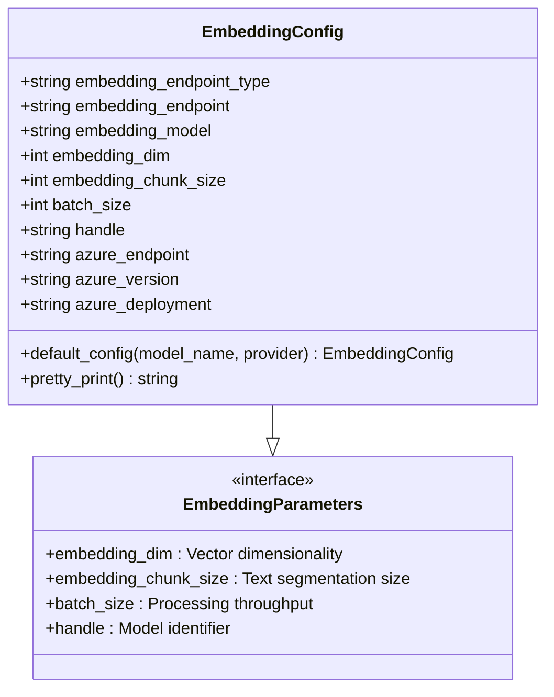
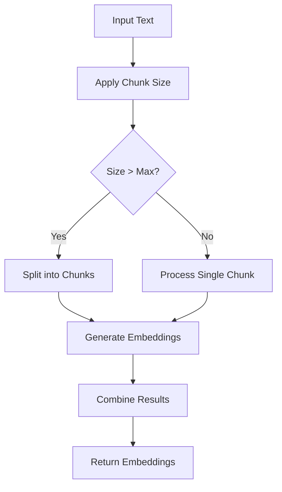
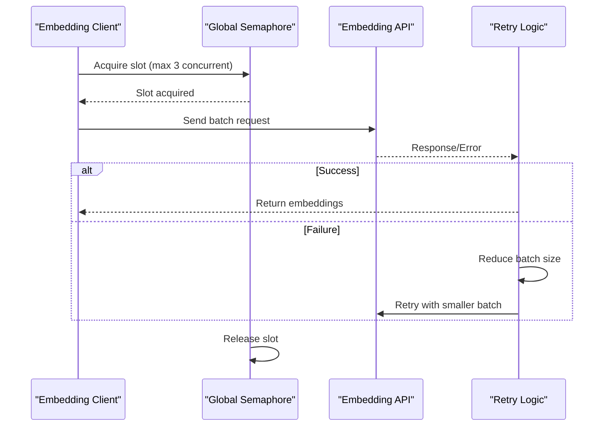
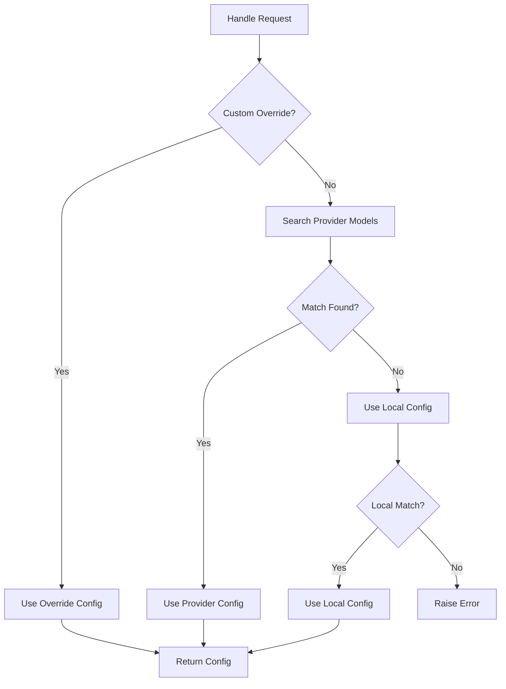
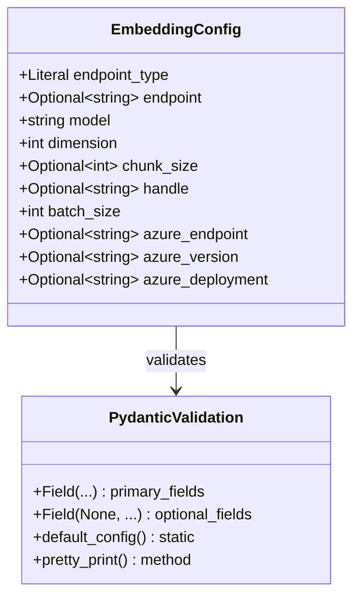
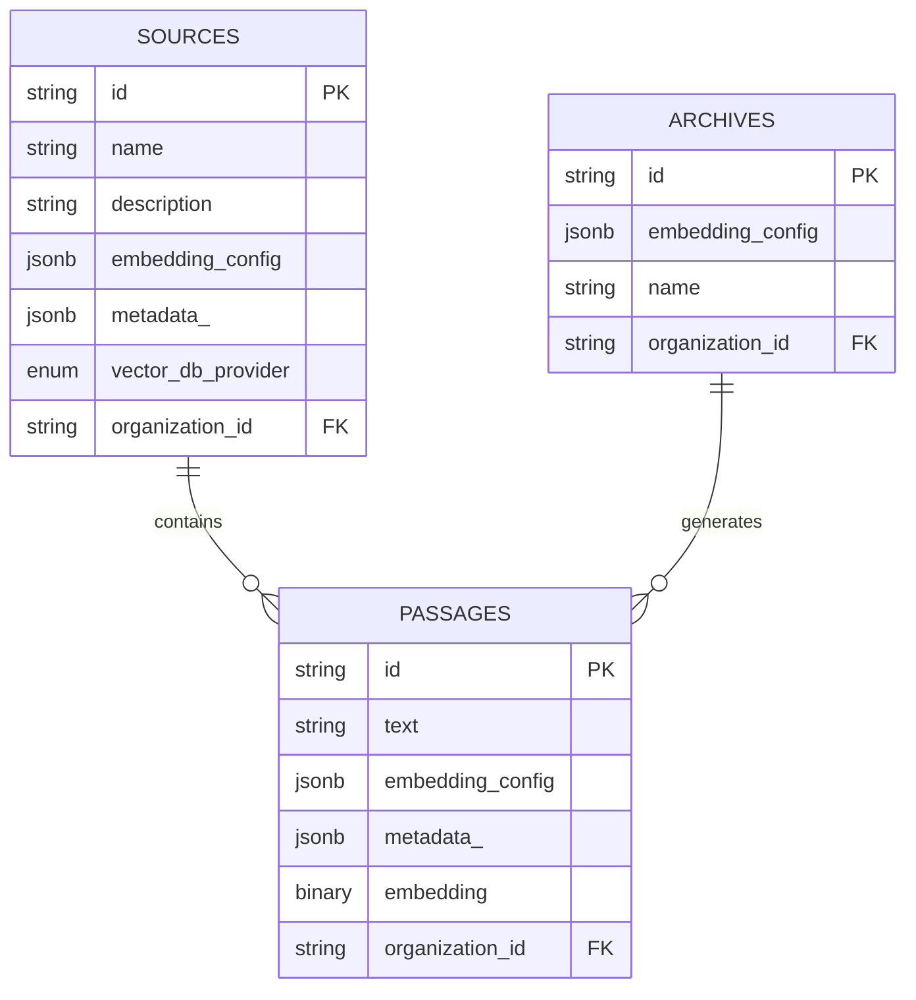
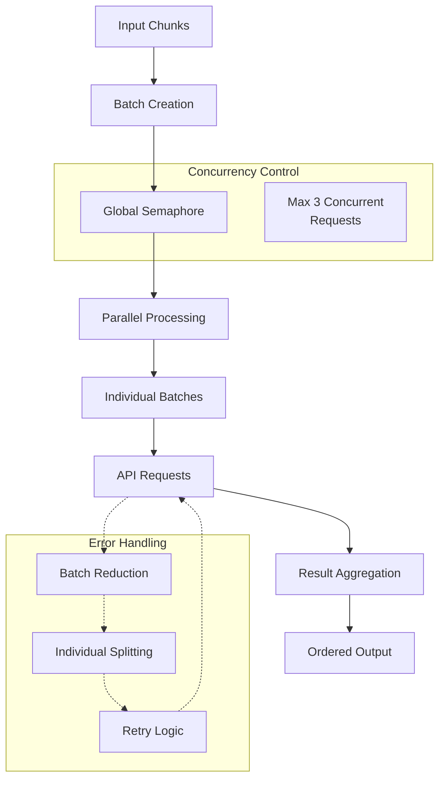

# Core Embedding Parameters

<cite>
**Referenced Files in This Document**
- [embedding_config.py](file://letta/schemas/embedding_config.py)
- [constants.py](file://letta/constants.py)
- [custom_columns.py](file://letta/orm/custom_columns.py)
- [openai_embedder.py](file://letta/services/file_processor/embedder/openai_embedder.py)
- [openai_client.py](file://letta/llm_api/openai_client.py)
- [sqlite_functions.py](file://letta/orm/sqlite_functions.py)
- [source.py](file://letta/orm/source.py)
- [test_embeddings.py](file://tests/test_embeddings.py)
- [converters.py](file://letta/helpers/converters.py)
- [f6cd5a1e519d_add_embedding_config_field_to_archives_.py](file://alembic/versions/f6cd5a1e519d_add_embedding_config_field_to_archives_.py)
</cite>

## Table of Contents
1. [Introduction](#introduction)
2. [Core Parameters Overview](#core-parameters-overview)
3. [Parameter Details and Impact](#parameter-details-and-impact)
4. [Default Values and Configuration](#default-values-and-configuration)
5. [Pydantic Validation and Serialization](#pydantic-validation-and-serialization)
6. [Database Storage and ORM Integration](#database-storage-and-orm-integration)
7. [Performance Optimization Strategies](#performance-optimization-strategies)
8. [Hardware and Use Case Guidelines](#hardware-and-use-case-guidelines)
9. [Practical Implementation Examples](#practical-implementation-examples)
10. [Troubleshooting and Best Practices](#troubleshooting-and-best-practices)

## Introduction

Letta's embedding system is built around the `EmbeddingConfig` class, which serves as the central configuration hub for all embedding operations. This system manages vector dimensionality, text segmentation, processing throughput, and model identification through four core parameters that directly impact performance, memory usage, and retrieval accuracy.

The embedding configuration system is designed with flexibility in mind, supporting multiple providers (OpenAI, Azure, Google, Pinecone, etc.) while maintaining consistent parameter semantics across different implementations. Each parameter plays a crucial role in balancing computational efficiency with semantic fidelity in document processing and retrieval operations.

## Core Parameters Overview

The `EmbeddingConfig` class defines five essential parameters that govern embedding generation and processing:



**Diagram sources**
- [embedding_config.py](file://letta/schemas/embedding_config.py#L8-L88)

Each parameter serves a distinct purpose in the embedding pipeline, from defining the mathematical space for vector representation to controlling the operational efficiency of batch processing.

## Parameter Details and Impact

### embedding_dim (Vector Dimensionality)

The `embedding_dim` parameter specifies the number of dimensions in the embedding vector space, directly impacting both semantic precision and computational requirements.

**Technical Specifications:**
- **Range:** 1-4096 dimensions (MAX_EMBEDDING_DIM)
- **Default:** 1024 dimensions (DEFAULT_EMBEDDING_DIM)
- **Impact on Memory:** Linear scaling - 1M vectors × 1024 dimensions × 4 bytes ≈ 4GB
- **Accuracy Trade-off:** Higher dimensions capture more nuanced relationships but increase computational overhead

**Performance Characteristics:**
- **Semantic Quality:** Higher dimensions generally improve retrieval accuracy for complex semantic relationships
- **Computational Cost:** Quadratic scaling for similarity calculations (cosine distance)
- **Storage Requirements:** Direct linear relationship with vector count and dimensionality

**Provider-Specific Defaults:**
- `text-embedding-ada-002`: 1536 dimensions
- `text-embedding-3-small`: 2000 dimensions
- `letta-free`: 1536 dimensions

### embedding_chunk_size (Text Segmentation for Processing)

The `embedding_chunk_size` parameter controls how text is segmented before embedding generation, affecting both processing efficiency and semantic coherence.

**Technical Specifications:**
- **Default Value:** 300 characters (DEFAULT_EMBEDDING_CHUNK_SIZE)
- **Minimum:** 128 characters (enforced in OpenAI client)
- **Maximum:** Provider-dependent (typically 2048 for OpenAI)
- **Impact on Retrieval:** Smaller chunks improve precision but increase overhead

**Processing Behavior:**


**Diagram sources**
- [openai_client.py](file://letta/llm_api/openai_client.py#L786-L858)

**Optimization Strategies:**
- **Context Preservation:** Balance chunk size to maintain semantic context
- **Memory Management:** Smaller chunks reduce peak memory usage
- **Processing Efficiency:** Larger chunks improve throughput but increase latency

### batch_size (Processing Throughput)

The `batch_size` parameter determines how many text inputs are processed together in a single API request, optimizing network utilization and rate limiting compliance.

**Technical Specifications:**
- **Default:** 32 items per batch
- **Provider Limits:** OpenAI: 2048 items per request
- **Concurrency Control:** Global semaphore limits concurrent requests to 3
- **Dynamic Adjustment:** Automatic reduction on failure

**Processing Pipeline:**


**Diagram sources**
- [openai_embedder.py](file://letta/services/file_processor/embedder/openai_embedder.py#L172-L182)
- [openai_client.py](file://letta/llm_api/openai_client.py#L785-L858)

**Performance Tuning:**
- **Network Efficiency:** Larger batches reduce API call overhead
- **Rate Limiting:** Respect provider limits to avoid throttling
- **Error Recovery:** Automatic batch size reduction on failures

### handle (Identifier for Model Lookup)

The `handle` parameter serves as a unique identifier for embedding models, enabling flexible model selection and configuration management.

**Technical Specifications:**
- **Format:** `provider/model-name` (e.g., "openai/text-embedding-3-small")
- **Purpose:** Model identification and configuration lookup
- **Fallback:** Auto-generated from endpoint_type and model_name
- **Override Capability:** Supports custom handle assignments

**Lookup Mechanism:**


**Diagram sources**
- [server.py](file://letta/server/server.py#L1204-L1228)

**Section sources**
- [embedding_config.py](file://letta/schemas/embedding_config.py#L33-L37)
- [constants.py](file://letta/constants.py#L72-L75)

## Default Values and Configuration

Letta establishes sensible defaults across all embedding parameters, optimized for general-purpose use cases while maintaining flexibility for specialized requirements.

### Default Configuration Matrix

| Parameter | Default Value | Purpose | Impact |
|-----------|---------------|---------|---------|
| `embedding_dim` | 1024 | Vector space size | Balanced accuracy vs. memory |
| `embedding_chunk_size` | 300 | Text segmentation | Optimal context preservation |
| `batch_size` | 32 | Processing throughput | Efficient API utilization |
| `handle` | Auto-generated | Model identification | Flexible model selection |

### Provider-Specific Defaults

The `default_config()` method provides optimized configurations for major providers:

**OpenAI Configuration:**
- `text-embedding-ada-002`: 1536 dimensions, 300 chunk size
- `text-embedding-3-small`: 2000 dimensions, 300 chunk size

**Letta Hosted Configuration:**
- `letta-free`: 1536 dimensions, 300 chunk size, dedicated endpoint

**Azure Configuration:**
- Requires explicit Azure-specific parameters (endpoint, version, deployment)

**Section sources**
- [embedding_config.py](file://letta/schemas/embedding_config.py#L44-L80)

## Pydantic Validation and Serialization

Letta employs Pydantic models for robust validation and automatic serialization of embedding configurations, ensuring data integrity and type safety across the system.

### Validation Schema



**Diagram sources**
- [embedding_config.py](file://letta/schemas/embedding_config.py#L8-L88)

### Serialization Process

The serialization system handles bidirectional conversion between Python objects and database-compatible formats:

**Serialization Workflow:**
1. **Object Creation:** Pydantic model instantiation with validation
2. **Dictionary Conversion:** `model_dump(mode="json")` for JSON serialization
3. **Database Storage:** JSON column storage with custom type decorators
4. **Deserialization:** JSON parsing back to Pydantic model

**Custom Serialization Functions:**
- `serialize_embedding_config()`: Converts to JSON-serializable dict
- `deserialize_embedding_config()`: Recreates model from JSON data

**Section sources**
- [converters.py](file://letta/helpers/converters.py#L79-L88)
- [embedding_config.py](file://letta/schemas/embedding_config.py#L82-L88)

## Database Storage and ORM Integration

Letta integrates embedding configurations seamlessly with its ORM system through custom SQLAlchemy column types, enabling transparent persistence and retrieval of complex configuration objects.

### Database Schema Integration



**Diagram sources**
- [source.py](file://letta/orm/source.py#L29-L39)
- [f6cd5a1e519d_add_embedding_config_field_to_archives_.py](file://alembic/versions/f6cd5a1e519d_add_embedding_config_field_to_archives_.py#L26-L83)

### Custom Column Types

The `EmbeddingConfigColumn` class provides specialized database handling:

**Implementation Details:**
- **Base Type:** SQLAlchemy JSON column
- **Serialization:** Automatic conversion to/from JSON
- **Validation:** Pydantic model reconstruction on retrieval
- **Caching:** Enabled for performance optimization

**Database Migration Support:**
- **Backfill Operations:** Automated population of existing records
- **Null Constraints:** Non-nullable columns with default values
- **Type Safety:** Strong typing enforcement across migrations

**Section sources**
- [custom_columns.py](file://letta/orm/custom_columns.py#L49-L60)
- [source.py](file://letta/orm/source.py#L29-L39)

## Performance Optimization Strategies

Letta implements sophisticated performance optimization techniques to maximize embedding throughput while maintaining reliability and accuracy.

### Concurrent Processing Architecture



**Diagram sources**
- [openai_embedder.py](file://letta/services/file_processor/embedder/openai_embedder.py#L172-L182)
- [openai_client.py](file://letta/llm_api/openai_client.py#L785-L858)

### Dynamic Batch Sizing

The system implements intelligent batch sizing with automatic adjustment:

**Failure Recovery Strategy:**
1. **Initial Attempt:** Full batch size (2048 for OpenAI)
2. **Failure Detection:** API errors or timeout conditions
3. **Batch Reduction:** Halve batch size until minimum reached
4. **Individual Processing:** Split remaining chunks for single-item processing
5. **Persistence Check:** Stop only when minimum chunk size fails

**Performance Metrics:**
- **Throughput Optimization:** Maximize batch size for successful requests
- **Reliability Assurance:** Guarantee completion even with large inputs
- **Resource Management:** Prevent API rate limiting and timeouts

### Memory Management

**Chunk-Level Optimization:**
- **Empty Filtering:** Remove whitespace-only chunks before processing
- **Order Preservation:** Maintain original text ordering through index tracking
- **Result Aggregation:** Efficient merging of parallel results

**Section sources**
- [openai_embedder.py](file://letta/services/file_processor/embedder/openai_embedder.py#L110-L227)
- [openai_client.py](file://letta/llm_api/openai_client.py#L744-L858)

## Hardware and Use Case Guidelines

Selecting optimal embedding parameters requires careful consideration of hardware constraints, use case requirements, and performance trade-offs.

### Hardware Considerations

**Memory Requirements:**
- **Per-Vector Storage:** 4 bytes × embedding dimension × vector count
- **Processing Buffer:** Additional memory for intermediate results
- **Concurrent Operations:** Memory scaling with parallel processing capacity

**CPU and Network:**
- **API Rate Limits:** Provider-imposed request frequency restrictions
- **Processing Overhead:** CPU cycles for serialization/deserialization
- **Network Latency:** Impact on batch processing efficiency

### Use Case Scenarios

**High-Accuracy Applications:**
- **Recommended Settings:** Higher dimensions (2000+), smaller chunks (200-250)
- **Trade-offs:** Increased memory usage, slower processing
- **Best For:** Semantic search, document classification, content recommendation

**High-Throughput Applications:**
- **Recommended Settings:** Lower dimensions (1024), larger chunks (350-400)
- **Trade-offs:** Reduced accuracy, faster processing
- **Best For:** Bulk ingestion, real-time applications, cost optimization

**Memory-Constrained Environments:**
- **Recommended Settings:** Minimal dimensions (512-768), aggressive batching
- **Trade-offs:** Significant accuracy loss, increased processing complexity
- **Best For:** Edge deployments, mobile applications, resource-limited servers

### Performance Benchmarking

**Typical Performance Characteristics:**
- **Small Documents (< 500 chars):** 10-20 ms per embedding
- **Medium Documents (500-2000 chars):** 20-50 ms per embedding  
- **Large Documents (> 2000 chars):** 50-100 ms per embedding

**Scalability Factors:**
- **Linear scaling:** Memory usage scales directly with vector count
- **Batch efficiency:** Processing throughput improves with larger batches
- **Dimension impact:** Accuracy improves logarithmically with dimensions

## Practical Implementation Examples

### Basic Configuration Setup

```python
# Standard OpenAI configuration
embedding_config = EmbeddingConfig(
    embedding_model="text-embedding-3-small",
    embedding_endpoint_type="openai",
    embedding_endpoint="https://api.openai.com/v1",
    embedding_dim=2000,
    embedding_chunk_size=300,
    batch_size=32
)
```

### Custom Provider Configuration

```python
# Azure OpenAI configuration
embedding_config = EmbeddingConfig(
    embedding_model="text-embedding-ada-002",
    embedding_endpoint_type="azure",
    azure_endpoint="https://your-resource.openai.azure.com/",
    azure_version="2023-05-15",
    azure_deployment="your-deployment",
    embedding_dim=1536,
    embedding_chunk_size=300,
    batch_size=32
)
```

### Performance-Optimized Configuration

```python
# High-throughput configuration
embedding_config = EmbeddingConfig(
    embedding_model="text-embedding-3-small",
    embedding_endpoint_type="openai",
    embedding_dim=1024,  # Reduced for speed
    embedding_chunk_size=400,  # Larger chunks
    batch_size=128,  # Larger batches
    embedding_chunk_size=400
)
```

### Memory-Efficient Configuration

```python
# Resource-constrained configuration
embedding_config = EmbeddingConfig(
    embedding_model="text-embedding-ada-002",
    embedding_endpoint_type="openai",
    embedding_dim=512,  # Minimal dimensions
    embedding_chunk_size=200,  # Smaller chunks
    batch_size=16,  # Conservative batching
    embedding_chunk_size=200
)
```

**Section sources**
- [embedding_config.py](file://letta/schemas/embedding_config.py#L44-L80)

## Troubleshooting and Best Practices

### Common Issues and Solutions

**API Rate Limiting:**
- **Symptoms:** 429 HTTP errors, request timeouts
- **Solution:** Reduce batch_size, implement exponential backoff
- **Prevention:** Monitor API usage, use rate limiting middleware

**Memory Exhaustion:**
- **Symptoms:** Out of memory errors, slow processing
- **Solution:** Reduce batch_size, implement chunking strategies
- **Prevention:** Monitor memory usage, optimize chunk sizes

**Accuracy Degradation:**
- **Symptoms:** Poor retrieval results, irrelevant matches
- **Solution:** Increase embedding_dim, optimize chunk_size
- **Prevention:** Test with representative datasets, validate accuracy metrics

### Monitoring and Debugging

**Key Metrics to Track:**
- **Processing Time:** Average time per batch
- **Success Rate:** Percentage of successful API calls
- **Memory Usage:** Peak memory consumption during processing
- **Error Rates:** Frequency of different error types

**Diagnostic Tools:**
- **Logging:** Enable debug logging for detailed operation tracking
- **Metrics:** Monitor embedding generation statistics
- **Profiling:** Use profiling tools to identify bottlenecks

### Configuration Best Practices

**Development Environment:**
- Use smaller batch sizes for faster iteration
- Enable verbose logging for debugging
- Test with representative data samples

**Production Deployment:**
- Monitor performance metrics continuously
- Implement circuit breaker patterns for API failures
- Use configuration management for parameter tuning

**Section sources**
- [test_embeddings.py](file://tests/test_embeddings.py#L52-L207)
- [openai_client.py](file://letta/llm_api/openai_client.py#L744-L858)