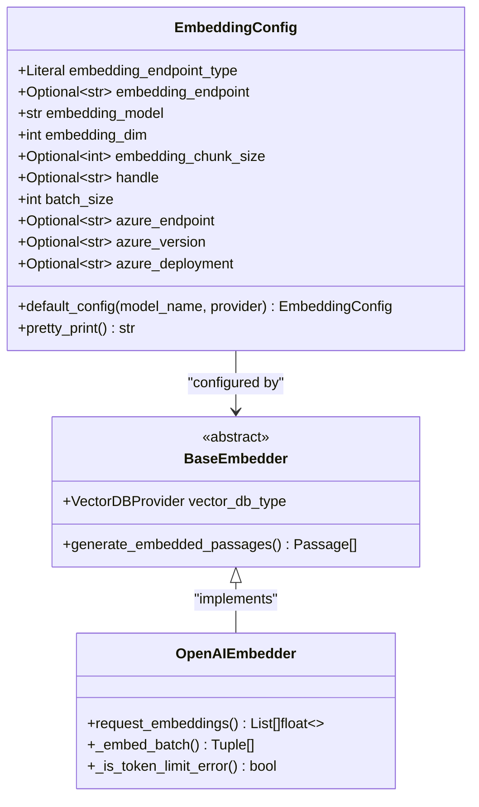
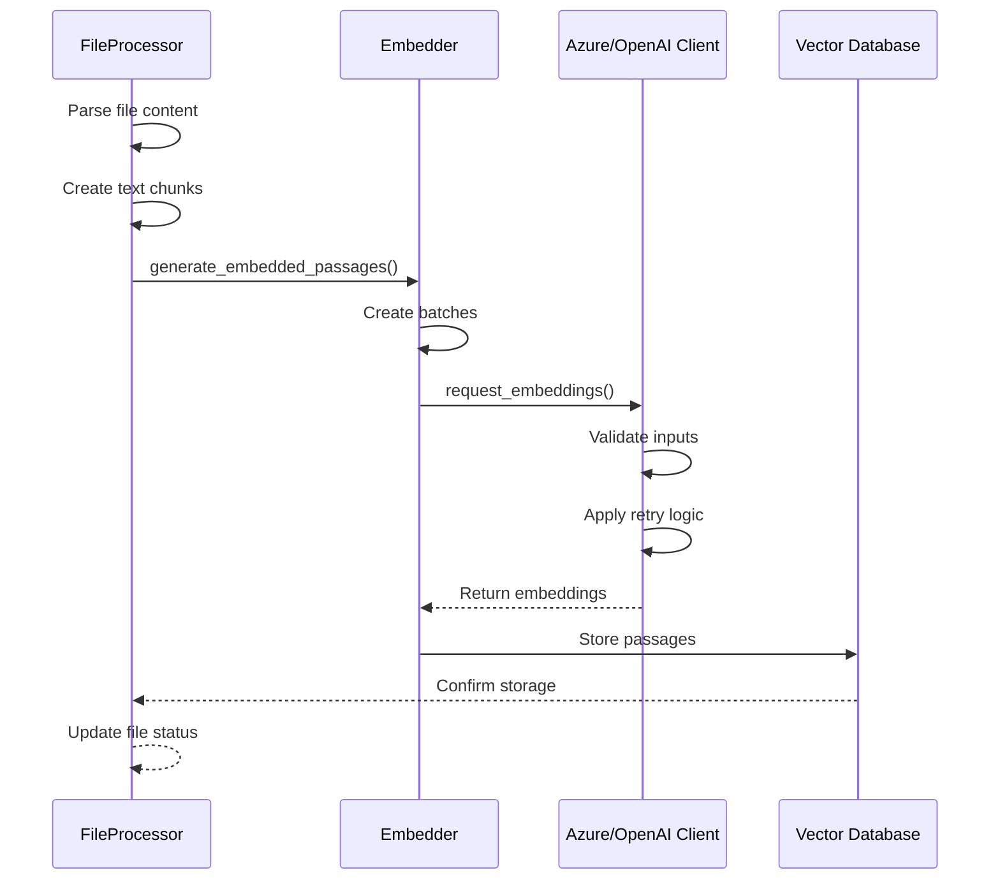
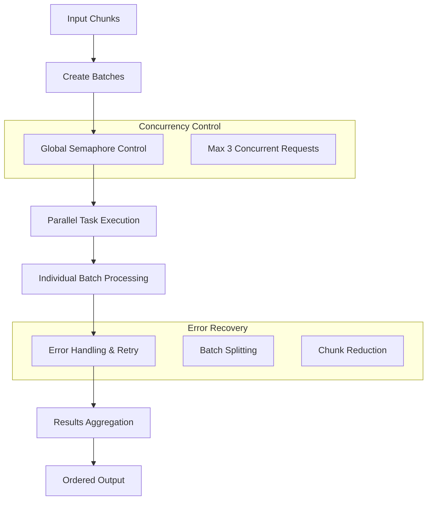
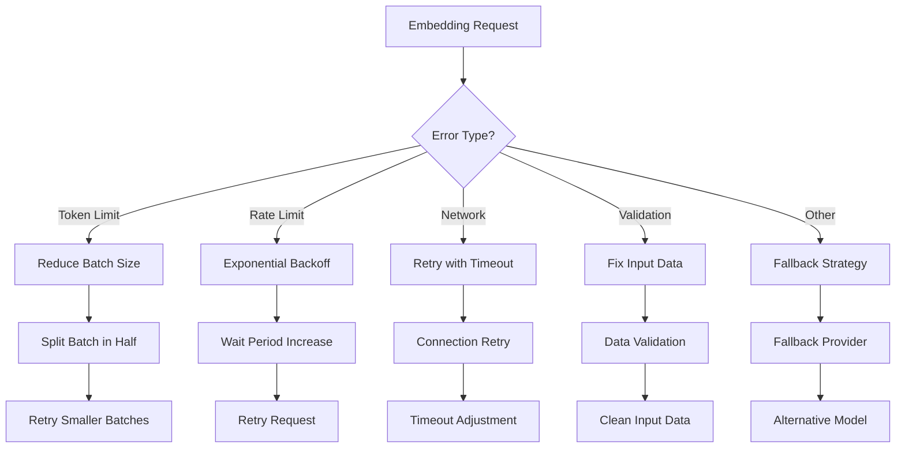
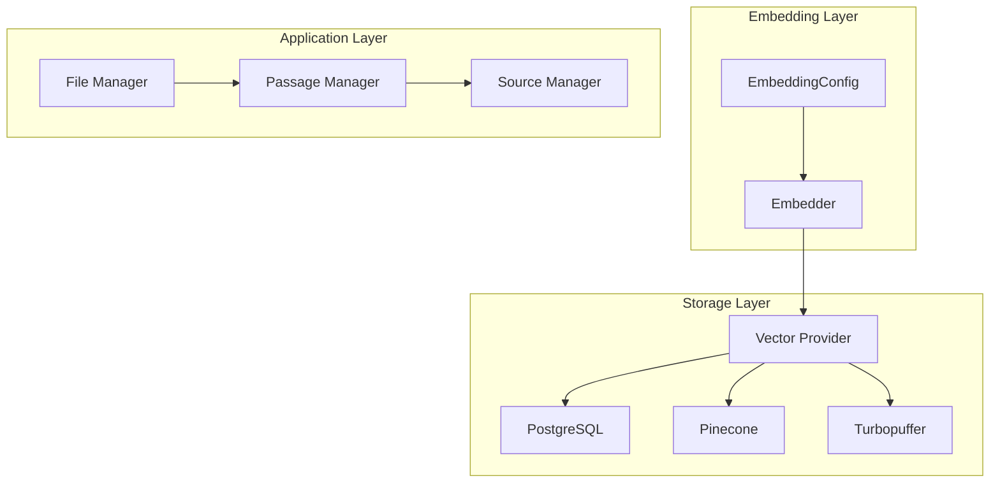

# Embedding Configuration

<cite>
**Referenced Files in This Document**
- [embedding_config.py](file://letta/schemas/embedding_config.py)
- [constants.py](file://letta/constants.py)
- [file_processor.py](file://letta/services/file_processor/file_processor.py)
- [openai_embedder.py](file://letta/services/file_processor/embedder/openai_embedder.py)
- [openai_client.py](file://letta/llm_api/openai_client.py)
- [azure_client.py](file://letta/llm_api/azure_client.py)
- [azure.py](file://letta/schemas/providers/azure.py)
- [providers.py](file://letta/schemas/providers.py)
- [provider_manager.py](file://letta/services/provider_manager.py)
- [openai_embed.json](file://tests/configs/embedding_model_configs/openai_embed.json)
- [azure_embed.json](file://tests/configs/embedding_model_configs/azure_embed.json)
- [base_embedder.py](file://letta/services/file_processor/embedder/base_embedder.py)
- [connectors.py](file://letta/data_sources/connectors.py)
- [server.py](file://letta/server/server.py)
</cite>

## Table of Contents
1. [Introduction](#introduction)
2. [EmbeddingConfig Class Overview](#embeddingconfig-class-overview)
3. [Configuration Parameters](#configuration-parameters)
4. [Supported Providers](#supported-providers)
5. [Default Configurations](#default-configurations)
6. [File Processing Pipeline](#file-processing-pipeline)
7. [Batch Processing and Performance](#batch-processing-and-performance)
8. [Error Handling and Retry Mechanisms](#error-handling-and-retry-mechanisms)
9. [Vector Database Integration](#vector-database-integration)
10. [Best Practices](#best-practices)
11. [Practical Examples](#practical-examples)
12. [Troubleshooting](#troubleshooting)

## Introduction

Letta's embedding configuration system provides a comprehensive framework for managing various embedding models and providers. The system supports multiple AI providers including OpenAI, Azure, Pinecone, and local models, offering flexible configuration options for different use cases and performance requirements.

The embedding configuration system is designed to handle the complexities of modern AI applications that require efficient text-to-vector conversion for semantic search, document processing, and memory management. It provides robust error handling, automatic retry mechanisms, and performance optimizations for production deployments.

## EmbeddingConfig Class Overview

The [`EmbeddingConfig`](file://letta/schemas/embedding_config.py#L8-L88) class serves as the central configuration object for all embedding-related settings in Letta. It inherits from Pydantic's BaseModel to ensure type safety and validation.



**Diagram sources**
- [embedding_config.py](file://letta/schemas/embedding_config.py#L8-L88)
- [base_embedder.py](file://letta/services/file_processor/embedder/base_embedder.py#L12-L22)
- [openai_embedder.py](file://letta/services/file_processor/embedder/openai_embedder.py#L1-L50)

**Section sources**
- [embedding_config.py](file://letta/schemas/embedding_config.py#L8-L88)

## Configuration Parameters

### Core Parameters

| Parameter | Type | Description | Default Value |
|-----------|------|-------------|---------------|
| `embedding_endpoint_type` | Literal | Specifies the provider type (openai, azure, pinecone, etc.) | Required |
| `embedding_model` | str | The specific model identifier | Required |
| `embedding_dim` | int | Dimensionality of the embedding vectors | Required |
| `embedding_chunk_size` | Optional[int] | Size of text chunks for processing | 300 |
| `batch_size` | int | Maximum number of texts processed per API call | 32 |

### Provider-Specific Parameters

| Parameter | Type | Description | Usage Context |
|-----------|------|-------------|---------------|
| `embedding_endpoint` | Optional[str] | Custom endpoint URL | Non-local providers |
| `azure_endpoint` | Optional[str] | Azure OpenAI service endpoint | Azure provider only |
| `azure_version` | Optional[str] | Azure API version | Azure provider only |
| `azure_deployment` | Optional[str] | Azure deployment name | Azure provider only |
| `handle` | Optional[str] | Unique identifier in format provider/model | Internal identification |

### Parameter Details

**embedding_endpoint_type**: Defines the AI provider and API compatibility. Supported values include:
- `"openai"`: OpenAI API endpoints
- `"azure"`: Azure OpenAI service
- `"pinecone"`: Pinecone vector database
- `"anthropic"`, `"bedrock"`, `"google_ai"`, `"google_vertex"`, `"groq"`, `"ollama"`, `"webui"`, `"webui-legacy"`, `"lmstudio"`, `"lmstudio-legacy"`, `"llamacpp"`, `"koboldcpp"`, `"vllm"`, `"hugging-face"`, `"mistral"`, `"together"`

**embedding_chunk_size**: Controls the maximum text length processed in each embedding request. The default value of 300 characters balances performance and accuracy for most use cases.

**batch_size**: Determines how many text chunks are sent in a single API request. Higher values improve throughput but increase memory usage and risk of rate limiting.

**Section sources**
- [embedding_config.py](file://letta/schemas/embedding_config.py#L11-L37)

## Supported Providers

### OpenAI Provider

OpenAI embeddings are the most commonly used embedding models in Letta, offering excellent performance and reliability.

**Configuration Example:**
```json
{
  "embedding_endpoint_type": "openai",
  "embedding_endpoint": "https://api.openai.com/v1",
  "embedding_model": "text-embedding-3-small",
  "embedding_dim": 2000,
  "embedding_chunk_size": 300,
  "batch_size": 32
}
```

**Available Models:**
- `text-embedding-ada-002`: Legacy model with 1536 dimensions
- `text-embedding-3-small`: Current recommended model with 2000 dimensions
- `text-embedding-3-large`: High-dimensional model for specialized use cases

### Azure OpenAI Provider

Azure OpenAI provides enterprise-grade embedding capabilities with regional compliance and security features.

**Configuration Example:**
```json
{
  "embedding_endpoint_type": "azure",
  "embedding_model": "text-embedding-3-small",
  "embedding_dim": 768,
  "embedding_chunk_size": 300,
  "batch_size": 1024
}
```

**Azure-Specific Features:**
- Regional deployment flexibility
- Enterprise security compliance
- Custom endpoint configuration
- Versioned API access

### Pinecone Provider

Pinecone offers managed vector database services with optimized embedding storage and retrieval.

**Configuration Example:**
```json
{
  "embedding_endpoint_type": "pinecone",
  "embedding_model": "llama-text-embed-v2",
  "embedding_dim": 1536,
  "embedding_chunk_size": 300
}
```

**Section sources**
- [azure.py](file://letta/schemas/providers/azure.py#L136-L164)
- [providers.py](file://letta/schemas/providers.py#L1365-L1381)
- [openai_embed.json](file://tests/configs/embedding_model_configs/openai_embed.json#L1-L8)
- [azure_embed.json](file://tests/configs/embedding_model_configs/azure_embed.json#L1-L7)

## Default Configurations

Letta provides pre-configured defaults for popular embedding models to simplify setup and ensure optimal performance.

### OpenAI Default Models

The system automatically configures OpenAI models based on model name and provider parameters:

**text-embedding-ada-002** (Legacy):
- Dimension: 1536
- Endpoint: `https://api.openai.com/v1`
- Recommended for: Legacy applications requiring backward compatibility

**text-embedding-3-small** (Current):
- Dimension: 2000
- Endpoint: `https://api.openai.com/v1`
- Recommended for: General-purpose applications requiring high-quality embeddings

### Specialized Configurations

**Letta Hosted Embeddings**:
- Endpoint: `https://embeddings.letta.com/`
- Model: `letta-free`
- Dimension: 1536
- Purpose: Free hosted embeddings for testing and development

**Pinecone Default**:
- Model: `llama-text-embed-v2`
- Dimension: 1536
- Purpose: Compatible with LlamaIndex ecosystem

**Section sources**
- [embedding_config.py](file://letta/schemas/embedding_config.py#L44-L80)

## File Processing Pipeline

The embedding configuration integrates deeply with Letta's file processing pipeline, enabling automated document ingestion and semantic indexing.



**Diagram sources**
- [file_processor.py](file://letta/services/file_processor/file_processor.py#L27-L48)
- [openai_embedder.py](file://letta/services/file_processor/embedder/openai_embedder.py#L142-L199)

### Processing Workflow

1. **File Parsing**: Documents are parsed into text content using appropriate parsers
2. **Text Chunking**: Content is divided into manageable chunks based on configured chunk size
3. **Batch Creation**: Chunks are organized into batches for efficient API processing
4. **Embedding Generation**: Text chunks are converted to vector embeddings
5. **Vector Storage**: Generated embeddings are stored in the configured vector database
6. **Metadata Association**: Passages are linked with source metadata and file references

### Chunking Strategy

The system employs intelligent chunking strategies that adapt to different file types and content structures:

- **File-Specific Chunkers**: Use specialized chunking algorithms for different document formats
- **Fallback Mechanism**: Automatic fallback to default chunking when specialized chunking fails
- **Size Optimization**: Dynamic adjustment of chunk sizes based on content complexity

**Section sources**
- [file_processor.py](file://letta/services/file_processor/file_processor.py#L27-L402)
- [openai_embedder.py](file://letta/services/file_processor/embedder/openai_embedder.py#L142-L199)

## Batch Processing and Performance

Letta implements sophisticated batch processing mechanisms to optimize embedding generation performance while maintaining reliability.

### Concurrent Processing Architecture



**Diagram sources**
- [openai_embedder.py](file://letta/services/file_processor/embedder/openai_embedder.py#L172-L199)

### Performance Optimizations

**Batch Size Tuning**:
- Default batch size: 32 (balanced performance)
- Provider-specific optimizations: Azure uses 1024, OpenAI uses 2048
- Adaptive sizing: Automatic reduction when encountering errors

**Concurrent Request Management**:
- Global semaphore limits concurrent requests across all file processing
- Prevents rate limiting while maintaining throughput
- Configurable maximum concurrent connections (default: 3)

**Memory Efficiency**:
- Streaming processing for large files
- Efficient batch creation and cleanup
- Garbage collection optimization

### Performance Metrics

Key performance indicators tracked during embedding generation:

- **Batch Processing Time**: Time taken to process each batch of embeddings
- **API Call Latency**: Response time from embedding provider APIs
- **Throughput Metrics**: Embeddings generated per second
- **Error Rates**: Failure rates and retry success rates

**Section sources**
- [openai_embedder.py](file://letta/services/file_processor/embedder/openai_embedder.py#L142-L199)
- [constants.py](file://letta/constants.py#L64-L75)

## Error Handling and Retry Mechanisms

Letta implements comprehensive error handling and retry mechanisms to ensure reliable embedding generation even under adverse conditions.

### Error Classification and Handling



**Diagram sources**
- [openai_client.py](file://letta/llm_api/openai_client.py#L744-L858)
- [openai_embedder.py](file://letta/services/file_processor/embedder/openai_embedder.py#L60-L199)

### Retry Strategies

**Adaptive Batch Size Reduction**:
1. Start with maximum batch size (2048 for OpenAI)
2. Halve batch size on failure until reaching minimum (1)
3. Split individual chunks when batch size reaches 1

**Input Validation and Cleaning**:
- Remove empty or whitespace-only strings
- Convert non-string inputs to strings
- Replace invalid characters with placeholders
- Log validation warnings for debugging

**Provider-Specific Error Handling**:
- Azure: Handle deployment-specific errors
- OpenAI: Manage rate limits and token constraints
- Local models: Address memory and processing limitations

### Error Recovery Patterns

**Fallback Mechanisms**:
1. Primary provider failure → Try alternative providers
2. Specific model unavailable → Fall back to compatible model
3. Network connectivity issues → Retry with exponential backoff

**Graceful Degradation**:
- Continue processing with reduced functionality
- Log detailed error information for debugging
- Maintain partial results when possible

**Section sources**
- [openai_client.py](file://letta/llm_api/openai_client.py#L744-L858)
- [openai_embedder.py](file://letta/services/file_processor/embedder/openai_embedder.py#L60-L199)

## Vector Database Integration

Letta's embedding configuration seamlessly integrates with multiple vector database providers, enabling flexible storage and retrieval architectures.

### Supported Vector Database Providers

| Provider | Use Case | Configuration | Performance |
|----------|----------|---------------|-------------|
| **Native** | Development, Testing | Built-in PostgreSQL vector support | Good for small datasets |
| **Pinecone** | Production, Scalability | Managed vector database service | Excellent scalability |
| **Turbopuffer** | High-performance | Specialized vector storage | Optimized for speed |

### Integration Architecture



**Diagram sources**
- [connectors.py](file://letta/data_sources/connectors.py#L74-L102)
- [provider_manager.py](file://letta/services/provider_manager.py#L869-L888)

### Storage Optimization

**Dimension Padding**:
- PostgreSQL requires fixed embedding dimensions
- Automatic padding to MAX_EMBEDDING_DIM (4096)
- Maintains compatibility across different models

**Duplicate Detection**:
- Hash-based duplicate detection for embeddings
- Prevents redundant storage of identical content
- Optimizes storage efficiency

**Metadata Preservation**:
- Rich metadata association with passages
- Source tracking and provenance
- Tag-based organization and filtering

**Section sources**
- [connectors.py](file://letta/data_sources/connectors.py#L74-L102)
- [provider_manager.py](file://letta/services/provider_manager.py#L869-L888)

## Best Practices

### Configuration Optimization

**Model Selection Guidelines**:
- Use `text-embedding-3-small` for general-purpose applications
- Choose `text-embedding-3-large` for specialized domains requiring higher precision
- Consider `text-embedding-ada-002` only for legacy compatibility

**Performance Tuning**:
- Adjust batch size based on available memory and network conditions
- Monitor API rate limits and adjust concurrency accordingly
- Use provider-specific optimizations (e.g., Azure's 1024 batch size)

**Resource Management**:
- Configure appropriate chunk sizes for content type
- Implement proper error handling and retry logic
- Monitor embedding generation metrics and adjust parameters

### Security Considerations

**API Key Management**:
- Use environment variables for sensitive credentials
- Implement proper key rotation policies
- Restrict API access to necessary endpoints only

**Data Privacy**:
- Understand provider data retention policies
- Implement appropriate data classification
- Consider local embedding models for sensitive content

### Monitoring and Maintenance

**Performance Monitoring**:
- Track embedding generation latency
- Monitor error rates and retry success
- Measure throughput and resource utilization

**Capacity Planning**:
- Estimate embedding storage requirements
- Plan for growth in document volume
- Optimize batch sizes for peak loads

## Practical Examples

### Basic OpenAI Configuration

```python
# Standard OpenAI embedding configuration
embedding_config = EmbeddingConfig(
    embedding_endpoint_type="openai",
    embedding_model="text-embedding-3-small",
    embedding_dim=2000,
    embedding_chunk_size=300,
    batch_size=32
)
```

### Azure OpenAI Configuration

```python
# Azure OpenAI with custom deployment
embedding_config = EmbeddingConfig(
    embedding_endpoint_type="azure",
    embedding_model="text-embedding-3-small",
    embedding_dim=768,
    embedding_chunk_size=300,
    batch_size=1024,
    azure_endpoint="https://your-resource.openai.azure.com/",
    azure_version="2023-05-15",
    azure_deployment="your-deployment-name"
)
```

### Pinecone Configuration

```python
# Pinecone vector database configuration
embedding_config = EmbeddingConfig(
    embedding_endpoint_type="pinecone",
    embedding_model="llama-text-embed-v2",
    embedding_dim=1536,
    embedding_chunk_size=300
)
```

### Advanced Configuration with Custom Settings

```python
# High-throughput configuration for large-scale processing
embedding_config = EmbeddingConfig(
    embedding_endpoint_type="openai",
    embedding_model="text-embedding-3-large",
    embedding_dim=3072,
    embedding_chunk_size=500,  # Larger chunks for efficiency
    batch_size=2048,           # Maximum batch size
    embedding_endpoint="https://api.openai.com/v1"
)
```

### Dynamic Configuration Loading

```python
# Load configuration from JSON file
import json
from letta.schemas.embedding_config import EmbeddingConfig

with open('embedding_config.json', 'r') as f:
    config_data = json.load(f)
    embedding_config = EmbeddingConfig(**config_data)
```

**Section sources**
- [openai_embed.json](file://tests/configs/embedding_model_configs/openai_embed.json#L1-L8)
- [azure_embed.json](file://tests/configs/embedding_model_configs/azure_embed.json#L1-L7)

## Troubleshooting

### Common Issues and Solutions

**API Authentication Errors**:
- Verify API keys are correctly configured
- Check endpoint URLs and authentication headers
- Ensure proper permissions for embedding models

**Rate Limiting Issues**:
- Reduce batch sizes to stay within provider limits
- Implement exponential backoff for retries
- Consider using multiple API keys for load distribution

**Memory and Performance Problems**:
- Decrease batch sizes for memory-constrained environments
- Optimize chunk sizes based on content characteristics
- Monitor system resources during embedding generation

**Model Compatibility Issues**:
- Verify model availability in selected region
- Check embedding dimensions match expectations
- Test with smaller batches before production deployment

### Debugging Techniques

**Logging Configuration**:
- Enable debug logging for detailed API interactions
- Monitor embedding generation metrics
- Track error patterns and retry success rates

**Testing Strategies**:
- Test with small datasets before scaling
- Validate embedding quality with sample queries
- Compare results across different providers

**Performance Profiling**:
- Measure embedding generation latency
- Analyze batch processing efficiency
- Identify bottlenecks in the pipeline

### Error Codes and Resolution

| Error Code | Description | Solution |
|------------|-------------|----------|
| `invalid_argument` | Malformed embedding configuration | Validate configuration parameters |
| `rate_limit_exceeded` | API rate limit reached | Reduce batch sizes and implement backoff |
| `model_not_found` | Specified model unavailable | Check model availability and permissions |
| `token_limit_exceeded` | Request exceeds token limits | Reduce batch sizes or split content |
| `network_timeout` | Network connectivity issues | Implement retry logic with timeouts |

**Section sources**
- [server.py](file://letta/server/server.py#L1204-L1228)
- [openai_client.py](file://letta/llm_api/openai_client.py#L744-L858)