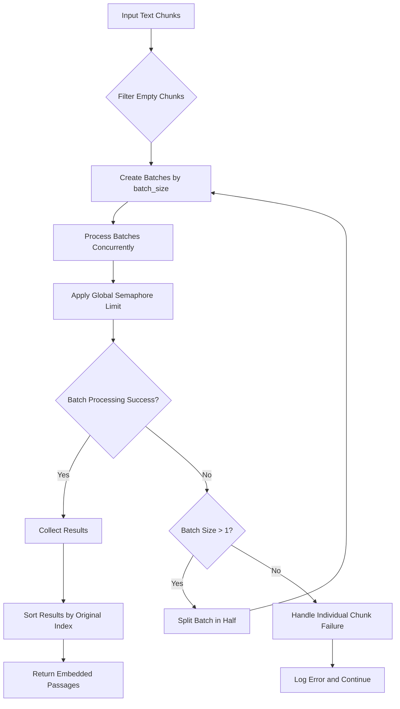
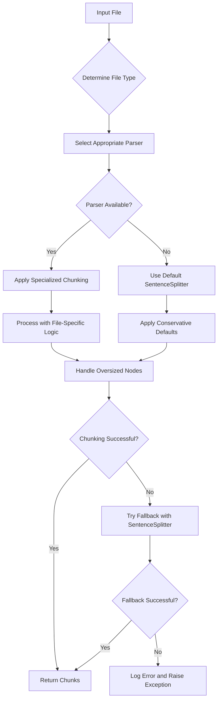
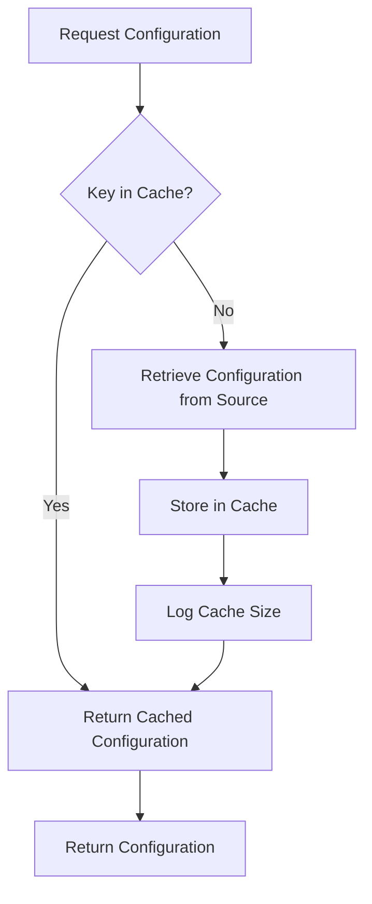
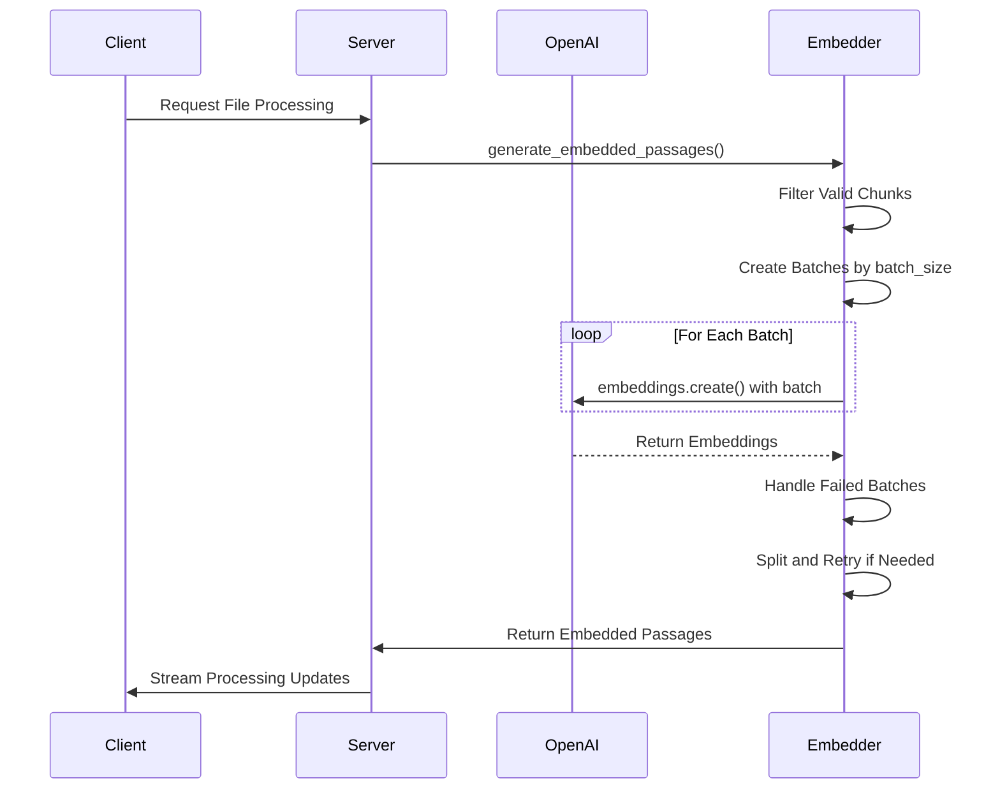

# Performance Optimization

<cite>
**Referenced Files in This Document**   
- [letta/services/file_processor/file_processor.py](file://letta/services/file_processor/file_processor.py)
- [letta/services/file_processor/embedder/openai_embedder.py](file://letta/services/file_processor/embedder/openai_embedder.py)
- [letta/services/file_processor/chunker/llama_index_chunker.py](file://letta/services/file_processor/chunker/llama_index_chunker.py)
- [letta/server/server.py](file://letta/server/server.py)
- [letta/llm_api/openai_client.py](file://letta/llm_api/openai_client.py)
- [letta/schemas/embedding_config.py](file://letta/schemas/embedding_config.py)
- [letta/constants.py](file://letta/constants.py)
</cite>

## Table of Contents
1. [Introduction](#introduction)
2. [Batching Strategy and Throughput Optimization](#batching-strategy-and-throughput-optimization)
3. [Embedding Chunking and Context Preservation](#embedding-chunking-and-context-preservation)
4. [Caching Mechanisms for Configuration Lookups](#caching-mechanisms-for-configuration-lookups)
5. [Deployment Scenario Optimization](#deployment-scenario-optimization)
6. [HTTP Client Reuse and Connection Pooling](#http-client-reuse-and-connection-pooling)
7. [OpenAI Embedder Implementation and Default Configuration](#openai-embedder-implementation-and-default-configuration)
8. [Conclusion](#conclusion)

## Introduction
This document provides a comprehensive analysis of performance optimization strategies in Letta, focusing on embedding processing efficiency. The system employs sophisticated techniques to balance throughput, latency, context preservation, and resource utilization across various deployment scenarios. Key optimization areas include batching strategies for embedding generation, intelligent chunking of file content, caching mechanisms to prevent redundant configuration lookups, and efficient HTTP client management. The analysis covers how these components work together to deliver high-performance embedding services while maintaining flexibility for different deployment models, from local models to cloud APIs.

## Batching Strategy and Throughput Optimization

Letta implements a sophisticated batching strategy to optimize throughput and latency in embedding generation. The system uses configurable batch sizes to balance the trade-off between API efficiency and memory utilization. The `batch_size` parameter in the `EmbeddingConfig` class determines how many text chunks are processed in a single API request, directly impacting both throughput and latency.

The file processing pipeline manages batching through the `OpenAIEmbedder` class, which divides input chunks into batches based on the configured `batch_size`. This approach maximizes throughput by reducing the number of API round-trips while maintaining reasonable latency by avoiding excessively large batches that could increase processing time. The system implements a global semaphore `_GLOBAL_EMBEDDING_SEMAPHORE` with a limit of 3 concurrent operations, preventing rate limiting even when processing multiple files simultaneously.

When embedding requests fail due to token limits, the system automatically implements a retry mechanism that splits the batch in half and retries with smaller batches. This adaptive approach ensures successful processing even for challenging inputs while maintaining system stability.

**Diagram sources**
- [letta/services/file_processor/embedder/openai_embedder.py](file://letta/services/file_processor/embedder/openai_embedder.py#L110-L227)

**Section sources**
- [letta/services/file_processor/embedder/openai_embedder.py](file://letta/services/file_processor/embedder/openai_embedder.py#L110-L227)
- [letta/constants.py](file://letta/constants.py#L65)

## Embedding Chunking and Context Preservation

The system balances context preservation with processing efficiency through its file processor's chunking strategy, implemented in the `LlamaIndexChunker` class. The `embedding_chunk_size` parameter plays a crucial role in this balance, determining the maximum number of tokens in each text chunk before embedding generation.

The chunking strategy adapts to different file types through the `file_type_registry`, which maps MIME types to appropriate chunking strategies such as `ChunkingStrategy.CODE`, `ChunkingStrategy.DOCUMENTATION`, and `ChunkingStrategy.STRUCTURED_DATA`. For code files, the system uses a `CodeSplitter` that respects programming language syntax, while documentation files may use specialized parsers like `MarkdownNodeParser` or `HTMLNodeParser`.

When specialized chunking fails, the system implements a fallback mechanism using a conservative `SentenceSplitter` with default chunk size of 384 and overlap of 25. This ensures reliable processing even for unexpected file types or malformed content. The chunking process runs in a thread pool via `asyncio.to_thread`, preventing CPU-intensive operations from blocking the event loop.

**Diagram sources**
- [letta/services/file_processor/chunker/llama_index_chunker.py](file://letta/services/file_processor/chunker/llama_index_chunker.py#L12-L170)
- [letta/services/file_processor/file_processor.py](file://letta/services/file_processor/file_processor.py#L49-L152)

**Section sources**
- [letta/services/file_processor/chunker/llama_index_chunker.py](file://letta/services/file_processor/chunker/llama_index_chunker.py#L12-L170)
- [letta/constants.py](file://letta/constants.py#L73)

## Caching Mechanisms for Configuration Lookups

Letta implements efficient caching mechanisms to prevent redundant configuration lookups, significantly improving performance for repeated operations. The `Server` class maintains two dedicated caches: `_llm_config_cache` and `_embedding_config_cache`, which store frequently accessed configuration objects.

These caches are accessed through dedicated methods like `get_cached_embedding_config_async`, which first checks if the requested configuration exists in the cache before querying the database or external providers. This approach eliminates redundant database queries and provider API calls, reducing latency and conserving resources. When a cache miss occurs, the system retrieves the configuration and stores it in the cache for future use, logging the cache size for monitoring purposes.

The caching system uses a key-based lookup mechanism with `make_key(**kwargs)` to generate unique identifiers for different configuration combinations. This ensures that variations in parameters like model handles or chunk sizes result in appropriate cache entries. The cache is particularly beneficial during agent creation and updates, where multiple configuration lookups would otherwise occur.

**Diagram sources**
- [letta/server/server.py](file://letta/server/server.py#L388-L419)

**Section sources**
- [letta/server/server.py](file://letta/server/server.py#L388-L419)

## Deployment Scenario Optimization

Letta optimizes performance across different deployment scenarios by adapting its behavior based on available resources and configuration. The system supports both local models and cloud APIs, with configuration defaults that prioritize available API keys. When an OpenAI API key is present, the system defaults to using `text-embedding-3-small`; otherwise, it falls back to the Letta-hosted embedding service.

For local model deployments, the system integrates with various local LLM backends including Ollama, vLLM, and Llama.cpp, each with specific optimization strategies. The `local_llm/chat_completion_proxy.py` module routes requests to the appropriate local endpoint based on the configured `endpoint_type`, ensuring efficient processing without unnecessary network overhead.

The system also optimizes for different vector database providers through the `vector_db_type` property in embedders. Native PostgreSQL storage is used by default, while Pinecone integration handles asynchronous embedding completion differently, updating file status only after chunks are confirmed embedded. This provider-specific optimization ensures appropriate behavior for each deployment model.

**Section sources**
- [letta/schemas/embedding_config.py](file://letta/schemas/embedding_config.py#L44-L72)
- [letta/services/file_processor/embedder/base_embedder.py](file://letta/services/file_processor/embedder/base_embedder.py#L17)
- [letta/local_llm/chat_completion_proxy.py](file://letta/local_llm/chat_completion_proxy.py#L170-L181)

## HTTP Client Reuse and Connection Pooling

The system implements efficient HTTP client reuse and connection pooling through the `httpx.AsyncClient` pattern, which improves performance by reusing connections and reducing connection overhead. Multiple components use this pattern, including the OpenAI client, Google AI client, and Azure provider, ensuring consistent performance optimization across different services.

The `openai_client.py` module creates a single `AsyncOpenAI` client instance with shared connection pooling, reusing the same underlying `httpx.AsyncClient` for multiple requests. This approach minimizes the overhead of establishing new connections and leverages HTTP/1.1 keep-alive or HTTP/2 multiplexing for improved throughput.

For services requiring longer timeouts, such as the Azure provider, the system configures appropriate timeout values (15 seconds with 10-second connect timeout) to handle potentially slow responses without blocking other operations. The Redis client implementation also uses connection pooling with configurable maximum connections, health checks, and retry behavior to maintain reliable connectivity.

**Section sources**
- [letta/llm_api/openai_client.py](file://letta/llm_api/openai_client.py#L780-L782)
- [letta/llm_api/google_ai_client.py](file://letta/llm_api/google_ai_client.py#L165-L167)
- [letta/schemas/providers/azure.py](file://letta/schemas/providers/azure.py#L82-L83)
- [letta/data_sources/redis_client.py](file://letta/data_sources/redis_client.py#L53-L64)

## OpenAI Embedder Implementation and Default Configuration

The OpenAI embedder implementation demonstrates how default configurations are selected based on available API keys and how streaming services handle embedding requests efficiently. The `OpenAIEmbedder` class initializes with a default configuration that checks for the presence of an OpenAI API key, selecting `text-embedding-3-small` when available or falling back to the Letta-hosted service otherwise.

The embedder processes requests through a sophisticated pipeline that includes batch creation, concurrent processing with rate limiting, and automatic retry logic for failed batches. The system uses `asyncio.gather` with `return_exceptions=True` to handle multiple embedding requests concurrently while capturing any exceptions for individual batches. This allows partial success when some batches fail, improving overall reliability.

For streaming services, the system implements efficient response handling through the `StreamingResponse` class, which can continue processing even if the client disconnects. The `asyncio.shield` decorator protects critical operations from cancellation, ensuring that embedding generation completes even if the client terminates the connection prematurely.

**Diagram sources**
- [letta/services/file_processor/embedder/openai_embedder.py](file://letta/services/file_processor/embedder/openai_embedder.py#L23-L227)
- [letta/llm_api/openai_client.py](file://letta/llm_api/openai_client.py#L773-L858)
- [letta/server/rest_api/streaming_response.py](file://letta/server/rest_api/streaming_response.py#L188-L275)

**Section sources**
- [letta/services/file_processor/embedder/openai_embedder.py](file://letta/services/file_processor/embedder/openai_embedder.py#L23-L227)
- [letta/schemas/embedding_config.py](file://letta/schemas/embedding_config.py#L44-L72)

## Conclusion
Letta's performance optimization strategy for embedding processing demonstrates a comprehensive approach to balancing efficiency, reliability, and flexibility. The system effectively manages the trade-offs between throughput and latency through intelligent batching, adapts to different content types with specialized chunking strategies, and prevents redundant operations through comprehensive caching. By optimizing for various deployment scenarios and implementing efficient HTTP client reuse, the system delivers high-performance embedding services across diverse environments. These optimizations work together to create a robust and scalable platform that can handle demanding workloads while maintaining responsiveness and reliability.