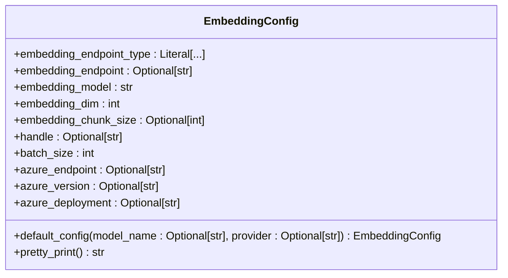
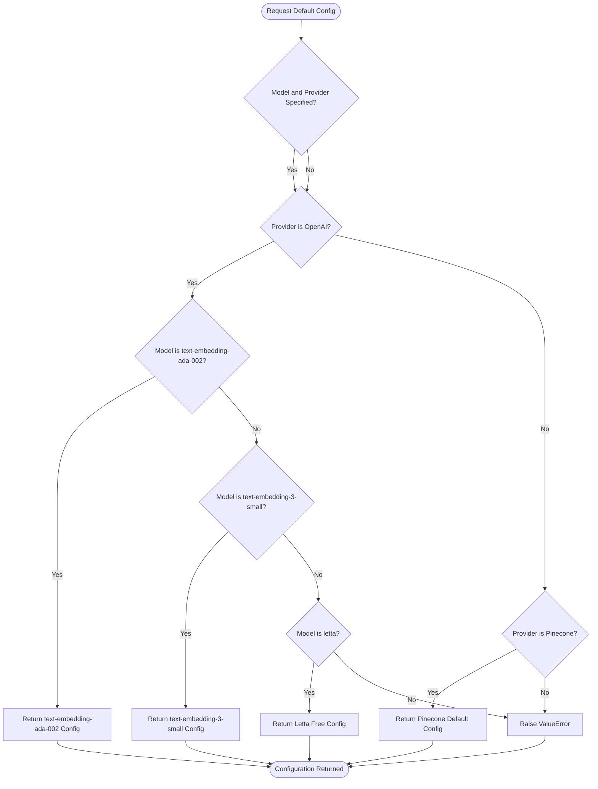
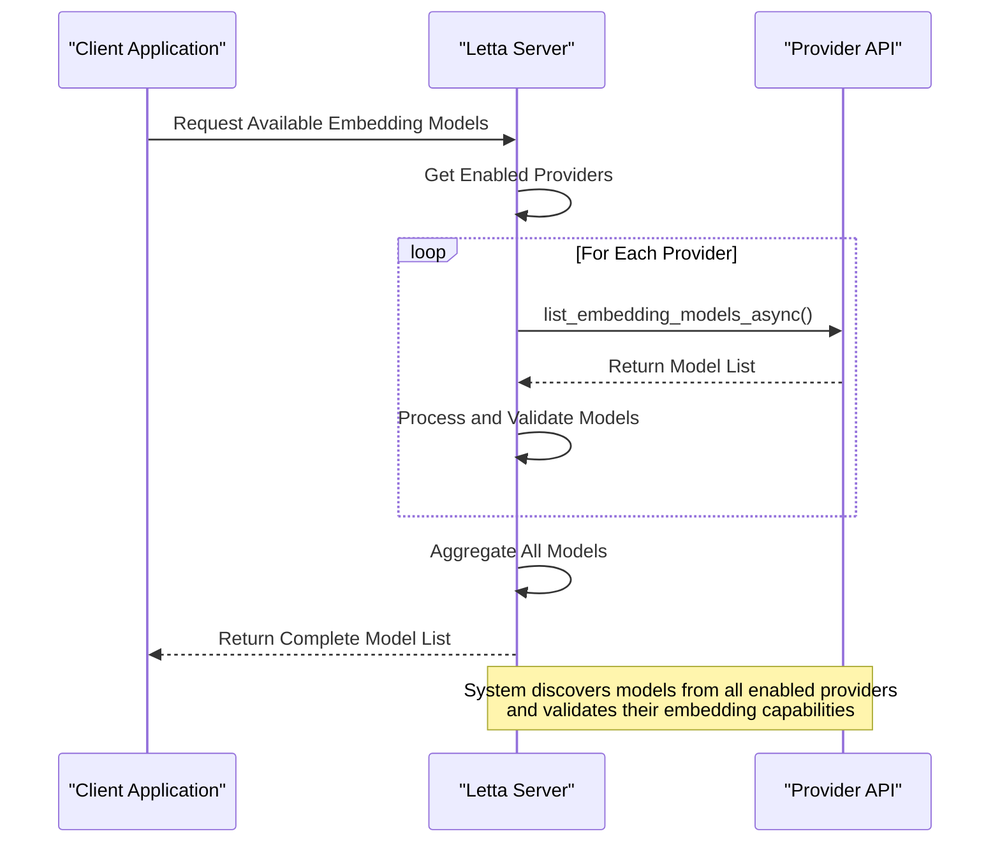

# Provider-Specific Configuration

<cite>
**Referenced Files in This Document**   
- [embedding_config.py](file://letta/schemas/embedding_config.py)
- [azure.py](file://letta/schemas/providers/azure.py)
- [openai.py](file://letta/schemas/providers/openai.py)
- [ollama.py](file://letta/schemas/providers/ollama.py)
- [server.py](file://letta/server/server.py)
- [provider_manager.py](file://letta/services/provider_manager.py)
- [settings.py](file://letta/settings.py)
- [azure_embed.json](file://tests/configs/embedding_model_configs/azure_embed.json)
- [openai_embed.json](file://tests/configs/embedding_model_configs/openai_embed.json)
- [ollama.json](file://tests/configs/embedding_model_configs/ollama.json)
- [local.json](file://tests/configs/embedding_model_configs/local.json)
</cite>

## Table of Contents
1. [Introduction](#introduction)
2. [Embedding Configuration Model](#embedding-configuration-model)
3. [Provider-Specific Parameters](#provider-specific-parameters)
4. [Default Configuration System](#default-configuration-system)
5. [Model Discovery and Validation](#model-discovery-and-validation)
6. [Configuration Examples](#configuration-examples)
7. [Environment Variable Integration](#environment-variable-integration)
8. [Conclusion](#conclusion)

## Introduction

Letta provides a flexible and extensible system for configuring embedding models across multiple providers, enabling seamless integration with various AI services and local models. The system is designed to support provider-specific configurations while maintaining a consistent interface for embedding operations. This document details how Letta handles embedding model configuration across different providers, focusing on the `embedding_endpoint_type` field that supports OpenAI, Azure, Pinecone, Ollama, and local models. The configuration system allows for provider-specific parameters, establishes defaults for popular models, discovers available models through provider APIs, and handles fallback to local configurations when necessary.

**Section sources**
- [embedding_config.py](file://letta/schemas/embedding_config.py#L8-L87)

## Embedding Configuration Model

The core of Letta's embedding configuration system is the `EmbeddingConfig` class, which defines the structure for configuring embedding model connections and processing parameters. This class uses Pydantic for type validation and includes fields for endpoint type, model specification, dimensions, chunk size, and provider-specific parameters.

The `embedding_endpoint_type` field is a Literal type that supports multiple providers including "openai", "azure", "pinecone", "ollama", "local", and others. This field determines how the system connects to and interacts with the embedding service. The configuration model also includes standard fields like `embedding_endpoint` (the URL for the model, or None for local models), `embedding_model` (the specific model name), `embedding_dim` (the dimension of the embedding vectors), and `embedding_chunk_size` (the size of text chunks processed at once).

**Diagram sources**
- [embedding_config.py](file://letta/schemas/embedding_config.py#L8-L87)

**Section sources**
- [embedding_config.py](file://letta/schemas/embedding_config.py#L8-L87)

## Provider-Specific Parameters

Letta's embedding configuration system includes specialized parameters for different providers, allowing for fine-grained control over how the system interacts with each service. For Azure configuration, the system supports three key parameters: `azure_endpoint`, `azure_version`, and `azure_deployment`. These parameters are specifically designed to handle Azure's deployment-based model access pattern, where models are deployed as endpoints within an Azure resource.

The `azure_endpoint` specifies the base URL for the Azure OpenAI service, typically in the format `https://[your-resource].openai.azure.com`. The `azure_version` parameter defines the API version to use, which is important for accessing specific features and maintaining compatibility. The `azure_deployment` parameter identifies the specific model deployment within the Azure resource, as Azure allows multiple deployments of the same model with different configurations.

For other providers, the system uses different configuration patterns. Ollama configurations include the `ollama_base_url` to specify the local or remote Ollama server endpoint. Pinecone configurations use the `embedding_endpoint` set to None, indicating that embeddings are stored directly in Pinecone's vector database. Local models are identified by setting `embedding_endpoint` to null and specifying the local model name.

**Section sources**
- [embedding_config.py](file://letta/schemas/embedding_config.py#L39-L42)
- [azure.py](file://letta/schemas/providers/azure.py#L36-L40)
- [settings.py](file://letta/settings.py#L163-L169)

## Default Configuration System

Letta implements a comprehensive default configuration system through the `default_config` class method of the `EmbeddingConfig` class. This method establishes provider-specific defaults for popular embedding models, ensuring that common configurations are readily available without requiring explicit setup.

For OpenAI models, the system provides defaults for both "text-embedding-ada-002" and "text-embedding-3-small" models. When requesting a configuration for "text-embedding-ada-002" with the OpenAI provider, the system returns a configuration with 1536 dimensions and the standard OpenAI endpoint. For "text-embedding-3-small", it returns a configuration with 2000 dimensions, reflecting the higher-dimensional nature of this newer model.

The default configuration system also supports the "letta" provider, which uses a dedicated endpoint at "https://embeddings.letta.com/" with the "letta-free" model. For Pinecone, the system provides a default configuration with the "llama-text-embed-v2" model and 1536 dimensions, assuming compatibility with standard OpenAI dimensions. These defaults are designed to work out-of-the-box with minimal configuration, while still allowing for customization when needed.

**Diagram sources**
- [embedding_config.py](file://letta/schemas/embedding_config.py#L44-L80)

**Section sources**
- [embedding_config.py](file://letta/schemas/embedding_config.py#L44-L80)

## Model Discovery and Validation

Letta's system discovers and validates available embedding models through the `list_embedding_models_async()` method implemented by each provider. This asynchronous method queries the provider's API to retrieve a list of available embedding models and their configurations, ensuring that the system always has up-to-date information about available models.

For Azure, the `list_embedding_models_async()` method queries the Azure OpenAI deployment list and filters for models with embedding capabilities. It validates models by checking both the "embeddings" capability flag and the presence of "embedding" in the model ID. For each valid model, it creates an `EmbeddingConfig` with the appropriate endpoint constructed using the deployment name and API version.

The system handles model discovery through a provider-based approach, where each provider implements its own model listing logic. OpenAI providers return a predefined list of supported models since the OpenAI API doesn't provide a direct way to list embedding models. Ollama providers query the local Ollama server's model list and extract embedding dimensions from model details. The system then validates that each discovered model has a reported embedding dimension to prevent database dimension mismatches.

When a requested model is not found through the provider API, the system implements a fallback mechanism to local configurations. This allows the system to use locally defined configurations when provider discovery fails, ensuring that embedding functionality remains available even if external APIs are temporarily unavailable.

**Diagram sources**
- [server.py](file://letta/server/server.py#L1078-L1102)
- [azure.py](file://letta/schemas/providers/azure.py#L136-L164)
- [openai.py](file://letta/schemas/providers/openai.py#L154-L180)

**Section sources**
- [server.py](file://letta/server/server.py#L1078-L1102)
- [provider_manager.py](file://letta/services/provider_manager.py#L649-L888)

## Configuration Examples

Letta provides several example configuration files that demonstrate real-world configuration patterns for different embedding providers. These examples serve as templates for setting up various embedding services and illustrate the specific parameters required for each provider.

The OpenAI configuration example (`openai_embed.json`) shows a standard setup with the `text-embedding-3-small` model, specifying the OpenAI endpoint type, the API endpoint URL, model name, dimension (1536), and chunk size (300). This configuration represents a typical cloud-based embedding setup with OpenAI's managed service.

The Azure configuration example (`azure_embed.json`) demonstrates a more minimal setup, specifying only the endpoint type, model name, dimension (768), and chunk size. This reflects Azure's deployment model where the endpoint and version are typically managed at the provider level rather than in individual model configurations.

For Ollama, the configuration example (`ollama.json`) includes the local endpoint URL (`http://127.0.0.1:11434`), the `mxbai-embed-large` model, a dimension of 512, and a smaller chunk size of 200. This configuration shows how to connect to a locally running Ollama server with a specific embedding model.

The local configuration example (`local.json`) illustrates how to configure a local embedding model by setting the endpoint to null and specifying a Hugging Face model (`BAAI/bge-small-en-v1.5`) with 384 dimensions. This pattern allows for completely local embedding processing without relying on external APIs.

These examples demonstrate the flexibility of Letta's configuration system, showing how the same basic structure can be adapted to work with cloud providers, local servers, and completely offline models.

**Section sources**
- [azure_embed.json](file://tests/configs/embedding_model_configs/azure_embed.json#L1-L7)
- [openai_embed.json](file://tests/configs/embedding_model_configs/openai_embed.json#L1-L8)
- [ollama.json](file://tests/configs/embedding_model_configs/ollama.json#L1-L8)
- [local.json](file://tests/configs/embedding_model_configs/local.json#L1-L7)

## Environment Variable Integration

Letta's provider setup is heavily influenced by environment variables defined in the `settings.py` file, which control the initialization of various providers and their configurations. These environment variables allow for flexible deployment configurations without requiring code changes.

For Azure configuration, the system uses `AZURE_API_KEY`, `AZURE_BASE_URL`, and `AZURE_API_VERSION` environment variables to initialize the Azure provider. These variables are automatically detected and used to create the `AzureProvider` instance with the appropriate credentials and endpoint information. The system validates that the API version is provided, raising an assertion error if it's missing.

Ollama integration is controlled by the `OLLAMA_BASE_URL` environment variable, which specifies the URL of the Ollama server. When this variable is set, the system automatically enables the Ollama provider and configures it to connect to the specified endpoint. This allows for easy switching between different Ollama instances or between local and remote deployments.

The system also uses environment variables for other providers like OpenAI (`OPENAI_API_KEY`), Google AI (`GEMINI_API_KEY`), and Together AI (`TOGETHER_API_KEY`). These variables are checked during server initialization, and providers are only enabled if their corresponding API keys are present. This security-focused approach ensures that providers are only active when properly configured with valid credentials.

The integration of environment variables with the configuration system allows for secure, flexible deployment options, where providers can be enabled or disabled based on the deployment environment and available credentials.

**Section sources**
- [settings.py](file://letta/settings.py#L163-L169)
- [server.py](file://letta/server/server.py#L250-L258)

## Conclusion

Letta's provider-specific configuration system for embedding models provides a robust and flexible framework for integrating with multiple AI services and local models. The system centers around the `EmbeddingConfig` model, which supports various providers through the `embedding_endpoint_type` field and includes provider-specific parameters like `azure_endpoint`, `azure_version`, and `azure_deployment` for Azure configurations. The default configuration system establishes sensible defaults for popular models like "text-embedding-ada-002" and "text-embedding-3-small", while the model discovery mechanism through `list_embedding_models_async()` ensures that available models are properly validated and accessible. Configuration examples demonstrate real-world patterns for different providers, and environment variable integration from `settings.py` enables flexible deployment configurations. This comprehensive approach allows Letta to seamlessly work with cloud providers, local servers, and completely offline models, providing users with maximum flexibility in their embedding model choices.