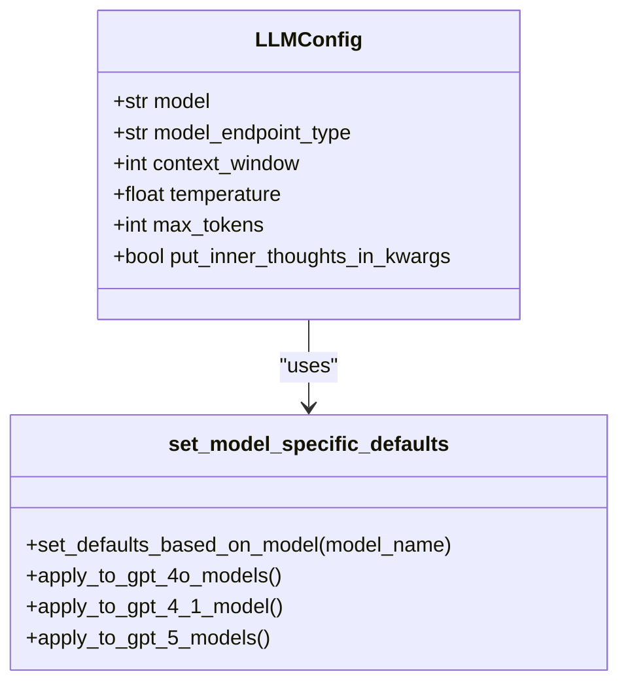
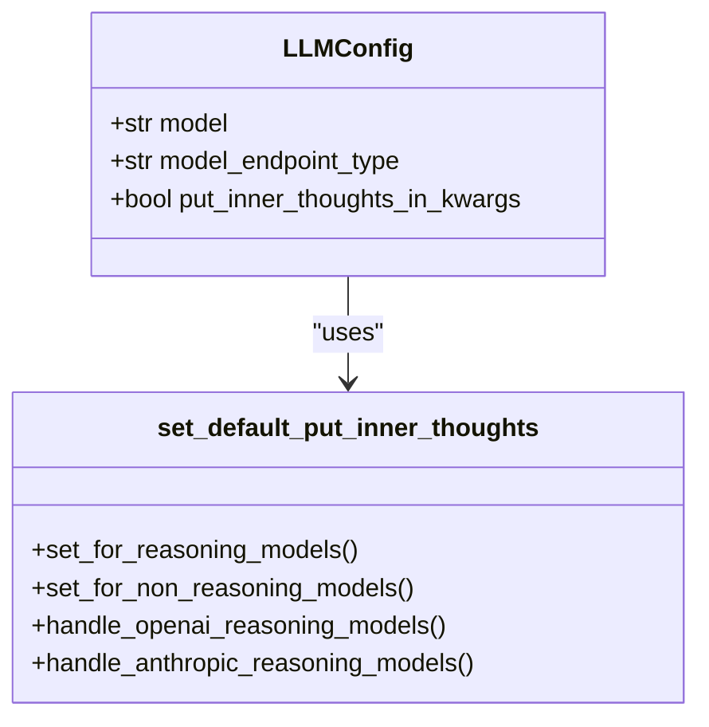
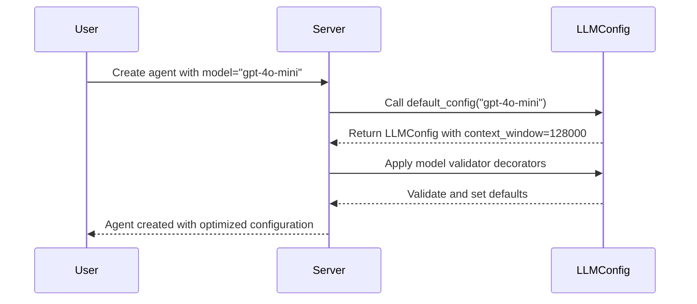

# Core LLM Parameters

<cite>
**Referenced Files in This Document**   
- [llm_config.py](file://letta/schemas/llm_config.py)
- [constants.py](file://letta/constants.py)
- [settings.py](file://letta/settings.py)
- [openai_client.py](file://letta/llm_api/openai_client.py)
- [agent.py](file://letta/agent.py)
- [utils.py](file://letta/utils.py)
- [providers.py](file://letta/schemas/providers.py)
- [model.py](file://letta/schemas/model.py)
- [helpers.py](file://letta/llm_api/helpers.py)
</cite>

## Table of Contents
1. [Introduction](#introduction)
2. [Key LLM Configuration Parameters](#key-llm-configuration-parameters)
3. [Model Validator Decorators](#model-validator-decorators)
4. [put_inner_thoughts_in_kwargs Parameter](#put_inner_thoughts_in_kwargs-parameter)
5. [Agent Creation and Configuration](#agent-creation-and-configuration)
6. [Common Configuration Issues](#common-configuration-issues)
7. [Performance Considerations](#performance-considerations)
8. [Conclusion](#conclusion)

## Introduction
The LLMConfig class in Letta provides a comprehensive configuration interface for language model parameters that control agent behavior, response quality, and token usage. This document details the fundamental parameters such as model, model_endpoint_type, context_window, temperature, and max_tokens, explaining their purpose and impact on agent functionality. The configuration system includes model validator decorators that automatically set model-specific defaults for context_window and max_tokens based on the model name, ensuring optimal performance without manual configuration. Understanding these parameters is essential for effectively configuring agents and optimizing their performance across different use cases and model capabilities.

**Section sources**
- [llm_config.py](file://letta/schemas/llm_config.py#L15-L528)

## Key LLM Configuration Parameters

### model
The model parameter specifies the name of the language model to be used, such as "gpt-4o-mini" or "gpt-4.1". This parameter determines the specific AI model that will process requests and generate responses. The model name directly influences the capabilities, performance characteristics, and available features of the agent. Different models have varying context window sizes, reasoning capabilities, and specialized features that affect how agents process information and generate responses.

### model_endpoint_type
The model_endpoint_type parameter defines the type of endpoint for the model, with supported values including "openai", "anthropic", "google_ai", "google_vertex", "azure", "groq", "ollama", "webui", "lmstudio", "llamacpp", "koboldcpp", "vllm", "hugging-face", "mistral", "together", "bedrock", "deepseek", and "xai". This parameter determines which API client will be used to communicate with the model provider and affects the specific features and capabilities available.

### context_window
The context_window parameter specifies the maximum number of tokens the model can process in a single request, effectively defining the model's memory capacity for a conversation. This value is critical for determining how much information the model can consider when generating responses. Larger context windows allow for more comprehensive understanding of complex conversations and documents, while smaller windows may require more frequent summarization to maintain context.

### temperature
The temperature parameter controls the randomness of the model's output, with a default value of 0.7. Higher temperature values result in more random and creative text, while lower values produce more deterministic and focused responses. This parameter allows fine-tuning of the model's creativity versus consistency, with values closer to 0 producing more predictable outputs and values closer to 1 generating more diverse and exploratory responses.

### max_tokens
The max_tokens parameter sets the maximum number of tokens to generate in a response. If not specified, the model will use its default value. This parameter helps control response length and manage token usage, preventing excessively long outputs that could consume unnecessary resources or exceed practical requirements.

**Section sources**
- [llm_config.py](file://letta/schemas/llm_config.py#L24-L67)

## Model Validator Decorators

### set_model_specific_defaults
The set_model_specific_defaults model validator decorator automatically sets model-specific default values for parameters like max_tokens and context_window based on the model name. This ensures consistent configuration across different models without requiring manual specification of optimal values. For example, when the model name is "gpt-4o-mini" or "gpt-4o", the decorator automatically sets the context_window to 128,000 tokens. Similarly, for "gpt-4.1", it sets the context_window to 256,000 and max_tokens to 8,192. For GPT-5 models, it configures a context_window of 272,000 and max_tokens of 16,384. This automatic configuration ensures that each model operates with its optimal settings, maximizing performance and efficiency.

**Diagram sources **
- [llm_config.py](file://letta/schemas/llm_config.py#L102-L137)

### set_default_put_inner_thoughts
The set_default_put_inner_thoughts model validator decorator dynamically configures the put_inner_thoughts_in_kwargs parameter based on the model being used. This decorator ensures that inner thought generation is optimized for each specific model's capabilities and best practices. For reasoning models like OpenAI's o1/o3 series and Anthropic's Claude 3.7/4 series, the decorator automatically sets put_inner_thoughts_in_kwargs to False, as these models have native reasoning capabilities that don't require the additional inner thoughts parameter. For other models, it defaults to True, enabling the inner thoughts functionality to enhance function calling performance and thought generation.

**Diagram sources **
- [llm_config.py](file://letta/schemas/llm_config.py#L149-L183)

## put_inner_thoughts_in_kwargs Parameter

### Functionality and Impact
The put_inner_thoughts_in_kwargs parameter controls whether 'inner_thoughts' are included as a keyword argument in function calls. When set to True, this parameter enhances function calling performance and facilitates the generation of inner thoughts, allowing the model to reason through problems more effectively before providing a response. This capability is particularly valuable for complex tasks that require multi-step reasoning or when the model needs to explain its decision-making process.

### Performance Benefits
Enabling put_inner_thoughts_in_kwargs improves the quality of function calls by allowing the model to generate intermediate reasoning steps before executing the function. This can lead to more accurate and contextually appropriate function invocations, as the model has the opportunity to consider various approaches and potential outcomes before making a decision. The inner thoughts also provide transparency into the model's reasoning process, making it easier to understand and debug agent behavior.

### Model-Specific Configuration
The default value of put_inner_thoughts_in_kwargs is automatically determined by the set_default_put_inner_thoughts validator based on the model type. For standard models like gpt-4, the parameter is set to True by default. However, for advanced reasoning models such as OpenAI's o1/o3 series and Anthropic's Claude 3.7/4 series, it is set to False, as these models have built-in reasoning capabilities that make the additional inner thoughts parameter unnecessary. This intelligent default configuration ensures optimal performance across different model types without requiring manual intervention.

**Section sources**
- [llm_config.py](file://letta/schemas/llm_config.py#L55-L58)
- [openai_client.py](file://letta/llm_api/openai_client.py#L60-L65)
- [helpers.py](file://letta/llm_api/helpers.py#L231-L293)

## Agent Creation and Configuration

### Default Configuration Patterns
The LLMConfig class provides a default_config convenience method that generates appropriate configurations for supported models. This method creates pre-configured LLMConfig instances for popular models like gpt-4, gpt-4o-mini, gpt-4o, gpt-4.1, gpt-5, and gpt-5.1, with optimized settings for each model's capabilities. For example, calling LLMConfig.default_config("gpt-4o-mini") automatically creates a configuration with the model set to "gpt-4o-mini", model_endpoint_type set to "openai", model_endpoint set to "https://api.openai.com/v1", and context_window set to 128,000.

### Configuration Overriding
While the default configurations provide optimal starting points, they can be overridden to customize agent behavior for specific use cases. Parameters can be modified when creating an LLMConfig instance or through the agent creation API. For example, the context_window can be limited to a specific value using the context_window_limit parameter, which ensures the configured context window does not exceed the specified limit. This is particularly useful when working with models that have very large context windows but where resource constraints or specific use cases require a smaller context size.

### Practical Implementation
In practice, agents are typically created using the default configurations, with selective overrides for specific requirements. The system automatically applies model-specific defaults through the validator decorators, ensuring that even when only the model name is specified, the agent receives an optimized configuration. This approach simplifies agent creation while maintaining flexibility for advanced customization when needed.

**Diagram sources **
- [llm_config.py](file://letta/schemas/llm_config.py#L203-L275)
- [server.py](file://letta/server/server.py#L1161-L1178)

## Common Configuration Issues

### Context Window Limits
A common configuration issue occurs when attempting to set a context_window_limit that exceeds the model's maximum capability. The system validates this constraint and raises a LettaInvalidArgumentError if the specified limit is greater than the model's maximum context window. This prevents configuration errors that could lead to runtime failures or unexpected behavior. The validation occurs in the server's agent creation process, where it checks if context_window_limit > llm_config.context_window and raises an appropriate error if this condition is met.

### Missing Context Window Configuration
Another potential issue arises when the context_window is undefined in the configuration. In such cases, the system attempts to determine an appropriate default value by checking if the model name exists in the LLM_MAX_TOKENS dictionary. If found, it uses the corresponding value; otherwise, it falls back to LLM_MAX_TOKENS["DEFAULT"]. This fallback mechanism ensures that agents can still function even with incomplete configuration, though it may not represent the optimal settings for the specific model.

### Global Context Window Limit
The system enforces a global_max_context_window_limit defined in the model_settings, which serves as an upper bound for all agent configurations. When no specific context_window_limit is provided, the system sets the context_window to the minimum of the model's maximum context window and the global_max_context_window_limit. This prevents individual agents from consuming excessive resources and ensures system-wide stability, particularly in multi-agent environments or when running on limited hardware.

**Section sources**
- [server.py](file://letta/server/server.py#L1170-L1178)
- [agent.py](file://letta/agent.py#L948-L955)
- [settings.py](file://letta/settings.py#L103-L104)

## Performance Considerations

### Context Window and Resource Usage
The context_window parameter has a direct impact on both performance and resource consumption. Larger context windows require more memory and computational resources, potentially affecting response times and system scalability. While models like gpt-4o-mini with 128,000 token context windows can process extensive information, this capability comes with increased resource demands. The system automatically calculates file access defaults based on context window size, with larger windows enabling access to more files and larger file segments.

### Token Management Strategies
Effective token management is crucial for maintaining optimal performance. The system includes mechanisms to monitor token usage and trigger summarization when approaching context limits. The memory_warning_threshold, typically set to 0.75, triggers warnings when token usage reaches 75% of the context window capacity. This proactive approach helps prevent context overflow and maintains conversation quality by initiating summarization processes before reaching hard limits.

### Model Selection Trade-offs
Different models present various performance trade-offs. While GPT-5 models offer advanced reasoning capabilities with context windows up to 272,000 tokens, they may have higher latency and cost compared to models like gpt-4o-mini. The choice of model should consider not only the required capabilities but also performance requirements, cost constraints, and expected usage patterns. The automatic configuration system helps balance these factors by applying optimized defaults while allowing for manual overrides when specific performance characteristics are required.

**Section sources**
- [utils.py](file://letta/utils.py#L1352-L1380)
- [agent.py](file://letta/agent.py#L957-L960)
- [settings.py](file://letta/settings.py#L86-L87)

## Conclusion
The LLMConfig class in Letta provides a sophisticated yet user-friendly interface for configuring language model parameters that directly impact agent behavior, response quality, and token usage. Through a combination of explicit parameters and intelligent model validator decorators, the system ensures optimal configuration for different models while maintaining flexibility for customization. The automatic setting of model-specific defaults for context_window and max_tokens based on the model name simplifies configuration and prevents common errors. The put_inner_thoughts_in_kwargs parameter plays a crucial role in function calling performance and inner thought generation, with its default value intelligently determined based on the model's reasoning capabilities. Understanding these parameters and their interactions is essential for effectively configuring agents and optimizing their performance across various use cases and model capabilities.

**Section sources**
- [llm_config.py](file://letta/schemas/llm_config.py#L15-L528)
- [constants.py](file://letta/constants.py#L227-L246)
- [model.py](file://letta/schemas/model.py#L20-L122)