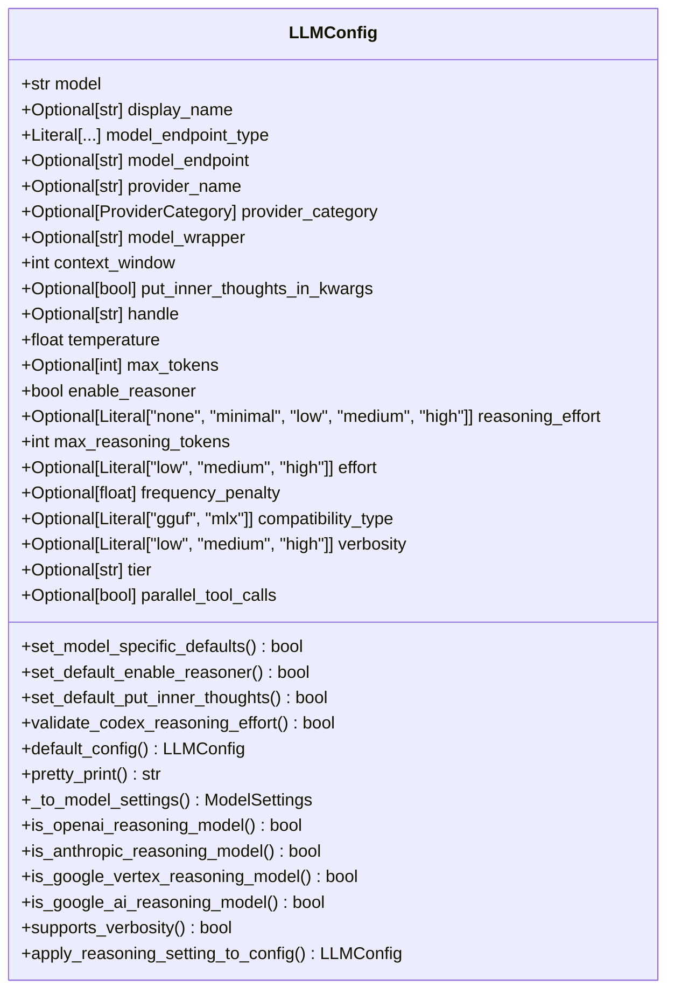
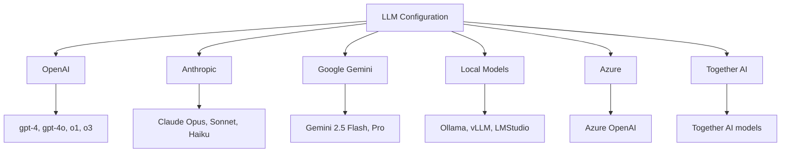
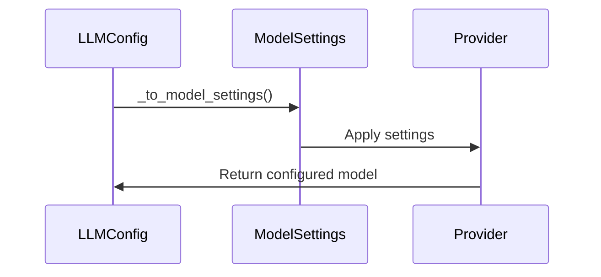
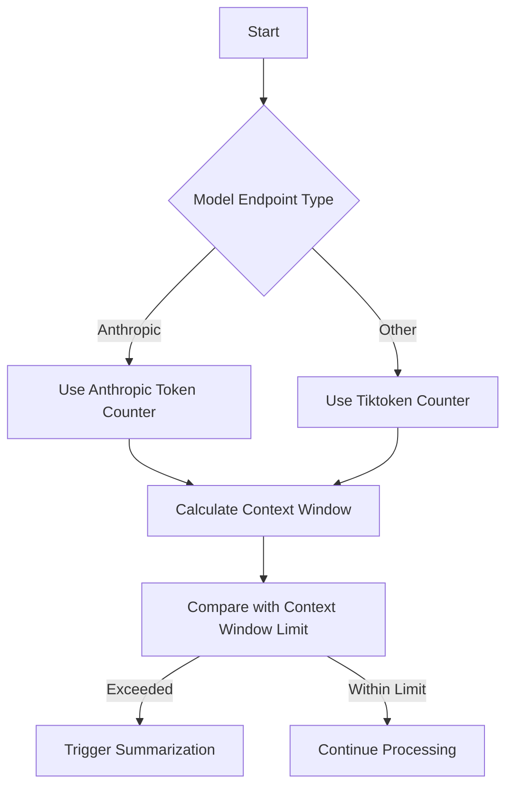

# LLM Configuration

<cite>
**Referenced Files in This Document**   
- [llm_config.py](file://letta/schemas/llm_config.py)
- [settings.py](file://letta/settings.py)
- [model.py](file://letta/schemas/model.py)
- [openai.py](file://letta/schemas/providers/openai.py)
- [anthropic.py](file://letta/schemas/providers/anthropic.py)
- [google_gemini.py](file://letta/schemas/providers/google_gemini.py)
- [constants.py](file://letta/constants.py)
</cite>

## Table of Contents
1. [Introduction](#introduction)
2. [LLMConfig Class Overview](#llmconfig-class-overview)
3. [Core Configuration Parameters](#core-configuration-parameters)
4. [Provider-Specific Configuration](#provider-specific-configuration)
5. [Model Settings and Configuration Conversion](#model-settings-and-configuration-conversion)
6. [Context Window Management](#context-window-management)
7. [Reasoning and Extended Thinking Configuration](#reasoning-and-extended-thinking-configuration)
8. [Model Wrappers and Prompt Formatting](#model-wrappers-and-prompt-formatting)
9. [Configuration Validation and Application](#configuration-validation-and-application)
10. [Performance Considerations](#performance-considerations)

## Introduction
The LLM configuration system in Letta provides a comprehensive framework for managing language model settings across multiple providers. This documentation details the LLMConfig class and related components that enable flexible configuration of various LLM providers including OpenAI, Anthropic, Google Gemini, Azure, Together AI, and local models like Ollama and vLLM. The system supports model-specific parameters, provider-specific configurations, and advanced features like reasoning models and context window management.

**Section sources**
- [llm_config.py](file://letta/schemas/llm_config.py#L1-L528)

## LLMConfig Class Overview
The LLMConfig class serves as the primary configuration container for language model settings in Letta. It defines a comprehensive set of parameters that control model behavior, generation parameters, and provider-specific configurations. The class is designed to be flexible and extensible, supporting a wide range of LLM providers and their unique capabilities.

**Diagram sources**
- [llm_config.py](file://letta/schemas/llm_config.py#L16-L528)

**Section sources**
- [llm_config.py](file://letta/schemas/llm_config.py#L16-L528)

## Core Configuration Parameters
The LLMConfig class defines several core parameters that control the fundamental behavior of language models. These parameters include model selection, temperature settings, token limits, and context window configuration.

### Model Selection and Identification
The model parameter specifies the LLM model name, while model_endpoint_type identifies the provider type (e.g., "openai", "anthropic", "google_ai"). The handle parameter provides a unique identifier in the format provider/model-name, enabling consistent model referencing across the system.

### Generation Parameters
Key generation parameters include:
- **temperature**: Controls randomness in text generation (default: 0.7)
- **max_tokens**: Maximum number of tokens to generate (optional)
- **frequency_penalty**: Penalizes repeated tokens to reduce verbatim repetition

### Context Window Configuration
The context_window parameter defines the maximum context size for the model, which determines how much conversation history and context the model can consider during generation. This parameter is critical for managing memory usage and ensuring optimal model performance.

**Section sources**
- [llm_config.py](file://letta/schemas/llm_config.py#L25-L96)

## Provider-Specific Configuration
Letta supports configuration for multiple LLM providers, each with their specific requirements and capabilities. The system automatically handles provider-specific settings through the model_endpoint_type parameter.

### OpenAI Configuration
For OpenAI models, configuration includes:
- API key management through model_settings.openai_api_key
- Base URL specification via openai_api_base
- Support for various OpenAI models including gpt-4, gpt-4o, and reasoning models like o1 and o3

### Anthropic Configuration
Anthropic models are configured with:
- API key through model_settings.anthropic_api_key
- Support for Claude models including Opus, Sonnet, and Haiku variants
- Special handling for 1M token context window via anthropic_sonnet_1m flag

### Google Gemini Configuration
Google AI and Vertex models are configured with:
- API key via model_settings.gemini_api_key
- Base URL specification
- Support for Gemini models including 2.5 Flash and Pro variants

### Local and Alternative Providers
The system also supports local models and alternative providers:
- **Ollama**: Configured via ollama_base_url
- **vLLM**: Configured via vllm_api_base
- **Together AI**: Configured via together_api_key
- **Azure**: Configured via azure_api_key and azure_base_url

**Diagram sources**
- [llm_config.py](file://letta/schemas/llm_config.py#L28-L50)
- [settings.py](file://letta/settings.py#L114-L183)

**Section sources**
- [llm_config.py](file://letta/schemas/llm_config.py#L28-L50)
- [settings.py](file://letta/settings.py#L114-L183)
- [openai.py](file://letta/schemas/providers/openai.py)
- [anthropic.py](file://letta/schemas/providers/anthropic.py)
- [google_gemini.py](file://letta/schemas/providers/google_gemini.py)

## Model Settings and Configuration Conversion
The LLM configuration system includes a sophisticated conversion mechanism that transforms LLMConfig instances into provider-specific ModelSettings objects. This conversion ensures that model parameters are properly formatted for each provider's API requirements.

### Model Settings Schema
The ModelSettings class in settings.py defines global configuration parameters that apply across all models, including:
- global_max_context_window_limit: Global limit for context window size
- default_prompt_formatter: Default model wrapper for prompt formatting
- Provider-specific API keys and endpoints

### Configuration Conversion Process
The _to_model_settings() method in LLMConfig converts configuration parameters to provider-specific settings:
- For OpenAI: Creates OpenAIModelSettings with reasoning configuration
- For Anthropic: Creates AnthropicModelSettings with thinking configuration
- For Google AI/Vertex: Creates GoogleAIModelSettings with thinking budget
- For other providers: Creates appropriate ModelSettings instances

This conversion process ensures that model-specific parameters are properly mapped to each provider's expected format.

**Diagram sources**
- [llm_config.py](file://letta/schemas/llm_config.py#L284-L365)
- [model.py](file://letta/schemas/model.py#L204-L431)

**Section sources**
- [llm_config.py](file://letta/schemas/llm_config.py#L284-L365)
- [model.py](file://letta/schemas/model.py#L204-L431)
- [settings.py](file://letta/settings.py#L103-L104)

## Context Window Management
Context window management is a critical aspect of LLM configuration, ensuring optimal performance and preventing token limit errors. The system implements a comprehensive approach to context window handling across different models and providers.

### Global Context Window Limit
The global_max_context_window_limit parameter in ModelSettings governs the maximum context window size across all models. This global limit prevents excessive memory usage and ensures system stability.

### Context Window Validation
The system validates context window settings during agent creation:
- Ensures context_window_limit does not exceed the model's maximum
- Applies the global limit when no specific limit is provided
- Triggers summarization when approaching context window limits

### Token Counting and Monitoring
Letta uses different token counting strategies based on the model:
- Anthropic token counter for Anthropic models
- Tiktoken counter for other models
- Context window calculator for comprehensive token usage analysis

**Diagram sources**
- [settings.py](file://letta/settings.py#L103)
- [agent_manager.py](file://letta/services/agent_manager.py#L3280-L3322)
- [letta_agent.py](file://letta/agents/letta_agent.py#L1504-L1531)

**Section sources**
- [settings.py](file://letta/settings.py#L103)
- [agent_manager.py](file://letta/services/agent_manager.py#L3280-L3322)
- [letta_agent.py](file://letta/agents/letta_agent.py#L1504-L1531)
- [context_window_calculator.py](file://letta/services/context_window_calculator/context_window_calculator.py#L97-L202)

## Reasoning and Extended Thinking Configuration
The LLM configuration system supports advanced reasoning capabilities for models that can perform extended thinking. This feature enables more sophisticated problem-solving and reasoning workflows.

### Reasoning Model Support
The system identifies reasoning-capable models through helper methods:
- is_openai_reasoning_model(): Detects OpenAI reasoning models (o1, o3, gpt-5)
- is_anthropic_reasoning_model(): Detects Anthropic reasoning models (Claude 3.7, 4)
- is_google_vertex_reasoning_model(): Detects Google Vertex reasoning models

### Reasoning Configuration Parameters
Key parameters for reasoning models include:
- enable_reasoner: Enables extended thinking capability
- reasoning_effort: Controls reasoning effort level (none, minimal, low, medium, high)
- max_reasoning_tokens: Sets thinking budget (minimum 1024 tokens)
- effort: Controls token spending for Anthropic Opus 4.5

### Reasoning Policy Management
The apply_reasoning_setting_to_config() method implements policy-based reasoning configuration:
- For letta_v1_agent: Enforces stricter semantics based on model capabilities
- For OpenAI native reasoning: Always enabled with appropriate defaults
- For Anthropic and Google models: Respects toggle settings
- For non-reasoning models: Disables reasoning features

**Section sources**
- [llm_config.py](file://letta/schemas/llm_config.py#L69-L83)
- [llm_config.py](file://letta/schemas/llm_config.py#L367-L527)

## Model Wrappers and Prompt Formatting
Model wrappers play a crucial role in prompt formatting and function calling parsing, especially for providers that use /completions APIs instead of /chat/completions.

### Default Prompt Formatter
The default_prompt_formatter setting in ModelSettings specifies the default model wrapper (default: "chatml"). This wrapper is responsible for:
- Formatting prompts according to the model's expected format
- Parsing function calls from model responses
- Handling special model requirements

### Wrapper Implementation
The local_llm/llm_chat_completion_wrappers directory contains various wrapper implementations:
- chatml.py: CHATML format wrapper
- llama3.py: Llama 3 format wrapper
- zephyr.py: Zephyr format wrapper
- configurable_wrapper.py: Configurable wrapper base
- wrapper_base.py: Base wrapper functionality

These wrappers ensure proper prompt formatting for different model families and their specific requirements.

**Section sources**
- [settings.py](file://letta/settings.py#L111-L112)
- [llm_config.py](file://letta/schemas/llm_config.py#L54)
- [local_llm/llm_chat_completion_wrappers](file://letta/local_llm/llm_chat_completion_wrappers)

## Configuration Validation and Application
The LLM configuration system includes comprehensive validation and application mechanisms to ensure proper configuration and error handling.

### Model Validator Decorators
The LLMConfig class uses Pydantic model validators to enforce configuration rules:
- set_model_specific_defaults(): Sets model-specific default values for max_tokens and context_window
- set_default_put_inner_thoughts(): Dynamically sets put_inner_thoughts_in_kwargs based on model
- validate_codex_reasoning_effort(): Validates reasoning effort for Codex models

### Configuration Application
Configuration is applied through the provider manager system:
- Provider models are synchronized with the database
- LLM configurations are retrieved by handle
- Settings are validated before application
- Errors are handled gracefully with appropriate fallbacks

### Error Handling
The system implements robust error handling for configuration issues:
- ContextWindowExceededError triggers context window rebuilding
- Authentication errors are handled at the provider level
- Invalid configuration parameters are validated and rejected

**Section sources**
- [llm_config.py](file://letta/schemas/llm_config.py#L103-L202)
- [provider_manager.py](file://letta/services/provider_manager.py#L605-L626)
- [letta_agent.py](file://letta/agents/letta_agent.py#L1497-L1502)

## Performance Considerations
When configuring LLMs in Letta, several performance considerations should be taken into account to optimize system efficiency and response quality.

### Context Window Size
Larger context windows enable more comprehensive reasoning but require more memory and processing time. The system automatically calculates reasonable defaults based on context window size:
- Small models (≤8K): Conservative defaults
- Medium models (≤32K): Balanced defaults
- Large models (≤128K): Higher limits
- Very large models (≤200K): Increased limits
- Extremely large models (>200K): Maximum limits

### Token Usage Optimization
To optimize token usage:
- Use appropriate context window limits
- Implement summarization strategies
- Monitor token usage through the context window calculator
- Use the global_max_context_window_limit to prevent excessive usage

### Provider Selection
Consider the following when selecting providers:
- Latency and response time requirements
- Cost implications of different models
- Feature availability (reasoning, tool calling, etc.)
- Reliability and uptime

### Model-Specific Optimizations
Different models have specific optimization opportunities:
- OpenAI: Use appropriate temperature and frequency_penalty settings
- Anthropic: Leverage extended thinking capabilities
- Google Gemini: Utilize thinking budget effectively
- Local models: Optimize for available hardware resources

**Section sources**
- [utils.py](file://letta/utils.py#L1352-L1380)
- [settings.py](file://letta/settings.py#L103)
- [llm_config.py](file://letta/schemas/llm_config.py#L114-L132)