# Provider-Specific Configuration

<cite>
**Referenced Files in This Document**
- [llm_config.py](file://letta/schemas/llm_config.py)
- [model.py](file://letta/schemas/model.py)
- [providers/base.py](file://letta/schemas/providers/base.py)
- [providers/openai.py](file://letta/schemas/providers/openai.py)
- [providers/anthropic.py](file://letta/schemas/providers/anthropic.py)
- [providers/google_vertex.py](file://letta/schemas/providers/google_vertex.py)
- [providers/bedrock.py](file://letta/schemas/providers/bedrock.py)
- [server.py](file://letta/server/server.py)
- [provider_manager.py](file://letta/services/provider_manager.py)
- [openai-gpt-4o-mini.json](file://tests/model_settings/openai-gpt-4o-mini.json)
- [openai-o1.json](file://tests/model_settings/openai-o1.json)
- [azure-gpt-4o-mini.json](file://tests/model_settings/azure-gpt-4o-mini.json)
</cite>

## Table of Contents
1. [Introduction](#introduction)
2. [Architecture Overview](#architecture-overview)
3. [Provider-Specific Configuration System](#provider-specific-configuration-system)
4. [Model Endpoint Types](#model-endpoint-types)
5. [Provider-Specific Settings Classes](#provider-specific-settings-classes)
6. [_to_model_settings() Method](#_to_model_settings-method)
7. [Provider-Specific Parameters](#provider-specific-parameters)
8. [Configuration Examples](#configuration-examples)
9. [Provider Defaults and Tuning](#provider-defaults-and-tuning)
10. [Integration Patterns](#integration-patterns)
11. [Best Practices](#best-practices)
12. [Troubleshooting](#troubleshooting)

## Introduction

Letta's provider-specific configuration system enables seamless integration with multiple Large Language Model (LLM) providers through a unified interface. The system supports various providers including OpenAI, Anthropic, Google AI, Google Vertex, Azure, Groq, Ollama, LM Studio, vLLM, AWS Bedrock, DeepSeek, and xAI. Each provider has specialized configuration parameters that are automatically handled through provider-specific settings classes.

The configuration system is built around the `model_endpoint_type` field in `LLMConfig`, which determines how models are configured and how provider-specific features are exposed. This design allows for consistent API usage while accommodating the unique characteristics and capabilities of each LLM provider.

## Architecture Overview

The provider configuration system follows a hierarchical architecture that separates concerns between generic LLM configuration and provider-specific customization:

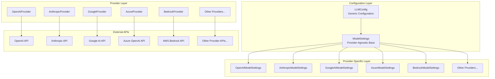

**Diagram sources**
- [llm_config.py](file://letta/schemas/llm_config.py#L28-L50)
- [model.py](file://letta/schemas/model.py#L259-L431)
- [providers/base.py](file://letta/schemas/providers/base.py#L19-L34)

## Provider-Specific Configuration System

### Core Components

The provider configuration system consists of several key components that work together to provide a unified interface for multiple LLM providers:

#### LLMConfig Class
The `LLMConfig` class serves as the primary configuration container that supports all major LLM providers through the `model_endpoint_type` field. It includes both generic parameters and provider-specific fields.

#### ModelSettings Hierarchy
The `ModelSettings` class hierarchy provides provider-specific configuration classes that extend the base functionality with provider-specific parameters and behaviors.

#### Provider Classes
Each supported provider has a dedicated provider class that handles API communication, model discovery, and provider-specific configuration management.

**Section sources**
- [llm_config.py](file://letta/schemas/llm_config.py#L16-L528)
- [model.py](file://letta/schemas/model.py#L259-L431)
- [providers/base.py](file://letta/schemas/providers/base.py#L19-L256)

## Model Endpoint Types

Letta supports the following model endpoint types, each representing a different LLM provider or service:

| Provider Type | Description | Use Case |
|---------------|-------------|----------|
| `openai` | OpenAI API services | GPT models, function calling, reasoning models |
| `anthropic` | Anthropic Claude models | Advanced reasoning, extended thinking |
| `google_ai` | Google AI Studio | Gemini models, multimodal capabilities |
| `google_vertex` | Google Cloud Vertex AI | Enterprise Gemini models |
| `azure` | Azure OpenAI | Enterprise OpenAI deployments |
| `groq` | Groq inference | High-speed inference |
| `ollama` | Local Ollama models | Self-hosted models |
| `lmstudio` | LM Studio API | Local model serving |
| `vllm` | vLLM inference | High-performance distributed inference |
| `bedrock` | AWS Bedrock | Anthropic models on AWS |
| `deepseek` | DeepSeek models | Specialized reasoning models |
| `xai` | xAI Grok models | Advanced reasoning capabilities |

**Section sources**
- [llm_config.py](file://letta/schemas/llm_config.py#L28-L50)

## Provider-Specific Settings Classes

### OpenAIModelSettings

The `OpenAIModelSettings` class extends `ModelSettings` with OpenAI-specific parameters, particularly focusing on reasoning capabilities:

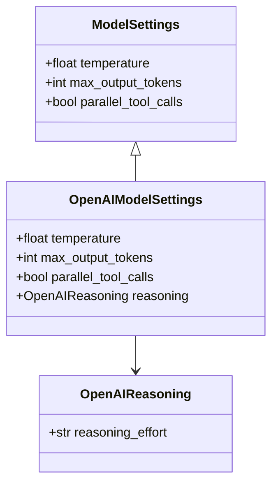

**Diagram sources**
- [model.py](file://letta/schemas/model.py#L259-L306)

Key features:
- **Reasoning Effort Control**: Supports `reasoning_effort` parameter with values: `"none"`, `"minimal"`, `"low"`, `"medium"`, `"high"`
- **Temperature Control**: Standard temperature parameter for generation randomness
- **Token Limits**: Configurable maximum output tokens

### AnthropicModelSettings

The `AnthropicModelSettings` class provides Anthropic-specific configuration with advanced thinking capabilities:

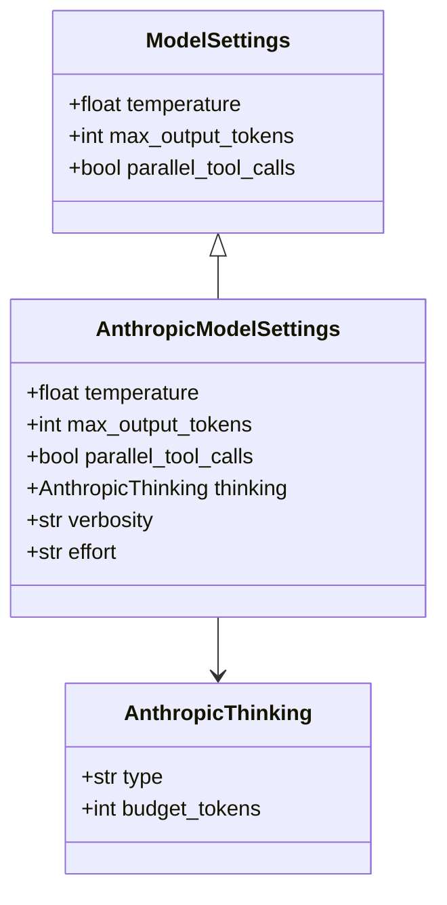

**Diagram sources**
- [model.py](file://letta/schemas/model.py#L259-L291)

Key features:
- **Extended Thinking**: Configurable thinking budget for Claude models
- **Effort Levels**: Token conservation controls for Claude Opus 4.5
- **Verbosity Control**: Output verbosity for GPT-5 models
- **Thinking Budget**: Configurable token allocation for reasoning

### Google AI Model Settings

Both `GoogleAIModelSettings` and `GoogleVertexModelSettings` provide Google-specific configuration:

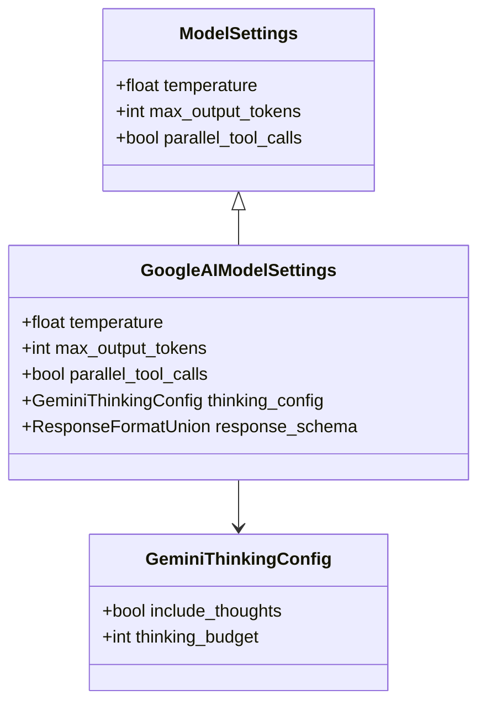

**Diagram sources**
- [model.py](file://letta/schemas/model.py#L294-L315)

Key features:
- **Thinking Configuration**: Enable/disable thoughts and budget control
- **Response Schema**: Structured output formatting
- **High Token Limits**: Up to 65,536 maximum output tokens

**Section sources**
- [model.py](file://letta/schemas/model.py#L259-L431)

## _to_model_settings() Method

The `_to_model_settings()` method in `LLMConfig` serves as the bridge between generic LLM configuration and provider-specific settings. This method converts `LLMConfig` instances into the appropriate provider-specific settings class:

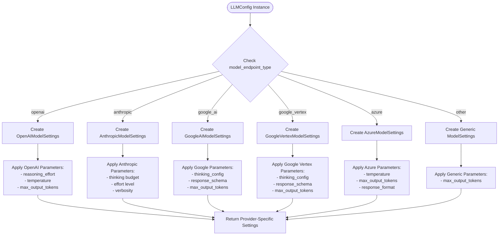

**Diagram sources**
- [llm_config.py](file://letta/schemas/llm_config.py#L284-L366)

The method automatically selects the appropriate provider-specific settings class based on the `model_endpoint_type` field and applies the corresponding parameters.

**Section sources**
- [llm_config.py](file://letta/schemas/llm_config.py#L284-L366)

## Provider-Specific Parameters

### Reasoning Effort (OpenAI)

OpenAI models support different reasoning effort levels that control the depth and quality of reasoning:

| Effort Level | Description | Use Case |
|--------------|-------------|----------|
| `none` | Disable reasoning | Fast inference, cost optimization |
| `minimal` | Basic reasoning | Balanced performance and cost |
| `low` | Enhanced reasoning | Improved accuracy for complex tasks |
| `medium` | Strong reasoning | Complex problem-solving |
| `high` | Maximum reasoning | Research-grade analysis |

### Thinking Configuration (Anthropic)

Anthropic models use a sophisticated thinking system with budget controls:

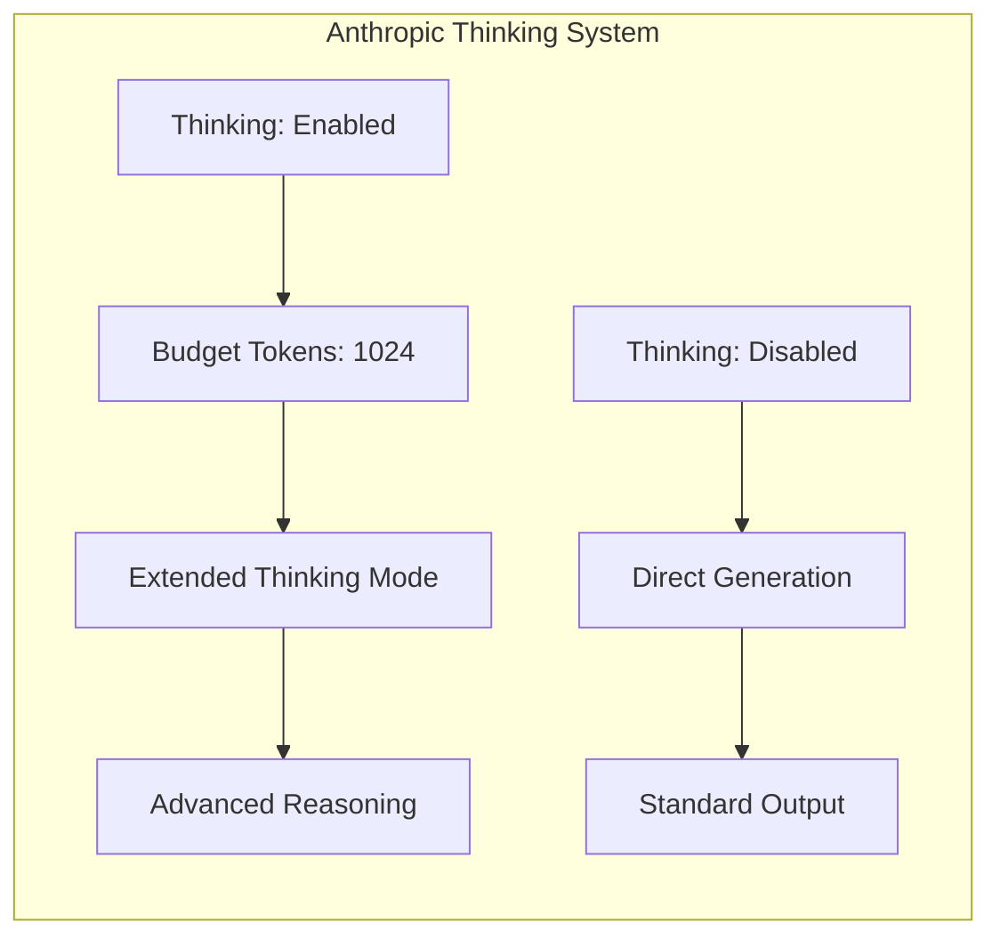

**Diagram sources**
- [model.py](file://letta/schemas/model.py#L254-L264)

### Effort Levels (Claude Opus 4.5)

Claude Opus 4.5 models support token conservation through effort levels:

| Effort Level | Token Conservation | Performance Impact |
|--------------|-------------------|-------------------|
| `low` | Minimal conservation | Highest speed |
| `medium` | Balanced conservation | Good balance |
| `high` | Maximum conservation | Optimal accuracy |

### Frequency Penalty Tuning

OpenAI models receive automatic frequency penalty tuning for improved output quality:

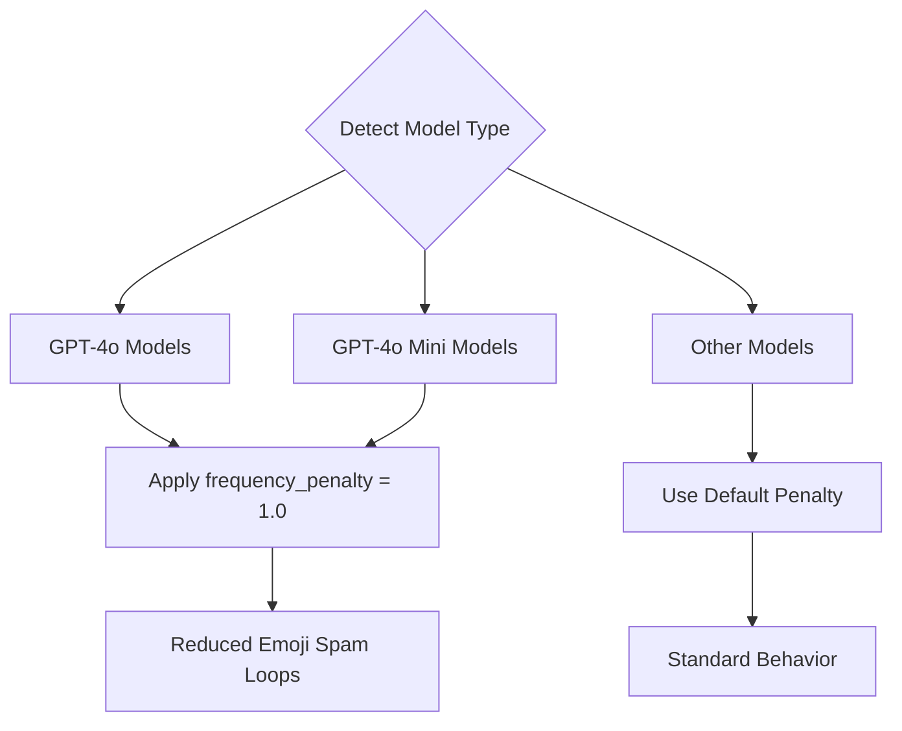

**Diagram sources**
- [providers/openai.py](file://letta/schemas/providers/openai.py#L146-L152)

**Section sources**
- [llm_config.py](file://letta/schemas/llm_config.py#L72-L87)
- [model.py](file://letta/schemas/model.py#L261-L276)
- [providers/openai.py](file://letta/schemas/providers/openai.py#L146-L152)

## Configuration Examples

### OpenAI Configuration Example

```json
{
  "handle": "openai/gpt-4o-mini",
  "model_settings": {
    "provider_type": "openai",
    "temperature": 0.7,
    "max_output_tokens": 4096,
    "parallel_tool_calls": false,
    "reasoning": {
      "reasoning_effort": "minimal"
    }
  }
}
```

**Key Features:**
- Temperature: Balanced creativity and consistency
- Reasoning Effort: Minimal for cost-effective reasoning
- Parallel Tool Calls: Disabled for reliability

### Anthropic Configuration Example

```json
{
  "handle": "anthropic/claude-3-5-sonnet",
  "model_settings": {
    "provider_type": "anthropic",
    "temperature": 1.0,
    "max_output_tokens": 8192,
    "thinking": {
      "type": "enabled",
      "budget_tokens": 2048
    },
    "effort": "medium"
  }
}
```

**Key Features:**
- Extended thinking with 2048 token budget
- Medium effort level for balanced performance
- Native thinking tag support

### Azure OpenAI Configuration Example

```json
{
  "handle": "azure/gpt-4o-mini",
  "model_settings": {
    "provider_type": "azure",
    "temperature": 0.7,
    "max_output_tokens": 4096,
    "parallel_tool_calls": false
  }
}
```

**Key Features:**
- OpenAI-compatible configuration
- Azure-specific endpoint handling
- Standard parameter set

**Section sources**
- [openai-gpt-4o-mini.json](file://tests/model_settings/openai-gpt-4o-mini.json#L1-L13)
- [openai-o1.json](file://tests/model_settings/openai-o1.json#L1-L12)
- [azure-gpt-4o-mini.json](file://tests/model_settings/azure-gpt-4o-mini.json#L1-L9)

## Provider Defaults and Tuning

### Automatic Parameter Tuning

Letta automatically applies provider-specific defaults and optimizations:

#### OpenAI Model Tuning
- **GPT-4o Models**: Automatic `frequency_penalty = 1.0` to reduce emoji spam loops
- **Context Windows**: Automatic context window sizing based on model capabilities
- **Verbosity**: Automatic verbosity settings for GPT-5 models

#### Reasoning Model Detection
Letta automatically detects reasoning-capable models and applies appropriate configurations:

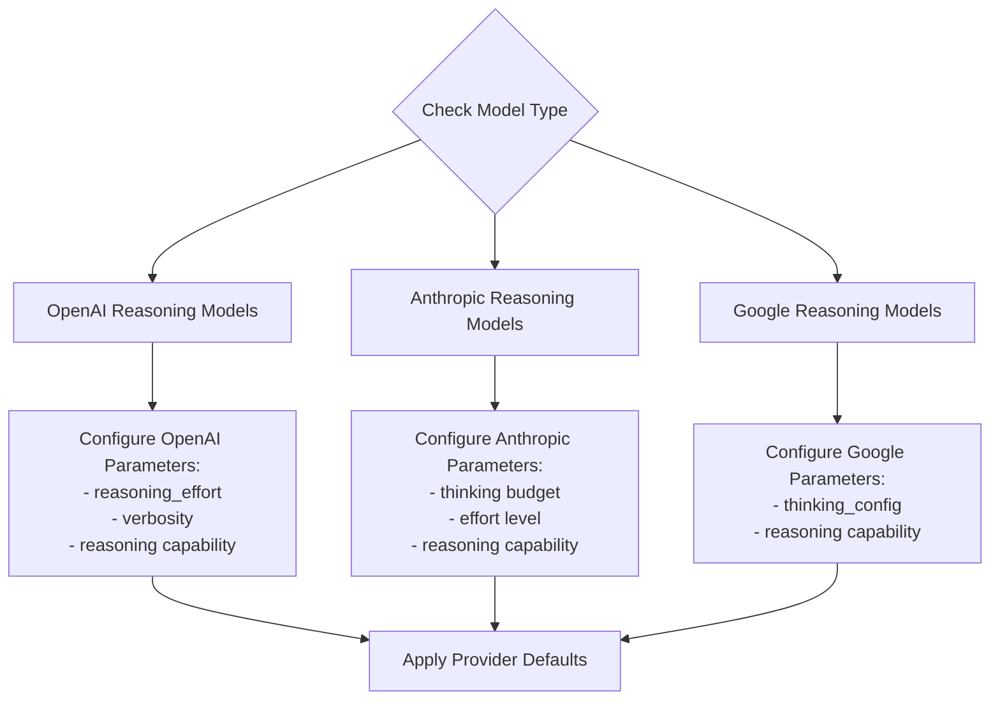

**Diagram sources**
- [llm_config.py](file://letta/schemas/llm_config.py#L401-L527)

### Context Window Management

Each provider has specific context window handling:

| Provider | Context Window Strategy | Special Features |
|----------|------------------------|------------------|
| OpenAI | Automatic sizing based on model | GPT-5: 272,000 tokens |
| Anthropic | Hardcoded 200,000 tokens | 1M context option available |
| Google AI | Hardcoded based on model | Gemini 2.5: 2M tokens |
| Azure | Inherits from OpenAI | OpenAI-compatible limits |

**Section sources**
- [llm_config.py](file://letta/schemas/llm_config.py#L122-L147)
- [providers/openai.py](file://letta/schemas/providers/openai.py#L146-L152)

## Integration Patterns

### Provider Discovery and Registration

Letta uses a centralized provider registration system:

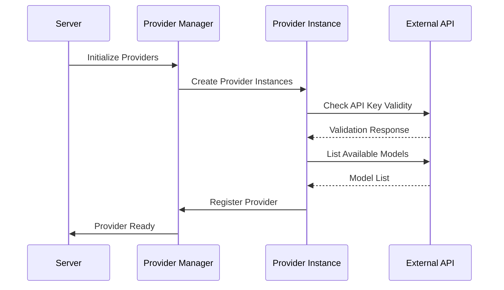

**Diagram sources**
- [server.py](file://letta/server/server.py#L209-L271)
- [provider_manager.py](file://letta/services/provider_manager.py#L18-L87)

### Authentication and Security

Provider authentication follows a secure pattern:

1. **API Key Encryption**: All API keys are encrypted using the `Secret` class
2. **Credential Validation**: Providers validate credentials before registration
3. **Scoped Access**: BYOK providers are organization-scoped, base providers are global

### Model Synchronization

Providers automatically synchronize available models:

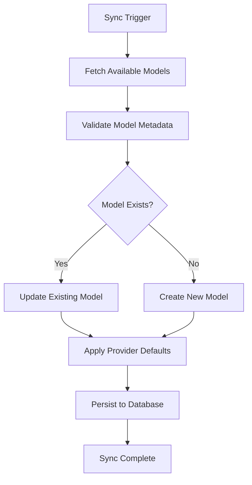

**Diagram sources**
- [provider_manager.py](file://letta/services/provider_manager.py#L482-L520)

**Section sources**
- [server.py](file://letta/server/server.py#L209-L271)
- [provider_manager.py](file://letta/services/provider_manager.py#L18-L87)

## Best Practices

### Provider Selection Guidelines

Choose the appropriate provider based on your requirements:

| Requirement | Recommended Provider | Alternative |
|-------------|---------------------|-------------|
| Cost-sensitive reasoning | OpenAI (minimal effort) | Anthropic (medium effort) |
| Advanced reasoning | Anthropic (extended thinking) | OpenAI (high effort) |
| Enterprise deployment | Azure/OpenAI | Google Vertex |
| Local deployment | Ollama/LM Studio | vLLM |
| High-speed inference | Groq | OpenAI (fast models) |
| Multimodal capabilities | OpenAI/Gemini | Anthropic |

### Configuration Optimization

Optimize configurations for your use case:

1. **Temperature Tuning**: Lower values (0.3-0.7) for factual content, higher values (0.7-1.0) for creative tasks
2. **Reasoning Effort**: Start with minimal/medium, increase based on accuracy requirements
3. **Token Limits**: Set based on expected output length and context window constraints
4. **Parallel Tool Calls**: Enable cautiously, monitor for reliability issues

### Error Handling and Monitoring

Implement robust error handling:

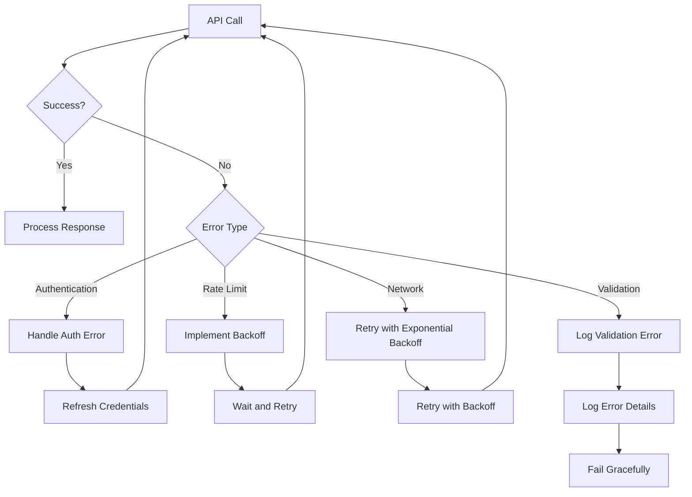

## Troubleshooting

### Common Issues and Solutions

#### Authentication Problems
- **Symptom**: 401 Unauthorized errors
- **Solution**: Verify API keys are correctly configured and not expired
- **Prevention**: Use the provider check endpoint to validate credentials

#### Model Availability Issues
- **Symptom**: Model not found in provider list
- **Solution**: Check provider-specific model availability and permissions
- **Prevention**: Regular model synchronization

#### Parameter Conflicts
- **Symptom**: Unexpected parameter errors
- **Solution**: Verify parameter compatibility with the selected model
- **Prevention**: Use provider-specific configuration templates

#### Performance Issues
- **Symptom**: Slow response times
- **Solution**: Adjust temperature, reduce reasoning effort, optimize token limits
- **Prevention**: Monitor performance metrics and adjust accordingly

### Debugging Tools

Letta provides several debugging tools for provider configuration:

1. **Provider Check Endpoint**: Validates API credentials and connectivity
2. **Model Synchronization Logs**: Tracks model discovery and updates
3. **Configuration Validation**: Ensures parameter compatibility
4. **Performance Monitoring**: Tracks response times and error rates

**Section sources**
- [provider_manager.py](file://letta/services/provider_manager.py#L482-L520)

## Conclusion

Letta's provider-specific configuration system provides a powerful and flexible foundation for integrating with multiple LLM providers. The system's hierarchical design ensures that both generic LLM functionality and provider-specific features are accessible through a unified interface. By leveraging provider-specific settings classes, automatic parameter tuning, and robust integration patterns, developers can build applications that seamlessly work across different LLM providers while maintaining optimal performance and reliability.

The system's extensibility allows for easy addition of new providers and configuration options, making it suitable for evolving LLM ecosystems. Through careful attention to provider-specific parameters, automatic defaults, and comprehensive error handling, Letta enables developers to focus on building applications rather than managing provider complexities.