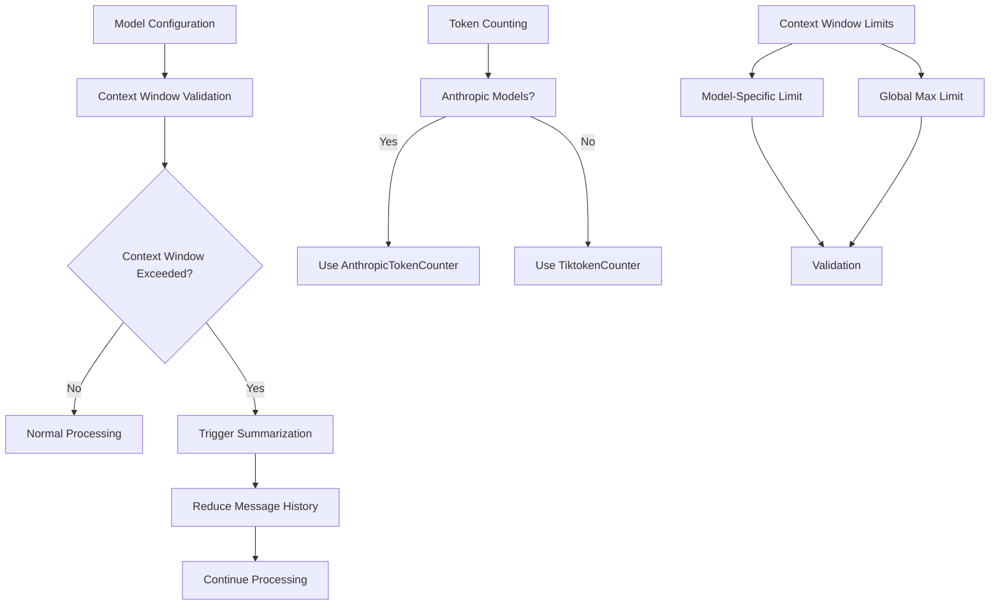

# Model Configuration

<cite>
**Referenced Files in This Document**   
- [letta/settings.py](file://letta/settings.py)
- [letta/schemas/model.py](file://letta/schemas/model.py)
- [letta/schemas/llm_config.py](file://letta/schemas/llm_config.py)
- [letta/schemas/embedding_config.py](file://letta/schemas/embedding_config.py)
- [letta/server/server.py](file://letta/server/server.py)
- [letta/services/provider_manager.py](file://letta/services/provider_manager.py)
- [letta/schemas/providers/openai.py](file://letta/schemas/providers/openai.py)
- [letta/local_llm/utils.py](file://letta/local_llm/utils.py)
- [letta/local_llm/chat_completion_proxy.py](file://letta/local_llm/chat_completion_proxy.py)
- [letta/agents/letta_agent.py](file://letta/agents/letta_agent.py)
- [letta/services/context_window_calculator/context_window_calculator.py](file://letta/services/context_window_calculator/context_window_calculator.py)
- [letta/utils.py](file://letta/utils.py)
</cite>

## Table of Contents
1. [Introduction](#introduction)
2. [ModelSettings Class Overview](#modelsettings-class-overview)
3. [LLM Provider Configuration](#llm-provider-configuration)
4. [Embedding Model Configuration](#embedding-model-configuration)
5. [Model-Specific Parameters](#model-specific-parameters)
6. [Model Endpoints and Wrappers](#model-endpoints-and-wrappers)
7. [Agent Creation and Model Integration](#agent-creation-and-model-integration)
8. [Performance Considerations](#performance-considerations)
9. [Context Window Management](#context-window-management)
10. [Configuration Examples](#configuration-examples)

## Introduction
Letta provides a comprehensive model configuration system that enables users to customize LLM and embedding model settings across various providers. The system is designed to support multiple LLM providers including OpenAI, Anthropic, Google Gemini, Azure, Together AI, and local models like Ollama and vLLM. This documentation details the ModelSettings class in settings.py that manages configuration for these providers, explains model-specific parameters, and describes how to configure embedding models and integrate them with the agent creation process.

**Section sources**
- [letta/settings.py](file://letta/settings.py#L100-L195)

## ModelSettings Class Overview
The ModelSettings class in settings.py serves as the central configuration point for all LLM and embedding model settings in Letta. This class inherits from Pydantic's BaseSettings and provides a structured way to configure various aspects of model behavior, including API keys, endpoints, and provider-specific parameters.

The ModelSettings class includes a global_max_context_window_limit parameter that governs context window management across all models, defaulting to 32,000 tokens. This parameter acts as an upper bound for context window sizes, ensuring that no model exceeds this limit unless explicitly configured otherwise.

The class also defines a default_prompt_formatter parameter that specifies the model wrapper responsible for prompt formatting and function calling parsing when using /completions APIs instead of /chat/completions. The default wrapper is set to "chatml", which follows the ChatML format for prompt construction.

**Section sources**
- [letta/settings.py](file://letta/settings.py#L100-L195)

## LLM Provider Configuration
Letta supports configuration for multiple LLM providers through the ModelSettings class. Each provider has specific configuration parameters that must be set to establish connectivity and define behavior.

For OpenAI, the configuration includes openai_api_key for authentication and openai_api_base to specify the API endpoint. The system supports both OPENAI_BASE_URL and OPENAI_API_BASE environment variables for backward compatibility.

Anthropic configuration requires anthropic_api_key for authentication, with an additional anthropic_max_retries parameter that defaults to 3. A special anthropic_sonnet_1m flag enables the 1M-token context window for Claude Sonnet 4/4.5 models when set to true.

Azure configuration requires azure_api_key, azure_base_url, and azure_api_version parameters. The azure_api_version defaults to "2024-09-01-preview" to ensure compatibility with the latest API features.

Google Gemini configuration uses gemini_api_key for authentication, with gemini_base_url defaulting to "https://generativelanguage.googleapis.com/". The gemini_force_minimum_thinking_budget parameter controls whether a minimum thinking budget is enforced.

Local model providers like Ollama and vLLM require ollama_base_url and vllm_api_base respectively to specify the local endpoint. These configurations enable Letta to interface with locally hosted models.

**Section sources**
- [letta/settings.py](file://letta/settings.py#L113-L195)
- [letta/server/server.py](file://letta/server/server.py#L211-L271)

## Embedding Model Configuration
Embedding model configuration in Letta is managed through the EmbeddingConfig class and related settings. The system supports various embedding providers with specific configuration options for each.

The EmbeddingConfig class defines key parameters including embedding_dim for the dimension of the embedding, embedding_chunk_size for controlling the size of text chunks processed at once, and embedding_model for specifying the model name. Default chunk size is defined as a constant DEFAULT_EMBEDDING_CHUNK_SIZE.

For OpenAI embedding models, configuration includes embedding_endpoint_type set to "openai", with embedding_endpoint pointing to the OpenAI API. Supported models include "text-embedding-ada-002" with 1536 dimensions and "text-embedding-3-small" with 2000 dimensions.

Azure embedding configuration uses embedding_endpoint_type "azure" with specific parameters for azure_endpoint, azure_version, and azure_deployment. The dimension can vary, with examples showing 768 dimensions for certain configurations.

Local embedding models like Ollama can be configured with appropriate endpoints, allowing integration with locally hosted embedding services. The system also supports Pinecone as a vector database provider with specific configuration options.

**Section sources**
- [letta/schemas/embedding_config.py](file://letta/schemas/embedding_config.py#L44-L87)
- [letta/services/provider_manager.py](file://letta/services/provider_manager.py#L869-L888)
- [tests/configs/embedding_model_configs/openai_embed.json](file://tests/configs/embedding_model_configs/openai_embed.json)
- [tests/configs/embedding_model_configs/azure_embed.json](file://tests/configs/embedding_model_configs/azure_embed.json)

## Model-Specific Parameters
Letta supports various model-specific parameters that control the behavior of LLMs during text generation. These parameters are configured through the LLMConfig class and can be set at the model level.

Temperature is a key parameter that controls the randomness of text generation, with lower values (closer to 0) producing more deterministic outputs and higher values (closer to 1) producing more creative and varied outputs. The default temperature is set to 0.7.

Max_tokens defines the maximum number of tokens to generate in the response. This parameter can be set to None to use the model's default value, or to a specific integer to limit response length. For many models, this defaults to 4096 tokens.

Response format configuration allows specifying the desired output format, particularly for models that support structured outputs. This is especially relevant for reasoning models that can generate JSON responses with inner thoughts and function calls.

Frequency_penalty is a parameter that penalizes new tokens based on their existing frequency in the text so far, decreasing the model's likelihood to repeat the same line verbatim. Values range from -2.0 to 2.0, with positive values reducing repetition.

Reasoning parameters are available for models that support extended thinking capabilities. The max_reasoning_tokens parameter configures the thinking budget, with a minimum value of 1024 when used with enable_reasoner. The reasoning_effort parameter can be set to "none", "minimal", "low", "medium", or "high" to control the depth of reasoning.

**Section sources**
- [letta/schemas/llm_config.py](file://letta/schemas/llm_config.py#L61-L93)
- [tests/model_settings/openai-gpt-4o-mini.json](file://tests/model_settings/openai-gpt-4o-mini.json)
- [tests/model_settings/claude-3-5-sonnet.json](file://tests/model_settings/claude-3-5-sonnet.json)

## Model Endpoints and Wrappers
Letta provides flexible configuration for model endpoints and prompt formatting through wrappers. The system supports various endpoint types and allows customization of prompt formatting for different models.

Model endpoints are configured through the model_endpoint_type parameter, which can be set to various values including "openai", "anthropic", "google_ai", "google_vertex", "azure", "groq", "ollama", "vllm", and others. Each endpoint type has specific configuration requirements and behaviors.

Prompt formatting is handled by model wrappers that are responsible for constructing prompts in the appropriate format for each model. The default_prompt_formatter is set to "chatml", which follows the ChatML format with <|im_start|> and <|im_end|> tokens. Alternative wrappers include "llama3" for Llama 3 models and "zephyr" for Zephyr models.

The local_llm module provides various wrapper implementations in the llm_chat_completion_wrappers directory, including:
- chatml.py for ChatML format
- llama3.py for Llama 3 format
- zephyr.py for Zephyr format
- configurable_wrapper.py for customizable prompt formatting

These wrappers handle the conversion of messages to the appropriate prompt format, including system messages, user messages, assistant messages, and function calls. They also manage special tokens and formatting requirements specific to each model family.

**Section sources**
- [letta/settings.py](file://letta/settings.py#L110-L111)
- [letta/local_llm/utils.py](file://letta/local_llm/utils.py#L263-L300)
- [letta/local_llm/chat_completion_proxy.py](file://letta/local_llm/chat_completion_proxy.py#L67-L99)

## Agent Creation and Model Integration
Model settings are integrated into the agent creation process through the Agent class and related components. When creating an agent, model configuration is passed through the LLMConfig and EmbeddingConfig objects.

The agent creation process begins with the Server class in server.py, which collects enabled providers based on the available API keys in ModelSettings. Providers are dynamically enabled when their corresponding API keys are present in the configuration.

During agent creation, the system validates that the requested model is supported by the configured provider. If multiple models with the same name are supported, an error is raised. The context window limit is validated against both the model's maximum context window and the global_max_context_window_limit.

The Model class provides a from_llm_config method that creates a Model instance from an LLMConfig, copying relevant parameters including model name, context window, temperature, max_tokens, and other model-specific settings. This allows for consistent model configuration across the system.

Agent configuration can specify both LLM and embedding models, with the system supporting separate configuration for each. The default_llm_handle and default_embedding_handle settings in the main Settings class provide fallback values when specific models are not specified.

**Section sources**
- [letta/server/server.py](file://letta/server/server.py#L209-L271)
- [letta/schemas/model.py](file://letta/schemas/model.py#L91-L122)
- [letta/schemas/agent.py](file://letta/schemas/agent.py#L80-L87)
- [letta/services/agent_manager.py](file://letta/services/agent_manager.py#L484-L510)

## Performance Considerations
When configuring models in Letta, several performance considerations should be taken into account to optimize system behavior and resource usage.

The choice of model provider and specific model can significantly impact performance. Cloud-based providers like OpenAI and Anthropic offer high-performance models but may have latency due to network communication. Local models like Ollama and vLLM can provide lower latency but require sufficient local computational resources.

Context window size is a critical performance factor, as larger context windows require more memory and computational resources. The global_max_context_window_limit parameter helps prevent excessive resource usage by capping the maximum context window across all models.

Token usage should be monitored, as many providers charge based on token consumption. Configuring appropriate max_tokens values can help control costs, especially for applications with high message volumes.

For embedding models, the embedding_chunk_size parameter affects both performance and quality. Smaller chunks may be processed faster but could lose contextual information, while larger chunks preserve more context but require more computational resources.

The system includes built-in mechanisms for context window management, including summarization when the context window approaches its limit. The summarizer_settings in settings.py control this behavior, with parameters like message_buffer_limit and partial_evict_summarizer_percentage determining when and how summarization occurs.

**Section sources**
- [letta/settings.py](file://letta/settings.py#L103-L104)
- [letta/agents/letta_agent.py](file://letta/agents/letta_agent.py#L1504-L1531)
- [letta/services/context_window_calculator/context_window_calculator.py](file://letta/services/context_window_calculator/context_window_calculator.py#L97-L202)
- [letta/utils.py](file://letta/utils.py#L1347-L1380)

## Context Window Management
Letta implements comprehensive context window management to handle the limitations of LLM context windows. The global_max_context_window_limit parameter in ModelSettings serves as the upper bound for all models, defaulting to 32,000 tokens.

The system uses a multi-layered approach to context window management. First, it validates that requested context window limits do not exceed either the model's maximum context window or the global_max_context_window_limit. This validation occurs during agent creation in the Server class.

When the context window approaches its limit, the system triggers summarization to reduce the token count. The summarizer component can be configured with various settings, including message_buffer_limit to control the maximum number of messages and partial_evict_summarizer_percentage to determine the percentage of messages to evict during summarization.

The ContextWindowCalculator class provides detailed information about context window usage, breaking down token consumption by category including system prompt, core memory, summary memory, messages, and function definitions. This allows for fine-grained analysis of context window utilization.

Token counting is handled by different token counters depending on the model. For Anthropic models, the AnthropicTokenCounter is used, while other models use the TiktokenCounter. This ensures accurate token counting that matches the provider's tokenization method.

The system also calculates file handling defaults based on context window size, adjusting max_files_open and per_file_view_window_char_limit according to the available context. This ensures that file operations are optimized for the specific model's capabilities.

**Diagram sources**
- [letta/settings.py](file://letta/settings.py#L103-L104)
- [letta/agents/letta_agent.py](file://letta/agents/letta_agent.py#L1504-L1531)
- [letta/services/context_window_calculator/context_window_calculator.py](file://letta/services/context_window_calculator/context_window_calculator.py#L97-L202)
- [letta/utils.py](file://letta/utils.py#L1347-L1380)

**Section sources**
- [letta/settings.py](file://letta/settings.py#L103-L104)
- [letta/agents/letta_agent.py](file://letta/agents/letta_agent.py#L1504-L1531)
- [letta/services/context_window_calculator/context_window_calculator.py](file://letta/services/context_window_calculator/context_window_calculator.py#L97-L202)
- [letta/utils.py](file://letta/utils.py#L1347-L1380)

## Configuration Examples
Letta provides several example configurations for different models and use cases. These examples demonstrate how to configure various LLM providers and embedding models.

For OpenAI's GPT-4o-mini, a configuration example includes:
- handle: "openai/gpt-4o-mini"
- temperature: 0.7
- max_output_tokens: 4096
- parallel_tool_calls: false
- reasoning with minimal effort

For Anthropic's Claude 3.5 Sonnet, a configuration example includes:
- handle: "anthropic/claude-3-5-sonnet-20241022"
- temperature: 1.0
- max_output_tokens: 4096
- parallel_tool_calls: false
- thinking with enabled type and 1024 budget tokens

For local models using Ollama, a configuration example includes:
- handle: "ollama/qwen2.5:7b"
- temperature: 0.7
- max_output_tokens: 4096
- parallel_tool_calls: false
- provider_type: "openai" (indicating compatibility with OpenAI API format)

These configuration examples are typically stored in JSON format and can be loaded programmatically. The system supports loading configuration from files, environment variables, or direct API calls, providing flexibility for different deployment scenarios.

**Section sources**
- [tests/model_settings/openai-gpt-4o-mini.json](file://tests/model_settings/openai-gpt-4o-mini.json)
- [tests/model_settings/claude-3-5-sonnet.json](file://tests/model_settings/claude-3-5-sonnet.json)
- [tests/model_settings/ollama.json](file://tests/model_settings/ollama.json)