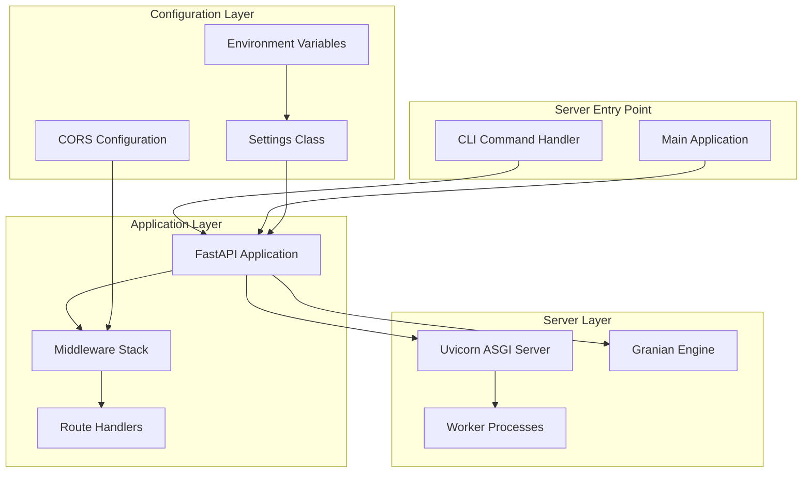
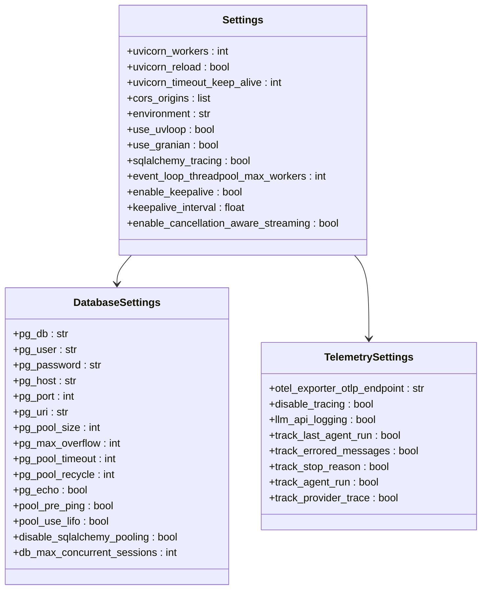
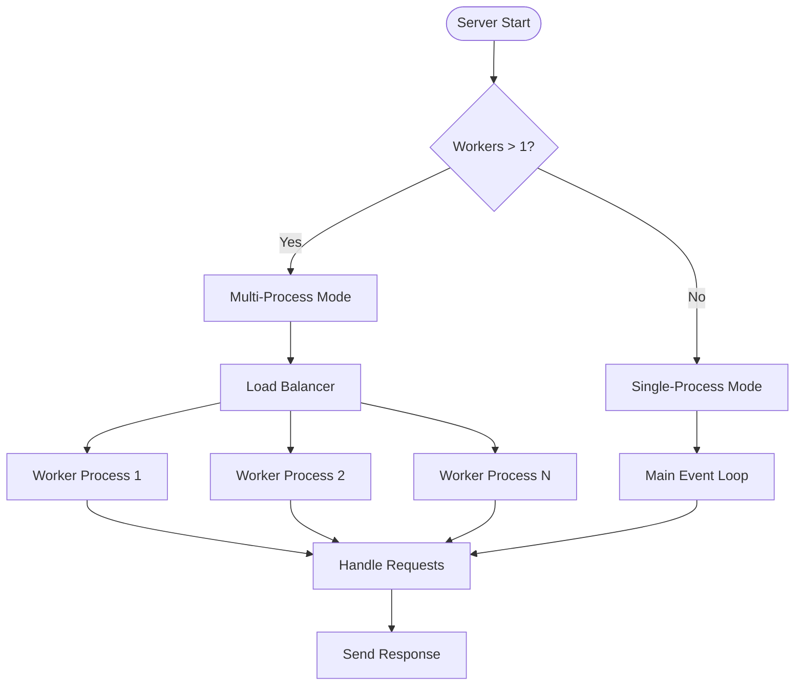
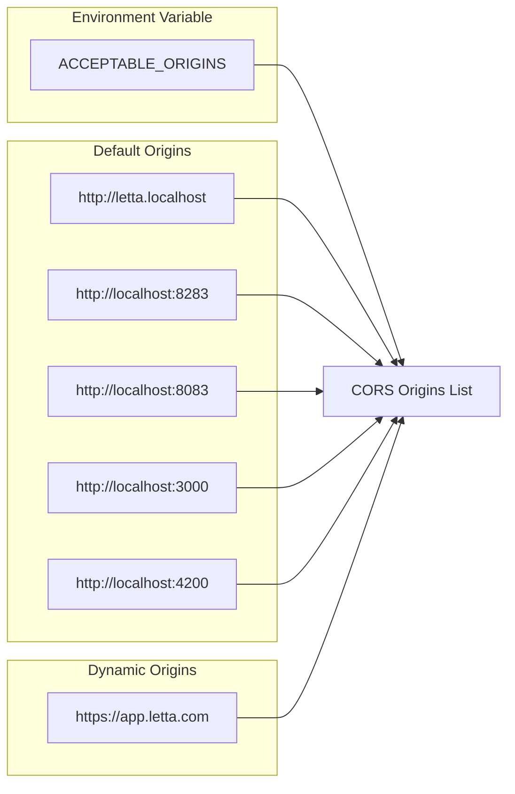
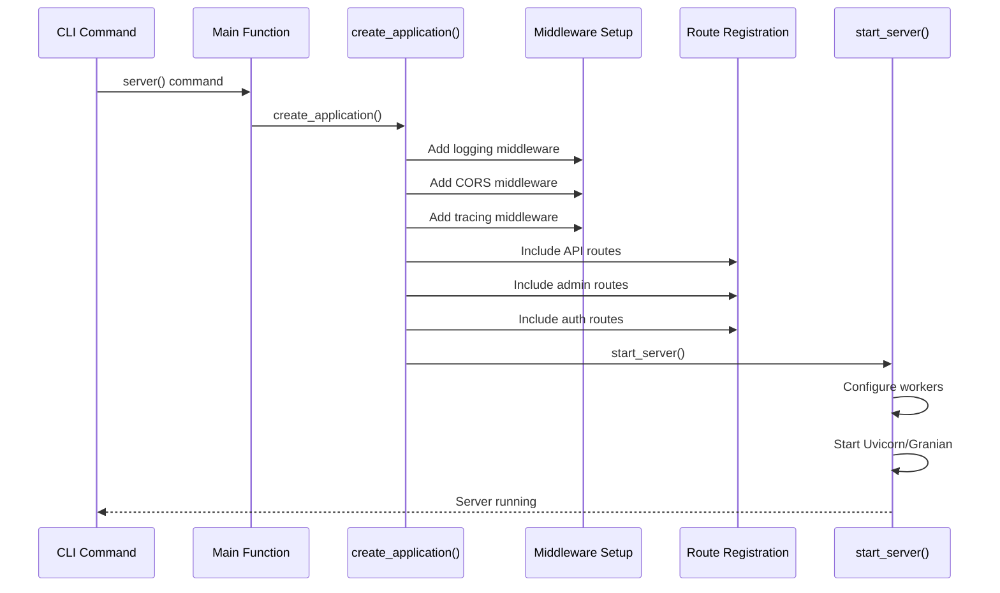
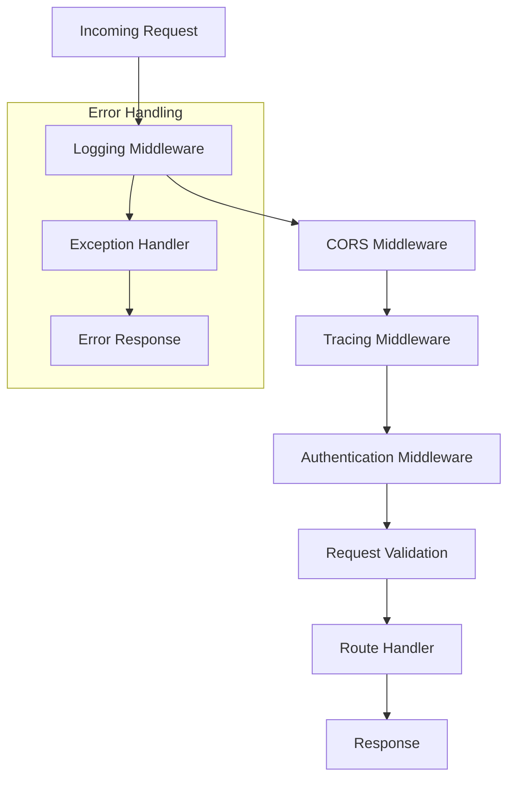
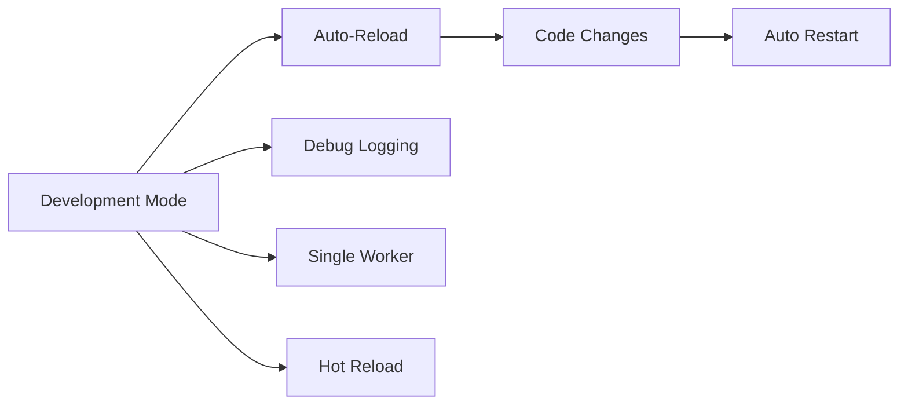
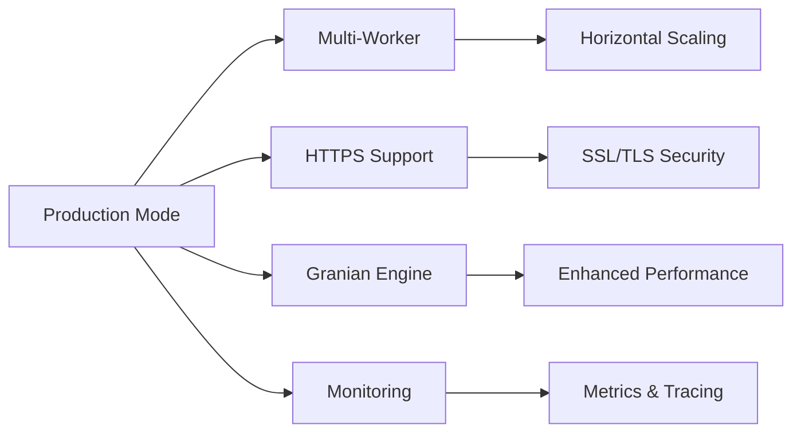
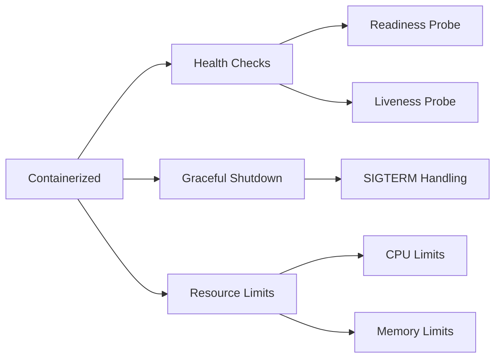
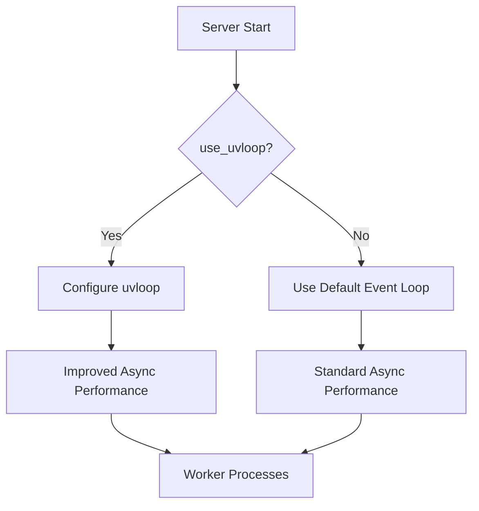

# API Server Configuration

<cite>
**Referenced Files in This Document**
- [settings.py](file://letta/settings.py)
- [app.py](file://letta/server/rest_api/app.py)
- [server.py](file://letta/server/server.py)
- [constants.py](file://letta/server/constants.py)
- [cli.py](file://letta/cli/cli.py)
- [logging.py](file://letta/server/rest_api/middleware/logging.py)
- [main.py](file://letta/main.py)
- [static_files.py](file://letta/server/rest_api/static_files.py)
</cite>

## Table of Contents
1. [Introduction](#introduction)
2. [FastAPI Server Architecture](#fastapi-server-architecture)
3. [Core Server Configuration](#core-server-configuration)
4. [Uvicorn Worker Configuration](#uvicorn-worker-configuration)
5. [CORS Configuration](#cors-configuration)
6. [Server Startup Process](#server-startup-process)
7. [Middleware Stack](#middleware-stack)
8. [Deployment Scenarios](#deployment-scenarios)
9. [Performance Optimization](#performance-optimization)
10. [Best Practices](#best-practices)

## Introduction

Letta's API server is built on FastAPI and provides a robust, scalable REST API for managing AI agents and conversations. The server configuration encompasses multiple layers including Uvicorn workers, CORS policies, middleware stack, and deployment-specific optimizations. This documentation covers the comprehensive configuration system that controls server behavior, performance, and security across different deployment environments.

## FastAPI Server Architecture

Letta's FastAPI server follows a modular architecture with clear separation of concerns:

**Diagram sources**
- [app.py](file://letta/server/rest_api/app.py#L642-L643)
- [cli.py](file://letta/cli/cli.py#L32-L35)
- [main.py](file://letta/main.py#L17-L18)

**Section sources**
- [app.py](file://letta/server/rest_api/app.py#L642-L643)
- [cli.py](file://letta/cli/cli.py#L32-L35)

## Core Server Configuration

The server configuration is managed through the Settings class, which inherits from Pydantic's BaseSettings for type safety and environment variable support.

### Settings Class Structure

**Diagram sources**
- [settings.py](file://letta/settings.py#L230-L460)

### Key Configuration Parameters

| Parameter | Type | Default | Description |
|-----------|------|---------|-------------|
| `uvicorn_workers` | int | 1 | Number of worker processes for handling requests |
| `uvicorn_reload` | bool | False | Enable auto-reload during development |
| `uvicorn_timeout_keep_alive` | int | 5 | Timeout for keep-alive connections |
| `cors_origins` | list | Default origins | Allowed CORS origins for cross-origin requests |
| `use_uvloop` | bool | False | Enable uvloop for improved asyncio performance |
| `use_granian` | bool | False | Use Granian as the ASGI server engine |

**Section sources**
- [settings.py](file://letta/settings.py#L289-L296)

## Uvicorn Worker Configuration

Uvicorn serves as the primary ASGI server for Letta's API, with extensive configuration options for controlling concurrency and performance.

### Worker Process Management

**Diagram sources**
- [app.py](file://letta/server/rest_api/app.py#L706-L708)
- [app.py](file://letta/server/rest_api/app.py#L690-L692)

### Worker Configuration Options

The server supports multiple worker configurations:

1. **Development Mode**: Single worker with auto-reload
2. **Production Mode**: Multiple workers for horizontal scaling
3. **Experimental Engines**: Granian for enhanced performance

**Section sources**
- [app.py](file://letta/server/rest_api/app.py#L690-L708)
- [app.py](file://letta/server/rest_api/app.py#L726-L748)

## CORS Configuration

Cross-Origin Resource Sharing (CORS) configuration enables secure communication between the API server and frontend applications hosted on different domains.

### CORS Origins Configuration

**Diagram sources**
- [settings.py](file://letta/settings.py#L197-L209)
- [app.py](file://letta/server/rest_api/app.py#L560-L561)

### CORS Middleware Setup

The CORS middleware is configured with comprehensive permissions:

- **Allow Credentials**: Enabled for authenticated requests
- **Allow Methods**: All HTTP methods (*) for flexibility
- **Allow Headers**: All headers (*) for unrestricted access
- **Dynamic Origins**: Supports environment variable customization

**Section sources**
- [settings.py](file://letta/settings.py#L195-L209)
- [app.py](file://letta/server/rest_api/app.py#L572-L578)

## Server Startup Process

The server startup process involves multiple stages from initialization to serving requests.

### Application Creation Flow

**Diagram sources**
- [cli.py](file://letta/cli/cli.py#L32-L35)
- [app.py](file://letta/server/rest_api/app.py#L642-L643)
- [app.py](file://letta/server/rest_api/app.py#L645-L749)

### Server Initialization Steps

1. **Application Creation**: `create_application()` initializes the FastAPI app
2. **Middleware Setup**: Logging, CORS, and tracing middleware are added
3. **Route Registration**: API routes are included with appropriate prefixes
4. **Static File Serving**: Frontend assets are mounted for SPA support
5. **OpenAPI Generation**: Schema is generated for API documentation
6. **Server Startup**: Uvicorn or Granian starts with configured parameters

**Section sources**
- [app.py](file://letta/server/rest_api/app.py#L530-L640)
- [app.py](file://letta/server/rest_api/app.py#L645-L749)

## Middleware Stack

Letta's middleware stack provides comprehensive request processing, logging, and error handling capabilities.

### Middleware Architecture

**Diagram sources**
- [app.py](file://letta/server/rest_api/app.py#L569-L578)
- [logging.py](file://letta/server/rest_api/middleware/logging.py#L20-L31)

### Logging Middleware Features

The logging middleware provides sophisticated request context enrichment:

- **Automatic Context Extraction**: Extracts actor_id, org_id, agent_id from URLs and headers
- **Structured Logging**: Provides detailed request and error logging
- **Exception Handling**: Catches and logs unhandled exceptions with context
- **Performance Monitoring**: Logs request duration and response status

**Section sources**
- [logging.py](file://letta/server/rest_api/middleware/logging.py#L20-L165)

## Deployment Scenarios

Letta supports multiple deployment scenarios with tailored configurations for each environment.

### Development Environment

**Characteristics:**
- `uvicorn_reload = True` for automatic restart on code changes
- `debug = True` for detailed logging
- `uvicorn_workers = 1` for simplicity
- Enhanced logging for development debugging

### Production Environment

**Characteristics:**
- `uvicorn_workers = optimal_value` for CPU cores
- `use_granian = True` for production performance
- HTTPS enabled for secure communication
- Comprehensive monitoring and tracing

### Containerized Deployment

**Section sources**
- [app.py](file://letta/server/rest_api/app.py#L677-L749)
- [cli.py](file://letta/cli/cli.py#L18-L27)

## Performance Optimization

Letta provides several mechanisms for optimizing API server performance across different deployment scenarios.

### Worker Configuration Optimization

| Scenario | Recommended Workers | Reasoning |
|----------|-------------------|-----------|
| Single CPU Core | 1-2 workers | Prevents GIL contention |
| Multi-Core CPU | CPU cores × 2 | Maximizes parallel processing |
| GPU Workloads | 1-2 workers | Minimizes memory overhead |
| High-Concurrency | 4-8 workers | Handles many simultaneous requests |

### Keep-Alive Configuration

The `uvicorn_timeout_keep_alive` setting controls connection persistence:

- **Development**: Lower values (1-3 seconds) for quick resource cleanup
- **Production**: Higher values (10-30 seconds) for connection reuse
- **High-Traffic**: Optimized values based on traffic patterns

### Event Loop Optimization

**Diagram sources**
- [app.py](file://letta/server/rest_api/app.py#L666-L675)

**Section sources**
- [settings.py](file://letta/settings.py#L294-L296)
- [app.py](file://letta/server/rest_api/app.py#L666-L675)

## Best Practices

### Configuration Management

1. **Environment-Specific Settings**: Use separate configuration files for development, staging, and production
2. **Secret Management**: Store sensitive configuration in environment variables or secure vaults
3. **Validation**: Leverage Pydantic's built-in validation for configuration parameters
4. **Documentation**: Document all configuration options with their effects and recommended values

### Security Considerations

1. **CORS Configuration**: Limit CORS origins to trusted domains only
2. **HTTPS Enforcement**: Use HTTPS in production environments
3. **Authentication**: Implement proper authentication middleware
4. **Rate Limiting**: Consider adding rate limiting for API endpoints

### Monitoring and Observability

1. **Logging**: Enable structured logging with correlation IDs
2. **Metrics**: Track request duration, error rates, and throughput
3. **Tracing**: Use OpenTelemetry for distributed tracing
4. **Health Checks**: Implement comprehensive health checking

### Performance Tuning

1. **Worker Scaling**: Monitor CPU utilization and adjust worker count accordingly
2. **Connection Pooling**: Optimize database connection pooling settings
3. **Caching**: Implement appropriate caching strategies
4. **Compression**: Enable response compression for large payloads

**Section sources**
- [settings.py](file://letta/settings.py#L230-L460)
- [app.py](file://letta/server/rest_api/app.py#L580-L608)