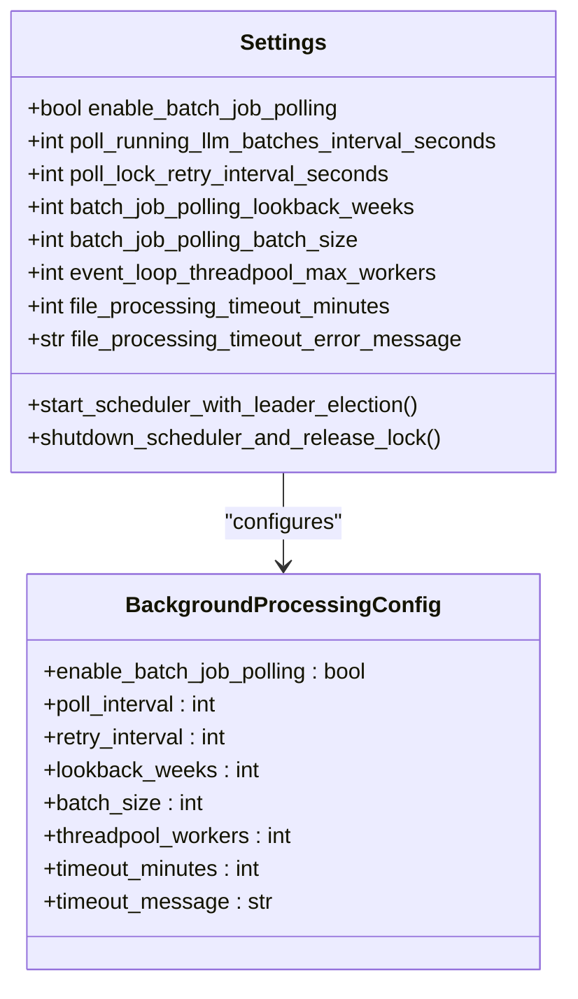
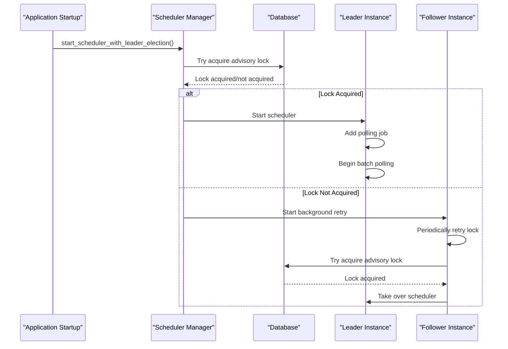
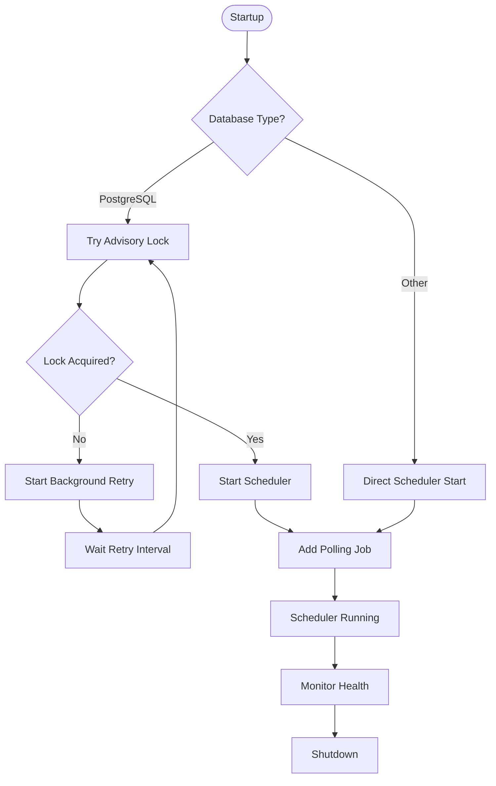
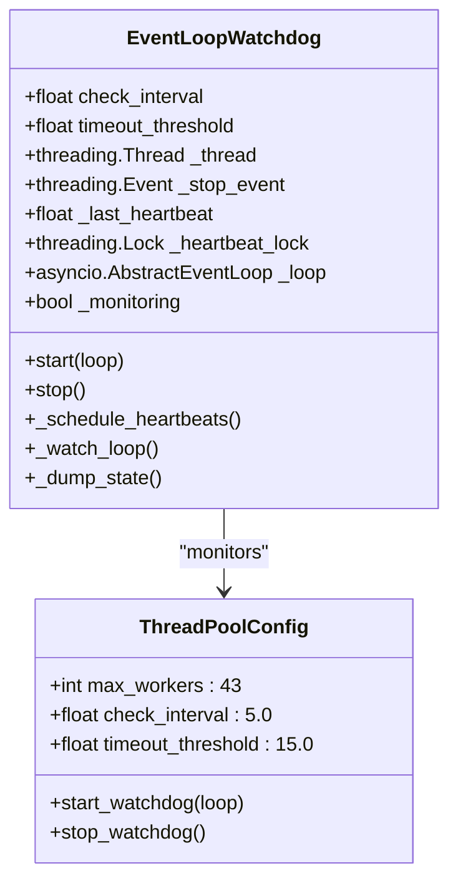
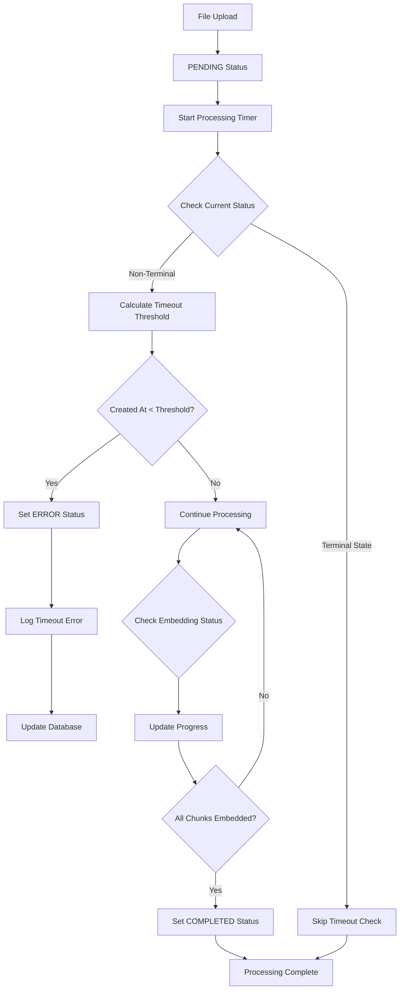
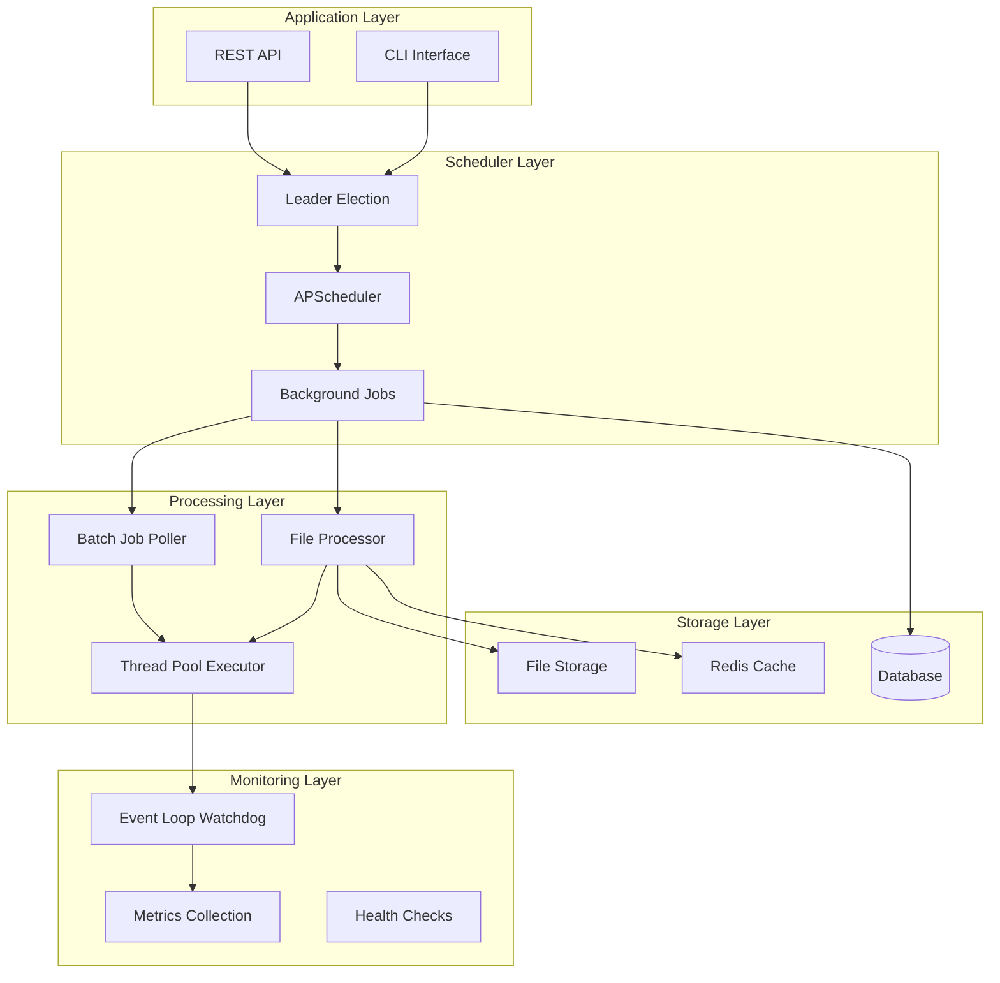
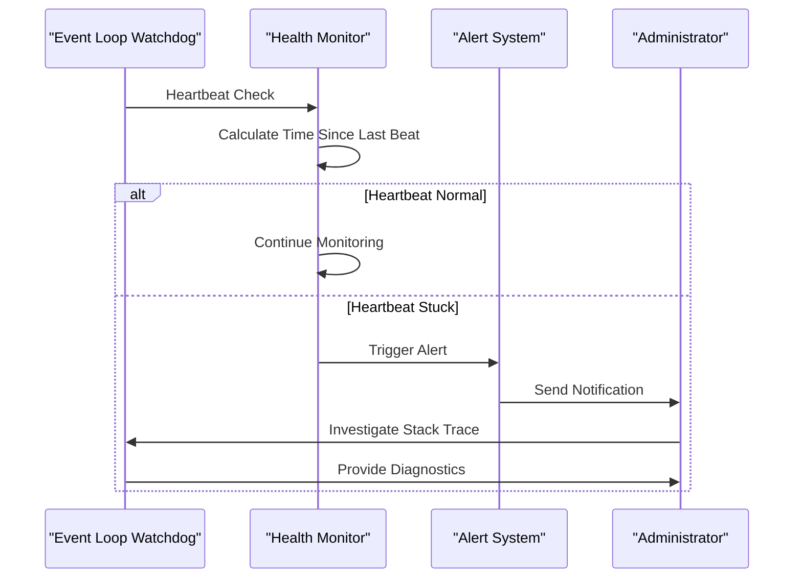

# Background Processing Configuration

<cite>
**Referenced Files in This Document**
- [settings.py](file://letta/settings.py)
- [scheduler.py](file://letta/jobs/scheduler.py)
- [llm_batch_job_polling.py](file://letta/jobs/llm_batch_job_polling.py)
- [file_manager.py](file://letta/services/file_manager.py)
- [event_loop_watchdog.py](file://letta/monitoring/event_loop_watchdog.py)
- [app.py](file://letta/server/rest_api/app.py)
- [enums.py](file://letta/schemas/enums.py)
</cite>

## Table of Contents
1. [Introduction](#introduction)
2. [Settings Configuration](#settings-configuration)
3. [Cron Job Management](#cron-job-management)
4. [Event Loop Parallelism](#event-loop-parallelism)
5. [File Processing Timeout](#file-processing-timeout)
6. [Background Processing Architecture](#background-processing-architecture)
7. [Production Configuration Guidelines](#production-configuration-guidelines)
8. [Monitoring and Troubleshooting](#monitoring-and-troubleshooting)
9. [Best Practices](#best-practices)

## Introduction

Letta's background processing system provides robust infrastructure for managing asynchronous operations, batch jobs, and long-running tasks. The system is built around a centralized scheduler with leader election capabilities, configurable timeout mechanisms, and comprehensive monitoring to ensure reliable operation in production environments.

The background processing configuration encompasses several key areas:
- **Batch job polling** for LLM API operations
- **Leader election** for distributed deployments
- **Event loop parallelism** for concurrent operations
- **File processing timeouts** to prevent hanging operations
- **Health monitoring** to detect and recover from stuck operations

## Settings Configuration

The background processing settings are managed through the Settings class in Letta's configuration system. These settings control the behavior of the job scheduler, polling intervals, and timeout thresholds.

### Core Background Processing Settings



**Diagram sources**
- [settings.py](file://letta/settings.py#L311-L344)

### Configuration Parameters

| Setting | Type | Default | Description |
|---------|------|---------|-------------|
| `enable_batch_job_polling` | bool | False | Enables/disables the LLM batch job polling system |
| `poll_running_llm_batches_interval_seconds` | int | 300 | Interval between batch job status polls (5 minutes) |
| `poll_lock_retry_interval_seconds` | int | 480 | Retry interval for acquiring scheduler leadership (8 minutes) |
| `batch_job_polling_lookback_weeks` | int | 2 | Lookback period for retrieving running batches |
| `batch_job_polling_batch_size` | Optional[int] | None | Maximum number of batches to poll per iteration |
| `event_loop_threadpool_max_workers` | int | 43 | Maximum worker threads for event loop parallelism |
| `file_processing_timeout_minutes` | int | 30 | Timeout for file processing operations |
| `file_processing_timeout_error_message` | str | "File processing timed out..." | Error message template for timeouts |

**Section sources**
- [settings.py](file://letta/settings.py#L311-L344)

## Cron Job Management

The cron job system in Letta is built around the APScheduler framework with PostgreSQL advisory locks for leader election in distributed deployments.

### Scheduler Initialization and Leadership



**Diagram sources**
- [scheduler.py](file://letta/jobs/scheduler.py#L163-L228)

### Leader Election Mechanism

The leader election system uses PostgreSQL advisory locks to ensure only one instance runs the scheduler in a distributed environment:



**Diagram sources**
- [scheduler.py](file://letta/jobs/scheduler.py#L25-L106)

### Batch Job Polling Configuration

The batch job polling system continuously monitors running LLM batch operations and updates their status:

**Section sources**
- [scheduler.py](file://letta/jobs/scheduler.py#L163-L228)
- [llm_batch_job_polling.py](file://letta/jobs/llm_batch_job_polling.py#L170-L204)

## Event Loop Parallelism

Letta implements sophisticated event loop management with watchdog monitoring to ensure system stability and prevent deadlocks.

### Thread Pool Configuration

The `event_loop_threadpool_max_workers` setting controls the maximum number of concurrent operations that can be executed in parallel:



**Diagram sources**
- [event_loop_watchdog.py](file://letta/monitoring/event_loop_watchdog.py#L17-L179)

### Watchdog Monitoring System

The event loop watchdog provides continuous monitoring to detect and recover from stuck operations:

**Section sources**
- [event_loop_watchdog.py](file://letta/monitoring/event_loop_watchdog.py#L17-L179)

## File Processing Timeout

Letta implements comprehensive timeout mechanisms for file processing operations to prevent long-running tasks from blocking the system.

### Timeout Implementation



**Diagram sources**
- [file_manager.py](file://letta/services/file_manager.py#L304-L330)

### File Processing States

The file processing system uses a state machine with terminal states to prevent invalid transitions:

| State | Description | Terminal? |
|-------|-------------|-----------|
| PENDING | File queued for processing | No |
| PARSING | File content being parsed | No |
| EMBEDDING | Content being embedded | No |
| COMPLETED | Processing finished successfully | Yes |
| ERROR | Processing failed with error | Yes |

**Section sources**
- [file_manager.py](file://letta/services/file_manager.py#L304-L330)
- [enums.py](file://letta/schemas/enums.py#L182-L191)

## Background Processing Architecture

Letta's background processing system integrates multiple components to provide a robust foundation for asynchronous operations.

### System Architecture Overview



**Diagram sources**
- [app.py](file://letta/server/rest_api/app.py#L163-L193)
- [scheduler.py](file://letta/jobs/scheduler.py#L1-L228)

## Production Configuration Guidelines

### Recommended Production Settings

For production deployments, the following configuration guidelines ensure optimal performance and reliability:

```yaml
# Background Processing Configuration
background_processing:
  enable_batch_job_polling: true
  poll_running_llm_batches_interval_seconds: 300  # 5 minutes
  poll_lock_retry_interval_seconds: 480          # 8 minutes
  batch_job_polling_lookback_weeks: 2
  batch_job_polling_batch_size: 50               # Limit concurrent batches
  
  # Event Loop Configuration
  event_loop_threadpool_max_workers: 43          # Adjust based on CPU cores
  
  # Timeout Configuration
  file_processing_timeout_minutes: 30
  file_processing_timeout_error_message: "File processing timed out after {} minutes. Please try again."
  
  # Database Configuration
  db_pool_size: 25
  db_max_overflow: 10
  db_pool_timeout: 30
```

### Scaling Considerations

| Component | Recommendation | Rationale |
|-----------|----------------|-----------|
| Batch Job Polling | Limit batch_size to 50-100 | Prevents overwhelming the LLM provider |
| Thread Pool Size | 2-4x CPU cores | Balance between concurrency and overhead |
| Timeout Values | 30-60 minutes | Allow for large file processing |
| Database Pool | 25-50 connections | Support concurrent background operations |

### Environment-Specific Configuration

**Development:**
```python
settings = Settings(
    enable_batch_job_polling=True,
    poll_running_llm_batches_interval_seconds=60,  # Faster polling
    file_processing_timeout_minutes=10,           # Shorter timeout
    event_loop_threadpool_max_workers=10
)
```

**Production:**
```python
settings = Settings(
    enable_batch_job_polling=True,
    poll_running_llm_batches_interval_seconds=300,
    file_processing_timeout_minutes=30,
    event_loop_threadpool_max_workers=43
)
```

## Monitoring and Troubleshooting

### Health Monitoring

Letta provides comprehensive monitoring for background processing operations:



**Diagram sources**
- [event_loop_watchdog.py](file://letta/monitoring/event_loop_watchdog.py#L75-L144)

### Common Issues and Solutions

| Issue | Symptoms | Solution |
|-------|----------|----------|
| Scheduler not starting | No batch job polling | Check PostgreSQL advisory lock permissions |
| Long-running file processing | Files stuck in PENDING | Increase file_processing_timeout_minutes |
| Event loop freezing | No progress reports | Enable event loop watchdog monitoring |
| Database connection issues | Scheduler failures | Adjust database pool settings |

### Diagnostic Commands

```bash
# Check scheduler status
curl -X GET "http://localhost:8283/api/admin/scheduler/status"

# Monitor batch job progress
curl -X GET "http://localhost:8283/api/admin/batch-jobs"

# Check file processing status
curl -X GET "http://localhost:8283/api/sources/{source_id}/files?check_status_updates=true"
```

## Best Practices

### Configuration Best Practices

1. **Enable Leader Election in Production**
   ```python
   settings.enable_batch_job_polling = True
   ```

2. **Set Appropriate Timeouts**
   ```python
   settings.file_processing_timeout_minutes = 30
   settings.poll_running_llm_batches_interval_seconds = 300
   ```

3. **Monitor Resource Usage**
   ```python
   settings.event_loop_threadpool_max_workers = min(43, cpu_count() * 2)
   ```

### Operational Best Practices

1. **Regular Monitoring**
   - Monitor batch job completion rates
   - Track file processing success rates
   - Watch for timeout occurrences

2. **Capacity Planning**
   - Monitor database connection pools
   - Track thread pool utilization
   - Measure event loop responsiveness

3. **Error Handling**
   - Implement retry logic for transient failures
   - Log timeout events for analysis
   - Monitor leader election failures

### Security Considerations

1. **Database Permissions**
   - Ensure PostgreSQL advisory lock permissions
   - Restrict database connection limits
   - Monitor for unauthorized access

2. **Resource Limits**
   - Set appropriate timeout values
   - Limit concurrent batch operations
   - Monitor memory usage during processing

This comprehensive background processing configuration ensures Letta operates reliably in production environments while maintaining flexibility for various deployment scenarios.