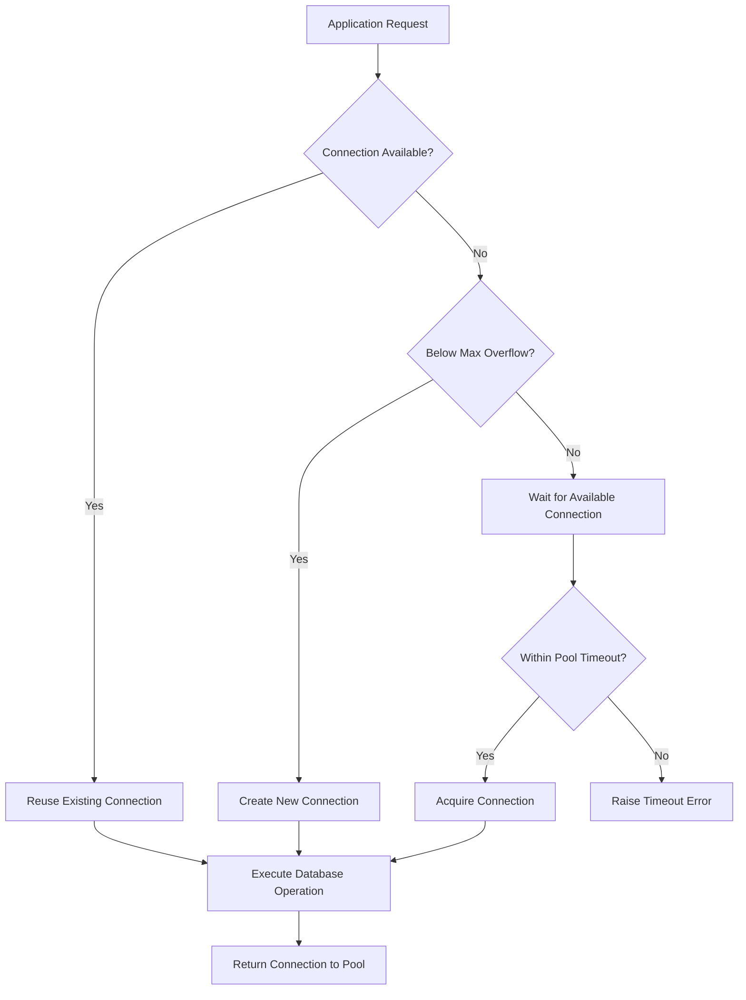
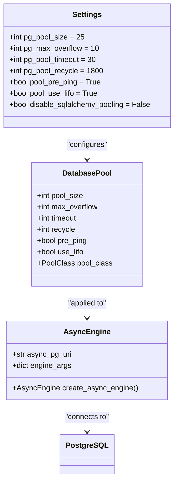
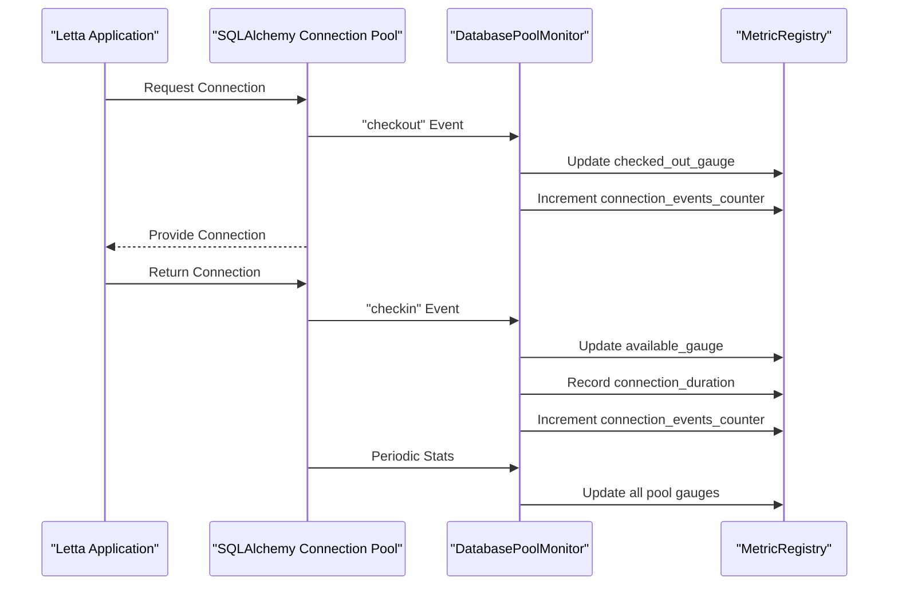

# Database Connection Pooling

<cite>
**Referenced Files in This Document**   
- [settings.py](file://letta/settings.py)
- [server/db.py](file://letta/server/db.py)
- [otel/db_pool_monitoring.py](file://letta/otel/db_pool_monitoring.py)
- [otel/metric_registry.py](file://letta/otel/metric_registry.py)
</cite>

## Table of Contents
1. [Introduction](#introduction)
2. [Connection Pool Configuration](#connection-pool-configuration)
3. [SQLAlchemy Pool Settings](#sqlalchemy-pool-settings)
4. [Database Pool Monitoring](#database-pool-monitoring)
5. [Performance Tuning Guidelines](#performance-tuning-guidelines)
6. [Troubleshooting Common Issues](#troubleshooting-common-issues)
7. [Conclusion](#conclusion)

## Introduction
Letta implements a robust database connection pooling system for PostgreSQL to efficiently manage database connections and optimize application performance under varying loads. The system leverages SQLAlchemy's connection pooling capabilities with comprehensive monitoring through OpenTelemetry (OTEL) to provide visibility into connection pool behavior. This documentation details the configuration parameters, monitoring capabilities, and best practices for tuning the connection pool settings to ensure optimal performance, resource utilization, and connection stability.

The connection pooling system is designed to balance the need for efficient connection reuse with the prevention of connection exhaustion and timeouts. By configuring appropriate pool sizes, timeouts, and recycling policies, administrators can ensure that Letta applications maintain stable database connectivity even under high concurrency scenarios.

**Section sources**
- [settings.py](file://letta/settings.py#L256-L265)
- [server/db.py](file://letta/server/db.py#L20-L37)

## Connection Pool Configuration
Letta's database connection pool is configured through the Settings class, which exposes several key parameters that control the behavior of the connection pool. These settings are defined as Pydantic model fields and can be configured through environment variables or directly in the settings file.

The primary connection pool settings include:

- **pg_pool_size**: The number of connections to maintain in the pool when idle. This represents the minimum number of connections that will be kept open and ready for use.
- **pg_max_overflow**: The maximum number of connections that can be created beyond the pool_size during periods of high demand.
- **pg_pool_timeout**: The number of seconds to wait before giving up on getting a connection from the pool.
- **pg_pool_recycle**: The number of seconds after which connections are recycled to prevent staleness.

These settings work together to create a dynamic pool that can scale up during peak loads and scale down during periods of low activity. The default configuration establishes a pool with 25 concurrent connections and allows up to 10 overflow connections, providing a total capacity of 35 simultaneous database connections.



**Diagram sources **
- [settings.py](file://letta/settings.py#L256-L259)
- [server/db.py](file://letta/server/db.py#L30-L36)

**Section sources**
- [settings.py](file://letta/settings.py#L256-L259)

## SQLAlchemy Pool Settings
Letta configures SQLAlchemy's connection pool with additional parameters that enhance connection reliability and efficiency. These settings are applied when creating the AsyncEngine and are critical for maintaining stable database connectivity in production environments.

### Connection Health Checking
The **pool_pre_ping** setting is enabled by default, which causes SQLAlchemy to issue a lightweight "ping" command to the database before using a connection from the pool. This ensures that stale or broken connections are detected and replaced before they can cause application errors. This feature is particularly important in cloud environments where network connections may be terminated unexpectedly.

### Efficient Connection Reuse
The **pool_use_lifo** setting implements a Last-In-First-Out strategy for connection reuse. When enabled, the most recently returned connections are the first to be reused. This approach improves connection reuse efficiency by keeping frequently used connections "warm" and reducing the overhead of establishing new connections.

### Pooling Strategy
Letta supports both connection pooling and direct connections through the **disable_sqlalchemy_pooling** setting. When disabled, SQLAlchemy's NullPool is used, which doesn't pool connections at all. Each connection is closed immediately when returned, and new connections are created for each request. This mode is typically used for testing or specific deployment scenarios where connection pooling is not desired.

The connection pool configuration is implemented in the server/db.py module, where the engine arguments are constructed based on the settings. When pooling is enabled, the configuration includes the pool size, maximum overflow, timeout, and recycle settings from the Settings class.



**Diagram sources **
- [settings.py](file://letta/settings.py#L260-L263)
- [server/db.py](file://letta/server/db.py#L20-L23)

**Section sources**
- [settings.py](file://letta/settings.py#L260-L263)
- [server/db.py](file://letta/server/db.py#L20-L46)

## Database Pool Monitoring
Letta provides comprehensive monitoring capabilities for the database connection pool through OpenTelemetry integration. When enabled, the system collects detailed metrics about pool usage, connection events, and performance characteristics, allowing administrators to gain insights into database connectivity patterns and identify potential bottlenecks.

### Monitoring Configuration
Database pool monitoring is controlled by two settings in the Settings class:

- **enable_db_pool_monitoring**: A boolean flag that enables or disables connection pool monitoring. This is enabled by default.
- **db_pool_monitoring_interval**: The interval in seconds between collection of pool statistics. The default value is 30 seconds.

When monitoring is enabled, the system sets up event listeners on the SQLAlchemy connection pool to capture various connection lifecycle events, including connection creation, checkout, checkin, invalidation, and closure.

### Collected Metrics
The monitoring system collects several key metrics that provide visibility into the health and performance of the connection pool:

- **gauge_db_pool_connections_checked_out**: The number of connections currently checked out from the pool.
- **gauge_db_pool_connections_available**: The number of available connections in the pool.
- **gauge_db_pool_connections_overflow**: The number of overflow connections in the pool.
- **hist_db_pool_connection_duration_ms**: The duration of database connection usage in milliseconds.
- **count_db_pool_connection_events**: A counter for various connection pool events (connect, checkout, checkin, invalidate).
- **count_db_pool_connection_errors**: A counter for connection pool errors.

These metrics are exposed through the OpenTelemetry metric registry and can be exported to various monitoring backends for visualization and alerting.



**Diagram sources **
- [otel/db_pool_monitoring.py](file://letta/otel/db_pool_monitoring.py#L35-L242)
- [otel/metric_registry.py](file://letta/otel/metric_registry.py#L199-L275)

**Section sources**
- [settings.py](file://letta/settings.py#L307-L309)
- [otel/db_pool_monitoring.py](file://letta/otel/db_pool_monitoring.py#L16-L309)

## Performance Tuning Guidelines
Properly tuning the database connection pool parameters is essential for achieving optimal performance and stability. The ideal configuration depends on the specific deployment scale, workload characteristics, and database server capacity.

### Small-Scale Deployments
For development environments or small-scale deployments with low traffic:

- **pg_pool_size**: 5-10 connections
- **pg_max_overflow**: 5 connections
- **pg_pool_timeout**: 30 seconds
- **pg_pool_recycle**: 1800 seconds (30 minutes)

This configuration provides sufficient connections for typical usage while minimizing resource consumption.

### Medium-Scale Deployments
For production environments with moderate traffic:

- **pg_pool_size**: 25 connections (default)
- **pg_max_overflow**: 10 connections (default)
- **pg_pool_timeout**: 30 seconds (default)
- **pg_pool_recycle**: 1800 seconds (default)

The default settings are optimized for medium-scale deployments and should work well for most production scenarios.

### Large-Scale Deployments
For high-traffic production environments:

- **pg_pool_size**: 50-100 connections
- **pg_max_overflow**: 20-50 connections
- **pg_pool_timeout**: 15-20 seconds
- **pg_pool_recycle**: 900-1800 seconds

These settings allow the application to handle higher concurrency while maintaining reasonable response times during peak loads.

### Monitoring-Based Tuning
Administrators should monitor the collected metrics to identify potential issues and adjust settings accordingly:

- If **gauge_db_pool_connections_overflow** frequently shows high values, consider increasing **pg_max_overflow**.
- If connections are frequently timing out, reduce **pg_pool_timeout** or increase the pool size.
- If **hist_db_pool_connection_duration_ms** shows consistently high values, investigate database performance issues.
- If connections are being invalidated frequently, check network stability and database server health.

### Connection Pool Sizing Formula
A general guideline for determining the optimal pool size is:

```
Optimal Pool Size = (Maximum Concurrent Requests × Average Request Duration) / Average Database Operation Duration
```

This formula helps ensure that the pool is large enough to handle the expected load without creating excessive connections that could overwhelm the database server.

**Section sources**
- [settings.py](file://letta/settings.py#L256-L265)
- [otel/db_pool_monitoring.py](file://letta/otel/db_pool_monitoring.py#L199-L275)

## Troubleshooting Common Issues
### Connection Timeouts
Connection timeouts occur when the application cannot acquire a connection from the pool within the specified timeout period. This typically indicates that the pool is undersized for the current load.

**Symptoms:**
- Frequent "timeout" errors when accessing the database
- High values in the **gauge_db_pool_connections_overflow** metric
- Increasing values in the **count_db_pool_connection_events** counter with "checkout" events

**Solutions:**
1. Increase **pg_pool_size** to maintain more idle connections
2. Increase **pg_max_overflow** to allow more concurrent connections during peak loads
3. Reduce **pg_pool_timeout** to fail faster and allow the application to handle the error gracefully
4. Investigate and optimize slow database queries that may be holding connections longer than necessary

### Connection Exhaustion
Connection exhaustion occurs when the database server reaches its maximum connection limit, preventing new connections from being established.

**Symptoms:**
- "Too many connections" errors from the database
- High values in the **gauge_db_pool_connections_checked_out** metric approaching the total pool capacity
- Frequent connection creation and destruction

**Solutions:**
1. Reduce **pg_pool_size** and **pg_max_overflow** to stay within the database server's connection limits
2. Implement connection pooling at the database server level if possible
3. Optimize application code to release connections promptly
4. Increase the database server's maximum connection limit if resources permit

### Stale Connections
Stale connections occur when connections in the pool become invalid due to network issues or database server restarts.

**Symptoms:**
- Intermittent database errors on connection checkout
- High values in the **count_db_pool_connection_errors** counter
- Frequent "invalidate" events in the connection event logs

**Solutions:**
1. Ensure **pool_pre_ping** is enabled (default) to validate connections before use
2. Adjust **pg_pool_recycle** to a lower value to proactively recycle connections before they become stale
3. Monitor network stability between the application and database servers
4. Implement proper error handling to gracefully recover from connection errors

### Monitoring Configuration Issues
When database pool monitoring is not functioning as expected:

**Symptoms:**
- No pool metrics appearing in the monitoring system
- "Database pool monitoring initialized" log message not appearing
- Engine pool attribute warnings in the logs

**Solutions:**
1. Verify that **enable_db_pool_monitoring** is set to True
2. Check that the OpenTelemetry instrumentation is properly configured
3. Ensure that the database engine has a pool attribute (verify SQLAlchemy configuration)
4. Review the application startup logs for any errors related to monitoring setup

**Section sources**
- [settings.py](file://letta/settings.py#L256-L265)
- [otel/db_pool_monitoring.py](file://letta/otel/db_pool_monitoring.py#L23-L34)
- [otel/metric_registry.py](file://letta/otel/metric_registry.py#L199-L275)

## Conclusion
Letta's database connection pooling system provides a robust foundation for managing PostgreSQL connections efficiently. By leveraging SQLAlchemy's connection pooling capabilities with comprehensive OpenTelemetry monitoring, the system ensures stable database connectivity while providing valuable insights into connection usage patterns.

The key to optimal performance lies in properly configuring the pool settings based on the specific deployment requirements and workload characteristics. Administrators should monitor the provided metrics to identify potential bottlenecks and adjust the configuration accordingly.

For most deployments, the default settings provide a good starting point, but larger-scale applications may require tuning to handle higher concurrency. The monitoring capabilities enable data-driven decisions for capacity planning and performance optimization, ensuring that the database layer remains a reliable component of the overall system architecture.

By following the guidelines outlined in this documentation, administrators can ensure that Letta applications maintain efficient, stable, and scalable database connectivity under various load conditions.