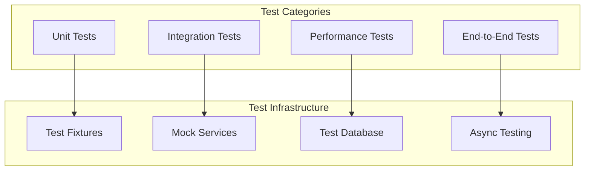
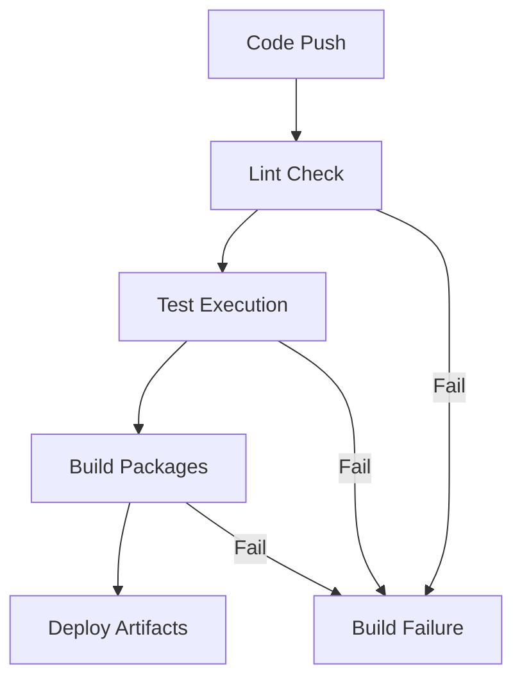

# Contributing Guidelines

<cite>
**Referenced Files in This Document**
- [CONTRIBUTING.md](file://CONTRIBUTING.md)
- [README.md](file://README.md)
- [pyproject.toml](file://pyproject.toml)
- [compose.yaml](file://compose.yaml)
- [dev-compose.yaml](file://dev-compose.yaml)
- [tests/conftest.py](file://tests/conftest.py)
- [tests/pytest.ini](file://tests/pytest.ini)
- [scripts/docker-compose.yml](file://scripts/docker-compose.yml)
- [alembic/env.py](file://alembic/env.py)
- [letta/settings.py](file://letta/settings.py)
- [letta/__init__.py](file://letta/__init__.py)
</cite>

## Table of Contents
1. [Introduction](#introduction)
2. [Getting Started](#getting-started)
3. [Development Environment Setup](#development-environment-setup)
4. [Code Contribution Process](#code-contribution-process)
5. [Coding Standards](#coding-standards)
6. [Testing Requirements](#testing-requirements)
7. [Database Migrations](#database-migrations)
8. [Documentation Requirements](#documentation-requirements)
9. [Release Process](#release-process)
10. [Community Support](#community-support)
11. [Common Contribution Patterns](#common-contribution-patterns)
12. [Troubleshooting](#troubleshooting)

## Introduction

Welcome to the Letta development community! Letta (formerly MemGPT) is an open-source platform for building stateful AI agents with advanced memory capabilities. This guide will help you contribute effectively to the project, whether you're fixing bugs, adding features, or improving documentation.

Letta enables the creation of AI agents that maintain persistent memory, learn from interactions, and self-improve over time. Our community welcomes contributions of all kinds, from code improvements to documentation enhancements and bug reports.

## Getting Started

### Prerequisites

Before contributing to Letta, ensure you have:

- **Python 3.11-3.13**: Compatible with the project's Python version requirements
- **uv**: Modern Python package and project manager (installation instructions in development setup)
- **Git**: For version control and repository management
- **Docker** (optional): For containerized development environments

### Repository Structure Overview

Letta follows a modular architecture organized into several key directories:

- **`letta/`**: Core application code and business logic
- **`tests/`**: Comprehensive test suite covering all major components
- **`alembic/`**: Database migration management
- **`scripts/`**: Deployment and utility scripts
- **`examples/`**: Sample code and demonstrations
- **`fern/`**: API documentation generation

**Section sources**
- [README.md](file://README.md#L1-L50)
- [pyproject.toml](file://pyproject.toml#L1-L20)

## Development Environment Setup

### Using uv for Package Management

Letta uses uv as its primary package manager, offering fast installation and dependency resolution:

```bash
# Install uv following official instructions
curl -LsSL https://astral.sh/uv/install.sh | sh

# Navigate to project directory
cd letta

# Activate virtual environment
eval $(uv env activate)

# Install all dependencies with extras
uv sync --all-extras
```

### Docker Compose Development Setup

For containerized development, Letta provides comprehensive Docker configurations:

```bash
# Start development environment with PostgreSQL
docker compose -f compose.yaml -f development.compose.yml up

# Access the server at http://localhost:8283
# Database accessible at localhost:5432
```

### Environment Configuration

Configure your development environment by setting appropriate environment variables:

```bash
# PostgreSQL configuration (if using external database)
export LETTA_PG_URI="postgresql://${POSTGRES_USER:-letta}:${POSTGRES_PASSWORD:-letta}@localhost:5432/${POSTGRES_DB:-letta}"

# API keys for various providers
export OPENAI_API_KEY="your-key-here"
export ANTHROPIC_API_KEY="your-key-here"
export GROQ_API_KEY="your-key-here"
```

### Pre-commit Hooks Setup

Install pre-commit hooks to maintain code quality:

```bash
# Install pre-commit
uv run pre-commit install

# Run all checks
uv run pre-commit run --all-files
```

**Section sources**
- [CONTRIBUTING.md](file://CONTRIBUTING.md#L22-L71)
- [compose.yaml](file://compose.yaml#L1-L66)
- [dev-compose.yaml](file://dev-compose.yaml#L1-L49)

## Code Contribution Process

### Branching Strategy

Letta follows a feature-based branching strategy:

1. **Fork the Repository**: Create your personal fork on GitHub
2. **Create Feature Branch**: Use descriptive branch names
   ```bash
   git checkout -b feature/add-new-tool-support
   git checkout -b fix/database-migration-issue
   git checkout -b enhancement/improved-error-handling
   ```
3. **Keep Branches Focused**: Each branch should address a single concern

### Pull Request Workflow

1. **Prepare Your Changes**: Ensure all tests pass and code is properly formatted
2. **Create Pull Request**: Target the `main` branch
3. **Provide Clear Description**: Explain the problem solved and solution approach
4. **Link Related Issues**: Reference any related GitHub issues
5. **Respond to Feedback**: Address reviewer comments promptly

### Commit Message Standards

Follow conventional commit format for clear version history:

```
type(scope): description

Detailed explanation of changes, including:
- What was changed and why
- Breaking changes (if any)
- Migration steps (if applicable)

Fixes #issue-number
```

Examples:
- `feat(tools): add support for new MCP server type`
- `fix(database): resolve migration conflict in agent table`
- `docs(api): update endpoint documentation for new features`

### Code Review Expectations

- **Quality Focus**: Code must be well-tested and documented
- **Architecture Alignment**: Changes should align with project design patterns
- **Backward Compatibility**: Maintain API compatibility when possible
- **Performance Impact**: Consider performance implications of changes

**Section sources**
- [CONTRIBUTING.md](file://CONTRIBUTING.md#L75-L139)

## Coding Standards

### Python Style Guidelines

Letta enforces strict Python coding standards using Ruff:

#### Formatting Requirements
- **Line Length**: Maximum 140 characters
- **Indentation**: 4 spaces (no tabs)
- **Quotes**: Double quotes for strings
- **Imports**: Automatic sorting with isort

#### Type Hints and Annotations

All public functions must include comprehensive type hints:

```python
from typing import Optional, List, Dict, Any
from letta.schemas import AgentState, Message

def create_agent(
    name: str,
    model: str,
    memory_blocks: Optional[List[Dict[str, Any]]] = None,
    tools: Optional[List[str]] = None
) -> AgentState:
    """Create a new agent with specified configuration."""
    pass
```

#### Documentation Standards

Follow Google Python style documentation format:

```python
def process_data(data: List[Dict[str, Any]], config: Dict[str, Any]) -> str:
    """Process input data according to configuration.

    Args:
        data: List of data dictionaries to process
        config: Configuration parameters for processing
        
    Returns:
        str: Processed result as string
        
    Raises:
        ValueError: If data format is invalid
        RuntimeError: If processing fails
    """
    pass
```

### Code Quality Tools

#### Ruff Configuration
Letta uses Ruff for linting and formatting enforcement:

```toml
[tool.ruff]
line-length = 140
target-version = "py312"
extend-exclude = ["examples/*", "tests/data/*"]

[tool.ruff.lint]
select = ["E", "W", "F", "I"]
ignore = ["E501", "E402", "E711", "E712", "E722", "E721", "F401", "F821", "F811", "F841", "W293"]
```

#### Black Formatting
Automatically format code using Black:

```bash
# Format all Python files
uv run black . -l 140

# Check formatting without modifying files
uv run black . -l 140 --check
```

**Section sources**
- [pyproject.toml](file://pyproject.toml#L164-L206)
- [CONTRIBUTING.md](file://CONTRIBUTING.md#L126-L129)

## Testing Requirements

### Test Structure and Organization

Letta maintains comprehensive test coverage across multiple categories:



**Diagram sources**
- [tests/conftest.py](file://tests/conftest.py#L1-L50)
- [tests/pytest.ini](file://tests/pytest.ini#L1-L19)

### Running Tests

Execute the complete test suite:

```bash
# Run all tests
uv run pytest -s tests

# Run specific test category
uv run pytest -s tests/managers/
uv run pytest -s tests/integration_test_*.py

# Run with coverage
uv run pytest --cov=letta tests/
```

### Writing New Tests

#### Test Fixture Patterns

Use pytest fixtures for consistent test setup:

```python
@pytest.fixture
def test_agent():
    """Create a test agent for testing."""
    # Setup code here
    agent = create_test_agent()
    yield agent
    # Teardown code here

@pytest.mark.asyncio
async def test_async_operation(test_agent):
    """Test asynchronous operations."""
    result = await async_operation(test_agent)
    assert result is not None
```

#### Database Test Isolation

Each test runs in isolation with automatic cleanup:

```python
@pytest.fixture(autouse=True)
async def cleanup_db_connections():
    """Cleanup database connections after each test."""
    yield
    # Cleanup logic here
```

### Test Categories

#### Manager Tests
Test core business logic components:

```bash
tests/managers/test_agent_manager.py
tests/managers/test_tool_manager.py
tests/managers/test_user_manager.py
```

#### Integration Tests
Verify component interactions:

```bash
tests/integration_test_*.py
tests/integration_test_multi_agent.py
tests/integration_test_tool_execution_sandbox.py
```

#### Performance Tests
Monitor system performance:

```bash
tests/performance_tests/test_agent_mass_creation.py
tests/performance_tests/test_insert_archival_memory.py
```

**Section sources**
- [tests/conftest.py](file://tests/conftest.py#L1-L333)
- [tests/pytest.ini](file://tests/pytest.ini#L1-L19)
- [CONTRIBUTING.md](file://CONTRIBUTING.md#L102-L121)

## Database Migrations

### Migration Workflow

Letta uses Alembic for database schema management:

#### Creating Migrations
When modifying database models, create automatic migrations:

```bash
# Generate migration with autogenerate
uv run alembic revision --autogenerate -m "Add new agent field"

# Review generated migration in alembic/versions/
```

#### Applying Migrations
Deploy schema changes to databases:

```bash
# Apply latest migration
uv run alembic upgrade head

# Rollback last migration
uv run alembic downgrade -1
```

### Migration Best Practices

#### Safe Migration Patterns
- **Always backup data** before applying migrations
- **Test migrations** in development environment first
- **Maintain backward compatibility** when possible
- **Document breaking changes** in migration comments

#### Migration Template Example
```python
def upgrade() -> None:
    """Add new column with default value."""
    op.add_column("agents", sa.Column("new_field", sa.String(), nullable=True))
    # Add data migration logic here
    op.execute("UPDATE agents SET new_field = 'default_value'")
    op.alter_column("agents", "new_field", nullable=False)

def downgrade() -> None:
    """Remove the column."""
    op.drop_column("agents", "new_field")
```

**Section sources**
- [CONTRIBUTING.md](file://CONTRIBUTING.md#L88-L101)
- [alembic/env.py](file://alembic/env.py#L1-L94)

## Documentation Requirements

### Code Documentation Standards

#### Function Documentation
All public functions must include comprehensive docstrings:

```python
def create_agent(
    name: str,
    model: str,
    memory_blocks: Optional[List[Dict[str, Any]]] = None,
    tools: Optional[List[str]] = None
) -> AgentState:
    """Create a new agent with specified configuration.

    Args:
        name: Human-readable name for the agent
        model: LLM model identifier (e.g., "openai/gpt-4")
        memory_blocks: Initial memory blocks for agent
        tools: List of tool names to attach to agent
        
    Returns:
        AgentState: Created agent with unique identifier
        
    Raises:
        ValueError: If required parameters are invalid
        RuntimeError: If agent creation fails
    """
    pass
```

#### Class Documentation
Document classes with purpose, attributes, and methods:

```python
class AgentManager:
    """Manages agent lifecycle and persistence operations.

    Attributes:
        db: Database connection for agent storage
        cache: In-memory cache for frequently accessed agents
        
    Methods:
        create_agent(): Create new agent instance
        get_agent(): Retrieve agent by ID
        update_agent(): Modify existing agent
        delete_agent(): Remove agent from system
    """
    pass
```

### API Documentation

#### OpenAPI Schema Generation
Letta generates OpenAPI schemas automatically:

```bash
# Generate OpenAPI schema
uv run python -m letta.server.generate_openapi_schema.sh
```

#### Endpoint Documentation
Document REST API endpoints with:
- HTTP method and URL pattern
- Request parameters and body schema
- Response format and status codes
- Authentication requirements

### Release Notes

#### Change Documentation
Document significant changes in release notes:

```markdown
## Features
- Added support for new MCP server types
- Enhanced tool execution sandbox capabilities

## Bug Fixes
- Resolved database migration conflicts
- Fixed memory leak in agent serialization

## Breaking Changes
- Removed deprecated agent configuration options
- Changed tool execution timeout defaults
```

**Section sources**
- [letta/functions/schema_generator.py](file://letta/functions/schema_generator.py#L36-L59)
- [letta/schemas/tool.py](file://letta/schemas/tool.py#L50-L74)

## Release Process

### Versioning Strategy

Letta follows semantic versioning (SemVer):

- **Major Version**: Breaking changes or significant architectural updates
- **Minor Version**: New features and backward-compatible improvements
- **Patch Version**: Bug fixes and minor improvements

Current version: `0.15.0` (as of latest release)

### Release Workflow

#### Pre-release Preparation
1. **Update Version**: Modify version in `pyproject.toml`
2. **Update Changelog**: Document all changes since last release
3. **Run Tests**: Ensure all tests pass
4. **Update Dependencies**: Check for security updates

#### Release Creation
```bash
# Build distribution packages
uv build

# Upload to PyPI (maintainers only)
uv publish
```

#### Post-release Activities
1. **Tag Release**: Create Git tag for release
2. **Update Documentation**: Deploy updated docs
3. **Announce Release**: Notify community via Discord and GitHub

### Continuous Integration

Letta uses automated CI/CD for quality assurance:



**Diagram sources**
- [pyproject.toml](file://pyproject.toml#L156-L162)

**Section sources**
- [letta/__init__.py](file://letta/__init__.py#L1-L42)
- [pyproject.toml](file://pyproject.toml#L3-L4)

## Community Support

### Communication Channels

#### Primary Support Channels
- **GitHub Discussions**: Technical questions and feature discussions
- **Discord Server**: Real-time community chat and developer support
- **Issue Tracker**: Bug reports and feature requests

#### Getting Help

1. **Search Existing Issues**: Check if your question has been answered
2. **Create Issue**: Report bugs or request features
3. **Join Discord**: Connect with developers and other contributors
4. **Review Documentation**: Check official docs for guidance

### Code of Conduct

Letta maintains a welcoming and inclusive community:

- **Be Respectful**: Treat all community members with respect
- **Be Collaborative**: Work together constructively
- **Be Patient**: Help newcomers learn and grow
- **Focus on Solutions**: Propose constructive feedback

### Recognition and Attribution

Contributors are recognized through:

- **Pull Request Authors**: Listed in release notes
- **Documentation Contributors**: Acknowledged in documentation
- **Community Leaders**: Featured in community communications

**Section sources**
- [CONTRIBUTING.md](file://CONTRIBUTING.md#L149-L151)
- [README.md](file://README.md#L514-L523)

## Common Contribution Patterns

### Adding New Features

#### Tool Development Pattern
1. **Define Tool Interface**: Create tool schema and validation
2. **Implement Tool Logic**: Write core functionality
3. **Add Testing**: Create comprehensive test cases
4. **Update Documentation**: Document tool usage and parameters

#### API Extension Pattern
1. **Define Schema**: Create request/response models
2. **Implement Handler**: Add REST API endpoint
3. **Add Middleware**: Implement authentication and validation
4. **Write Tests**: Test API endpoints and edge cases

### Bug Fix Patterns

#### Debugging Approach
1. **Reproduce Issue**: Create minimal reproduction case
2. **Identify Root Cause**: Trace through code execution
3. **Implement Fix**: Apply targeted solution
4. **Add Regression Test**: Prevent future occurrences

#### Performance Improvement Pattern
1. **Profile Code**: Identify bottlenecks
2. **Optimize Algorithms**: Improve time/space complexity
3. **Add Benchmarks**: Measure performance impact
4. **Document Trade-offs**: Explain optimization decisions

### Architecture Enhancement Patterns

#### Modularization Pattern
1. **Identify Coupling**: Find tightly coupled components
2. **Define Interfaces**: Create clear abstraction boundaries
3. **Refactor Gradually**: Make incremental improvements
4. **Maintain Compatibility**: Preserve existing APIs

#### Testing Enhancement Pattern
1. **Identify Coverage Gaps**: Find untested code paths
2. **Create Test Scenarios**: Design comprehensive test cases
3. **Implement Fixtures**: Create reusable test infrastructure
4. **Add Monitoring**: Track test reliability over time

**Section sources**
- [letta/services/tool_executor/core_tool_executor.py](file://letta/services/tool_executor/core_tool_executor.py#L429-L476)
- [letta/functions/function_sets/base.py](file://letta/functions/function_sets/base.py#L323-L500)

## Troubleshooting

### Common Development Issues

#### Dependency Conflicts
```bash
# Clear uv cache and reinstall
uv sync --force-clean

# Check dependency tree
uv tree
```

#### Database Connection Issues
```bash
# Verify PostgreSQL is running
docker ps | grep postgres

# Check connection string
echo $LETTA_PG_URI

# Test database connectivity
psql "$LETTA_PG_URI" -c "SELECT 1;"
```

#### Test Failures
```bash
# Run specific failing test
uv run pytest tests/path/to/failing_test.py::test_name

# Enable verbose output
uv run pytest -s -v tests/

# Check test environment
uv run python -c "import letta; print(letta.__version__)"
```

### Environment Setup Issues

#### Docker Problems
```bash
# Rebuild containers
docker compose down
docker compose up --build

# Check container logs
docker compose logs letta_server
docker compose logs letta_db
```

#### uv Installation Issues
```bash
# Update uv
curl -LsSL https://astral.sh/uv/install.sh | sh

# Reset virtual environment
rm -rf .venv
uv sync --all-extras
```

### Performance Issues

#### Slow Test Execution
- **Database Connections**: Check connection pooling settings
- **Fixture Overhead**: Optimize test setup/teardown
- **Parallel Execution**: Use pytest-xdist for parallel tests

#### Memory Usage
- **Connection Cleanup**: Ensure proper database connection disposal
- **Resource Management**: Close file handles and network connections
- **Garbage Collection**: Monitor object lifecycle

### Getting Additional Help

When facing issues:

1. **Check Documentation**: Review relevant sections
2. **Search Issues**: Look for similar problems reported
3. **Ask in Discord**: Get real-time community assistance
4. **Create Issue**: Report bugs with detailed information
5. **Provide Context**: Include error messages and reproduction steps

**Section sources**
- [tests/conftest.py](file://tests/conftest.py#L79-L110)
- [CONTRIBUTING.md](file://CONTRIBUTING.md#L155-L161)