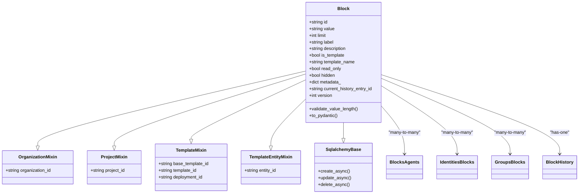
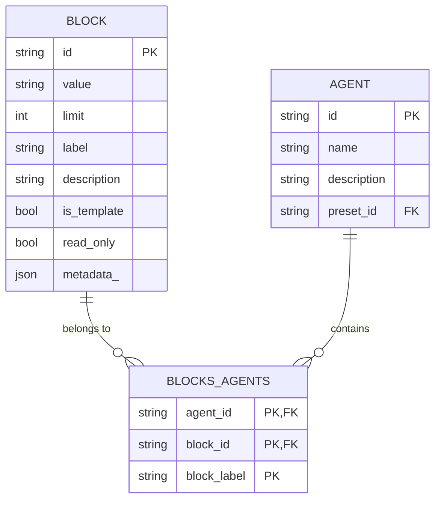
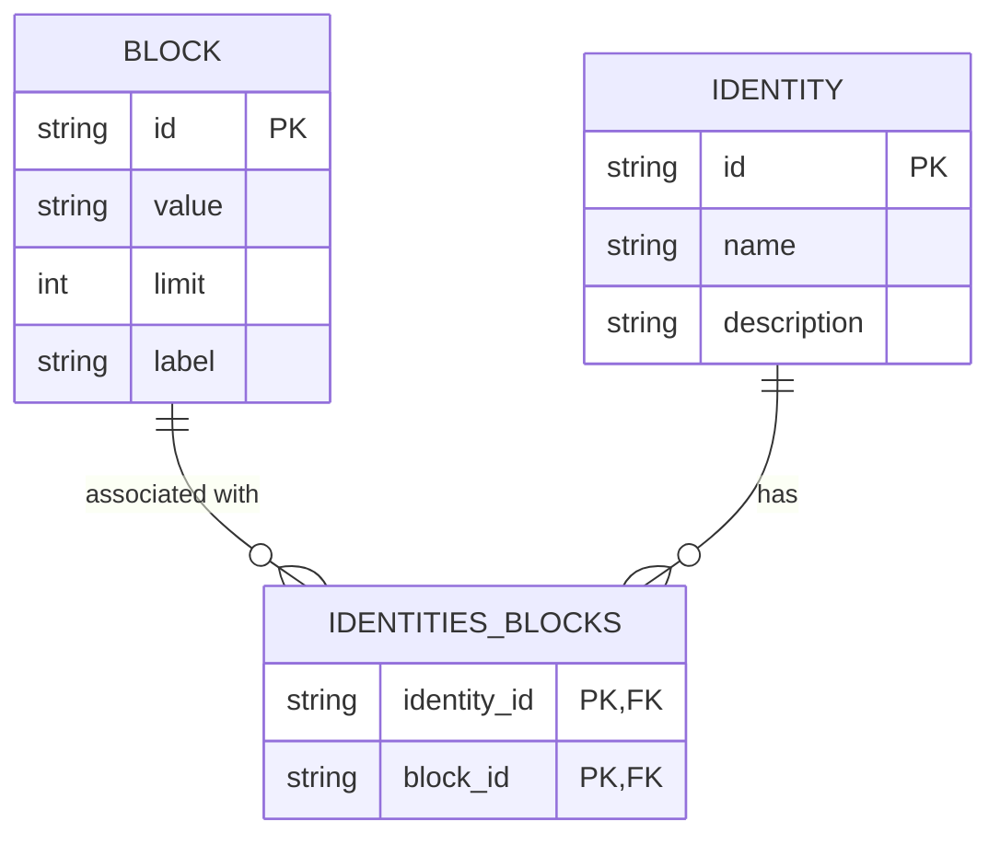
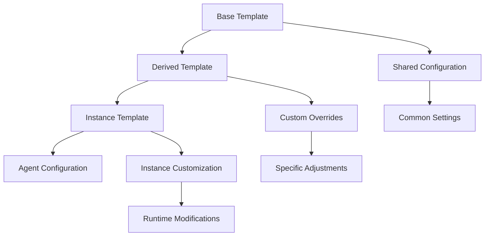
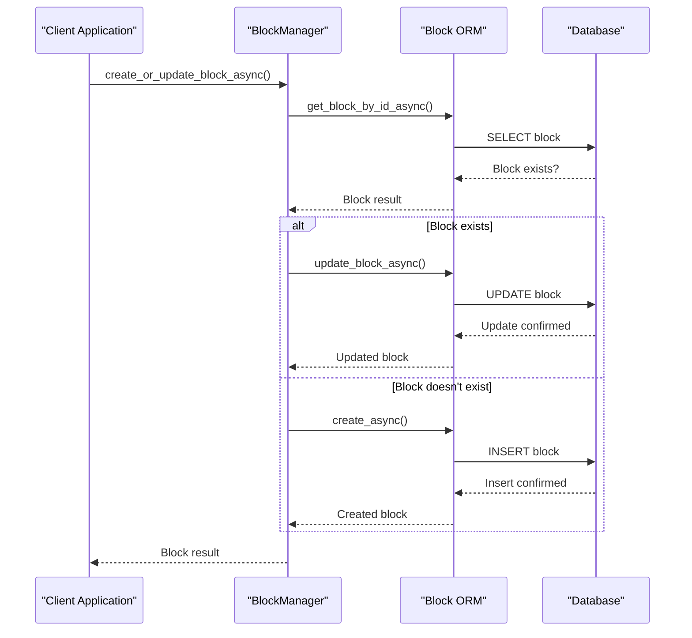
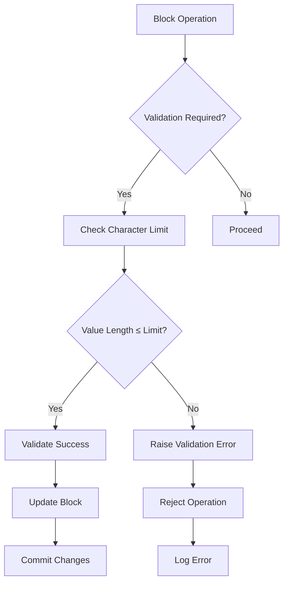

# Block Model

<cite>
**Referenced Files in This Document**
- [letta/orm/block.py](file://letta/orm/block.py)
- [letta/schemas/block.py](file://letta/schemas/block.py)
- [letta/orm/blocks_agents.py](file://letta/orm/blocks_agents.py)
- [letta/orm/identities_blocks.py](file://letta/orm/identities_blocks.py)
- [letta/services/block_manager.py](file://letta/services/block_manager.py)
- [letta/orm/mixins.py](file://letta/orm/mixins.py)
- [letta/constants.py](file://letta/constants.py)
- [alembic/versions/1dc0fee72dea_add_block_related_indexes.py](file://alembic/versions/1dc0fee72dea_add_block_related_indexes.py)
- [alembic/versions/d5103ee17ed5_add_template_fields_to_blocks_agents_.py](file://alembic/versions/d5103ee17ed5_add_template_fields_to_blocks_agents_.py)
- [tests/managers/test_block_manager.py](file://tests/managers/test_block_manager.py)
</cite>

## Table of Contents
1. [Introduction](#introduction)
2. [Block Model Architecture](#block-model-architecture)
3. [Core Fields and Data Types](#core-fields-and-data-types)
4. [Relationships and Associations](#relationships-and-associations)
5. [Template Blocks](#template-blocks)
6. [Indexing Strategies](#indexing-strategies)
7. [ORM Operations and Management](#orm-operations-and-management)
8. [Validation and Constraints](#validation-and-constraints)
9. [Performance Considerations](#performance-considerations)
10. [Usage Examples](#usage-examples)
11. [Troubleshooting](#troubleshooting)

## Introduction

The Block data model represents memory units in Letta that serve as sections of the LLM context, encapsulating specific parts of an agent's core memory. Blocks are fundamental components that store textual content with associated metadata, character limits, and access controls. They form the building blocks of agent memory systems, enabling sophisticated memory management, templating, and versioning capabilities.

Each Block represents a discrete memory segment with a specific label (e.g., "human", "persona", "system") that defines its role in the agent's memory architecture. Blocks can be either regular memory blocks or template blocks that serve as reusable configurations for agent initialization.

## Block Model Architecture

The Block model is implemented as a SQLAlchemy ORM class with comprehensive inheritance from multiple mixin classes that provide organizational, project, and template functionality.



**Diagram sources**
- [letta/orm/block.py](file://letta/orm/block.py#L18-L118)
- [letta/orm/mixins.py](file://letta/orm/mixins.py#L83-L99)

**Section sources**
- [letta/orm/block.py](file://letta/orm/block.py#L18-L118)
- [letta/orm/mixins.py](file://letta/orm/mixins.py#L19-L99)

## Core Fields and Data Types

### Essential Block Properties

| Field | Type | Description | Validation Rules |
|-------|------|-------------|------------------|
| `id` | String | Unique identifier for the block | UUID format, automatically generated |
| `value` | String | Text content stored in the block | Character limit enforced, required |
| `limit` | BigInteger | Maximum character capacity | Must be ≥ current value length |
| `label` | String | Memory block type identifier | Required, determines block role |
| `description` | String | Human-readable description | Optional, provides context |
| `is_template` | Boolean | Template block indicator | Default: false |

### Access Control and Metadata

| Field | Type | Description | Default Value |
|-------|------|-------------|---------------|
| `read_only` | Boolean | Agent read-only access flag | false |
| `hidden` | Boolean | Visibility control | null |
| `metadata_` | JSON | Arbitrary block metadata | {} |
| `preserve_on_migration` | Boolean | Template migration preservation | false |

### Versioning and History

| Field | Type | Purpose | Implementation |
|-------|------|---------|----------------|
| `version` | Integer | Optimistic locking counter | Auto-incremented on updates |
| `current_history_entry_id` | String | Current checkpoint reference | Foreign key to BlockHistory |

**Section sources**
- [letta/orm/block.py](file://letta/orm/block.py#L33-L56)
- [letta/schemas/block.py](file://letta/schemas/block.py#L18-L44)

## Relationships and Associations

### Many-to-Many Relationships

The Block model participates in several many-to-many relationships that define how blocks connect to other entities in the system.

#### Blocks and Agents Relationship



**Diagram sources**
- [letta/orm/blocks_agents.py](file://letta/orm/blocks_agents.py#L7-L35)

The `blocks_agents` association table maintains the many-to-many relationship between blocks and agents, with additional constraints ensuring that each agent can only have one block per label type. This prevents conflicts when multiple blocks of the same type are attached to a single agent.

#### Blocks and Identities Relationship



**Diagram sources**
- [letta/orm/identities_blocks.py](file://letta/orm/identities_blocks.py#L7-L14)

This relationship enables blocks to be shared across different identities, supporting scenarios where multiple personas or user profiles need access to the same memory content.

**Section sources**
- [letta/orm/blocks_agents.py](file://letta/orm/blocks_agents.py#L7-L35)
- [letta/orm/identities_blocks.py](file://letta/orm/identities_blocks.py#L7-L14)

## Template Blocks

Template blocks serve as reusable configurations that can be instantiated for agent initialization or reused across different contexts. They provide a foundation for consistent memory setups while allowing for customization.

### Template Block Characteristics

Template blocks inherit additional fields for template management:

| Field | Purpose | Usage Context |
|-------|---------|---------------|
| `base_template_id` | Reference to original template | Template inheritance chain |
| `template_id` | Specific template instance identifier | Individual template identification |
| `deployment_id` | Deployment-specific template reference | Environment-specific configurations |
| `entity_id` | Entity-specific template variation | Instance-level customization |

### Template Creation and Management

Template blocks are created using specialized schemas that extend the base Block schema with template-specific fields. The system supports hierarchical template inheritance, where derived templates can override specific aspects of parent templates while preserving common configurations.



**Section sources**
- [letta/schemas/block.py](file://letta/schemas/block.py#L200-L208)
- [alembic/versions/d5103ee17ed5_add_template_fields_to_blocks_agents_.py](file://alembic/versions/d5103ee17ed5_add_template_fields_to_blocks_agents_.py#L22-L33)

## Indexing Strategies

The Block model implements comprehensive indexing strategies to optimize query performance across various access patterns.

### Primary Indexes

The Block table defines several strategic indexes for optimal query performance:

| Index Name | Columns | Purpose | Performance Impact |
|------------|---------|---------|-------------------|
| `ix_block_is_template` | `is_template` | Template filtering optimization | Fast template vs. regular block queries |
| `ix_block_hidden` | `hidden` | Visibility filtering | Efficient access control queries |
| `ix_block_org_project_template` | `organization_id`, `project_id`, `is_template` | Hierarchical filtering | Optimal organization/project queries |
| `ix_block_organization_id_deployment_id` | `organization_id`, `deployment_id` | Deployment-scoped queries | Fast deployment-based filtering |

### Association Table Indexes

The `blocks_agents` table includes specialized indexes for common query patterns:

| Index Name | Columns | Purpose | Query Pattern |
|------------|---------|---------|---------------|
| `ix_blocks_agents_block_label_agent_id` | `block_label`, `agent_id` | Agent-block relationship queries | Fast agent memory retrieval |
| `ix_blocks_block_label` | `block_label` | Block type filtering | Efficient block type queries |

### Search and Filtering Optimization

The system supports various search and filtering operations optimized through strategic indexing:

- **Text Search**: Full-text search capabilities for block content and descriptions
- **Character Limit Queries**: Efficient filtering by character limits and usage percentages
- **Template Queries**: Fast identification of template versus regular blocks
- **Visibility Control**: Optimized queries for hidden versus visible blocks

**Section sources**
- [letta/orm/block.py](file://letta/orm/block.py#L26-L30)
- [alembic/versions/1dc0fee72dea_add_block_related_indexes.py](file://alembic/versions/1dc0fee72dea_add_block_related_indexes.py#L26-L33)

## ORM Operations and Management

### Block Manager Operations

The BlockManager class provides comprehensive CRUD operations and advanced management functionality for Block entities.

#### Core Operations



**Diagram sources**
- [letta/services/block_manager.py](file://letta/services/block_manager.py#L88-L104)

#### Advanced Features

The BlockManager supports sophisticated operations including:

- **Bulk Operations**: Efficient batch creation and updates of multiple blocks
- **Checkpoint System**: Version control with undo/redo capabilities
- **Concurrent Access**: Optimistic locking for safe concurrent modifications
- **Template Management**: Specialized operations for template blocks

### Relationship Management

Block relationships are managed through dedicated methods that ensure referential integrity and constraint enforcement:

- **Agent Attachment**: Attaching blocks to agents with label uniqueness validation
- **Identity Association**: Linking blocks to identities for shared access
- **Bulk Updates**: Coordinated updates across related entities

**Section sources**
- [letta/services/block_manager.py](file://letta/services/block_manager.py#L88-L104)
- [letta/services/block_manager.py](file://letta/services/block_manager.py#L106-L134)

## Validation and Constraints

### Character Limit Validation

The Block model implements comprehensive validation to maintain data integrity and prevent content overflow:



**Diagram sources**
- [letta/orm/block.py](file://letta/orm/block.py#L110-L118)

### Constraint Enforcement

The system enforces several critical constraints:

| Constraint Type | Enforcement Point | Purpose |
|-----------------|-------------------|---------|
| Character Limit | ORM level | Prevent content overflow |
| Label Uniqueness | Database constraint | Prevent duplicate agent-block combinations |
| Template Integrity | Business logic | Maintain template hierarchies |
| Access Control | Permission system | Enforce visibility restrictions |

### Event-Driven Validation

The Block model uses SQLAlchemy events for automatic validation:

- **Before Insert/Update**: Character limit verification
- **Relationship Changes**: Constraint validation
- **Template Operations**: Template-specific validation rules

**Section sources**
- [letta/orm/block.py](file://letta/orm/block.py#L110-L118)
- [letta/services/block_manager.py](file://letta/services/block_manager.py#L28-L60)

## Performance Considerations

### Query Optimization Strategies

For applications managing large numbers of blocks, several optimization strategies are recommended:

#### Index Utilization

- **Composite Indexes**: Leverage multi-column indexes for complex queries
- **Covering Indexes**: Include frequently accessed columns in index definitions
- **Selective Filtering**: Use appropriate indexes for filtering operations

#### Memory Management

- **Lazy Loading**: Configure relationship loading strategies to minimize memory usage
- **Batch Operations**: Use bulk operations for large-scale modifications
- **Connection Pooling**: Implement efficient database connection management

#### Search Performance

The system implements several search optimization techniques:

- **Full-Text Search**: Optimized text search capabilities for block content
- **Vector Similarity**: Efficient similarity search for embedding-based queries
- **Pagination**: Cursor-based pagination for large result sets

### Scalability Patterns

For high-volume deployments, consider these scalability approaches:

- **Partitioning**: Database partitioning for large datasets
- **Caching**: Intelligent caching of frequently accessed blocks
- **Asynchronous Processing**: Background processing for heavy operations

**Section sources**
- [letta/services/block_manager.py](file://letta/services/block_manager.py#L172-L354)

## Usage Examples

### Creating and Managing Blocks

Here are practical examples of common Block operations:

#### Basic Block Creation

```python
# Create a new block
block_data = {
    "label": "persona",
    "value": "You are a helpful AI assistant.",
    "limit": 1000,
    "description": "Assistant persona definition"
}

# Using BlockManager
block = await block_manager.create_or_update_block_async(
    PydanticBlock(**block_data), 
    actor=user
)
```

#### Template Block Management

```python
# Create template block
template_data = {
    "label": "human",
    "value": "User: {{username}}",
    "is_template": True,
    "template_name": "default_human"
}

# Create with template fields
template_block = await block_manager.create_or_update_block_async(
    InternalTemplateBlockCreate(**template_data),
    actor=user
)
```

#### Agent Memory Assignment

```python
# Attach block to agent
await agent_manager.attach_block_async(
    agent_id=agent.id,
    block_id=block.id,
    actor=user
)

# Detach block from agent
await agent_manager.detach_block_async(
    agent_id=agent.id,
    block_id=block.id,
    actor=user
)
```

### Advanced Operations

#### Bulk Block Updates

```python
# Prepare bulk updates
updates = {
    "block_id_1": "New content for block 1",
    "block_id_2": "New content for block 2"
}

# Perform bulk update
await block_manager.bulk_update_block_values_async(
    updates=updates,
    actor=user,
    return_hydrated=True
)
```

#### Version Control Operations

```python
# Create checkpoint
checkpoint = await block_manager.checkpoint_block_async(
    block_id=block.id,
    actor=user
)

# Undo to previous state
previous_state = await block_manager.undo_checkpoint_block(
    block_id=block.id,
    actor=user
)

# Redo to later state
latest_state = await block_manager.redo_checkpoint_block(
    block_id=block.id,
    actor=user
)
```

**Section sources**
- [tests/managers/test_block_manager.py](file://tests/managers/test_block_manager.py#L109-L178)
- [letta/services/block_manager.py](file://letta/services/block_manager.py#L558-L600)

## Troubleshooting

### Common Issues and Solutions

#### Character Limit Violations

**Problem**: Attempting to set block value exceeding character limit
**Solution**: Ensure value length ≤ limit before assignment

```python
# Validation error prevention
if len(new_value) > block.limit:
    raise ValueError(f"Value exceeds limit of {block.limit} characters")
```

#### Template Migration Conflicts

**Problem**: Template blocks not preserving on migration
**Solution**: Set `preserve_on_migration=True` for critical templates

#### Concurrent Access Issues

**Problem**: Stale data errors during concurrent updates
**Solution**: Use optimistic locking and retry mechanisms

```python
try:
    # Attempt operation with preloaded block
    result = await block_manager.update_block_async(
        block_id=block.id,
        block_update=update_data,
        actor=user,
        use_preloaded_block=preloaded_block
    )
except StaleDataError:
    # Retry with fresh data
    refreshed_block = await block_manager.get_block_by_id_async(block.id, user)
    result = await block_manager.update_block_async(
        block_id=block.id,
        block_update=update_data,
        actor=user,
        use_preloaded_block=refreshed_block
    )
```

### Debugging Tools

#### Block State Inspection

Monitor block state changes and version history:

```python
# Check block version and history
block = await block_manager.get_block_by_id_async(block_id, user)
print(f"Version: {block.version}")
print(f"Current History: {block.current_history_entry_id}")
```

#### Relationship Validation

Verify block-agent relationships:

```python
# List agents using specific block
agents = await block_manager.get_agents_for_block_async(
    block_id=block.id,
    actor=user
)
print(f"Agents using block: {len(agents)}")
```

**Section sources**
- [letta/services/block_manager.py](file://letta/services/block_manager.py#L630-L674)
- [tests/managers/test_block_manager.py](file://tests/managers/test_block_manager.py#L109-L178)