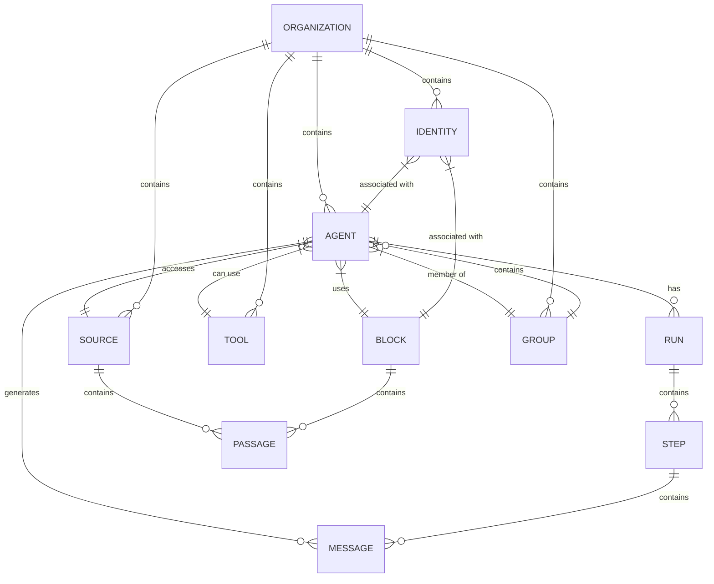

# Data Models & ORM

<cite>
**Referenced Files in This Document**   
- [agent.py](file://letta/orm/agent.py)
- [block.py](file://letta/orm/block.py)
- [message.py](file://letta/orm/message.py)
- [tool.py](file://letta/orm/tool.py)
- [source.py](file://letta/orm/source.py)
- [run.py](file://letta/orm/run.py)
- [step.py](file://letta/orm/step.py)
- [passage.py](file://letta/orm/passage.py)
- [group.py](file://letta/orm/group.py)
- [identity.py](file://letta/orm/identity.py)
- [sqlalchemy_base.py](file://letta/orm/sqlalchemy_base.py)
- [base.py](file://letta/orm/base.py)
- [custom_columns.py](file://letta/orm/custom_columns.py)
- [mixins.py](file://letta/orm/mixins.py)
</cite>

## Table of Contents
1. [Introduction](#introduction)
2. [Core Data Models](#core-data-models)
3. [Entity Relationships](#entity-relationships)
4. [Database Schema Diagram](#database-schema-diagram)
5. [Field Definitions and Constraints](#field-definitions-and-constraints)
6. [ORM-Level Business Logic](#orm-level-business-logic)
7. [Data Access Patterns](#data-access-patterns)
8. [Query Optimization](#query-optimization)
9. [Migration Strategy](#migration-strategy)
10. [Conclusion](#conclusion)

## Introduction

The Letta database schema is designed to support a sophisticated agent-based system with rich relationships between agents, their memory blocks, messages, tools, data sources, and execution runs. The schema follows a relational model with proper normalization and uses SQLAlchemy as the ORM layer to provide a Pythonic interface to the database.

The core entities in the system are:
- **Agent**: Represents an autonomous agent with configuration, memory, and capabilities
- **Block**: Represents sections of core memory (persona, human, system) that can be shared across agents
- **Message**: Stores conversation history and tool interactions
- **Tool**: Defines available functions that agents can invoke
- **Source**: Represents external data sources that can be indexed and searched
- **Run**: Tracks agent processing sessions and conversations
- **Step**: Captures individual processing steps within a run

The schema is designed with extensibility in mind, using mixins for common fields and custom column types for complex data structures. It supports both PostgreSQL and SQLite databases with appropriate adaptations for vector storage and other database-specific features.

**Section sources**
- [sqlalchemy_base.py](file://letta/orm/sqlalchemy_base.py#L63-L800)
- [base.py](file://letta/orm/base.py#L1-L86)

## Core Data Models

The Letta data models are implemented as SQLAlchemy ORM classes that define the database schema and provide methods for data manipulation. Each model inherits from `SqlalchemyBase` which provides common functionality like CRUD operations, access control, and pagination.

The models use several design patterns:
- **Mixins**: Common fields and relationships are defined in mixin classes (OrganizationMixin, ProjectMixin, etc.)
- **Custom Column Types**: Complex data types like LLMConfig and EmbeddingConfig are stored as JSON but appear as Python objects
- **Soft Deletes**: Records can be marked as deleted rather than permanently removed
- **Optimistic Locking**: Version counters prevent concurrent update conflicts

Each model includes a `__pydantic_model__` property that defines the corresponding Pydantic schema for API serialization. The models also implement `to_pydantic()` methods to convert ORM instances to their Pydantic counterparts.

**Section sources**
- [sqlalchemy_base.py](file://letta/orm/sqlalchemy_base.py#L63-L800)
- [base.py](file://letta/orm/base.py#L1-L86)
- [custom_columns.py](file://letta/orm/custom_columns.py#L1-L214)

## Entity Relationships

The Letta database schema features a rich network of relationships between entities, enabling complex agent behaviors and data sharing patterns.

### Agent Relationships
Agents are central to the system and have multiple relationships:
- **Blocks**: Agents have core memory composed of blocks (persona, human, system) through the `blocks_agents` mapping table
- **Tools**: Agents can use tools through the `tools_agents` mapping table
- **Sources**: Agents can access data sources through the `sources_agents` mapping table
- **Runs**: Agents execute runs, with each run belonging to one agent
- **Messages**: Agents generate messages as part of runs and steps
- **Groups**: Agents can be members of multi-agent groups
- **Identities**: Agents can have associated identities for access control

### Message Relationships
Messages are the primary record of agent interactions:
- **Run**: Each message belongs to a run (optional, as some messages may exist outside runs)
- **Step**: Each message belongs to a processing step
- **Agent**: Messages are associated with the agent that generated them
- **Organization**: Messages belong to an organization for access control

### Run and Step Hierarchy
The execution model uses a hierarchical structure:
- **Run**: Represents a complete agent processing session
- **Steps**: Each run contains multiple steps, representing individual processing units
- **Messages**: Each step contains messages that document the processing

This hierarchy enables detailed tracking of agent behavior and performance metrics at multiple levels of granularity.



**Diagram sources**
- [agent.py](file://letta/orm/agent.py#L37-L184)
- [run.py](file://letta/orm/run.py#L22-L72)
- [step.py](file://letta/orm/step.py#L20-L79)
- [message.py](file://letta/orm/message.py#L17-L87)
- [source.py](file://letta/orm/source.py#L17-L40)
- [passage.py](file://letta/orm/passage.py#L20-L104)
- [group.py](file://letta/orm/group.py#L12-L39)
- [identity.py](file://letta/orm/identity.py#L13-L70)

## Database Schema Diagram

The following diagram illustrates the complete database schema with all tables, columns, and relationships:

```mermaid
erDiagram
AGENT {
string id PK
string agent_type
string name
string description
string system
json message_ids
json metadata_
llm_config llm_config
embedding_config embedding_config
json tool_rules
boolean message_buffer_autoclear
boolean enable_sleeptime
datetime last_run_completion
integer last_run_duration_ms
string last_stop_reason
string timezone
integer max_files_open
integer per_file_view_window_char_limit
boolean hidden
string _vector_db_namespace
string organization_id FK
string project_id
string template_id
string base_template_id
string deployment_id
string entity_id
datetime created_at
datetime updated_at
boolean is_deleted
string created_by_id
string last_updated_by_id
}
BLOCK {
string id PK
string template_name
string description
string label
boolean is_template
boolean preserve_on_migration
string value
bigint limit
json metadata_
boolean read_only
boolean hidden
string current_history_entry_id FK
integer version
string organization_id FK
string project_id
string template_id
string base_template_id
string deployment_id
datetime created_at
datetime updated_at
boolean is_deleted
string created_by_id
string last_updated_by_id
}
MESSAGE {
string id PK
string role
string text
json content
string model
string name
json tool_calls
string tool_call_id
string step_id FK
string run_id FK
string otid
json tool_returns
string group_id
string sender_id
string batch_item_id
boolean is_err
string approval_request_id
boolean approve
string denial_reason
json approvals
bigint sequence_id
string organization_id FK
string agent_id FK
datetime created_at
datetime updated_at
boolean is_deleted
string created_by_id
string last_updated_by_id
}
TOOL {
string id PK
string name
string tool_type
integer return_char_limit
string description
json tags
string source_type
string source_code
json json_schema
json args_json_schema
json pip_requirements
json npm_requirements
boolean default_requires_approval
boolean enable_parallel_execution
json metadata_
string organization_id FK
datetime created_at
datetime updated_at
boolean is_deleted
string created_by_id
string last_updated_by_id
}
SOURCE {
string id PK
string name
string description
string instructions
embedding_config embedding_config
json metadata_
string vector_db_provider
string organization_id FK
datetime created_at
datetime updated_at
boolean is_deleted
string created_by_id
string last_updated_by_id
}
RUN {
string id PK
string status
datetime completed_at
string stop_reason
boolean background
json metadata_
json request_config
string agent_id FK
string callback_url
datetime callback_sent_at
integer callback_status_code
string callback_error
bigint ttft_ns
bigint total_duration_ns
string organization_id FK
string project_id
string template_id
string base_template_id
string deployment_id
datetime created_at
datetime updated_at
boolean is_deleted
string created_by_id
string last_updated_by_id
}
STEP {
string id PK
string origin
string organization_id FK
string provider_id FK
string run_id FK
string agent_id
string provider_name
string provider_category
string model
string model_endpoint
integer context_window_limit
integer completion_tokens
integer prompt_tokens
integer total_tokens
json completion_tokens_details
string stop_reason
json tags
string tid
string trace_id
string feedback
string error_type
json error_data
string status
datetime created_at
datetime updated_at
boolean is_deleted
string created_by_id
string last_updated_by_id
}
PASSAGE {
string id PK
string text
embedding_config embedding_config
json metadata_
json tags
vector embedding
string organization_id FK
datetime created_at
datetime updated_at
boolean is_deleted
string created_by_id
string last_updated_by_id
}
GROUP {
string id PK
string description
string manager_type
string manager_agent_id FK
string termination_token
integer max_turns
integer sleeptime_agent_frequency
integer max_message_buffer_length
integer min_message_buffer_length
integer turns_counter
string last_processed_message_id
boolean hidden
json agent_ids
string organization_id FK
string project_id
string template_id
string base_template_id
string deployment_id
datetime created_at
datetime updated_at
boolean is_deleted
string created_by_id
string last_updated_by_id
}
IDENTITY {
string id PK
string identifier_key
string name
string identity_type
json properties
string organization_id FK
string project_id
datetime created_at
datetime updated_at
boolean is_deleted
string created_by_id
string last_updated_by_id
}
ORGANIZATION {
string id PK
string name
string description
json metadata_
datetime created_at
datetime updated_at
boolean is_deleted
string created_by_id
string last_updated_by_id
}
USER {
string id PK
string email
string name
string organization_id FK
datetime created_at
datetime updated_at
boolean is_deleted
string created_by_id
string last_updated_by_id
}
AGENT ||--o{ RUN : "has"
AGENT ||--o{ MESSAGE : "generates"
AGENT }|--|| BLOCK : "uses"
AGENT }|--|| TOOL : "can use"
AGENT }|--|| SOURCE : "accesses"
AGENT }|--|| GROUP : "member of"
AGENT }|--|| IDENTITY : "associated with"
RUN ||--o{ STEP : "contains"
STEP ||--o{ MESSAGE : "contains"
SOURCE ||--o{ PASSAGE : "contains"
BLOCK ||--o{ PASSAGE : "contains"
GROUP ||--o{ AGENT : "contains"
ORGANIZATION ||--o{ AGENT : "contains"
ORGANIZATION ||--o{ BLOCK : "contains"
ORGANIZATION ||--o{ MESSAGE : "contains"
ORGANIZATION ||--o{ TOOL : "contains"
ORGANIZATION ||--o{ SOURCE : "contains"
ORGANIZATION ||--o{ RUN : "contains"
ORGANIZATION ||--o{ STEP : "contains"
ORGANIZATION ||--o{ PASSAGE : "contains"
ORGANIZATION ||--o{ GROUP : "contains"
ORGANIZATION ||--o{ IDENTITY : "contains"
ORGANIZATION ||--o{ USER : "contains"
USER ||--o{ AGENT : "owns"
USER ||--o{ MESSAGE : "creates"
USER ||--o{ RUN : "initiates"
```



**Diagram sources**
- [agent.py](file://letta/orm/agent.py#L37-L184)
- [block.py](file://letta/orm/block.py#L18-L118)
- [message.py](file://letta/orm/message.py#L17-L87)
- [tool.py](file://letta/orm/tool.py#L17-L59)
- [source.py](file://letta/orm/source.py#L17-L40)
- [run.py](file://letta/orm/run.py#L22-L72)
- [step.py](file://letta/orm/step.py#L20-L79)
- [passage.py](file://letta/orm/passage.py#L20-L104)
- [group.py](file://letta/orm/group.py#L12-L39)
- [identity.py](file://letta/orm/identity.py#L13-L70)

## Field Definitions and Constraints

### Agent Model
The Agent model stores configuration and state for autonomous agents:

| Field | Type | Constraints | Description |
|-------|------|-------------|-------------|
| id | string | Primary Key | Unique identifier with "agent-" prefix |
| agent_type | enum | Nullable | Type of agent (e.g., letta, o1, voice) |
| name | string | Nullable | Human-readable identifier |
| description | string | Nullable | Agent description |
| system | string | Nullable | System prompt |
| message_ids | json | Nullable | List of message IDs in context |
| metadata_ | json | Nullable | Arbitrary metadata |
| llm_config | json | Not Null | LLM configuration object |
| embedding_config | json | Not Null | Embedding configuration |
| tool_rules | json | Nullable | Tool usage rules |
| message_buffer_autoclear | boolean | Not Null | Whether to clear message buffer |
| enable_sleeptime | boolean | Nullable | Whether to use background processing |
| last_run_completion | datetime | Nullable | Timestamp of last run completion |
| last_run_duration_ms | integer | Nullable | Duration of last run in ms |
| last_stop_reason | string | Nullable | Reason for last run termination |
| timezone | string | Nullable | Agent timezone |
| max_files_open | integer | Nullable | Maximum open files |
| per_file_view_window_char_limit | integer | Nullable | Character limit per file view |
| hidden | boolean | Nullable | Whether agent is hidden |
| _vector_db_namespace | string | Nullable | Private vector DB namespace |
| organization_id | string | Foreign Key | Organization ownership |
| project_id | string | Nullable | Associated project |
| created_at | datetime | Server Default | Creation timestamp |
| updated_at | datetime | Server Default | Update timestamp |
| is_deleted | boolean | Server Default | Soft delete flag |

### Block Model
The Block model represents sections of core memory:

| Field | Type | Constraints | Description |
|-------|------|-------------|-------------|
| id | string | Primary Key | Unique identifier |
| template_name | string | Nullable | Human-readable template name |
| description | string | Nullable | Block description |
| label | string | Not Null | Block type (human, persona, system) |
| is_template | boolean | Not Null | Whether block is a template |
| preserve_on_migration | boolean | Not Null | Whether to preserve on migration |
| value | string | Not Null | Text content of the block |
| limit | bigint | Not Null | Character limit |
| metadata_ | json | Default {} | Arbitrary metadata |
| read_only | boolean | Not Null | Whether agent has read-only access |
| hidden | boolean | Nullable | Whether block is hidden |
| current_history_entry_id | string | Foreign Key | Current history entry |
| version | integer | Not Null | Optimistic locking version |
| organization_id | string | Foreign Key | Organization ownership |
| project_id | string | Nullable | Associated project |
| created_at | datetime | Server Default | Creation timestamp |
| updated_at | datetime | Server Default | Update timestamp |
| is_deleted | boolean | Server Default | Soft delete flag |

### Message Model
The Message model stores conversation history:

| Field | Type | Constraints | Description |
|-------|------|-------------|-------------|
| id | string | Primary Key | Unique identifier |
| role | string | Not Null | Message role (user, assistant, tool) |
| text | string | Nullable | Legacy text content |
| content | json | Nullable | Structured content parts |
| model | string | Nullable | LLM model used |
| name | string | Nullable | Name in multi-agent scenarios |
| tool_calls | json | Not Null | Tool call information |
| tool_call_id | string | Nullable | ID of tool call |
| step_id | string | Foreign Key | Associated processing step |
| run_id | string | Foreign Key | Associated run |
| otid | string | Nullable | Offline threading ID |
| tool_returns | json | Nullable | Tool execution results |
| group_id | string | Nullable | Multi-agent group ID |
| sender_id | string | Nullable | Sender identifier |
| batch_item_id | string | Nullable | Associated batch item |
| is_err | boolean | Nullable | Whether message is part of error |
| approval_request_id | string | Nullable | Approval request ID |
| approve | boolean | Nullable | Whether tool call is approved |
| denial_reason | string | Nullable | Reason for denial |
| approvals | json | Nullable | Approval responses |
| sequence_id | bigint | Unique | Monotonically increasing sequence |
| organization_id | string | Foreign Key | Organization ownership |
| agent_id | string | Foreign Key | Associated agent |
| created_at | datetime | Server Default | Creation timestamp |
| updated_at | datetime | Server Default | Update timestamp |
| is_deleted | boolean | Server Default | Soft delete flag |

### Tool Model
The Tool model defines available functions:

| Field | Type | Constraints | Description |
|-------|------|-------------|-------------|
| id | string | Primary Key | Unique identifier |
| name | string | Not Null | Display name |
| tool_type | enum | Not Null | Type of tool |
| return_char_limit | integer | Not Null | Maximum return characters |
| description | string | Nullable | Tool description |
| tags | json | Not Null | Metadata tags |
| source_type | enum | Not Null | Source code type |
| source_code | string | Nullable | Function source code |
| json_schema | json | Default {} | OAI JSON schema |
| args_json_schema | json | Default {} | Arguments schema |
| pip_requirements | json | Nullable | Required pip packages |
| npm_requirements | json | Nullable | Required npm packages |
| default_requires_approval | boolean | Nullable | Whether approval required |
| enable_parallel_execution | boolean | Nullable | Whether can execute in parallel |
| metadata_ | json | Default {} | Additional metadata |
| organization_id | string | Foreign Key | Organization ownership |
| created_at | datetime | Server Default | Creation timestamp |
| updated_at | datetime | Server Default | Update timestamp |
| is_deleted | boolean | Server Default | Soft delete flag |

### Source Model
The Source model represents external data sources:

| Field | Type | Constraints | Description |
|-------|------|-------------|-------------|
| id | string | Primary Key | Unique identifier |
| name | string | Not Null | Source name |
| description | string | Not Null | Source description |
| instructions | string | Nullable | Usage instructions |
| embedding_config | json | Not Null | Embedding configuration |
| metadata_ | json | Nullable | Arbitrary metadata |
| vector_db_provider | enum | Not Null | Vector database provider |
| organization_id | string | Foreign Key | Organization ownership |
| created_at | datetime | Server Default | Creation timestamp |
| updated_at | datetime | Server Default | Update timestamp |
| is_deleted | boolean | Server Default | Soft delete flag |

### Run Model
The Run model tracks agent processing sessions:

| Field | Type | Constraints | Description |
|-------|------|-------------|-------------|
| id | string | Primary Key | Unique identifier |
| status | enum | Not Null | Run status |
| completed_at | datetime | Nullable | Completion timestamp |
| stop_reason | string | Nullable | Reason for stopping |
| background | boolean | Nullable | Whether run in background |
| metadata_ | json | Not Null | Run metadata |
| request_config | json | Nullable | Request configuration |
| agent_id | string | Foreign Key | Owning agent |
| callback_url | string | Nullable | Callback endpoint |
| callback_sent_at | datetime | Nullable | Callback attempt timestamp |
| callback_status_code | integer | Nullable | Callback HTTP status |
| callback_error | string | Nullable | Callback error message |
| ttft_ns | bigint | Nullable | Time to first token (ns) |
| total_duration_ns | bigint | Nullable | Total duration (ns) |
| organization_id | string | Foreign Key | Organization ownership |
| project_id | string | Nullable | Associated project |
| created_at | datetime | Server Default | Creation timestamp |
| updated_at | datetime | Server Default | Update timestamp |
| is_deleted | boolean | Server Default | Soft delete flag |

### Step Model
The Step model captures individual processing steps:

| Field | Type | Constraints | Description |
|-------|------|-------------|-------------|
| id | string | Primary Key | Unique identifier |
| origin | string | Nullable | Surface that initiated step |
| organization_id | string | Foreign Key | Organization ownership |
| provider_id | string | Foreign Key | Provider configuration |
| run_id | string | Foreign Key | Associated run |
| agent_id | string | Nullable | Agent name |
| provider_name | string | Nullable | Provider name |
| provider_category | string | Nullable | Provider category |
| model | string | Nullable | Model name |
| model_endpoint | string | Nullable | Model endpoint URL |
| context_window_limit | integer | Nullable | Context window limit |
| completion_tokens | integer | Not Null | Generated tokens |
| prompt_tokens | integer | Not Null | Prompt tokens |
| total_tokens | integer | Not Null | Total tokens processed |
| completion_tokens_details | json | Nullable | Token details |
| stop_reason | string | Nullable | Stop reason |
| tags | json | Not Null | Metadata tags |
| tid | string | Nullable | Transaction ID |
| trace_id | string | Nullable | Trace ID |
| feedback | string | Nullable | Step feedback |
| error_type | string | Nullable | Error type |
| error_data | json | Nullable | Error details |
| status | enum | Nullable | Step status |
| created_at | datetime | Server Default | Creation timestamp |
| updated_at | datetime | Server Default | Update timestamp |
| is_deleted | boolean | Server Default | Soft delete flag |

**Section sources**
- [agent.py](file://letta/orm/agent.py#L37-L184)
- [block.py](file://letta/orm/block.py#L18-L118)
- [message.py](file://letta/orm/message.py#L17-L87)
- [tool.py](file://letta/orm/tool.py#L17-L59)
- [source.py](file://letta/orm/source.py#L17-L40)
- [run.py](file://letta/orm/run.py#L22-L72)
- [step.py](file://letta/orm/step.py#L20-L79)

## ORM-Level Business Logic

The Letta ORM implementation includes several layers of business logic to ensure data integrity and provide convenient APIs.

### Base Model Functionality
The `SqlalchemyBase` class provides common functionality across all models:

- **CRUD Operations**: Async methods for create, read, update, delete
- **Pagination**: Support for before/after pagination with proper ordering
- **Access Control**: Row-level permissions based on organization or user
- **Error Handling**: Custom exceptions for database errors
- **Soft Deletes**: Mark records as deleted rather than removing them

The base class also implements optimistic locking through the `version` field, which prevents concurrent update conflicts by incrementing a version counter on each update.

### Mixins for Common Fields
The system uses mixins to share common fields across models:

- **OrganizationMixin**: Adds organization_id foreign key and relationship
- **ProjectMixin**: Adds project_id field for project scoping
- **AgentMixin**: Adds agent_id foreign key and relationship
- **FileMixin**: Adds file_id foreign key for file associations
- **SourceMixin**: Adds source_id foreign key for source associations
- **ArchiveMixin**: Adds archive_id foreign key for archival storage
- **TemplateMixin**: Adds template-related fields (template_id, base_template_id, deployment_id)
- **TemplateEntityMixin**: Adds entity_id for template entities

### Custom Column Types
The system uses custom SQLAlchemy column types to handle complex data structures:

- **LLMConfigColumn**: Stores LLMConfig objects as JSON
- **EmbeddingConfigColumn**: Stores EmbeddingConfig objects as JSON
- **ToolRulesColumn**: Stores list of ToolRule objects as JSON
- **ToolCallColumn**: Stores OpenAI tool calls as JSON
- **ToolReturnColumn**: Stores tool return values as JSON
- **ApprovalsColumn**: Stores approval responses as JSON
- **MessageContentColumn**: Stores message content parts as JSON
- **CommonVector**: Stores vectors in binary format for SQLite

These custom columns handle serialization and deserialization automatically, allowing the application to work with Python objects while storing them as JSON or binary data.

### Validation and Constraints
The models include several validation mechanisms:

- **Unique Constraints**: Prevent duplicate names within organizations
- **Foreign Key Constraints**: Ensure referential integrity
- **Value Validation**: Custom validators for field values
- **Business Logic Validation**: Model-specific validation rules

For example, the Block model includes a validator that ensures the value length does not exceed the block's limit:

```python
@event.listens_for(Block, "before_insert")
@event.listens_for(Block, "before_update")
def validate_value_length(mapper, connection, target):
    """Ensure the value length does not exceed the limit."""
    if target.value and len(target.value) > target.limit:
        raise ValueError(
            f"Value length ({len(target.value)}) exceeds the limit ({target.limit}) for block with label '{target.label}' and id '{target.id}'."
        )
```

### Relationship Management
The models use SQLAlchemy relationships to manage associations:

- **One-to-Many**: Organization has many agents, runs, etc.
- **Many-to-Many**: Agents use many tools, tools used by many agents
- **One-to-One**: Step has one metrics record
- **Self-Referencing**: Blocks have history entries

The relationships use appropriate cascade settings to ensure data consistency. For example, when an agent is deleted, its associated runs and messages are also deleted (cascade="all, delete-orphan").

**Section sources**
- [sqlalchemy_base.py](file://letta/orm/sqlalchemy_base.py#L63-L800)
- [base.py](file://letta/orm/base.py#L1-L86)
- [custom_columns.py](file://letta/orm/custom_columns.py#L1-L214)
- [mixins.py](file://letta/orm/mixins.py#L1-L99)
- [block.py](file://letta/orm/block.py#L110-L118)

## Data Access Patterns

The Letta system follows several key data access patterns optimized for agent-based workflows.

### Efficient Querying
The models include several indexes to optimize common queries:

- **Created At Indexes**: For chronological listing of records
- **Organization Indexes**: For filtering by organization
- **Agent Indexes**: For filtering by agent
- **Composite Indexes**: For frequently-used query combinations

For example, the Message model has indexes on:
- `ix_messages_agent_created_at`: For retrieving messages by agent and creation time
- `ix_messages_created_at`: For chronological listing
- `ix_messages_agent_sequence`: For efficient sequence-based access
- `ix_messages_org_agent`: For organization and agent filtering
- `ix_messages_run_sequence`: For run-based queries with sequence ordering

### Pagination Strategy
The system uses cursor-based pagination with the `sequence_id` field for messages and other entities. This approach provides several advantages:

- **Consistent Ordering**: Monotonically increasing sequence ensures stable ordering
- **Efficient Queries**: Can use indexes for fast cursor-based navigation
- **No Gaps**: Handles concurrent inserts without creating gaps in pagination

The `list_async` method in `SqlalchemyBase` supports before/after pagination, allowing clients to navigate forward and backward through result sets.

### Batch Operations
The ORM provides batch operations for improved performance:

- **batch_create_async**: Create multiple records in a single transaction
- **read_multiple_async**: Read multiple records efficiently
- **bulk_hard_delete_async**: Delete multiple records in bulk

These methods reduce database round trips and improve throughput for operations involving multiple records.

### Lazy vs Eager Loading
The system uses a mix of lazy and eager loading strategies:

- **Lazy Loading**: For relationships that are not always needed
- **Selectin Loading**: For one-to-many relationships to avoid N+1 queries
- **Joined Loading**: For frequently-accessed one-to-one relationships

For example, the Agent model uses:
- `lazy="selectin"` for tools, sources, and core_memory relationships
- `lazy="raise"` for organization relationship (requires explicit loading)
- `lazy="joined"` for multi_agent_group relationship

### Caching Strategy
The system leverages SQLAlchemy's built-in caching mechanisms:

- **Identity Map**: Caches objects by primary key within a session
- **Query Caching**: Caches query results when appropriate
- **Relationship Caching**: Caches loaded relationships

The custom column types are marked as `cache_ok=True` to enable caching of their values.

**Section sources**
- [message.py](file://letta/orm/message.py#L21-L28)
- [sqlalchemy_base.py](file://letta/orm/sqlalchemy_base.py#L71-L171)
- [agent.py](file://letta/orm/agent.py#L116-L184)

## Query Optimization

The Letta database schema includes several optimizations for query performance.

### Indexing Strategy
The system uses a comprehensive indexing strategy to optimize common queries:

#### Agent Indexes
- `ix_agents_created_at`: For chronological listing
- `ix_agents_organization_id_deployment_id`: For organization and deployment filtering
- `ix_agents_project_id`: For project-based queries

#### Message Indexes
- `ix_messages_agent_created_at`: For agent-specific message retrieval
- `ix_messages_created_at`: For chronological listing
- `ix_messages_agent_sequence`: For efficient sequence-based access
- `ix_messages_org_agent`: For organization and agent filtering
- `ix_messages_run_sequence`: For run-based queries with sequence ordering

#### Run Indexes
- `ix_runs_created_at`: For chronological listing
- `ix_runs_agent_id`: For agent-based queries
- `ix_runs_organization_id`: For organization-based queries

#### Step Indexes
- `ix_steps_run_id`: For run-based queries

#### Source Indexes
- `source_created_at_id_idx`: For chronological listing

#### Tool Indexes
- `ix_tools_created_at_name`: For creation time and name queries

### Query Patterns
The system optimizes for several common query patterns:

#### Agent Message History
To retrieve an agent's message history efficiently:
```sql
SELECT * FROM messages 
WHERE agent_id = ? 
ORDER BY sequence_id 
LIMIT ?
```

The `ix_messages_agent_sequence` index supports this query pattern.

#### Recent Runs
To retrieve recent runs for an agent:
```sql
SELECT * FROM runs 
WHERE agent_id = ? 
ORDER BY created_at DESC 
LIMIT ?
```

The `ix_runs_agent_id` index supports this query pattern.

#### Message Search
To search messages by content:
```sql
SELECT * FROM messages 
WHERE agent_id = ? 
AND LOWER(text) LIKE LOWER(?) 
ORDER BY created_at DESC
```

The function-based index on `LOWER(text)` would optimize this query.

#### Run Metrics
To retrieve run metrics with steps and messages:
```sql
SELECT r.*, s.*, m.* 
FROM runs r
LEFT JOIN steps s ON r.id = s.run_id
LEFT JOIN messages m ON s.id = m.step_id
WHERE r.id = ?
ORDER BY s.sequence_id, m.sequence_id
```

### Performance Considerations
Several performance considerations are built into the schema:

#### Sequence ID for Messages
The `sequence_id` field in the Message model is a monotonically increasing integer that enables efficient pagination and ordering. This is particularly important for large message histories.

For SQLite, a custom sequence table ensures atomic increments:
```sql
CREATE TABLE IF NOT EXISTS message_sequence (
    id INTEGER PRIMARY KEY,
    next_val INTEGER NOT NULL DEFAULT 1
)
```

#### Optimistic Locking
The `version` field in the Block model enables optimistic locking, preventing concurrent update conflicts without requiring database locks.

#### Soft Deletes
The `is_deleted` field enables soft deletes, allowing records to be marked as deleted without removing them from the database. This supports data recovery and audit trails.

#### JSON Field Optimization
JSON fields are used judiciously for flexible data storage, but critical query fields are stored as native types. For example:
- `message_ids` is stored as JSON for flexibility
- `sequence_id` is stored as a native integer for efficient ordering
- `created_at` is stored as a native datetime for efficient range queries

### Monitoring and Analysis
The system includes several fields for performance monitoring:

- **Token Counts**: Steps track prompt_tokens, completion_tokens, and total_tokens
- **Timing Metrics**: Runs track ttft_ns (time to first token) and total_duration_ns
- **Error Tracking**: Steps include error_type and error_data fields
- **Feedback**: Steps include feedback field for quality assessment

These fields enable detailed performance analysis and optimization of agent behavior.

**Section sources**
- [message.py](file://letta/orm/message.py#L21-L28)
- [run.py](file://letta/orm/run.py#L30-L33)
- [step.py](file://letta/orm/step.py#L25)
- [source.py](file://letta/orm/source.py#L24)
- [tool.py](file://letta/orm/tool.py#L32)
- [block.py](file://letta/orm/block.py#L25-L31)

## Migration Strategy

The Letta system uses Alembic for database schema migrations, with a comprehensive migration history in the `alembic/versions/` directory.

### Migration Structure
The migration system follows standard Alembic patterns:

- **Version Files**: Each migration is a separate Python file with a unique identifier
- **Upgrade/Downgrade**: Each migration defines upgrade and downgrade operations
- **Dependency Tracking**: Migrations reference previous versions to maintain order

The migration files are named with a timestamp prefix (e.g., `0335b1eb9c40_add_batch_item_id_to_messages.py`) to ensure proper ordering.

### Migration Examples
The system includes several types of migrations:

#### Schema Changes
Migrations that add new columns or tables:
```python
def upgrade():
    op.add_column('messages', sa.Column('batch_item_id', sa.String(), nullable=True))
    op.create_index('ix_messages_batch_item_id', 'messages', ['batch_item_id'])
```

#### Constraint Changes
Migrations that modify constraints:
```python
def upgrade():
    op.drop_constraint('uq_source_name', 'sources', type_='unique')
    op.create_unique_constraint(
        'uq_source_name_organization', 
        'sources', 
        ['name', 'organization_id']
    )
```

#### Data Migration
Migrations that transform existing data:
```python
def upgrade():
    # Backfill encrypted columns
    connection = op.get_bind()
    result = connection.execute(
        sa.text("SELECT id, api_key FROM api_keys WHERE api_key IS NOT NULL")
    )
    for row in result:
        encrypted_key = encrypt_value(row.api_key)
        connection.execute(
            sa.text("UPDATE api_keys SET encrypted_api_key = :key WHERE id = :id"),
            {"key": encrypted_key, "id": row.id}
        )
    op.drop_column('api_keys', 'api_key')
```

#### Index Optimization
Migrations that add or modify indexes:
```python
def upgrade():
    op.create_index(
        'ix_messages_run_sequence', 
        'messages', 
        ['run_id', 'sequence_id']
    )
    op.drop_index('ix_messages_run_id', table_name='messages')
```

### Migration Best Practices
The system follows several migration best practices:

#### Backward Compatibility
Migrations are designed to be backward compatible:
- Add columns as nullable initially
- Populate default values in subsequent steps
- Avoid breaking changes in API-facing schemas

#### Data Integrity
Migrations preserve data integrity:
- Use transactions for atomic operations
- Validate data before and after migrations
- Include rollback procedures

#### Performance
Migrations consider performance:
- Add indexes after data population
- Process large data sets in batches
- Avoid long-running operations during peak usage

#### Testing
Migrations are tested thoroughly:
- Unit tests for migration logic
- Integration tests with sample data
- Rollback testing to ensure downgrade works

### Migration Execution
The migration system can be executed via command line:
```bash
alembic upgrade head
alembic downgrade -1
alembic history
alembic current
```

The system also includes a baseline migration for new installations:
```python
def upgrade():
    # Create all tables
    op.create_table('agents',
        sa.Column('id', sa.String(), nullable=False),
        sa.Column('name', sa.String(), nullable=True),
        # ... other columns
    )
    # Create all other tables
```

### Migration Monitoring
The system includes several mechanisms for migration monitoring:
- **Version Table**: Alembic maintains a `alembic_version` table with current revision
- **Logging**: Migration steps are logged for audit purposes
- **Health Checks**: System checks ensure database is at expected version

The comprehensive migration history (over 100 migration files) demonstrates a mature evolution of the schema with careful attention to backward compatibility and data integrity.

**Section sources**
- [alembic/versions/](file://alembic/versions/)
- [alembic.ini](file://alembic.ini)

## Conclusion

The Letta database schema is a sophisticated, well-designed system that supports complex agent-based workflows with rich relationships between entities. The schema balances flexibility with performance, using a combination of relational modeling, JSON fields for flexibility, and custom column types for complex data structures.

Key strengths of the design include:
- **Comprehensive Relationships**: Rich network of relationships between agents, memory, tools, and data
- **Performance Optimization**: Strategic indexing and query patterns for efficient data access
- **Extensibility**: Mixins and custom columns enable easy extension
- **Data Integrity**: Robust constraints and validation rules
- **Migration Strategy**: Mature Alembic-based migration system

The ORM layer provides a clean, Pythonic interface to the database with built-in support for common operations, access control, and error handling. The system is designed for both PostgreSQL and SQLite, with appropriate adaptations for each database's capabilities.

Future considerations might include:
- **Sharding**: For very large deployments, consider sharding by organization or agent
- **Materialized Views**: For complex analytics queries
- **Full-Text Search**: Enhanced search capabilities beyond simple text matching
- **Caching Layer**: Additional caching for frequently-accessed data

Overall, the Letta data model provides a solid foundation for building sophisticated agent-based systems with rich memory, tool integration, and execution tracking capabilities.