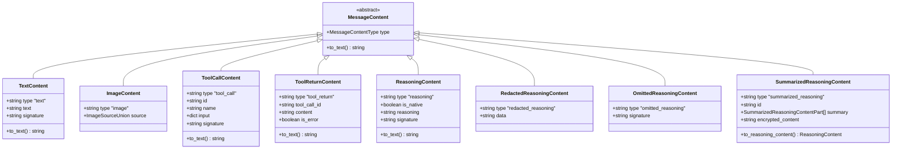

# Message Model

<cite>
**Referenced Files in This Document**
- [letta/orm/message.py](file://letta/orm/message.py)
- [letta/schemas/message.py](file://letta/schemas/message.py)
- [letta/schemas/letta_message_content.py](file://letta/schemas/letta_message_content.py)
- [letta/orm/custom_columns.py](file://letta/orm/custom_columns.py)
- [letta/services/message_manager.py](file://letta/services/message_manager.py)
- [alembic/versions/d6632deac81d_add_composite_index_to_messages_table.py](file://alembic/versions/d6632deac81d_add_composite_index_to_messages_table.py)
- [alembic/versions/e991d2e3b428_add_monotonically_increasing_ids_to_.py](file://alembic/versions/e991d2e3b428_add_monotonically_increasing_ids_to_.py)
- [alembic/versions/f3bf00ef6118_add_approval_fields_to_message_model.py](file://alembic/versions/f3bf00ef6118_add_approval_fields_to_message_model.py)
- [alembic/versions/2f4ede6ae33b_add_otid_and_tool_return_to_message.py](file://alembic/versions/2f4ede6ae33b_add_otid_and_tool_return_to_message.py)
</cite>

## Table of Contents
1. [Introduction](#introduction)
2. [Core Data Model Structure](#core-data-model-structure)
3. [Field Definitions](#field-definitions)
4. [Relationships](#relationships)
5. [Message Content Architecture](#message-content-architecture)
6. [Indexes and Performance](#indexes-and-performance)
7. [Message Threading and OTID](#message-threading-and-otid)
8. [Approval Workflows](#approval-workflows)
9. [Context Window Calculation](#context-window-calculation)
10. [Querying and Retrieval Patterns](#querying-and-retrieval-patterns)
11. [Migration History](#migration-history)
12. [Best Practices](#best-practices)

## Introduction

The Message data model in Letta serves as the fundamental storage mechanism for conversation history, enabling sophisticated agent interactions with support for multiple content types, tool calls, reasoning traces, and approval workflows. This model forms the backbone of Letta's conversational AI system, providing structured storage for all communication between agents, users, and external systems.

The message system is designed to handle complex conversational patterns including multi-turn dialogues, tool execution workflows, reasoning processes, and approval-based interactions. It supports both traditional text-based conversations and modern multimodal content including images and structured reasoning.

## Core Data Model Structure

The Message model is built using SQLAlchemy ORM with a PostgreSQL-first design philosophy, though it includes SQLite compatibility through custom sequence management.

**Diagram sources**
- [letta/orm/message.py](file://letta/orm/message.py#L17-L251)
- [letta/schemas/letta_message_content.py](file://letta/schemas/letta_message_content.py#L22-L352)

**Section sources**
- [letta/orm/message.py](file://letta/orm/message.py#L17-L251)

## Field Definitions

### Core Identity Fields

| Field | Type | Description | Constraints |
|-------|------|-------------|-------------|
| `id` | String | Unique message identifier | Primary Key |
| `sequence_id` | BigInteger | Monotonically increasing sequence for ordering | Unique, Not Null |
| `created_at` | DateTime | Timestamp of message creation | Not Null |

### Role and Content Fields

| Field | Type | Description | Constraints |
|-------|------|-------------|-------------|
| `role` | String | Message role (user/assistant/system/tool/approval) | Not Null |
| `text` | String | Legacy text content field | Nullable |
| `content` | List[MessageContent] | Structured content parts | Nullable |
| `model` | String | LLM model used for generation | Nullable |
| `name` | String | Participant name for multi-agent scenarios | Nullable |

### Tool and Execution Fields

| Field | Type | Description | Constraints |
|-------|------|-------------|-------------|
| `tool_calls` | List[OpenAIToolCall] | Tool call information | Nullable |
| `tool_call_id` | String | ID of the specific tool call | Nullable |
| `tool_returns` | List[ToolReturn] | Tool execution return information | Nullable |

### Relationship Fields

| Field | Type | Description | Constraints |
|-------|------|-------------|-------------|
| `step_id` | String | ID of the step that created this message | Foreign Key, Nullable |
| `run_id` | String | ID of the run that created this message | Foreign Key, Nullable |
| `agent_id` | String | ID of the agent that owns this message | Foreign Key, Not Null |

### Metadata and Workflow Fields

| Field | Type | Description | Constraints |
|-------|------|-------------|-------------|
| `otid` | String | Offline threading ID for message grouping | Nullable |
| `group_id` | String | Multi-agent group identifier | Nullable |
| `sender_id` | String | Sender identifier (identity or agent) | Nullable |
| `batch_item_id` | String | Associated batch job item ID | Nullable |
| `is_err` | Boolean | Debugging flag for error steps | Nullable |

### Approval Workflow Fields

| Field | Type | Description | Constraints |
|-------|------|-------------|-------------|
| `approval_request_id` | String | Approval request identifier | Nullable |
| `approve` | Boolean | Approval decision | Nullable |
| `denial_reason` | String | Reason for denial | Nullable |
| `approvals` | List[ApprovalReturn \| ToolReturn] | Approval responses | Nullable |

**Section sources**
- [letta/orm/message.py](file://letta/orm/message.py#L31-L68)

## Relationships

### Agent Relationship
The Message model maintains a mandatory relationship with the Agent entity through the `agent_id` foreign key. This establishes ownership and enables efficient filtering of messages by agent.

### Step Relationship
Messages can optionally belong to a Step entity through the `step_id` foreign key. This relationship supports the agent's step-by-step execution model, allowing messages to be grouped by individual reasoning steps.

### Run Relationship
The optional `run_id` foreign key connects messages to Run entities, enabling message organization within larger execution contexts such as batch processing or multi-turn conversations.

**Diagram sources**
- [letta/orm/message.py](file://letta/orm/message.py#L78-L81)

**Section sources**
- [letta/orm/message.py](file://letta/orm/message.py#L78-L81)

## Message Content Architecture

The Message model supports rich, structured content through the `content` field, which contains a list of `MessageContent` objects. This flexible architecture accommodates various content types beyond simple text.

### Content Type Hierarchy

**Diagram sources**
- [letta/schemas/letta_message_content.py](file://letta/schemas/letta_message_content.py#L22-L352)

### Content Type Details

#### Text Content
Simple text messages with optional signature for reasoning attribution.

#### Image Content
Supports multiple image sources:
- **URL Images**: External image URLs
- **Base64 Images**: Embedded base64-encoded images with MIME type specification
- **Letta Images**: Stored file references with optional base64 encoding

#### Tool Call Content
Structured tool invocation information including parameters and signatures.

#### Tool Return Content
Execution results with error handling capabilities.

#### Reasoning Content
Sophisticated reasoning traces with native model detection and encryption signatures.

**Section sources**
- [letta/schemas/letta_message_content.py](file://letta/schemas/letta_message_content.py#L22-L352)

## Indexes and Performance

The Message model employs several strategic indexes to optimize common query patterns and ensure efficient chronological retrieval.

### Composite Indexes

| Index Name | Columns | Purpose |
|------------|---------|---------|
| `ix_messages_agent_created_at` | `agent_id`, `created_at` | Efficient agent-scoped chronological queries |
| `ix_messages_agent_sequence` | `agent_id`, `sequence_id` | Fast sequential message retrieval |
| `ix_messages_run_sequence` | `run_id`, `sequence_id` | Run-based message ordering |
| `ix_messages_org_agent` | `organization_id`, `agent_id` | Organization-scoped filtering |

### Single Column Indexes

| Index Name | Column | Purpose |
|------------|--------|---------|
| `ix_messages_created_at` | `created_at`, `id` | General chronological sorting |
| `ix_messages_step_id` | `step_id` | Step-based message filtering |

### Sequence Management

The model implements a sophisticated sequence management system for maintaining insertion order while supporting both PostgreSQL and SQLite databases.

**Diagram sources**
- [letta/orm/message.py](file://letta/orm/message.py#L115-L251)

**Section sources**
- [letta/orm/message.py](file://letta/orm/message.py#L20-L28)
- [alembic/versions/d6632deac81d_add_composite_index_to_messages_table.py](file://alembic/versions/d6632deac81d_add_composite_index_to_messages_table.py#L26-L27)
- [alembic/versions/e991d2e3b428_add_monotonically_increasing_ids_to_.py](file://alembic/versions/e991d2e3b428_add_monotonically_increasing_ids_to_.py#L25-L29)

## Message Threading and OTID

The `otid` (Offline Threading ID) field enables sophisticated message threading capabilities, allowing related messages to be grouped together regardless of their chronological position.

### Threading Mechanism

The OTID system supports:
- **Conversation Threads**: Related messages share the same OTID
- **Parallel Conversations**: Different threads have distinct OTIDs
- **Nested Conversations**: Hierarchical threading through OTID inheritance

### OTID Generation

OTIDs are automatically generated using UUIDv4 for uniqueness and can be manually specified for controlled threading scenarios.

**Section sources**
- [letta/schemas/message.py](file://letta/schemas/message.py#L272-L274)
- [alembic/versions/2f4ede6ae33b_add_otid_and_tool_return_to_message.py](file://alembic/versions/2f4ede6ae33b_add_otid_and_tool_return_to_message.py#L30)

## Approval Workflows

The Message model includes comprehensive support for approval-based workflows, enabling secure tool execution with human oversight.

### Approval Fields

| Field | Purpose | Validation |
|-------|---------|------------|
| `approval_request_id` | Links approval to specific tool call | Foreign key constraint |
| `approve` | Approval decision (true/false) | Boolean validation |
| `denial_reason` | Explanation for denial | String validation |
| `approvals` | Collection of approval responses | List validation |

### Workflow States

**Section sources**
- [letta/schemas/message.py](file://letta/schemas/message.py#L373-L396)
- [alembic/versions/f3bf00ef6118_add_approval_fields_to_message_model.py](file://alembic/versions/f3bf00ef6118_add_approval_fields_to_message_model.py#L24-L26)

## Context Window Calculation

Messages play a crucial role in Letta's context window management system, which determines how much conversational history can be included in LLM prompts.

### Token Counting Process

The context window calculator uses messages to determine:
- **System Prompt Tokens**: Fixed overhead from system instructions
- **Memory Tokens**: Core and archival memory contributions
- **Message Tokens**: Conversation history tokenization
- **Function Tokens**: Tool definitions and schemas

### Message Filtering

Only searchable message roles contribute to token counts:
- **Assistant Messages**: Full content inclusion
- **User Messages**: Complete text extraction  
- **Tool Messages**: Return content only (skipping calls)
- **Other Roles**: Excluded from token calculations

**Section sources**
- [letta/services/message_manager.py](file://letta/services/message_manager.py#L128-L160)
- [letta/services/context_window_calculator/context_window_calculator.py](file://letta/services/context_window_calculator/context_window_calculator.py#L97-L128)

## Querying and Retrieval Patterns

### Chronological Ordering

Messages are primarily ordered by `sequence_id` for guaranteed chronological accuracy, with fallback to `created_at` for older data.

### Pagination Support

The MessageManager supports sophisticated pagination using:
- **After/Before Cursors**: Based on `sequence_id` for consistent ordering
- **Range Queries**: Efficient slicing of large message sets
- **Filtering**: By agent, group, run, or step

### Retrieval Patterns

Common query patterns include:
- **Recent Messages**: Latest N messages for context
- **Agent History**: Complete conversation history
- **Step Context**: Messages from specific reasoning steps
- **Threaded Messages**: Related messages sharing OTID

**Section sources**
- [letta/services/message_manager.py](file://letta/services/message_manager.py#L870-L941)

## Migration History

The Message model has evolved through several significant migrations to enhance functionality and performance.

### Key Migrations

| Migration | Purpose | Impact |
|-----------|---------|---------|
| `e991d2e3b428` | Monotonically increasing IDs | Improved ordering and SQLite support |
| `d6632deac81d` | Composite indexes | Enhanced query performance |
| `2f4ede6ae33b` | OTID and tool returns | Extended threading and tool support |
| `f3bf00ef6118` | Approval fields | Added workflow capabilities |

### Backward Compatibility

The model maintains backward compatibility through:
- **Legacy Field Support**: Continued support for `text` field
- **Migration Scripts**: Automated data migration
- **Graceful Degradation**: Older clients continue functioning

**Section sources**
- [alembic/versions/e991d2e3b428_add_monotonically_increasing_ids_to_.py](file://alembic/versions/e991d2e3b428_add_monotonically_increasing_ids_to_.py#L41-L47)
- [alembic/versions/d6632deac81d_add_composite_index_to_messages_table.py](file://alembic/versions/d6632deac81d_add_composite_index_to_messages_table.py#L21-L28)

## Best Practices

### Message Creation
- Use structured content (`content` field) over legacy text for new messages
- Set appropriate roles for accurate token counting
- Utilize OTIDs for related message grouping

### Performance Optimization
- Leverage composite indexes for agent-scoped queries
- Use sequence-based pagination for consistent ordering
- Filter by `agent_id` when possible to utilize indexes

### Data Integrity
- Validate message roles against allowed values
- Ensure tool call IDs are properly linked to returns
- Monitor approval workflow completion rates

### Security Considerations
- Sanitize content before storage
- Validate tool call parameters
- Audit approval workflow decisions