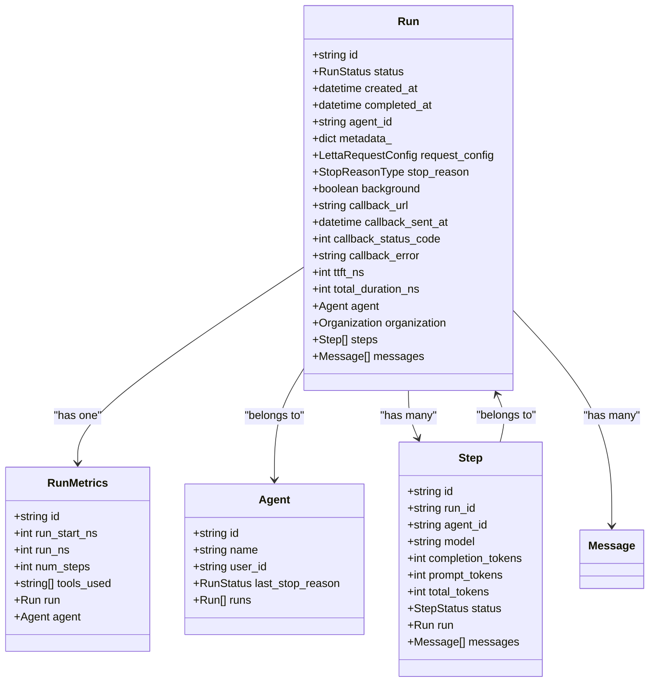
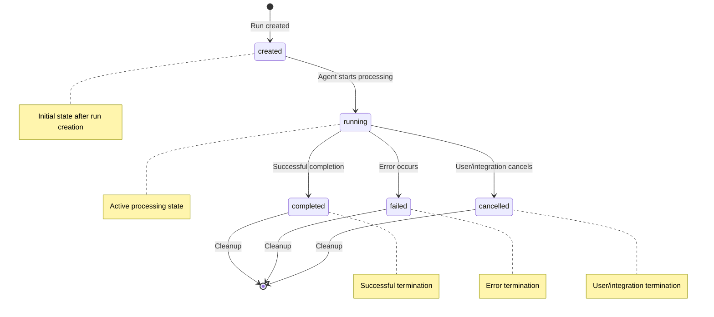
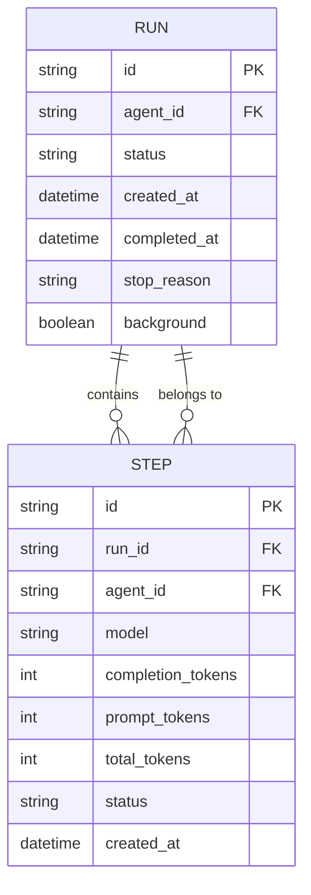
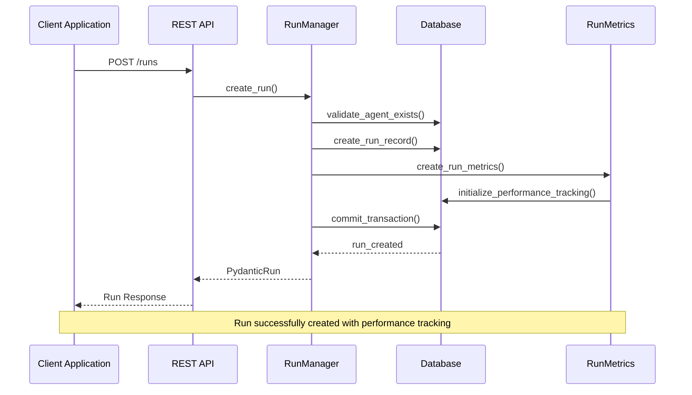
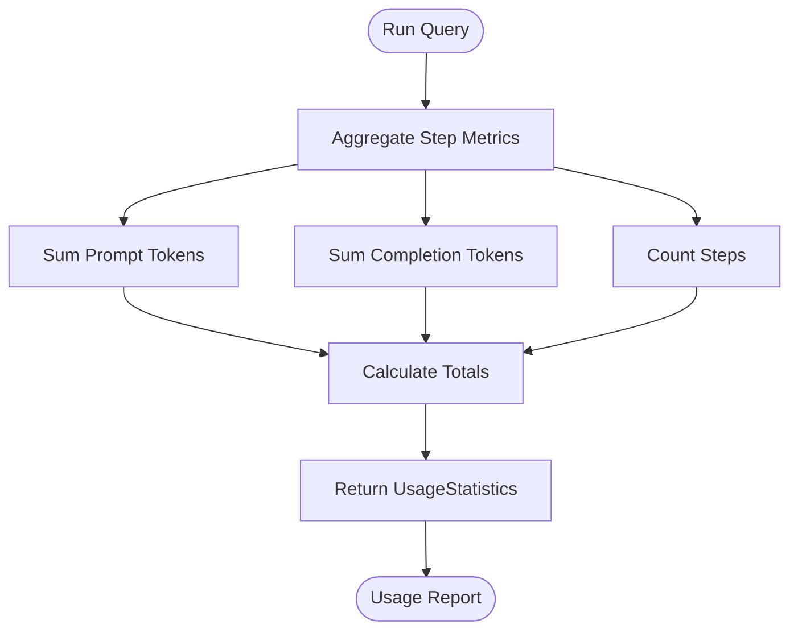

# Run Model Documentation

<cite>
**Referenced Files in This Document**
- [run.py](file://letta/orm/run.py)
- [run.py](file://letta/schemas/run.py)
- [run_manager.py](file://letta/services/run_manager.py)
- [step.py](file://letta/orm/step.py)
- [run_metrics.py](file://letta/orm/run_metrics.py)
- [enums.py](file://letta/schemas/enums.py)
- [runs.py](file://letta/server/rest_api/routers/v1/runs.py)
- [test_run_status_conversion.py](file://tests/test_run_status_conversion.py)
- [test_run_manager.py](file://tests/managers/test_run_manager.py)
</cite>

## Table of Contents
1. [Introduction](#introduction)
2. [Run Data Model Architecture](#run-data-model-architecture)
3. [Core Fields and Properties](#core-fields-and-properties)
4. [State Machine and Status Transitions](#state-machine-and-status-transitions)
5. [Relationships with Other Models](#relationships-with-other-models)
6. [Indexing Strategies and Performance](#indexing-strategies-and-performance)
7. [Run Lifecycle Management](#run-lifecycle-management)
8. [Monitoring and Metrics](#monitoring-and-metrics)
9. [API Operations and Usage Patterns](#api-operations-and-usage-patterns)
10. [Best Practices and Optimization](#best-practices-and-optimization)

## Introduction

The Run data model represents a conversation or processing session for an agent in the Letta system. Runs track when agents process messages and maintain the relationship between agents, steps, and messages. They serve as the primary mechanism for monitoring long-running operations, tracking execution progress, and managing agent interactions.

Unlike Jobs, which are more general-purpose batch processing units, Runs are specifically tied to agent interactions and message processing. Each Run encapsulates a complete execution lifecycle from initialization through completion or failure, providing comprehensive tracking capabilities for agent operations.

## Run Data Model Architecture

The Run model is implemented as a SQLAlchemy ORM class with comprehensive relationships and indexing strategies designed for high-performance querying and reliable data integrity.



**Diagram sources**
- [run.py](file://letta/orm/run.py#L22-L72)
- [run_metrics.py](file://letta/orm/run_metrics.py#L20-L53)
- [step.py](file://letta/orm/step.py#L20-L79)

**Section sources**
- [run.py](file://letta/orm/run.py#L22-L72)
- [run_metrics.py](file://letta/orm/run_metrics.py#L20-L53)

## Core Fields and Properties

### Essential Identity and Metadata Fields

The Run model includes several core fields that define its identity and operational characteristics:

| Field | Type | Description | Constraints |
|-------|------|-------------|-------------|
| `id` | String | Unique identifier prefixed with "run-" | Primary Key, UUID-based |
| `agent_id` | String | Foreign key to the owning agent | Not Null, indexed |
| `status` | RunStatus | Current execution status | Default: "created" |
| `created_at` | DateTime | Timestamp of run creation | Auto-generated |
| `completed_at` | DateTime | Timestamp when run completed | Nullable |

### Execution Control Fields

| Field | Type | Description | Purpose |
|-------|------|-------------|---------|
| `background` | Boolean | Whether run executed in background mode | Performance optimization |
| `request_config` | JSON | Configuration for the run request | Stores execution parameters |
| `metadata_` | JSON | Additional metadata storage | Flexible key-value pairs |
| `stop_reason` | StopReasonType | Reason for run termination | Completion/failure analysis |

### Callback and Integration Fields

| Field | Type | Description | Use Case |
|-------|------|-------------|----------|
| `callback_url` | String | Webhook endpoint for completion notifications | External system integration |
| `callback_sent_at` | DateTime | Last attempt timestamp | Retry logic tracking |
| `callback_status_code` | Integer | HTTP status from callback | Integration reliability |
| `callback_error` | String | Error message from callback | Debugging and monitoring |

### Performance and Timing Metrics

| Field | Type | Description | Precision |
|-------|------|-------------|-----------|
| `ttft_ns` | BigInteger | Time to first token in nanoseconds | High precision timing |
| `total_duration_ns` | BigInteger | Total run duration in nanoseconds | High precision timing |

**Section sources**
- [run.py](file://letta/orm/run.py#L35-L64)
- [run.py](file://letta/schemas/run.py#L17-L59)

## State Machine and Status Transitions

The Run model implements a comprehensive state machine that tracks the complete lifecycle of agent executions. The status transitions follow a well-defined pattern from creation through completion or failure.



**Diagram sources**
- [enums.py](file://letta/schemas/enums.py#L134-L144)
- [run_manager.py](file://letta/services/run_manager.py#L105-L126)

### Status Definitions and Transitions

The RunStatus enum defines five distinct states with specific transition rules:

| Status | Description | Terminal State | Transition From |
|--------|-------------|----------------|-----------------|
| `created` | Run initialized but not yet started | No | New run creation |
| `running` | Active processing by agent | No | `created` → `running` |
| `completed` | Successful completion | Yes | `running` → `completed` |
| `failed` | Error during execution | Yes | `running` → `failed` |
| `cancelled` | User/integration cancellation | Yes | `running` → `cancelled` |

### Status Validation and Error Handling

The system implements robust validation for status transitions:

- **Invalid transitions**: Attempting to move from `completed`, `failed`, or `cancelled` to any other state raises validation errors
- **Automatic completion**: Setting status to terminal states automatically populates `completed_at` timestamp
- **Stop reason requirement**: Terminal state updates must include appropriate stop reasons
- **Callback coordination**: Terminal state changes trigger callback notifications when configured

**Section sources**
- [enums.py](file://letta/schemas/enums.py#L134-L144)
- [run_manager.py](file://letta/services/run_manager.py#L314-L338)
- [test_run_status_conversion.py](file://tests/test_run_status_conversion.py#L1-L80)

## Relationships with Other Models

### One-to-Many Relationship with Steps

Each Run maintains a comprehensive relationship with Steps, representing individual processing units within the run:



**Diagram sources**
- [step.py](file://letta/orm/step.py#L20-L79)
- [run.py](file://letta/orm/run.py#L69-L72)

### Many-to-One Relationship with Agents

Runs belong to specific agents and inherit organizational context:

- **Agent ownership**: Each run is associated with exactly one agent via `agent_id`
- **Organizational context**: Runs inherit organization and project relationships from their agents
- **Template inheritance**: Runs can inherit template configurations from their agents

### One-to-One Relationship with RunMetrics

Each Run has exactly one RunMetrics record for performance tracking:

- **Performance monitoring**: Tracks execution duration, token usage, and step counts
- **Tool usage analytics**: Records tools invoked during run execution
- **Timing precision**: Uses nanosecond precision for accurate performance measurements

### Cascade Deletion Behavior

The model implements careful cascade deletion policies:

- **Steps**: Deleted when run is deleted (`delete-orphan`)
- **Messages**: Deleted when run is deleted (`delete-orphan`)
- **RunMetrics**: Deleted when run is deleted (`CASCADE`)
- **Associated records**: Maintains referential integrity while enabling clean cleanup

**Section sources**
- [run.py](file://letta/orm/run.py#L69-L72)
- [step.py](file://letta/orm/step.py#L70-L79)
- [run_metrics.py](file://letta/orm/run_metrics.py#L20-L53)

## Indexing Strategies and Performance

### Primary Indexing Strategy

The Run model implements a comprehensive indexing strategy optimized for common query patterns:

| Index | Columns | Purpose | Query Pattern |
|-------|---------|---------|---------------|
| `ix_runs_created_at` | `created_at`, `id` | Efficient chronological listing | Pagination, time-based filtering |
| `ix_runs_agent_id` | `agent_id` | Agent-centric queries | Agent-run relationships |
| `ix_runs_organization_id` | `organization_id` | Organization-scoped queries | Multi-tenant isolation |

### Performance Optimization Features

#### High-Frequency Run Creation Optimization

- **UUID generation**: Uses Python's `uuid.uuid4()` for efficient ID generation
- **Batch operations**: Supports bulk creation with optimized transaction handling
- **Connection pooling**: Leverages SQLAlchemy's connection pooling for concurrent operations

#### Query Performance Enhancements

- **Composite indexes**: `ix_runs_created_at` enables efficient time-range queries
- **Foreign key optimization**: Indexed `agent_id` and `organization_id` for relationship queries
- **Pagination support**: Optimized for large datasets with cursor-based pagination

#### Memory and Storage Efficiency

- **JSON field optimization**: Uses PostgreSQL JSONB for flexible metadata storage
- **Nullable fields**: Minimizes storage overhead for optional fields
- **Cascade deletion**: Prevents orphaned records and maintains database integrity

### Scalability Considerations

The indexing strategy supports high-throughput scenarios:

- **Concurrent writes**: UUID-based IDs prevent contention during high-frequency creation
- **Partitioning potential**: Organization-based partitioning could be implemented for large deployments
- **Query optimization**: Composite indexes support complex filtering scenarios

**Section sources**
- [run.py](file://letta/orm/run.py#L29-L33)
- [run_manager.py](file://letta/services/run_manager.py#L129-L291)

## Run Lifecycle Management

### Run Creation Process

The run creation process follows a structured workflow ensuring data integrity and proper initialization:



**Diagram sources**
- [run_manager.py](file://letta/services/run_manager.py#L48-L89)
- [runs.py](file://letta/server/rest_api/routers/v1/runs.py#L46-L113)

### Monitoring and Status Updates

The system provides real-time monitoring capabilities through multiple mechanisms:

#### Real-Time Status Checking

- **Lettuce integration**: For distributed systems, runs can integrate with Lettuce for external status tracking
- **Manual polling**: Clients can query run status through the REST API
- **Callback notifications**: Automatic webhook delivery upon completion

#### Performance Monitoring

- **Token tracking**: Comprehensive tracking of prompt and completion tokens
- **Timing metrics**: Nanosecond precision for accurate performance measurement
- **Step counting**: Detailed step progression tracking

### Cleanup and Retention Policies

#### Automatic Cleanup Mechanisms

- **Cascade deletion**: Associated Steps, Messages, and Metrics are automatically cleaned up
- **Orphan prevention**: Proper foreign key constraints prevent orphaned records
- **Resource management**: Automatic cleanup prevents memory leaks and disk space issues

#### Manual Cleanup Operations

The system supports explicit cleanup through the RunManager:

- **Hard deletion**: Complete removal of run and associated records
- **Soft deletion**: Marking runs as deleted while preserving data integrity
- **Bulk operations**: Efficient cleanup of multiple runs meeting criteria

**Section sources**
- [run_manager.py](file://letta/services/run_manager.py#L293-L303)
- [run_manager.py](file://letta/services/run_manager.py#L397-L424)

## Monitoring and Metrics

### Performance Metrics Collection

The RunMetrics model provides comprehensive performance tracking:

| Metric | Type | Description | Calculation |
|--------|------|-------------|-------------|
| `run_start_ns` | BigInteger | Run start timestamp in nanoseconds | System time at run creation |
| `run_ns` | BigInteger | Total run duration in nanoseconds | End time - start time |
| `num_steps` | Integer | Number of processing steps | Count of associated Steps |
| `tools_used` | JSON Array | List of tool IDs used in run | Aggregated from messages |

### Token Usage Tracking

The system provides detailed token usage analytics:

- **Prompt tokens**: Tokens consumed in system and user messages
- **Completion tokens**: Tokens generated by the LLM
- **Total tokens**: Sum of prompt and completion tokens
- **Step granularity**: Token usage tracked at the step level

### Usage Statistics Generation

The RunManager provides comprehensive usage statistics:



**Diagram sources**
- [run_manager.py](file://letta/services/run_manager.py#L456-L472)

### Analytics and Reporting

The system supports various analytical operations:

- **Duration percentiles**: Statistical analysis of run performance
- **Tool usage analytics**: Popular tool identification and usage patterns
- **Agent performance**: Comparative analysis across agents
- **Trend analysis**: Historical performance trend identification

**Section sources**
- [run_metrics.py](file://letta/orm/run_metrics.py#L20-L53)
- [run_manager.py](file://letta/services/run_manager.py#L456-L472)

## API Operations and Usage Patterns

### REST API Endpoints

The Run model exposes comprehensive REST API endpoints for CRUD operations and monitoring:

#### Listing and Filtering Operations

| Endpoint | Method | Purpose | Parameters |
|----------|--------|---------|------------|
| `/runs` | GET | List runs with filtering | `agent_id`, `statuses`, `before`, `after`, `limit` |
| `/runs/active` | GET | List active runs | `agent_id`, `background` |
| `/runs/{run_id}` | GET | Get specific run | `run_id` |

#### Message and Usage Operations

| Endpoint | Method | Purpose | Response Type |
|----------|--------|---------|---------------|
| `/runs/{run_id}/messages` | GET | Get run messages | `List[LettaMessageUnion]` |
| `/runs/{run_id}/usage` | GET | Get usage statistics | `UsageStatistics` |

### Common Usage Patterns

#### Background Processing

For long-running operations, the system supports background execution:

```python
# Example background run creation
run_data = PydanticRun(
    agent_id=agent_id,
    background=True,
    metadata={"priority": "high", "timeout": 300},
    callback_url="https://webhook.example.com/run-complete"
)
```

#### Real-Time Monitoring

Clients can monitor run progress through status polling:

```python
# Polling for completion
while run.status in [RunStatus.created, RunStatus.running]:
    run = await run_manager.get_run_with_status(run_id, actor)
    await asyncio.sleep(1)
```

#### Bulk Operations

The system supports efficient bulk operations for large-scale management:

- **Batch listing**: Filter and paginate through large run collections
- **Bulk updates**: Update multiple runs with consistent status changes
- **Mass cleanup**: Remove runs meeting specific criteria

### Error Handling and Resilience

The API implements comprehensive error handling:

- **Validation errors**: Clear feedback for invalid status transitions
- **Not found errors**: Specific handling for missing runs
- **Permission errors**: Organization-scoped access control
- **Timeout handling**: Graceful handling of long-running operations

**Section sources**
- [runs.py](file://letta/server/rest_api/routers/v1/runs.py#L46-L200)
- [run_manager.py](file://letta/services/run_manager.py#L129-L291)

## Best Practices and Optimization

### Performance Optimization Guidelines

#### Index Utilization

- **Query optimization**: Use composite indexes for complex filtering scenarios
- **Pagination efficiency**: Leverage cursor-based pagination for large datasets
- **Selective loading**: Use lazy loading for expensive relationships when appropriate

#### Memory Management

- **Connection pooling**: Configure appropriate pool sizes for concurrent operations
- **Batch processing**: Group related operations to minimize database round trips
- **Resource cleanup**: Ensure proper cleanup of temporary resources

#### Scalability Considerations

- **Horizontal scaling**: Design for distributed environments with Lettuce integration
- **Load balancing**: Distribute run creation across available resources
- **Caching strategies**: Implement caching for frequently accessed run data

### Operational Best Practices

#### Monitoring and Alerting

- **Status monitoring**: Track run status changes for operational insights
- **Performance alerts**: Monitor run durations and token usage trends
- **Error tracking**: Implement comprehensive error logging and alerting

#### Data Management

- **Retention policies**: Implement appropriate data retention for historical analysis
- **Archival strategies**: Consider archiving completed runs for compliance requirements
- **Cleanup automation**: Automate cleanup of old or failed runs

#### Security Considerations

- **Access control**: Implement proper RBAC for run access
- **Audit logging**: Log all run-related operations for security auditing
- **Data protection**: Protect sensitive metadata and callback URLs

### Development Guidelines

#### Testing Strategies

- **Unit testing**: Test individual run operations in isolation
- **Integration testing**: Test run lifecycle with database operations
- **Performance testing**: Validate scalability under load conditions

#### Debugging and Troubleshooting

- **Logging**: Implement comprehensive logging for run operations
- **Metrics collection**: Track key performance indicators
- **Error reporting**: Provide clear error messages for debugging

The Run model provides a robust foundation for tracking agent execution sessions with comprehensive monitoring, performance tracking, and operational capabilities. Its design balances flexibility with performance, supporting both simple use cases and complex enterprise deployments.