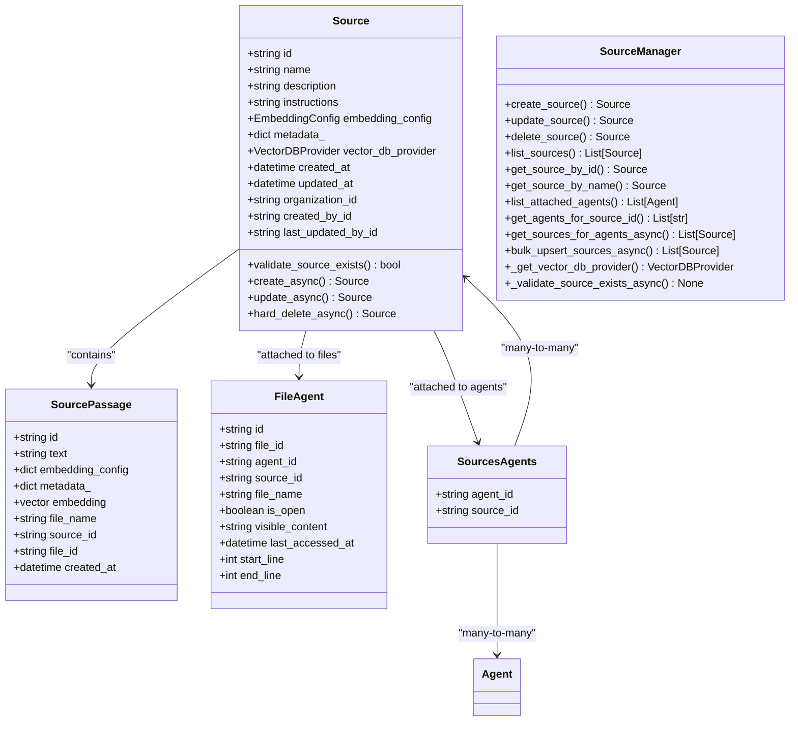
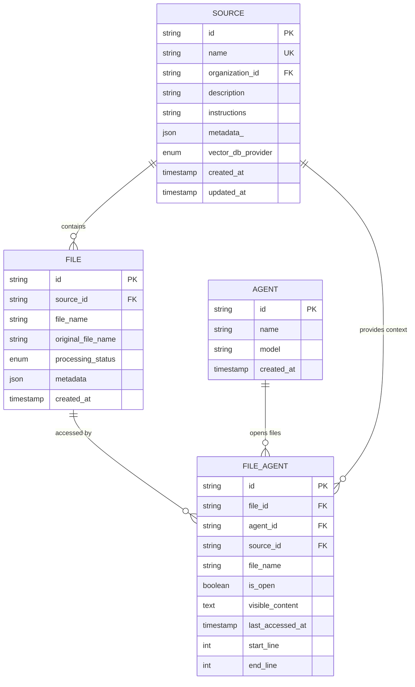
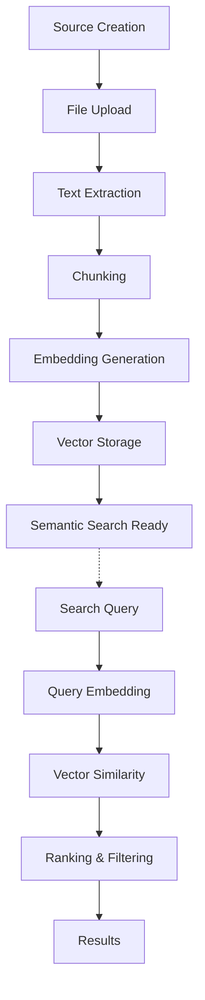

# Source Model

<cite>
**Referenced Files in This Document**
- [source.py](file://letta/orm/source.py)
- [source.py](file://letta/schemas/source.py)
- [source_manager.py](file://letta/services/source_manager.py)
- [files_agents.py](file://letta/orm/files_agents.py)
- [passage.py](file://letta/orm/passage.py)
- [sources_agents.py](file://letta/orm/sources_agents.py)
- [enums.py](file://letta/schemas/enums.py)
- [test_sources.py](file://tests/test_sources.py)
- [agent_manager_helper.py](file://letta/services/helpers/agent_manager_helper.py)
- [tpuf_client.py](file://letta/helpers/tpuf_client.py)
</cite>

## Table of Contents
1. [Introduction](#introduction)
2. [Core Data Model Architecture](#core-data-model-architecture)
3. [Field Specifications](#field-specifications)
4. [Relationships and Associations](#relationships-and-associations)
5. [Vector Database Configuration](#vector-database-configuration)
6. [Source Management Operations](#source-management-operations)
7. [Indexing Strategy and Performance](#indexing-strategy-and-performance)
8. [Semantic Search Implementation](#semantic-search-implementation)
9. [Examples and Usage Patterns](#examples-and-usage-patterns)
10. [Performance Considerations](#performance-considerations)
11. [Troubleshooting Guide](#troubleshooting-guide)
12. [Conclusion](#conclusion)

## Introduction

The Source data model in Letta represents a fundamental component for document management and retrieval systems. It serves as a container for organizing files, passages, and metadata while enabling sophisticated semantic search capabilities through vector embeddings. Sources act as logical groupings of related documents that can be attached to agents for contextual information retrieval and processing.

Sources are designed to support large-scale document collections with efficient indexing, flexible embedding configurations, and seamless integration with various vector database providers. They provide the foundation for intelligent document retrieval, semantic search, and context-aware agent interactions.

## Core Data Model Architecture

The Source model is implemented as a SQLAlchemy ORM class with comprehensive field definitions and relationship mappings. The architecture follows a layered approach with separate ORM models, Pydantic schemas, and service managers.



**Diagram sources**
- [source.py](file://letta/orm/source.py#L17-L40)
- [source_manager.py](file://letta/services/source_manager.py#L22-L551)
- [passage.py](file://letta/orm/passage.py#L47-L56)
- [files_agents.py](file://letta/orm/files_agents.py#L18-L108)
- [sources_agents.py](file://letta/orm/sources_agents.py#L7-L15)

**Section sources**
- [source.py](file://letta/orm/source.py#L17-L40)
- [source_manager.py](file://letta/services/source_manager.py#L22-L551)

## Field Specifications

### Core Fields

The Source model defines several essential fields that establish its identity and functionality:

| Field | Type | Description | Constraints |
|-------|------|-------------|-------------|
| `id` | String | Unique identifier for the source | Auto-generated UUID |
| `name` | String | Human-readable name of the source | Must be unique within organization |
| `description` | String | Detailed description of the source's purpose | Nullable |
| `instructions` | String | Special instructions for using the source | Nullable |
| `embedding_config` | EmbeddingConfig | Configuration for text embedding generation | Required |
| `metadata_` | JSON | Additional metadata and properties | Nullable |
| `vector_db_provider` | VectorDBProvider | Vector database backend provider | Default: NATIVE |

### Metadata and Configuration

The `metadata_` field stores arbitrary JSON data that can be used for custom source properties, while the `instructions` field provides specific guidance for how the source should be utilized by agents or systems.

### Organization and Access Control

Sources are scoped to organizations through the `organization_id` field, ensuring proper isolation and access control. The model includes audit fields (`created_by_id`, `last_updated_by_id`) for tracking source lifecycle and ownership.

**Section sources**
- [source.py](file://letta/orm/source.py#L29-L39)
- [source.py](file://letta/schemas/source.py#L20-L23)

## Relationships and Associations

### Source to Files Relationship

Sources maintain associations with files through the `files_agents` junction table. This relationship enables agents to access files within a source while maintaining proper access controls and file visibility management.



**Diagram sources**
- [files_agents.py](file://letta/orm/files_agents.py#L18-L108)
- [source.py](file://letta/orm/source.py#L17-L40)

### Source to Passages Relationship

Sources are connected to passages through a foreign key relationship in the `source_passages` table. This establishes the hierarchical structure where sources contain multiple passages that represent chunks of text extracted from associated files.

### Source to Agents Relationship

The many-to-many relationship between sources and agents is managed through the `sources_agents` junction table. This allows agents to inherit the context and knowledge contained within multiple sources.

**Section sources**
- [files_agents.py](file://letta/orm/files_agents.py#L18-L108)
- [sources_agents.py](file://letta/orm/sources_agents.py#L7-L15)

## Vector Database Configuration

### Provider Options

The Source model supports multiple vector database providers through the `vector_db_provider` field:

| Provider | Description | Use Case |
|----------|-------------|----------|
| `NATIVE` | Built-in vector storage | Local deployments, small datasets |
| `TPUF` | Turbopuffer cloud service | Cloud-native, scalable solutions |
| `PINECONE` | Pinecone vector database | Production-grade vector search |

### Automatic Provider Selection

The system automatically selects the appropriate vector database provider based on configuration and availability. The `_get_vector_db_provider()` method in SourceManager determines the provider using the following precedence:

1. **Turbopuffer (TPUF)**: Takes precedence when available and configured
2. **Pinecone**: Used as fallback when Turbopuffer is unavailable
3. **Native**: Default provider for local deployments

### Embedding Configuration

Each source maintains its own embedding configuration through the `embedding_config` field, which includes:

- Model specification (e.g., text-embedding-3-small)
- Dimensionality settings
- Chunk size parameters
- Endpoint configuration
- Authentication details

**Section sources**
- [source_manager.py](file://letta/services/source_manager.py#L22-L34)
- [source.py](file://letta/orm/source.py#L34-L39)

## Source Management Operations

### Creation and Initialization

Sources are created through the SourceManager's `create_source()` method, which handles validation, organization assignment, and provider selection. The creation process includes:

1. **Validation**: Ensures unique name within organization
2. **Provider Assignment**: Selects appropriate vector database provider
3. **Configuration**: Applies default embedding settings
4. **Persistence**: Stores source in database with audit fields

### Bulk Operations

The SourceManager supports efficient bulk operations for large-scale source management:

```python
# Bulk upsert operation with PostgreSQL optimization
await source_manager.bulk_upsert_sources_async(pydantic_sources, actor)
```

The bulk upsert operation provides:
- **PostgreSQL optimization**: Uses native `ON CONFLICT` for atomic updates
- **SQLite fallback**: Individual upserts with batch transaction handling
- **Conflict resolution**: Updates existing sources by name and organization
- **Performance**: Significantly faster than individual operations

### Query and Retrieval

Sources support various query patterns:

- **ByID**: Retrieve by unique identifier
- **ByName**: Find by name within organization
- **ByAgent**: List sources attached to specific agents
- **Pagination**: Efficient cursor-based pagination
- **Filtering**: Name-based filtering and search

**Section sources**
- [source_manager.py](file://letta/services/source_manager.py#L63-L81)
- [source_manager.py](file://letta/services/source_manager.py#L85-L132)

## Indexing Strategy and Performance

### Database Indexes

The Source model implements several strategic indexes for optimal query performance:

| Index | Purpose | Columns |
|-------|---------|---------|
| `source_created_at_id_idx` | Efficient pagination and sorting | `created_at`, `id` |
| `uq_source_name_organization` | Enforce unique names per organization | `name`, `organization_id` |
| `source_passages_file_id_idx` | Optimize file-based passage queries | `file_id` |
| `ix_sources_agents_source_id` | Speed up agent-source relationship queries | `source_id` |

### Search Performance Optimizations

The system implements several performance optimizations:

1. **Vector Indexing**: Leverages database-specific vector indexing (pgvector for PostgreSQL)
2. **Hybrid Search**: Combines vector similarity with full-text search
3. **Pagination Cursors**: Efficient large dataset navigation
4. **Connection Pooling**: Optimized database connection management

### Large Collection Handling

For large document collections, the system provides:

- **Chunked Processing**: Files are processed in manageable chunks
- **Parallel Operations**: Concurrent embedding generation
- **Streaming Results**: Memory-efficient result processing
- **Lazy Loading**: On-demand passage retrieval

**Section sources**
- [source.py](file://letta/orm/source.py#L23-L27)
- [passage.py](file://letta/orm/passage.py#L62-L72)

## Semantic Search Implementation

### Embedding Generation

Sources enable semantic search through the generation and storage of vector embeddings:



**Diagram sources**
- [agent_manager_helper.py](file://letta/services/helpers/agent_manager_helper.py#L1093-L1118)

### Search Modes

The system supports multiple search approaches:

1. **Vector Search**: Cosine similarity between query and passage embeddings
2. **Full-Text Search**: Keyword matching with BM25 ranking
3. **Hybrid Search**: Combined vector and text search using Reciprocal Rank Fusion (RRF)

### Retrieval Strategies

Sources support various retrieval strategies:

- **Contextual Retrieval**: Passages relevant to agent context
- **Temporal Filtering**: Time-based passage filtering
- **Source-Specific**: Limit search to specific sources
- **Agent-Specific**: Filter by agent-source attachments

**Section sources**
- [agent_manager_helper.py](file://letta/services/helpers/agent_manager_helper.py#L1120-L1152)
- [tpuf_client.py](file://letta/helpers/tpuf_client.py#L421-L1390)

## Examples and Usage Patterns

### Creating a Source

Basic source creation with embedding configuration:

```python
# Create source with custom embedding
source = Source(
    name="Documentation",
    description="Technical documentation collection",
    instructions="Use for technical inquiries and documentation lookup",
    embedding_config=embedding_config,
    metadata={"category": "technical", "version": "1.0"}
)
```

### Attaching Files

Files are attached to sources through the file management system:

```python
# Upload file to source
file_metadata = await file_manager.upload_file(source_id, file_path)
```

### Agent Integration

Sources are attached to agents for context provision:

```python
# Attach source to agent
await agent_manager.attach_source(agent_id, source_id)
```

### Semantic Search Example

Performing semantic search within a source:

```python
# Search for relevant passages
results = await passage_manager.search_passages(
    query_text="machine learning algorithms",
    source_id=source_id,
    top_k=10
)
```

**Section sources**
- [test_sources.py](file://tests/test_sources.py#L188-L200)
- [test_sources.py](file://tests/test_sources.py#L246-L262)

## Performance Considerations

### Scalability Factors

Several factors impact Source model performance at scale:

1. **Vector Database Choice**: TPUF offers superior performance for large datasets
2. **Embedding Dimensions**: Higher dimensions improve accuracy but increase storage
3. **Batch Processing**: Larger batches reduce overhead for bulk operations
4. **Index Maintenance**: Regular index optimization for query performance

### Memory Management

The system implements several memory optimization strategies:

- **Lazy Loading**: Passages loaded on-demand
- **Connection Pooling**: Reused database connections
- **Streaming Results**: Process large result sets incrementally
- **Garbage Collection**: Automatic cleanup of unused resources

### Monitoring and Metrics

Key performance indicators include:

- **Query Latency**: Response time for search operations
- **Throughput**: Number of operations per second
- **Storage Utilization**: Vector database space usage
- **Cache Hit Rate**: Effectiveness of caching strategies

**Section sources**
- [source_manager.py](file://letta/services/source_manager.py#L134-L182)

## Troubleshooting Guide

### Common Issues

#### Source Creation Failures

**Problem**: Source creation fails with unique constraint violation
**Solution**: Ensure source name is unique within organization or use bulk upsert

#### Vector Database Connectivity

**Problem**: Vector search operations fail
**Solution**: Verify vector database provider configuration and credentials

#### Performance Degradation

**Problem**: Slow search queries on large sources
**Solution**: 
- Enable appropriate vector database provider
- Optimize embedding dimensions
- Implement proper indexing
- Consider pagination for large result sets

### Debugging Tools

The system provides several debugging capabilities:

- **Audit Logging**: Track source lifecycle events
- **Query Profiling**: Monitor database query performance
- **Metric Collection**: Monitor system performance metrics
- **Error Reporting**: Comprehensive error handling and reporting

**Section sources**
- [source_manager.py](file://letta/services/source_manager.py#L38-L60)

## Conclusion

The Source data model provides a robust foundation for document management and retrieval in Letta's intelligent agent system. Its comprehensive architecture supports large-scale document collections, sophisticated semantic search capabilities, and seamless integration with agents and vector databases.

Key strengths of the model include:

- **Flexible Architecture**: Supports multiple vector database providers
- **Scalable Design**: Handles large document collections efficiently
- **Rich Metadata**: Extensible metadata system for custom properties
- **Performance Optimization**: Strategic indexing and query optimization
- **Integration Friendly**: Seamless agent and file system integration

The model's design enables powerful semantic search capabilities while maintaining performance and scalability for production deployments. Future enhancements may include additional vector database providers, advanced indexing strategies, and enhanced metadata capabilities.