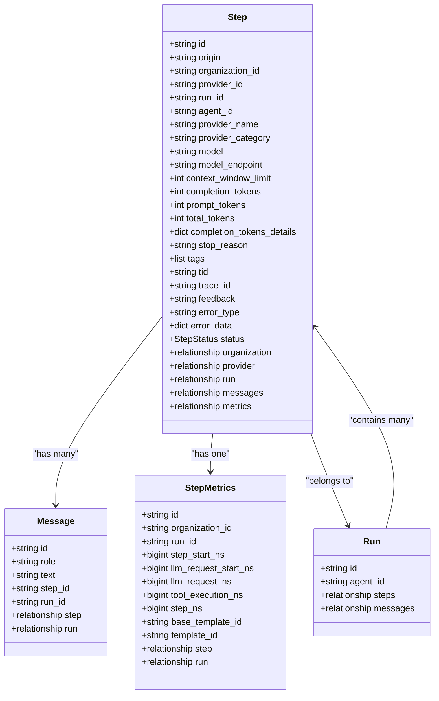
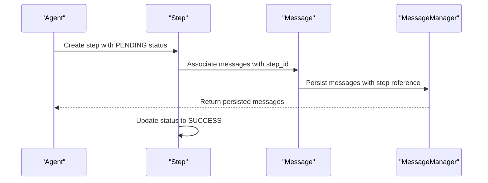
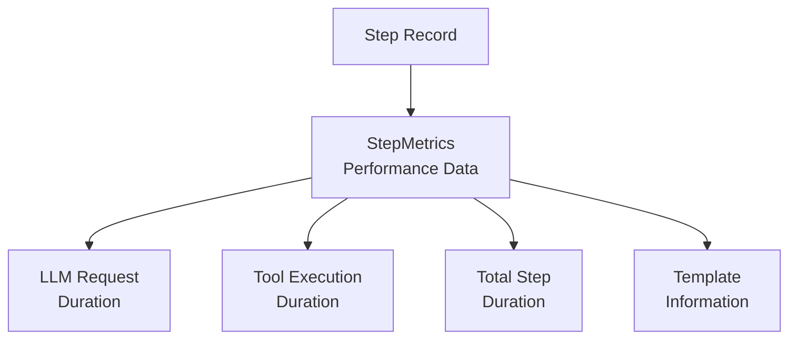
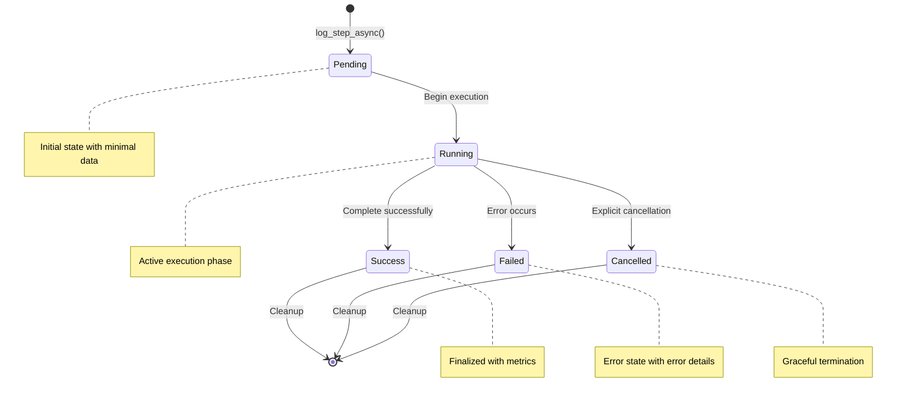
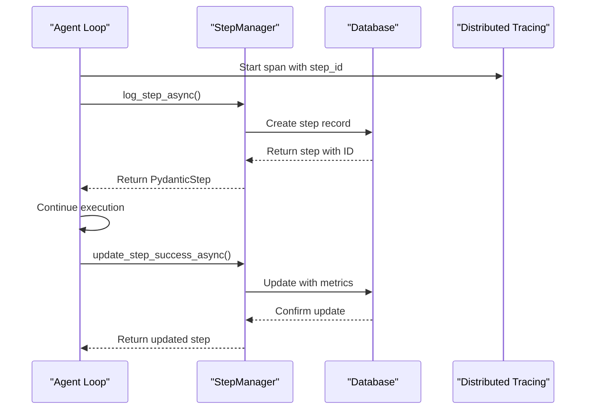

# Step Model Documentation

<cite>
**Referenced Files in This Document**
- [letta/orm/step.py](file://letta/orm/step.py)
- [letta/schemas/step.py](file://letta/schemas/step.py)
- [letta/services/step_manager.py](file://letta/services/step_manager.py)
- [letta/orm/message.py](file://letta/orm/message.py)
- [letta/orm/step_metrics.py](file://letta/orm/step_metrics.py)
- [letta/orm/run.py](file://letta/orm/run.py)
- [alembic/versions/dfafcf8210ca_add_model_endpoint_to_steps_table.py](file://alembic/versions/dfafcf8210ca_add_model_endpoint_to_steps_table.py)
- [alembic/versions/6c53224a7a58_add_provider_category_to_steps.py](file://alembic/versions/6c53224a7a58_add_provider_category_to_steps.py)
- [alembic/versions/b183663c6769_add_trace_id_to_steps_table.py](file://alembic/versions/b183663c6769_add_trace_id_to_steps_table.py)
- [alembic/versions/a1b2c3d4e5f6_add_index_to_step_metrics_run_id.py](file://alembic/versions/a1b2c3d4e5f6_add_index_to_step_metrics_run_id.py)
- [letta/agents/letta_agent_v2.py](file://letta/agents/letta_agent_v2.py)
- [letta/agents/letta_agent.py](file://letta/agents/letta_agent.py)
- [letta/agents/letta_agent_v3.py](file://letta/agents/letta_agent_v3.py)
</cite>

## Table of Contents
1. [Introduction](#introduction)
2. [Step Model Architecture](#step-model-architecture)
3. [Core Fields and Data Types](#core-fields-and-data-types)
4. [Relationships with Other Models](#relationships-with-other-models)
5. [Step Lifecycle Management](#step-lifecycle-management)
6. [Step Creation During Agent Execution](#step-creation-during-agent-execution)
7. [Performance Considerations](#performance-considerations)
8. [Debugging and Monitoring](#debugging-and-monitoring)
9. [Indexing Strategies](#indexing-strategies)
10. [Best Practices](#best-practices)

## Introduction

The Step model represents individual execution steps within a Run in the Letta system. Each step captures the metadata, status, and performance metrics for atomic operations performed by agents, including LLM calls, tool executions, and other computational tasks. Steps serve as the fundamental building blocks for tracking agent behavior, debugging execution flows, and monitoring system performance.

Steps are designed to capture comprehensive information about each atomic operation, enabling detailed analysis of agent execution patterns, performance optimization, and troubleshooting complex workflows. They form a critical component of the observability stack, providing visibility into agent decision-making processes and system resource utilization.

## Step Model Architecture

The Step model is implemented as a SQLAlchemy ORM class with comprehensive field definitions and relationships. It inherits from `SqlalchemyBase` and `ProjectMixin`, providing database persistence capabilities and project-scoped access controls.



**Diagram sources**
- [letta/orm/step.py](file://letta/orm/step.py#L20-L79)
- [letta/orm/message.py](file://letta/orm/message.py#L17-L81)
- [letta/orm/step_metrics.py](file://letta/orm/step_metrics.py#L20-L85)
- [letta/orm/run.py](file://letta/orm/run.py#L53-L71)

**Section sources**
- [letta/orm/step.py](file://letta/orm/step.py#L20-L79)
- [letta/schemas/step.py](file://letta/schemas/step.py#L16-L61)

## Core Fields and Data Types

### Primary Identifier and Metadata Fields

| Field | Type | Description | Constraints |
|-------|------|-------------|-------------|
| `id` | String | Unique step identifier with UUID format | Primary Key, auto-generated |
| `origin` | Optional[String] | Surface where step was initiated | Nullable, documentation field |
| `organization_id` | String | Foreign key to organization | RESTRICT on delete |
| `provider_id` | Optional[String] | Foreign key to provider configuration | RESTRICT on delete, nullable |
| `run_id` | Optional[String] | Foreign key to parent run | SET NULL on delete, nullable |

### Execution Context Fields

| Field | Type | Description | Constraints |
|-------|------|-------------|-------------|
| `agent_id` | Optional[String] | Reference to agent performing step | Nullable |
| `provider_name` | Optional[String] | Name of provider used | Nullable |
| `provider_category` | Optional[String] | Category classification of provider | Nullable |
| `model` | Optional[String] | Specific model identifier | Nullable |
| `model_endpoint` | Optional[String] | Endpoint URL for model access | Nullable |

### Token Usage and Performance Metrics

| Field | Type | Description | Constraints |
|-------|------|-------------|-------------|
| `context_window_limit` | Optional[Int] | Configured context window size | Nullable |
| `completion_tokens` | Int | Tokens generated by LLM | Default: 0 |
| `prompt_tokens` | Int | Tokens in input prompt | Default: 0 |
| `total_tokens` | Int | Total tokens processed | Default: 0 |
| `completion_tokens_details` | Optional[Dict] | Additional token metadata | JSON column, nullable |

### Status and Control Fields

| Field | Type | Description | Constraints |
|-------|------|-------------|-------------|
| `status` | Optional[StepStatus] | Current step execution status | Nullable, enum values |
| `stop_reason` | Optional[String] | Reason for step termination | Nullable |
| `tags` | Optional[List] | Metadata tagging system | JSON column |
| `tid` | Optional[String] | Transaction identifier | Nullable |
| `trace_id` | Optional[String] | Distributed tracing identifier | Nullable |

### Error Handling Fields

| Field | Type | Description | Constraints |
|-------|------|-------------|-------------|
| `error_type` | Optional[String] | Class/type of error encountered | Nullable |
| `error_data` | Optional[Dict] | Comprehensive error details including message, traceback, and context | JSON column, nullable |

**Section sources**
- [letta/orm/step.py](file://letta/orm/step.py#L27-L66)
- [letta/schemas/step.py](file://letta/schemas/step.py#L17-L51)

## Relationships with Other Models

### One-to-Many Relationship with Messages

Each step maintains a relationship with multiple messages through the `messages` field. This relationship enables capturing all communication artifacts generated during a single step execution.



**Diagram sources**
- [letta/agents/letta_agent_v2.py](file://letta/agents/letta_agent_v2.py#L1020-L1047)
- [letta/orm/message.py](file://letta/orm/message.py#L39-L41)

### One-to-One Relationship with StepMetrics

Steps maintain a one-to-one relationship with StepMetrics for performance tracking. This relationship enables detailed timing analysis and resource utilization monitoring.



**Diagram sources**
- [letta/orm/step_metrics.py](file://letta/orm/step_metrics.py#L26-L85)

### Many-to-One Relationship with Runs

Steps belong to runs, establishing hierarchical organization for execution contexts. This relationship enables querying steps by run scope and tracking step progression within larger execution sequences.

**Section sources**
- [letta/orm/step.py](file://letta/orm/step.py#L70-L78)
- [letta/orm/message.py](file://letta/orm/message.py#L39-L41)
- [letta/orm/step_metrics.py](file://letta/orm/step_metrics.py#L26-L45)

## Step Lifecycle Management

The step lifecycle encompasses several distinct phases, each with specific state transitions and data updates. Understanding these phases is crucial for proper step management and debugging.



### Step Creation Phase

During step creation, the system initializes essential metadata while maintaining minimal state. The step begins with `PENDING` status and basic execution context information.

### Execution Phase

The execution phase involves actual computation, LLM calls, and tool invocations. During this phase, the step maintains active status while accumulating metrics and handling potential errors.

### Completion Phase

Steps reach completion through successful execution (`SUCCESS`), error conditions (`FAILED`), or explicit cancellation (`CANCELLED`). Each completion state triggers appropriate cleanup and notification mechanisms.

**Section sources**
- [letta/services/step_manager.py](file://letta/services/step_manager.py#L90-L140)
- [letta/services/step_manager.py](file://letta/services/step_manager.py#L376-L418)

## Step Creation During Agent Execution

Steps are automatically created during agent execution through standardized checkpoint mechanisms. The creation process varies slightly across different agent implementations but follows consistent patterns.

### Standard Step Creation Pattern



**Diagram sources**
- [letta/agents/letta_agent_v2.py](file://letta/agents/letta_agent_v2.py#L796-L818)
- [letta/services/step_manager.py](file://letta/services/step_manager.py#L90-L140)

### Agent-Specific Implementation Details

Different agent implementations utilize variations of the standard step creation pattern:

#### LettaAgentV2 Implementation
Uses `_step_checkpoint_start()` method for structured step initialization with comprehensive metadata capture.

#### LettaAgent Implementation  
Implements step creation with automatic error handling and retry mechanisms for robust execution.

#### LettaAgentV3 Implementation  
Integrates advanced tracing and metrics collection during step initialization.

**Section sources**
- [letta/agents/letta_agent_v2.py](file://letta/agents/letta_agent_v2.py#L796-L818)
- [letta/agents/letta_agent.py](file://letta/agents/letta_agent.py#L637-L652)
- [letta/agents/letta_agent_v3.py](file://letta/agents/letta_agent_v3.py#L497-L500)

## Performance Considerations

### High-Volume Logging Strategies

When dealing with high-volume step logging, several optimization strategies become essential:

#### Batch Operations
- Group multiple step creations into single database transactions
- Utilize asynchronous operations for non-blocking execution
- Implement connection pooling for database efficiency

#### Memory Management
- Limit the amount of data stored in step records
- Use lazy loading for related objects when possible
- Implement proper cleanup of temporary data structures

#### Database Optimization
- Monitor query performance for step retrieval operations
- Implement appropriate indexing strategies
- Consider partitioning for large-scale deployments

### Token Usage Tracking

Token counting operations require careful consideration for performance:

#### Efficient Token Calculation
- Implement incremental token counting during message processing
- Cache token counts for frequently accessed content
- Use streaming approaches for large content processing

#### Memory vs. Accuracy Trade-offs
- Balance memory usage with token accuracy requirements
- Implement sampling strategies for very large datasets
- Provide configurable accuracy levels

**Section sources**
- [letta/services/step_manager.py](file://letta/services/step_manager.py#L29-L82)
- [letta/services/step_manager.py](file://letta/services/step_manager.py#L467-L530)

## Debugging and Monitoring

### Trace-Based Debugging

Steps support distributed tracing through the `trace_id` field, enabling comprehensive debugging across microservice architectures:

#### Trace Integration
- Automatic trace ID generation during step creation
- Propagation of trace context through step relationships
- Integration with external tracing systems

#### Debug Information Capture
- Structured error reporting with stack traces
- Metadata tagging for targeted debugging
- Status tracking for execution flow analysis

### Monitoring Capabilities

#### Performance Metrics
- Step duration tracking for bottleneck identification
- Token usage analysis for cost optimization
- Error rate monitoring for system reliability

#### Operational Insights
- Step count analysis for workload characterization
- Provider performance comparison
- Agent execution pattern analysis

**Section sources**
- [letta/orm/step.py](file://letta/orm/step.py#L56-L57)
- [letta/services/step_manager.py](file://letta/services/step_manager.py#L324-L371)

## Indexing Strategies

### Primary Indexing Approach

The Step model implements strategic indexing to optimize common query patterns:

#### Run-Based Queries
```python
# Primary index for run-based step retrieval
Index("ix_steps_run_id", "run_id")
```

This index optimizes queries that filter steps by their parent run, which is a common access pattern in the system.

#### Performance Impact Analysis

| Operation | Without Index | With Index | Improvement |
|-----------|---------------|------------|-------------|
| List steps by run | Full table scan | Indexed lookup | 10-100x faster |
| Delete run cascade | Linear scan | Direct deletion | Significant improvement |
| Aggregation queries | Slow | Fast | Substantial gain |

### Additional Indexing Considerations

#### Composite Indexes
Consider composite indexes for queries involving multiple filter criteria:
- `(run_id, status)` for filtered step listings
- `(agent_id, created_at)` for agent-specific analytics
- `(organization_id, run_id)` for organizational queries

#### Maintenance Overhead
Evaluate indexing overhead against query frequency:
- Monitor index maintenance costs
- Implement periodic index optimization
- Consider partial indexes for large datasets

**Section sources**
- [letta/orm/step.py](file://letta/orm/step.py#L25)
- [alembic/versions/a1b2c3d4e5f6_add_index_to_step_metrics_run_id.py](file://alembic/versions/a1b2c3d4e5f6_add_index_to_step_metrics_run_id.py#L29-L30)

## Best Practices

### Step Management Guidelines

#### Data Integrity
- Always validate step data before persistence
- Implement proper error handling for step creation failures
- Maintain referential integrity through proper foreign key constraints

#### Performance Optimization
- Use appropriate batch sizes for bulk operations
- Implement connection pooling for high-throughput scenarios
- Monitor and tune database query performance regularly

#### Observability
- Enable comprehensive logging for step lifecycle events
- Implement proper error reporting and alerting
- Maintain audit trails for compliance requirements

### Integration Patterns

#### Error Handling
- Implement graceful degradation for step creation failures
- Provide fallback mechanisms for critical operations
- Maintain system stability during step-related errors

#### Scalability
- Design for horizontal scaling across multiple agents
- Implement proper load balancing for step processing
- Consider eventual consistency patterns for distributed systems

#### Security
- Enforce proper access controls for step data
- Implement data encryption for sensitive step information
- Maintain audit logs for security compliance

These best practices ensure reliable, performant, and secure step management within the Letta system architecture.