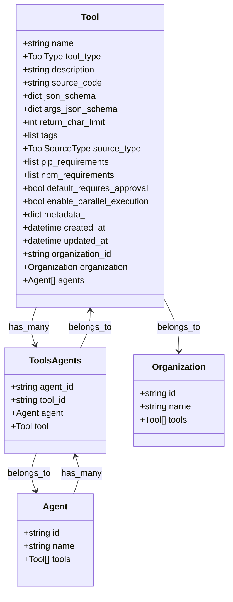
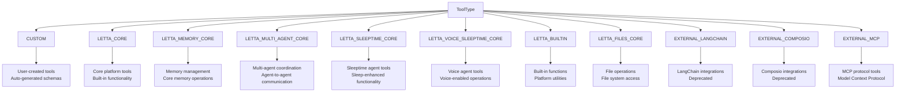
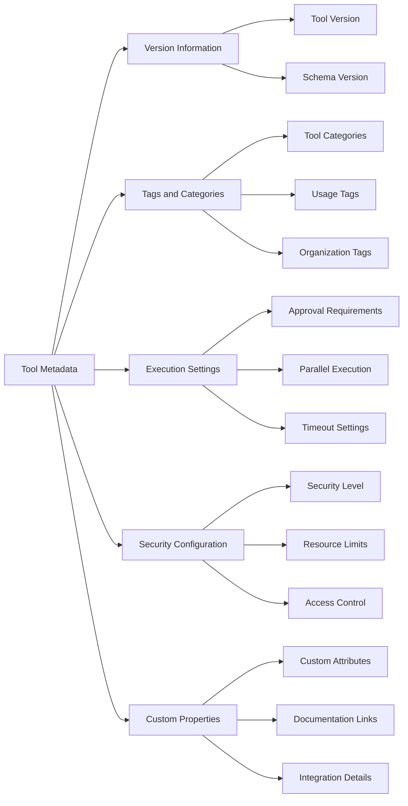
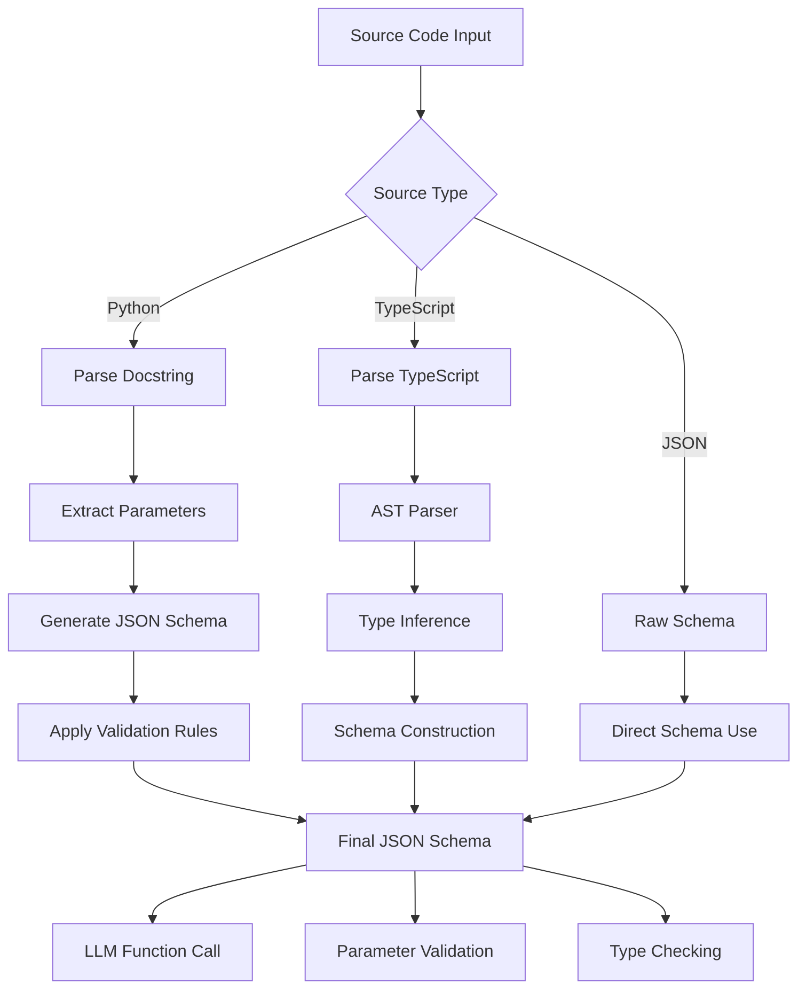
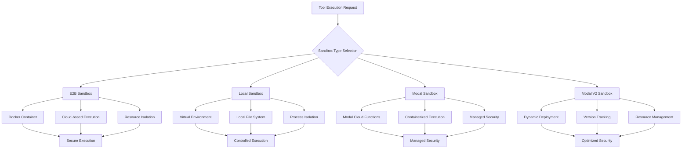
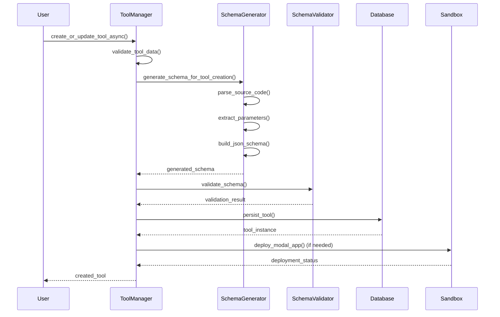
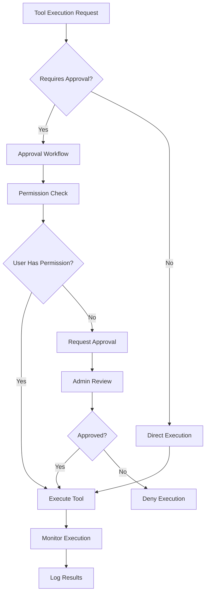
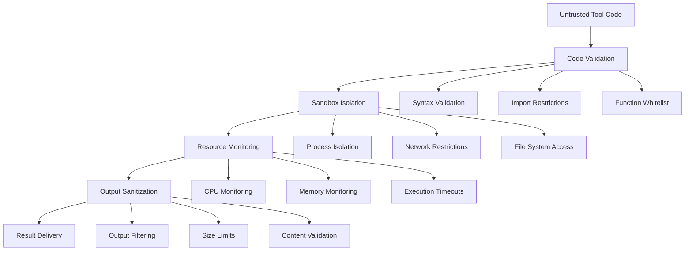

# Tool Model

<cite>
**Referenced Files in This Document**
- [letta/orm/tool.py](file://letta/orm/tool.py)
- [letta/orm/tools_agents.py](file://letta/orm/tools_agents.py)
- [letta/schemas/tool.py](file://letta/schemas/tool.py)
- [letta/schemas/enums.py](file://letta/schemas/enums.py)
- [letta/services/tool_manager.py](file://letta/services/tool_manager.py)
- [letta/services/tool_schema_generator.py](file://letta/services/tool_schema_generator.py)
- [letta/functions/schema_generator.py](file://letta/functions/schema_generator.py)
- [letta/schemas/sandbox_config.py](file://letta/schemas/sandbox_config.py)
- [letta/services/tool_sandbox/base.py](file://letta/services/tool_sandbox/base.py)
- [letta/services/tool_sandbox/e2b_sandbox.py](file://letta/services/tool_sandbox/e2b_sandbox.py)
- [letta/services/tool_sandbox/local_sandbox.py](file://letta/services/tool_sandbox/local_sandbox.py)
- [letta/services/tool_sandbox/modal_sandbox.py](file://letta/services/tool_sandbox/modal_sandbox.py)
- [letta/services/tool_sandbox/modal_sandbox_v2.py](file://letta/services/tool_sandbox/modal_sandbox_v2.py)
- [letta/services/tool_executor/tool_execution_sandbox.py](file://letta/services/tool_executor/tool_execution_sandbox.py)
</cite>

## Table of Contents
1. [Introduction](#introduction)
2. [Tool Data Model Architecture](#tool-data-model-architecture)
3. [Core Fields and Properties](#core-fields-and-properties)
4. [Tool Types and Categories](#tool-types-and-categories)
5. [Many-to-Many Relationship with Agents](#many-to-many-relationship-with-agents)
6. [Tool Versioning and Metadata](#tool-versioning-and-metadata)
7. [JSON Schema and Parameter Validation](#json-schema-and-parameter-validation)
8. [Sandboxing and Security Configuration](#sandboxing-and-security-configuration)
9. [Custom Tool Creation and Management](#custom-tool-creation-and-management)
10. [Execution Permissions and Approval Workflow](#execution-permissions-and-approval-workflow)
11. [Security Considerations](#security-considerations)
12. [Practical Examples](#practical-examples)
13. [Troubleshooting and Best Practices](#troubleshooting-and-best-practices)

## Introduction

The Tool data model in Letta represents executable functions that agents can invoke to perform specific tasks. These tools serve as the bridge between agent capabilities and real-world operations, enabling agents to interact with external systems, databases, APIs, and perform computations. The tool system is designed with security, flexibility, and extensibility in mind, supporting multiple execution environments and providing robust parameter validation.

Tools in Letta are categorized into different types, each serving specific purposes:
- **Custom Tools**: User-defined functions written in Python or TypeScript
- **Built-in Tools**: Core functionality provided by the platform
- **External Tools**: Integration with third-party services via MCP, Composio, or other protocols
- **System Tools**: Platform-specific tools for memory management, file operations, etc.

## Tool Data Model Architecture

The Tool data model is implemented as a SQLAlchemy ORM class with comprehensive field definitions and relationships. The model supports both SQL and NoSQL storage backends through the ORM abstraction layer.



**Diagram sources**
- [letta/orm/tool.py](file://letta/orm/tool.py#L16-L59)
- [letta/orm/tools_agents.py](file://letta/orm/tools_agents.py#L7-L19)

**Section sources**
- [letta/orm/tool.py](file://letta/orm/tool.py#L16-L59)
- [letta/orm/tools_agents.py](file://letta/orm/tools_agents.py#L7-L19)

## Core Fields and Properties

### Essential Tool Properties

| Field | Type | Description | Constraints |
|-------|------|-------------|-------------|
| `name` | string | Display name of the tool | Required, unique per organization |
| `tool_type` | ToolType | Category/type of the tool | Determines schema generation behavior |
| `description` | string | Human-readable description | Optional |
| `source_code` | string | Executable function code | Required for custom tools |
| `json_schema` | JSON object | OpenAI-compatible function schema | Auto-generated for custom tools |
| `args_json_schema` | JSON object | Parameter schema definition | Alternative to docstring parsing |

### Configuration Fields

| Field | Type | Default | Description |
|-------|------|---------|-------------|
| `return_char_limit` | integer | 1000000 | Maximum characters in tool response |
| `source_type` | ToolSourceType | "python" | Programming language of source code |
| `default_requires_approval` | boolean | false | Whether tool execution needs approval |
| `enable_parallel_execution` | boolean | false | Allow concurrent tool execution |

### Dependency Management

| Field | Type | Description |
|-------|------|-------------|
| `pip_requirements` | list | Python package dependencies |
| `npm_requirements` | list | JavaScript package dependencies |

**Section sources**
- [letta/orm/tool.py](file://letta/orm/tool.py#L34-L56)
- [letta/schemas/tool.py](file://letta/schemas/tool.py#L38-L69)

## Tool Types and Categories

The ToolType enumeration defines different categories of tools, each with specific characteristics and use cases:



**Diagram sources**
- [letta/schemas/enums.py](file://letta/schemas/enums.py#L194-L206)

### Tool Type Characteristics

- **CUSTOM**: User-defined tools with automatic schema generation from source code
- **LETTA_CORE**: Essential platform functionality (memory, conversation, archival)
- **LETTA_MEMORY_CORE**: Memory manipulation operations
- **LETTA_MULTI_AGENT_CORE**: Multi-agent coordination and communication
- **LETTA_SLEEPTIME_CORE**: Sleep-enhanced agent operations
- **LETTA_VOICE_SLEEPTIME_CORE**: Voice-enabled sleep operations
- **LETTA_BUILTIN**: Built-in utility functions
- **LETTA_FILES_CORE**: File system operations
- **EXTERNAL_MCP**: Third-party integrations via Model Context Protocol

**Section sources**
- [letta/schemas/enums.py](file://letta/schemas/enums.py#L194-L206)

## Many-to-Many Relationship with Agents

Tools are connected to agents through a junction table (`tools_agents`) that enables flexible tool sharing across multiple agents while maintaining individual agent configurations.

```mermaid
erDiagram
AGENT {
string id PK
string name
string organization_id FK
datetime created_at
}
TOOL {
string id PK
string name
string organization_id FK
ToolType tool_type
string source_code
dict json_schema
}
TOOLS_AGENTS {
string agent_id PK,FK
string tool_id PK,FK
unique_agent_tool "unique constraint"
}
ORGANIZATION {
string id PK
string name
datetime created_at
}
AGENT ||--o{ TOOLS_AGENTS : "has many"
TOOL ||--o{ TOOLS_AGENTS : "shared by"
TOOLS_AGENTS ||--|| AGENT : "belongs to"
TOOLS_AGENTS ||--|| TOOL : "belongs to"
AGENT }o--|| ORGANIZATION : "belongs to"
TOOL }o--|| ORGANIZATION : "belongs to"
```

**Diagram sources**
- [letta/orm/tools_agents.py](file://letta/orm/tools_agents.py#L7-L19)

### Relationship Benefits

1. **Tool Sharing**: Multiple agents can use the same tool instances
2. **Isolation**: Each agent maintains its own tool configuration
3. **Flexibility**: Tools can be selectively enabled/disabled per agent
4. **Organization Scoping**: Tools are scoped to specific organizations

**Section sources**
- [letta/orm/tools_agents.py](file://letta/orm/tools_agents.py#L7-L19)

## Tool Versioning and Metadata

Tools support rich metadata for tracking, categorization, and organizational management:

### Metadata Structure



### Versioning Features

- **Automatic Version Tracking**: Each tool version is tracked with timestamps
- **Schema Evolution**: JSON schemas can evolve independently of source code
- **Backward Compatibility**: Support for multiple schema versions
- **Migration Support**: Tools can be migrated between versions

**Section sources**
- [letta/schemas/tool.py](file://letta/schemas/tool.py#L66-L69)

## JSON Schema and Parameter Validation

The args_schema field provides structured parameter validation and OpenAI-compatible function signatures for LLM consumption.

### Schema Generation Process



**Diagram sources**
- [letta/services/tool_schema_generator.py](file://letta/services/tool_schema_generator.py#L16-L91)
- [letta/functions/schema_generator.py](file://letta/functions/schema_generator.py#L408-L526)

### Parameter Validation Features

| Feature | Description | Example |
|---------|-------------|---------|
| **Type Checking** | Automatic type validation | `int`, `string`, `boolean` |
| **Required Parameters** | Mandatory argument enforcement | `required: ["param1"]` |
| **Enum Values** | Limited choice parameters | `enum: ["option1", "option2"]` |
| **Nested Objects** | Complex parameter structures | `properties: {...}` |
| **Array Validation** | List parameter types | `type: "array"` |
| **Format Validation** | String format constraints | `format: "email"` |

### Validation Rules

1. **Strict Mode**: Enforces complete parameter specification
2. **Relaxed Mode**: Allows optional parameters with defaults
3. **Union Types**: Support for multiple possible types
4. **Recursive Validation**: Nested object validation
5. **Custom Validators**: User-defined validation logic

**Section sources**
- [letta/services/tool_schema_generator.py](file://letta/services/tool_schema_generator.py#L16-L142)
- [letta/functions/schema_generator.py](file://letta/functions/schema_generator.py#L408-L526)

## Sandboxing and Security Configuration

Letta provides multiple sandbox environments for secure tool execution, each with different security levels and capabilities.

### Sandbox Architecture



**Diagram sources**
- [letta/services/tool_sandbox/base.py](file://letta/services/tool_sandbox/base.py#L19-L396)
- [letta/schemas/sandbox_config.py](file://letta/schemas/sandbox_config.py#L26-L144)

### Sandbox Configuration Options

| Sandbox Type | Security Level | Use Case | Dependencies |
|--------------|----------------|----------|--------------|
| **E2B** | High | Production, cloud execution | E2B API key |
| **Local** | Medium | Development, testing | Python environment |
| **Modal** | High | Managed execution | Modal credentials |
| **Modal V2** | Highest | Optimized execution | Modal credentials |

### Security Features

1. **Resource Limitation**: CPU, memory, and time constraints
2. **Network Isolation**: Controlled network access
3. **File System Access**: Restricted file system permissions
4. **Package Management**: Controlled dependency installation
5. **Environment Variables**: Secure variable passing
6. **Execution Monitoring**: Real-time execution tracking

**Section sources**
- [letta/services/tool_sandbox/base.py](file://letta/services/tool_sandbox/base.py#L19-L396)
- [letta/schemas/sandbox_config.py](file://letta/schemas/sandbox_config.py#L26-L144)

## Custom Tool Creation and Management

Custom tools are the primary mechanism for extending Letta's functionality with user-defined operations.

### Tool Creation Process



**Diagram sources**
- [letta/services/tool_manager.py](file://letta/services/tool_manager.py#L194-L340)

### Tool Creation Requirements

1. **Source Code**: Valid Python function with proper docstring
2. **Function Signature**: Proper parameter annotations
3. **Docstring Format**: Google-style docstring with Args/Returns sections
4. **Naming Convention**: Descriptive, unique tool name
5. **Validation**: Schema generation and validation

### Example Tool Creation

```python
# Example custom tool creation
custom_tool = PydanticTool(
    name="calculator_tool",
    description="Mathematical operations tool",
    source_code="""
def calculator_tool(expression: str) -> str:
    \"\"\"
    Evaluate a mathematical expression.
    
    Args:
        expression (str): Mathematical expression to evaluate
        
    Returns:
        str: Result of the calculation
    \"\"\"
    try:
        result = eval(expression)
        return f"Result: {result}"
    except Exception as e:
        return f"Error: {str(e)}"
""",
    source_type="python",
    tool_type=ToolType.CUSTOM,
)

# Generate schema automatically
custom_tool.json_schema = generate_schema_for_tool_creation(custom_tool)
```

**Section sources**
- [letta/services/tool_manager.py](file://letta/services/tool_manager.py#L194-L340)
- [letta/services/tool_schema_generator.py](file://letta/services/tool_schema_generator.py#L16-L91)

## Execution Permissions and Approval Workflow

Letta implements a comprehensive permission system for controlling tool execution, especially for potentially dangerous operations.

### Permission Levels



### Permission Configuration

| Setting | Description | Default | Security Impact |
|---------|-------------|---------|-----------------|
| `default_requires_approval` | Global approval requirement | false | High |
| `enable_parallel_execution` | Concurrent tool execution | false | Medium |
| `return_char_limit` | Output size restriction | 1,000,000 | Low |
| `pip_requirements` | Package installation control | None | High |

### Approval Workflow Features

1. **Automatic Approval**: Tools marked as safe execute immediately
2. **Manual Review**: Suspicious tools require admin approval
3. **Rate Limiting**: Prevents abuse of expensive tools
4. **Audit Logging**: Complete execution history
5. **Exception Handling**: Graceful error management

**Section sources**
- [letta/schemas/tool.py](file://letta/schemas/tool.py#L58-L64)

## Security Considerations

Tool execution involves significant security risks, requiring multiple layers of protection.

### Security Architecture



### Security Measures

1. **Code Analysis**: Static analysis of tool source code
2. **Runtime Monitoring**: Continuous monitoring during execution
3. **Resource Limits**: CPU, memory, and time constraints
4. **Network Isolation**: Controlled internet access
5. **File System Restrictions**: Limited file access
6. **Import Controls**: Whitelisted module access
7. **Output Sanitization**: Clean result delivery

### Risk Mitigation Strategies

- **Principle of Least Privilege**: Tools run with minimal permissions
- **Sandbox Isolation**: Complete separation from host system
- **Monitoring and Logging**: Comprehensive audit trails
- **Rate Limiting**: Prevention of abuse and denial-of-service
- **Validation Layers**: Multiple validation checkpoints

**Section sources**
- [letta/services/tool_sandbox/base.py](file://letta/services/tool_sandbox/base.py#L19-L396)

## Practical Examples

### Basic Custom Tool

```python
# Simple calculator tool
def add_numbers(a: int, b: int) -> int:
    """
    Add two numbers together.
    
    Args:
        a (int): First number
        b (int): Second number
        
    Returns:
        int: Sum of the two numbers
    """
    return a + b
```

### Advanced Tool with Dependencies

```python
# Tool requiring external packages
def process_data(data: str, format: str = "json") -> str:
    """
    Process data with specified format.
    
    Args:
        data (str): Input data to process
        format (str): Output format (json/csv/xml)
        
    Returns:
        str: Formatted output
    """
    import json
    import pandas as pd
    
    if format == "json":
        return json.dumps({"processed": data})
    elif format == "csv":
        df = pd.DataFrame([data])
        return df.to_csv(index=False)
    else:
        return f"Processed: {data}"
```

### Tool with Environment Variables

```python
# Tool accessing environment variables
def get_environment_variable(key: str) -> str:
    """
    Retrieve environment variable value.
    
    Args:
        key (str): Environment variable name
        
    Returns:
        str: Variable value or error message
    """
    import os
    value = os.getenv(key)
    if value is None:
        return f"Environment variable '{key}' not found"
    return value
```

**Section sources**
- [tests/test_tool_schema_parsing.py](file://tests/test_tool_schema_parsing.py#L1-L200)

## Troubleshooting and Best Practices

### Common Issues and Solutions

| Issue | Cause | Solution |
|-------|-------|----------|
| **Schema Generation Failure** | Missing docstring or annotations | Add proper Google-style docstring |
| **Import Errors** | Missing dependencies | Specify pip_requirements |
| **Execution Timeout** | Long-running operations | Increase timeout or optimize code |
| **Permission Denied** | Insufficient permissions | Adjust sandbox configuration |
| **Type Validation Errors** | Incorrect parameter types | Fix type annotations |

### Best Practices

1. **Documentation**: Always include comprehensive docstrings
2. **Error Handling**: Implement robust error catching
3. **Parameter Validation**: Use type hints and validation
4. **Resource Management**: Avoid excessive resource usage
5. **Testing**: Thoroughly test tools before deployment
6. **Security**: Follow principle of least privilege
7. **Performance**: Optimize for speed and efficiency

### Development Guidelines

- **Function Design**: Keep tools focused and atomic
- **Error Messages**: Provide clear, actionable error messages
- **Logging**: Implement appropriate logging for debugging
- **Testing**: Create comprehensive test suites
- **Documentation**: Maintain up-to-date documentation

**Section sources**
- [letta/functions/schema_generator.py](file://letta/functions/schema_generator.py#L15-L60)
- [tests/test_tool_schema_parsing.py](file://tests/test_tool_schema_parsing.py#L1-L200)