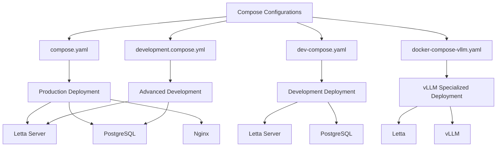
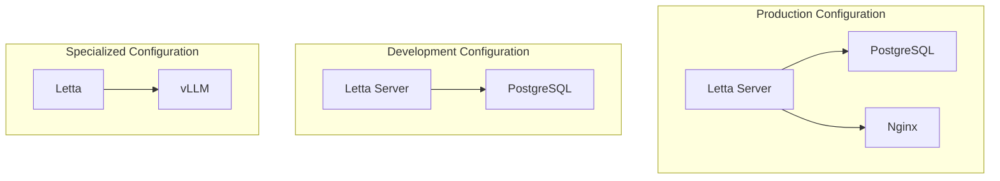
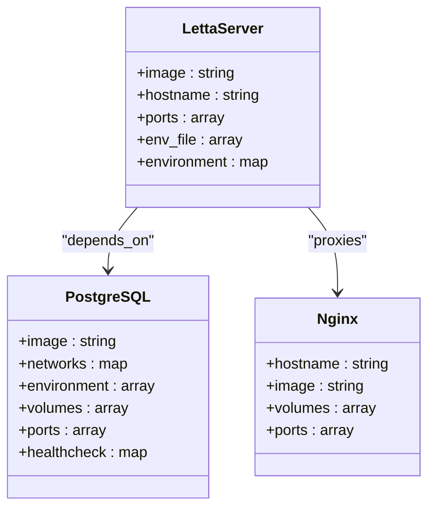
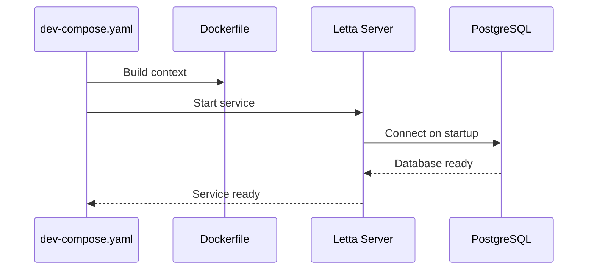
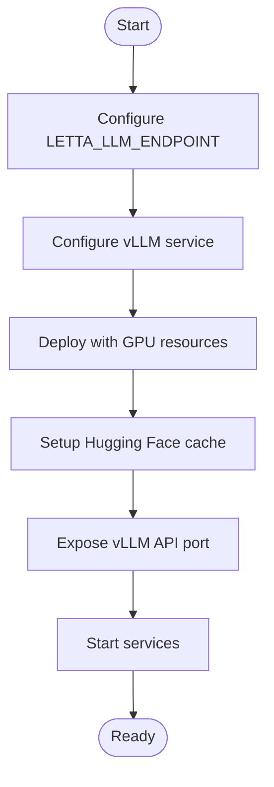
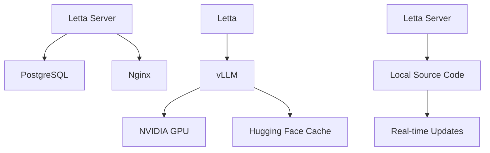

# Compose Configurations

<cite>
**Referenced Files in This Document**   
- [compose.yaml](file://compose.yaml)
- [dev-compose.yaml](file://dev-compose.yaml)
- [docker-compose-vllm.yaml](file://docker-compose-vllm.yaml)
- [development.compose.yml](file://development.compose.yml)
- [Dockerfile](file://Dockerfile)
- [init.sql](file://init.sql)
- [nginx.conf](file://nginx.conf)
- [letta/settings.py](file://letta/settings.py)
- [letta/server/startup.sh](file://letta/server/startup.sh)
- [scripts/docker-compose.yml](file://scripts/docker-compose.yml)
</cite>

## Table of Contents
1. [Introduction](#introduction)
2. [Project Structure](#project-structure)
3. [Core Components](#core-components)
4. [Architecture Overview](#architecture-overview)
5. [Detailed Component Analysis](#detailed-component-analysis)
6. [Dependency Analysis](#dependency-analysis)
7. [Performance Considerations](#performance-considerations)
8. [Troubleshooting Guide](#troubleshooting-guide)
9. [Conclusion](#conclusion)

## Introduction
This document provides a comprehensive analysis of the Docker Compose configurations for the Letta AI platform, focusing on the differences and use cases between production (`compose.yaml`), development (`dev-compose.yaml`), and specialized (`docker-compose-vllm.yaml`) deployment scenarios. The analysis covers service definitions, environment variable management, volume mounts, network setup, health checks, and deployment-specific features. The Letta platform is an AI agent framework that requires a PostgreSQL database with pgvector extension for vector storage, Redis for caching, and optional integration with vLLM for high-performance LLM inference.

**Section sources**
- [compose.yaml](file://compose.yaml)
- [dev-compose.yaml](file://dev-compose.yaml)
- [docker-compose-vllm.yaml](file://docker-compose-vllm.yaml)

## Project Structure
The Letta project structure includes multiple Docker Compose files for different deployment scenarios, with a clear separation between production, development, and specialized configurations. The core services include the Letta server, PostgreSQL database with pgvector extension, and optional components like vLLM for LLM inference. The configuration files are organized to support different deployment requirements, with shared components like the initialization SQL script and nginx configuration.

**Diagram sources **
- [compose.yaml](file://compose.yaml)
- [dev-compose.yaml](file://dev-compose.yaml)
- [docker-compose-vllm.yaml](file://docker-compose-vllm.yaml)
- [development.compose.yml](file://development.compose.yml)

**Section sources**
- [compose.yaml](file://compose.yaml)
- [dev-compose.yaml](file://dev-compose.yaml)
- [docker-compose-vllm.yaml](file://docker-compose-vllm.yaml)
- [development.compose.yml](file://development.compose.yml)

## Core Components
The core components of the Letta platform include the Letta server, PostgreSQL database with pgvector extension, and optional vLLM integration. The `compose.yaml` file defines the production configuration with persistent storage, health checks, and nginx reverse proxy. The `dev-compose.yaml` file provides a development configuration with local build capabilities and simplified environment variable management. The `docker-compose-vllm.yaml` file enables specialized deployment with vLLM for high-performance LLM inference, requiring GPU resources.

**Section sources**
- [compose.yaml](file://compose.yaml#L1-L66)
- [dev-compose.yaml](file://dev-compose.yaml#L1-L49)
- [docker-compose-vllm.yaml](file://docker-compose-vllm.yaml#L1-L36)

## Architecture Overview
The Letta platform architecture consists of three main Docker Compose configurations that support different deployment scenarios. The production configuration (`compose.yaml`) includes a complete stack with Letta server, PostgreSQL database, and nginx reverse proxy. The development configuration (`dev-compose.yaml`) focuses on local development with direct service access and simplified configuration. The specialized configuration (`docker-compose-vllm.yaml`) enables high-performance LLM inference using vLLM with GPU acceleration.

**Diagram sources **
- [compose.yaml](file://compose.yaml#L1-L66)
- [dev-compose.yaml](file://dev-compose.yaml#L1-L49)
- [docker-compose-vllm.yaml](file://docker-compose-vllm.yaml#L1-L36)

## Detailed Component Analysis

### Production Configuration Analysis
The production configuration in `compose.yaml` defines a robust deployment setup with persistent storage, health checks, and nginx reverse proxy. The Letta server service uses a pre-built image with environment variables for database connection and LLM provider configuration. The PostgreSQL service uses the ankane/pgvector image with persistent storage and initialization script. The nginx service provides reverse proxy functionality with configuration from nginx.conf.

**Diagram sources **
- [compose.yaml](file://compose.yaml#L1-L66)
- [nginx.conf](file://nginx.conf)

**Section sources**
- [compose.yaml](file://compose.yaml#L1-L66)
- [nginx.conf](file://nginx.conf)

### Development Configuration Analysis
The development configuration in `dev-compose.yaml` provides a simplified setup for local development. The Letta server service uses a local build with the Dockerfile, allowing for code changes to be reflected in the container. The configuration includes direct port mapping for the Letta server and PostgreSQL database, making it easier to access services during development. Environment variables are managed through the compose file rather than an external .env file.

**Diagram sources **
- [dev-compose.yaml](file://dev-compose.yaml#L1-L49)
- [Dockerfile](file://Dockerfile)

**Section sources**
- [dev-compose.yaml](file://dev-compose.yaml#L1-L49)
- [Dockerfile](file://Dockerfile)

### Specialized vLLM Configuration Analysis
The specialized vLLM configuration in `docker-compose-vllm.yaml` enables high-performance LLM inference with GPU acceleration. The configuration includes a vLLM service with NVIDIA GPU runtime and resource reservations. The Letta service is configured to use the vLLM endpoint for LLM inference. This configuration is designed for deployments requiring high-throughput LLM processing with GPU resources.

**Diagram sources **
- [docker-compose-vllm.yaml](file://docker-compose-vllm.yaml#L1-L36)

**Section sources**
- [docker-compose-vllm.yaml](file://docker-compose-vllm.yaml#L1-L36)

### Advanced Development Configuration Analysis
The advanced development configuration in `development.compose.yml` provides enhanced development capabilities with code reloading and comprehensive volume mounts. The configuration includes volume mounts for the Letta source code, credentials, and test files, enabling real-time code changes and testing. This configuration is designed for active development and testing of the Letta platform.

**Section sources**
- [development.compose.yml](file://development.compose.yml)

## Dependency Analysis
The Docker Compose configurations have a clear dependency structure with the Letta server depending on the PostgreSQL database in all configurations. The production configuration adds a dependency on the nginx service for reverse proxy functionality. The vLLM configuration introduces a dependency on GPU resources and Hugging Face model caching. The configurations share common dependencies on initialization scripts and environment variable management.

**Diagram sources **
- [compose.yaml](file://compose.yaml)
- [dev-compose.yaml](file://dev-compose.yaml)
- [docker-compose-vllm.yaml](file://docker-compose-vllm.yaml)
- [development.compose.yml](file://development.compose.yml)

**Section sources**
- [compose.yaml](file://compose.yaml)
- [dev-compose.yaml](file://dev-compose.yaml)
- [docker-compose-vllm.yaml](file://docker-compose-vllm.yaml)
- [development.compose.yml](file://development.compose.yml)

## Performance Considerations
The different Docker Compose configurations have distinct performance characteristics. The production configuration prioritizes stability and security with nginx reverse proxy and persistent storage. The development configuration focuses on developer productivity with code reloading and simplified access. The vLLM configuration is optimized for high-performance LLM inference with GPU acceleration and large model support. Resource constraints and performance tuning can be adjusted based on the deployment scenario and hardware capabilities.

**Section sources**
- [compose.yaml](file://compose.yaml)
- [dev-compose.yaml](file://dev-compose.yaml)
- [docker-compose-vllm.yaml](file://docker-compose-vllm.yaml)

## Troubleshooting Guide
Common issues with the Docker Compose configurations include service startup order, network isolation, and volume permission errors. The production configuration may encounter nginx configuration issues or database connection problems. The development configuration may have build issues with the Dockerfile or code reloading problems. The vLLM configuration may face GPU resource allocation issues or model loading errors. Proper environment variable management and volume mount configuration are critical for successful deployment.

**Section sources**
- [compose.yaml](file://compose.yaml)
- [dev-compose.yaml](file://dev-compose.yaml)
- [docker-compose-vllm.yaml](file://docker-compose-vllm.yaml)
- [letta/server/startup.sh](file://letta/server/startup.sh)

## Conclusion
The Letta platform provides multiple Docker Compose configurations to support different deployment scenarios, from production to development to specialized high-performance inference. Each configuration is tailored to its specific use case, with appropriate service definitions, environment variable management, and resource allocation. Understanding the differences between these configurations is essential for successful deployment and operation of the Letta AI platform. The configurations demonstrate best practices in container orchestration, with clear separation of concerns and appropriate use of Docker Compose features.