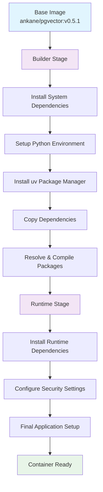
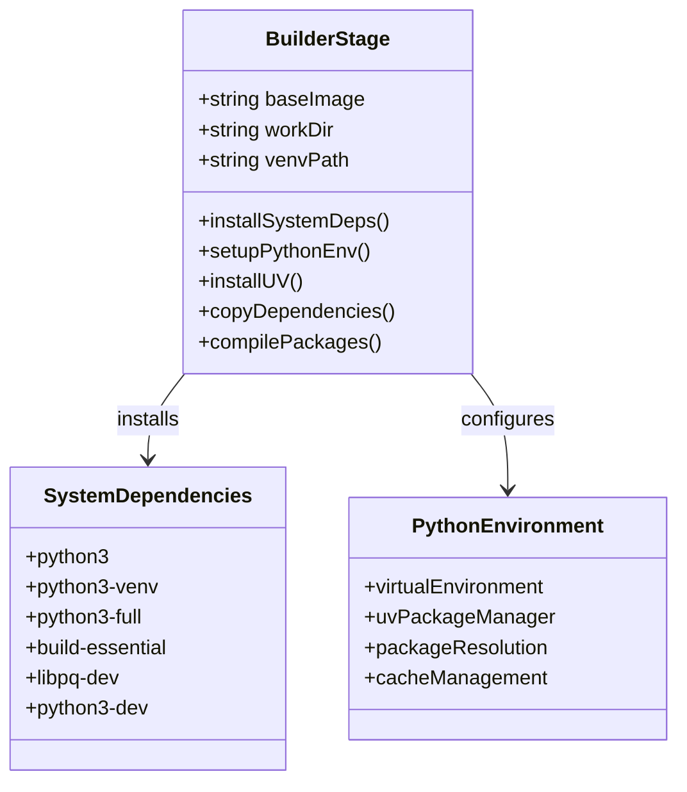
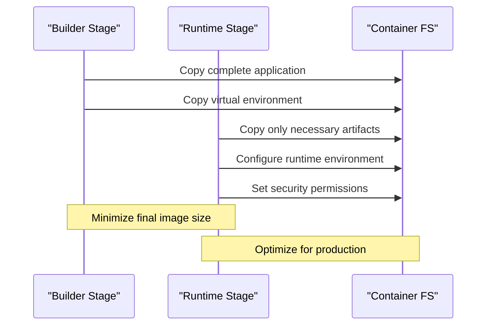
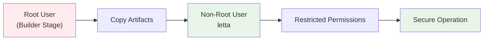
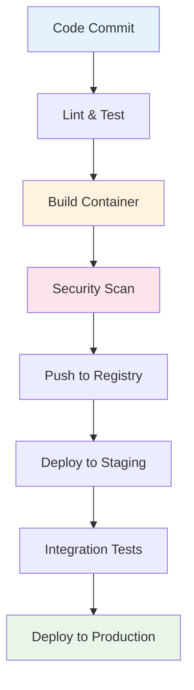
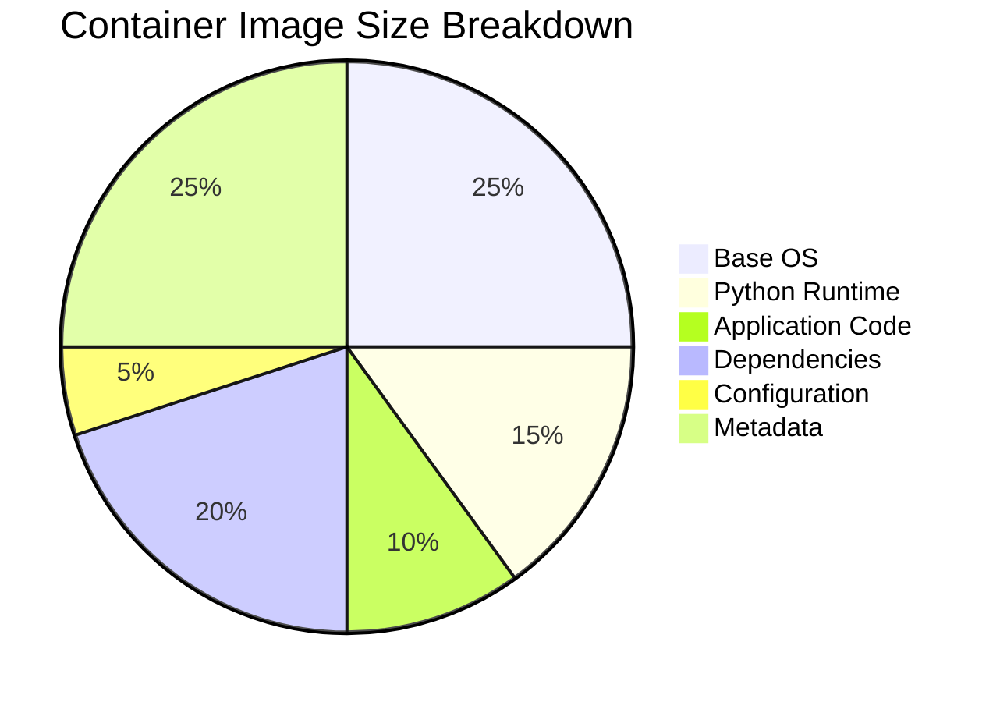

# Docker Build Process

<cite>
**Referenced Files in This Document**
- [Dockerfile](file://Dockerfile)
- [pyproject.toml](file://pyproject.toml)
- [init.sql](file://init.sql)
- [scripts/pack_docker.sh](file://scripts/pack_docker.sh)
- [compose.yaml](file://compose.yaml)
- [dev-compose.yaml](file://dev-compose.yaml)
- [development.compose.yml](file://development.compose.yml)
- [scripts/docker-compose.yml](file://scripts/docker-compose.yml)
- [letta/server/startup.sh](file://letta/server/startup.sh)
- [scripts/wait_for_service.sh](file://scripts/wait_for_service.sh)
- [otel/otel-collector-config-file.yaml](file://otel/otel-collector-config-file.yaml)
</cite>

## Table of Contents
1. [Introduction](#introduction)
2. [Multi-Stage Build Architecture](#multi-stage-build-architecture)
3. [Builder Stage Analysis](#builder-stage-analysis)
4. [Runtime Stage Analysis](#runtime-stage-analysis)
5. [Base Images and Dependencies](#base-images-and-dependencies)
6. [Build Commands and Optimization](#build-commands-and-optimization)
7. [Security Configuration](#security-configuration)
8. [Common Build Issues and Solutions](#common-build-issues-and-solutions)
9. [CI/CD Best Practices](#cicd-best-practices)
10. [Performance Optimization](#performance-optimization)

## Introduction

Letta employs a sophisticated multi-stage Docker build process designed to optimize image size, security, and build performance. The Dockerfile implements a builder pattern that separates dependency resolution, compilation, and runtime preparation into distinct stages, resulting in efficient container images suitable for production deployment.

The build process leverages modern containerization practices including:
- Multi-stage builds for minimal final image size
- Dependency caching strategies for faster incremental builds
- Security-focused non-root user configuration
- Optimized base images with pre-installed system dependencies
- Comprehensive environment variable management

## Multi-Stage Build Architecture

The Letta Docker build follows a two-stage architecture that maximizes efficiency and security:



**Diagram sources**
- [Dockerfile](file://Dockerfile#L1-L89)

The architecture separates concerns between dependency resolution and runtime execution, enabling:
- **Builder Stage**: Full development environment with build tools and dependencies
- **Runtime Stage**: Minimal production-ready environment with only essential components

**Section sources**
- [Dockerfile](file://Dockerfile#L1-L89)

## Builder Stage Analysis

### Purpose and Structure

The builder stage serves as the foundation for dependency resolution and package compilation. It creates a complete Python environment with all required dependencies before transferring only necessary artifacts to the runtime stage.



**Diagram sources**
- [Dockerfile](file://Dockerfile#L2-L18)
- [Dockerfile](file://Dockerfile#L27-L39)

### Dependency Resolution with uv

The builder stage utilizes the modern `uv` package manager for efficient dependency resolution and installation. This choice provides several advantages:

- **Speed**: uv is significantly faster than traditional pip-based installations
- **Efficiency**: Optimized dependency resolution reduces build times
- **Caching**: Advanced caching mechanisms improve incremental build performance

The dependency resolution process follows these steps:

1. **Environment Setup**: Configures Python preferences and cache directories
2. **Virtual Environment Creation**: Establishes isolated Python environment
3. **Package Installation**: Resolves and compiles all dependencies using uv sync
4. **Version Pinning**: Ensures reproducible builds through locked dependencies

### Compilation and Virtual Environment Optimization

The builder stage optimizes the Python virtual environment through strategic layering:

- **Layer Separation**: System dependencies and Python packages are installed in separate layers
- **Cache Persistence**: Virtual environment creation and package installation are cached separately
- **Size Optimization**: Only essential Python packages are included in the final image

**Section sources**
- [Dockerfile](file://Dockerfile#L14-L39)
- [pyproject.toml](file://pyproject.toml#L1-L206)

## Runtime Stage Analysis

### Artifact Transfer Strategy

The runtime stage implements a selective artifact copying strategy that minimizes image size while maintaining functionality:



**Diagram sources**
- [Dockerfile](file://Dockerfile#L42-L81)

### System-Level Dependencies Installation

The runtime stage installs only essential system dependencies required for production operation:

- **Python Runtime**: Core Python interpreter and libraries
- **PostgreSQL Client**: Database connectivity libraries
- **Node.js**: JavaScript runtime for frontend components
- **OpenTelemetry Collector**: Observability infrastructure

### Port Configuration and Exposure

The runtime stage exposes multiple ports to support various deployment scenarios:

| Port | Purpose | Description |
|------|---------|-------------|
| 8283 | HTTP API | Main REST API endpoint |
| 5432 | PostgreSQL | Database communication |
| 4317 | OTLP gRPC | OpenTelemetry traces (gRPC) |
| 4318 | OTLP HTTP | OpenTelemetry traces (HTTP) |

**Section sources**
- [Dockerfile](file://Dockerfile#L42-L89)

## Base Images and Dependencies

### Primary Base Image: ankane/pgvector:v0.5.1

The build process utilizes the `ankane/pgvector:v0.5.1` base image, which provides:

- **PostgreSQL Foundation**: Pre-installed PostgreSQL with vector extension support
- **Vector Database Capabilities**: Built-in support for pgvector operations
- **Production Stability**: Well-tested and maintained base image
- **Security Updates**: Regular security patches and updates

### Secondary Dependencies

The build process incorporates several categories of dependencies:

#### Core Python Dependencies
- **FastAPI**: Web framework for API endpoints
- **SQLAlchemy**: ORM for database operations
- **Pydantic**: Data validation and serialization
- **OpenTelemetry**: Distributed tracing and observability

#### Optional Dependencies
- **Redis**: In-memory data structure store
- **Pinecone**: Vector database integration
- **Modal**: Cloud computing platform integration
- **Desktop Tools**: Local development utilities

#### Development Dependencies
- **pytest**: Testing framework
- **ruff**: Code linting and formatting
- **pre-commit**: Git hooks for code quality

**Section sources**
- [Dockerfile](file://Dockerfile#L2-L41)
- [pyproject.toml](file://pyproject.toml#L11-L151)

## Build Commands and Optimization

### Standard Build Command

The basic build command for creating Letta containers:

```bash
docker build -t letta/letta:latest .
```

### Multi-Platform Targeting

For cross-platform deployments, use the buildx command:

```bash
docker buildx build --platform=linux/amd64,linux/arm64,linux/x86_64 \
  --build-arg LETTA_ENVIRONMENT=RELEASE \
  -t letta/letta:${VERSION} .
```

### Cache Optimization Strategies

The Dockerfile implements several caching optimization techniques:

#### Layer Caching Order
1. **Base Image**: Leverages Docker's layer cache
2. **System Dependencies**: Cached separately from application code
3. **Virtual Environment**: Isolated caching for Python packages
4. **Application Code**: Last layer to maximize cache effectiveness

#### Build Argument Optimization
- **Environment Variables**: Passed as build arguments for flexibility
- **Version Management**: Dynamic version injection for reproducible builds
- **Feature Flags**: Conditional compilation based on build arguments

### Production Build Script

The project includes an automated packaging script that handles multi-platform builds:

```bash
export LETTA_VERSION=$(letta version)
docker buildx build --platform=linux/amd64,linux/arm64,linux/x86_64 \
  --build-arg LETTA_ENVIRONMENT=RELEASE \
  -t letta/letta-server:${LETTA_VERSION} .
docker push letta/letta-server:${LETTA_VERSION}
```

**Section sources**
- [scripts/pack_docker.sh](file://scripts/pack_docker.sh#L1-L4)

## Security Configuration

### Non-Root User Implementation

The runtime stage implements security best practices through careful user and permission management:



**Diagram sources**
- [Dockerfile](file://Dockerfile#L42-L89)

### Security Features Implemented

#### Container Hardening
- **Non-Root Execution**: Application runs under dedicated non-root user
- **Minimal Attack Surface**: Only essential ports exposed
- **Secure Defaults**: Safe default configurations for all services

#### Credential Management
- **Environment Variables**: Secure credential passing through environment
- **Secrets Integration**: Support for Docker secrets and external credential stores
- **Connection Strings**: Encrypted database connections

#### Network Security
- **Port Exposure Control**: Selective port exposure based on deployment needs
- **Internal Communication**: Secure inter-container communication
- **TLS Support**: Optional secure communication protocols

**Section sources**
- [Dockerfile](file://Dockerfile#L66-L89)
- [letta/server/startup.sh](file://letta/server/startup.sh#L41-L48)

## Common Build Issues and Solutions

### Dependency Conflicts

**Problem**: Version conflicts between Python packages during installation.

**Solution**: 
- Use `uv sync --frozen` to ensure reproducible dependency resolution
- Pin specific versions in `pyproject.toml` for critical dependencies
- Clear uv cache periodically with `uv cache clean`

**Example Resolution**:
```bash
# Clear cache and rebuild
docker build --no-cache --build-arg UV_CACHE_DIR=/tmp/uv_cache .
```

### Missing Build Tools

**Problem**: Absence of required system build tools for native package compilation.

**Solution**:
- Ensure `build-essential` and `python3-dev` are installed in builder stage
- Use pre-built wheels when available to avoid compilation
- Specify compatible Python versions in `pyproject.toml`

### Layer Caching Inefficiencies

**Problem**: Docker cache misses causing slow incremental builds.

**Solution**:
- Order COPY commands to maximize cache utilization
- Separate dependency installation from application code
- Use `.dockerignore` to exclude unnecessary files

**Optimization Example**:
```dockerfile
# Good: Separate dependency and code layers
COPY pyproject.toml uv.lock ./
RUN uv sync --frozen --no-dev --all-extras

COPY . .
```

### Memory and Resource Constraints

**Problem**: Build failures due to insufficient memory or disk space.

**Solution**:
- Increase Docker daemon memory limits
- Use multi-stage builds to reduce peak memory usage
- Clean up intermediate images regularly

**Section sources**
- [Dockerfile](file://Dockerfile#L5-L12)
- [Dockerfile](file://Dockerfile#L39)

## CI/CD Best Practices

### Automated Build Pipeline

Implement a comprehensive CI/CD pipeline for reliable container deployments:



### Build Verification Steps

#### Multi-Architecture Support
- Test builds on multiple architectures (amd64, arm64)
- Verify functionality across different platforms
- Use buildx for cross-platform testing

#### Security Scanning
- Integrate vulnerability scanners (Trivy, Snyk)
- Scan base images for known vulnerabilities
- Monitor dependency updates for security patches

#### Performance Testing
- Measure container startup times
- Validate memory and CPU usage
- Test concurrent request handling

### Deployment Strategies

#### Blue-Green Deployment
- Maintain two identical production environments
- Switch traffic between environments seamlessly
- Rollback quickly in case of issues

#### Canary Releases
- Gradually shift traffic to new versions
- Monitor key performance indicators
- Automate rollback on failure detection

**Section sources**
- [scripts/pack_docker.sh](file://scripts/pack_docker.sh#L2)

## Performance Optimization

### Build Time Optimization

#### Parallel Build Execution
- Utilize Docker buildx for parallel builds
- Leverage multi-platform capabilities
- Distribute build tasks across multiple workers

#### Dependency Caching
- Implement intelligent layer caching strategies
- Use build arguments for cache-friendly dependency resolution
- Maintain separate caches for different dependency sets

#### Image Size Optimization



**Diagram sources**
- [Dockerfile](file://Dockerfile#L42-L89)

### Runtime Performance Tuning

#### Resource Allocation
- Configure appropriate memory limits for containers
- Set CPU quotas for predictable performance
- Monitor and adjust resource allocation based on usage patterns

#### Connection Pooling
- Implement database connection pooling
- Use Redis for caching frequently accessed data
- Optimize API response times through efficient data structures

#### Monitoring and Observability
- Deploy OpenTelemetry collectors for distributed tracing
- Monitor container health and performance metrics
- Implement alerting for performance degradation

### Scalability Considerations

#### Horizontal Scaling
- Design stateless application components
- Use load balancers for traffic distribution
- Implement session affinity when necessary

#### Vertical Scaling
- Configure auto-scaling based on resource usage
- Set up alerts for capacity planning
- Monitor scaling effectiveness and costs

**Section sources**
- [otel/otel-collector-config-file.yaml](file://otel/otel-collector-config-file.yaml#L1-L31)
- [letta/server/startup.sh](file://letta/server/startup.sh#L56-L66)