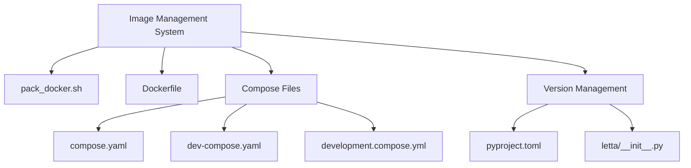
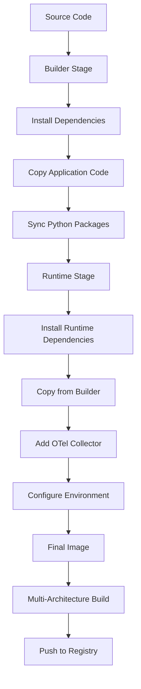
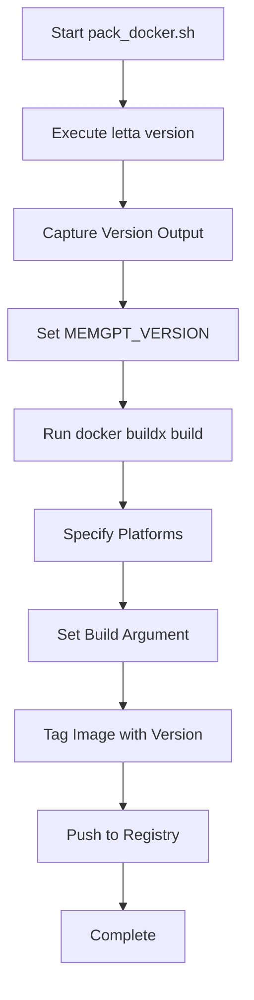
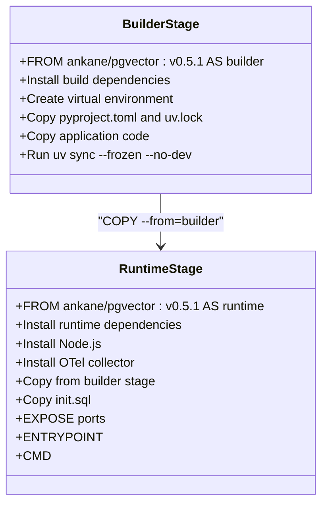
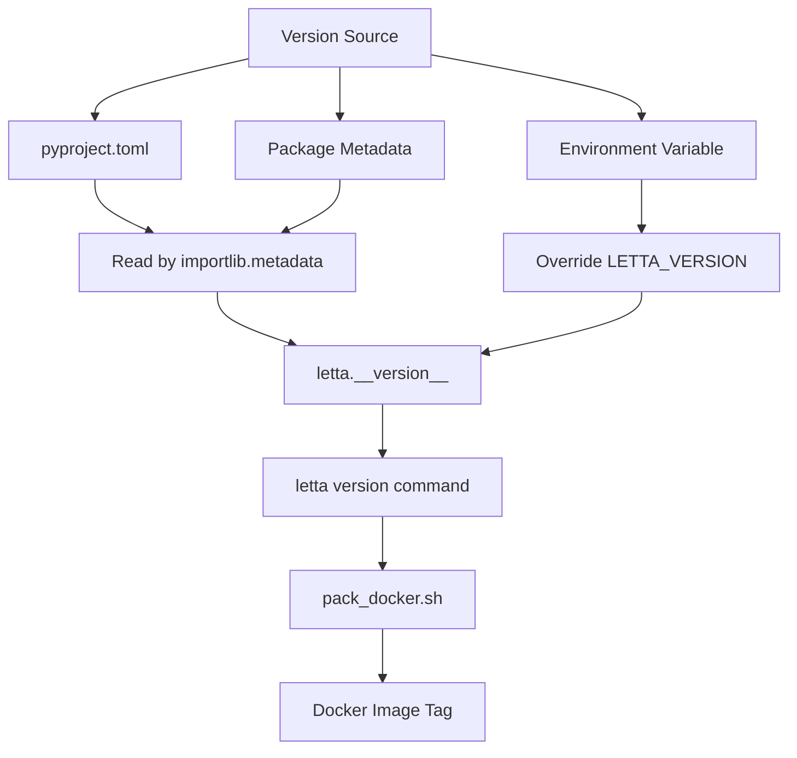
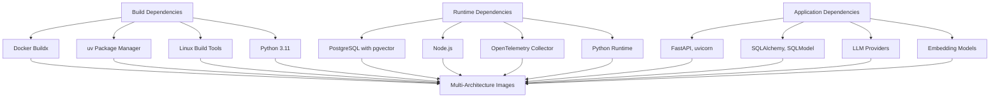

# Image Management

<cite>
**Referenced Files in This Document**   
- [pack_docker.sh](file://scripts/pack_docker.sh)
- [Dockerfile](file://Dockerfile)
- [pyproject.toml](file://pyproject.toml)
- [compose.yaml](file://compose.yaml)
- [dev-compose.yaml](file://dev-compose.yaml)
- [development.compose.yml](file://development.compose.yml)
- [__init__.py](file://letta/__init__.py)
</cite>

## Table of Contents
1. [Introduction](#introduction)
2. [Project Structure](#project-structure)
3. [Core Components](#core-components)
4. [Architecture Overview](#architecture-overview)
5. [Detailed Component Analysis](#detailed-component-analysis)
6. [Dependency Analysis](#dependency-analysis)
7. [Performance Considerations](#performance-considerations)
8. [Troubleshooting Guide](#troubleshooting-guide)
9. [Conclusion](#conclusion)

## Introduction
This document provides comprehensive documentation for the Image Management system in the Letta project, focusing on the `pack_docker.sh` script used for building, tagging, and pushing Docker images. The system supports multi-architecture image building using Docker Buildx, integrates with CI/CD pipelines, and implements a robust tagging strategy for both development and release workflows. The documentation covers the complete image lifecycle from version extraction to registry pushing, including security best practices and extension points for private registries and air-gapped environments.

## Project Structure
The Letta project follows a modular structure with clear separation of concerns. The image management functionality is primarily centered around the `scripts` directory, which contains the `pack_docker.sh` script responsible for Docker image operations. The project includes multiple Docker Compose configuration files for different environments (development, testing, production), and a comprehensive `Dockerfile` that defines the multi-stage build process.

The core application code resides in the `letta` directory, with the version information exposed through the `__init__.py` file. Dependency management is handled via `pyproject.toml` and `uv.lock`, while various compose files (`compose.yaml`, `dev-compose.yaml`, `development.compose.yml`) define service configurations for different deployment scenarios.

**Diagram sources**
- [scripts/pack_docker.sh](file://scripts/pack_docker.sh#L1-L3)
- [Dockerfile](file://Dockerfile#L1-L89)
- [pyproject.toml](file://pyproject.toml#L1-L206)

**Section sources**
- [scripts/pack_docker.sh](file://scripts/pack_docker.sh#L1-L3)
- [Dockerfile](file://Dockerfile#L1-L89)
- [compose.yaml](file://compose.yaml#L1-L66)
- [dev-compose.yaml](file://dev-compose.yaml#L1-L49)

## Core Components
The core components of the image management system include the `pack_docker.sh` script, the `Dockerfile`, and the version extraction mechanism. The `pack_docker.sh` script orchestrates the entire image building and publishing process, extracting the version from the application metadata and using Docker Buildx to create multi-architecture images. The `Dockerfile` implements a multi-stage build process that separates dependency installation from the runtime environment, optimizing image size and security.

The version extraction mechanism leverages the `letta version` command, which reads the version from the `pyproject.toml` file or the package metadata, ensuring consistency between the application version and the Docker image tag. This integration between the application code and the build process ensures that each Docker image is accurately versioned and traceable to a specific code state.

**Section sources**
- [pack_docker.sh](file://scripts/pack_docker.sh#L1-L3)
- [Dockerfile](file://Dockerfile#L1-L89)
- [pyproject.toml](file://pyproject.toml#L1-L3)
- [letta/__init__.py](file://letta/__init__.py#L1-L8)

## Architecture Overview
The image management architecture follows a multi-stage build approach with clear separation between build-time and runtime components. The system uses Docker Buildx to enable cross-platform image building, supporting multiple architectures (amd64, arm64, x86_64) from a single build command. This allows the creation of universal images that can run on different hardware platforms without modification.

The architecture incorporates a builder stage that installs all dependencies and prepares the application environment, followed by a runtime stage that creates a minimal production image. This approach reduces the final image size and attack surface by excluding build tools and intermediate files. The system also integrates OpenTelemetry for observability, with collector configurations included in the image for monitoring and tracing capabilities.

**Diagram sources**
- [Dockerfile](file://Dockerfile#L1-L89)
- [pack_docker.sh](file://scripts/pack_docker.sh#L1-L3)

## Detailed Component Analysis

### pack_docker.sh Script Analysis
The `pack_docker.sh` script is the central component of the image management system, responsible for automating the build, tag, and push process. The script extracts the version information by calling `letta version`, which retrieves the version from the application's metadata. This version is then used as the Docker image tag, ensuring that each image is uniquely identifiable and traceable to a specific release.

The script uses Docker Buildx with the `--platform` flag to build images for multiple architectures simultaneously, creating a truly portable container image. The build process includes setting the `MEMGPT_ENVIRONMENT` build argument to "RELEASE", which can be used within the Dockerfile to conditionally include or exclude components based on the build environment.

**Diagram sources**
- [pack_docker.sh](file://scripts/pack_docker.sh#L1-L3)

**Section sources**
- [pack_docker.sh](file://scripts/pack_docker.sh#L1-L3)

### Dockerfile Analysis
The `Dockerfile` implements a multi-stage build process with two main stages: builder and runtime. The builder stage uses the `ankane/pgvector:v0.5.1` base image and installs all build dependencies, including Python, build tools, and PostgreSQL development libraries. It creates a virtual environment and uses `uv` to install Python dependencies from `pyproject.toml` and `uv.lock`, ensuring reproducible builds.

The runtime stage also starts with the `ankane/pgvector:v0.5.1` base image but installs only the necessary runtime components, including Node.js, curl, and the OpenTelemetry collector. It copies the application code and dependencies from the builder stage, resulting in a lean production image. The Dockerfile exposes multiple ports for different services (8283 for the application, 5432 for PostgreSQL, 4317/4318 for OTel) and includes initialization SQL for database setup.

**Diagram sources**
- [Dockerfile](file://Dockerfile#L1-L89)

**Section sources**
- [Dockerfile](file://Dockerfile#L1-L89)

### Version Management Analysis
The version management system integrates application code with the build process through multiple mechanisms. The primary version source is the `pyproject.toml` file, which contains the version declaration in the project configuration. This version is exposed through the Python package metadata and can be accessed programmatically via the `importlib.metadata.version` function.

The system provides fallback mechanisms for development environments, where the package might not be installed in the traditional way. In such cases, a default version is used, or the version can be overridden via the `LETTA_VERSION` environment variable. The `letta version` command provides a consistent interface for retrieving the version, which is used by the `pack_docker.sh` script to tag Docker images.

**Diagram sources**
- [pyproject.toml](file://pyproject.toml#L1-L3)
- [letta/__init__.py](file://letta/__init__.py#L1-L11)
- [pack_docker.sh](file://scripts/pack_docker.sh#L1)

**Section sources**
- [pyproject.toml](file://pyproject.toml#L1-L3)
- [letta/__init__.py](file://letta/__init__.py#L1-L11)

## Dependency Analysis
The image management system has dependencies across multiple layers, from build tools to runtime components. The build process depends on Docker Buildx for multi-architecture support, `uv` for Python package management, and standard Linux build tools (gcc, make, etc.) for compiling native extensions.

At the runtime level, the system depends on PostgreSQL with pgvector for vector storage, Node.js for any JavaScript-based components, and the OpenTelemetry collector for observability. The application itself has numerous Python dependencies declared in `pyproject.toml`, including web frameworks (FastAPI, uvicorn), database tools (SQLAlchemy, pgvector), and LLM providers (OpenAI, Anthropic, etc.).

The compose files reveal additional dependencies for development and testing environments, including Redis for caching and various database configurations. The system is designed to be extensible, with optional dependency groups that can be included based on deployment requirements (e.g., cloud tool sandbox, modal integration, external tools).

**Diagram sources**
- [Dockerfile](file://Dockerfile#L1-L89)
- [pyproject.toml](file://pyproject.toml#L1-L206)
- [compose.yaml](file://compose.yaml#L1-L66)

**Section sources**
- [Dockerfile](file://Dockerfile#L1-L89)
- [pyproject.toml](file://pyproject.toml#L1-L206)
- [compose.yaml](file://compose.yaml#L1-L66)

## Performance Considerations
The image management system incorporates several performance optimizations to reduce build times and improve runtime efficiency. The multi-stage Docker build process separates build dependencies from runtime dependencies, resulting in smaller image sizes and faster container startup times. The use of `uv` for package installation provides faster dependency resolution and installation compared to traditional pip-based approaches.

The multi-architecture build capability allows organizations to maintain a single image repository that supports multiple hardware platforms, simplifying distribution and deployment. However, this comes with increased build times as images must be built for each target architecture. The system could be optimized further by implementing build caching strategies and parallelizing build operations where possible.

For production deployments, the runtime image is optimized by excluding development tools and unnecessary packages, reducing the attack surface and memory footprint. The inclusion of the OpenTelemetry collector enables performance monitoring and tracing, allowing teams to identify and address performance bottlenecks in the application.

## Troubleshooting Guide
Common issues with the image management system typically fall into several categories: version extraction problems, build failures, push authentication issues, and multi-architecture compatibility problems.

For version extraction issues, ensure that the `letta` command is available in the PATH and that the version can be retrieved by running `letta version` directly. If the version is not being detected correctly, check that the `pyproject.toml` file contains the correct version and that the package is properly installed.

Build failures often relate to missing build dependencies or network issues during package installation. Ensure that Docker Buildx is properly configured and that the build environment has internet access to download dependencies. For air-gapped environments, consider pre-loading the base images and dependency caches.

Push authentication issues can occur if the Docker registry credentials are not properly configured. Ensure that the user is logged into the target registry using `docker login` and that the registry URL and repository name in the image tag are correct.

Multi-architecture build problems may arise from insufficient resources or incompatible base images. Verify that the Docker daemon has access to sufficient CPU and memory resources, and that the base images support all target architectures.

**Section sources**
- [pack_docker.sh](file://scripts/pack_docker.sh#L1-L3)
- [Dockerfile](file://Dockerfile#L1-L89)

## Conclusion
The image management system in the Letta project provides a robust, automated solution for building, tagging, and distributing Docker images. By leveraging modern Docker features like Buildx and multi-stage builds, the system ensures consistent, portable, and secure container images across different environments and hardware platforms.

The tight integration between application versioning and image tagging ensures traceability and reproducibility, while the flexible configuration supports both development and production workflows. The system could be further enhanced with additional security features like image signing, vulnerability scanning, and automated policy enforcement to strengthen the overall security posture.

For organizations looking to extend this system, the modular design allows for easy adaptation to private registries, air-gapped environments, and specialized deployment requirements. The comprehensive documentation and well-structured codebase make it accessible for teams to customize and extend according to their specific needs.