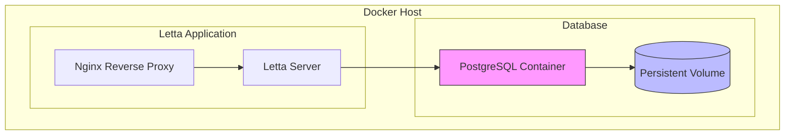

# Backup and Recovery

<cite>
**Referenced Files in This Document**   
- [compose.yaml](file://compose.yaml)
- [db/run_postgres.sh](file://db/run_postgres.sh)
- [init.sql](file://init.sql)
- [letta/server/startup.sh](file://letta/server/startup.sh)
- [Dockerfile](file://Dockerfile)
- [otel/otel-collector-config-file.yaml](file://otel/otel-collector-config-file.yaml)
- [dev-compose.yaml](file://dev-compose.yaml)
</cite>

## Table of Contents
1. [Introduction](#introduction)
2. [Containerized PostgreSQL Environment](#containerized-postgresql-environment)
3. [Data Persistence Strategy](#data-persistence-strategy)
4. [Backup and Recovery Overview](#backup-and-recovery-overview)
5. [Automated Backup Strategies](#automated-backup-strategies)
6. [Point-in-Time Recovery Setup](#point-in-time-recovery-setup)
7. [Recovery Procedures](#recovery-procedures)
8. [Validation and Testing](#validation-and-testing)
9. [Security Considerations](#security-considerations)
10. [Retention Policies](#retention-policies)

## Introduction
This document provides comprehensive guidance on database backup and recovery procedures for Letta, a system that leverages PostgreSQL as its primary data store within a containerized environment. The documentation covers automated backup strategies, recovery procedures for various failure scenarios, and security considerations for protecting backup data. The system uses Docker Compose for orchestration, with PostgreSQL containerized using the ankane/pgvector image, providing vector database capabilities essential for AI applications.

The backup and recovery strategy focuses on ensuring data integrity, availability, and protection against data loss from accidental deletion, corruption, or infrastructure failures. The procedures outlined here leverage PostgreSQL's native utilities such as pg_dump and pg_restore, while also considering the containerized nature of the deployment defined in compose.yaml and initialized via run_postgres.sh.

## Containerized PostgreSQL Environment
Letta's database infrastructure is containerized using Docker, with PostgreSQL running as a service within the Docker Compose ecosystem. The database service is defined in compose.yaml with specific configuration for the pgvector-enabled PostgreSQL image, which extends standard PostgreSQL with vector operations capabilities for AI workloads.

The containerized environment provides isolation and consistency across different deployment environments, but also introduces specific considerations for backup and recovery operations. The PostgreSQL container is configured with environment variables for user credentials, database name, and port mapping, ensuring consistent configuration across deployments. The service exposes port 5432 to the host system, allowing external access to the database while maintaining container isolation.

The container initialization process follows standard PostgreSQL practices, with the startup.sh script handling database readiness checks and migration execution. This ensures that the database is fully operational before the application attempts to connect, providing a reliable foundation for backup operations.

**Diagram sources**
- [compose.yaml](file://compose.yaml#L2-L22)
- [letta/server/startup.sh](file://letta/server/startup.sh#L7-L13)

**Section sources**
- [compose.yaml](file://compose.yaml#L2-L22)
- [Dockerfile](file://Dockerfile#L48-L59)

## Data Persistence Strategy
The data persistence strategy in Letta centers on Docker volume mounting to ensure database data survives container restarts and recreations. The compose.yaml configuration specifies a bind mount from the host directory ./.persist/pgdata to the container's /var/lib/postgresql/data directory, which is the standard location for PostgreSQL data files.

This persistence approach provides several advantages:
- Data survives container restarts and updates
- Enables backup operations from the host system
- Facilitates disaster recovery by preserving data outside the container
- Allows for manual intervention and data inspection when needed

The volume mount configuration ensures that all PostgreSQL data, including system catalogs, user tables, indexes, and transaction logs, are stored on the host filesystem. This is critical for backup operations, as it allows backup scripts to access the data files directly from the host without requiring complex container orchestration.

The persistence strategy also includes initialization of the database schema through the init.sql file, which is mounted to the container's docker-entrypoint-initdb.d directory. This ensures consistent database initialization across deployments and provides a foundation for reliable backup and recovery operations.

**Section sources**
- [compose.yaml](file://compose.yaml#L13-L15)
- [Dockerfile](file://Dockerfile#L82-L83)
- [init.sql](file://init.sql)

## Backup and Recovery Overview
The backup and recovery framework for Letta is designed to protect against data loss while minimizing impact on system performance and availability. The strategy combines logical backups using PostgreSQL's pg_dump utility with physical data persistence through Docker volume mounting.

Logical backups provide a SQL representation of the database that can be restored to recreate the database structure and data. These backups are portable across different PostgreSQL versions and platforms, making them ideal for disaster recovery scenarios. Physical persistence through Docker volumes ensures that the database can survive container restarts and provides a foundation for point-in-time recovery.

The recovery process is designed to handle multiple failure scenarios, including accidental data deletion, database corruption, and complete infrastructure loss. Each scenario requires different recovery approaches, from simple record restoration to full database restoration from backup media.

The backup strategy must account for the containerized nature of the deployment, ensuring that backup operations can be performed reliably without disrupting application availability. This includes considerations for backup timing, resource utilization, and network bandwidth when transferring backup files.

## Automated Backup Strategies
Automated backup strategies in Letta leverage the containerized environment to implement both full and incremental backup approaches. While specific backup scripts are not present in the analyzed files, the infrastructure supports the implementation of automated backup procedures using standard PostgreSQL utilities.

Full backups can be implemented using pg_dump to create complete logical backups of the database. These backups capture the entire database schema and data at a specific point in time, providing a comprehensive recovery point. The backup process can be automated using cron jobs or containerized backup services that execute pg_dump within the PostgreSQL container or from the host system.

Incremental backup strategies can be implemented by combining full backups with transaction log archiving. This approach reduces backup storage requirements and minimizes the backup window, as only changes since the last backup need to be captured. The incremental approach is particularly valuable for systems with high transaction volumes, as it reduces the performance impact of backup operations.

Backup automation can be implemented through scripts in the scripts/ directory, which can be containerized and orchestrated alongside the main application services. These scripts would handle backup scheduling, execution, verification, and transfer to secondary storage locations.

**Section sources**
- [compose.yaml](file://compose.yaml)
- [scripts/](file://scripts/)

## Point-in-Time Recovery Setup
Point-in-time recovery (PITR) setup in Letta requires configuration of PostgreSQL's Write-Ahead Logging (WAL) archiving capabilities. While the current configuration does not explicitly show WAL archiving settings, the containerized environment provides the foundation for implementing PITR.

PITR configuration would involve modifying the PostgreSQL configuration to enable WAL archiving and specifying an archive command to copy WAL segments to a secure location. The archived WAL segments, combined with periodic base backups, enable recovery to any point in time between the base backup and the most recent WAL segment.

Storage considerations for PITR include allocating sufficient space for both base backups and archived WAL segments. The storage should be reliable and preferably located on separate physical media from the primary database to protect against hardware failures. For cloud deployments, object storage services can provide cost-effective and durable storage for archived WAL segments.

The PITR setup would also require regular testing to ensure that recovery procedures work as expected and that the archived WAL segments remain valid and accessible. This includes periodic recovery drills and verification of backup integrity.

**Section sources**
- [compose.yaml](file://compose.yaml)
- [Dockerfile](file://Dockerfile)

## Recovery Procedures
Recovery procedures for Letta are designed to address different failure scenarios, each requiring specific steps and considerations. The procedures leverage both the persistent Docker volumes and logical backup files to restore data to a consistent state.

For accidental data deletion, the recovery process involves identifying the point of deletion and restoring the affected records from a recent backup. This may require using pg_restore to extract specific tables or records from a full backup, or applying transaction logs to roll back to a point before the deletion occurred.

In the case of database corruption, the recovery procedure typically requires a full database restoration from the most recent valid backup. This involves stopping the PostgreSQL container, removing or renaming the corrupted data directory, and restoring from backup using pg_restore. After restoration, the database should be thoroughly checked for consistency before resuming normal operations.

For infrastructure loss scenarios, such as complete system failure or data center outage, the recovery process involves provisioning new infrastructure and restoring the database from backup media. This includes setting up the Docker environment, configuring the PostgreSQL container, and restoring the database from the most recent full backup, followed by applying any available incremental backups or transaction logs.

**Section sources**
- [compose.yaml](file://compose.yaml)
- [letta/server/startup.sh](file://letta/server/startup.sh)
- [db/run_postgres.sh](file://db/run_postgres.sh)

## Validation and Testing
Validation and testing of backup and recovery workflows are critical components of the data protection strategy. The validation process ensures that backup files are complete, uncorrupted, and can be successfully restored to recreate the database.

Backup integrity verification can be performed by checking the size and checksum of backup files, as well as attempting to parse the SQL content for structural validity. Automated validation scripts can be implemented to regularly test backup files and report any issues before they impact recovery capabilities.

Recovery workflow testing should be conducted regularly to ensure that recovery procedures work as expected and that recovery time objectives are met. This includes full recovery drills that simulate different failure scenarios and measure the time required to restore service. Testing should also verify that application functionality is fully restored after recovery, including all data dependencies and relationships.

The testing process should be documented and include clear success criteria, such as data consistency checks, application functionality verification, and performance benchmarks. Test results should be recorded and reviewed to identify areas for improvement in the backup and recovery strategy.

**Section sources**
- [scripts/](file://scripts/)
- [tests/](file://tests/)

## Security Considerations
Security considerations for backup and recovery in Letta encompass encryption, access control, and secure transmission of backup data. These measures protect sensitive information and ensure compliance with data protection regulations.

Backup encryption at rest ensures that backup files cannot be accessed without proper authorization, even if the storage media is compromised. This can be implemented using standard encryption tools such as GPG or built-in PostgreSQL features. The encryption keys should be managed securely, preferably using a dedicated key management system.

Encryption in transit protects backup data during transfer between systems, preventing interception by unauthorized parties. This is particularly important when transferring backup files to offsite storage or cloud repositories. Secure transfer protocols such as SCP, SFTP, or HTTPS should be used for all backup transmissions.

Access control for backup files should follow the principle of least privilege, restricting access to only those personnel who require it for their duties. This includes both file system permissions and application-level access controls. Audit logging should be enabled to track all access to backup files and detect any unauthorized attempts.

**Section sources**
- [compose.yaml](file://compose.yaml)
- [init.sql](file://init.sql)
- [letta/server/startup.sh](file://letta/server/startup.sh)

## Retention Policies
Retention policies for Letta's backup system should be aligned with compliance requirements and business continuity objectives. The policies determine how long backup files are retained and when they are securely deleted.

The retention strategy should consider different backup types, with full backups typically retained for longer periods than incremental backups. A common approach is to keep daily backups for one week, weekly backups for one month, and monthly backups for one year or longer, depending on regulatory requirements.

The policies should also address secure deletion procedures for backup files that have reached the end of their retention period. This includes both logical deletion from backup systems and physical destruction of storage media when necessary. Audit trails should be maintained to document all deletion activities.

Retention policies should be regularly reviewed and updated to reflect changes in business requirements, regulatory landscape, and data sensitivity. The policies should be documented and communicated to all relevant stakeholders, with regular audits to ensure compliance.

**Section sources**
- [otel/otel-collector-config-file.yaml](file://otel/otel-collector-config-file.yaml#L19)
- [dev-compose.yaml](file://dev-compose.yaml#L13)