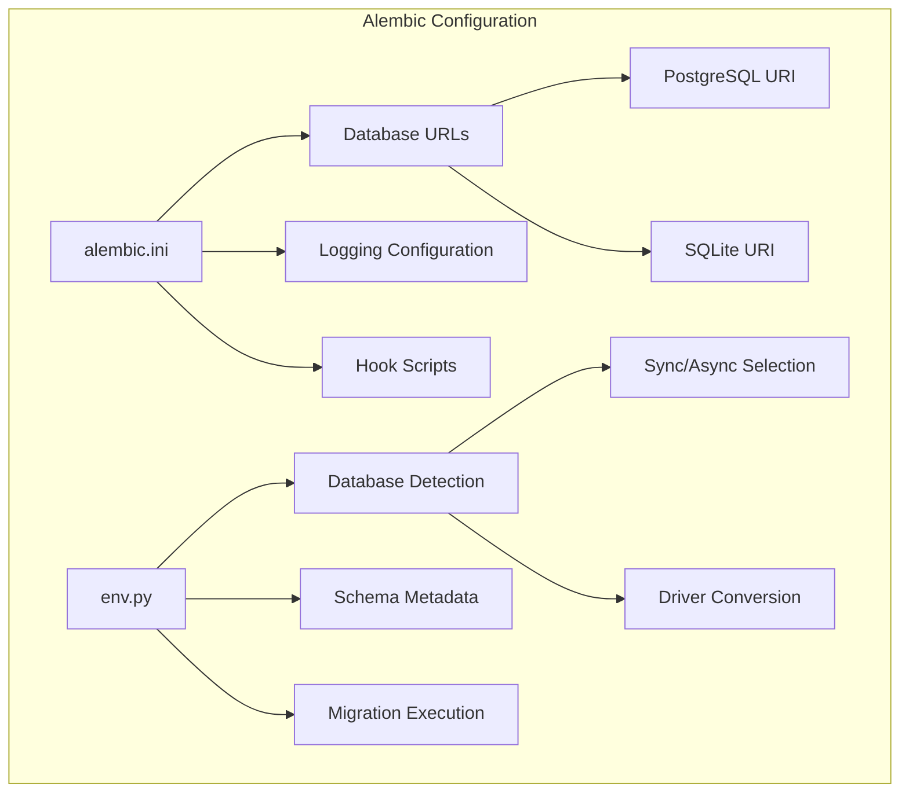
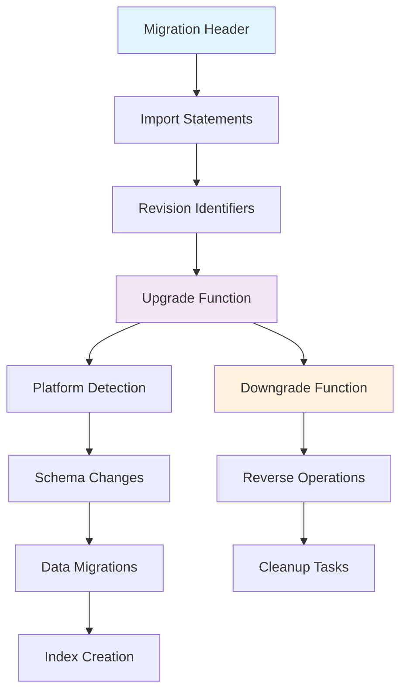
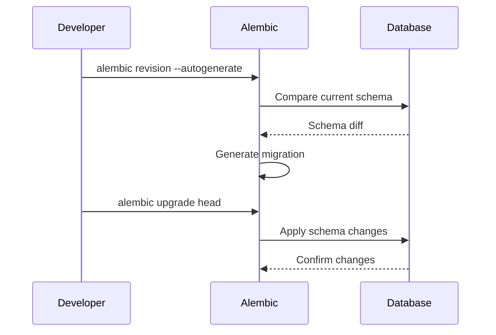
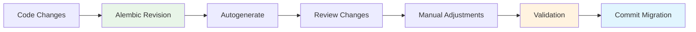
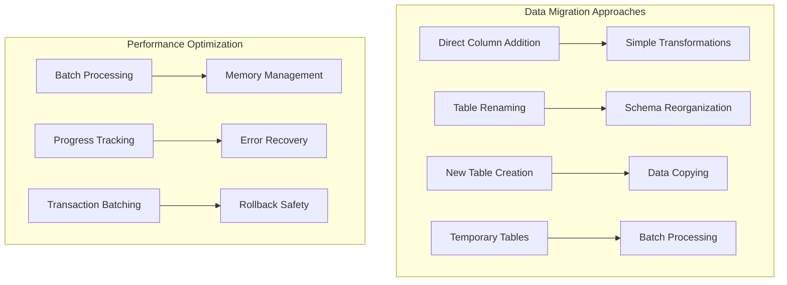
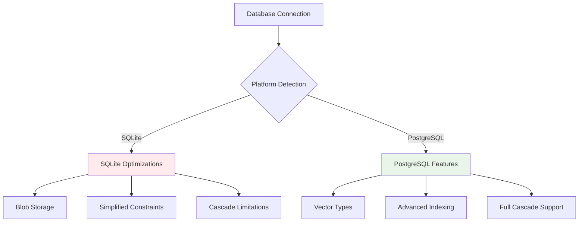
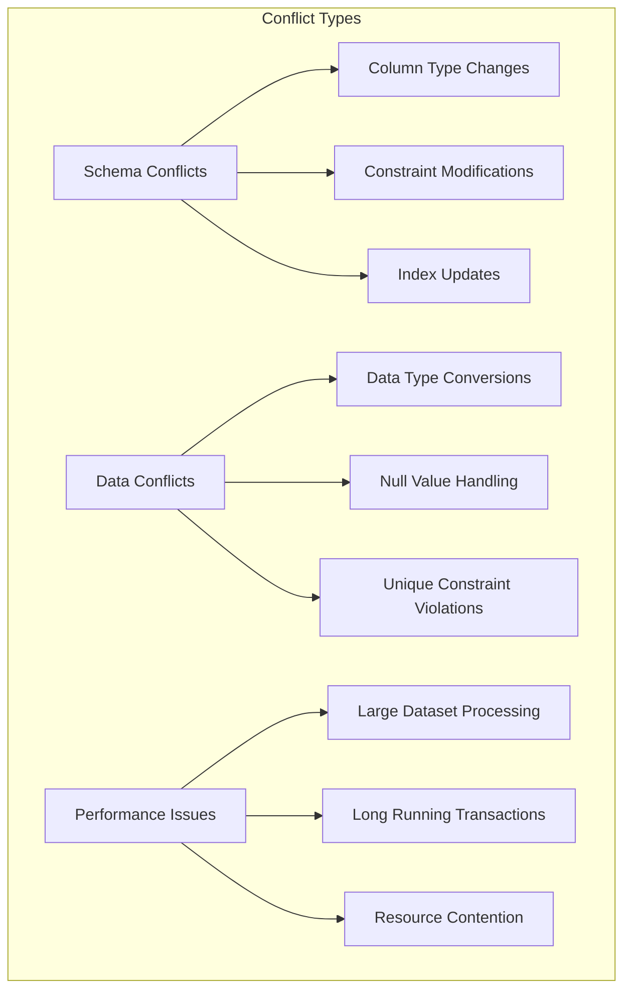

# Database Migrations

<cite>
**Referenced Files in This Document**
- [alembic.ini](file://alembic.ini)
- [alembic/env.py](file://alembic/env.py)
- [alembic/versions/0335b1eb9c40_add_batch_item_id_to_messages.py](file://alembic/versions/0335b1eb9c40_add_batch_item_id_to_messages.py)
- [alembic/versions/2c059cad97cc_create_sqlite_baseline_schema.py](file://alembic/versions/2c059cad97cc_create_sqlite_baseline_schema.py)
- [alembic/versions/f922ca16e42c_add_project_and_template_id_to_agent.py](file://alembic/versions/f922ca16e42c_add_project_and_template_id_to_agent.py)
- [alembic/versions/c5d964280dff_add_passages_orm_drop_legacy_passages_.py](file://alembic/versions/c5d964280dff_add_passages_orm_drop_legacy_passages_.py)
- [alembic/versions/54c76f7cabca_add_tags_to_passages_and_create_passage_.py](file://alembic/versions/54c76f7cabca_add_tags_to_passages_and_create_passage_.py)
- [alembic/versions/341068089f14_add_preserve_on_migration_to_block.py](file://alembic/versions/341068089f14_add_preserve_on_migration_to_block.py)
- [alembic/versions/9a505cc7eca9_create_a_baseline_migrations.py](file://alembic/versions/9a505cc7eca9_create_a_baseline_migrations.py)
- [alembic/versions/5973fd8b8c60_add_agents_runs_table.py](file://alembic/versions/5973fd8b8c60_add_agents_runs_table.py)
- [alembic/versions/74e860718e0d_add_archival_memory_sharing.py](file://alembic/versions/74e860718e0d_add_archival_memory_sharing.py)
- [alembic/versions/8149a781ac1b_backfill_encrypted_columns_for_.py](file://alembic/versions/8149a781ac1b_backfill_encrypted_columns_for_.py)
- [letta/database_utils.py](file://letta/database_utils.py)
- [letta/settings.py](file://letta/settings.py)
- [letta/orm/base.py](file://letta/orm/base.py)
</cite>

## Table of Contents
1. [Introduction](#introduction)
2. [Alembic Configuration](#alembic-configuration)
3. [Migration File Structure](#migration-file-structure)
4. [Database Schema Evolution](#database-schema-evolution)
5. [Migration Workflow](#migration-workflow)
6. [Advanced Migration Patterns](#advanced-migration-patterns)
7. [Database Compatibility](#database-compatibility)
8. [Best Practices](#best-practices)
9. [Common Challenges](#common-challenges)
10. [Testing and Validation](#testing-and-validation)

## Introduction

Letta employs Alembic as its database migration framework to manage schema evolution across different environments. The migration system ensures consistent database state across development, staging, and production deployments while maintaining backward compatibility and enabling safe data transformations.

The Letta codebase maintains a comprehensive collection of migration scripts in the `alembic/versions/` directory, covering everything from simple column additions to complex schema reorganizations and data migrations. The system supports both PostgreSQL and SQLite databases with specialized handling for each platform's unique characteristics.

## Alembic Configuration

### Core Configuration Files

The Alembic configuration is centralized in two primary files that handle database connectivity and migration execution logic.

**Diagram sources**
- [alembic.ini](file://alembic.ini#L63-L63)
- [alembic/env.py](file://alembic/env.py#L17-L26)

**Section sources**
- [alembic.ini](file://alembic.ini#L1-L117)
- [alembic/env.py](file://alembic/env.py#L1-L94)

### Database URL Management

The configuration dynamically selects appropriate database connections based on the deployment environment:

- **PostgreSQL**: Uses asyncpg driver for application performance with automatic SSL parameter conversion
- **SQLite**: Falls back to pg8000 driver for Alembic compatibility with synchronous operations
- **Environment Detection**: Automatic detection of database type through Letta configuration

### Target Metadata Configuration

The `env.py` file establishes the SQLAlchemy metadata target for migration generation:

- **Base Model Integration**: Links to Letta's ORM base classes
- **Common Mixins**: Incorporates timestamp and soft deletion patterns
- **Foreign Key Constraints**: Maintains referential integrity across the schema

## Migration File Structure

### Standard Migration Template

Each migration follows a consistent structure with specific components for schema evolution:

**Diagram sources**
- [alembic/versions/0335b1eb9c40_add_batch_item_id_to_messages.py](file://alembic/versions/0335b1eb9c40_add_batch_item_id_to_messages.py#L1-L41)
- [alembic/versions/f922ca16e42c_add_project_and_template_id_to_agent.py](file://alembic/versions/f922ca16e42c_add_project_and_template_id_to_agent.py#L1-L45)

### Revision Identifiers and Dependencies

Migration files establish relationships through revision identifiers:

- **Revision ID**: Unique identifier for the migration
- **Down Revision**: Previous migration in the chain
- **Branch Labels**: Optional categorization for complex migration branches
- **Dependencies**: Explicit relationships between related migrations

**Section sources**
- [alembic/versions/0335b1eb9c40_add_batch_item_id_to_messages.py](file://alembic/versions/0335b1eb9c40_add_batch_item_id_to_messages.py#L17-L20)
- [alembic/versions/f922ca16e42c_add_project_and_template_id_to_agent.py](file://alembic/versions/f922ca16e42c_add_project_and_template_id_to_agent.py#L17-L20)

## Database Schema Evolution

### Column Addition Patterns

Simple schema modifications demonstrate fundamental migration patterns:

**Diagram sources**
- [alembic/versions/f922ca16e42c_add_project_and_template_id_to_agent.py](file://alembic/versions/f922ca16e42c_add_project_and_template_id_to_agent.py#L28-L32)

### Table Creation Strategies

Complex schema migrations showcase advanced patterns for creating new tables with proper relationships:

- **Baseline Schemas**: Complete table definitions for initial deployments
- **Incremental Additions**: Gradual schema evolution for existing deployments
- **Foreign Key Constraints**: Proper relationship establishment with cascade options

**Section sources**
- [alembic/versions/2c059cad97cc_create_sqlite_baseline_schema.py](file://alembic/versions/2c059cad97cc_create_sqlite_baseline_schema.py#L23-L799)
- [alembic/versions/9a505cc7eca9_create_a_baseline_migrations.py](file://alembic/versions/9a505cc7eca9_create_a_baseline_migrations.py#L25-L206)

### Constraint Modifications

Schema evolution includes constraint management for data integrity:

- **Unique Constraints**: Adding uniqueness requirements to existing columns
- **Foreign Key Updates**: Modifying relationship constraints
- **Index Optimization**: Creating performance-enhancing indexes

## Migration Workflow

### Generation Process

The migration generation process involves several steps for creating reliable schema changes:

### Application Process

Migration application follows a structured approach for safe schema updates:

1. **Pre-flight Checks**: Verify database compatibility and dependencies
2. **Transaction Management**: Wrap migrations in atomic transactions
3. **Rollback Preparation**: Ensure downgrade capabilities exist
4. **Performance Monitoring**: Track migration execution time
5. **Post-validation**: Verify successful schema application

### Rollback Capabilities

The system maintains comprehensive rollback functionality:

- **Reversible Operations**: Every upgrade operation has a corresponding downgrade
- **Data Preservation**: Careful handling of existing data during schema changes
- **Error Recovery**: Graceful handling of migration failures

**Section sources**
- [alembic/versions/0335b1eb9c40_add_batch_item_id_to_messages.py](file://alembic/versions/0335b1eb9c40_add_batch_item_id_to_messages.py#L33-L41)
- [alembic/versions/74e860718e0d_add_archival_memory_sharing.py](file://alembic/versions/74e860718e0d_add_archival_memory_sharing.py#L392-L509)

## Advanced Migration Patterns

### Data Migration Strategies

Complex migrations often require sophisticated data transformation approaches:

**Diagram sources**
- [alembic/versions/74e860718e0d_add_archival_memory_sharing.py](file://alembic/versions/74e860718e0d_add_archival_memory_sharing.py#L121-L217)
- [alembic/versions/8149a781ac1b_backfill_encrypted_columns_for_.py](file://alembic/versions/8149a781ac1b_backfill_encrypted_columns_for_.py#L34-L347)

### Multi-Database Support

The migration system handles both PostgreSQL and SQLite with platform-specific optimizations:

- **PostgreSQL Optimizations**: Native vector types, advanced indexing, and transaction features
- **SQLite Adaptations**: Blob storage for complex types, simplified constraints, and performance considerations
- **Cross-Platform Compatibility**: Ensuring consistent behavior across database engines

**Section sources**
- [alembic/versions/74e860718e0d_add_archival_memory_sharing.py](file://alembic/versions/74e860718e0d_add_archival_memory_sharing.py#L32-L38)
- [letta/database_utils.py](file://letta/database_utils.py#L145-L162)

### Encryption and Security Migrations

Sensitive data migrations demonstrate secure handling of encrypted fields:

- **Encryption Key Management**: Secure handling of cryptographic keys
- **Batch Processing**: Efficient handling of large datasets
- **Error Resilience**: Graceful handling of encryption failures
- **Data Integrity**: Verification of encrypted data consistency

**Section sources**
- [alembic/versions/8149a781ac1b_backfill_encrypted_columns_for_.py](file://alembic/versions/8149a781ac1b_backfill_encrypted_columns_for_.py#L26-L347)

## Database Compatibility

### Platform-Specific Handling

The migration system implements sophisticated platform detection and adaptation:

**Diagram sources**
- [alembic/versions/74e860718e0d_add_archival_memory_sharing.py](file://alembic/versions/74e860718e0d_add_archival_memory_sharing.py#L32-L38)

### Driver Management

The system automatically manages database drivers for optimal performance:

- **Async Operations**: Uses asyncpg for application performance
- **Migration Operations**: Uses pg8000 for Alembic compatibility
- **SSL Parameter Handling**: Automatic conversion between driver requirements

**Section sources**
- [letta/database_utils.py](file://letta/database_utils.py#L121-L162)

## Best Practices

### Writing Reversible Migrations

Effective migration design follows established patterns for reversibility:

- **Atomic Operations**: Each change should be independently reversible
- **Data Preservation**: Ensure existing data remains accessible during rollbacks
- **Error Handling**: Implement robust error recovery mechanisms
- **Testing Coverage**: Comprehensive testing of both upgrade and downgrade paths

### Testing Migration Integrity

Migration validation involves multiple verification stages:

- **Syntax Validation**: Ensure migration scripts execute without syntax errors
- **Schema Comparison**: Verify resulting schema matches expectations
- **Data Integrity**: Confirm data preservation and transformation accuracy
- **Performance Impact**: Measure migration execution time and resource usage

### Backward Compatibility

Maintaining backward compatibility requires careful planning:

- **Deprecation Phases**: Gradual removal of deprecated features
- **Version Compatibility**: Support for multiple schema versions
- **Migration Planning**: Clear upgrade paths between versions

**Section sources**
- [alembic/versions/341068089f14_add_preserve_on_migration_to_block.py](file://alembic/versions/341068089f14_add_preserve_on_migration_to_block.py#L23-L41)

## Common Challenges

### Migration Conflicts

Database migration conflicts arise from various scenarios:

### Branching Histories

Managing complex migration histories requires careful coordination:

- **Merge Conflicts**: Resolving conflicting migration sequences
- **Dependency Chains**: Managing complex inter-migration dependencies
- **Parallel Development**: Coordinating migrations across development teams

### Data Migration Strategies

Large-scale data migrations present unique challenges:

- **Memory Management**: Handling large datasets without excessive memory usage
- **Transaction Boundaries**: Balancing atomicity with performance
- **Progress Tracking**: Monitoring long-running migration operations
- **Error Recovery**: Implementing robust failure recovery mechanisms

**Section sources**
- [alembic/versions/74e860718e0d_add_archival_memory_sharing.py](file://alembic/versions/74e860718e0d_add_archival_memory_sharing.py#L223-L391)

## Testing and Validation

### Migration Testing Framework

The Letta codebase implements comprehensive testing for migration validation:

- **Automated Testing**: Integration with the existing test suite
- **Schema Validation**: Verification of resulting database schemas
- **Data Integrity Checks**: Confirmation of data preservation and transformation
- **Performance Benchmarking**: Measurement of migration execution performance

### Validation Procedures

Migration validation follows established protocols:

1. **Pre-migration Backup**: Ensure data backup before applying changes
2. **Schema Comparison**: Verify expected schema changes
3. **Functional Testing**: Test application functionality with new schema
4. **Performance Monitoring**: Track migration impact on system performance
5. **Post-migration Cleanup**: Verify successful completion and cleanup

### Continuous Integration

Migration testing integrates with continuous integration pipelines:

- **Automated Migration Testing**: Run migration tests in CI/CD pipelines
- **Database Environment Management**: Provision test databases for migration validation
- **Regression Testing**: Ensure migrations don't break existing functionality

**Section sources**
- [alembic/versions/54c76f7cabca_add_tags_to_passages_and_create_passage_.py](file://alembic/versions/54c76f7cabca_add_tags_to_passages_and_create_passage_.py#L23-L74)

## Conclusion

Letta's Alembic-based migration system provides a robust foundation for database schema evolution, supporting both simple column additions and complex schema reorganizations. The system's emphasis on platform compatibility, data preservation, and reversible operations ensures safe database evolution across diverse deployment environments.

The comprehensive collection of migration scripts demonstrates the system's maturity and the team's commitment to maintaining data integrity while evolving the application's capabilities. The sophisticated handling of PostgreSQL and SQLite differences, combined with advanced features like encryption migrations and cross-platform compatibility, makes this migration system a model for database evolution in modern applications.

Through careful adherence to best practices, comprehensive testing, and robust error handling, the Letta migration system enables confident database evolution while maintaining the reliability and performance expectations of production systems.