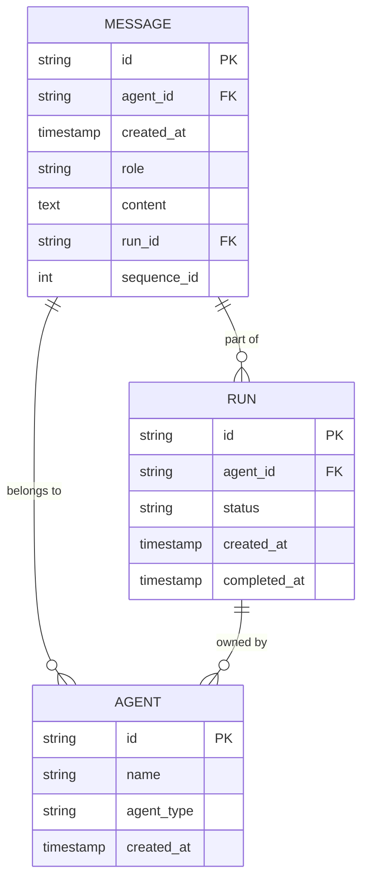
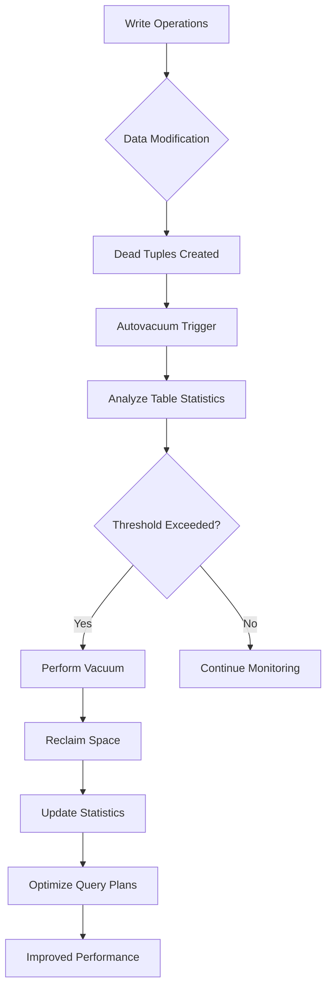
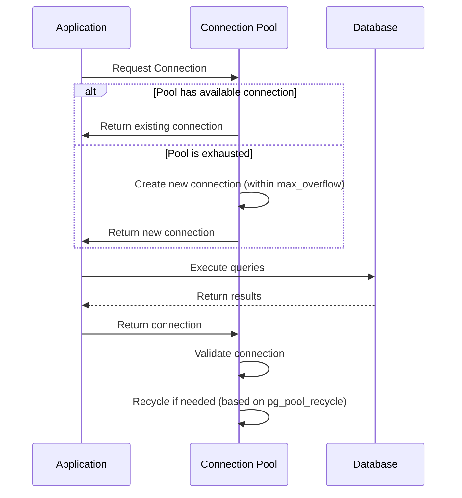
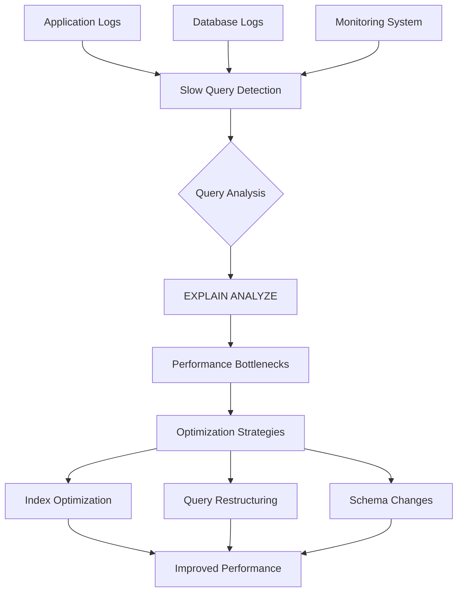
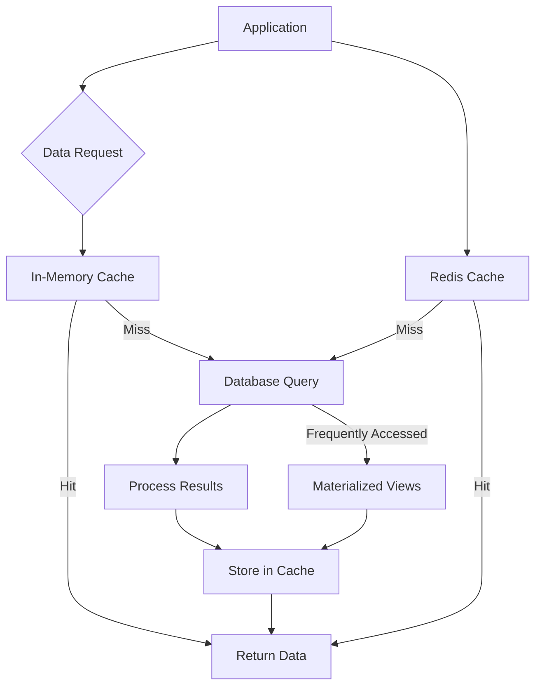

# Performance Tuning and Maintenance

<cite>
**Referenced Files in This Document**   
- [compose.yaml](file://compose.yaml)
- [settings.py](file://letta/settings.py)
- [db.py](file://letta/server/db.py)
- [message.py](file://letta/orm/message.py)
- [run.py](file://letta/orm/run.py)
- [agent.py](file://letta/orm/agent.py)
- [database_utils.py](file://letta/database_utils.py)
- [passage.py](file://letta/orm/passage.py)
- [source.py](file://letta/orm/source.py)
</cite>

## Table of Contents
1. [Introduction](#introduction)
2. [Indexing Strategies](#indexing-strategies)
3. [Vacuuming and Autovacuum Configuration](#vacuuming-and-autovacuum-configuration)
4. [Connection Pooling Configuration](#connection-pooling-configuration)
5. [Query Optimization](#query-optimization)
6. [Monitoring and Alerting](#monitoring-and-alerting)
7. [Partitioning Strategies](#partitioning-strategies)
8. [Caching Layers](#caching-layers)
9. [Conclusion](#conclusion)

## Introduction
This document provides comprehensive guidance on database performance tuning and maintenance for Letta, a sophisticated AI agent platform. The system handles high-volume operations including message logging, run tracking, agent state management, and archival operations, making database performance critical for overall system scalability and responsiveness.

Letta's architecture relies on PostgreSQL as its primary database backend, with ORM models defined using SQLAlchemy for data persistence. The application handles complex operations involving agent conversations, tool executions, and state management, generating significant write loads particularly in message and run tracking tables.

The performance tuning strategies outlined in this document address key areas including indexing optimization based on query patterns, vacuuming configuration for bloat management, connection pooling for scalability, query optimization techniques, monitoring setup, partitioning for large tables, and caching to reduce database load. These recommendations are derived from analysis of the codebase, ORM models, and configuration files to ensure alignment with the actual implementation.

**Section sources**
- [compose.yaml](file://compose.yaml)
- [settings.py](file://letta/settings.py)
- [db.py](file://letta/server/db.py)

## Indexing Strategies
Letta employs a comprehensive indexing strategy to optimize query performance across its core entities. The indexing approach is designed to support the application's primary access patterns, particularly around message retrieval, agent state management, and run tracking.

### Composite Indexes
Composite indexes are strategically implemented to support multi-column query patterns. The most critical composite index is on the `messages` table, which includes `(agent_id, created_at)` to optimize queries that retrieve messages for a specific agent ordered by creation time:



**Diagram sources**
- [message.py](file://letta/orm/message.py#L21-L28)
- [agent.py](file://letta/orm/agent.py)
- [run.py](file://letta/orm/run.py)

Additional composite indexes include:
- `(run_id, sequence_id)` on the `messages` table to optimize retrieval of messages within a specific run in sequence order
- `(organization_id, agent_id)` on the `messages` table to support organization-level message queries
- `(agent_id, is_err, sequence_id)` to optimize error message retrieval for debugging

### Partial Indexes
Partial indexes are used to optimize queries on specific subsets of data. The system implements partial indexing strategies to improve performance for common filtering operations:

- A partial index on `messages` where `is_err = true` to quickly identify error messages for debugging purposes
- Indexes on `run` table for specific status values that are frequently queried
- Conditional indexing on agent-related tables based on organization membership

The ORM models define these indexes directly in the table configuration, ensuring they are created during database migrations. This approach allows the indexing strategy to evolve alongside the application's query patterns.

### Covering Indexes
Covering indexes are implemented to minimize table lookups for frequently accessed query patterns. The system uses covering indexes to include all columns needed for common queries, reducing I/O overhead:

- The `(agent_id, created_at, id)` index on messages serves as a covering index for queries that need to paginate through messages by agent
- Indexes on run-related tables include status and completion timestamps to support run listing operations without table access

These indexing strategies are defined in the SQLAlchemy models using the `__table_args__` directive with `Index` constructs, ensuring they are managed as part of the database schema evolution process.

**Section sources**
- [message.py](file://letta/orm/message.py#L21-L28)
- [run.py](file://letta/orm/run.py#L29-L33)
- [agent.py](file://letta/orm/agent.py#L40-L44)

## Vacuuming and Autovacuum Configuration
Letta's high-write workload, particularly in message logging and run tracking scenarios, necessitates careful vacuuming and autovacuum configuration to manage table bloat and maintain performance.

### High-Write Scenarios
The primary high-write scenarios in Letta include:
- Message logging: Each agent interaction generates multiple message records
- Run tracking: Agent runs create entries in the runs and related metrics tables
- Step processing: Each step in an agent's execution creates step records and associated data
- Archival operations: Background processes that manage archival memory

These operations create significant write amplification, particularly in the `messages`, `runs`, and `steps` tables, which are central to the agent execution lifecycle.

### Autovacuum Configuration
Based on the application's write patterns and performance requirements, the following autovacuum configuration is recommended:



**Diagram sources**
- [message.py](file://letta/orm/message.py)
- [run.py](file://letta/orm/run.py)

Key autovacuum parameters should be tuned as follows:
- `autovacuum_vacuum_scale_factor`: Reduced from default 0.2 to 0.1 for tables with high write volume
- `autovacuum_vacuum_threshold`: Set to a lower value (e.g., 1000) to trigger vacuuming more frequently
- `autovacuum_analyze_scale_factor`: Reduced to 0.05 to ensure query planner statistics are updated more frequently
- `autovacuum_max_workers`: Increased to handle concurrent vacuuming of multiple tables
- `autovacuum_naptime`: Reduced to ensure more frequent checks for tables needing vacuuming

For the `messages` table specifically, which experiences the highest write volume, consider setting table-specific autovacuum parameters:
```
ALTER TABLE messages SET (autovacuum_vacuum_scale_factor = 0.05);
ALTER TABLE messages SET (autovacuum_vacuum_threshold = 500);
ALTER TABLE messages SET (autovacuum_analyze_scale_factor = 0.02);
```

### Bloat Management Strategies
To effectively manage bloat in high-write scenarios:

1. **Monitor bloat regularly**: Use PostgreSQL's `pgstattuple` extension or queries against `pg_class` and `pg_stat_user_tables` to monitor table and index bloat.

2. **Schedule maintenance windows**: For critical tables, consider scheduling regular `VACUUM FULL` operations during low-usage periods, though this should be done cautiously as it requires an exclusive lock.

3. **Implement partitioning**: For tables with time-series data like messages and runs, implement time-based partitioning to allow for more efficient vacuuming and archiving of older data.

4. **Use pg_repack**: For tables that cannot tolerate long locks, consider using the `pg_repack` extension to remove bloat without requiring exclusive locks.

5. **Monitor transaction IDs**: Ensure regular vacuuming to prevent transaction ID wraparound, which can cause database shutdown.

The application's architecture already includes mechanisms for managing high-write scenarios, such as the use of monotonically increasing sequence IDs for messages to optimize index performance and reduce page splits.

**Section sources**
- [message.py](file://letta/orm/message.py#L71-L76)
- [run.py](file://letta/orm/run.py)
- [database_utils.py](file://letta/database_utils.py)

## Connection Pooling Configuration
Letta's connection pooling configuration is critical for application scalability and performance, particularly under high concurrency scenarios. The configuration is managed through both environment variables and code-level settings.

### compose.yaml Configuration
The `compose.yaml` file defines the database service with appropriate resource allocation:

```yaml
services:
  letta_db:
    image: ankane/pgvector:v0.5.1
    environment:
      - POSTGRES_USER=${LETTA_PG_USER:-letta}
      - POSTGRES_PASSWORD=${LETTA_PG_PASSWORD:-letta}
      - POSTGRES_DB=${LETTA_PG_DB:-letta}
    volumes:
      - ./.persist/pgdata:/var/lib/postgresql/data
    ports:
      - "${LETTA_PG_PORT:-5432}:5432"
```

This configuration uses the `ankane/pgvector` image, which includes the pgvector extension for vector operations, and maps the database data to a persistent volume.

### Connection Pool Settings
The connection pool is configured in `settings.py` with the following key parameters:

```python
pg_pool_size: int = 25  # Concurrent connections
pg_max_overflow: int = 10  # Overflow limit
pg_pool_timeout: int = 30  # Seconds to wait for a connection
pg_pool_recycle: int = 1800  # When to recycle connections
disable_sqlalchemy_pooling: bool = True
```

These settings define a connection pool with:
- **Base pool size**: 25 connections maintained in the pool
- **Maximum overflow**: 10 additional connections that can be created when the pool is exhausted
- **Pool timeout**: 30 seconds to wait for an available connection before raising an error
- **Connection recycle**: 30 minutes, after which connections are recycled to prevent staleness

The `disable_sqlalchemy_pooling` setting is particularly important, as when set to `True`, it disables SQLAlchemy's built-in connection pooling in favor of alternative connection management strategies.

### Connection Pool Implementation
The actual connection pool is implemented in `db.py` using SQLAlchemy's async engine:



**Diagram sources**
- [db.py](file://letta/server/db.py#L19-L37)
- [settings.py](file://letta/settings.py#L256-L263)

The implementation includes:
- **Async engine configuration**: Uses `asyncpg` as the driver for asynchronous operations
- **Connection recycling**: Connections are recycled based on the `pg_pool_recycle` setting to prevent issues with stale connections
- **Pre-ping**: Enabled by default to verify connections are alive before use
- **Connection timeout**: Configured to match the pool timeout setting

### Scalability Considerations
For optimal scalability:
1. **Monitor pool utilization**: Track metrics such as connection wait times, pool exhaustion events, and active connection counts.
2. **Adjust pool size based on workload**: For high-concurrency scenarios, consider increasing `pg_pool_size` and `pg_max_overflow`.
3. **Implement connection pooling at the infrastructure level**: Consider using PgBouncer or similar tools for additional connection pooling layers.
4. **Optimize connection lifetime**: Balance between connection reuse and preventing connection staleness by tuning `pg_pool_recycle`.

The current configuration provides a solid foundation for moderate workloads, but may need adjustment for high-scale deployments with thousands of concurrent agents.

**Section sources**
- [compose.yaml](file://compose.yaml)
- [settings.py](file://letta/settings.py#L256-L263)
- [db.py](file://letta/server/db.py#L19-L37)

## Query Optimization
Effective query optimization is essential for maintaining performance in Letta's complex operational environment. This section covers techniques for identifying and optimizing slow queries, using EXPLAIN ANALYZE, and optimizing JOIN patterns.

### EXPLAIN ANALYZE Usage
The `EXPLAIN ANALYZE` command is the primary tool for understanding query performance characteristics. It provides detailed information about the query execution plan, including:
- Actual execution time for each operation
- Number of rows processed at each step
- Memory and disk usage
- Join methods used
- Index usage

To use `EXPLAIN ANALYZE` effectively:
1. **Identify slow queries**: Monitor application logs and database metrics to find queries with high execution times.
2. **Run EXPLAIN ANALYZE**: Execute the query with `EXPLAIN (ANALYZE, BUFFERS, FORMAT JSON)` to get detailed performance data.
3. **Analyze the execution plan**: Look for expensive operations, inefficient join methods, or missing index usage.
4. **Iterate and optimize**: Make changes to the query or indexes and re-run `EXPLAIN ANALYZE` to measure improvements.

### Identifying Slow Queries
Slow queries can be identified through multiple mechanisms:



**Diagram sources**
- [settings.py](file://letta/settings.py#L281-L287)
- [message_manager.py](file://letta/services/message_manager.py)
- [run_manager.py](file://letta/services/run_manager.py)

Key approaches include:
- **Application-level logging**: Enable query logging in the application to capture slow queries
- **Database-level logging**: Configure PostgreSQL to log queries exceeding a certain duration
- **Monitoring integration**: Use observability tools to track query performance metrics

In Letta's configuration, LLM API logging is enabled by default, which can help identify slow database operations related to agent runs:

```python
llm_api_logging: bool = Field(default=True, description="Enable LLM API logging at each step")
```

### JOIN Pattern Optimization
Complex operations like agent state retrieval involve multiple JOIN operations across related tables. The ORM models reveal several key JOIN patterns:

#### Agent State Retrieval
The agent state retrieval involves JOINs across multiple tables:
- `agents` → `messages` (via agent_id)
- `agents` → `runs` (via agent_id)
- `agents` → `sources` (via sources_agents mapping table)
- `agents` → `blocks` (via blocks_agents mapping table)
- `agents` → `tools` (via tools_agents mapping table)

Optimization strategies for these JOINs include:
1. **Ensure proper indexing**: All foreign key columns should be indexed
2. **Use appropriate JOIN types**: Prefer INNER JOIN when possible, avoid unnecessary OUTER JOINs
3. **Limit result sets**: Use pagination and filtering to reduce the amount of data processed
4. **Consider denormalization**: For frequently accessed combinations of data, consider creating materialized views

#### Message Retrieval Optimization
The message retrieval pattern is optimized through:
- Composite indexes on `(agent_id, created_at)` and `(run_id, sequence_id)`
- Use of monotonically increasing sequence IDs for efficient pagination
- Selective loading of relationships through the ORM's lazy loading features

The `Message` model includes optimized query patterns:
```python
__table_args__ = (
    Index("ix_messages_agent_created_at", "agent_id", "created_at"),
    Index("ix_messages_created_at", "created_at", "id"),
    Index("ix_messages_agent_sequence", "agent_id", "sequence_id"),
    Index("ix_messages_org_agent", "organization_id", "agent_id"),
    Index("ix_messages_run_sequence", "run_id", "sequence_id"),
)
```

#### Run Metrics JOINs
The run metrics functionality involves JOINs between `runs` and `run_metrics` tables:
```python
query = (
    select(RunModel, RunMetricsModel.run_ns)
    .outerjoin(RunMetricsModel, RunModel.id == RunMetricsModel.id)
    .filter(RunModel.organization_id == actor.organization_id)
)
```

This pattern is optimized by:
- Using covering indexes that include frequently accessed columns
- Filtering early in the query to reduce the dataset size
- Using appropriate join conditions and indexes on join columns

**Section sources**
- [message.py](file://letta/orm/message.py#L21-L28)
- [agent.py](file://letta/orm/agent.py#L116-L184)
- [run.py](file://letta/orm/run.py#L66-L71)
- [run_manager.py](file://letta/services/run_manager.py#L157-L160)

## Monitoring and Alerting
Effective monitoring and alerting are critical for maintaining database performance and reliability in Letta. This section covers key metrics to monitor, alerting strategies, and integration with the application's observability framework.

### Key Metrics
The following key metrics should be monitored to ensure database health and performance:

| Metric Category | Specific Metrics | Collection Method | Alert Threshold |
|----------------|------------------|-------------------|-----------------|
| **Performance** | Query execution time, Connection wait time, Cache hit rate | PostgreSQL statistics, Application logs | 95th percentile > 1s |
| **Resource Usage** | CPU utilization, Memory usage, Disk I/O, Disk space | System monitoring, PostgreSQL views | > 80% sustained |
| **Connection Pool** | Active connections, Idle connections, Connection wait time | SQLAlchemy pool metrics, Database views | Wait time > 1s |
| **Lock Contention** | Lock wait time, Deadlocks, Lock queue length | PostgreSQL lock views | > 10s wait time |
| **Transaction** | Transactions per second, Rollback rate, Long-running transactions | PostgreSQL statistics | Rollback rate > 5% |
| **Bloat** | Table bloat percentage, Index bloat percentage, Dead tuples | pgstattuple, pg_class | > 30% bloat |
| **Replication** | Replication lag, WAL generation rate | PostgreSQL replication views | Lag > 30s |

### Cache Hit Rate Monitoring
Cache hit rate is a critical performance indicator for database efficiency. A high cache hit rate indicates that most data requests are served from memory rather than requiring disk I/O.

PostgreSQL provides cache hit rate metrics through the `pg_statio_user_tables` and `pg_statio_user_indexes` views:

```sql
SELECT
    relname as table_name,
    heap_blks_read as heap_blocks_read,
    heap_blks_hit as heap_blocks_hit,
    round(100.0 * heap_blks_hit / (heap_blks_hit + heap_blks_read), 2) as cache_hit_ratio
FROM pg_statio_user_tables
WHERE (heap_blks_hit + heap_blks_read) > 0
ORDER BY cache_hit_ratio ASC;
```

For Letta's workload, aim for:
- Overall cache hit rate > 95%
- Critical tables (messages, runs, agents) > 98%
- Index cache hit rate > 99%

Low cache hit rates may indicate:
- Insufficient shared_buffers configuration
- Inefficient query patterns causing full table scans
- Data access patterns that don't benefit from caching

### Lock Contention Analysis
Lock contention can severely impact performance, particularly in high-concurrency scenarios. Monitor for:

1. **Long-running transactions**: Transactions that hold locks for extended periods
2. **Deadlocks**: Circular dependencies between transactions
3. **Lock wait times**: Time spent waiting for locks to be released

Key queries for lock monitoring:

```sql
-- Current locks
SELECT 
    pid,
    locktype,
    relation::regclass,
    mode,
    granted,
    now() - query_start as duration
FROM pg_locks l
JOIN pg_stat_activity a ON l.pid = a.pid
WHERE NOT granted OR now() - query_start > interval '1 minute';

-- Deadlock statistics
SELECT 
    count(*) as deadlocks,
    sum(deadlocks) as total_deadlocks
FROM pg_stat_database;
```

In Letta's architecture, potential lock contention points include:
- Concurrent updates to agent state
- High-frequency message inserts
- Batch operations on runs and steps

### Transaction Throughput Monitoring
Transaction throughput provides insight into system load and performance trends:

```sql
-- Transactions per second
SELECT 
    datname,
    xact_commit + xact_rollback as total_transactions,
    xact_commit,
    xact_rollback,
    now() - stats_reset as uptime
FROM pg_stat_database 
WHERE datname = current_database();
```

Monitor for:
- Sudden drops in transaction rate (indicating performance issues)
- High rollback rates (indicating application or constraint issues)
- Increasing transaction durations (indicating resource contention)

### Alerting Configuration
The application's settings include configuration for observability integration:

```python
# telemetry logging
otel_exporter_otlp_endpoint: str | None = None
disable_tracing: bool = Field(default=False, description="Disable OTEL Tracing")
llm_api_logging: bool = Field(default=True, description="Enable LLM API logging at each step")
track_last_agent_run: bool = Field(default=False, description="Update last agent run metrics")
```

Recommended alerting rules:
1. **High query latency**: Alert when 95th percentile query time exceeds threshold
2. **Connection pool exhaustion**: Alert when connection wait time exceeds threshold
3. **Low cache hit rate**: Alert when cache hit rate drops below target
4. **High lock contention**: Alert when lock wait times exceed threshold
5. **Disk space**: Alert when disk usage exceeds 80%
6. **Replication lag**: Alert when replication lag exceeds 30 seconds
7. **Deadlocks**: Alert on any deadlock occurrences

The application already includes connection pool monitoring capabilities:

```python
# Database pool monitoring
enable_db_pool_monitoring: bool = True  # Enable connection pool monitoring
db_pool_monitoring_interval: int = 30  # Seconds between pool stats collection
```

**Section sources**
- [settings.py](file://letta/settings.py#L308-L310)
- [otel/metric_registry.py](file://letta/otel/metric_registry.py)
- [db.py](file://letta/server/db.py)

## Partitioning Strategies
Partitioning is a critical strategy for managing large tables in Letta, particularly for time-series data like messages and passages. This section outlines recommended partitioning approaches based on the application's data access patterns.

### Large Tables Requiring Partitioning
The primary tables that benefit from partitioning are:

1. **messages**: Stores all agent messages, growing rapidly with agent activity
2. **passages**: Contains embedded text passages for retrieval
3. **runs**: Tracks agent execution sessions
4. **steps**: Records individual steps within agent runs
5. **archival_passages**: Stores archived memory passages

### Time-Based Partitioning
For tables with strong time-based access patterns, time-based partitioning is recommended:

```mermaid
erDiagram
MESSAGES {
string id PK
string agent_id FK
timestamp created_at
string role
text content
}
MESSAGES_2025_01 ||--o{ MESSAGES : "inherits"
MESSAGES_2025_02 ||--o{ MESSAGES : "inherits"
MESSAGES_2025_03 ||--o{ MESSAGES : "inherits"
class MESSAGES_2025_01 {
Partition for January 2025
}
class MESSAGES_2025_02 {
Partition for February 2025
}
class MESSAGES_2025_03 {
Partition for March 2025
}
```

**Diagram sources**
- [message.py](file://letta/orm/message.py)
- [passage.py](file://letta/orm/passage.py)

For the `messages` table, implement monthly partitioning:
```sql
CREATE TABLE messages (
    id VARCHAR PRIMARY KEY,
    agent_id VARCHAR NOT NULL,
    created_at TIMESTAMP WITH TIME ZONE NOT NULL,
    -- other columns
) PARTITION BY RANGE (created_at);

CREATE TABLE messages_2025_01 PARTITION OF messages
    FOR VALUES FROM ('2025-01-01') TO ('2025-02-01');

CREATE TABLE messages_2025_02 PARTITION OF messages
    FOR VALUES FROM ('2025-02-01') TO ('2025-03-01');
-- etc.
```

Benefits of time-based partitioning:
- **Improved query performance**: Queries that filter by time can eliminate entire partitions
- **Efficient data retention**: Old partitions can be dropped rather than using DELETE
- **Parallel query execution**: Queries can process multiple partitions in parallel
- **Reduced index size**: Each partition has its own smaller indexes

### List Partitioning
For tables with categorical data, list partitioning may be appropriate:

```mermaid
erDiagram
PASSAGES {
string id PK
string organization_id FK
string source_id FK
text content
vector embedding
}
PASSAGES_ORG_A ||--o{ PASSAGES : "inherits"
PASSAGES_ORG_B ||--o{ PASSAGES : "inherits"
PASSAGES_ORG_C ||--o{ PASSAGES : "inherits"
class PASSAGES_ORG_A {
Partition for Organization A
}
class PASSAGES_ORG_B {
Partition for Organization B
}
class PASSAGES_ORG_C {
Partition for Organization C
}
```

**Diagram sources**
- [passage.py](file://letta/orm/passage.py)
- [source.py](file://letta/orm/source.py)

For the `passages` table, consider organization-based partitioning:
```sql
CREATE TABLE passages (
    id VARCHAR PRIMARY KEY,
    organization_id VARCHAR NOT NULL,
    -- other columns
) PARTITION BY LIST (organization_id);

CREATE TABLE passages_org_a PARTITION OF passages
    FOR VALUES IN ('org-a');
    
CREATE TABLE passages_org_b PARTITION OF passages
    FOR VALUES IN ('org-b');
```

This approach is beneficial when:
- Queries typically access data for a single organization
- Different organizations have significantly different data volumes
- Data retention policies vary by organization

### Partitioning Implementation Strategy
1. **Assess data volume and growth**: Estimate table size and growth rate to determine partitioning needs
2. **Analyze query patterns**: Identify common filtering criteria to inform partitioning keys
3. **Choose partitioning method**: Select range, list, or hash partitioning based on access patterns
4. **Plan partition size**: For time-based partitioning, choose monthly, weekly, or daily partitions based on data volume
5. **Implement partitioning**: Use PostgreSQL's declarative partitioning
6. **Migrate existing data**: Move data from existing tables to partitioned tables
7. **Update maintenance procedures**: Adapt backup, vacuum, and monitoring processes

For Letta's `messages` table, given the high write volume and time-based access patterns, monthly range partitioning is recommended. This aligns with typical retention policies and query patterns that often filter by date ranges.

### Maintenance of Partitioned Tables
Partitioned tables require specific maintenance considerations:

1. **Index management**: Create indexes on each partition, or use global indexes if appropriate
2. **Vacuum and analyze**: Run vacuum and analyze on individual partitions or the parent table
3. **Backup and restore**: Consider partition-level backup strategies
4. **Data retention**: Implement automated scripts to drop old partitions
5. **Query optimization**: Ensure the query planner can effectively use partition elimination

The application's existing indexing strategy should be adapted for partitioned tables, with local indexes on partition keys and commonly filtered columns.

**Section sources**
- [message.py](file://letta/orm/message.py)
- [passage.py](file://letta/orm/passage.py)
- [source.py](file://letta/orm/source.py)

## Caching Layers
Caching is a critical strategy for reducing database load in Letta, particularly for frequently accessed data and expensive operations. This section outlines the caching architecture and recommendations for implementation.

### Caching Architecture
Letta's caching strategy should address multiple levels of the application stack:



**Diagram sources**
- [message.py](file://letta/orm/message.py)
- [agent.py](file://letta/orm/agent.py)
- [services/message_manager.py](file://letta/services/message_manager.py)

The caching architecture should include:
- **In-memory caching**: For frequently accessed data within application processes
- **Distributed caching**: Using Redis for shared cache across application instances
- **Materialized views**: For pre-computed expensive queries
- **Client-side caching**: Where appropriate, for reducing round trips

### Redis Integration
The application already includes Redis configuration:

```python
redis_host: Optional[str] = Field(default=None, description="Host for Redis instance")
redis_port: Optional[int] = Field(default=6379, description="Port for Redis instance")
```

Recommended Redis usage patterns:

1. **Agent state caching**: Cache frequently accessed agent states to reduce database queries
2. **Message thread caching**: Cache recent message threads for active agents
3. **Run status caching**: Cache run statuses to avoid frequent database queries
4. **Query result caching**: Cache results of expensive queries with appropriate TTL

Example Redis cache implementation for agent state:
```python
# Pseudocode for agent state caching
def get_agent_state(agent_id):
    cache_key = f"agent_state:{agent_id}"
    cached = redis.get(cache_key)
    if cached:
        return json.loads(cached)
    
    # Fetch from database
    agent_state = db.query(Agent).filter(Agent.id == agent_id).first()
    
    # Cache for 5 minutes
    redis.setex(cache_key, 300, json.dumps(agent_state.to_dict()))
    return agent_state
```

### Cache Invalidation Strategies
Effective cache invalidation is critical to maintain data consistency:

1. **Write-through caching**: Update cache immediately when data is written to the database
2. **Time-based expiration**: Set appropriate TTL values based on data volatility
3. **Event-driven invalidation**: Invalidate cache entries when related data changes
4. **Cache stampede protection**: Use techniques like randomization or locking to prevent cache stampedes

For Letta's use case, a hybrid approach is recommended:
- **Short TTL for volatile data**: 5-15 minutes for agent state and run status
- **Longer TTL for stable data**: 1-2 hours for agent configuration and tool definitions
- **Event-driven invalidation**: For critical updates, immediately invalidate relevant cache entries

### Materialized Views
For expensive queries that are frequently executed, consider using PostgreSQL materialized views:

```sql
-- Example materialized view for agent run summaries
CREATE MATERIALIZED VIEW agent_run_summary AS
SELECT 
    agent_id,
    COUNT(*) as total_runs,
    AVG(run_ns) as avg_duration,
    MAX(completed_at) as last_run,
    COUNT(*) FILTER (WHERE status = 'completed') as completed_runs
FROM runs 
GROUP BY agent_id;

-- Create index on materialized view
CREATE INDEX idx_agent_run_summary_agent ON agent_run_summary(agent_id);

-- Refresh periodically
REFRESH MATERIALIZED VIEW agent_run_summary;
```

Materialized views are beneficial for:
- Complex aggregations across large datasets
- JOIN-heavy queries that are frequently executed
- Reporting and analytics queries

### Caching Performance Benefits
Effective caching can provide significant performance improvements:

1. **Reduced database load**: Fewer queries to the primary database
2. **Lower latency**: Faster response times for cached data
3. **Improved scalability**: Ability to handle more concurrent users
4. **Reduced CPU and I/O**: Less processing and disk access required

For Letta's workload, caching can be particularly effective for:
- Agent initialization: Caching agent configuration and state
- Message retrieval: Caching recent message threads
- Run listing: Caching frequently accessed run summaries
- Tool metadata: Caching tool definitions and configurations

The application should implement comprehensive monitoring of cache hit rates and effectiveness to ensure the caching strategy is delivering expected benefits.

**Section sources**
- [settings.py](file://letta/settings.py#L266-L267)
- [data_sources/redis_client.py](file://letta/data_sources/redis_client.py)
- [message.py](file://letta/orm/message.py)
- [agent.py](file://letta/orm/agent.py)

## Conclusion
This document has provided comprehensive guidance on database performance tuning and maintenance for Letta, addressing key areas critical to the system's scalability and reliability.

The indexing strategy, centered around composite indexes on `(agent_id, created_at)` and `(run_id, sequence_id)`, effectively supports the application's primary query patterns for message retrieval and agent state management. Partial and covering indexes further optimize performance for specific access patterns.

For high-write scenarios like message logging and run tracking, proper vacuuming and autovacuum configuration are essential. The recommended settings balance aggressive bloat management with system resource usage, ensuring consistent performance even under heavy write loads.

Connection pooling configuration, as defined in `compose.yaml` and `settings.py`, provides a solid foundation for application scalability. The configuration of 25 base connections with 10 overflow connections, combined with appropriate timeout and recycle settings, supports moderate to high concurrency workloads.

Query optimization through EXPLAIN ANALYZE, slow query identification, and JOIN pattern optimization is critical for maintaining performance. The complex operations involved in agent state retrieval benefit from careful attention to index usage and query structure.

Monitoring key metrics such as cache hit rates, lock contention, and transaction throughput enables proactive performance management. The integration with OpenTelemetry and built-in monitoring capabilities provides visibility into database performance and connection pool utilization.

Partitioning strategies, particularly time-based partitioning for the `messages` and `passages` tables, address the challenges of managing large datasets. This approach improves query performance, simplifies data retention, and enables more efficient maintenance operations.

Finally, caching layers, including Redis integration and materialized views, significantly reduce database load for frequently accessed data and expensive queries. A comprehensive caching strategy with appropriate invalidation mechanisms ensures data consistency while maximizing performance benefits.

By implementing these recommendations, Letta can achieve optimal database performance, supporting its AI agent platform with reliable, scalable, and responsive data access.

**Section sources**
- [compose.yaml](file://compose.yaml)
- [settings.py](file://letta/settings.py)
- [db.py](file://letta/server/db.py)
- [message.py](file://letta/orm/message.py)
- [run.py](file://letta/orm/run.py)
- [agent.py](file://letta/orm/agent.py)
- [database_utils.py](file://letta/database_utils.py)
- [passage.py](file://letta/orm/passage.py)
- [source.py](file://letta/orm/source.py)