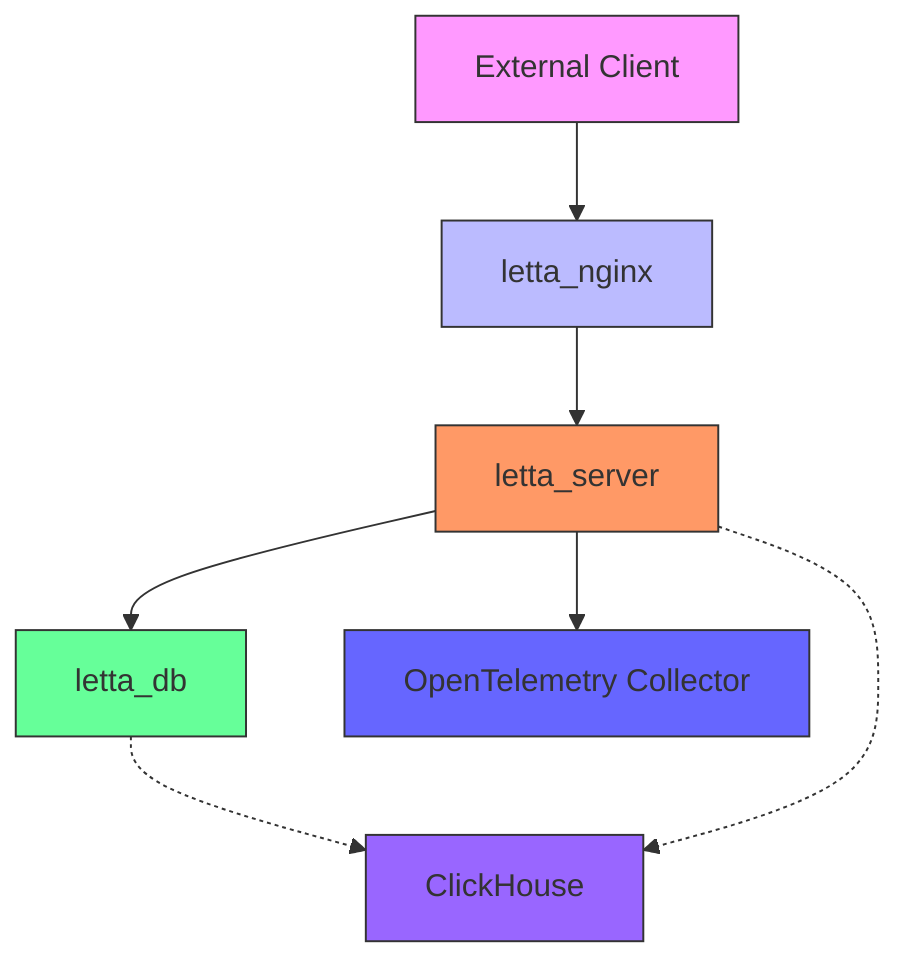
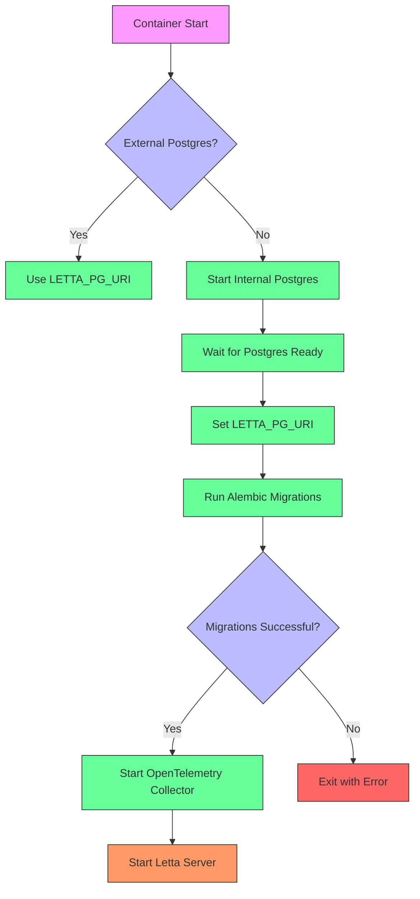
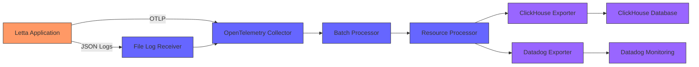

# Deployment and Operations

<cite>
**Referenced Files in This Document**   
- [compose.yaml](file://compose.yaml)
- [dev-compose.yaml](file://dev-compose.yaml)
- [development.compose.yml](file://development.compose.yml)
- [docker-compose-vllm.yaml](file://docker-compose-vllm.yaml)
- [Dockerfile](file://Dockerfile)
- [otel/otel-collector-config-clickhouse.yaml](file://otel/otel-collector-config-clickhouse.yaml)
- [otel/otel-collector-config-clickhouse-prod.yaml](file://otel/otel-collector-config-clickhouse-prod.yaml)
- [otel/otel-collector-config-clickhouse-dev.yaml](file://otel/otel-collector-config-clickhouse-dev.yaml)
- [otel/start-otel-collector.sh](file://otel/start-otel-collector.sh)
- [init.sql](file://init.sql)
- [nginx.conf](file://nginx.conf)
- [alembic.ini](file://alembic.ini)
- [alembic/env.py](file://alembic/env.py)
- [letta/server/startup.sh](file://letta/server/startup.sh)
- [scripts/docker-compose.yml](file://scripts/docker-compose.yml)
- [scripts/wait_for_service.sh](file://scripts/wait_for_service.sh)
- [scripts/pack_docker.sh](file://scripts/pack_docker.sh)
- [db/run_postgres.sh](file://db/run_postgres.sh)
</cite>

## Table of Contents
1. [Containerized Deployment with Docker and Docker Compose](#containerized-deployment-with-docker-and-docker-compose)
2. [Development vs Production Configuration](#development-vs-production-configuration)
3. [Database Initialization and Migration Strategy](#database-initialization-and-migration-strategy)
4. [Monitoring and Observability with OpenTelemetry and ClickHouse](#monitoring-and-observability-with-opentelemetry-and-clickhouse)
5. [Nginx Configuration for Reverse Proxying and SSL Termination](#nginx-configuration-for-reverse-proxying-and-ssl-termination)
6. [Scaling Considerations](#scaling-considerations)
7. [Backup, Recovery, and Disaster Recovery](#backup-recovery-and-disaster-recovery)
8. [High Availability Configuration](#high-availability-configuration)
9. [Operational Runbooks for Maintenance Tasks](#operational-runbooks-for-maintenance-tasks)

## Containerized Deployment with Docker and Docker Compose

Letta provides comprehensive Docker and Docker Compose support for containerized deployment in production environments. The deployment architecture consists of multiple services that work together to provide a robust AI agent platform.

The primary production deployment configuration is defined in `compose.yaml`, which orchestrates three main services: the PostgreSQL database with pgvector extension, the Letta server application, and an Nginx reverse proxy. The database service uses the `ankane/pgvector:v0.5.1` image, which includes the necessary vector database capabilities for AI workloads. It exposes port 5432 and mounts persistent storage at `./.persist/pgdata` to ensure data durability across container restarts. The service also mounts an initialization script (`init.sql`) that configures the database schema and extensions upon first startup.

The Letta server service runs as a container with the `letta/letta:latest` image and exposes two ports: 8083 for the main API and 8283 for streaming connections. It depends on the database service and uses a health check condition to ensure the database is fully operational before starting. The service configuration includes comprehensive environment variable support for various LLM providers (OpenAI, Anthropic, Groq, Ollama, Azure, Gemini, etc.) and observability endpoints for OpenTelemetry and ClickHouse.

The Nginx service acts as a reverse proxy, routing incoming traffic to the Letta server. It uses the `nginx:stable-alpine3.17-slim` image and is configured through the `nginx.conf` file mounted as a volume. This configuration provides a clean separation between external-facing services and internal application logic, enabling easier management of SSL termination, load balancing, and security policies.

**Diagram sources**
- [compose.yaml](file://compose.yaml#L1-L66)
- [nginx.conf](file://nginx.conf#L1-L29)

**Section sources**
- [compose.yaml](file://compose.yaml#L1-L66)
- [Dockerfile](file://Dockerfile#L1-L89)
- [nginx.conf](file://nginx.conf#L1-L29)

## Development vs Production Configuration

Letta distinguishes between development and production environments through multiple Docker Compose configuration files, each tailored to specific deployment scenarios. The differences between these configurations reflect the distinct requirements of development workflows versus production stability and security.

The production configuration (`compose.yaml`) uses pre-built images from a container registry (`letta/letta:latest`) and focuses on stability and security. It includes comprehensive environment variable configuration for external services and proper volume mounting for persistent data storage. The production setup also integrates OpenTelemetry for observability, with environment variables for ClickHouse endpoints and credentials.

In contrast, the development configurations (`dev-compose.yaml` and `development.compose.yml`) prioritize developer workflow and rapid iteration. The `dev-compose.yaml` file builds the Letta server image from the local Dockerfile with the `runtime` target, allowing developers to test changes without pushing to a registry. It simplifies environment variable management by using direct database connection parameters rather than a URI.

The `development.compose.yml` configuration takes this further by targeting the `development` build stage in the Dockerfile, which likely includes additional debugging tools and dependencies. This configuration mounts the local `letta` directory into the container, enabling live code reloading during development. It also mounts various configuration and testing files (`.env`, `pyproject.toml`, `pytest.ini`) to support the development workflow.

A specialized configuration, `docker-compose-vllm.yaml`, demonstrates integration with the vLLM inference server for high-performance LLM serving. This configuration is designed for GPU-accelerated environments and includes NVIDIA runtime configuration and GPU device reservations. It sets specific environment variables for vLLM endpoint configuration and model parameters, showcasing how Letta can be adapted for different inference backends.

The Dockerfile itself implements a multi-stage build process that optimizes both development and production scenarios. The builder stage installs all dependencies and creates a virtual environment, while the runtime stage starts from the same pgvector base image but only copies the necessary artifacts from the builder. This approach reduces image size and attack surface in production while maintaining build consistency.

**Section sources**
- [compose.yaml](file://compose.yaml#L1-L66)
- [dev-compose.yaml](file://dev-compose.yaml#L1-L49)
- [development.compose.yml](file://development.compose.yml#L1-L30)
- [docker-compose-vllm.yaml](file://docker-compose-vllm.yaml#L1-L36)
- [Dockerfile](file://Dockerfile#L1-L89)

## Database Initialization and Migration Strategy

Letta employs a robust database initialization and migration strategy using Alembic, a database migration tool for SQLAlchemy. This strategy ensures consistent schema management across different environments and enables safe, incremental database changes in production.

The database initialization process begins with the `init.sql` script, which is automatically executed when the PostgreSQL container starts for the first time. This script establishes the database structure by creating a dedicated schema, configuring the search path, and installing the pgvector extension for vector operations. Notably, it removes the default `public` schema to enforce schema isolation and improve security. The script uses PostgreSQL meta-commands to dynamically retrieve configuration from either Docker secrets or environment variables, providing flexibility in credential management.

Database migrations are managed through Alembic, with configuration defined in `alembic.ini` and the runtime environment in `alembic/env.py`. The Alembic configuration points to the migration scripts directory and sets up logging and versioning parameters. The `env.py` file integrates with Letta's configuration system, dynamically determining the database URL based on the configured database engine (PostgreSQL or SQLite).

The migration process is automated during container startup through the `startup.sh` script, which executes `alembic upgrade head` to apply all pending migrations. This ensures that the database schema is always up-to-date when the application starts. The migration system supports both offline and online modes, with the online mode establishing a direct connection to the database for schema changes.

Letta's migration history, visible in the `alembic/versions/` directory, demonstrates a comprehensive evolution of the data model with over 100 migration scripts. These migrations cover a wide range of changes, including adding new tables (agents, blocks, tools, sources), modifying existing schemas (adding indexes, constraints, and columns), and refactoring data models (migrating to ORM models, adding vector database support). Each migration is designed to be idempotent and reversible, supporting both upgrade and downgrade operations.

The system also implements proper error handling for migration failures, with the startup script explicitly checking the success of the migration command and exiting with an error message if migrations fail. This prevents the application from starting with an inconsistent database state.

**Diagram sources**
- [letta/server/startup.sh](file://letta/server/startup.sh#L1-L82)
- [init.sql](file://init.sql#L1-L37)
- [alembic/env.py](file://alembic/env.py#L1-L94)

**Section sources**
- [init.sql](file://init.sql#L1-L37)
- [alembic.ini](file://alembic.ini#L1-L117)
- [alembic/env.py](file://alembic/env.py#L1-L94)
- [letta/server/startup.sh](file://letta/server/startup.sh#L1-L82)

## Monitoring and Observability with OpenTelemetry and ClickHouse

Letta implements a comprehensive observability solution using OpenTelemetry for telemetry collection and ClickHouse for storage and analysis. This monitoring stack provides deep insights into system performance, error tracking, and usage patterns in production environments.

The OpenTelemetry collector is integrated into the Letta Docker image and configured through YAML files in the `otel/` directory. Three configuration variants support different deployment scenarios: `otel-collector-config-clickhouse.yaml` for standard production, `otel-collector-config-clickhouse-prod.yaml` for enhanced production with Datadog integration, and `otel-collector-config-clickhouse-dev.yaml` for development environments. These configurations define receivers for OTLP (OpenTelemetry Protocol) and file logs, processors for batching and resource attribution, and exporters for ClickHouse and optional Datadog integration.

The collector receives telemetry data on standard OTLP ports (4317 for gRPC, 4318 for HTTP) and processes traces, metrics, and logs before exporting them to ClickHouse. For logs, it specifically monitors the Letta application log file (`/root/.letta/logs/Letta.log`), parsing JSON-formatted log entries and extracting timestamps. The configuration includes resource processors that add environment attributes to all telemetry data, enabling filtering and analysis by deployment environment.

ClickHouse serves as the primary storage backend for observability data, providing high-performance analytics on large volumes of telemetry. The configuration requires several environment variables: `CLICKHOUSE_ENDPOINT` for the connection URL, `CLICKHOUSE_DATABASE` for the target database, and `CLICKHOUSE_USERNAME` and `CLICKHOUSE_PASSWORD` for authentication. The system is designed with resilience in mind, featuring retry policies with exponential backoff (initial interval: 5s, max interval: 30s) and sending queues to handle temporary connectivity issues.

The `start-otel-collector.sh` script manages the lifecycle of the OpenTelemetry collector, including automatic download and installation of the collector binary if not present. It detects the host platform (OS and architecture) and downloads the appropriate version from the official releases. The script also provides a graceful shutdown mechanism that terminates the collector process when the main application exits.

In production configurations, the system can export to multiple destinations simultaneously. The production configuration (`otel-collector-config-clickhouse-prod.yaml`) exports traces and logs to both ClickHouse and Datadog, providing redundancy and flexibility in monitoring tools. This multi-export capability allows organizations to maintain their existing monitoring infrastructure while adopting ClickHouse for long-term storage and advanced analytics.

**Diagram sources**
- [otel/otel-collector-config-clickhouse.yaml](file://otel/otel-collector-config-clickhouse.yaml#L1-L82)
- [otel/otel-collector-config-clickhouse-prod.yaml](file://otel/otel-collector-config-clickhouse-prod.yaml#L1-L91)
- [otel/start-otel-collector.sh](file://otel/start-otel-collector.sh#L1-L146)

**Section sources**
- [otel/otel-collector-config-clickhouse.yaml](file://otel/otel-collector-config-clickhouse.yaml#L1-L82)
- [otel/otel-collector-config-clickhouse-prod.yaml](file://otel/otel-collector-config-clickhouse-prod.yaml#L1-L91)
- [otel/otel-collector-config-clickhouse-dev.yaml](file://otel/otel-collector-config-clickhouse-dev.yaml#L1-L54)
- [otel/start-otel-collector.sh](file://otel/start-otel-collector.sh#L1-L146)
- [Dockerfile](file://Dockerfile#L54-L58)

## Nginx Configuration for Reverse Proxying and SSL Termination

The Nginx configuration in Letta serves as a reverse proxy and load balancer for the application server, providing a secure and efficient entry point for client requests. The configuration, defined in `nginx.conf`, is designed to handle both standard HTTP requests and WebSocket connections used for streaming responses.

The primary server block listens on ports 80 and 8283, with IPv6 support enabled through `[::]` addresses. It uses a variable `$api_target` to define the upstream Letta server at `http://letta-server:8283`, leveraging Docker's internal DNS resolution. The location block (`/`) configures proxy headers to preserve client information, including the original host, client IP address, and protocol scheme. This is critical for accurate logging and security policies in the backend application.

A key feature of the configuration is the handling of WebSocket connections, which are essential for the streaming capabilities of the Letta API. The `map` directive creates a `$connection_upgrade` variable that sets the appropriate `Connection` header based on the `Upgrade` header from the client. This enables seamless WebSocket upgrades for real-time communication between clients and the Letta server.

The configuration also includes a default server block that catches requests to unknown server names and returns a 404 error. This prevents unintended access to the service through incorrect host headers and improves security by not revealing information about the service to unauthorized requests.

In a production deployment, this Nginx configuration would typically be extended to include SSL termination by adding HTTPS listeners on port 443 and configuring SSL certificates. The current configuration provides the foundation for such extensions, with the proxy settings already in place to forward requests to the backend server. Additional production enhancements might include rate limiting, request buffering, and security headers to protect against common web vulnerabilities.

The integration with Docker is seamless, with the Nginx container resolving the `letta-server` hostname through Docker's internal networking. The configuration uses the resolver directive to specify Docker's DNS server (`127.0.0.11`), ensuring reliable service discovery even if container IP addresses change during restarts or scaling operations.

**Section sources**
- [nginx.conf](file://nginx.conf#L1-L29)
- [compose.yaml](file://compose.yaml#L59-L66)

## Scaling Considerations

Letta's architecture supports both vertical and horizontal scaling to accommodate growing workloads in production environments. The system design allows for independent scaling of different components based on their resource requirements and performance characteristics.

For horizontal scaling of API servers, the stateless nature of the Letta server component enables straightforward replication. Multiple instances of the `letta_server` service can be deployed behind a load balancer, with the `nginx.conf` configuration serving as the foundation for distributing traffic across instances. The shared database backend ensures consistency across server instances, while Redis (used in some configurations) can provide distributed caching to reduce database load.

Database performance tuning is critical for maintaining responsiveness as data volumes grow. The PostgreSQL database with pgvector extension requires careful configuration of memory settings, connection pooling, and indexing strategies. Key performance considerations include:
- Configuring adequate shared_buffers and work_mem settings based on available RAM
- Implementing connection pooling (e.g., PgBouncer) to handle high concurrency
- Optimizing vacuum and autovacuum settings for tables with high write volumes
- Creating appropriate indexes on frequently queried columns, particularly in large tables like messages, runs, and passages

The vLLM integration demonstrated in `docker-compose-vllm.yaml` provides a path for GPU-accelerated inference scaling. This configuration reserves all available GPU devices for the vLLM server, enabling high-throughput LLM inference. For production deployments with high query volumes, multiple vLLM instances can be deployed with model parallelism or tensor parallelism to distribute the computational load across multiple GPUs or GPU nodes.

Resource allocation should be carefully tuned based on workload characteristics. The Letta server typically requires moderate CPU and memory resources, while the database may require substantial memory for caching and CPU for vector operations. Monitoring with the OpenTelemetry/ClickHouse stack provides the data needed to right-size resources and identify bottlenecks.

For very large deployments, consider separating the observability infrastructure from the main application. The OpenTelemetry collector can be deployed as a dedicated service with its own resource allocation, preventing telemetry processing from impacting application performance. Similarly, ClickHouse can be deployed as a clustered database for high availability and improved query performance on large datasets.

**Section sources**
- [compose.yaml](file://compose.yaml#L1-L66)
- [docker-compose-vllm.yaml](file://docker-compose-vllm.yaml#L1-L36)
- [scripts/docker-compose.yml](file://scripts/docker-compose.yml#L1-L33)

## Backup, Recovery, and Disaster Recovery

Letta's data persistence strategy requires a comprehensive backup and recovery plan to ensure data integrity and business continuity in production environments. The system's reliance on multiple persistent data stores necessitates coordinated backup procedures.

The primary data store is the PostgreSQL database, which contains all application data including agents, messages, sources, and configuration. Regular backups should be performed using PostgreSQL's built-in tools such as `pg_dump` or `pg_basebackup`. For production deployments, consider implementing continuous archiving with Write-Ahead Logging (WAL) shipping to enable point-in-time recovery. The persistent volume mounted at `./.persist/pgdata` contains the database files and should be included in backup procedures.

Application logs stored in `/root/.letta/logs/Letta.log` provide valuable diagnostic information and should be backed up regularly, especially when used for compliance or auditing purposes. These logs are also ingested by the OpenTelemetry collector for monitoring, creating an additional copy in ClickHouse.

The ClickHouse database used for observability data represents a secondary data store that may require backup depending on organizational policies. While telemetry data is often considered ephemeral, it may contain valuable historical performance information and audit trails.

Disaster recovery planning should include:
- Regular testing of backup restoration procedures
- Geographic redundancy for critical data stores
- Documented recovery time objectives (RTO) and recovery point objectives (RPO)
- Automated failover procedures for high-availability deployments
- Secure storage of backup encryption keys and credentials

The `pack_docker.sh` script in the `scripts/` directory suggests a build and packaging workflow that could be incorporated into a disaster recovery plan, allowing for rapid recreation of the application environment from source code and configuration.

**Section sources**
- [compose.yaml](file://compose.yaml#L14-L15)
- [init.sql](file://init.sql#L1-L37)
- [scripts/pack_docker.sh](file://scripts/pack_docker.sh#L1-L17)

## High Availability Configuration

Letta can be configured for high availability by implementing redundancy at multiple levels of the architecture. While the default configurations provide a single-instance deployment, production environments should consider several high-availability patterns.

Database high availability can be achieved through PostgreSQL replication, either using built-in streaming replication or a managed database service with automatic failover. The application configuration supports external PostgreSQL instances, allowing integration with highly available database clusters. Connection pooling and retry logic in the application code help maintain availability during brief database outages.

For the application layer, deploy multiple instances of the Letta server behind a load balancer with health checks. The Nginx configuration provides the foundation for this, but in a high-availability setup, consider using a more robust load balancer with advanced health checking and failover capabilities. Implement session persistence or ensure stateless operation to allow seamless failover between server instances.

The OpenTelemetry collector should also be deployed in a highly available configuration, either as a clustered service or with automatic restart policies. Since telemetry data is critical for monitoring system health, losing observability during an incident would significantly impact troubleshooting capabilities.

Consider implementing a multi-region deployment for maximum availability, with geographically distributed instances and automated failover between regions. This requires careful consideration of data synchronization, latency, and compliance requirements.

The `wait_for_service.sh` script demonstrates a pattern for service dependency management that can be extended to implement more sophisticated health checking and failover logic in a high-availability environment.

**Section sources**
- [compose.yaml](file://compose.yaml#L1-L66)
- [scripts/wait_for_service.sh](file://scripts/wait_for_service.sh#L1-L17)
- [letta/server/startup.sh](file://letta/server/startup.sh#L1-L82)

## Operational Runbooks for Maintenance Tasks

Effective operations of Letta in production requires documented procedures for common maintenance tasks. These runbooks ensure consistency and reduce mean time to recovery during incidents.

**Database Migration Runbook:**
1. Verify backup completion
2. Check current database version with `alembic current`
3. Apply migrations with `alembic upgrade head`
4. Verify application functionality
5. Monitor for errors in logs and observability dashboards

**Service Restart Runbook:**
1. Drain traffic from the instance (if load balanced)
2. Stop the container with `docker-compose down`
3. Verify clean shutdown in logs
4. Start the service with `docker-compose up -d`
5. Monitor startup logs and health checks
6. Restore traffic to the instance

**Emergency Rollback Runbook:**
1. Identify the last known good configuration
2. Restore database from backup if schema changes are involved
3. Deploy previous container image version
4. Verify service functionality
5. Investigate root cause before attempting redeployment

**Observability System Maintenance:**
1. Monitor OpenTelemetry collector resource usage
2. Verify data flow to ClickHouse
3. Clean up old telemetry data according to retention policies
4. Update collector configuration as needed
5. Test alerting rules and notification channels

These runbooks should be regularly reviewed and updated based on operational experience, ensuring that the team is prepared to handle common scenarios efficiently.

**Section sources**
- [letta/server/startup.sh](file://letta/server/startup.sh#L1-L82)
- [scripts/wait_for_service.sh](file://scripts/wait_for_service.sh#L1-L17)
- [otel/start-otel-collector.sh](file://otel/start-otel-collector.sh#L1-L146)