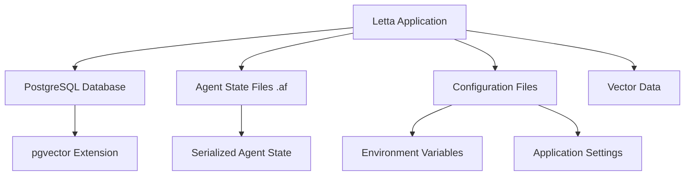
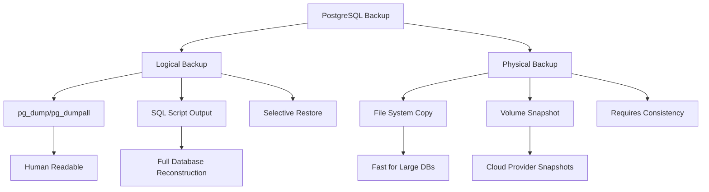

# Backup Strategies

<cite>
**Referenced Files in This Document**   
- [docker-compose.yml](file://scripts/docker-compose.yml)
- [run_postgres.sh](file://db/run_postgres.sh)
- [compose.yaml](file://compose.yaml)
- [init.sql](file://init.sql)
- [config.py](file://letta/config.py)
- [base.py](file://letta/orm/base.py)
- [agent_serialization_manager.py](file://letta/services/agent_serialization_manager.py)
- [agent_file.py](file://letta/schemas/agent_file.py)
</cite>

## Table of Contents
1. [Introduction](#introduction)
2. [Critical Components to Backup](#critical-components-to-backup)
3. [PostgreSQL Database Backup Strategies](#postgresql-database-backup-strategies)
4. [Agent State and Configuration Backup](#agent-state-and-configuration-backup)
5. [Automated Backup Implementation](#automated-backup-implementation)
6. [Backup Encryption and Secure Storage](#backup-encryption-and-secure-storage)
7. [Backup Verification and Integrity](#backup-verification-and-integrity)
8. [Recovery Point Objectives and Retention Policies](#recovery-point-objectives-and-retention-policies)
9. [Common Backup Pitfalls and Solutions](#common-backup-pitfalls-and-solutions)

## Introduction
This document outlines comprehensive backup strategies for the Letta application, focusing on safeguarding both application and database data. The Letta system utilizes PostgreSQL as its primary database with pgvector extension for vector data storage, and employs Docker-based deployment through various compose configurations. The backup strategy must address the critical components of the system including the PostgreSQL database, agent state files (.af), configuration files, and embedded vector data. This document provides detailed guidance on implementing both automated and manual backup approaches, with specific recommendations for full vs incremental backup methods, backup frequency, and retention policies aligned with recovery point objectives (RPO).

**Section sources**
- [docker-compose.yml](file://scripts/docker-compose.yml)
- [compose.yaml](file://compose.yaml)

## Critical Components to Backup
The Letta application consists of several critical components that require regular backup to ensure data integrity and system recoverability. These components include:

1. **PostgreSQL Database**: The primary data store containing all application data, including agent states, messages, sources, and metadata.
2. **Agent State Files (.af)**: Serialized agent state files that contain the complete state of individual agents, including their memory, tools, and conversation history.
3. **Configuration Files**: Application configuration files that define system behavior, API keys, and connection parameters.
4. **Embedded Vector Data**: Vector embeddings stored in the PostgreSQL database using the pgvector extension, which are critical for the application's AI capabilities.

The docker-compose.yml and compose.yaml files reveal the containerized architecture of the application, with PostgreSQL data volumes mounted at specific locations that must be targeted for backup operations.



**Diagram sources**
- [docker-compose.yml](file://scripts/docker-compose.yml)
- [compose.yaml](file://compose.yaml)
- [config.py](file://letta/config.py)

**Section sources**
- [docker-compose.yml](file://scripts/docker-compose.yml)
- [compose.yaml](file://compose.yaml)
- [config.py](file://letta/config.py)

## PostgreSQL Database Backup Strategies
The PostgreSQL database is the cornerstone of the Letta application's data persistence. The docker-compose.yml file shows that the PostgreSQL container mounts a volume at ./data/postgres:/var/lib/postgresql/data, while compose.yaml specifies ./.persist/pgdata:/var/lib/postgresql/data as the volume mount point. These mounted directories contain the complete database cluster data and must be the primary target for backup operations.

For PostgreSQL backup, two primary strategies are recommended:

1. **Logical Backups using pg_dump**: This approach creates a SQL script file with commands to reconstruct the database. It's ideal for smaller databases and allows for selective restoration of tables or schemas.

2. **Physical File System Backups**: Since the database files are mounted to the host file system, direct file system backups of the mounted volume can be performed. This method is faster for large databases but requires the database to be shut down or placed in backup mode to ensure consistency.

The init.sql file reveals that the database uses a custom schema with the public schema dropped, indicating that backup procedures must account for this non-standard configuration. Additionally, the database uses the pgvector extension for vector data storage, which is seamlessly handled by standard PostgreSQL backup methods.



**Diagram sources**
- [docker-compose.yml](file://scripts/docker-compose.yml)
- [compose.yaml](file://compose.yaml)
- [init.sql](file://init.sql)

**Section sources**
- [docker-compose.yml](file://scripts/docker-compose.yml)
- [compose.yaml](file://compose.yaml)
- [init.sql](file://init.sql)
- [run_postgres.sh](file://db/run_postgres.sh)

## Agent State and Configuration Backup
Agent state files (.af) represent serialized snapshots of individual agents within the Letta system. These files contain critical information including agent memory, tool configurations, conversation history, and file associations. The agent_serialization_manager.py file indicates that the system has built-in functionality for exporting and importing agent states, which should be leveraged for backup purposes.

The configuration files, including environment variables and application settings, are essential for system recovery. The config.py file shows that the application uses a structured configuration system with various storage types for archival, recall, and metadata storage. These configuration files should be backed up regularly, especially after any system changes.

For agent state backup, the following approach is recommended:
1. Use the built-in serialization functionality to export agent states to .af files
2. Compress and encrypt the exported files
3. Store the backup files in secure locations, both locally and offsite
4. Implement a retention policy that aligns with business requirements

The schema definitions in agent_file.py reveal the comprehensive nature of agent state data, including relationships between agents, files, sources, and messages, emphasizing the importance of complete and consistent backups.

**Section sources**
- [config.py](file://letta/config.py)
- [agent_serialization_manager.py](file://letta/services/agent_serialization_manager.py)
- [agent_file.py](file://letta/schemas/agent_file.py)

## Automated Backup Implementation
Automated backups are essential for ensuring consistent and reliable data protection. For the Letta application, automation can be implemented through cron jobs or scheduled tasks that execute backup scripts at predefined intervals.

Example cron job for PostgreSQL backup:
```
# Daily backup at 2:00 AM
0 2 * * * /path/to/backup-script.sh

# Weekly compressed backup on Sundays at 3:00 AM
0 3 * * 0 /path/to/weekly-backup-script.sh
```

The run_postgres.sh script provides insight into the PostgreSQL container management, which can be leveraged to create backup scripts that temporarily connect to the running container and execute backup commands. For Docker-based deployments, backup scripts should account for the containerized nature of the application, potentially using docker exec commands to run backup utilities within the container context.

For agent state backups, automated scripts can utilize the application's API or direct function calls to trigger the serialization of agent states. These scripts should be designed to handle multiple agents and include error handling for failed backup attempts.

**Section sources**
- [run_postgres.sh](file://db/run_postgres.sh)
- [docker-compose.yml](file://scripts/docker-compose.yml)
- [compose.yaml](file://compose.yaml)

## Backup Encryption and Secure Storage
Backup encryption is critical for protecting sensitive data in transit and at rest. All backup files should be encrypted using strong encryption algorithms before being stored in any location. For PostgreSQL backups, encryption can be implemented at multiple levels:

1. **Application-level encryption**: Using tools like pgcrypto to encrypt sensitive data within the database
2. **Backup file encryption**: Encrypting the backup files using tools like GPG or OpenSSL
3. **Storage-level encryption**: Utilizing encrypted volumes or cloud storage with server-side encryption

Secure storage locations should include:
- **Local storage**: For quick recovery, but with limited protection against physical disasters
- **Cloud storage**: For offsite protection, with options like AWS S3, Google Cloud Storage, or Azure Blob Storage
- **Offsite physical storage**: For disaster recovery, using external hard drives or tape backups stored in secure facilities

The principle of least privilege should be applied to backup storage, ensuring that only authorized personnel have access to backup files. Additionally, backup storage locations should be monitored for unauthorized access attempts.

**Section sources**
- [docker-compose.yml](file://scripts/docker-compose.yml)
- [compose.yaml](file://compose.yaml)

## Backup Verification and Integrity
Regular verification of backup integrity is essential to ensure that backups can be successfully restored when needed. Verification procedures should include:

1. **Checksum validation**: Calculating and storing checksums (e.g., SHA-256) of backup files to detect corruption
2. **Test restores**: Periodically performing test restores in a non-production environment to validate backup integrity
3. **Automated verification scripts**: Implementing scripts that automatically check backup files for completeness and readability

For PostgreSQL backups, the pg_restore command with the --list option can be used to verify the contents of a backup file without performing a full restore. For agent state files, the application's import functionality can be used in a test environment to verify that serialized agent states can be successfully reconstructed.

Backup logs should be maintained and regularly reviewed to identify any backup failures or warnings. Automated alerts should be configured to notify administrators of backup job failures or verification issues.

**Section sources**
- [docker-compose.yml](file://scripts/docker-compose.yml)
- [compose.yaml](file://compose.yaml)

## Recovery Point Objectives and Retention Policies
Recovery Point Objectives (RPO) define the maximum acceptable amount of data loss measured in time. For the Letta application, RPO should be determined based on business requirements and the criticality of the data. Common RPO tiers include:

- **High criticality**: RPO of 15 minutes or less, requiring frequent backups (e.g., every 5-10 minutes)
- **Medium criticality**: RPO of 1-4 hours, with hourly backups
- **Low criticality**: RPO of 24 hours, with daily backups

Retention policies should be established to balance storage costs with recovery requirements. A tiered retention approach is recommended:

1. **Short-term retention**: Keep frequent backups (e.g., hourly) for 7-14 days
2. **Medium-term retention**: Keep daily backups for 30-90 days
3. **Long-term retention**: Keep weekly or monthly backups for 1-7 years, depending on regulatory requirements

The retention policy should be documented and regularly reviewed to ensure it continues to meet business needs. Automated cleanup scripts should be implemented to remove expired backups according to the retention policy.

**Section sources**
- [config.py](file://letta/config.py)
- [docker-compose.yml](file://scripts/docker-compose.yml)

## Common Backup Pitfalls and Solutions
Several common pitfalls can compromise the effectiveness of backup strategies. These include:

1. **Incomplete transaction log backups**: When using PostgreSQL's continuous archiving and point-in-time recovery (PITR), failing to properly archive WAL (Write-Ahead Logging) files can prevent complete recovery. Solution: Implement proper WAL archiving configuration and monitor archive success.

2. **Inconsistent file system backups**: Taking file system backups without ensuring database consistency can result in corrupted backup files. Solution: Use PostgreSQL's pg_start_backup() and pg_stop_backup() functions to ensure a consistent state during physical backups.

3. **Single point of failure in backup storage**: Storing all backups in a single location creates a single point of failure. Solution: Implement a 3-2-1 backup strategy: 3 copies of data, on 2 different media, with 1 copy offsite.

4. **Failure to test restores**: Backups that have never been tested may be unusable when needed. Solution: Regularly perform test restores in a non-production environment.

5. **Insufficient monitoring and alerting**: Backup jobs can fail silently without proper monitoring. Solution: Implement comprehensive monitoring and alerting for all backup operations.

The init.sql file's use of custom schema configuration and the dropping of the public schema represents a specific configuration that must be accounted for in backup and recovery procedures, as standard backup tools may not handle this non-default configuration correctly.

**Section sources**
- [init.sql](file://init.sql)
- [docker-compose.yml](file://scripts/docker-compose.yml)
- [compose.yaml](file://compose.yaml)
- [run_postgres.sh](file://db/run_postgres.sh)