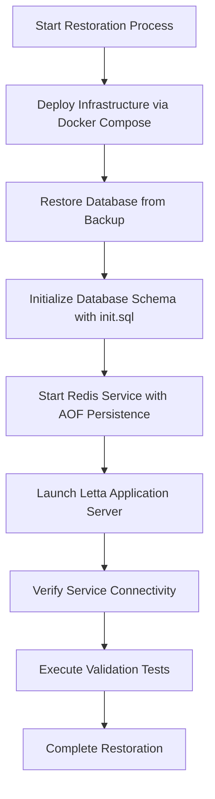

# Disaster Recovery

<cite>
**Referenced Files in This Document**   
- [docker-compose.yml](file://scripts/docker-compose.yml)
- [run_postgres.sh](file://db/run_postgres.sh)
- [compose.yaml](file://compose.yaml)
- [init.sql](file://init.sql)
- [database_utils.py](file://letta/database_utils.py)
- [settings.py](file://letta/settings.py)
- [config.py](file://letta/config.py)
</cite>

## Table of Contents
1. [Introduction](#introduction)
2. [Backup Procedures](#backup-procedures)
3. [Disaster Recovery Runbooks](#disaster-recovery-runbooks)
4. [Restoration Process](#restoration-process)
5. [High Availability Configurations](#high-availability-configurations)
6. [Data Consistency Considerations](#data-consistency-considerations)
7. [Disaster Recovery Testing](#disaster-recovery-testing)
8. [Disaster Preparedness Checklists](#disaster-preparedness-checklists)
9. [Recovery Objectives](#recovery-objectives)
10. [Post-Incident Analysis](#post-incident-analysis)

## Introduction
This document provides comprehensive disaster recovery guidance for Letta deployments, focusing on ensuring business continuity through robust backup, restoration, and high availability strategies. The Letta system utilizes a PostgreSQL database with pgvector extension for vector storage, Redis for caching, and a containerized deployment architecture using Docker Compose. The disaster recovery strategy encompasses automated backup procedures, detailed runbooks for various failure scenarios, and clear recovery objectives to minimize downtime and data loss.

**Section sources**
- [compose.yaml](file://compose.yaml#L1-L66)
- [docker-compose.yml](file://scripts/docker-compose.yml#L1-L33)

## Backup Procedures
The Letta system implements a comprehensive backup strategy for both application data and database content. The primary backup mechanism leverages Docker volume persistence and database dump utilities to ensure data integrity and availability.

The system uses persistent volumes for both PostgreSQL and Redis data storage, as defined in the docker-compose configurations. For PostgreSQL, the volume maps to `./data/postgres` or `./.persist/pgdata` depending on the deployment configuration, ensuring that database files are persisted outside the container lifecycle. Similarly, Redis data is persisted to `./data/redis` with append-only file (AOF) enabled for durability.

Database backups should be performed using PostgreSQL's native `pg_dump` utility, which can create consistent snapshots of the database. The backup process should include both the schema and data, with compression enabled to reduce storage requirements. Automated backup scripts can be implemented to perform regular backups according to a defined retention policy.

The retention policy should maintain multiple generations of backups to protect against various failure scenarios:
- Hourly backups for the past 24 hours
- Daily backups for the past 7 days
- Weekly backups for the past 4 weeks
- Monthly backups for the past 6 months

Backup integrity should be verified through regular checksum validation and test restoration procedures. All backups should be stored in geographically distributed locations to protect against data center failures.

**Section sources**
- [docker-compose.yml](file://scripts/docker-compose.yml#L31-L32)
- [compose.yaml](file://compose.yaml#L14-L15)
- [init.sql](file://init.sql#L1-L37)

## Disaster Recovery Runbooks
This section outlines detailed runbooks for various failure scenarios that may affect Letta deployments. Each runbook provides step-by-step instructions for identifying, mitigating, and recovering from specific types of failures.

### Database Corruption
In the event of database corruption, follow these steps:
1. Immediately stop the Letta application to prevent further writes
2. Assess the extent of corruption using PostgreSQL's `pg_checksums` utility
3. Attempt recovery using the latest valid backup
4. Validate data integrity after restoration
5. Gradually reintroduce the application services

The system's use of pgvector extension for vector storage requires special attention during recovery, as vector indexes may need to be rebuilt after data restoration.

### Server Outages
For server outages, execute the following procedure:
1. Verify the outage scope (single server vs. multiple servers)
2. Redirect traffic to backup or standby instances if available
3. Initiate server recovery or replacement
4. Restore services in the correct dependency order (database first, then application)
5. Validate service functionality through health checks

The docker-compose configuration includes health checks for both Redis and PostgreSQL services, which should be used to verify service readiness during recovery.

### Data Center Failures
In the event of a data center failure, follow this runbook:
1. Activate the disaster recovery site
2. Restore the latest backup to the DR environment
3. Update DNS records to redirect traffic to the DR site
4. Validate all services and data integrity
5. Monitor system performance and user experience

The runbook should include contact information for key personnel, cloud provider support, and any third-party services required for recovery.

**Section sources**
- [docker-compose.yml](file://scripts/docker-compose.yml#L6-L10)
- [compose.yaml](file://compose.yaml#L18-L22)
- [settings.py](file://letta/settings.py#L250-L265)

## Restoration Process
The restoration process for Letta deployments involves using the docker-compose configuration files and database initialization scripts to rebuild the system from backups.

The primary restoration mechanism utilizes the `docker-compose.yml` and `compose.yaml` files, which define the complete service topology including PostgreSQL, Redis, and the Letta application server. The restoration process begins by ensuring the availability of the latest database backup and application configuration files.

To restore from backup:
1. Deploy the infrastructure using the appropriate compose file (`docker-compose.yml` for development, `compose.yaml` for production)
2. Restore the PostgreSQL database from the latest backup using `pg_restore` or by importing a SQL dump
3. Initialize the database schema using the `init.sql` script, which creates the necessary schema, extensions, and configurations
4. Start the Redis service with AOF persistence enabled
5. Launch the Letta application server and verify connectivity to both database and cache

The `run_postgres.sh` script provides an example of how to run a PostgreSQL container with volume mounting, which can be adapted for restoration purposes. The script demonstrates the use of named volumes and port mapping, which are essential for data persistence during the restoration process.

Database restoration should be performed in maintenance mode with the application temporarily disabled to prevent data inconsistencies. After restoration, comprehensive validation tests should be executed to ensure data integrity and system functionality.

**Diagram sources **
- [docker-compose.yml](file://scripts/docker-compose.yml#L1-L33)
- [compose.yaml](file://compose.yaml#L1-L66)
- [init.sql](file://init.sql#L1-L37)
- [run_postgres.sh](file://db/run_postgres.sh#L1-L11)

**Section sources**
- [docker-compose.yml](file://scripts/docker-compose.yml#L1-L33)
- [compose.yaml](file://compose.yaml#L1-L66)
- [init.sql](file://init.sql#L1-L37)
- [run_postgres.sh](file://db/run_postgres.sh#L1-L11)

## High Availability Configurations
Letta deployments can achieve high availability through multi-region deployments and failover mechanisms. The system architecture supports horizontal scaling and redundancy at multiple levels.

### Multi-Region Deployments
Multi-region deployments involve running identical Letta instances in geographically distributed data centers. This configuration provides protection against regional outages and reduces latency for global users. Each region should have its own database instance with asynchronous replication from the primary region.

The `compose.yaml` file demonstrates the use of environment variables for configuration, which facilitates deployment across different regions with region-specific settings. The LETTA_PG_URI environment variable allows for database connection configuration that can be customized for each deployment region.

### Failover Mechanisms
Failover mechanisms should be implemented at both the application and database levels:
- Application-level failover using load balancers with health checks
- Database-level failover using PostgreSQL streaming replication and automatic failover tools like Patroni
- DNS-based failover for redirecting traffic to backup regions

The system's use of Redis for caching should include Redis Sentinel or Redis Cluster configurations to ensure cache availability during failover events. The health check configuration in the docker-compose files provides the foundation for automated failover detection.

High availability configurations should be tested regularly to ensure failover mechanisms work as expected. Monitoring and alerting should be implemented to detect failures and trigger failover procedures automatically when possible.

**Section sources**
- [compose.yaml](file://compose.yaml#L10-L12)
- [settings.py](file://letta/settings.py#L250-L265)
- [docker-compose.yml](file://scripts/docker-compose.yml#L26-L29)

## Data Consistency Considerations
Data consistency during recovery operations is critical for maintaining the integrity of the Letta system. The system employs several mechanisms to ensure data consistency across components.

The PostgreSQL database serves as the primary source of truth for all persistent data, including agent states, messages, and configuration settings. The database schema, defined in the Alembic migration files and initialized by `init.sql`, enforces referential integrity through foreign key constraints and unique constraints.

During recovery operations, the following data consistency considerations must be addressed:
- Transactional integrity: Ensure all database transactions are properly committed or rolled back
- Vector index consistency: Verify that pgvector indexes are synchronized with the underlying data
- Cache coherence: Invalidate or refresh Redis cache entries after data restoration
- Configuration synchronization: Ensure application configuration files are consistent across all instances

The system's use of SQLAlchemy ORM with Alembic for database migrations provides a structured approach to schema evolution while maintaining data consistency. The `database_utils.py` file contains utilities for database URI handling that ensure consistent database connections across different components.

Data consistency validation should be performed after any recovery operation using checksums, record counts, and functional tests to verify that all components are working together correctly.

**Section sources**
- [init.sql](file://init.sql#L1-L37)
- [database_utils.py](file://letta/database_utils.py#L1-L162)
- [settings.py](file://letta/settings.py#L250-L265)

## Disaster Recovery Testing
Regular disaster recovery testing is essential for ensuring the effectiveness of the recovery procedures and identifying potential issues before an actual disaster occurs.

### Test Scenarios
The following test scenarios should be conducted regularly:
- Full system restoration from backup
- Database failover and failback
- Single component failure and recovery
- Network partition and recovery
- Data corruption detection and repair

### Test Frequency
Disaster recovery tests should be scheduled according to the following frequency:
- Full recovery test: Quarterly
- Component-level recovery test: Monthly
- Failover simulation: Bi-weekly
- Backup validation: Weekly

### Test Documentation
Each disaster recovery test should be thoroughly documented, including:
- Test objectives and scope
- Pre-test configuration
- Test execution steps
- Observed results and timing
- Issues encountered and resolutions
- Post-test recommendations

The test results should be reviewed by the operations team and used to update the disaster recovery runbooks and procedures. Lessons learned from testing should be incorporated into the overall disaster recovery strategy.

**Section sources**
- [docker-compose.yml](file://scripts/docker-compose.yml#L1-L33)
- [compose.yaml](file://compose.yaml#L1-L66)
- [init.sql](file://init.sql#L1-L37)

## Disaster Preparedness Checklists
This section provides checklists to ensure disaster preparedness for Letta deployments.

### Pre-Disaster Checklist
- [ ] Verify backup integrity and retention policy compliance
- [ ] Confirm disaster recovery site readiness
- [ ] Validate contact information for key personnel
- [ ] Review and update disaster recovery runbooks
- [ ] Test backup restoration procedures
- [ ] Verify monitoring and alerting configurations
- [ ] Confirm communication plan for stakeholders

### During-Disaster Checklist
- [ ] Activate incident response team
- [ ] Assess impact and scope of the disaster
- [ ] Implement containment measures
- [ ] Communicate with stakeholders
- [ ] Execute appropriate disaster recovery runbook
- [ ] Document all actions and decisions
- [ ] Monitor recovery progress

### Post-Disaster Checklist
- [ ] Verify system functionality and data integrity
- [ ] Conduct post-mortem analysis
- [ ] Update disaster recovery documentation
- [ ] Implement improvements based on lessons learned
- [ ] Communicate resolution to stakeholders
- [ ] Review insurance coverage and claims
- [ ] Schedule follow-up review meeting

These checklists should be reviewed and updated regularly to ensure they remain relevant and effective.

**Section sources**
- [docker-compose.yml](file://scripts/docker-compose.yml#L1-L33)
- [compose.yaml](file://compose.yaml#L1-L66)
- [init.sql](file://init.sql#L1-L37)

## Recovery Objectives
This section defines the Recovery Time Objective (RTO) and Recovery Point Objective (RPO) for different components of the Letta system.

### Recovery Time Objectives (RTO)
The RTO represents the maximum acceptable downtime for each system component:

| Component | RTO | Description |
|---------|-----|-------------|
| Database | 2 hours | Time to restore database from backup and bring online |
| Application Server | 30 minutes | Time to redeploy application containers |
| Redis Cache | 15 minutes | Time to restore cache service |
| Full System | 4 hours | Time to fully restore all components and validate functionality |

### Recovery Point Objectives (RPO)
The RPO represents the maximum acceptable data loss measured in time:

| Component | RPO | Description |
|---------|-----|-------------|
| Database | 15 minutes | Maximum data loss from last backup |
| Message Queue | 5 minutes | Maximum message loss from Redis persistence |
| Configuration | 1 hour | Maximum configuration drift |
| Full System | 15 minutes | Overall data loss tolerance |

These objectives should be regularly reviewed and updated based on business requirements and system capabilities. Monitoring should be implemented to track actual recovery times and data loss during tests to ensure compliance with these objectives.

**Section sources**
- [settings.py](file://letta/settings.py#L250-L265)
- [docker-compose.yml](file://scripts/docker-compose.yml#L6-L10)
- [compose.yaml](file://compose.yaml#L18-L22)

## Post-Incident Analysis
After any disaster recovery event, a thorough post-incident analysis should be conducted to identify root causes, evaluate response effectiveness, and implement improvements.

### Analysis Process
The post-incident analysis should follow these steps:
1. Gather all relevant data and logs from the incident
2. Interview personnel involved in the response
3. Document the timeline of events
4. Identify root causes and contributing factors
5. Evaluate the effectiveness of the response
6. Develop recommendations for improvement
7. Implement corrective actions
8. Update documentation and procedures

### Key Metrics to Analyze
- Time to detect the incident
- Time to initiate recovery procedures
- Actual recovery time vs. RTO
- Data loss vs. RPO
- Resource utilization during recovery
- Communication effectiveness
- Personnel response and coordination

### Reporting
A comprehensive post-incident report should be created, including:
- Executive summary
- Detailed incident timeline
- Root cause analysis
- Response evaluation
- Lessons learned
- Action items and recommendations
- Updated risk assessment

The findings from the post-incident analysis should be shared with relevant stakeholders and used to improve the overall disaster recovery strategy. Regular review of past incidents can help identify patterns and systemic issues that require attention.

**Section sources**
- [settings.py](file://letta/settings.py#L277-L288)
- [docker-compose.yml](file://scripts/docker-compose.yml#L6-L10)
- [compose.yaml](file://compose.yaml#L18-L22)