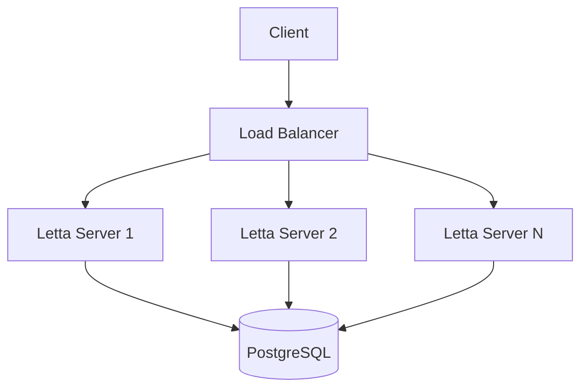
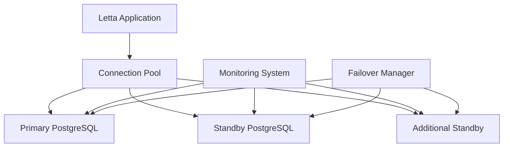
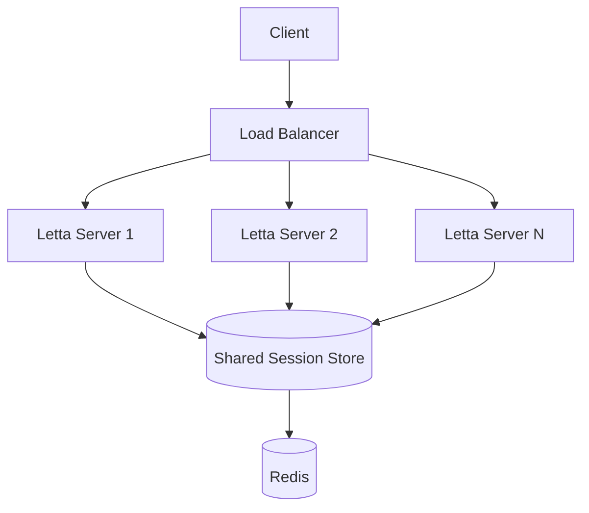
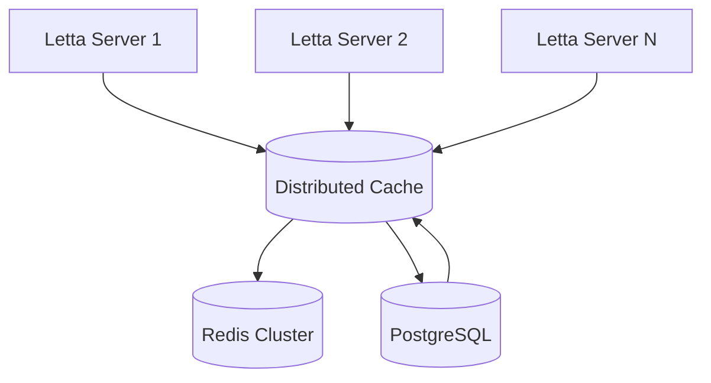
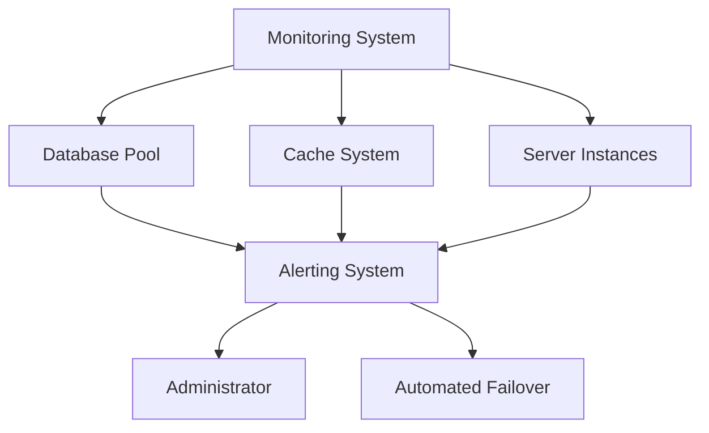
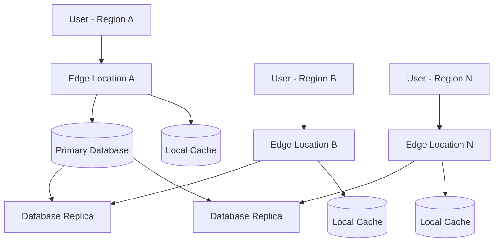

# High Availability

<cite>
**Referenced Files in This Document**   
- [compose.yaml](file://compose.yaml)
- [dev-compose.yaml](file://dev-compose.yaml)
- [scripts/docker-compose.yml](file://scripts/docker-compose.yml)
- [Dockerfile](file://Dockerfile)
- [nginx.conf](file://nginx.conf)
- [letta/server/server.py](file://letta/server/server.py)
- [letta/settings.py](file://letta/settings.py)
- [letta/server/db.py](file://letta/server/db.py)
- [letta/otel/db_pool_monitoring.py](file://letta/otel/db_pool_monitoring.py)
- [letta/services/agent_serialization_manager.py](file://letta/services/agent_serialization_manager.py)
- [db/run_postgres.sh](file://db/run_postgres.sh)
</cite>

## Table of Contents
1. [Introduction](#introduction)
2. [Deployment Topologies](#deployment-topologies)
3. [Database High Availability](#database-high-availability)
4. [Load Balancing and Session Management](#load-balancing-and-session-management)
5. [State Synchronization for Agents](#state-synchronization-for-agents)
6. [Monitoring and Automated Failover](#monitoring-and-automated-failover)
7. [Geographic Distribution](#geographic-distribution)
8. [Conclusion](#conclusion)

## Introduction
This document provides comprehensive guidance on implementing high availability (HA) strategies for Letta deployments to minimize downtime and ensure continuous service. The focus is on leveraging Docker and docker-compose for container orchestration, configuring PostgreSQL for database resilience, implementing load balancing across multiple Letta server instances, and addressing state synchronization challenges for agents with persistent memory. The document also covers monitoring, automated failover mechanisms, and geographic distribution across availability zones to create robust, production-grade deployments.

## Deployment Topologies

### Active-Passive Deployment
The active-passive deployment topology for Letta involves running one primary server instance that handles all traffic while a secondary instance remains in standby mode. This configuration is defined in the `compose.yaml` file where the `letta_server` service is configured with health checks and dependencies on the database service. In this setup, the passive server monitors the active server's health through periodic checks. If the active server fails, the passive server automatically takes over by updating the load balancer configuration or DNS records to redirect traffic. This failover process can be automated using scripts that monitor the health endpoint of the active server and trigger the promotion of the passive server when necessary.

### Active-Active Deployment
The active-active deployment topology allows multiple Letta server instances to handle traffic simultaneously, providing better resource utilization and improved fault tolerance. This can be achieved by configuring multiple instances of the `letta_server` service in the `compose.yaml` file and placing them behind a load balancer such as NGINX. Each server instance connects to the same PostgreSQL database, ensuring data consistency across all nodes. The load balancer distributes incoming requests across the available server instances using algorithms like round-robin or least connections. This approach not only improves performance by distributing the load but also enhances availability since the failure of one server instance does not impact the overall system functionality. The active-active topology is particularly beneficial for handling high traffic volumes and ensuring low-latency responses.

**Diagram sources**
- [compose.yaml](file://compose.yaml#L23-L38)
- [nginx.conf](file://nginx.conf#L4-L17)

**Section sources**
- [compose.yaml](file://compose.yaml#L1-L66)
- [nginx.conf](file://nginx.conf#L1-L29)

## Database High Availability

### PostgreSQL Replication
Letta uses PostgreSQL as its primary database, which supports various high availability configurations. The `compose.yaml` file configures a PostgreSQL container using the `ankane/pgvector:v0.5.1` image with environment variables for user, password, and database name. For high availability, PostgreSQL replication can be implemented using streaming replication where a primary server handles all write operations while one or more standby servers continuously apply changes from the primary. This setup ensures that if the primary server fails, a standby server can be promoted to primary with minimal data loss. The replication process involves configuring the primary server to archive Write-Ahead Logging (WAL) files and setting up standby servers to continuously fetch and apply these logs.

### Failover Mechanisms
Automated failover mechanisms are critical for maintaining database availability. PostgreSQL offers several solutions for automatic failover, including the use of tools like Patroni or repmgr. These tools monitor the health of the primary server and automatically promote a standby server when a failure is detected. In the Letta deployment, the health check configuration in `compose.yaml` for the `letta_db` service ensures that the database container's health is continuously monitored. When combined with a failover tool, this allows for seamless transition between primary and standby servers without manual intervention. The failover process should be tested regularly to ensure that it works correctly and that data consistency is maintained during the transition.

### Connection Pooling
Connection pooling is essential for managing database connections efficiently in a high-availability environment. The `settings.py` file contains configuration options for PostgreSQL connection pooling, including `pg_pool_size`, `pg_max_overflow`, `pg_pool_timeout`, and `pg_pool_recycle`. These settings control the number of concurrent connections, the maximum number of overflow connections, the timeout for acquiring a connection, and the interval for recycling connections. Properly configuring these parameters helps prevent connection exhaustion and ensures that database resources are used efficiently. The `db.py` file implements the connection pool using SQLAlchemy's async engine, which creates a pool of database connections that can be reused across multiple requests, reducing the overhead of establishing new connections for each request.

**Diagram sources**
- [compose.yaml](file://compose.yaml#L2-L22)
- [settings.py](file://letta/settings.py#L250-L263)
- [db.py](file://letta/server/db.py#L16-L46)

**Section sources**
- [compose.yaml](file://compose.yaml#L1-L66)
- [settings.py](file://letta/settings.py#L225-L265)
- [db.py](file://letta/server/db.py#L1-L106)

## Load Balancing and Session Management

### Configuring Load Balancing
Load balancing across multiple Letta server instances is achieved using NGINX as a reverse proxy. The `nginx.conf` file defines an HTTP server that listens on ports 80 and 8283, forwarding requests to the `letta-server` container. This configuration allows for distributing incoming traffic across multiple server instances, improving performance and availability. The load balancer can be configured with different algorithms such as round-robin, least connections, or IP hash to determine how requests are distributed among the backend servers. Health checks can be implemented to ensure that only healthy server instances receive traffic, automatically removing any instance that fails its health check from the pool.

### Ensuring Session Consistency
Session consistency in a distributed Letta environment is maintained through centralized session storage and proper configuration of the application's state management. Since Letta agents maintain persistent memory and state, it's crucial to ensure that subsequent requests from the same client are routed to the same server instance or that session data is shared across all instances. This can be achieved by using sticky sessions in the load balancer configuration or by storing session data in a shared storage system such as Redis. The `settings.py` file includes configuration options for Redis, allowing it to be used as a distributed cache for session data. By centralizing session storage, any server instance can access the required session information, ensuring consistent behavior regardless of which instance handles the request.

**Diagram sources**
- [nginx.conf](file://nginx.conf#L4-L17)
- [settings.py](file://letta/settings.py#L266-L268)

**Section sources**
- [nginx.conf](file://nginx.conf#L1-L29)
- [settings.py](file://letta/settings.py#L266-L268)

## State Synchronization for Agents

### Challenges with Persistent Memory
Agents in Letta maintain persistent memory through core memory blocks and archival storage, creating challenges for state synchronization in a distributed environment. When multiple server instances are running, ensuring that all instances have access to the most up-to-date agent state is critical for maintaining consistency. The primary challenge arises when an agent's memory is modified on one server instance but those changes are not immediately reflected on other instances. This can lead to inconsistent behavior and potential data loss if not properly managed. The `agent_serialization_manager.py` file contains logic for exporting and importing agent states, which can be leveraged to synchronize agent memory across instances.

### Strategies Using Shared Storage
To address state synchronization challenges, shared storage solutions can be implemented. One approach is to use a distributed file system or object storage service that all server instances can access. This allows agent memory and configuration files to be stored centrally, ensuring that any server instance can retrieve the latest state when needed. Another strategy involves using a message queue system to propagate state changes across instances. When an agent's memory is updated on one server, a message is published to the queue, notifying other instances to refresh their local cache. The `compose.yaml` file can be extended to include services like Redis or RabbitMQ to facilitate this communication.

### Strategies Using Distributed Caches
Distributed caching provides an efficient solution for state synchronization by maintaining a shared cache layer accessible to all server instances. Redis is particularly well-suited for this purpose due to its support for data structures, persistence, and high performance. Agent states can be cached in Redis with appropriate expiration policies to balance consistency and performance. When an agent is accessed, the server first checks the cache for the latest state before falling back to the database. Any modifications to the agent's state are written to both the database and the cache, ensuring that subsequent requests receive the updated information. The `settings.py` file includes configuration options for Redis, allowing it to be integrated into the Letta deployment for distributed caching.

**Diagram sources**
- [settings.py](file://letta/settings.py#L266-L268)
- [letta/services/agent_serialization_manager.py](file://letta/services/agent_serialization_manager.py#L1-L800)

**Section sources**
- [settings.py](file://letta/settings.py#L266-L268)
- [letta/services/agent_serialization_manager.py](file://letta/services/agent_serialization_manager.py#L1-L800)

## Monitoring and Automated Failover

### Health Checks
Health checks are essential for monitoring the status of Letta components and ensuring high availability. The `compose.yaml` file defines health checks for both the database and server services using the `healthcheck` directive. For the `letta_db` service, the health check uses the `pg_isready` command to verify that the PostgreSQL database is accepting connections. The `letta_server` service depends on the database being healthy before starting, ensuring that the application only runs when its dependencies are available. Additional health checks can be implemented at the application level by exposing endpoints that verify the status of critical components such as database connectivity, cache availability, and external service integrations.

### Automated Failover Triggers
Automated failover triggers can be implemented using monitoring tools that continuously check the health of Letta components and initiate failover procedures when issues are detected. The `jobs/scheduler.py` file contains logic for managing background jobs and could be extended to include failover functionality. When a health check fails, the monitoring system can trigger scripts that promote a standby server to active status, update load balancer configurations, or send notifications to administrators. The failover process should be designed to minimize downtime and data loss, with mechanisms in place to ensure that the failed component is properly shut down before the new instance takes over.

### Database Pool Monitoring
Database connection pool monitoring is crucial for maintaining optimal performance and detecting potential issues before they impact availability. The `otel/db_pool_monitoring.py` file implements a `DatabasePoolMonitor` class that uses SQLAlchemy event listeners to track connection pool metrics and events. This monitor captures statistics such as the number of checked-out connections, available connections, and overflow connections, providing valuable insights into database usage patterns. These metrics can be used to trigger alerts when connection usage approaches critical levels, allowing administrators to take proactive measures such as scaling the database or optimizing queries. The monitoring data can also be used to fine-tune connection pool settings in `settings.py` for better performance and resource utilization.

**Diagram sources**
- [compose.yaml](file://compose.yaml#L18-L22)
- [otel/db_pool_monitoring.py](file://letta/otel/db_pool_monitoring.py#L1-L309)
- [jobs/scheduler.py](file://letta/jobs/scheduler.py#L140-L168)

**Section sources**
- [compose.yaml](file://compose.yaml#L1-L66)
- [otel/db_pool_monitoring.py](file://letta/otel/db_pool_monitoring.py#L1-L309)
- [jobs/scheduler.py](file://letta/jobs/scheduler.py#L140-L168)

## Geographic Distribution

### Cross-Availability Zone Deployment
Geographic distribution of Letta deployments across multiple availability zones enhances resilience against regional outages. This can be achieved by deploying identical infrastructure in different geographic locations and using DNS-based load balancing to route traffic to the nearest or most available region. Each availability zone should have its own set of Letta server instances, database replicas, and supporting services to ensure independence and fault isolation. The `compose.yaml` file can be used as a template for deploying the infrastructure in each region, with appropriate modifications for region-specific configurations such as database endpoints and API keys.

### Data Synchronization Across Regions
Data synchronization across geographically distributed Letta deployments requires careful planning to maintain consistency while minimizing latency. PostgreSQL's built-in replication features can be used to synchronize data between primary and standby databases in different regions. However, due to network latency, asynchronous replication is typically used, which introduces a small window of potential data loss in case of a regional failure. To mitigate this, applications should be designed to handle eventual consistency and provide mechanisms for conflict resolution when data from different regions needs to be merged. The `settings.py` file can be configured to specify different database endpoints for each region, allowing the application to connect to the local database instance for better performance.

### Latency Optimization
Latency optimization in geographically distributed deployments involves several strategies to ensure responsive performance for users regardless of their location. Content Delivery Networks (CDNs) can be used to cache static assets and reduce the distance between users and content. Database read replicas can be deployed in each region to serve read requests locally, reducing the need for cross-region database queries. The `nginx.conf` file can be extended to include caching directives that store frequently accessed responses, further reducing latency. Additionally, application logic can be optimized to minimize the number of round trips required for common operations, and asynchronous processing can be used for non-critical tasks to improve perceived performance.

**Diagram sources**
- [compose.yaml](file://compose.yaml#L1-L66)
- [nginx.conf](file://nginx.conf#L1-L29)
- [settings.py](file://letta/settings.py#L250-L265)

**Section sources**
- [compose.yaml](file://compose.yaml#L1-L66)
- [nginx.conf](file://nginx.conf#L1-L29)
- [settings.py](file://letta/settings.py#L250-L265)

## Conclusion
Implementing high availability for Letta deployments requires a comprehensive approach that addresses infrastructure, database, application, and network layers. By leveraging Docker and docker-compose for container orchestration, configuring PostgreSQL for replication and failover, implementing load balancing with session management, and addressing state synchronization challenges, organizations can create robust and resilient Letta deployments. Monitoring and automated failover mechanisms ensure that issues are detected and resolved quickly, while geographic distribution across availability zones provides protection against regional outages. The combination of these strategies minimizes downtime and ensures continuous service availability, making Letta suitable for mission-critical applications and high-traffic environments.