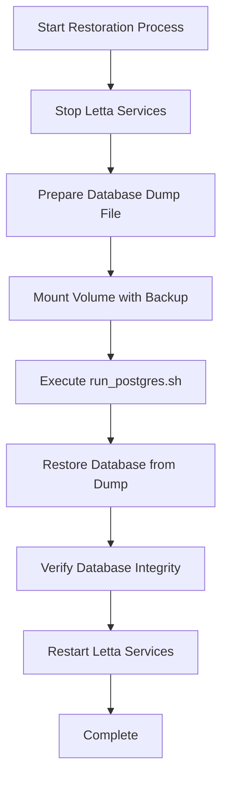
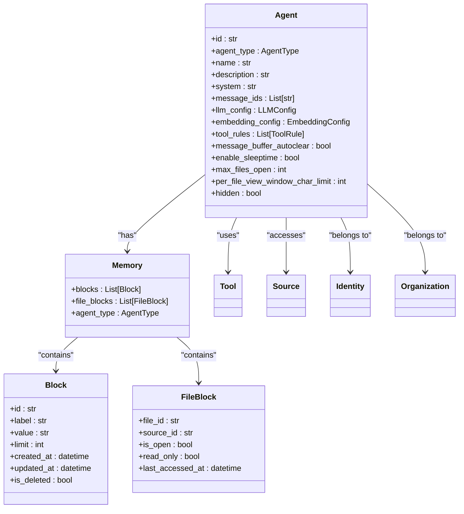
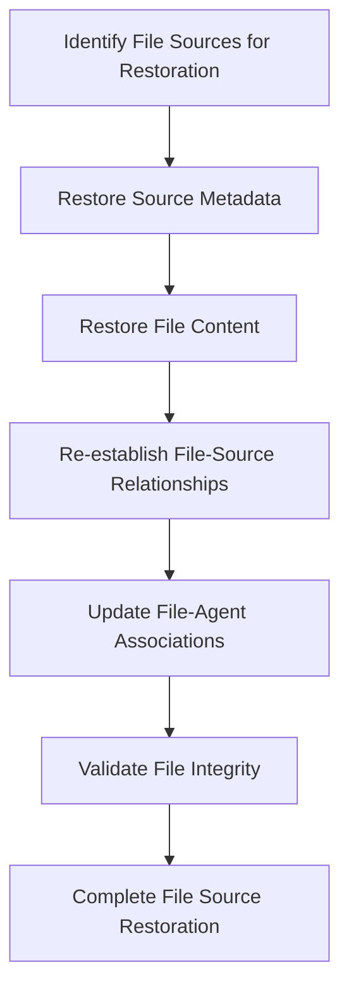
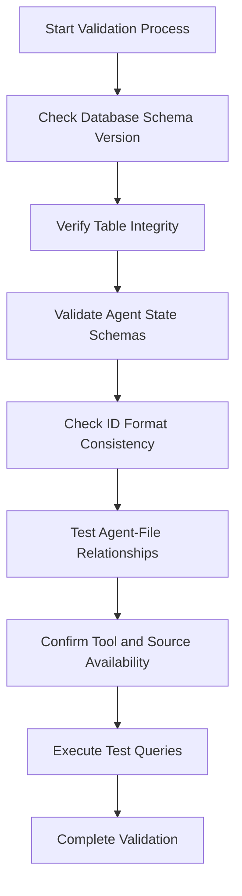
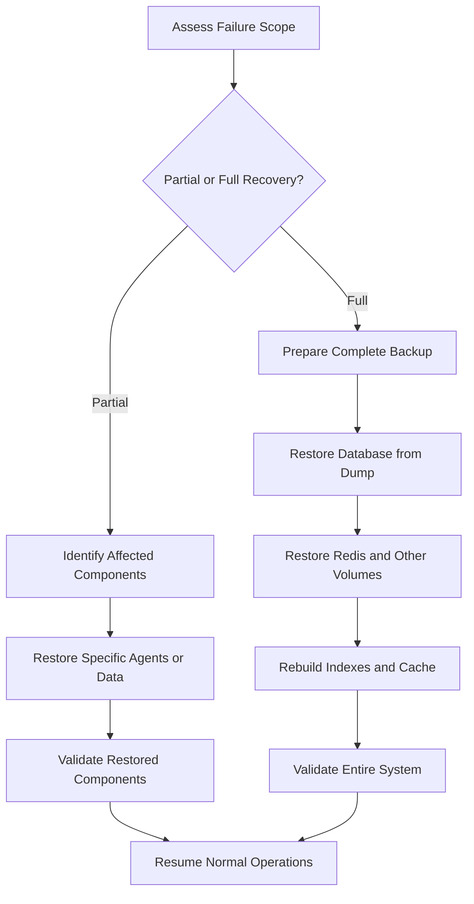
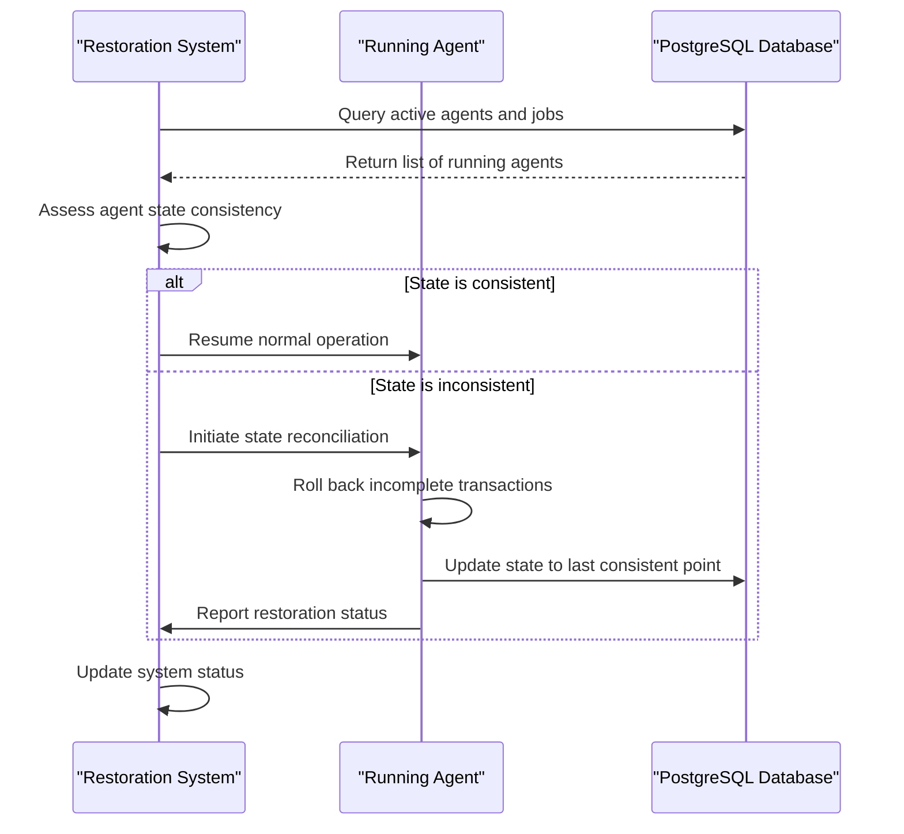
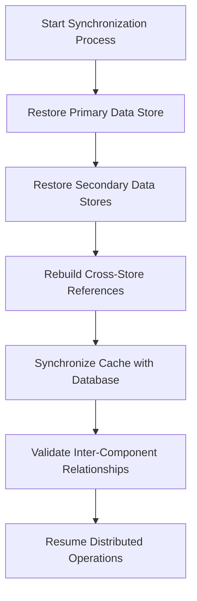
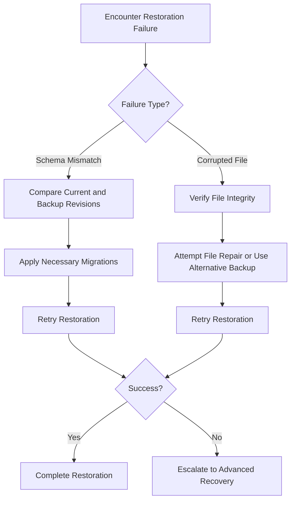

# Restoration Procedures

<cite>
**Referenced Files in This Document**   
- [run_postgres.sh](file://db/run_postgres.sh)
- [docker-compose.yml](file://scripts/docker-compose.yml)
- [compose.yaml](file://compose.yaml)
- [init.sql](file://init.sql)
- [agent.py](file://letta/orm/agent.py)
- [database_utils.py](file://letta/database_utils.py)
- [agent_serialization_manager.py](file://letta/services/agent_serialization_manager.py)
- [agent_manager.py](file://letta/services/agent_manager.py)
</cite>

## Table of Contents
1. [Introduction](#introduction)
2. [PostgreSQL Database Restoration](#postgresql-database-restoration)
3. [Agent State and Memory Restoration](#agent-state-and-memory-restoration)
4. [File Source Restoration](#file-source-restoration)
5. [Validation and Data Consistency](#validation-and-data-consistency)
6. [Partial vs Full System Recovery](#partial-vs-full-system-recovery)
7. [Handling Running Agent States](#handling-running-agent-states)
8. [Distributed Component Synchronization](#distributed-component-synchronization)
9. [Troubleshooting Common Restoration Failures](#troubleshooting-common-restoration-failures)
10. [Testing Restoration in Staging Environments](#testing-restoration-in-staging-environments)
11. [Conclusion](#conclusion)

## Introduction
This document provides comprehensive procedures for restoring the Letta system from various failure scenarios. The restoration process focuses on recovering the PostgreSQL database, agent states, memory blocks, and file sources from backups. The procedures are designed to ensure data consistency and system integrity after restoration. The document covers both full and partial recovery scenarios, addressing the complexities of distributed components and running agent states. Special attention is given to validation steps and troubleshooting common issues that may arise during the restoration process.

## PostgreSQL Database Restoration

The PostgreSQL database restoration process in Letta relies on the `run_postgres.sh` script within the docker-compose environment. This script facilitates the creation and execution of a PostgreSQL container specifically configured for Letta's requirements. The restoration process begins with ensuring the proper configuration of the database container as defined in the docker-compose files.

The `docker-compose.yml` file defines the PostgreSQL service with the `ankane/pgvector` image, exposing port 5432 and mounting a volume for persistent data storage at `./data/postgres:/var/lib/postgresql/data`. This volume mount is critical for database restoration, as it allows the container to access existing database files or receive new dump files for restoration. The service also includes an initialization script (`init.sql`) that is executed when the container is first created, ensuring the database is properly configured with the necessary schema and extensions.

**Diagram sources**
- [run_postgres.sh](file://db/run_postgres.sh#L1-L11)
- [docker-compose.yml](file://scripts/docker-compose.yml#L1-L33)

The `run_postgres.sh` script provides the mechanism for building and running the PostgreSQL container. It uses a custom Dockerfile (`db/Dockerfile.simple`) to build the container image and then runs it with specific parameters, including port mapping (8888:5432), environment variables for authentication, and a named volume for data persistence. During restoration, this script can be modified to include additional parameters for importing a database dump.

The `init.sql` file plays a crucial role in database initialization and restoration. It contains SQL commands to create the database schema, set up the search path, and install necessary extensions like the vector extension for pgvector. When restoring from a backup, this file ensures that the database environment is properly configured before the data is imported. The script uses dynamic variables to set the database user, password, and name, allowing for flexibility in different deployment environments.

**Section sources**
- [run_postgres.sh](file://db/run_postgres.sh#L1-L11)
- [docker-compose.yml](file://scripts/docker-compose.yml#L1-L33)
- [init.sql](file://init.sql#L1-L37)

## Agent State and Memory Restoration

Agent state and memory restoration in Letta involves recovering the core memory blocks, file blocks, and associated metadata for each agent. The system uses a sophisticated ORM (Object-Relational Mapping) structure to manage agent states, with the `Agent` class in `agent.py` defining the relationships between agents, their memory blocks, tools, sources, and other components. The restoration process must maintain the integrity of these relationships to ensure proper agent functionality after recovery.

The agent restoration process leverages the `AgentSerializationManager` class, which coordinates the export and import of agent data between the database and the AgentFileSchema format. This manager handles ID mapping between database IDs and human-readable file IDs, ensuring referential integrity during the restoration process. When restoring agent states, the manager extracts unique tools, blocks, sources, and files associated with the agents, preserving their relationships and metadata.

**Diagram sources**
- [agent.py](file://letta/orm/agent.py#L37-L436)

The restoration process for agent memory involves several critical steps. First, the core memory blocks are restored from the database, maintaining their hierarchical structure and content. Then, file blocks are synchronized with their corresponding source files, ensuring that the agent's view of external files is consistent with the current state of those files. The `refresh_file_blocks` method in the `AgentManager` class can be used to update file blocks with current file content after restoration, respecting the per-file view window character limit to prevent excessive memory usage.

Special consideration must be given to the restoration of agent states that were actively running at the time of failure. The system must handle the potential inconsistency between the agent's in-memory state and the persisted state in the database. This is particularly important for agents with enabled sleeptime functionality, where memory management occurs in a background thread. The restoration process should include steps to reconcile any discrepancies between the agent's last known state and its current operational requirements.

**Section sources**
- [agent.py](file://letta/orm/agent.py#L37-L436)
- [agent_serialization_manager.py](file://letta/services/agent_serialization_manager.py#L58-L431)
- [agent_manager.py](file://letta/services/agent_manager.py#L1615-L1671)

## File Source Restoration

File source restoration in Letta involves recovering both the file metadata and content from backups, ensuring that agents can access their required data sources after system recovery. The system maintains a comprehensive relationship between files, sources, and agents through the `FileAgent` relationship table, which tracks which files are associated with which agents and sources. This relationship is critical for maintaining data integrity during the restoration process.

The restoration process begins with identifying all file sources that need to be recovered. Each source in the system has associated metadata, including name, description, and instructions, which are stored in the database. When restoring file sources, both the metadata and the actual file content must be recovered. The `SourceManager` and `FileManager` classes coordinate this process, ensuring that files are properly linked to their sources and that the relationships are maintained.

**Diagram sources**
- [agent_serialization_manager.py](file://letta/services/agent_serialization_manager.py#L162-L188)

The file restoration process must handle various file types and sizes, ensuring that large files are processed efficiently without overwhelming system resources. The system supports different file parsers (MistralFileParser or MarkitdownFileParser) depending on the available API keys, which must be properly configured during the restoration process. After files are restored, their content is processed and potentially chunked for embedding, which may require additional computational resources.

Special attention must be given to the restoration of file blocks that are part of an agent's memory. These blocks represent specific portions of files that the agent is actively working with and must be restored with their exact content, limits, and metadata. The restoration process should verify that the file blocks correspond to the current version of their source files, potentially triggering a refresh if the source files have been updated since the backup was created.

**Section sources**
- [agent_serialization_manager.py](file://letta/services/agent_serialization_manager.py#L162-L188)
- [agent_manager.py](file://letta/services/agent_manager.py#L1615-L1671)

## Validation and Data Consistency

Validation and data consistency checks are critical components of the Letta restoration process, ensuring that all restored components function correctly and maintain their relationships. The system employs multiple validation mechanisms at different levels, from database integrity checks to schema validation for agent configurations.

Database integrity is verified through the use of Alembic migrations, which track the database schema version and ensure consistency across deployments. The `get_latest_alembic_revision` function in `utils.py` can be used to check the current database revision, confirming that the schema matches the expected version after restoration. This is particularly important when restoring from backups that may have been created with a different schema version.

**Diagram sources**
- [utils.py](file://letta/utils.py#L1333-L1349)
- [agent_serialization_manager.py](file://letta/services/agent_serialization_manager.py#L805-L826)

Agent state validation involves checking the consistency of ID formats across all entities. The `AgentSerializationManager` includes validation checks that ensure all IDs follow the expected format (e.g., "agent-{uuid}" for agents, "block-{uuid}" for blocks). These checks help prevent issues that could arise from ID conflicts or formatting errors during the restoration process.

Data consistency is further ensured through the use of foreign key constraints and relationship validation in the ORM models. For example, the `Agent` class defines relationships with tools, sources, and blocks using SQLAlchemy's relationship features, which enforce referential integrity at the database level. After restoration, these relationships should be verified to ensure that all referenced entities exist and are properly linked.

**Section sources**
- [utils.py](file://letta/utils.py#L1333-L1349)
- [agent_serialization_manager.py](file://letta/services/agent_serialization_manager.py#L805-L826)

## Partial vs Full System Recovery

Letta supports both partial and full system recovery scenarios, allowing administrators to choose the appropriate restoration approach based on the nature and scope of the failure. The choice between partial and full recovery depends on factors such as the extent of data corruption, the availability of backups, and the operational requirements of the system.

Full system recovery involves restoring the entire Letta environment, including the PostgreSQL database, Redis cache, and all persistent data volumes. This approach is typically used when there has been a catastrophic failure or when the system needs to be rolled back to a previous state across all components. The process begins with stopping all Letta services, then restoring the database from a complete dump using the `run_postgres.sh` script, followed by restoring the Redis data and any other persistent volumes.

**Diagram sources**
- [docker-compose.yml](file://scripts/docker-compose.yml#L1-L33)
- [compose.yaml](file://compose.yaml#L1-L66)

Partial recovery, on the other hand, focuses on restoring specific components or data sets without affecting the entire system. This approach is useful when only certain agents, sources, or files have been corrupted or lost. Partial recovery can be performed while the system is running, minimizing downtime for unaffected components. The `AgentSerializationManager` supports partial recovery by allowing the export and import of specific agents and their associated data, enabling targeted restoration without disrupting the entire system.

The choice between partial and full recovery should consider the potential impact on running agents and distributed components. Full recovery typically requires a complete system shutdown, which may not be feasible in production environments with high availability requirements. Partial recovery allows for more granular control and can be scheduled during maintenance windows to minimize disruption.

**Section sources**
- [docker-compose.yml](file://scripts/docker-compose.yml#L1-L33)
- [compose.yaml](file://compose.yaml#L1-L66)
- [agent_serialization_manager.py](file://letta/services/agent_serialization_manager.py#L58-L431)

## Handling Running Agent States

Handling running agent states during the restoration process is a critical aspect of maintaining system continuity and data integrity. When a failure occurs, agents that were actively processing tasks may have incomplete or inconsistent states that need to be properly managed during recovery.

The system must detect and handle agents that were in the middle of execution at the time of failure. This involves checking the status of running jobs and steps, as tracked in the `Job` and `Step` tables. Agents with active jobs should be marked for state reconciliation, where their in-memory state is compared with their persisted state in the database to identify any discrepancies.

**Diagram sources**
- [agent.py](file://letta/orm/agent.py#L37-L436)
- [job.py](file://letta/orm/job.py)
- [step.py](file://letta/orm/step.py)

For agents with enabled sleeptime functionality, special consideration is needed as memory management occurs in a background thread. The restoration process should ensure that the background thread is properly synchronized with the main agent thread after recovery. This may involve temporarily disabling sleeptime functionality during the initial restoration phase and then re-enabling it once the agent state has been stabilized.

The system should also handle the potential loss of transient data, such as in-memory message buffers, that may not have been persisted to the database. For agents with `message_buffer_autoclear` set to true, this is expected behavior, but for other agents, the restoration process should attempt to recover as much message history as possible from the database.

**Section sources**
- [agent.py](file://letta/orm/agent.py#L37-L436)

## Distributed Component Synchronization

Distributed component synchronization is essential for maintaining consistency across the Letta system after restoration, particularly when multiple services or nodes are involved. The system architecture includes several distributed components, including the PostgreSQL database, Redis cache, and potentially multiple agent instances, that must be properly synchronized after a recovery operation.

The synchronization process begins with ensuring that all persistent data stores are restored to a consistent state. This involves coordinating the restoration of the PostgreSQL database and Redis cache, ensuring that their data is aligned and that any cached data in Redis reflects the current state of the database. The `compose.yaml` file defines the service dependencies, with the `letta_server` service depending on the `letta_db` service being healthy before starting, which helps ensure proper initialization order.

**Diagram sources**
- [compose.yaml](file://compose.yaml#L1-L66)

After the data stores are restored, the system must rebuild any indexes or search capabilities that may have been affected by the restoration process. This includes pgvector indexes for embeddings and any other database indexes that support query performance. The synchronization process should also validate that all distributed locks and coordination mechanisms are functioning correctly, particularly for components that use the `PerAgentLockManager` to prevent concurrent modifications to agent states.

For systems with multiple Letta server instances, the synchronization process must ensure that all instances have access to the same restored data and that any distributed caching mechanisms are properly invalidated and repopulated. This may involve broadcasting cache invalidation messages or using a consensus algorithm to ensure that all nodes agree on the current system state.

**Section sources**
- [compose.yaml](file://compose.yaml#L1-L66)

## Troubleshooting Common Restoration Failures

Troubleshooting common restoration failures is essential for ensuring successful recovery of the Letta system. This section addresses frequent issues such as schema mismatches and corrupted backup files, providing guidance for diagnosis and resolution.

Schema mismatches can occur when attempting to restore a database dump created with a different schema version than the current system. This is particularly common when restoring from backups created with older versions of Letta. The system uses Alembic for database migrations, and schema version mismatches can be identified by comparing the current Alembic revision with the revision stored in the backup. The `get_latest_alembic_revision` function can be used to check the current database revision, while the backup's revision can be determined from the dump file metadata or accompanying documentation.

**Diagram sources**
- [utils.py](file://letta/utils.py#L1333-L1349)
- [database_utils.py](file://letta/database_utils.py#L145-L161)

Corrupted backup files can prevent successful restoration and may manifest as database import errors or data integrity violations. To address this issue, administrators should first verify the integrity of the backup file using checksums or file validation tools. If the file is confirmed to be corrupted, alternative backup copies should be used if available. The system should maintain multiple backup copies with different retention periods to mitigate the risk of data loss due to corrupted backups.

Other common issues include permission errors when accessing backup files or database directories, insufficient disk space for restoration, and network connectivity issues when restoring from remote backup locations. These issues can be addressed by verifying file permissions, ensuring adequate storage capacity, and checking network connectivity before initiating the restoration process.

**Section sources**
- [utils.py](file://letta/utils.py#L1333-L1349)
- [database_utils.py](file://letta/database_utils.py#L145-L161)

## Testing Restoration in Staging Environments

Testing restoration in staging environments is a critical practice for ensuring the reliability and effectiveness of the restoration procedures. A staging environment that mirrors the production setup allows administrators to validate the restoration process without risking production data or service availability.

The staging environment should replicate the production architecture, including the same database configuration, service dependencies, and data volumes. This allows for comprehensive testing of the entire restoration process, from stopping services to validating data consistency. The `compose.yaml` file provides a template for setting up such an environment, with service definitions that can be adapted for staging use.

Regular restoration testing should include both full and partial recovery scenarios, using backups of varying ages to validate the restoration process across different schema versions. The tests should measure restoration time, data integrity, and system performance after recovery to ensure that the procedures meet operational requirements.

**Section sources**
- [compose.yaml](file://compose.yaml#L1-L66)

## Conclusion
The restoration procedures for Letta provide a comprehensive framework for recovering the system from various failure scenarios. By following the documented steps for database restoration, agent state recovery, and file source restoration, administrators can ensure the integrity and continuity of the Letta system. The emphasis on validation, troubleshooting, and testing in staging environments helps to minimize risks and ensure successful recovery operations. Regular practice and refinement of these procedures will enhance the system's resilience and reliability in the face of unexpected failures.