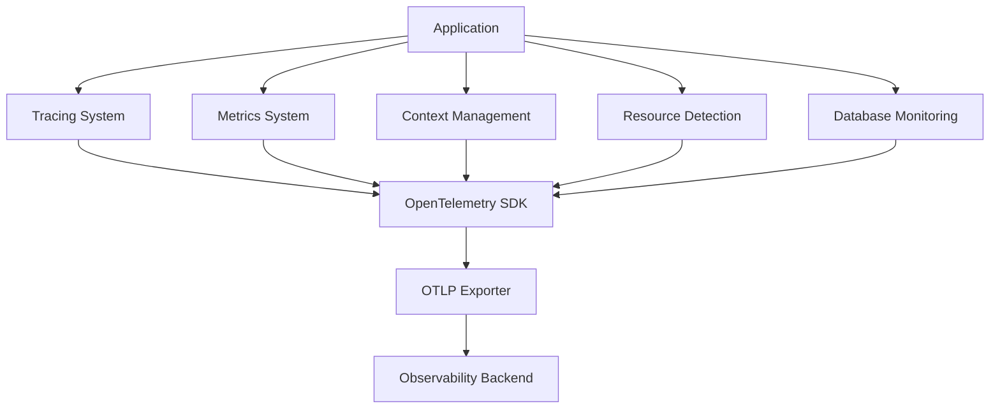
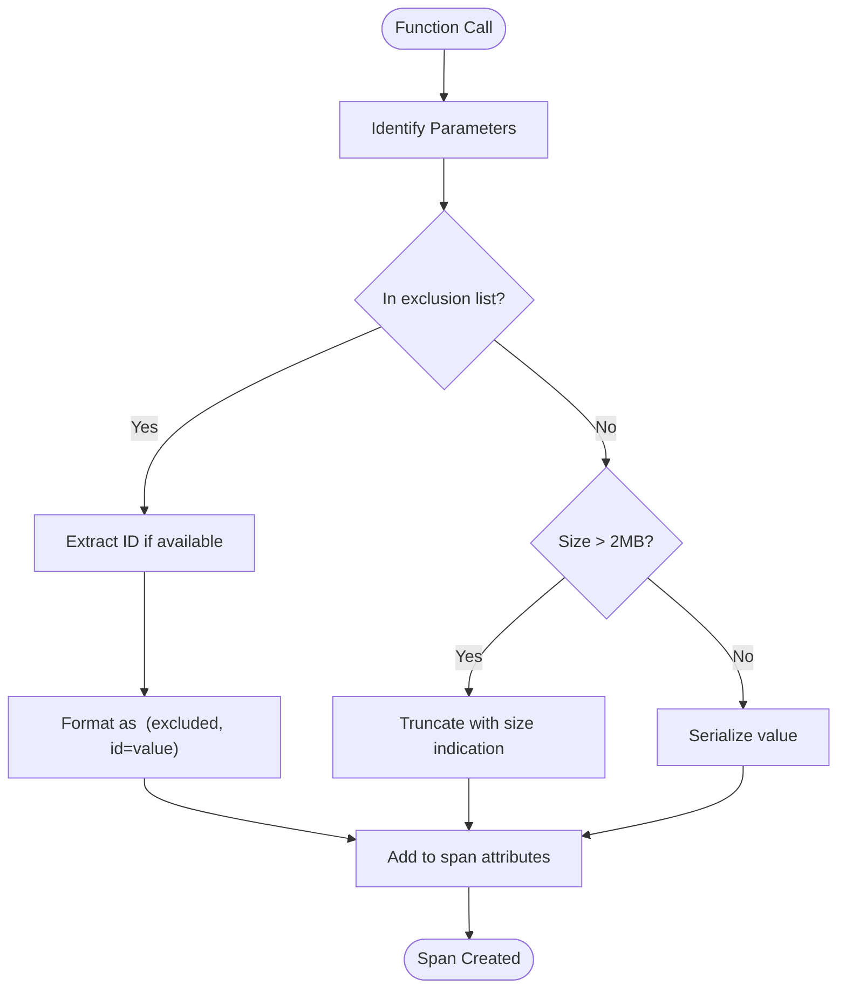
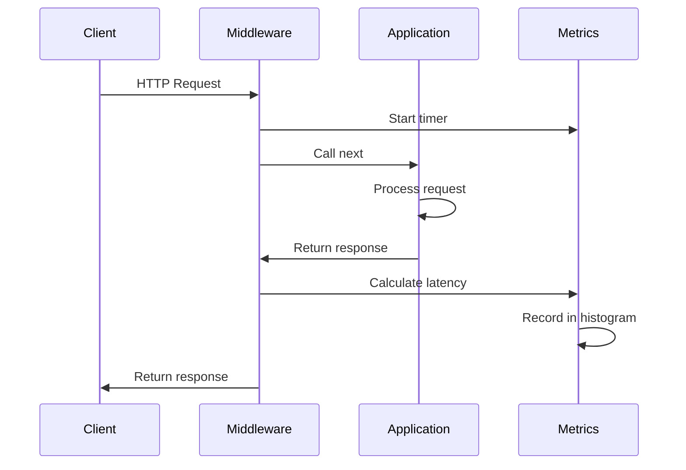

# Application Instrumentation

<cite>
**Referenced Files in This Document**   
- [tracing.py](file://letta/otel/tracing.py)
- [metrics.py](file://letta/otel/metrics.py)
- [context.py](file://letta/otel/context.py)
- [resource.py](file://letta/otel/resource.py)
- [sqlalchemy_instrumentation.py](file://letta/otel/sqlalchemy_instrumentation.py)
- [sqlalchemy_instrumentation_integration.py](file://letta/otel/sqlalchemy_instrumentation_integration.py)
- [db_pool_monitoring.py](file://letta/otel/db_pool_monitoring.py)
- [metric_registry.py](file://letta/otel/metric_registry.py)
</cite>

## Table of Contents
1. [Introduction](#introduction)
2. [Core Instrumentation Components](#core-instrumentation-components)
3. [Tracing System Implementation](#tracing-system-implementation)
4. [Metrics System Implementation](#metrics-system-implementation)
5. [Context Management System](#context-management-system)
6. [Database Monitoring Integration](#database-monitoring-integration)
7. [Resource Detection and Service Identification](#resource-detection-and-service-identification)
8. [Distributed Trace Maintenance](#distributed-trace-maintenance)
9. [Instrumentation Pitfalls and Performance Considerations](#instrumentation-pitfalls-and-performance-considerations)
10. [Conclusion](#conclusion)

## Introduction

Letta implements a comprehensive application instrumentation system using OpenTelemetry SDK to provide detailed telemetry for monitoring, debugging, and performance optimization. The system captures distributed traces, metrics, and contextual information across the entire application stack, with special focus on agent operations, database interactions, and API endpoints. This documentation details the implementation of Letta's internal telemetry generation, covering span creation, context propagation, custom metric recording, and integration with SQLAlchemy for database query monitoring.

The instrumentation framework is designed to balance observability with performance, implementing sophisticated mechanisms to prevent excessive data collection while maintaining critical debugging information. The system integrates with both synchronous and asynchronous components of the application, ensuring comprehensive coverage across all operational modes.

**Section sources**
- [tracing.py](file://letta/otel/tracing.py#L1-L50)
- [metrics.py](file://letta/otel/metrics.py#L1-L50)

## Core Instrumentation Components

Letta's instrumentation system is composed of several interconnected components that work together to provide comprehensive telemetry. The core components include the tracing system, metrics system, context management, resource detection, and database monitoring integrations. These components are organized within the `letta/otel` directory and are designed to work seamlessly with the FastAPI application framework.

The system follows a modular architecture where each component has a specific responsibility:
- **Tracing**: Captures distributed traces with span creation and context propagation
- **Metrics**: Records custom metrics using counters and histograms
- **Context Management**: Maintains request-scoped attributes across asynchronous operations
- **Resource Detection**: Identifies service information for telemetry correlation
- **Database Monitoring**: Provides detailed insights into database connection pool behavior

These components are initialized during application startup and integrated with the FastAPI application lifecycle through middleware and event handlers.



**Diagram sources**
- [tracing.py](file://letta/otel/tracing.py#L1-L50)
- [metrics.py](file://letta/otel/metrics.py#L1-L50)
- [context.py](file://letta/otel/context.py#L1-L50)

## Tracing System Implementation

### Span Creation and Decorators

Letta's tracing system implements a decorator-based approach for automatic span creation using the `@trace_method` decorator defined in `tracing.py`. This decorator automatically creates OpenTelemetry spans for both synchronous and asynchronous functions, capturing execution context and parameters. The implementation handles both coroutine and regular functions through conditional wrapper selection.

The `trace_method` decorator performs several key functions:
- Creates spans with appropriate names based on class and method names
- Captures function parameters as span attributes with intelligent filtering
- Handles exceptions by recording them in spans and setting appropriate status codes
- Manages both sync and async function wrapping transparently

```python
@trace_method
async def async_function(self, param1, param2):
    # This will automatically create a span
    pass

@trace_method
def sync_function(self, param1, param2):
    # This will also create a span
    pass
```

**Section sources**
- [tracing.py](file://letta/otel/tracing.py#L210-L417)

### Parameter Handling and Size Management

A critical aspect of Letta's tracing implementation is its sophisticated parameter handling system that prevents memory bloat and RESOURCE_EXHAUSTED errors. The system implements a multi-layered approach to manage large parameter values:

1. **Exclusion List**: Certain parameters known to be large (e.g., `agent_state`, `messages`, `content`) are excluded from span attributes by default
2. **Size Limiting**: Parameters are truncated to a maximum size (2MB) with clear indication of truncation
3. **Total Size Limit**: The total size of all span attributes is limited to 4MB to prevent excessive memory usage
4. **Serialization Fallback**: Parameters that cannot be serialized are handled gracefully with error messages

When a parameter is excluded, the system attempts to extract and include identifying information (like IDs) to maintain observability while avoiding data overload.



**Diagram sources**
- [tracing.py](file://letta/otel/tracing.py#L220-L369)

### HTTP Request Tracing

The tracing system integrates with FastAPI through middleware that automatically creates spans for HTTP requests. The `_trace_request_middleware` function creates server spans for incoming requests, capturing HTTP method, URL, status codes, and relevant headers. The system implements endpoint filtering through regex patterns to exclude certain endpoints from tracing (e.g., health checks).

The request tracing flow includes:
1. Initial span creation with method and path
2. Endpoint exclusion check based on configured regex patterns
3. Span attribute population with request details
4. Status code and exception handling
5. Trace ID propagation in error responses

```python
async def _trace_request_middleware(request: Request, call_next):
    with tracer.start_as_current_span(
        f"{request.method} {request.url.path}",
        kind=trace.SpanKind.SERVER,
    ) as span:
        try:
            response = await call_next(request)
            span.set_attribute("http.status_code", response.status_code)
            span.set_status(Status(StatusCode.OK if response.status_code < 400 else StatusCode.ERROR))
            return response
        except Exception as e:
            span.set_status(Status(StatusCode.ERROR))
            span.record_exception(e)
            raise
```

**Section sources**
- [tracing.py](file://letta/otel/tracing.py#L38-L57)

### Error Handling and Exception Recording

The tracing system includes comprehensive error handling through the `_trace_error_handler` function, which captures exceptions and records them in the current span. This handler is registered as an exception handler for FastAPI, ensuring that all unhandled exceptions are properly traced.

Key features of the error handling system:
- Records exceptions with type and message attributes
- Sets span status to ERROR
- Includes trace ID in error responses for correlation
- Handles both HTTP exceptions and generic exceptions

```python
async def _trace_error_handler(_request: Request, exc: Exception) -> JSONResponse:
    span = trace.get_current_span()
    if span:
        span.record_exception(
            exc,
            attributes={
                "exception.message": str(exc),
                "exception.type": type(exc).__name__,
            },
        )
    return JSONResponse(status_code=getattr(exc, "status_code", 500), content={"detail": str(exc), "trace_id": get_trace_id() or ""})
```

**Section sources**
- [tracing.py](file://letta/otel/tracing.py#L109-L124)

## Metrics System Implementation

### Counter Instruments

Letta's metrics system implements counter instruments through the `MetricRegistry` class, which provides a centralized registry for all application metrics. Counters are used to track discrete events such as endpoint requests, tool executions, and user messages.

The system uses opt-in endpoint tracking, monitoring only specific endpoints defined in `_included_v1_endpoints_regex`. This approach balances observability with performance by focusing on high-value endpoints:

```python
_included_v1_endpoints_regex: List[str] = [
    "^POST /v1/agents/(?P<agent_id>[^/]+)/messages$",
    "^POST /v1/agents/(?P<agent_id>[^/]+)/messages/stream$",
    "^POST /v1/agents/(?P<agent_id>[^/]+)/messages/async$",
]
```

Counters are implemented using OpenTelemetry's Counter instrument and are exported via OTLP. The `endpoint_request_counter` tracks the number of requests to monitored endpoints, with attributes for endpoint path, HTTP method, and status code.

```python
@property
def endpoint_request_counter(self) -> Counter:
    return self._get_or_create_metric(
        "count_endpoint_requests",
        partial(
            self._meter.create_counter,
            name="count_endpoint_requests",
            description="Counts the number of endpoint requests",
            unit="1",
        ),
    )
```

**Section sources**
- [metrics.py](file://letta/otel/metrics.py#L24-L28)
- [metric_registry.py](file://letta/otel/metric_registry.py#L162-L171)

### Histogram Usage

The metrics system extensively uses histograms to capture distribution data for latency measurements and other continuous values. Histograms are implemented for various performance metrics including:

- Endpoint end-to-end latency (`endpoint_e2e_ms_histogram`)
- LLM execution time (`llm_execution_time_ms_histogram`)
- Tool execution time (`tool_execution_time_ms_histogram`)
- Step execution time (`step_execution_time_ms_histogram`)
- Database connection duration (`db_pool_connection_duration_ms_histogram`)

The histogram implementation includes automatic attribute population from the context system, ensuring that metrics are properly attributed to organizations, projects, templates, and agents.

```python
@property
def endpoint_e2e_ms_histogram(self) -> Histogram:
    return self._get_or_create_metric(
        "hist_endpoint_e2e_ms",
        partial(
            self._meter.create_histogram,
            name="hist_endpoint_e2e_ms",
            description="Histogram for endpoint e2e time (ms)",
            unit="ms",
        ),
    )
```

The metrics middleware captures endpoint latency by measuring the time between request reception and response completion, recording the result in the histogram with appropriate attributes.



**Diagram sources**
- [metrics.py](file://letta/otel/metrics.py#L57-L75)
- [metric_registry.py](file://letta/otel/metric_registry.py#L149-L158)

### Metrics Initialization and Export

The metrics system is initialized through the `setup_metrics` function, which configures the OpenTelemetry meter provider with an OTLP metric exporter. The system supports configurable temporality settings through application settings, allowing optimization for different observability backends.

Key initialization steps:
1. Create meter provider with resource information
2. Configure OTLP metric exporter with preferred temporality
3. Set up periodic metric reader for exporting
4. Register HTTP middleware for endpoint metrics
5. Initialize global meter instance

The system respects pytest environment detection, disabling metrics collection during testing to avoid interference with test execution.

```python
def setup_metrics(
    endpoint: str,
    app: FastAPI | None = None,
    service_name: str = "memgpt-server",
) -> None:
    if is_pytest_environment():
        return
    assert endpoint

    preferred_temporality = AggregationTemporality(settings.otel_preferred_temporality)
    otlp_metric_exporter = OTLPMetricExporter(
        endpoint=endpoint,
        preferred_temporality={
            Counter: preferred_temporality,
            Histogram: preferred_temporality,
        },
    )
    metric_reader = PeriodicExportingMetricReader(exporter=otlp_metric_exporter)

    meter_provider = MeterProvider(resource=get_resource(service_name), metric_readers=[metric_reader])
    metrics.set_meter_provider(meter_provider)
    _meter = metrics.get_meter(__name__)

    if app:
        app.middleware("http")(_otel_metric_middleware)

    _is_metrics_initialized = True
```

**Section sources**
- [metrics.py](file://letta/otel/metrics.py#L104-L132)

## Context Management System

### Context Variables Implementation

Letta's context management system is implemented using Python's `contextvars` module to maintain request-scoped attributes across asynchronous operations. The system uses a single `ContextVar` named `request_attributes` to store a dictionary of key-value pairs that persist throughout the request lifecycle.

The implementation in `context.py` provides three primary functions:
- `set_ctx_attributes`: Replace all current context attributes
- `add_ctx_attribute`: Add a single attribute to the current context
- `get_ctx_attributes`: Retrieve all attributes from the current context

```python
from contextvars import ContextVar
from typing import Any, Dict

request_attributes: ContextVar[Dict[str, Any]] = ContextVar("request_attributes", default={})

def set_ctx_attributes(attrs: Dict[str, Any]):
    current = request_attributes.get()
    new_attrs = {**current, **attrs}
    request_attributes.set(new_attrs)

def add_ctx_attribute(key: str, value: Any):
    current = request_attributes.get()
    new_attrs = {**current, key: value}
    request_attributes.set(new_attrs)

def get_ctx_attributes() -> Dict[str, Any]:
    return request_attributes.get()
```

**Section sources**
- [context.py](file://letta/otel/context.py#L1-L26)

### Header-to-Attribute Mapping

The metrics system automatically maps specific HTTP headers to context attributes, enabling correlation of telemetry data with organizational and user context. This mapping occurs in the `_otel_metric_middleware` function, which processes incoming requests and extracts relevant header values.

The header-to-attribute mapping includes:
- `x-organization-id` → `organization.id`
- `x-project-id` → `project.id`
- `x-base-template-id` → `base_template.id`
- `x-template-id` → `template.id`
- `x-agent-id` → `agent.id`

This mapping ensures that all metrics and traces are properly attributed to the appropriate organizational hierarchy, enabling detailed analysis and billing calculations.

```python
header_attributes = {
    "x-organization-id": "organization.id",
    "x-project-id": "project.id",
    "x-base-template-id": "base_template.id",
    "x-template-id": "template.id",
    "x-agent-id": "agent.id",
}
```

**Section sources**
- [metrics.py](file://letta/otel/metrics.py#L30-L37)

### Context Propagation in Metrics

The context system enables rich attribute population in metrics by making request-scoped attributes available throughout the request lifecycle. When recording endpoint metrics, the system includes all context attributes in the metric attributes, providing dimensional data for analysis.

The `_record_endpoint_metrics` function combines static attributes (endpoint path, method, status code) with dynamic context attributes to create comprehensive metric data points:

```python
attrs = {
    "endpoint_path": endpoint_name,
    "method": request.method,
    "status_code": status_code,
    **get_ctx_attributes(),
}
```

This approach allows for powerful filtering and grouping capabilities in observability platforms, enabling teams to analyze performance by organization, project, template, or agent.

**Section sources**
- [metrics.py](file://letta/otel/metrics.py#L89-L94)

## Database Monitoring Integration

### SQLAlchemy Instrumentation

Letta implements comprehensive database monitoring through custom SQLAlchemy instrumentation that complements the standard OpenTelemetry instrumentation. The system provides detailed insights into database operations, including connection pool behavior, query performance, and ORM loading patterns.

The primary instrumentation module `sqlalchemy_instrumentation.py` provides several key capabilities:
- Detection of synchronous operations in async contexts
- Monitoring of lazy and joined loading operations
- Tracking of session flush operations
- Capture of SQL statements with configurable truncation

The instrumentation is designed to detect potentially problematic patterns such as:
- Synchronous database operations in asynchronous contexts
- Excessive lazy loading (N+1 query problems)
- Large session flushes with many modified objects
- Long-running database connections

```python
def setup_sqlalchemy_sync_instrumentation(
    engines: Optional[List[Engine]] = None,
    config_overrides: Optional[Dict[str, Any]] = None,
    lazy_loading_only: bool = True,
) -> None:
    # Instrument loader strategies (focus on lazy loading if specified)
    _instrument_loader_strategies()
    
    # Instrument loading functions
    _instrument_loading_functions()
    
    # Instrument session operations
    _instrument_session_operations()
    
    # Instrument engines
    for engine in engines:
        _instrument_engine_events(engine)
```

**Section sources**
- [sqlalchemy_instrumentation.py](file://letta/otel/sqlalchemy_instrumentation.py#L378-L439)

### Connection Pool Monitoring

The database monitoring system includes detailed connection pool monitoring through the `DatabasePoolMonitor` class. This component uses SQLAlchemy event listeners to track connection pool events and metrics, providing visibility into pool utilization and performance.

Key monitored events include:
- Connection creation and first connection
- Connection checkout and checkin
- Connection invalidation and closure
- Connection detachment and reset

The monitor captures several important metrics:
- Connections checked out, available, and total
- Connection overflow count
- Connection duration (time between checkout and checkin)
- Connection event counts by type

```python
class DatabasePoolMonitor:
    def setup_monitoring(self, engine: Engine | AsyncEngine, engine_name: str = "default") -> None:
        self._setup_pool_listeners(engine.pool, engine_name)
        
    def _setup_pool_listeners(self, pool: Pool, engine_name: str) -> None:
        @event.listens_for(pool, "checkout")
        def on_checkout(dbapi_connection, connection_record, connection_proxy):
            # Record checkout event and pool statistics
            pass
            
        @event.listens_for(pool, "checkin")
        def on_checkin(dbapi_connection, connection_record):
            # Record checkin event and connection duration
            pass
```

**Section sources**
- [db_pool_monitoring.py](file://letta/otel/db_pool_monitoring.py#L16-L272)

### Custom Instrumentation Integration

The system provides integration between the custom SQLAlchemy instrumentation and the main OpenTelemetry setup through the `sqlalchemy_instrumentation_integration.py` module. This integration layer simplifies setup by automatically discovering database engines from the application's `db_registry` and applying appropriate configuration.

Key integration features:
- Automatic engine discovery from `db_registry`
- Configuration of monitoring parameters (joined loading, SQL truncation)
- FastAPI lifecycle integration for startup and shutdown
- Centralized setup and teardown functions

```python
def setup_letta_db_instrumentation(
    enable_joined_monitoring: bool = True,
    sql_truncate_length: int = 1000,
    additional_config: Optional[Dict[str, Any]] = None,
) -> None:
    # Get engines from db_registry
    engines = []
    if hasattr(db_registry, "_async_engines"):
        engines.extend(db_registry._async_engines.values())
    if hasattr(db_registry, "_sync_engines"):
        engines.extend(db_registry._sync_engines.values())
        
    # Setup instrumentation with discovered engines
    setup_sqlalchemy_sync_instrumentation(
        engines=engines,
        config_overrides=config,
    )
```

The integration also provides FastAPI event handlers to automatically initialize and clean up instrumentation during application startup and shutdown.

**Section sources**
- [sqlalchemy_instrumentation_integration.py](file://letta/otel/sqlalchemy_instrumentation_integration.py#L24-L70)

## Resource Detection and Service Identification

### Resource Configuration

Letta's instrumentation system uses OpenTelemetry's resource detection to identify and tag telemetry data with service-specific information. The `get_resource` function in `resource.py` creates a resource object that includes key service identifiers:

- `service.name`: Configurable service name (default: "memgpt-server")
- `letta.version`: Application version from package metadata
- `host.name`: Hostname of the machine running the service
- `device.id`: MAC address as unique device identifier (excluded in production)

The resource configuration varies by environment, with additional device identification in non-production environments to support development and testing scenarios.

```python
def get_resource(service_name: str) -> Resource:
    _env = settings.environment
    if (service_name, _env) not in _resources:
        resource_dict = {
            "service.name": service_name,
            "letta.version": letta_version,
            "host.name": socket.gethostname(),
        }
        if _env != "PRODUCTION":
            resource_dict["device.id"] = uuid.getnode()
        _resources[(service_name, _env)] = Resource.create(resource_dict)
    return _resources[(service_name, _env)]
```

**Section sources**
- [resource.py](file://letta/otel/resource.py#L13-L24)

### Service Initialization

The resource information is integrated into both tracing and metrics systems during initialization. The `setup_tracing` and `setup_metrics` functions use the resource configuration to ensure that all telemetry data is properly attributed to the correct service instance.

For tracing:
```python
tracer_provider = TracerProvider(resource=get_resource(service_name))
```

For metrics:
```python
meter_provider = MeterProvider(resource=get_resource(service_name), metric_readers=[metric_reader])
```

This consistent resource configuration ensures that telemetry data from both systems can be correlated and analyzed together in observability platforms.

**Section sources**
- [tracing.py](file://letta/otel/tracing.py#L138-L141)
- [metrics.py](file://letta/otel/metrics.py#L125-L126)

## Distributed Trace Maintenance

### Context Propagation

Letta maintains distributed traces across agent operations through careful context propagation. The system uses OpenTelemetry's context propagation mechanisms to ensure that trace context is preserved across asynchronous operations, database calls, and external service interactions.

Key context propagation points:
- HTTP request middleware establishes initial trace context
- Async operations preserve context through asyncio tasks
- Database operations inherit context from parent spans
- External service calls propagate context via W3C Trace Context headers

The system ensures that all spans created within a request context are properly linked to the parent trace, maintaining trace continuity even as operations cross service boundaries.

**Section sources**
- [tracing.py](file://letta/otel/tracing.py#L45-L48)

### Trace ID Retrieval

The system provides a utility function `get_trace_id()` to retrieve the current trace ID in hexadecimal format. This function is used in error responses to provide users with trace identifiers for debugging and support purposes.

```python
def get_trace_id() -> Optional[str]:
    span = trace.get_current_span()
    if span and span.get_span_context().trace_id:
        return format(span.get_span_context().trace_id, "032x")
    return None
```

This trace ID is included in error responses, allowing users and support teams to correlate client-reported issues with server-side telemetry.

**Section sources**
- [tracing.py](file://letta/otel/tracing.py#L441-L445)

### Span Relationship Management

The tracing system manages span relationships through proper parent-child linking and semantic conventions. Server spans are created for HTTP requests with `SpanKind.SERVER`, while client spans are used for outbound requests with `SpanKind.CLIENT`.

The system maintains proper span hierarchy by:
- Creating nested spans for method calls within request processing
- Linking database operation spans to their parent application spans
- Preserving span relationships across async/await boundaries
- Using meaningful span names that reflect the operation being performed

This hierarchical structure enables detailed analysis of request processing flows and performance bottlenecks.

**Section sources**
- [tracing.py](file://letta/otel/tracing.py#L47-L48)

## Instrumentation Pitfalls and Performance Considerations

### Memory and Performance Optimization

Letta's instrumentation system implements several strategies to minimize performance overhead and prevent memory issues:

1. **Parameter Size Management**: Large parameters are excluded or truncated to prevent excessive memory usage in spans
2. **Selective Tracing**: Certain endpoints are excluded from tracing (e.g., health checks) to reduce noise
3. **Opt-in Metrics**: Endpoint metrics are only collected for specific high-value endpoints
4. **Context Isolation**: Context variables are properly managed to prevent leakage between requests
5. **Error Handling**: Instrumentation errors are caught and logged without disrupting application functionality

The system's parameter handling is particularly sophisticated, implementing a multi-layered approach to manage large data structures while preserving critical identifying information.

**Section sources**
- [tracing.py](file://letta/otel/tracing.py#L234-L311)

### Testing and Validation

The instrumentation system includes comprehensive testing to ensure reliability and correctness. The `test_otel_tracing.py` file contains unit tests that validate the parameter handling behavior, ensuring that large parameters are properly excluded or truncated.

Key test scenarios include:
- Verification that large messages parameter is excluded from span attributes
- Confirmation that large content parameters are excluded
- Validation that large source code parameters are excluded
- Testing of serialization failure handling
- Verification of total span size constraints

These tests ensure that the instrumentation system behaves as expected under various conditions and prevents common pitfalls like memory bloat.

**Section sources**
- [test_otel_tracing.py](file://tests/test_otel_tracing.py#L1-L302)

### Configuration and Environment Handling

The system includes several safeguards for different environments:
- **Pytest Detection**: Instrumentation is disabled in pytest environments to prevent interference with tests
- **Production Safeguards**: Device identification is excluded in production environments
- **Configuration Validation**: Required parameters are asserted during setup
- **Graceful Degradation**: Instrumentation failures are logged but do not prevent application startup

These safeguards ensure that the instrumentation system is reliable and does not introduce instability in production environments.

**Section sources**
- [resource.py](file://letta/otel/resource.py#L27-L29)
- [tracing.py](file://letta/otel/tracing.py#L132-L133)
- [metrics.py](file://letta/otel/metrics.py#L109-L110)

## Conclusion

Letta's application instrumentation system provides comprehensive telemetry through a well-designed integration of OpenTelemetry SDK components. The system effectively balances observability with performance, implementing sophisticated mechanisms to prevent excessive data collection while maintaining critical debugging information.

Key strengths of the implementation include:
- **Comprehensive Coverage**: Tracing and metrics for HTTP requests, database operations, and business logic
- **Performance Awareness**: Intelligent parameter handling and selective instrumentation to minimize overhead
- **Context Preservation**: Robust context management that maintains trace continuity across asynchronous operations
- **Database Insights**: Detailed monitoring of connection pool behavior and ORM operations
- **Production Ready**: Environment-specific configurations and error handling that ensure reliability

The system's modular design allows for easy extension and customization, while its integration with FastAPI ensures seamless operation within the application lifecycle. By following OpenTelemetry standards, the system provides compatibility with a wide range of observability backends and tools.

For optimal use, teams should:
- Configure the OTLP endpoint to point to their observability backend
- Monitor the system's performance impact and adjust sampling rates as needed
- Use the provided trace IDs in error responses for efficient debugging
- Analyze the database connection pool metrics to optimize database configuration
- Leverage the dimensional metrics for detailed performance analysis by organization, project, and agent

This instrumentation system provides a solid foundation for monitoring, debugging, and optimizing Letta deployments in production environments.