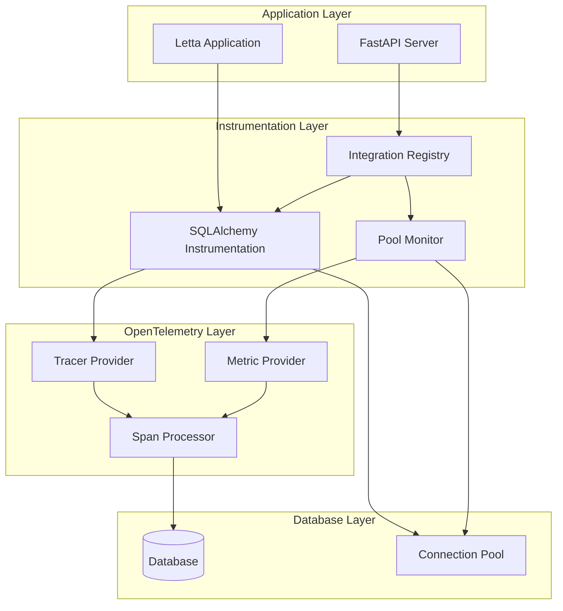
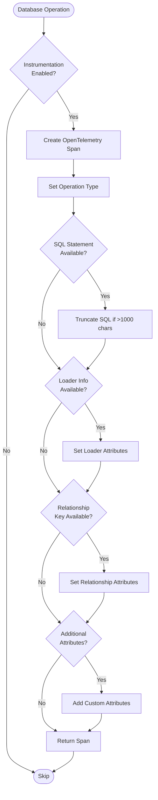
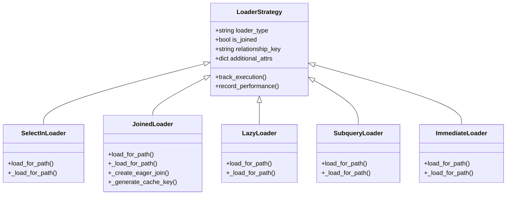
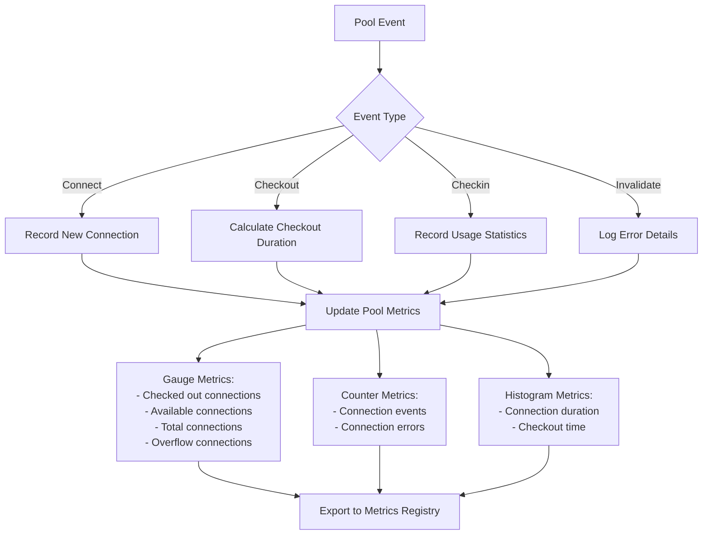
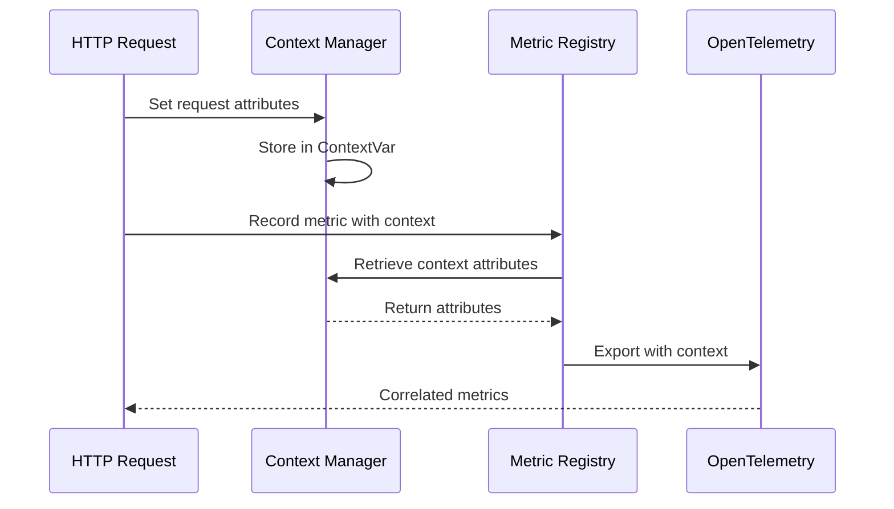
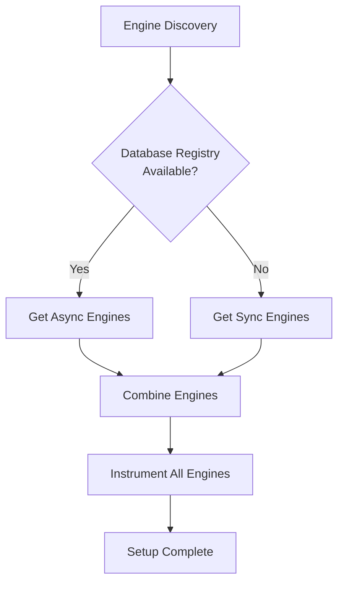

# Database Instrumentation

<cite>
**Referenced Files in This Document**
- [sqlalchemy_instrumentation.py](file://letta/otel/sqlalchemy_instrumentation.py)
- [sqlalchemy_instrumentation_integration.py](file://letta/otel/sqlalchemy_instrumentation_integration.py)
- [db_pool_monitoring.py](file://letta/otel/db_pool_monitoring.py)
- [metric_registry.py](file://letta/otel/metric_registry.py)
- [context.py](file://letta/otel/context.py)
- [db.py](file://letta/server/db.py)
- [test_otel_tracing.py](file://tests/test_otel_tracing.py)
</cite>

## Table of Contents
1. [Introduction](#introduction)
2. [System Architecture](#system-architecture)
3. [SQLAlchemy Event Instrumentation](#sqlalchemy-event-instrumentation)
4. [Connection Pool Monitoring](#connection-pool-monitoring)
5. [Metric Registry and Context Management](#metric-registry-and-context-management)
6. [Configuration and Setup](#configuration-and-setup)
7. [Performance Considerations](#performance-considerations)
8. [Troubleshooting Guide](#troubleshooting-guide)
9. [Best Practices](#best-practices)
10. [Conclusion](#conclusion)

## Introduction

Letta's database instrumentation system provides comprehensive monitoring and tracing capabilities for SQLAlchemy database operations. The system leverages OpenTelemetry to create detailed spans for database queries, track connection pool metrics, and monitor performance characteristics. This instrumentation helps developers identify slow queries, optimize database usage, and maintain optimal connection pool utilization.

The instrumentation system consists of three primary components:
- **SQLAlchemy Synchronous Operation Instrumentation**: Tracks database query execution, session operations, and loader strategies
- **Database Connection Pool Monitoring**: Monitors connection lifecycle events and pool utilization metrics
- **Metric Registry**: Centralized collection and reporting of database performance metrics

## System Architecture

The database instrumentation system follows a modular architecture that integrates seamlessly with Letta's existing OpenTelemetry infrastructure.



**Diagram sources**
- [sqlalchemy_instrumentation.py](file://letta/otel/sqlalchemy_instrumentation.py#L1-L50)
- [db_pool_monitoring.py](file://letta/otel/db_pool_monitoring.py#L1-L50)
- [sqlalchemy_instrumentation_integration.py](file://letta/otel/sqlalchemy_instrumentation_integration.py#L1-L50)

## SQLAlchemy Event Instrumentation

The SQLAlchemy instrumentation system creates spans for various database operations using SQLAlchemy's event system. It instruments three main categories of operations: engine events, session operations, and loader strategies.

### Span Creation and Attributes

The core span creation mechanism uses the `_create_sync_db_span` function, which generates OpenTelemetry spans with comprehensive attributes:



**Diagram sources**
- [sqlalchemy_instrumentation.py](file://letta/otel/sqlalchemy_instrumentation.py#L58-L111)

### Engine Event Instrumentation

The system instruments SQLAlchemy engine events to track cursor execution:

| Event Type | Purpose | Attributes |
|------------|---------|------------|
| `before_cursor_execute` | Track query start | SQL statement, executemany flag, connection info |
| `after_cursor_execute` | Track query completion | Execution status, timing information |
| `handle_error` | Track query errors | Error details, stack trace |

### Session Operation Instrumentation

Session operations are instrumented to track transaction lifecycle:

| Operation | Purpose | Key Metrics |
|-----------|---------|-------------|
| `before_flush` | Track session flush start | New/dirty/deleted object counts |
| `after_flush` | Track flush completion | Success/failure status |
| `after_flush_postexec` | Track post-execution | Final state verification |

### Loader Strategy Instrumentation

The system monitors different SQLAlchemy loader strategies to identify potential N+1 query problems:



**Diagram sources**
- [sqlalchemy_instrumentation.py](file://letta/otel/sqlalchemy_instrumentation.py#L180-L268)

**Section sources**
- [sqlalchemy_instrumentation.py](file://letta/otel/sqlalchemy_instrumentation.py#L58-L319)

## Connection Pool Monitoring

The database pool monitoring system tracks connection lifecycle events and provides real-time metrics about pool utilization.

### Pool Event Tracking

The `DatabasePoolMonitor` class instruments various connection pool events:

| Event | Description | Metrics Recorded |
|-------|-------------|------------------|
| `connect` | New connection created | Connection count, pool statistics |
| `checkout` | Connection borrowed from pool | Checkout duration, pool availability |
| `checkin` | Connection returned to pool | Usage duration, pool statistics |
| `invalidate` | Connection invalidated | Error types, invalidation reasons |
| `soft_invalidate` | Soft connection invalidation | Warning conditions |
| `close` | Connection closed | Lifecycle completion |
| `detach` | Connection detached from pool | Detachment events |
| `reset` | Connection reset | Reset operations |

### Pool Statistics Collection

The system collects comprehensive pool statistics:



**Diagram sources**
- [db_pool_monitoring.py](file://letta/otel/db_pool_monitoring.py#L89-L271)

### Connection Lifecycle Monitoring

The system maintains detailed connection lifecycle information:

| Attribute | Purpose | Data Type |
|-----------|---------|-----------|
| `created_at` | Connection creation time | Timestamp |
| `checked_out_at_ns` | Checkout timestamp (nanoseconds) | Integer |
| `checked_in_at` | Checkin timestamp | Timestamp |
| `checkout_count` | Number of checkouts | Integer |
| `detached` | Detachment status | Boolean |

**Section sources**
- [db_pool_monitoring.py](file://letta/otel/db_pool_monitoring.py#L16-L310)

## Metric Registry and Context Management

The metric registry provides centralized collection and reporting of database performance metrics, while the context management system enables correlation of metrics across distributed operations.

### Database Metrics

The metric registry defines comprehensive database-related metrics:

| Metric Category | Metric Name | Type | Purpose |
|----------------|-------------|------|---------|
| Pool Metrics | `gauge_db_pool_connections_total` | Gauge | Total pool capacity |
| Pool Metrics | `gauge_db_pool_connections_checked_out` | Gauge | Active connections |
| Pool Metrics | `gauge_db_pool_connections_available` | Gauge | Available connections |
| Pool Metrics | `gauge_db_pool_connections_overflow` | Gauge | Overflow connections |
| Performance Metrics | `hist_db_pool_connection_duration_ms` | Histogram | Connection usage time |
| Event Metrics | `count_db_pool_connection_events` | Counter | Pool event occurrences |
| Error Metrics | `count_db_pool_connection_errors` | Counter | Pool error occurrences |

### Context Management

The context system enables cross-service correlation:



**Diagram sources**
- [context.py](file://letta/otel/context.py#L1-26)

**Section sources**
- [metric_registry.py](file://letta/otel/metric_registry.py#L185-L276)
- [context.py](file://letta/otel/context.py#L1-26)

## Configuration and Setup

The instrumentation system provides flexible configuration options and multiple setup approaches.

### Configuration Options

The SQLAlchemy instrumentation supports several configuration parameters:

| Parameter | Type | Default | Description |
|-----------|------|---------|-------------|
| `enabled` | Boolean | `True` | Enable/disable instrumentation |
| `sql_truncate_length` | Integer | `1000` | Maximum SQL statement length |
| `monitor_joined_loading` | Boolean | `True` | Monitor joined loading operations |
| `log_instrumentation_errors` | Boolean | `True` | Log instrumentation errors |

### Setup Methods

#### Automatic Setup

The integration module provides automatic setup:

```python
from letta.otel.sqlalchemy_instrumentation_integration import setup_letta_db_instrumentation

setup_letta_db_instrumentation(
    enable_joined_monitoring=True,
    sql_truncate_length=1000
)
```

#### Manual Setup

For custom configurations:

```python
from letta.otel.sqlalchemy_instrumentation import setup_sqlalchemy_sync_instrumentation

# Custom configuration
config = {
    "enabled": True,
    "monitor_joined_loading": False,
    "sql_truncate_length": 500
}

setup_sqlalchemy_sync_instrumentation(
    engines=my_engines,
    config_overrides=config,
    lazy_loading_only=True
)
```

#### FastAPI Integration

Built-in FastAPI integration:

```python
from letta.otel.sqlalchemy_instrumentation_integration import setup_fastapi_db_instrumentation

setup_fastapi_db_instrumentation(app, enable_joined_monitoring=False)
```

### Database Registry Integration

The system automatically discovers engines from Letta's database registry:



**Diagram sources**
- [sqlalchemy_instrumentation.py](file://letta/otel/sqlalchemy_instrumentation.py#L412-L419)

**Section sources**
- [sqlalchemy_instrumentation.py](file://letta/otel/sqlalchemy_instrumentation.py#L378-L449)
- [sqlalchemy_instrumentation_integration.py](file://letta/otel/sqlalchemy_instrumentation_integration.py#L24-L125)

## Performance Considerations

Database instrumentation introduces overhead that must be carefully managed to avoid impacting application performance.

### Overhead Analysis

#### Span Creation Overhead
- **Base Cost**: ~1-2μs per span creation
- **Attribute Processing**: ~0.5-1μs per attribute
- **SQL Truncation**: ~10-50μs for large statements (>1KB)

#### Memory Impact
- **Span Storage**: ~1KB per span
- **Context Variables**: ~100B per request
- **Pool Monitoring**: ~50B per connection

### Sampling Strategies

To mitigate performance impact, implement these sampling strategies:

#### Lazy Loading Focus
```python
# Monitor only lazy loading operations
setup_sqlalchemy_sync_instrumentation(
    lazy_loading_only=True
)
```

#### Conditional Instrumentation
```python
# Enable only in development
if DEBUG_MODE:
    setup_sqlalchemy_sync_instrumentation()
```

#### Periodic Sampling
```python
# Sample 10% of operations
import random
if random.random() < 0.1:
    setup_sqlalchemy_sync_instrumentation()
```

### Performance Optimization Tips

1. **SQL Truncation**: Set appropriate `sql_truncate_length` to balance visibility vs. performance
2. **Loader Monitoring**: Disable joined loading monitoring in production
3. **Context Cleanup**: Ensure proper context cleanup in long-running operations
4. **Metric Aggregation**: Use metric aggregation to reduce export frequency

## Troubleshooting Guide

Common issues and their solutions when working with database instrumentation.

### Common Issues

#### Excessive Span Creation
**Problem**: Too many spans generated from frequent small queries
**Solution**: Use sampling or focus on specific operations

```python
# Reduce span creation frequency
from letta.otel.sqlalchemy_instrumentation import configure_instrumentation

configure_instrumentation(
    monitor_joined_loading=False,  # Disable joined loading
    sql_truncate_length=500        # Shorter SQL truncation
)
```

#### Memory Leaks
**Problem**: Spans not properly ended causing memory leaks
**Solution**: Ensure proper span lifecycle management

```python
# Use context managers for temporary instrumentation
from letta.otel.sqlalchemy_instrumentation import temporary_instrumentation

with temporary_instrumentation(enabled=True):
    # Perform operations under instrumentation
    pass  # Spans automatically cleaned up
```

#### Connection Pool Conflicts
**Problem**: Instrumentation interfering with connection pool
**Solution**: Configure appropriate pooling settings

```python
# Disable pooling for testing
import os
os.environ["LETTA_DISABLE_SQLALCHEMY_POOLING"] = "true"
```

### Debugging Tools

#### Check Instrumentation Status
```python
from letta.otel.sqlalchemy_instrumentation import is_instrumentation_active

if is_instrumentation_active():
    print("Instrumentation is active")
```

#### View Current Configuration
```python
from letta.otel.sqlalchemy_instrumentation import get_instrumentation_config

config = get_instrumentation_config()
print(f"Instrumentation config: {config}")
```

#### Monitor Pool Metrics
```python
from letta.otel.db_pool_monitoring import get_pool_monitor

monitor = get_pool_monitor()
# Access pool statistics programmatically
```

**Section sources**
- [sqlalchemy_instrumentation.py](file://letta/otel/sqlalchemy_instrumentation.py#L497-L529)

## Best Practices

### Development Best Practices

1. **Environment-Specific Configuration**
   - Enable full instrumentation in development
   - Use sampling in staging environments
   - Disable in production for performance-critical applications

2. **Selective Monitoring**
   - Focus on lazy loading operations initially
   - Gradually enable joined loading monitoring
   - Monitor specific problematic queries

3. **Resource Management**
   - Use context managers for temporary instrumentation
   - Implement proper error handling
   - Monitor memory usage during peak loads

### Production Considerations

1. **Performance Impact Minimization**
   - Use sampling strategies
   - Limit SQL statement truncation
   - Disable verbose logging

2. **Monitoring Integration**
   - Integrate with existing monitoring systems
   - Set up alerting for slow queries
   - Monitor pool utilization trends

3. **Maintenance Procedures**
   - Regular cleanup of old spans
   - Review instrumentation overhead periodically
   - Update configurations based on usage patterns

### Security Considerations

1. **Sensitive Data Protection**
   - Avoid logging sensitive SQL statements
   - Use SQL truncation appropriately
   - Implement data masking for credentials

2. **Access Control**
   - Restrict instrumentation access
   - Use secure communication channels
   - Audit instrumentation usage

## Conclusion

Letta's database instrumentation system provides comprehensive monitoring capabilities for SQLAlchemy operations through a well-designed, modular architecture. The system successfully balances observability needs with performance considerations through intelligent configuration options, sampling strategies, and efficient resource management.

Key strengths of the system include:

- **Comprehensive Coverage**: Instruments all major SQLAlchemy operations
- **Flexible Configuration**: Supports various deployment scenarios
- **Performance Awareness**: Built-in optimizations for production use
- **Integration Friendly**: Seamless integration with existing OpenTelemetry infrastructure

The instrumentation system enables developers to identify performance bottlenecks, optimize database usage patterns, and maintain healthy connection pool utilization. By following the documented best practices and configuration guidelines, teams can effectively leverage this instrumentation to improve application performance and reliability.

Future enhancements could include distributed tracing support, advanced sampling algorithms, and integration with popular monitoring platforms to further enhance the observability capabilities of Letta applications.