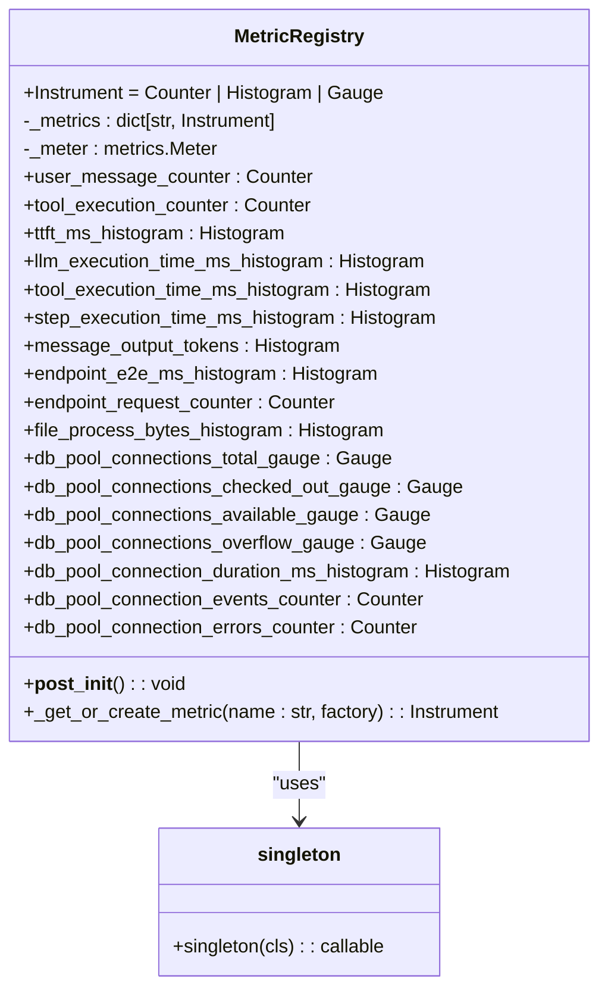
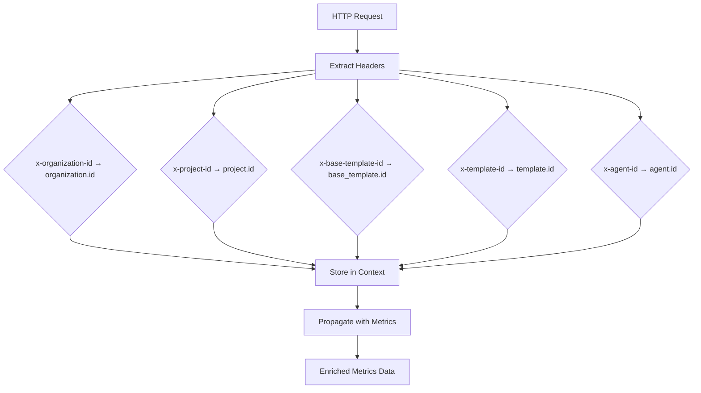
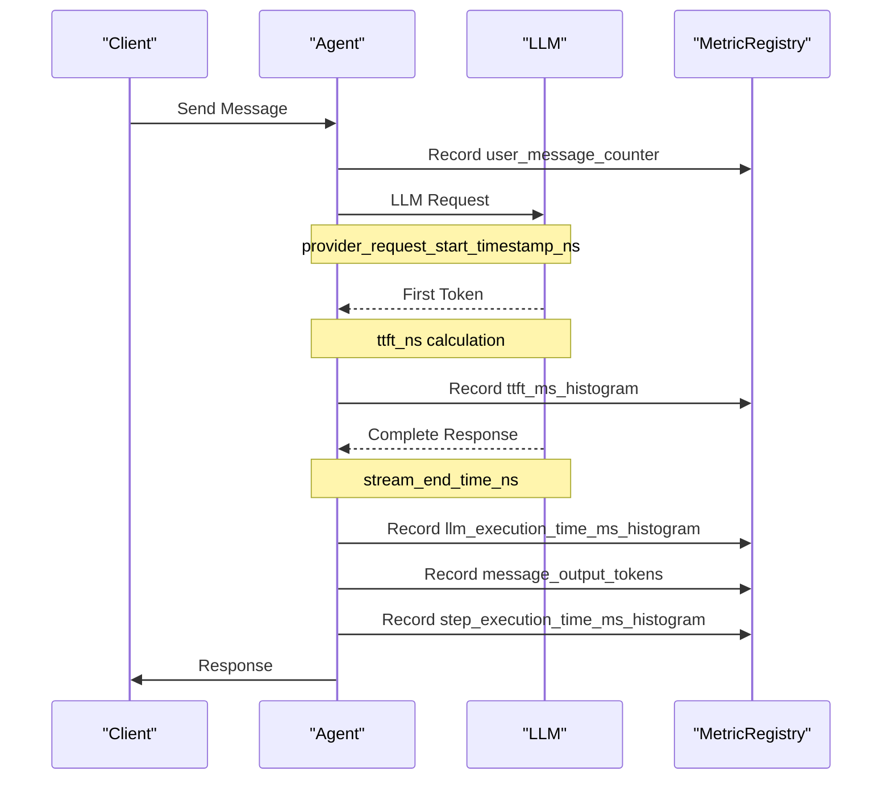
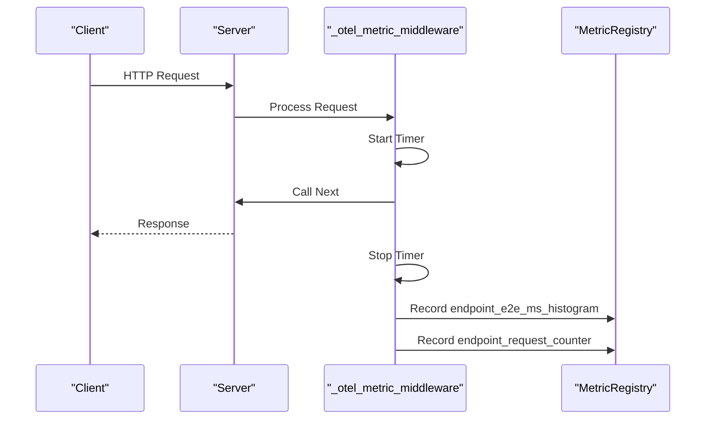
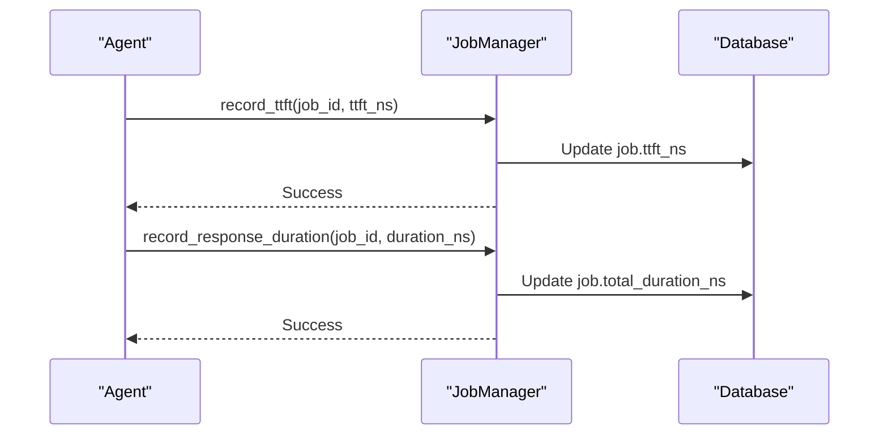
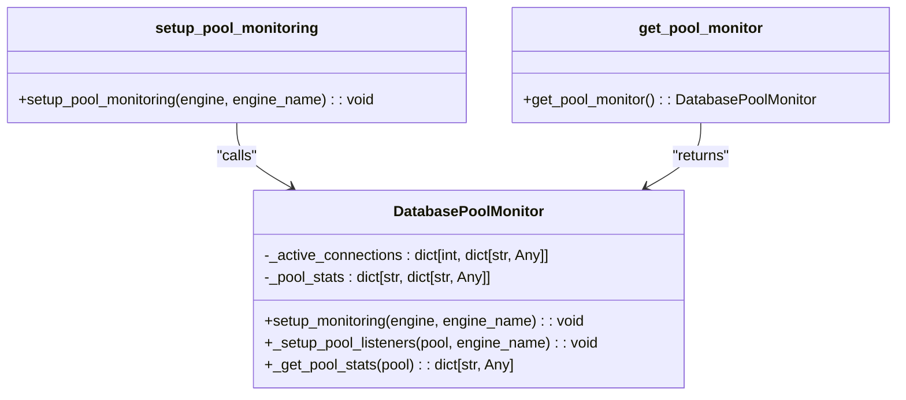

# Metrics Collection

<cite>
**Referenced Files in This Document**   
- [metric_registry.py](file://letta/otel/metric_registry.py)
- [metrics.py](file://letta/otel/metrics.py)
- [context.py](file://letta/otel/context.py)
- [resource.py](file://letta/otel/resource.py)
- [db_pool_monitoring.py](file://letta/otel/db_pool_monitoring.py)
- [letta_agent.py](file://letta/agents/letta_agent.py)
- [job_manager.py](file://letta/services/job_manager.py)
- [singleton.py](file://letta/helpers/singleton.py)
</cite>

## Table of Contents
1. [Introduction](#introduction)
2. [Metric Types and Instrumentation](#metric-types-and-instrumentation)
3. [Metric Registry and Singleton Pattern](#metric-registry-and-singleton-pattern)
4. [Context Propagation and Labeling](#context-propagation-and-labeling)
5. [Key Metrics Implementation](#key-metrics-implementation)
6. [Database Connection Pool Monitoring](#database-connection-pool-monitoring)
7. [Performance Optimization](#performance-optimization)
8. [Common Issues and Solutions](#common-issues-and-solutions)
9. [Best Practices](#best-practices)

## Introduction
Letta implements a comprehensive metrics collection system using OpenTelemetry to monitor agent activity, token usage, and request latency. The system provides detailed insights into the performance and behavior of the agent platform through counters, histograms, and gauges. This documentation explains the implementation of custom metrics instrumentation, focusing on the core components that enable monitoring of LLM invocations, agent loop durations, and job processing times. The metrics system is designed to be efficient, prevent memory leaks, and provide valuable operational insights for both development and production environments.

## Metric Types and Instrumentation
Letta utilizes three primary types of metrics instruments: counters, histograms, and gauges, each serving specific monitoring purposes:

- **Counters**: Monotonic instruments that only increase, used for tracking discrete events such as the number of user messages or tool executions
- **Histograms**: Track the distribution of values, ideal for measuring durations (e.g., LLM execution time) and sizes (e.g., output tokens)
- **Gauges**: Capture instantaneous values, used for monitoring database connection pool states

The metrics system captures various performance indicators including agent activity, token usage, and request latency. Counters track discrete events like user messages and tool executions, while histograms measure the distribution of values such as LLM execution time and step durations. Gauges provide real-time snapshots of system state, particularly for database connection pools.

**Section sources**
- [metric_registry.py](file://letta/otel/metric_registry.py#L46-L68)
- [metric_registry.py](file://letta/otel/metric_registry.py#L72-L119)
- [metric_registry.py](file://letta/otel/metric_registry.py#L188-L236)

## Metric Registry and Singleton Pattern
The `MetricRegistry` class serves as a centralized registry for all application metrics, ensuring singleton instruments and preventing memory leaks. Implemented as a singleton using the `@singleton` decorator from `letta.helpers.singleton`, this class guarantees that only one instance exists throughout the application lifecycle.

**Diagram sources**
- [metric_registry.py](file://letta/otel/metric_registry.py#L12-L14)
- [singleton.py](file://letta/helpers/singleton.py#L5-L15)

The registry employs lazy initialization through the `_get_or_create_metric` method, which ensures metrics are only created when first accessed. This approach prevents unnecessary memory allocation for unused metrics. Each metric property uses `functools.partial` to create a factory function that configures the metric with its name, description, and unit when instantiated.

**Section sources**
- [metric_registry.py](file://letta/otel/metric_registry.py#L38-L42)
- [metric_registry.py](file://letta/otel/metric_registry.py#L46-L275)
- [singleton.py](file://letta/helpers/singleton.py#L5-L15)

## Context Propagation and Labeling
Letta's metrics system incorporates context propagation to enrich metrics with relevant metadata. The system extracts attributes from HTTP headers and propagates them through the request lifecycle, enabling dimensional analysis of metrics.

The context system uses Python's `contextvars` module to maintain request-scoped attributes across asynchronous operations. Key headers are mapped to OpenTelemetry attributes:

**Diagram sources**
- [metrics.py](file://letta/otel/metrics.py#L30-L37)
- [context.py](file://letta/otel/context.py#L5-L25)

The `_otel_metric_middleware` function intercepts HTTP requests, extracts header values, and adds them to the current context using `add_ctx_attribute`. These attributes are then included as labels when recording metrics, allowing for filtering and grouping by organizational hierarchy (project, template, agent).

**Section sources**
- [metrics.py](file://letta/otel/metrics.py#L40-L48)
- [context.py](file://letta/otel/context.py#L16-L25)

## Key Metrics Implementation
Letta implements several key metrics to monitor agent performance and system behavior. The implementation follows a consistent pattern across different metric types, with specific focus on LLM invocation metrics, agent loop durations, and job processing times.

### LLM and Agent Metrics
The system tracks various aspects of LLM interactions and agent execution:

**Diagram sources**
- [letta_agent.py](file://letta/agents/letta_agent.py#L1089-L1092)
- [letta_agent.py](file://letta/agents/letta_agent.py#L1054-L1057)
- [letta_agent.py](file://letta/agents/letta_agent.py#L1079-L1080)
- [letta_agent.py](file://letta/agents/letta_agent.py#L428-L428)

LLM execution time is measured from request initiation to response completion, while Time to First Token (TTFT) captures the latency before the first token is received. Output token counts are recorded per step, providing insights into LLM response sizes. Step execution time measures the total duration of each agent step, from initiation to completion.

**Section sources**
- [letta_agent.py](file://letta/agents/letta_agent.py#L1089-L1092)
- [letta_agent.py](file://letta/agents/letta_agent.py#L1054-L1057)
- [letta_agent.py](file://letta/agents/letta_agent.py#L1079-L1080)
- [letta_agent.py](file://letta/agents/letta_agent.py#L428-L428)

### Endpoint Metrics
API endpoint performance is monitored through dedicated metrics that track request volume and end-to-end latency:

**Diagram sources**
- [metrics.py](file://letta/otel/metrics.py#L57-L75)
- [metrics.py](file://letta/otel/metrics.py#L97-L98)

The `_otel_metric_middleware` function implements endpoint metrics collection, but only for specific endpoints defined in `_included_v1_endpoints_regex`. This opt-in approach ensures that only high-value endpoints are monitored, reducing overhead. The middleware records both request count and end-to-end latency, with attributes including the endpoint path, HTTP method, and status code.

**Section sources**
- [metrics.py](file://letta/otel/metrics.py#L24-L28)
- [metrics.py](file://letta/otel/metrics.py#L57-L75)

### Job Processing Metrics
Job processing times are tracked at both the database and application levels. The system records Time to First Token (TTFT) and total response duration for jobs, storing these values in the database for later analysis.

**Diagram sources**
- [job_manager.py](file://letta/services/job_manager.py#L457-L468)
- [job_manager.py](file://letta/services/job_manager.py#L470-L480)

The `record_ttft` and `record_response_duration` methods in `JobManager` update the corresponding fields in the jobs table. These methods include error handling to ensure that failed metric recording doesn't disrupt the main application flow, instead logging warnings when updates fail.

**Section sources**
- [job_manager.py](file://letta/services/job_manager.py#L457-L480)

## Database Connection Pool Monitoring
Letta implements comprehensive monitoring of database connection pools using SQLAlchemy event listeners. The `DatabasePoolMonitor` class tracks various aspects of pool behavior, providing insights into connection usage and potential bottlenecks.

**Diagram sources**
- [db_pool_monitoring.py](file://letta/otel/db_pool_monitoring.py#L16-L310)

The monitor tracks connection events (connect, checkout, checkin, invalidate) and measures connection duration. It also maintains gauges for pool state, including total connections, checked-out connections, available connections, and overflow connections. These metrics are updated in real-time as connections are acquired and released.

The implementation uses SQLAlchemy's event system to listen for pool events, recording metrics with appropriate attributes including the engine name. Connection duration is calculated from checkout to checkin, providing insights into query performance and potential connection leaks.

**Section sources**
- [db_pool_monitoring.py](file://letta/otel/db_pool_monitoring.py#L16-L310)

## Performance Optimization
The metrics system includes several optimizations to handle high-frequency updates efficiently, particularly in multi-agent scenarios:

- **Lazy Initialization**: Metrics are only created when first accessed, reducing startup overhead
- **Singleton Pattern**: Ensures single instances of metrics instruments, preventing memory leaks
- **Batched Updates**: Database updates for job metrics are performed with explicit commits
- **Error Resilience**: Failed metric recording is handled gracefully with warnings rather than exceptions

For high-frequency metric updates in multi-agent scenarios, the system benefits from OpenTelemetry's asynchronous metric collection and periodic exporting. The `PeriodicExportingMetricReader` exports metrics at configured intervals, reducing the immediate impact of metric recording on application performance.

**Section sources**
- [metric_registry.py](file://letta/otel/metric_registry.py#L38-L42)
- [metrics.py](file://letta/otel/metrics.py#L123-L124)
- [job_manager.py](file://letta/services/job_manager.py#L464-L465)

## Common Issues and Solutions
Several common issues may arise when working with Letta's metrics system, particularly in production environments:

### Missing Metrics in Production
Metrics may not appear in production due to improper initialization. The `setup_metrics` function must be called with the appropriate OTLP endpoint and FastAPI application instance. When running tests, metrics are automatically disabled through the `is_pytest_environment` check.

### Metric Initialization Order
Proper initialization order is critical: the meter provider must be set before any metrics are accessed. The `setup_metrics` function handles this by creating the meter provider and retrieving the meter before setting the `_is_metrics_initialized` flag.

### Memory Leaks
The singleton pattern and centralized registry prevent memory leaks by ensuring only one instance of each metric instrument exists. The lazy initialization approach further reduces memory usage by only creating metrics when needed.

**Section sources**
- [metrics.py](file://letta/otel/metrics.py#L104-L132)
- [metrics.py](file://letta/otel/metrics.py#L135-L139)
- [resource.py](file://letta/otel/resource.py#L27-L28)

## Best Practices
When adding new metrics to Letta, follow these best practices:

### Adding New Metrics
1. Add the metric to the `MetricRegistry` class as a new property
2. Use descriptive names following the naming convention: `type_category_description_unit`
3. Provide clear descriptions and appropriate units
4. Consider the cardinality of labels to avoid high-cardinality issues

### Avoiding High-Cardinality Labels
High-cardinality labels can lead to performance issues and increased storage costs. Avoid using labels with high variability such as:
- User-generated content
- Timestamps with high precision
- Unique identifiers
- Free-form text fields

Instead, use labels with bounded cardinality such as:
- Enumerated values (status codes, operation types)
- Predefined categories (agent types, model names)
- Organizational hierarchy (project, template, agent)

### Performance Considerations
For high-frequency metric updates in multi-agent scenarios:
- Use histograms instead of individual counters when tracking distributions
- Consider sampling high-frequency events
- Ensure metrics are recorded asynchronously when possible
- Monitor the performance impact of metrics collection and adjust as needed

**Section sources**
- [metric_registry.py](file://letta/otel/metric_registry.py#L45-L275)
- [metrics.py](file://letta/otel/metrics.py#L113-L132)