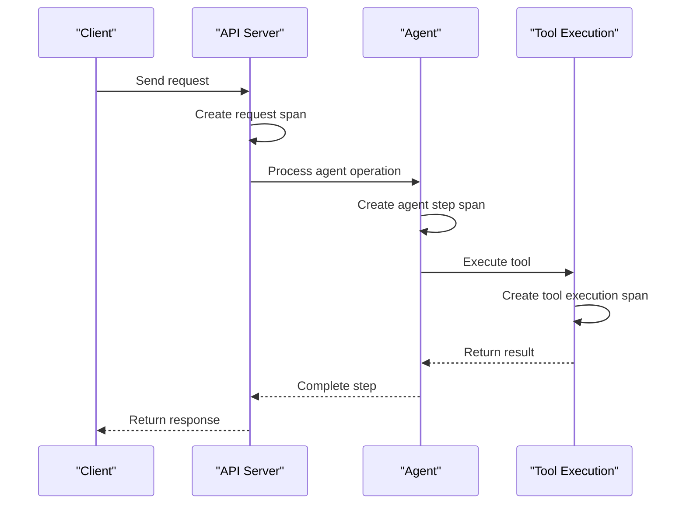
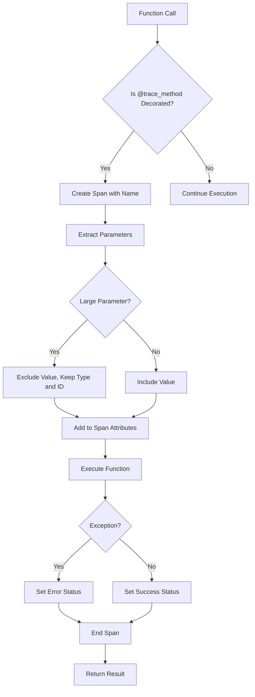

# Tracing System

<cite>
**Referenced Files in This Document**   
- [tracing.py](file://letta/otel/tracing.py)
- [context.py](file://letta/otel/context.py)
- [utils.py](file://letta/utils.py)
- [letta_agent_v2.py](file://letta/agents/letta_agent_v2.py)
- [letta_llm_request_adapter.py](file://letta/adapters/letta_llm_request_adapter.py)
- [settings.py](file://letta/settings.py)
</cite>

## Table of Contents
1. [Introduction](#introduction)
2. [Tracing Implementation with OpenTelemetry](#tracing-implementation-with-opentelemetry)
3. [Span Creation and Management in Agent Operations](#span-creation-and-management-in-agent-operations)
4. [Context Propagation Across Asynchronous Operations](#context-propagation-across-asynchronous-operations)
5. [Span Decorators and Attributes](#span-decorators-and-attributes)
6. [Error Annotation Practices](#error-annotation-practices)
7. [Integration with Context Management](#integration-with-context-management)
8. [Common Issues and Solutions](#common-issues-and-solutions)
9. [Performance Considerations](#performance-considerations)
10. [Conclusion](#conclusion)

## Introduction
The Tracing System in Letta provides comprehensive distributed tracing capabilities using OpenTelemetry's tracing SDK. This system enables detailed monitoring and debugging of agent operations across the platform, capturing the complete lifecycle of requests as they flow through various components. The implementation focuses on maintaining trace continuity during asynchronous agent loops and tool executions, providing visibility into complex distributed workflows. By leveraging OpenTelemetry, Letta achieves standardized tracing that can integrate with various observability backends, allowing developers and operators to analyze performance, diagnose issues, and optimize agent behavior.

## Tracing Implementation with OpenTelemetry
Letta's tracing system is built on OpenTelemetry, providing a robust foundation for distributed tracing across the application. The implementation in `tracing.py` establishes a comprehensive tracing infrastructure that captures both HTTP requests and internal function calls. The system initializes tracing through the `setup_tracing` function, which configures the tracer provider, span processor, and OTLP exporter to send trace data to a configured endpoint. 

The tracing system instruments various components including HTTP requests, database operations, and external API calls. For HTTP requests, middleware functions like `_trace_request_middleware` and `_update_trace_attributes` capture request details, response status, and relevant headers. Database operations are instrumented through SQLAlchemy instrumentation, capturing SQL queries and execution details. External HTTP calls are automatically traced through the RequestsInstrumentor.

The system is designed to be environment-aware, with conditional initialization based on whether the application is running in a pytest environment. This prevents interference with unit tests while ensuring full tracing capabilities in production and development environments. The tracing configuration supports various endpoints and can be customized for different deployment scenarios.

**Section sources**
- [tracing.py](file://letta/otel/tracing.py#L1-L208)

## Span Creation and Management in Agent Operations
The tracing system creates and manages spans throughout agent operations, providing detailed visibility into the execution flow. Spans are created at multiple levels, from high-level HTTP requests down to individual function calls within agent logic. The `trace_method` decorator is the primary mechanism for creating spans around functions, automatically generating span names based on the class and method being executed.

In agent operations, spans are created for key phases of execution such as step processing, message handling, and tool execution. For example, in the `letta_agent_v2.py` file, the `_step_checkpoint_start` method creates a span for each agent step, capturing the step ID and start time. This allows for precise measurement of step execution duration and identification of performance bottlenecks.

The system manages span lifecycle by automatically setting span status based on operation success or failure. Successful operations are marked with `StatusCode.OK`, while exceptions trigger `StatusCode.ERROR` status. The tracing system also handles special cases like `asyncio.CancelledError`, capturing detailed information about task cancellation including the task name, function details, and cancellation timestamp.

**Diagram sources**
- [tracing.py](file://letta/otel/tracing.py#L210-L417)
- [letta_agent_v2.py](file://letta/agents/letta_agent_v2.py#L797-L818)

## Context Propagation Across Asynchronous Operations
Letta's tracing system maintains trace continuity across asynchronous agent loops and tool executions through effective context propagation. The system uses OpenTelemetry's context management to ensure that trace context is preserved across async/await boundaries and thread boundaries. This is critical for maintaining the integrity of distributed traces as control flows between different components and execution contexts.

The `context.py` module implements a context variable `request_attributes` that stores request-specific attributes across the execution context. This allows attributes to be set at one point in the execution flow and accessed later, even across asynchronous operations. The `set_ctx_attributes`, `add_ctx_attribute`, and `get_ctx_attributes` functions provide a clean API for managing this context.

During asynchronous operations, the tracing system ensures that the current span context is properly propagated. When creating background tasks with functions like `safe_create_task` in `utils.py`, the system captures the current trace context and ensures it's available within the task execution. This prevents the loss of trace context that could occur when tasks are executed independently of the main request flow.

The system also handles context propagation in background jobs and scheduled tasks. When jobs are executed outside the normal request-response cycle, the tracing system attempts to restore or create appropriate trace context to maintain visibility into these operations. This ensures that even background processing is properly traced and can be correlated with user-initiated actions.

**Section sources**
- [context.py](file://letta/otel/context.py#L1-L26)
- [utils.py](file://letta/utils.py#L1132-L1209)

## Span Decorators and Attributes
The tracing system provides several decorators and utility functions for adding spans and attributes to operations. The primary decorator is `@trace_method`, which automatically creates spans around functions and methods. This decorator handles both synchronous and asynchronous functions, making it versatile for different use cases within the application.

The `trace_method` decorator includes sophisticated parameter handling to prevent span attribute bloat. It excludes large parameters like `agent_state`, `messages`, and `content` from span attributes while still indicating their presence. For these excluded parameters, the system captures identifying information such as IDs when available, providing observability without excessive data volume.

Span attributes are used extensively to provide context about operations. HTTP requests include attributes for method, URL, status code, and relevant headers. Agent operations include attributes for agent ID, run ID, and step ID. The system also adds attributes for key parameters, respecting size limits to prevent performance issues.

Additional utility functions complement the decorators:
- `log_attributes`: Adds multiple attributes to the current span
- `log_event`: Records events within a span with timestamps
- `get_trace_id`: Retrieves the current trace ID for correlation

These functions allow for flexible tracing patterns beyond simple method decoration, enabling developers to add tracing at strategic points in the code.

**Diagram sources**
- [tracing.py](file://letta/otel/tracing.py#L210-L417)

## Error Annotation Practices
The tracing system implements comprehensive error annotation practices to provide detailed information about failures. When exceptions occur, the system captures not only the exception type and message but also contextual information that aids in debugging. The `_trace_error_handler` function serves as a central error handler that records exceptions in the current span before returning an appropriate response.

For specific exception types like `asyncio.CancelledError`, the system captures additional diagnostic information. This includes the task name, function details, and cancellation timestamp, which helps distinguish between expected cancellations (like stream terminations) and unexpected ones. The system also logs detailed information to the application logs while recording the exception in the span.

The error annotation system handles serialization failures gracefully. When objects cannot be serialized for inclusion in span attributes, the system captures a descriptive message indicating the serialization failure rather than allowing the tracing system itself to fail. This ensures that tracing remains robust even when dealing with problematic data.

Error spans are marked with `StatusCode.ERROR` and include the exception details as attributes. This allows observability tools to filter and analyze errors effectively. The system also preserves the original exception to ensure that error handling behavior is not altered by the tracing implementation.

**Section sources**
- [tracing.py](file://letta/otel/tracing.py#L109-L124)
- [tracing.py](file://letta/otel/tracing.py#L383-L403)

## Integration with Context Management
The tracing system integrates closely with Letta's context management system to maintain trace state across threads and async tasks. The `context.py` module provides a thread-local storage mechanism using Python's `ContextVar` to store request attributes. This ensures that context is properly isolated between concurrent requests while remaining accessible throughout the request lifecycle.

The integration allows attributes to be set at one point in the execution flow and accessed later, even across asynchronous operations. Functions like `set_ctx_attributes` and `add_ctx_attribute` modify the current context, while `get_ctx_attributes` retrieves all stored attributes. This pattern enables components to contribute to the tracing context without requiring explicit parameter passing.

The system also integrates with FastAPI's dependency injection system. The `_update_trace_attributes` function is registered as a dependency for v1 routes, allowing it to add route-specific information to spans after the request has been processed. This ensures that span names reflect the actual route pattern rather than just the URL path.

Background tasks created with `safe_create_task` in `utils.py` automatically log the current background task count to the trace, providing visibility into the system's asynchronous workload. This integration helps correlate background processing with the originating request, even when tasks execute independently.

**Section sources**
- [context.py](file://letta/otel/context.py#L1-L26)
- [tracing.py](file://letta/otel/tracing.py#L60-L107)
- [utils.py](file://letta/utils.py#L1132-L1209)

## Common Issues and Solutions
The tracing system addresses several common issues that arise in distributed tracing implementations. One primary concern is the loss of spans in background jobs, which is mitigated through careful context propagation and the use of `safe_create_task` to ensure trace context is preserved when creating background tasks.

Another common issue is trace context preservation across asynchronous boundaries. The system handles this by leveraging OpenTelemetry's async context management, ensuring that the current span context is properly propagated across await points. This prevents the creation of disconnected trace segments that would make analysis difficult.

The system also addresses performance concerns related to tracing overhead. By excluding large parameters from span attributes and implementing size limits, the system prevents memory bloat and excessive network traffic. The parameter exclusion list specifically targets known large objects like `agent_state`, `messages`, and `content`, while still preserving identifying information.

Serialization failures are handled gracefully to prevent the tracing system from failing when encountering problematic objects. Instead of allowing serialization errors to propagate, the system captures descriptive messages about the failure, ensuring that tracing remains operational even with difficult data types.

Configuration issues are addressed through environment-specific initialization. The system checks for pytest environments and disables tracing during tests to prevent interference. Production configurations are managed through settings that can be overridden via environment variables, providing flexibility for different deployment scenarios.

**Section sources**
- [tracing.py](file://letta/otel/tracing.py#L234-L352)
- [tracing.py](file://letta/otel/tracing.py#L357-L369)
- [utils.py](file://letta/utils.py#L1132-L1209)

## Performance Considerations
When enabling verbose tracing for high-throughput agent systems, several performance considerations must be addressed. The primary concern is the overhead of creating and exporting spans, which can impact system throughput and latency. Letta's tracing system implements several optimizations to minimize this overhead.

The system uses a `BatchSpanProcessor` to batch spans before exporting, reducing the frequency of network calls to the collector. This balances the need for timely trace data with the performance cost of frequent exports. The batching configuration can be tuned based on the specific performance requirements of the deployment.

To prevent excessive data volume, the system implements intelligent parameter handling. Large parameters are excluded from span attributes by default, with a comprehensive list of excluded parameter names including `agent_state`, `messages`, `content`, and `embeddings`. For non-excluded large parameters, the system applies truncation with a 2MB limit, ensuring that no single parameter dominates the span size.

The total size of span attributes is capped at 4MB, with early termination if this limit is approached. This prevents memory exhaustion scenarios that could occur with extremely large inputs. The system also handles serialization failures gracefully, preventing exceptions during attribute processing from impacting the main application flow.

For high-throughput scenarios, certain endpoints can be excluded from tracing through the `_excluded_v1_endpoints_regex` configuration. This allows performance-critical endpoints to operate with minimal overhead while maintaining comprehensive tracing for more complex operations.

The system also provides configuration options to control tracing granularity. Features like SQLAlchemy tracing can be enabled or disabled based on the `sqlalchemy_tracing` setting, allowing operators to balance observability needs with performance requirements.

**Section sources**
- [tracing.py](file://letta/otel/tracing.py#L234-L352)
- [tracing.py](file://letta/otel/tracing.py#L353-L369)
- [settings.py](file://letta/settings.py#L1-L200)

## Conclusion
The Tracing System in Letta provides a comprehensive solution for distributed tracing using OpenTelemetry. By implementing robust span creation, context propagation, and error annotation, the system delivers valuable observability into agent operations and system behavior. The integration with context management ensures trace continuity across asynchronous operations, while thoughtful performance optimizations prevent tracing overhead from impacting system throughput. The system effectively balances detailed observability with operational efficiency, making it suitable for both development debugging and production monitoring of high-throughput agent systems.